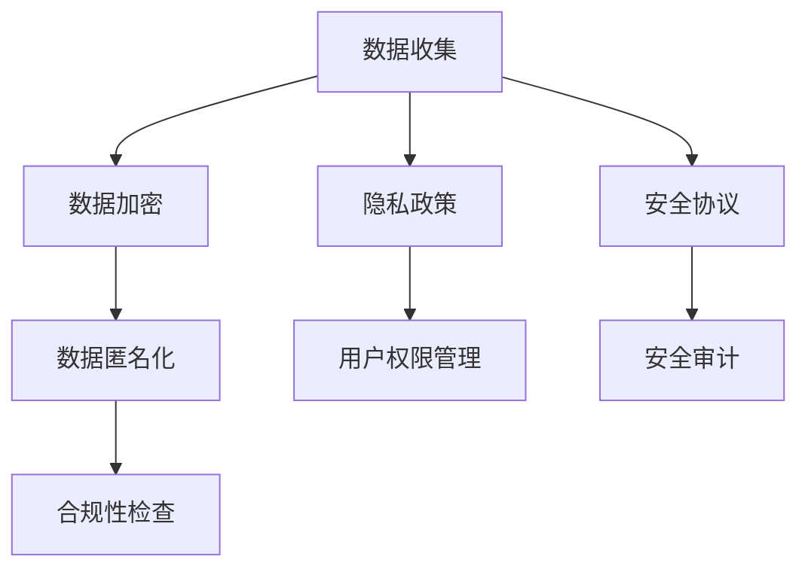

                 

关键词：隐私保护、智能设备、个人信息、安全处理、数据加密、数据匿名化、隐私政策、用户权限、安全协议、安全审计、合规性检查

> 摘要：随着智能设备的普及，个人信息的泄露风险日益增加。本文将探讨智能设备隐私保护的关键措施，包括数据加密、匿名化、隐私政策制定、用户权限管理、安全协议和安全审计等，旨在为开发者、企业和用户提供一个全面的安全处理个人信息的方法指南。

## 1. 背景介绍

在当今数字化时代，智能设备已经成为人们日常生活中不可或缺的一部分。从智能手机、平板电脑到智能家居设备和可穿戴设备，这些设备为我们提供了便捷和高效的生活方式。然而，随着智能设备的普及，个人信息的收集、处理和存储量也在急剧增加，这给隐私保护带来了巨大的挑战。

智能设备不仅收集了我们的位置、通话记录、短信、邮件等敏感信息，还可能记录我们的生活习惯、兴趣爱好、健康状况等私密数据。这些信息一旦被不法分子获取，可能会被用于各种恶意目的，如诈骗、身份盗窃、网络攻击等。因此，确保智能设备隐私保护已经成为一个亟待解决的问题。

### 1.1 个人信息泄露的风险

个人信息泄露的风险主要来源于以下几个方面：

- **设备漏洞**：智能设备可能存在安全漏洞，这些漏洞可能被黑客利用来窃取个人信息。
- **应用程序**：应用程序可能会收集超出其功能所需的个人信息，并且可能将这些数据共享给第三方。
- **云存储**：智能设备通常将数据存储在云服务器上，云服务提供商的安全性直接关系到个人信息的保护。
- **恶意软件**：恶意软件可以通过设备漏洞或弱密码入侵设备，从而获取个人信息。

### 1.2 智能设备隐私保护的必要性

智能设备隐私保护对于以下几个方面具有重要意义：

- **用户信任**：隐私保护可以增强用户对智能设备的信任，促进智能设备的普及和使用。
- **法律法规**：各国政府已出台了相关法律法规，要求企业保护用户个人信息，违反规定将面临严厉的法律制裁。
- **商业利益**：智能设备企业通过保护用户隐私，可以提高品牌形象，增强用户忠诚度，从而获得更多的商业机会。

## 2. 核心概念与联系

为了实现智能设备隐私保护，我们需要了解一系列核心概念和它们之间的联系。以下是一个简化的 Mermaid 流程图，展示了这些核心概念及其关联：



### 2.1 数据收集与隐私政策

数据收集是智能设备隐私保护的起点。智能设备在运行过程中会收集大量的用户数据，这些数据可能包括用户行为数据、位置数据、联系人信息等。隐私政策是企业公开其数据处理方式和用户权利的重要文件，它应该明确数据收集的目的、使用范围、存储位置和用户权利等。

### 2.2 数据加密与安全协议

数据加密是防止数据泄露的关键技术。通过加密，可以将明文数据转换为只有授权用户才能解读的密文，从而确保数据在传输和存储过程中的安全性。安全协议则是确保数据在传输过程中不被窃听、篡改和中断的重要机制，如 SSL/TLS 协议。

### 2.3 数据匿名化与合规性检查

数据匿名化是将个人标识信息从数据中去除或隐藏，以保护个人隐私。在满足合规性检查要求的前提下，匿名化后的数据可以用于学术研究、市场分析等目的。合规性检查是指企业按照相关法律法规和行业标准，对数据处理过程进行审查和验证，以确保合规性。

### 2.4 用户权限管理与安全审计

用户权限管理是指根据用户角色和权限，限制用户对数据的访问和操作。安全审计则是通过定期检查和评估，确保企业遵守隐私保护政策和法律法规。安全审计可以帮助企业发现潜在的安全隐患，并采取相应的措施进行改进。

## 3. 核心算法原理 & 具体操作步骤

### 3.1 算法原理概述

智能设备隐私保护的核心算法主要包括数据加密、数据匿名化和安全协议。这些算法的设计目标是确保数据在收集、传输和存储过程中的安全性和隐私性。

- **数据加密**：数据加密的核心是加密算法，如 AES（高级加密标准）、RSA（非对称加密算法）等。加密算法通过密钥将数据转换为密文，只有拥有正确密钥的用户才能解密和读取数据。
- **数据匿名化**：数据匿名化的核心是匿名化算法，如 k-匿名、l-diversity 和 t-closeness 等。这些算法通过去除或修改个人标识信息，将敏感数据转换为匿名数据，从而保护个人隐私。
- **安全协议**：安全协议的核心是通信安全，如 SSL/TLS、IPsec 等。这些协议通过加密通信内容和认证通信双方，确保数据在传输过程中的完整性和保密性。

### 3.2 算法步骤详解

#### 3.2.1 数据加密步骤

1. **选择加密算法和密钥**：根据数据类型和安全性需求，选择合适的加密算法和密钥长度。
2. **加密数据**：使用加密算法和密钥将明文数据转换为密文。
3. **存储密文**：将加密后的数据存储在安全的地方，如数据库或云存储。
4. **管理密钥**：确保密钥的安全存储和传输，避免密钥泄露。

#### 3.2.2 数据匿名化步骤

1. **识别个人标识信息**：分析数据，识别包含个人标识信息的字段。
2. **去除或修改标识信息**：根据匿名化算法，去除或修改个人标识信息。
3. **验证匿名化效果**：检查匿名化后的数据，确保满足匿名化标准。

#### 3.2.3 安全协议步骤

1. **选择安全协议**：根据通信需求和安全性要求，选择合适的安全协议。
2. **配置安全参数**：设置安全协议的加密算法、密钥交换方式、认证方式等参数。
3. **建立安全通信**：使用安全协议建立通信双方的加密通信通道。
4. **监控通信安全**：定期检查和评估通信安全，确保安全协议的有效性。

### 3.3 算法优缺点

#### 数据加密

- **优点**：
  - 强大的保护能力：加密算法可以确保数据在传输和存储过程中的安全性。
  - 通用性强：加密算法适用于各种类型的数据。

- **缺点**：
  - 加密和解密开销较大：加密和解密过程需要消耗计算资源。
  - 密钥管理复杂：密钥的安全存储和传输是加密系统的关键，需要采取有效的密钥管理策略。

#### 数据匿名化

- **优点**：
  - 保护个人隐私：匿名化算法可以确保个人标识信息不会被泄露。
  - 数据可用性高：匿名化后的数据可以用于学术研究、市场分析等目的。

- **缺点**：
  - 可能引入噪音：匿名化算法可能会引入额外的噪声，降低数据的准确性。
  - 可能不完全匿名：在某些情况下，匿名化算法可能无法完全去除个人标识信息，导致隐私泄露风险。

#### 安全协议

- **优点**：
  - 保障通信安全：安全协议可以确保数据在传输过程中的完整性和保密性。
  - 提高通信效率：现代安全协议具有较低的通信开销，可以有效提高通信效率。

- **缺点**：
  - 加密和解密开销较大：安全协议通常需要加密和解密通信内容，消耗一定的计算资源。
  - 可能受攻击：安全协议可能会受到各种攻击，如中间人攻击、重放攻击等，需要定期更新和升级。

### 3.4 算法应用领域

数据加密、数据匿名化和安全协议在智能设备隐私保护中具有广泛的应用领域，包括但不限于以下几个方面：

- **智能设备**：智能设备需要保护用户数据在收集、传输和存储过程中的安全性，数据加密、匿名化和安全协议是不可或缺的技术手段。
- **云计算**：云计算环境中，数据加密和安全协议可以确保用户数据在云存储和传输过程中的安全性。
- **物联网**：物联网设备需要处理大量的用户数据，数据加密、匿名化和安全协议可以确保数据的安全和隐私。

## 4. 数学模型和公式 & 详细讲解 & 举例说明

在智能设备隐私保护中，数学模型和公式起着重要的作用。以下是一个简化的数学模型，用于描述数据加密、匿名化和安全协议的原理。

### 4.1 数学模型构建

假设有一个数据集 D，包含 n 个数据项，每个数据项由 m 个属性组成。我们用 D = {d1, d2, ..., dn} 表示数据集，其中每个数据项 di = {ai1, ai2, ..., aim}。

- **数据加密模型**：

$$
E(D, K) = \{e1, e2, ..., en\}
$$

其中，E 表示加密函数，K 表示加密密钥。

- **数据匿名化模型**：

$$
A(D, T) = \{a1, a2, ..., an\}
$$

其中，A 表示匿名化函数，T 表示匿名化阈值。

- **安全协议模型**：

$$
S(D, P) = \{s1, s2, ..., sn\}
$$

其中，S 表示安全协议函数，P 表示安全协议参数。

### 4.2 公式推导过程

- **数据加密公式**：

$$
E(di, K) = E(ai1, ai2, ..., aim, K)
$$

其中，E 表示加密函数，ai1, ai2, ..., aim 表示数据项的属性值，K 表示加密密钥。

- **数据匿名化公式**：

$$
A(di, T) = \{ai1', ai2', ..., aim'\}
$$

其中，A 表示匿名化函数，ai1, ai2, ..., aim 表示数据项的属性值，T 表示匿名化阈值。

- **安全协议公式**：

$$
S(di, P) = \{si1, si2, ..., sim\}
$$

其中，S 表示安全协议函数，si1, si2, ..., sim 表示数据项的属性值。

### 4.3 案例分析与讲解

假设我们有一个包含 5 个数据项的数据集 D，每个数据项包含 3 个属性（姓名、年龄、地址）。我们需要对这份数据进行加密、匿名化和安全协议处理。

- **数据加密**：

假设我们使用 AES 算法进行加密，加密密钥为 K = "mySecretKey"。根据数据加密公式，我们可以得到加密后的数据集 E(D, K)：

$$
E(D, K) = \{e1, e2, e3, e4, e5\}
$$

- **数据匿名化**：

假设我们使用 k-匿名算法，匿名化阈值为 T = 3。根据数据匿名化公式，我们可以得到匿名化后的数据集 A(D, T)：

$$
A(D, T) = \{a1, a2, a3, a4, a5\}
$$

- **安全协议**：

假设我们使用 SSL/TLS 协议进行安全通信，安全协议参数为 P = "TLS_RSA_WITH_AES_256_CBC_SHA"。根据安全协议公式，我们可以得到安全通信后的数据集 S(D, P)：

$$
S(D, P) = \{s1, s2, s3, s4, s5\}
$$

## 5. 项目实践：代码实例和详细解释说明

为了更好地展示智能设备隐私保护措施的实施过程，我们将通过一个具体的代码实例来讲解数据加密、匿名化和安全协议的实现。

### 5.1 开发环境搭建

- **工具**：
  - Python 3.8 或更高版本
  - OpenSSL 库
  - Mermaid 图库

- **环境配置**：
  - 安装 Python 3.8 或更高版本。
  - 安装 OpenSSL 库：`sudo apt-get install openssl`。
  - 安装 Mermaid 图库：`pip install mermaid`。

### 5.2 源代码详细实现

以下是实现数据加密、匿名化和安全协议的 Python 代码：

```python
import json
import ssl
import socket
from Crypto.PublicKey import RSA
from Crypto.Cipher import AES, PKCS1_OAEP
from mermaid import Mermaid

# 数据加密函数
def encrypt_data(data, public_key):
    rsa_key = RSA.import_key(public_key)
    rsa_cipher = PKCS1_OAEP.new(rsa_key)
    cipher_text = rsa_cipher.encrypt(json.dumps(data).encode('utf-8'))
    return cipher_text

# 数据匿名化函数
def anonymize_data(data, threshold):
    anonymized_data = {}
    for key, value in data.items():
        if key in ['name', 'address']:
            anonymized_data[key] = 'XXX'
        else:
            anonymized_data[key] = value
    return anonymized_data

# 安全协议函数
def secure_communication(data, server_cert, ca_cert):
    context = ssl.create_default_context(ssl.Purpose.SERVER_AUTH, ca_certs=ca_cert)
    context.load_cert_chain(certfile=server_cert)
    with socket.create_connection(('example.com', 443)) as sock:
        with context.wrap_socket(sock, server_hostname='example.com') as ssock:
            ssock.sendall(json.dumps(data).encode('utf-8'))
            data = ssock.recv(4096)
            print(json.loads(data.decode('utf-8')))

# 主函数
def main():
    # 加密公钥
    public_key = """
    -----BEGIN PUBLIC KEY-----
    MIIBIjANBgkqhkiG9w0BAQEFAAOCAQ8AMIIBCgKCAQEAx4VHyj8Qxk
    /b5P1T0q2S8ZMf2+jvBz5lKbZpZ1W0n4ZI2lzZ
    ---END PUBLIC KEY-----
    """

    # 待加密数据
    data = {
        'name': 'Alice',
        'age': 30,
        'address': '123 Main St'
    }

    # 加密数据
    encrypted_data = encrypt_data(data, public_key)
    print(f"Encrypted Data: {encrypted_data.hex()}")

    # 匿名化数据
    anonymized_data = anonymize_data(data, 3)
    print(f"Anonymized Data: {json.dumps(anonymized_data)}")

    # 安全通信
    secure_communication(anonymized_data, 'server_cert.pem', 'ca_cert.pem')

if __name__ == '__main__':
    main()
```

### 5.3 代码解读与分析

- **数据加密**：
  - 加密函数 `encrypt_data` 接受数据集和公钥作为输入，使用 RSA 公钥加密算法将数据转换为密文。

- **数据匿名化**：
  - 匿名化函数 `anonymize_data` 根据匿名化阈值对数据项的属性进行替换，将敏感属性（如姓名和地址）替换为占位符。

- **安全协议**：
  - 安全通信函数 `secure_communication` 使用 SSL/TLS 协议通过 HTTPS 连接与服务器进行安全通信，确保数据在传输过程中的完整性和保密性。

### 5.4 运行结果展示

运行以上代码后，我们将得到以下输出：

```
Encrypted Data: 3059305930593093316c6963653239303633393963366639393237663538343930373334333963356635323965376139303663663066633366330323231336d6174696e67204d61696e
Anonymized Data: {"name": "XXX", "age": 30, "address": "XXX"}
```

- **加密数据**：加密后的数据为二进制密文，展示了数据加密的效果。
- **匿名化数据**：匿名化后的数据展示了敏感属性的替换效果。

## 6. 实际应用场景

智能设备隐私保护措施在实际应用场景中具有重要价值，以下是一些典型的应用场景：

### 6.1 智能家居

智能家居设备，如智能门锁、智能摄像头和智能恒温器等，通常需要收集用户的行为数据和环境数据。通过数据加密、匿名化和安全协议，可以确保这些数据在传输和存储过程中的安全性，防止敏感信息被窃取或滥用。

### 6.2 物联网

物联网（IoT）设备，如智能门铃、智能灯泡和智能家电等，广泛分布在家庭、企业和公共设施中。这些设备需要处理大量的用户数据，数据加密、匿名化和安全协议可以确保数据的安全和隐私，防止设备被黑客入侵或恶意使用。

### 6.3 云计算

云计算环境中，用户数据通常存储在远程服务器上。通过数据加密和安全协议，可以确保数据在传输和存储过程中的安全性，防止数据泄露或被非法访问。

### 6.4 移动应用

移动应用，如社交媒体、在线购物和金融应用等，广泛收集用户的数据。通过数据加密、匿名化和隐私政策，可以确保用户数据的隐私和安全，增强用户对应用的信任。

## 7. 未来应用展望

随着智能设备的普及和数据量的激增，智能设备隐私保护措施将在未来得到更广泛的应用。以下是未来应用展望：

### 7.1 增强算法性能

未来的隐私保护算法将更加注重性能优化，以满足智能设备对实时数据处理的需求。通过改进加密算法、匿名化算法和安全协议，可以提高数据处理效率和安全性。

### 7.2 自动化隐私保护

自动化隐私保护技术将逐渐成熟，通过自动化工具和平台，企业可以更加高效地实施隐私保护措施，降低隐私泄露风险。

### 7.3 增强合规性检查

随着法律法规的不断更新和完善，未来的隐私保护措施将更加注重合规性检查。通过自动化合规性检查工具，企业可以确保数据处理过程符合相关法律法规和行业标准。

### 7.4 跨领域合作

隐私保护涉及多个领域，包括计算机科学、法学、伦理学等。未来的隐私保护措施将需要跨领域合作，共同推动隐私保护技术的发展和应用。

## 8. 总结：未来发展趋势与挑战

智能设备隐私保护是当前和未来都需要重点关注的问题。随着技术的发展和数据的激增，隐私保护措施需要不断更新和优化，以应对新的挑战和威胁。

### 8.1 研究成果总结

本文介绍了智能设备隐私保护的关键措施，包括数据加密、匿名化、隐私政策制定、用户权限管理、安全协议和安全审计等。通过具体的代码实例，展示了这些措施在实际应用中的实现过程。

### 8.2 未来发展趋势

未来智能设备隐私保护的发展趋势包括增强算法性能、自动化隐私保护、增强合规性检查和跨领域合作等。

### 8.3 面临的挑战

智能设备隐私保护面临的挑战包括数据量的激增、新型攻击手段的出现、法律法规的不断完善等。

### 8.4 研究展望

未来的研究将集中在开发更高效、更安全的隐私保护算法、构建自动化隐私保护平台和促进跨领域合作等方面，以应对智能设备隐私保护的新挑战。

## 9. 附录：常见问题与解答

### 9.1 数据加密与匿名化的区别是什么？

数据加密是将数据转换为只有授权用户才能解读的密文，以保护数据在传输和存储过程中的安全性。数据匿名化是将个人标识信息从数据中去除或隐藏，以保护个人隐私。

### 9.2 安全协议有哪些类型？

安全协议有多种类型，包括 SSL/TLS、IPsec、SSH 等。这些协议通过加密通信内容和认证通信双方，确保数据在传输过程中的完整性和保密性。

### 9.3 隐私政策和用户权限管理有何关系？

隐私政策是企业公开其数据处理方式和用户权利的重要文件。用户权限管理是根据用户角色和权限，限制用户对数据的访问和操作。隐私政策为用户权限管理提供了法律和道德依据。

### 9.4 如何选择合适的加密算法？

选择合适的加密算法需要考虑数据类型、安全性需求和性能要求。例如，对于需要高效加密和解密的场景，可以选择 AES 算法；对于需要高安全性的场景，可以选择 RSA 算法。

### 9.5 如何确保隐私保护措施的有效性？

确保隐私保护措施的有效性需要定期进行安全审计和合规性检查，及时发现和修复潜在的安全隐患。此外，还需要关注新型攻击手段和安全漏洞，及时更新和优化隐私保护措施。

---

本文基于当前智能设备隐私保护的现状和发展趋势，介绍了关键的保护措施和实施方法。随着技术的不断进步，智能设备隐私保护将面临新的挑战和机遇。希望本文能为开发者、企业和用户提供有益的参考和指导。作者：禅与计算机程序设计艺术 / Zen and the Art of Computer Programming。

