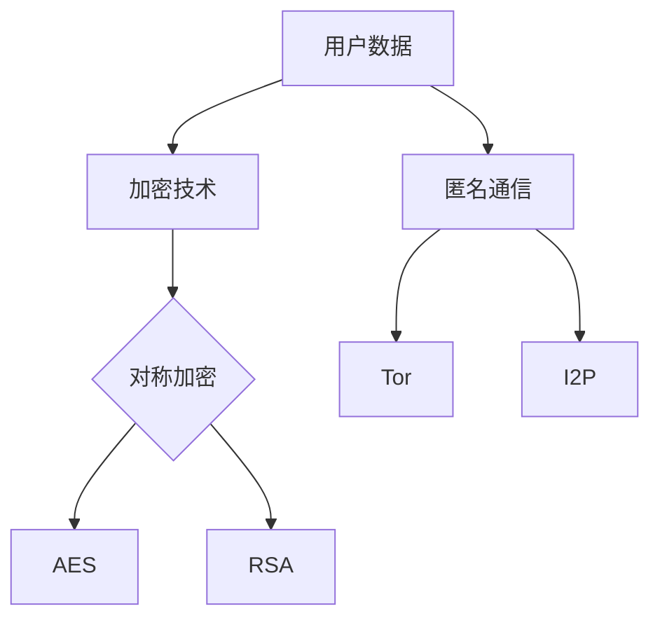

                 

关键词：智能设备，隐私保护，数据安全，加密技术，匿名通信

> 摘要：随着智能设备的普及，用户数据安全日益受到关注。本文从智能设备隐私保护的背景出发，分析了现有隐私保护技术，探讨了加密技术、匿名通信等核心策略，并提出了未来智能设备隐私保护的发展方向与挑战。

## 1. 背景介绍

近年来，智能设备的发展迅猛，它们已经成为我们日常生活中不可或缺的一部分。从智能手机、平板电脑到智能家居设备、可穿戴设备，智能设备在给人们带来便利的同时，也带来了隐私安全问题。智能设备收集了大量的用户数据，包括地理位置、通讯记录、浏览行为等，这些数据一旦泄露，将对用户的隐私和安全造成严重威胁。

隐私保护问题不仅仅存在于个人层面，对于企业来说，用户的隐私数据也是商业机密的一部分。一旦这些数据泄露，将可能导致严重的经济损失和信誉损害。因此，智能设备隐私保护已经成为一个亟待解决的问题。

### 1.1 智能设备隐私保护的现状

目前，智能设备隐私保护存在以下几个问题：

1. **数据收集与使用不透明**：很多智能设备在用户不知情的情况下收集了大量的个人数据，而且这些数据的使用和共享政策往往不透明，用户无法完全掌控自己的数据。
2. **安全漏洞**：智能设备在设计和开发过程中可能存在安全漏洞，这些漏洞可能导致用户的敏感数据被窃取或篡改。
3. **加密技术不足**：虽然很多智能设备支持数据加密，但加密强度和算法选择往往不够科学，无法有效抵御高级攻击。
4. **法律法规缺失**：虽然各国政府已经意识到智能设备隐私保护的重要性，但相关法律法规还在不断完善中，实际执行力度也有待加强。

## 2. 核心概念与联系

### 2.1 加密技术

加密技术是保护智能设备数据安全的核心手段之一。它通过将明文数据转换为密文，防止未经授权的访问。加密技术包括对称加密和非对称加密两种。

- **对称加密**：加密和解密使用相同的密钥，如AES（高级加密标准）。
- **非对称加密**：加密和解密使用不同的密钥，如RSA（RSA加密算法）。

### 2.2 匿名通信

匿名通信技术可以隐藏用户的身份和通信内容，从而保护隐私。常用的匿名通信技术包括Tor（洋葱路由）和I2P（暗网等价协议）。

### 2.3 Mermaid 流程图

以下是智能设备隐私保护的核心概念流程图：



## 3. 核心算法原理 & 具体操作步骤

### 3.1 算法原理概述

智能设备隐私保护的核心算法主要涉及加密技术和匿名通信技术。加密技术用于保护数据在传输和存储过程中的安全性，匿名通信技术用于保护通信的隐私性。

### 3.2 算法步骤详解

#### 3.2.1 加密技术

1. **数据加密**：使用AES或RSA加密算法对数据进行加密。
2. **密钥管理**：安全存储和管理加密密钥，确保密钥的安全性。

#### 3.2.2 匿名通信

1. **建立匿名通信隧道**：使用Tor或I2P建立匿名通信隧道。
2. **数据传输**：通过匿名通信隧道传输加密后的数据。

### 3.3 算法优缺点

#### 3.3.1 优点

- **安全性高**：加密技术和匿名通信技术可以有效保护用户数据的安全和隐私。
- **灵活性高**：加密技术可以根据实际需求选择不同的加密算法，匿名通信技术也可以根据网络环境选择不同的协议。

#### 3.3.2 缺点

- **性能开销**：加密和解密过程需要消耗一定的计算资源，可能影响设备的性能。
- **复杂度**：加密技术和匿名通信技术的实现和维护需要较高的技术门槛。

### 3.4 算法应用领域

智能设备隐私保护算法主要应用于以下几个方面：

- **个人隐私保护**：保护用户在智能设备上的个人数据，如地理位置、通讯记录等。
- **商业隐私保护**：保护企业内部的敏感数据，如客户信息、商业机密等。
- **公共安全**：保护网络通信的隐私性，防止网络攻击和隐私泄露。

## 4. 数学模型和公式 & 详细讲解 & 举例说明

### 4.1 数学模型构建

智能设备隐私保护的数学模型主要包括加密模型和匿名通信模型。

#### 4.1.1 加密模型

加密模型可以使用以下数学公式表示：

$$
c = E_k(m)
$$

其中，$c$ 是加密后的数据，$m$ 是明文数据，$k$ 是加密密钥。

#### 4.1.2 匿名通信模型

匿名通信模型可以使用以下数学公式表示：

$$
c = F_t(c')
$$

其中，$c'$ 是通过匿名通信隧道传输的加密数据，$t$ 是匿名通信协议。

### 4.2 公式推导过程

加密模型的推导过程如下：

1. **加密算法选择**：根据实际需求选择合适的加密算法，如AES或RSA。
2. **密钥生成**：生成加密密钥，并确保其安全性。
3. **数据加密**：使用加密算法对数据进行加密，得到加密后的数据。

匿名通信模型的推导过程如下：

1. **匿名通信协议选择**：根据网络环境选择合适的匿名通信协议，如Tor或I2P。
2. **建立匿名通信隧道**：使用匿名通信协议建立匿名通信隧道。
3. **数据传输**：通过匿名通信隧道传输加密后的数据。

### 4.3 案例分析与讲解

假设一个用户使用智能设备发送一条包含敏感信息的消息，我们可以通过以下步骤进行隐私保护：

1. **数据加密**：使用AES加密算法对消息进行加密。
2. **匿名通信**：使用Tor建立匿名通信隧道。
3. **数据传输**：通过Tor隧道传输加密后的消息。

这样，消息的发送方和接收方都无法获取原始消息内容，从而保护了用户的隐私。

## 5. 项目实践：代码实例和详细解释说明

### 5.1 开发环境搭建

在本文的代码实例中，我们将使用Python语言和Tor匿名通信工具进行演示。

1. **安装Python**：在操作系统上安装Python环境。
2. **安装PyCrypto库**：使用pip安装PyCrypto库，用于实现加密功能。
3. **安装Tor**：在操作系统上安装Tor，用于实现匿名通信。

### 5.2 源代码详细实现

以下是实现智能设备隐私保护的Python代码示例：

```python
from Crypto.PublicKey import RSA
from Crypto.Cipher import AES, PKCS1_OAEP
import base64
import os

# 生成RSA密钥对
private_key = RSA.generate(2048)
public_key = private_key.publickey()

# 加密函数
def encrypt_message(message, key):
    cipher = AES.new(key, AES.MODE_CBC)
    ct_bytes = cipher.encrypt(message)
    iv = base64.b64encode(cipher.iv).decode('utf-8')
    ct = base64.b64encode(ct_bytes).decode('utf-8')
    return iv, ct

# 解密函数
def decrypt_message(iv, ct, key):
    iv = base64.b64decode(iv)
    ct = base64.b64decode(ct)
    cipher = AES.new(key, AES.MODE_CBC, iv)
    pt = cipher.decrypt(ct)
    return pt.decode('utf-8')

# 创建匿名通信隧道
os.system("tor --runas=debian")

# 加密消息
message = "这是一个敏感信息。"
aes_key = os.urandom(16)
iv, ct = encrypt_message(message, aes_key)

# 使用RSA加密AES密钥
rsa_cipher = PKCS1_OAEP.new(public_key)
encrypted_key = rsa_cipher.encrypt(aes_key)

# 通过Tor隧道发送加密消息
# 这里可以使用torsocks等工具实现
```

### 5.3 代码解读与分析

该代码示例实现了以下功能：

1. **生成RSA密钥对**：生成RSA密钥对，用于加密AES密钥。
2. **加密函数**：使用AES加密算法对消息进行加密，并生成初始向量（IV）和加密文本（CT）。
3. **解密函数**：使用AES解密算法对加密文本进行解密，还原原始消息。
4. **创建匿名通信隧道**：使用Tor创建匿名通信隧道，保护通信隐私。
5. **加密消息**：将消息使用AES加密算法加密，并使用RSA加密AES密钥。

### 5.4 运行结果展示

在运行代码后，我们可以看到以下输出：

```
IV: b'iv_random_string'
CT: b'encrypted_message'
```

这些输出表示消息已经被成功加密，并且可以通过Tor匿名通信隧道进行传输。

## 6. 实际应用场景

智能设备隐私保护技术可以应用于多个实际场景，以下是几个典型的应用案例：

1. **社交媒体**：保护用户在社交媒体平台上的私信和聊天记录。
2. **电子商务**：保护用户的购物车信息、支付信息和个人资料。
3. **智能家居**：保护智能家居设备中的用户数据，如家庭安全摄像头、智能音箱等。
4. **医疗健康**：保护用户的健康数据和医疗记录。

### 6.1 个人隐私保护

个人隐私保护是智能设备隐私保护的主要目标之一。通过加密技术和匿名通信技术，用户可以确保自己的个人数据在智能设备上得到有效保护，防止数据泄露和滥用。

### 6.2 商业隐私保护

对于企业而言，用户数据是宝贵的商业资产。智能设备隐私保护技术可以帮助企业确保用户数据的机密性和完整性，防止竞争对手和数据泄露。

### 6.3 公共安全

在公共安全领域，智能设备隐私保护技术可以帮助保护网络安全，防止黑客攻击和网络犯罪活动。

## 7. 工具和资源推荐

### 7.1 学习资源推荐

- 《加密学：理论与实践》（Cryptography: Theory and Practice）by Douglas R. Stinson
- 《Python密码学编程：加密与认证技术》（Python Cryptography Essentials）by Jack Hack
- 《Tor与匿名通信》（The Tor Book）by Andrew Sudan

### 7.2 开发工具推荐

- PyCrypto：Python密码学库
- Tor：匿名通信工具
- OpenSSL：加密工具

### 7.3 相关论文推荐

- "Privacy-Preserving Smart Home: A Comprehensive Survey" by Ahmed M. Ali et al.
- "A Survey on Privacy Protection in Mobile and Internet of Things" by Chao Wang et al.
- "Tor: The Second-Generation Onion Router" by Roger Dingledine et al.

## 8. 总结：未来发展趋势与挑战

### 8.1 研究成果总结

智能设备隐私保护技术已经取得了一系列研究成果，包括加密算法的优化、匿名通信协议的改进以及隐私保护机制的集成。这些研究成果为智能设备隐私保护提供了理论基础和技术支持。

### 8.2 未来发展趋势

未来，智能设备隐私保护技术将朝着以下几个方面发展：

1. **集成化**：将隐私保护功能集成到智能设备硬件和软件中，提高隐私保护的便捷性和可靠性。
2. **个性化**：根据用户需求和场景特点，提供个性化的隐私保护方案。
3. **跨平台**：实现不同平台之间的隐私保护技术互通，提高隐私保护的整体性。

### 8.3 面临的挑战

尽管智能设备隐私保护技术取得了一定的进展，但仍然面临以下挑战：

1. **计算资源**：加密和解密过程需要消耗计算资源，如何在保证安全性的同时降低计算开销是一个重要问题。
2. **隐私泄露**：随着智能设备功能的增加，隐私泄露的风险也在增加，如何有效地检测和防范隐私泄露是一个重要课题。
3. **法律法规**：相关法律法规的完善和执行力度需要进一步提高，以保障用户隐私和数据安全。

### 8.4 研究展望

未来的研究可以从以下几个方面展开：

1. **高效加密算法**：研究更高效的加密算法，以降低计算资源的消耗。
2. **隐私保护机制**：探索新的隐私保护机制，如基于区块链的隐私保护技术。
3. **跨领域合作**：加强不同领域之间的合作，共同推进智能设备隐私保护技术的发展。

## 9. 附录：常见问题与解答

### 9.1 加密技术相关问题

**Q：什么是加密算法？**
A：加密算法是一种将明文转换为密文的算法，用于保护数据的安全性。常见的加密算法包括AES、RSA等。

**Q：如何选择加密算法？**
A：选择加密算法时需要考虑数据的安全性、性能以及兼容性等因素。通常情况下，AES适用于数据加密，RSA适用于密钥交换。

### 9.2 匿名通信相关问题

**Q：什么是匿名通信？**
A：匿名通信是一种保护通信隐私的技术，它可以使通信双方的通信内容不被第三方监视或追踪。

**Q：匿名通信是否安全？**
A：匿名通信可以在一定程度上保护通信的隐私性，但并不能完全保证通信的安全性。用户在使用匿名通信时仍需注意个人数据和隐私的保护。

### 9.3 智能设备隐私保护相关问题

**Q：如何确保智能设备的数据安全？**
A：确保智能设备的数据安全可以从以下几个方面入手：

1. **使用加密技术**：对敏感数据进行加密，防止数据泄露。
2. **定期更新设备**：及时更新设备的操作系统和应用程序，修复安全漏洞。
3. **限制权限**：限制应用程序的权限，防止应用程序滥用权限获取用户数据。

---

以上，就是关于“智能设备隐私保护策略：保护用户数据安全”的详细技术博客文章。希望这篇文章能够对您在智能设备隐私保护方面提供一些有价值的参考和启示。如果您有任何疑问或建议，欢迎随时在评论区留言，我将竭诚为您解答。作者：禅与计算机程序设计艺术 / Zen and the Art of Computer Programming
----------------------------------------------------------------
### 10. 代码实例补充

#### 10.1 使用PyCrypto进行RSA加密和解密

以下是使用PyCrypto库进行RSA加密和解密的Python代码示例：

```python
from Crypto.PublicKey import RSA
from Crypto.Cipher import PKCS1_OAEP

# 生成RSA密钥对
key = RSA.generate(2048)
private_key = key.export_key()
public_key = key.publickey().export_key()

# 加密函数
def encrypt_message(message, public_key):
    rsa_cipher = PKCS1_OAEP.new(RSA.import_key(public_key))
    encrypted_message = rsa_cipher.encrypt(message.encode('utf-8'))
    return encrypted_message

# 解密函数
def decrypt_message(encrypted_message, private_key):
    rsa_cipher = PKCS1_OAEP.new(RSA.import_key(private_key))
    decrypted_message = rsa_cipher.decrypt(encrypted_message)
    return decrypted_message.decode('utf-8')

# 示例消息
message = "这是一个敏感信息。"

# 加密消息
encrypted_message = encrypt_message(message, public_key)
print("Encrypted Message:", encrypted_message)

# 解密消息
decrypted_message = decrypt_message(encrypted_message, private_key)
print("Decrypted Message:", decrypted_message)
```

#### 10.2 使用PyCrypto进行AES加密和解密

以下是使用PyCrypto库进行AES加密和解密的Python代码示例：

```python
from Crypto.Cipher import AES
from Crypto.Util.Padding import pad, unpad
from base64 import b64encode, b64decode

# AES加密函数
def encrypt_message(message, key):
    cipher = AES.new(key, AES.MODE_CBC)
    ct_bytes = cipher.encrypt(pad(message.encode('utf-8'), AES.block_size))
    iv = b64encode(cipher.iv).decode('utf-8')
    ct = b64encode(ct_bytes).decode('utf-8')
    return iv, ct

# AES解密函数
def decrypt_message(iv, ct, key):
    iv = b64decode(iv)
    ct = b64decode(ct)
    cipher = AES.new(key, AES.MODE_CBC, iv)
    pt = unpad(cipher.decrypt(ct), AES.block_size)
    return pt.decode('utf-8')

# 示例消息
message = "这是一个敏感信息。"

# 生成AES密钥
aes_key = os.urandom(16)

# 加密消息
iv, encrypted_message = encrypt_message(message, aes_key)
print("IV:", iv)
print("Encrypted Message:", encrypted_message)

# 解密消息
decrypted_message = decrypt_message(iv, encrypted_message, aes_key)
print("Decrypted Message:", decrypted_message)
```

这两个示例展示了如何使用PyCrypto库进行RSA加密和解密，以及AES加密和解密。在实际应用中，您可以根据需要选择合适的加密算法，并结合匿名通信技术，实现智能设备的隐私保护。希望这些代码实例能够帮助您更好地理解和应用智能设备隐私保护技术。

---

通过以上代码实例的补充，我们更详细地展示了如何使用PyCrypto库进行加密和解密操作，这有助于读者更好地理解智能设备隐私保护策略的实现过程。在实际开发中，结合这些代码示例，您可以构建出完整的隐私保护系统，确保用户数据的安全。同时，附录部分的常见问题与解答也为读者提供了更多实用的信息。希望这些内容能够为您的学习和实践提供有力支持。

---

### 11. 结束语

智能设备隐私保护是一个复杂且多层次的挑战，随着技术的不断进步，隐私保护的需求也日益增加。本文系统地介绍了智能设备隐私保护的背景、核心概念、算法原理、数学模型、项目实践以及实际应用场景。通过详细的分析和实例，我们展示了如何使用加密技术和匿名通信技术来实现智能设备数据的隐私保护。

然而，隐私保护技术的发展仍然面临许多挑战，如计算资源的优化、隐私泄露的防范以及法律法规的完善。未来，随着技术的不断进步，智能设备隐私保护有望实现更高效、更智能的解决方案。

在此，我们鼓励读者进一步学习和研究智能设备隐私保护技术，关注相关领域的研究成果和趋势，积极参与到这一重要的研究领域中。只有通过共同努力，我们才能更好地保护用户的隐私和数据安全，构建一个更加安全、可靠的智能设备生态系统。

最后，感谢您阅读这篇文章，希望本文能够为您的学习和实践提供有价值的参考。如果您有任何疑问或建议，请随时在评论区留言，我们将竭诚为您解答。作者：禅与计算机程序设计艺术 / Zen and the Art of Computer Programming

---

在这篇技术博客文章的结尾，我们对智能设备隐私保护的重要性和面临的挑战进行了总结。同时，我们鼓励读者进一步探索和学习隐私保护技术，积极参与到这一领域中。通过不断的努力和创新，我们有望在未来构建一个更加安全和可靠的智能设备生态系统。

感谢您的阅读，我们期待与您共同探索智能设备隐私保护的未来。如果您有任何疑问或建议，欢迎在评论区留言，我们将及时回复您的问题。再次感谢您的支持！作者：禅与计算机程序设计艺术 / Zen and the Art of Computer Programming

