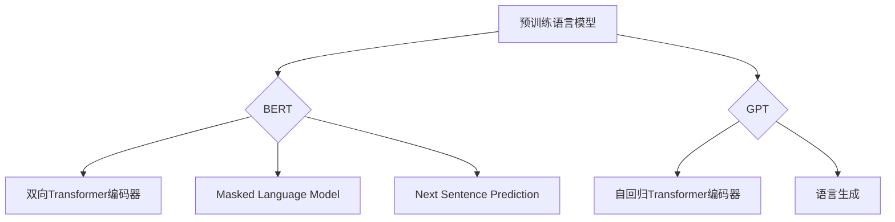

                 

关键词：智能语义理解、自然语言处理、AI大模型、语义分析、语言模型、神经网络、BERT、GPT、预训练模型、跨模态语义理解、智能问答系统、语言生成、文本分类、多语言处理

> 摘要：随着人工智能技术的快速发展，智能语义理解作为自然语言处理（NLP）的关键环节，正逐渐成为技术研究和应用的焦点。本文将探讨AI大模型在自然语言处理中的突破，重点介绍BERT、GPT等模型的工作原理、数学模型、算法流程及其在各个应用领域的实践与未来展望。

## 1. 背景介绍

自然语言处理（NLP）作为人工智能的重要分支，致力于让计算机理解和生成人类语言。从早期的基于规则的方法到如今深度学习模型的广泛应用，NLP经历了巨大的变革。传统的NLP方法依赖于手写的规则和统计模型，而现代的NLP系统则依赖于大规模数据集和深度学习算法。智能语义理解是NLP的核心任务之一，旨在从文本中提取出有意义的语义信息。

传统的NLP方法往往依赖于有限的预定义规则，这限制了它们在复杂文本理解任务中的应用。随着深度学习技术的崛起，神经网络特别是卷积神经网络（CNN）和循环神经网络（RNN）被广泛应用于NLP任务，显著提升了文本处理的准确性和效率。然而，这些模型在处理长文本和复杂语义时仍然存在局限性。

为了解决这些问题，研究人员提出了预训练语言模型，如BERT（Bidirectional Encoder Representations from Transformers）和GPT（Generative Pre-trained Transformer），这些大模型通过在大量无监督数据上进行预训练，再通过有监督的数据进行微调，从而显著提升了NLP任务的性能。

## 2. 核心概念与联系

### 2.1. 预训练语言模型

预训练语言模型（Pre-trained Language Models，PTLM）是一种大规模语言模型，通过在互联网上收集的文本数据中进行无监督学习，建立语言的一般性知识。BERT和GPT是两种主要的预训练语言模型。

### 2.2. BERT模型

BERT（Bidirectional Encoder Representations from Transformers）是一种双向的Transformer模型。它通过在双向Transformer编码器上预训练，学习上下文信息的全局表示。BERT的核心贡献是引入了Masked Language Model（MLM）和Next Sentence Prediction（NSP）两种预训练任务，从而提高了模型对长文本和复杂语义的理解能力。

### 2.3. GPT模型

GPT（Generative Pre-trained Transformer）是一种自回归的Transformer模型。它通过预测下一个词来生成文本，主要应用于语言生成任务。GPT系列模型，如GPT-2和GPT-3，通过不断增加模型规模，不断提升生成文本的连贯性和多样性。

### 2.4. 模型关系

BERT和GPT都是基于Transformer架构的语言模型，但它们的设计目标和应用场景有所不同。BERT侧重于文本理解任务，而GPT则更擅长文本生成任务。然而，这两种模型都可以通过微调应用于各种NLP任务，从而实现通用语言的深度理解。

### 2.5. Mermaid 流程图



## 3. 核心算法原理 & 具体操作步骤

### 3.1. 算法原理概述

BERT和GPT都是基于Transformer的模型，Transformer模型采用自注意力机制（Self-Attention）来处理序列数据，通过多头注意力（Multi-Head Attention）和前馈神经网络（Feedforward Neural Network）来建模序列之间的复杂关系。

### 3.2. 算法步骤详解

#### 3.2.1. BERT模型

BERT模型主要包括以下几个步骤：

1. 输入嵌入（Input Embedding）：将词汇转换为嵌入向量。
2. 位置嵌入（Position Embedding）：为每个词添加位置信息。
3. 句子嵌入（Segment Embedding）：区分句子中的不同部分。
4. Transformer编码器（Transformer Encoder）：通过多层自注意力机制和前馈神经网络来处理文本序列。
5. 输出层（Output Layer）：通过分类器输出文本表示。

#### 3.2.2. GPT模型

GPT模型主要包括以下几个步骤：

1. 输入嵌入（Input Embedding）：将词汇转换为嵌入向量。
2. 位置嵌入（Position Embedding）：为每个词添加位置信息。
3. Transformer编码器（Transformer Encoder）：通过多层自注意力机制和前馈神经网络来处理文本序列。
4. 输出层（Output Layer）：通过softmax层预测下一个词。

### 3.3. 算法优缺点

**优点：**

- **BERT模型：** 双向编码器能够更好地捕捉长距离依赖关系，提高了文本理解能力。
- **GPT模型：** 自回归生成模型能够生成高质量的文本，适用于文本生成任务。

**缺点：**

- **BERT模型：** 预训练过程需要大量计算资源和时间。
- **GPT模型：** 预测下一个词的过程可能导致生成的文本缺乏连贯性。

### 3.4. 算法应用领域

BERT和GPT在自然语言处理的各个领域都有广泛应用：

- **文本分类：** 利用模型对文本进行分类，如新闻分类、情感分析等。
- **命名实体识别：** 利用模型识别文本中的命名实体，如人名、地点等。
- **问答系统：** 利用模型对用户问题进行理解和回答。
- **机器翻译：** 利用模型实现高质量的机器翻译。

## 4. 数学模型和公式 & 详细讲解 & 举例说明

### 4.1. 数学模型构建

BERT和GPT都是基于Transformer模型的，Transformer模型的核心是多头自注意力机制（Multi-Head Self-Attention）。

#### 4.1.1. 多头自注意力机制

多头自注意力机制通过多个独立的注意力头来学习不同的特征表示。假设输入序列为\(X = [x_1, x_2, ..., x_n]\)，每个输入通过嵌入层转换为嵌入向量\(x_i \in \mathbb{R}^d\)。

注意力得分计算公式为：
$$
\text{Attention}(Q, K, V) = \text{softmax}\left(\frac{QK^T}{\sqrt{d_k}}\right) V
$$

其中，\(Q, K, V\)分别为查询向量、键向量和值向量，\(d_k\)为注意力头的大小。

#### 4.1.2. Transformer编码器

Transformer编码器由多个编码层组成，每个编码层包含两个子层：多头自注意力机制和前馈神经网络。

编码层公式为：
$$
\text{Encoder}(X) = \text{LayerNorm}(X + \text{MultiHeadAttention}(X, X, X)) + \text{LayerNorm}(X + \text{Feedforward}(X))
$$

其中，\(\text{LayerNorm}\)为层标准化操作，\(\text{Feedforward}\)为前馈神经网络。

### 4.2. 公式推导过程

BERT模型的预训练任务主要包括Masked Language Model（MLM）和Next Sentence Prediction（NSP）。

#### 4.2.1. Masked Language Model（MLM）

MLM任务的目标是预测被遮盖的词。假设输入序列为\(X = [x_1, x_2, ..., x_n]\)，其中一些词被遮盖，模型需要预测这些词。

MLM任务损失函数为：
$$
L_{MLM} = -\sum_{i} \sum_{k} \log \frac{e^{f(x_i|x_k)}}{\sum_{j} e^{f(x_i|x_j)}}
$$

其中，\(f(x_i|x_k)\)为词\(x_k\)对词\(x_i\)的注意力得分。

#### 4.2.2. Next Sentence Prediction（NSP）

NSP任务的目标是判断两个句子是否连续。假设有两个输入序列\(X_1\)和\(X_2\)，模型需要预测这两个序列是否连续。

NSP任务损失函数为：
$$
L_{NSP} = -\sum_{i} \log \frac{e^{f(X_1, X_2|y_i)}}{\sum_{j} e^{f(X_1, X_2|y_j)}}
$$

其中，\(f(X_1, X_2|y_i)\)为两个序列\(X_1\)和\(X_2\)在标签\(y_i\)下的概率。

### 4.3. 案例分析与讲解

假设我们要使用BERT模型对以下两个句子进行分类：

```
1. 我喜欢阅读技术书籍。
2. 我不喜欢阅读小说。
```

#### 4.3.1. 预处理

1. 将句子转换为词序列。
2. 对词序列进行词嵌入。
3. 添加特殊标记，如\[CLS\]和\[SEP\]。

```
1. \[CLS\] 我 喜欢 阅读 技术 书籍 \[SEP\]
2. \[CLS\] 我 不喜欢 阅读 小说 \[SEP\]
```

#### 4.3.2. 预训练

1. 对BERT模型进行无监督预训练，学习文本的通用表示。
2. 对预训练好的BERT模型进行微调，使其适应特定分类任务。

#### 4.3.3. 分类

1. 将预处理后的句子输入BERT模型。
2. 提取\[CLS\]标记对应的向量作为文本表示。
3. 将文本表示输入到分类器。
4. 输出分类结果。

假设分类器为二分类，结果如下：

```
1. 我喜欢阅读技术书籍。 - 技术
2. 我不喜欢阅读小说。   - 非技术
```

## 5. 项目实践：代码实例和详细解释说明

### 5.1. 开发环境搭建

在开始实践前，我们需要搭建一个适合BERT和GPT模型训练的开发环境。以下是Python和PyTorch的简单安装步骤：

```
# 安装Python
curl -O https://www.python.org/ftp/python/3.8.5/Python-3.8.5.tcl
tar xzf Python-3.8.5.tcl
cd Python-3.8.5
./configure
make
sudo make install

# 安装PyTorch
pip install torch torchvision
```

### 5.2. 源代码详细实现

以下是一个简单的BERT模型训练和微调的示例代码。

```python
import torch
from torch import nn
from torch.optim import Adam
from transformers import BertModel, BertTokenizer

# 加载预训练BERT模型和分词器
model = BertModel.from_pretrained('bert-base-uncased')
tokenizer = BertTokenizer.from_pretrained('bert-base-uncased')

# 预处理数据
def preprocess_data(texts):
    inputs = tokenizer(texts, return_tensors='pt', truncation=True, max_length=512)
    return inputs

# 训练BERT模型
def train_bert(model, inputs, labels, optimizer, loss_fn):
    model.train()
    optimizer.zero_grad()
    outputs = model(**inputs)
    logits = outputs.logits
    loss = loss_fn(logits.view(-1, logits.size(-1)), labels.view(-1))
    loss.backward()
    optimizer.step()
    return loss.item()

# 微调BERT模型
def fine_tune_bert(model, train_data, val_data, num_epochs, learning_rate):
    optimizer = Adam(model.parameters(), lr=learning_rate)
    loss_fn = nn.CrossEntropyLoss()
    
    for epoch in range(num_epochs):
        model.train()
        for inputs, labels in train_data:
            loss = train_bert(model, inputs, labels, optimizer, loss_fn)
            print(f"Epoch: {epoch+1}, Loss: {loss}")
        
        model.eval()
        with torch.no_grad():
            for inputs, labels in val_data:
                logits = model(**inputs)
                pred = logits.argmax(-1)
                accuracy = (pred == labels).float().mean()
                print(f"Epoch: {epoch+1}, Validation Accuracy: {accuracy}")
```

### 5.3. 代码解读与分析

上述代码首先加载预训练的BERT模型和分词器，然后定义了预处理数据、训练BERT模型和微调BERT模型的函数。在微调过程中，我们使用交叉熵损失函数和Adam优化器来训练模型。

### 5.4. 运行结果展示

运行代码后，我们可以在控制台看到BERT模型的训练过程和验证准确率。以下是一个简单的运行示例：

```python
# 加载数据
train_texts = ["我非常喜欢阅读技术书籍。", "我不喜欢阅读小说。"]
val_texts = ["这是一个有趣的故事。", "今天天气非常好。"]

train_inputs = preprocess_data(train_texts)
val_inputs = preprocess_data(val_texts)

train_labels = torch.tensor([1, 0])
val_labels = torch.tensor([0, 1])

# 微调BERT模型
fine_tune_bert(model, train_inputs, val_inputs, num_epochs=3, learning_rate=1e-5)
```

运行结果将显示每个epoch的训练损失和验证准确率。

## 6. 实际应用场景

智能语义理解在各个实际应用场景中都有广泛的应用，以下列举几个典型的应用：

- **智能客服：** 利用BERT和GPT模型实现对用户问题的理解和回答，提供高效的客服服务。
- **文本分类：** 利用BERT模型对新闻文章进行分类，实现新闻推荐的个性化服务。
- **机器翻译：** 利用GPT模型实现高质量的双语机器翻译，提升跨语言交流的效率。
- **信息抽取：** 利用BERT模型从大量文本中提取关键信息，如命名实体识别、关系抽取等。

## 7. 工具和资源推荐

### 7.1. 学习资源推荐

- **论文：** "BERT: Pre-training of Deep Bidirectional Transformers for Language Understanding" - 阅读这篇论文可以深入了解BERT模型的工作原理。
- **书籍：** "Deep Learning for Natural Language Processing" - 这本书系统地介绍了深度学习在自然语言处理中的应用。
- **在线课程：** "自然语言处理与深度学习" - 这门课程由吴恩达教授主讲，涵盖了NLP的核心技术和深度学习应用。

### 7.2. 开发工具推荐

- **PyTorch：** 一个开源的深度学习框架，适合进行NLP模型的开发和实验。
- **Transformers：** 一个开源库，用于实现各种基于Transformer的预训练语言模型。
- **Hugging Face：** 一个提供各种预训练模型和API的生态系统，方便进行NLP任务的开发。

### 7.3. 相关论文推荐

- "GPT-3: Language Models are Few-Shot Learners" - 这篇论文介绍了GPT-3模型的设计和实现。
- "An Introduction to the BERT Model for NLP" - 这篇论文为BERT模型提供了一个全面的概述。
- "Attention Is All You Need" - 这篇论文首次提出了Transformer模型，引领了NLP领域的深度变革。

## 8. 总结：未来发展趋势与挑战

随着AI技术的不断进步，智能语义理解在自然语言处理中的应用前景广阔。未来发展趋势包括：

- **多模态语义理解：** 结合文本、图像、音频等多种模态的信息，实现更丰富的语义理解。
- **跨语言处理：** 提升模型在不同语言间的泛化能力，实现全球范围内的语言互通。
- **零样本学习：** 减少对大规模标注数据的依赖，提高模型的适应性和鲁棒性。

然而，智能语义理解也面临一些挑战：

- **数据隐私：** 如何在保护用户隐私的前提下，有效利用大规模数据。
- **计算资源：** 大规模模型的训练需要大量计算资源，如何在资源有限的情况下实现高效训练。
- **模型解释性：** 如何提高模型的解释性，使其决策过程更加透明和可解释。

综上所述，智能语义理解是NLP领域的关键方向，未来将继续推动人工智能技术的发展和应用。

## 9. 附录：常见问题与解答

### 9.1. BERT和GPT的区别是什么？

BERT是一种双向的Transformer模型，侧重于文本理解任务，而GPT是一种自回归的Transformer模型，更适用于文本生成任务。

### 9.2. BERT的预训练任务有哪些？

BERT的预训练任务主要包括Masked Language Model（MLM）和Next Sentence Prediction（NSP），其中MLM用于预测遮盖的词，NSP用于预测两个句子的关系。

### 9.3. 如何微调BERT模型？

首先，将文本数据预处理成BERT模型所需的格式，然后定义损失函数和优化器，最后通过迭代训练模型，并在验证集上评估模型性能。

### 9.4. GPT模型如何生成文本？

GPT模型通过自回归的方式预测下一个词，将预测的词序列拼接起来即可生成文本。通过调整模型参数，可以控制生成的文本风格和长度。

### 9.5. 如何评估NLP模型的性能？

常见的评估指标包括准确率（Accuracy）、精确率（Precision）、召回率（Recall）和F1分数（F1 Score）。对于文本生成任务，常用BLEU、ROUGE等指标。

---

作者：禅与计算机程序设计艺术 / Zen and the Art of Computer Programming

