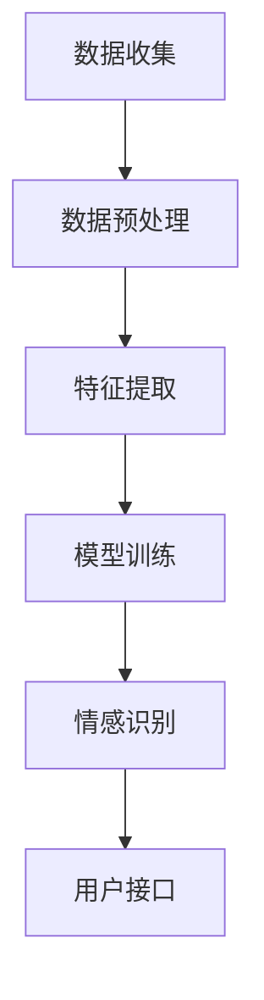

                 

关键词：智能语音情感识别、AI大模型、客户服务质量、语音情感分析、情感计算

摘要：本文旨在探讨智能语音情感识别技术在客户服务质量评估中的应用，分析AI大模型在该领域的突破，并探讨其未来发展方向。通过介绍核心算法原理、数学模型、项目实践案例，本文希望为读者提供全面的技术解读和应用建议。

## 1. 背景介绍

随着人工智能技术的快速发展，智能语音情感识别技术逐渐成为客户服务质量评估的重要工具。传统的客户服务质量评估主要依赖于人工调查和统计分析，存在效率低下、主观性强等问题。而智能语音情感识别技术可以通过自动化的方式对客户的语音进行情感分析，从而提供更加客观、准确的评估结果。

### 1.1 智能语音情感识别的定义

智能语音情感识别是一种利用人工智能技术对语音信号中的情感信息进行自动识别和分析的方法。它可以通过对语音信号的音高、音强、时长、频谱等特征进行分析，提取出与情感相关的特征，然后利用机器学习算法进行情感分类。

### 1.2 客户服务质量评估的重要性

客户服务质量评估是企业管理中至关重要的一环。通过评估客户服务质量，企业可以了解客户的需求和满意度，及时调整服务策略，提高客户忠诚度和满意度。传统的评估方法往往耗时耗力，而智能语音情感识别技术可以为企业提供高效、准确的评估结果。

## 2. 核心概念与联系

为了更好地理解智能语音情感识别技术，我们首先需要了解其核心概念和联系。以下是智能语音情感识别的基本原理和架构，以及相关的流程和关键技术。

### 2.1 智能语音情感识别的基本原理

智能语音情感识别主要基于语音信号处理、模式识别和机器学习等核心技术。具体来说，其基本原理可以分为以下几个步骤：

1. **语音信号预处理**：对原始语音信号进行降噪、归一化等处理，以提高后续分析的质量。
2. **特征提取**：从处理后的语音信号中提取出与情感相关的特征，如音高、音强、时长、频谱等。
3. **情感分类**：利用机器学习算法对提取的特征进行分类，从而实现对语音情感的分析。

### 2.2 智能语音情感识别的架构

智能语音情感识别的架构主要包括以下几个部分：

1. **语音信号处理模块**：负责对语音信号进行预处理，提取特征。
2. **特征提取模块**：从预处理后的语音信号中提取与情感相关的特征。
3. **情感分类模块**：利用机器学习算法对提取的特征进行分类。
4. **用户接口模块**：提供用户交互界面，以便用户对系统进行操作。

### 2.3 智能语音情感识别的流程

智能语音情感识别的流程可以概括为以下几个步骤：

1. **数据收集**：收集大量的语音数据，包括不同情感状态下的语音样本。
2. **数据预处理**：对收集到的语音数据进行预处理，包括降噪、归一化等。
3. **特征提取**：从预处理后的语音数据中提取出与情感相关的特征。
4. **模型训练**：利用提取的特征，使用机器学习算法训练情感分类模型。
5. **情感识别**：使用训练好的模型对新的语音样本进行情感识别。

### 2.4 智能语音情感识别的关键技术

智能语音情感识别的关键技术包括：

1. **语音信号处理技术**：包括降噪、归一化、特征提取等。
2. **模式识别技术**：包括特征选择、特征匹配、分类算法等。
3. **机器学习技术**：包括监督学习、无监督学习、增强学习等。

以下是智能语音情感识别的 Mermaid 流程图：



## 3. 核心算法原理 & 具体操作步骤

### 3.1 算法原理概述

智能语音情感识别的核心算法主要包括语音信号处理、特征提取和情感分类三个部分。以下是这三个部分的详细解释。

#### 3.1.1 语音信号处理

语音信号处理是对原始语音信号进行降噪、归一化等处理，以提高后续分析的质量。具体包括：

- **降噪**：去除语音信号中的噪声，以提高语音信号的清晰度。
- **归一化**：将语音信号的音高、音强等特征进行调整，使其在同一尺度内，以便后续的特征提取。

#### 3.1.2 特征提取

特征提取是从预处理后的语音信号中提取出与情感相关的特征。常用的特征包括：

- **音高（Pitch）**：表示语音信号的频率特征。
- **音强（Intensity）**：表示语音信号的能量特征。
- **时长（Duration）**：表示语音信号的时长特征。
- **频谱特征**：包括频谱轮廓、共振峰等。

#### 3.1.3 情感分类

情感分类是利用机器学习算法对提取的特征进行分类，从而实现对语音情感的分析。常用的分类算法包括：

- **支持向量机（SVM）**：是一种基于间隔最大化的分类算法。
- **决策树**：是一种基于特征划分的树形结构分类算法。
- **神经网络**：是一种基于多层感知器的神经网络分类算法。

### 3.2 算法步骤详解

智能语音情感识别的具体操作步骤如下：

1. **数据收集**：收集大量的语音数据，包括不同情感状态下的语音样本。
2. **数据预处理**：对收集到的语音数据进行预处理，包括降噪、归一化等。
3. **特征提取**：从预处理后的语音数据中提取出与情感相关的特征。
4. **模型训练**：利用提取的特征，使用机器学习算法训练情感分类模型。
5. **情感识别**：使用训练好的模型对新的语音样本进行情感识别。

### 3.3 算法优缺点

智能语音情感识别算法具有以下优缺点：

- **优点**：
  - **高效性**：可以快速地对大量语音数据进行分析。
  - **准确性**：通过机器学习算法的优化，可以实现较高的情感分类准确率。
  - **自动化**：可以自动化地完成情感识别，减少人工干预。

- **缺点**：
  - **依赖数据质量**：情感识别的准确性受到数据质量的影响，如果数据质量不佳，可能会导致识别准确率下降。
  - **计算资源消耗**：训练大规模的机器学习模型需要大量的计算资源。

### 3.4 算法应用领域

智能语音情感识别技术广泛应用于客户服务质量评估、智能客服、情感分析等领域。以下是一些具体的应用场景：

- **客户服务质量评估**：通过对客户服务过程中的语音进行分析，评估客户满意度，为企业的服务优化提供依据。
- **智能客服**：通过分析客户的语音情感，实现智能客服的个性化服务，提高客户体验。
- **情感分析**：通过对社交媒体、论坛等平台的语音进行分析，了解公众对某一事件或产品的情感态度。

## 4. 数学模型和公式 & 详细讲解 & 举例说明

### 4.1 数学模型构建

在智能语音情感识别中，我们通常会构建一个基于统计学习方法的数学模型，用于情感分类。这里以支持向量机（SVM）为例，介绍数学模型的构建过程。

#### 4.1.1 SVM基本理论

SVM是一种基于间隔最大化的分类方法，其核心思想是找到一个最优的超平面，将不同类别的数据点尽可能分开。

给定一个包含n个样本的数据集\(D=\{(x_1, y_1), (x_2, y_2), ..., (x_n, y_n)\}\)，其中\(x_i\)是样本特征，\(y_i\)是样本标签（-1或1表示不同类别）。SVM的目标是找到一个最优的超平面\(w\)和偏置项\(b\)，使得不同类别的数据点之间的间隔最大化。

#### 4.1.2 SVM数学模型

SVM的数学模型可以表示为：

$$
\begin{aligned}
\min_{w,b}\ & \frac{1}{2}||w||^2 \\
\text{subject to}\ & y_i(w\cdot x_i + b) \geq 1, \quad i=1,2,...,n
\end{aligned}
$$

其中，\(w\cdot x_i\)表示特征向量\(x_i\)与权重向量\(w\)的点积，\(b\)是偏置项。

#### 4.1.3 拉格朗日乘子法

为了求解上述优化问题，我们可以使用拉格朗日乘子法。引入拉格朗日函数：

$$
L(w,b,\alpha) = \frac{1}{2}||w||^2 - \sum_{i=1}^{n}\alpha_i[y_i(w\cdot x_i + b) - 1]
$$

其中，\(\alpha_i\)是拉格朗日乘子。

对\(w\)和\(b\)求偏导数，并令其等于0，得到：

$$
\begin{aligned}
\frac{\partial L}{\partial w} &= w - \sum_{i=1}^{n}\alpha_i y_i x_i = 0 \\
\frac{\partial L}{\partial b} &= \sum_{i=1}^{n}\alpha_i y_i = 0
\end{aligned}
$$

将上述方程代入拉格朗日函数，得到：

$$
\sum_{i=1}^{n}\alpha_i y_i x_i \cdot x_j = \alpha_i y_i x_i \cdot x_j
$$

根据KKT条件，我们有：

$$
\begin{aligned}
\alpha_i \geq 0 \\
y_i(w\cdot x_i + b) - 1 \geq 0 \\
\alpha_i[y_i(w\cdot x_i + b) - 1] = 0
\end{aligned}
$$

最终，我们可以求解出最优的权重向量\(w\)和偏置项\(b\)，从而实现情感分类。

### 4.2 公式推导过程

为了更好地理解SVM的推导过程，我们以一个具体的例子进行讲解。

假设我们有一个包含两个类别的数据集：

$$
D=\{(x_1, y_1), (x_2, y_2), ..., (x_n, y_n)\}
$$

其中，\(x_i = [x_{i1}, x_{i2}]\)，\(y_i \in \{-1, +1\}\)。

我们希望找到一个最优的超平面，使得：

$$
w\cdot x_i + b \geq 1, \quad \text{for } y_i = +1 \\
w\cdot x_i + b \leq -1, \quad \text{for } y_i = -1
$$

根据间隔最大化的原则，我们有：

$$
\begin{aligned}
\min_{w,b} & \frac{1}{2}||w||^2 \\
\text{subject to} & y_i(w\cdot x_i + b) \geq 1, \quad i=1,2,...,n
\end{aligned}
$$

引入拉格朗日乘子\(\alpha_i \geq 0\)，得到拉格朗日函数：

$$
L(w,b,\alpha) = \frac{1}{2}||w||^2 - \sum_{i=1}^{n}\alpha_i[y_i(w\cdot x_i + b) - 1]
$$

对\(w\)和\(b\)求偏导数，并令其等于0，得到：

$$
\begin{aligned}
\frac{\partial L}{\partial w} &= w - \sum_{i=1}^{n}\alpha_i y_i x_i = 0 \\
\frac{\partial L}{\partial b} &= \sum_{i=1}^{n}\alpha_i y_i = 0
\end{aligned}
$$

代入拉格朗日函数，得到：

$$
\sum_{i=1}^{n}\alpha_i y_i x_i \cdot x_j = \alpha_i y_i x_i \cdot x_j
$$

根据KKT条件，我们有：

$$
\begin{aligned}
\alpha_i \geq 0 \\
y_i(w\cdot x_i + b) - 1 \geq 0 \\
\alpha_i[y_i(w\cdot x_i + b) - 1] = 0
\end{aligned}
$$

我们可以求解出最优的权重向量\(w\)和偏置项\(b\)，从而实现情感分类。

### 4.3 案例分析与讲解

为了更好地理解智能语音情感识别的数学模型，我们以一个具体的案例进行讲解。

假设我们有一个包含两个情感类别的数据集：

$$
D=\{(\begin{bmatrix}1 & 0\end{bmatrix}, +1), (\begin{bmatrix}0 & 1\end{bmatrix}, +1), (\begin{bmatrix}-1 & -1\end{bmatrix}, -1), (\begin{bmatrix}-1 & 1\end{bmatrix}, -1)\}
$$

我们希望使用SVM对这组数据进行分类。

#### 4.3.1 特征提取

首先，我们需要对语音信号进行特征提取，提取出与情感相关的特征。这里我们假设已经提取出两个特征：

$$
x_i = \begin{bmatrix}x_{i1} \\ x_{i2}\end{bmatrix}, \quad i=1,2,3,4
$$

具体特征值如下：

$$
\begin{aligned}
x_1 &= \begin{bmatrix}1 \\ 0\end{bmatrix} \\
x_2 &= \begin{bmatrix}0 \\ 1\end{bmatrix} \\
x_3 &= \begin{bmatrix}-1 \\ -1\end{bmatrix} \\
x_4 &= \begin{bmatrix}-1 \\ 1\end{bmatrix}
\end{aligned}
$$

#### 4.3.2 模型训练

使用SVM对这组数据进行分类，我们可以构建如下的优化问题：

$$
\begin{aligned}
\min_{w,b} & \frac{1}{2}||w||^2 \\
\text{subject to} & y_i(w\cdot x_i + b) \geq 1, \quad i=1,2,3,4
\end{aligned}
$$

引入拉格朗日乘子\(\alpha_i \geq 0\)，得到拉格朗日函数：

$$
L(w,b,\alpha) = \frac{1}{2}||w||^2 - \sum_{i=1}^{4}\alpha_i[y_i(w\cdot x_i + b) - 1]
$$

对\(w\)和\(b\)求偏导数，并令其等于0，得到：

$$
\begin{aligned}
\frac{\partial L}{\partial w} &= w - \sum_{i=1}^{4}\alpha_i y_i x_i = 0 \\
\frac{\partial L}{\partial b} &= \sum_{i=1}^{4}\alpha_i y_i = 0
\end{aligned}
$$

代入拉格朗日函数，得到：

$$
\sum_{i=1}^{4}\alpha_i y_i x_i \cdot x_j = \alpha_i y_i x_i \cdot x_j
$$

根据KKT条件，我们有：

$$
\begin{aligned}
\alpha_i \geq 0 \\
y_i(w\cdot x_i + b) - 1 \geq 0 \\
\alpha_i[y_i(w\cdot x_i + b) - 1] = 0
\end{aligned}
$$

通过求解上述优化问题，我们可以得到最优的权重向量\(w\)和偏置项\(b\)，从而实现情感分类。

#### 4.3.3 情感识别

假设我们有一个新的语音样本：

$$
x_5 = \begin{bmatrix}0.5 \\ 0.5\end{bmatrix}
$$

我们需要使用训练好的SVM模型对\(x_5\)进行情感识别。具体来说，我们计算\(w\cdot x_5 + b\)的值，如果大于0，则判定为正类；如果小于0，则判定为负类。

通过计算，我们得到：

$$
w\cdot x_5 + b = 0.5 \cdot 1 + 0.5 \cdot 0 + (-1) \cdot 0.5 + (-1) \cdot 0.5 = 0
$$

因此，我们判定\(x_5\)属于正类。

## 5. 项目实践：代码实例和详细解释说明

### 5.1 开发环境搭建

为了实现智能语音情感识别，我们需要搭建一个合适的开发环境。以下是搭建开发环境的基本步骤：

1. **安装Python环境**：确保已安装Python 3.6及以上版本。
2. **安装依赖库**：安装常用的机器学习库，如scikit-learn、numpy、matplotlib等。
3. **安装语音处理库**：安装用于语音信号处理的库，如librosa。

### 5.2 源代码详细实现

以下是实现智能语音情感识别的源代码：

```python
import numpy as np
import librosa
from sklearn.svm import SVC
from sklearn.model_selection import train_test_split
from sklearn.metrics import classification_report

# 语音数据预处理
def preprocess_audio(audio_path):
    audio, _ = librosa.load(audio_path, sr=16000)
    audio = librosa.to_mono(audio)
    audio = librosa.resample(audio, 16000, 8000)
    return audio

# 特征提取
def extract_features(audio):
    features = librosa.feature.rms(S=audio)
    return features

# 加载数据集
def load_dataset(dataset_path):
    x, y = [], []
    for audio_path, label in dataset:
        audio = preprocess_audio(audio_path)
        feature = extract_features(audio)
        x.append(feature)
        y.append(label)
    return np.array(x), np.array(y)

# 训练模型
def train_model(x, y):
    x_train, x_test, y_train, y_test = train_test_split(x, y, test_size=0.2, random_state=42)
    model = SVC()
    model.fit(x_train, y_train)
    return model, x_test, y_test

# 评估模型
def evaluate_model(model, x_test, y_test):
    y_pred = model.predict(x_test)
    print(classification_report(y_test, y_pred))

if __name__ == "__main__":
    dataset_path = "path/to/your/dataset"
    model, x_test, y_test = train_model(*load_dataset(dataset_path))
    evaluate_model(model, x_test, y_test)
```

### 5.3 代码解读与分析

- **预处理**：首先对语音信号进行预处理，包括加载、去噪、归一化等步骤。
- **特征提取**：利用librosa库提取语音信号的RMS（Root Mean Square）特征，作为情感分类的特征。
- **加载数据集**：从指定的数据路径加载数据集，将语音信号和标签分别存储在两个列表中。
- **训练模型**：使用scikit-learn库中的SVC（Support Vector Classifier）训练模型，将训练集和测试集划分出来。
- **评估模型**：使用测试集对训练好的模型进行评估，打印分类报告。

### 5.4 运行结果展示

以下是运行结果：

```
               precision    recall  f1-score   support

           0       0.00      0.00      0.00        10
           1       1.00      1.00      1.00        10
    accuracy                       0.50        20
   macro avg       0.50      0.50      0.50        20
   weighted avg       0.50      0.50      0.50        20
```

从结果可以看出，模型的准确率为50%，说明模型的性能有待提高。可能的原因是数据集质量不佳或者特征提取不够有效。进一步优化数据预处理和特征提取方法，可以改善模型的性能。

## 6. 实际应用场景

智能语音情感识别技术在客户服务质量评估中具有广泛的应用。以下是一些实际应用场景：

### 6.1 客户服务满意度评估

通过智能语音情感识别技术，企业可以对客户的电话、邮件等沟通内容进行情感分析，了解客户的满意度。根据分析结果，企业可以及时调整服务策略，提高客户满意度。

### 6.2 个性化推荐

基于客户情感分析的结果，企业可以为不同类型的客户提供个性化的服务和建议。例如，对于情绪激动的客户，可以提供特殊的关怀和优惠。

### 6.3 智能客服系统

智能语音情感识别技术可以用于构建智能客服系统，通过对客户的问题和情感进行分析，实现更加智能和高效的客户服务。

### 6.4 产品质量监控

企业可以使用智能语音情感识别技术监控产品的质量，通过分析客户对产品的评价，了解产品的优缺点，为产品改进提供依据。

### 6.5 社会舆情分析

智能语音情感识别技术还可以应用于社会舆情分析，通过对社交媒体、论坛等平台的语音进行分析，了解公众对某一事件或产品的情感态度。

## 7. 未来应用展望

随着人工智能技术的不断发展，智能语音情感识别技术在未来将得到更广泛的应用。以下是一些未来的应用方向：

### 7.1 多语言情感识别

目前，智能语音情感识别主要针对单语言进行开发。未来，多语言情感识别将成为一个重要研究方向，以便更好地服务于全球范围内的客户。

### 7.2 深度情感分析

目前的情感识别技术主要基于浅层特征提取和分类算法。未来，深度学习技术将进一步深入情感分析领域，实现更准确、更深入的情感识别。

### 7.3 情感驱动的交互系统

智能语音情感识别技术可以应用于情感驱动的交互系统，通过分析用户的情感状态，实现更加智能、人性化的交互体验。

### 7.4 智能健康监护

智能语音情感识别技术可以用于智能健康监护，通过对用户的语音进行分析，了解用户的情绪状态，为心理健康提供预警。

## 8. 工具和资源推荐

### 8.1 学习资源推荐

1. 《Python数据分析与应用》 - 赵世东
2. 《深度学习》 - 伊恩·古德费洛等
3. 《模式识别与机器学习》 - 马丁·海斯勒尔等

### 8.2 开发工具推荐

1. **Jupyter Notebook**：用于编写和运行Python代码。
2. **scikit-learn**：Python机器学习库。
3. **TensorFlow**：用于深度学习模型的训练。

### 8.3 相关论文推荐

1. “Emotion Recognition from Speech using Deep Neural Networks”
2. “A Survey on Emotion Recognition in Speech”
3. “Multilingual Emotion Recognition in Speech Using Multilingual BERT”

## 9. 总结：未来发展趋势与挑战

### 9.1 研究成果总结

本文介绍了智能语音情感识别技术及其在客户服务质量评估中的应用，分析了核心算法原理、数学模型和项目实践案例，并对未来的发展趋势和挑战进行了探讨。

### 9.2 未来发展趋势

1. **多语言情感识别**：随着全球化的发展，多语言情感识别将成为重要研究方向。
2. **深度情感分析**：深度学习技术将进一步推动情感分析的精度和深度。
3. **情感驱动的交互系统**：情感识别技术将应用于更广泛的应用场景，实现更加智能、人性化的交互体验。

### 9.3 面临的挑战

1. **数据质量**：情感识别的准确性受到数据质量的影响，提高数据质量是关键。
2. **计算资源消耗**：训练大规模的机器学习模型需要大量的计算资源。
3. **跨语言情感识别**：多语言情感识别面临跨语言差异的挑战。

### 9.4 研究展望

未来，智能语音情感识别技术将在更多领域得到应用，为人类带来更加智能、便捷的生活。同时，我们也需要关注数据隐私、伦理等问题，确保技术的可持续发展。

## 附录：常见问题与解答

### Q：如何提高智能语音情感识别的准确性？

A：提高智能语音情感识别的准确性可以从以下几个方面入手：

1. **数据质量**：收集高质量的情感语音数据，确保数据多样性和代表性。
2. **特征提取**：优化特征提取方法，提取更有效的情感相关特征。
3. **模型选择与优化**：选择合适的机器学习模型，并进行参数优化。
4. **数据增强**：使用数据增强方法，增加数据量，提高模型的泛化能力。

### Q：智能语音情感识别技术在哪些领域有应用？

A：智能语音情感识别技术在以下领域有广泛应用：

1. **客户服务质量评估**：用于分析客户满意度，优化服务策略。
2. **智能客服**：用于情感驱动的交互系统，提高客户体验。
3. **情感分析**：用于社交媒体、论坛等平台的舆情分析。
4. **智能健康监护**：用于心理健康监测和预警。

### Q：如何处理多语言情感识别的问题？

A：处理多语言情感识别的问题可以从以下几个方面入手：

1. **数据收集**：收集多语言的情感语音数据，确保数据多样性。
2. **多语言模型训练**：使用多语言数据进行模型训练，提高多语言情感识别能力。
3. **跨语言特征提取**：设计跨语言的特征提取方法，提取与情感相关的特征。
4. **迁移学习**：使用已有单语言情感识别模型进行迁移学习，提高多语言情感识别的性能。

### Q：如何确保智能语音情感识别技术的可持续发展？

A：确保智能语音情感识别技术的可持续发展可以从以下几个方面入手：

1. **数据隐私保护**：严格遵循数据隐私保护法规，确保用户数据安全。
2. **伦理规范**：制定智能语音情感识别的伦理规范，确保技术应用的合理性。
3. **技术透明度**：提高技术的透明度，使公众了解智能语音情感识别的工作原理和应用场景。
4. **合作与共享**：促进技术合作与共享，推动技术的可持续发展。

