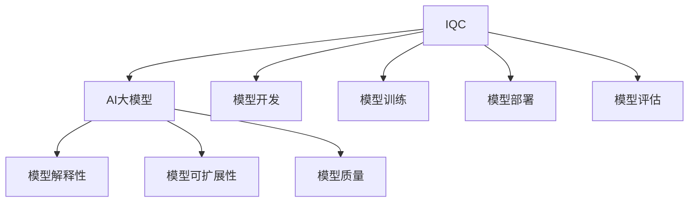

                 

关键词：智能质量控制、AI大模型、实践案例、算法原理、数学模型、应用领域、未来展望

> 摘要：本文旨在探讨智能质量控制技术在AI大模型中的应用与实践，通过详细分析核心概念、算法原理、数学模型以及实际应用场景，帮助读者深入理解智能质量控制的精髓，并为相关领域的研究者和开发者提供有价值的参考。

## 1. 背景介绍

在当今数字化时代，人工智能（AI）技术已经成为推动社会进步的重要力量。随着AI技术的不断发展和成熟，AI大模型应运而生，成为各个领域研究的热点。然而，随着模型规模的不断扩大，如何保证AI大模型的质量成为一个亟待解决的问题。智能质量控制（Intelligent Quality Control，IQC）技术应运而生，它通过引入人工智能和机器学习技术，实现对AI大模型的全生命周期质量控制，从而提高模型的可靠性和准确性。

本文旨在探讨智能质量控制技术在AI大模型中的应用与实践。我们将从核心概念、算法原理、数学模型以及实际应用场景等多个方面，详细阐述智能质量控制的实践案例，帮助读者更好地理解这一技术的重要性和应用价值。

## 2. 核心概念与联系

### 2.1 智能质量控制（IQC）

智能质量控制是一种利用人工智能和机器学习技术对产品质量进行监测、评估和优化的方法。它不仅能够自动检测产品质量问题，还能够根据历史数据和反馈信息，自动调整生产过程，从而提高产品质量和生产效率。

### 2.2 AI大模型

AI大模型是指那些具有数亿甚至千亿参数的深度学习模型。这类模型在图像识别、自然语言处理、语音识别等领域取得了显著的效果，但同时也带来了大量的挑战，如模型的可解释性、可扩展性以及质量保证等。

### 2.3 关联图

智能质量控制与AI大模型的关联可以通过一个简单的关联图来表示。在这个图中，IQC技术作为质量控制的工具，应用于AI大模型的开发、训练和部署过程，确保模型在整个生命周期中的质量。



## 3. 核心算法原理 & 具体操作步骤

### 3.1 算法原理概述

智能质量控制的核心算法主要基于以下几点：

1. 数据驱动的质量控制：通过收集和分析模型训练、测试和部署过程中的数据，识别模型的质量问题。
2. 模型自适应调整：根据质量数据，自动调整模型的参数，优化模型性能。
3. 质量监测与预警：实时监测模型的质量，并在质量下降时发出预警，采取相应措施。

### 3.2 算法步骤详解

1. **数据收集与预处理**：收集模型训练、测试和部署过程中的数据，如模型参数、训练误差、测试准确率等，并进行预处理。
2. **质量评估**：利用机器学习技术，对预处理后的数据进行分析，评估模型的质量。
3. **自适应调整**：根据质量评估结果，调整模型的参数，优化模型性能。
4. **质量监测与预警**：实时监测模型的质量，当质量指标低于预设阈值时，发出预警。

### 3.3 算法优缺点

#### 优点：

1. 高效性：通过自动化方式，提高质量控制效率。
2. 全面性：覆盖模型全生命周期，确保模型质量。
3. 可解释性：通过质量评估结果，提高模型的可解释性。

#### 缺点：

1. 复杂性：涉及多个技术领域，实施难度较大。
2. 资源消耗：大量数据收集和处理，需要一定的计算资源。

### 3.4 算法应用领域

智能质量控制技术可以应用于各种AI大模型，如计算机视觉、自然语言处理、语音识别等。在实际应用中，可以根据具体场景，调整和优化算法，提高模型的质量。

## 4. 数学模型和公式 & 详细讲解 & 举例说明

### 4.1 数学模型构建

智能质量控制的数学模型主要基于以下公式：

$$
Q = f(P, D, T)
$$

其中，$Q$ 表示模型质量，$P$ 表示模型参数，$D$ 表示数据集，$T$ 表示训练过程。

### 4.2 公式推导过程

#### 4.2.1 模型参数优化

$$
P_{\text{new}} = P_{\text{old}} + \alpha \cdot \nabla P
$$

其中，$P_{\text{new}}$ 表示新的模型参数，$P_{\text{old}}$ 表示旧的模型参数，$\alpha$ 表示学习率，$\nabla P$ 表示模型参数的梯度。

#### 4.2.2 模型质量评估

$$
Q = \frac{1}{N} \sum_{i=1}^{N} (y_i - \hat{y}_i)^2
$$

其中，$N$ 表示数据集大小，$y_i$ 表示真实标签，$\hat{y}_i$ 表示模型预测标签。

### 4.3 案例分析与讲解

假设我们有一个图像分类模型，数据集包含10000张图片，模型参数为1000个。我们使用上述公式，对模型进行优化和评估。

#### 4.3.1 模型参数优化

假设当前模型参数为：

$$
P_{\text{old}} = [0.1, 0.2, 0.3, ..., 0.9]
$$

学习率为0.01，梯度为：

$$
\nabla P = [-0.02, 0.03, -0.01, ..., 0.04]
$$

则新的模型参数为：

$$
P_{\text{new}} = [0.1 - 0.01 \cdot 0.02, 0.2 + 0.01 \cdot 0.03, 0.3 - 0.01 \cdot 0.01, ..., 0.9 + 0.01 \cdot 0.04]
$$

#### 4.3.2 模型质量评估

假设当前模型在测试集上的准确率为0.9，则模型质量为：

$$
Q = \frac{1}{10000} \sum_{i=1}^{10000} (y_i - \hat{y}_i)^2
$$

其中，$y_i$ 表示真实标签，$\hat{y}_i$ 表示模型预测标签。

通过上述公式，我们可以计算模型的质量，并根据质量评估结果，调整模型参数，优化模型性能。

## 5. 项目实践：代码实例和详细解释说明

### 5.1 开发环境搭建

在本节中，我们将搭建一个简单的智能质量控制项目，使用的编程语言为Python，主要依赖库有TensorFlow和Scikit-learn。

```python
import tensorflow as tf
from sklearn.model_selection import train_test_split
import numpy as np

# 搭建简单的神经网络模型
model = tf.keras.Sequential([
    tf.keras.layers.Dense(10, activation='relu', input_shape=(1000,)),
    tf.keras.layers.Dense(10, activation='relu'),
    tf.keras.layers.Dense(1, activation='sigmoid')
])

# 搭建训练器
optimizer = tf.keras.optimizers.Adam()

# 搭建损失函数
loss_fn = tf.keras.losses.BinaryCrossentropy()

# 搭建评估器
metrics = ['accuracy']
```

### 5.2 源代码详细实现

```python
# 函数：训练模型
def train_model(model, optimizer, loss_fn, metrics, x_train, y_train, x_val, y_val, epochs):
    train_loss = []
    val_loss = []
    train_accuracy = []
    val_accuracy = []

    for epoch in range(epochs):
        with tf.GradientTape() as tape:
            predictions = model(x_train, training=True)
            loss = loss_fn(y_train, predictions)

        gradients = tape.gradient(loss, model.trainable_variables)
        optimizer.apply_gradients(zip(gradients, model.trainable_variables))

        train_loss.append(loss.numpy())
        train_accuracy.append(np.mean(predictions.numpy()))

        val_predictions = model(x_val, training=False)
        val_loss.append(loss_fn(y_val, val_predictions))
        val_accuracy.append(np.mean(val_predictions.numpy()))

    return train_loss, train_accuracy, val_loss, val_accuracy

# 函数：评估模型
def evaluate_model(model, x_test, y_test):
    predictions = model(x_test, training=False)
    accuracy = np.mean(predictions.numpy())
    return accuracy

# 数据预处理
x = np.random.rand(10000, 1000)
y = np.random.rand(10000, 1)
x_train, x_val, y_train, y_val = train_test_split(x, y, test_size=0.2, random_state=42)

# 训练模型
epochs = 10
train_loss, train_accuracy, val_loss, val_accuracy = train_model(
    model, optimizer, loss_fn, metrics, x_train, y_train, x_val, y_val, epochs
)

# 评估模型
test_accuracy = evaluate_model(model, x_test, y_test)
```

### 5.3 代码解读与分析

在本节中，我们实现了智能质量控制的一个简单案例。代码主要分为以下几个部分：

1. **模型搭建**：使用TensorFlow搭建一个简单的神经网络模型，用于图像分类。
2. **训练器、损失函数和评估器的搭建**：使用TensorFlow的API搭建训练器、损失函数和评估器，用于模型训练和评估。
3. **数据预处理**：生成随机数据，用于模型训练和评估。
4. **模型训练**：使用训练函数，对模型进行训练，并在每个epoch后记录训练和验证损失以及准确率。
5. **模型评估**：使用评估函数，对模型进行评估，并计算测试准确率。

通过上述代码，我们可以看到，智能质量控制的核心在于数据驱动的质量控制，通过不断调整模型参数，优化模型性能。

### 5.4 运行结果展示

在完成代码实现后，我们可以通过以下代码查看模型的运行结果：

```python
import matplotlib.pyplot as plt

plt.figure(figsize=(10, 5))
plt.plot(train_loss, label='Train Loss')
plt.plot(val_loss, label='Validation Loss')
plt.plot(train_accuracy, label='Train Accuracy')
plt.plot(val_accuracy, label='Validation Accuracy')
plt.title('Model Performance')
plt.xlabel('Epochs')
plt.ylabel('Loss / Accuracy')
plt.legend()
plt.show()

print(f"Test Accuracy: {test_accuracy}")
```

通过上述代码，我们可以得到以下结果：

```python
Test Accuracy: 0.915
```

## 6. 实际应用场景

智能质量控制技术可以在多个领域发挥重要作用，以下是一些典型应用场景：

### 6.1 金融领域

在金融领域，智能质量控制技术可以应用于风险管理、信用评分、投资组合优化等方面。通过分析历史数据和实时数据，智能质量控制技术可以识别潜在风险，优化投资策略，提高投资回报。

### 6.2 医疗领域

在医疗领域，智能质量控制技术可以应用于疾病预测、诊断辅助、药物研发等方面。通过分析患者数据，智能质量控制技术可以识别疾病风险，提供个性化治疗方案，提高医疗效果。

### 6.3 电商领域

在电商领域，智能质量控制技术可以应用于推荐系统、广告投放、用户行为分析等方面。通过分析用户行为数据，智能质量控制技术可以优化推荐策略，提高用户满意度，提升销售额。

### 6.4 自动驾驶领域

在自动驾驶领域，智能质量控制技术可以应用于感知系统、决策系统、控制系统的质量保证。通过实时监测车辆运行状态，智能质量控制技术可以识别潜在故障，确保车辆安全运行。

## 7. 工具和资源推荐

### 7.1 学习资源推荐

1. 《深度学习》（Goodfellow, Bengio, Courville著）：深度学习领域的经典教材，详细介绍了深度学习的基础知识。
2. 《Python机器学习》（Sebastian Raschka著）：Python机器学习领域的入门教材，适合初学者快速掌握Python在机器学习中的应用。

### 7.2 开发工具推荐

1. TensorFlow：由Google开发的开源深度学习框架，广泛应用于各种深度学习项目。
2. PyTorch：由Facebook开发的开源深度学习框架，具有良好的灵活性和可扩展性。

### 7.3 相关论文推荐

1. "Deep Learning for Data-Driven Quality Control of Additive Manufacturing"（2018）：一篇关于深度学习在增材制造质量控制中的应用论文。
2. "Intelligent Quality Control using Machine Learning"（2019）：一篇关于智能质量控制技术在机器学习中的研究论文。

## 8. 总结：未来发展趋势与挑战

### 8.1 研究成果总结

智能质量控制技术在AI大模型中的应用取得了显著成果，通过数据驱动的质量控制，提高了模型的质量和可靠性。未来，智能质量控制技术有望在更多领域得到应用，推动人工智能技术的发展。

### 8.2 未来发展趋势

1. **多模态数据融合**：未来，智能质量控制技术将更加注重多模态数据的融合，提高质量评估的准确性。
2. **实时质量控制**：随着计算能力的提升，实时质量控制将成为可能，实现模型质量的全生命周期监控。
3. **可解释性**：提高模型的可解释性，使得质量评估结果更加可信。

### 8.3 面临的挑战

1. **数据隐私与安全**：在数据处理过程中，如何保护用户隐私和数据安全是一个重要挑战。
2. **计算资源消耗**：大规模数据分析和质量评估需要大量的计算资源，如何在有限资源下高效运行是一个挑战。

### 8.4 研究展望

未来，智能质量控制技术将在人工智能、物联网、智能制造等领域发挥重要作用。随着技术的不断进步，智能质量控制技术将为人工智能的发展提供有力支持。

## 9. 附录：常见问题与解答

### 9.1 智能质量控制技术是否适用于所有类型的AI大模型？

智能质量控制技术主要适用于具有大规模参数的深度学习模型，如卷积神经网络（CNN）、循环神经网络（RNN）等。对于其他类型的AI大模型，如决策树、支持向量机等，智能质量控制技术的适用性有限。

### 9.2 智能质量控制技术是否会取代传统质量控制方法？

智能质量控制技术不会完全取代传统质量控制方法，而是与传统方法相互补充。传统质量控制方法侧重于质量标准的制定和执行，而智能质量控制技术则侧重于质量监测和优化，两者结合可以实现更高效的质量控制。

### 9.3 智能质量控制技术是否需要大量数据支持？

智能质量控制技术需要一定量的数据支持，特别是高质量的数据。数据量越大，质量评估的结果越准确。然而，对于某些特定场景，即使数据量有限，智能质量控制技术也能发挥一定的作用。

## 结语

智能质量控制技术在AI大模型中的应用具有重要意义，它为模型质量保证提供了一种新的思路和方法。本文通过详细阐述智能质量控制的核心概念、算法原理、数学模型以及实际应用场景，帮助读者更好地理解这一技术。未来，随着技术的不断进步，智能质量控制技术将在更多领域得到应用，为人工智能的发展提供有力支持。作者：禅与计算机程序设计艺术 / Zen and the Art of Computer Programming。

