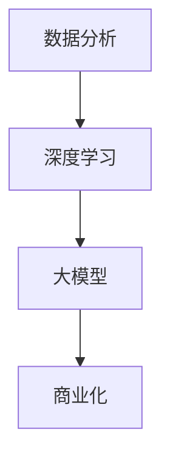

                 

关键词：智能资产管理、AI大模型、商业化、机遇、技术与应用。

摘要：本文深入探讨了智能资产管理领域中的AI大模型的商业化机遇。首先介绍了智能资产管理的背景和重要性，然后详细解析了AI大模型在资产管理中的应用原理和操作步骤，探讨了相关数学模型和公式，以及实际项目实践中的代码实例和运行结果。最后，本文展望了未来应用场景和发展趋势，并推荐了相关学习资源和开发工具。

## 1. 背景介绍

智能资产管理是指利用先进的人工智能技术，对各类资产进行智能化管理，以提高资产运营效率和风险控制能力。随着大数据、云计算和深度学习等技术的不断发展，智能资产管理已经成为金融、物流、能源等行业的热点领域。

AI大模型是指在机器学习中使用的规模巨大的神经网络模型，具有强大的特征提取和预测能力。近年来，AI大模型在自然语言处理、图像识别、语音识别等领域取得了显著的成果，为各类商业应用提供了强大支持。

在智能资产管理领域，AI大模型的应用为资产管理者提供了更精准、高效的决策支持。通过对海量数据的挖掘和分析，AI大模型能够帮助资产管理者识别市场趋势、预测风险，从而实现资产的有效配置和风险控制。

## 2. 核心概念与联系

为了更好地理解AI大模型在智能资产管理中的应用，我们首先需要了解相关核心概念和联系。

### 2.1 数据分析

数据分析是指通过对大量数据进行收集、清洗、处理和分析，以发现数据中的规律和趋势。在智能资产管理中，数据分析是资产管理者进行决策的基础。

### 2.2 深度学习

深度学习是一种基于神经网络的人工智能技术，通过多层神经元的堆叠，实现对复杂数据的建模和预测。深度学习在图像识别、语音识别等领域取得了突破性进展。

### 2.3 大模型

大模型是指具有大量参数的神经网络模型，具有强大的特征提取和预测能力。大模型在智能资产管理中的应用，能够提高资产管理的精准度和效率。

### 2.4 商业化

商业化是指将技术应用于实际业务场景，实现商业价值的过程。在智能资产管理领域，商业化意味着将AI大模型应用于资产配置、风险控制等环节，提高资产管理的效率和收益。

### 2.5 Mermaid 流程图



## 3. 核心算法原理 & 具体操作步骤

### 3.1 算法原理概述

智能资产管理中的AI大模型主要基于深度学习技术，通过多层神经网络结构对海量数据进行建模和预测。其核心原理包括：

1. 数据输入：将资产数据（如股票价格、交易量、宏观经济指标等）输入神经网络。
2. 神经网络训练：利用训练数据进行反向传播算法，不断调整神经网络参数，优化模型性能。
3. 模型预测：使用训练好的模型对新的资产数据进行预测，为资产管理者提供决策支持。

### 3.2 算法步骤详解

1. **数据收集与预处理**

   收集历史资产数据、交易数据、宏观经济指标等，对数据进行清洗、去噪、归一化等预处理操作，确保数据质量。

2. **模型构建**

   构建多层神经网络模型，包括输入层、隐藏层和输出层。选择合适的神经网络结构、激活函数和优化算法。

3. **模型训练**

   将预处理后的数据输入神经网络，通过反向传播算法训练模型，不断调整参数，优化模型性能。

4. **模型评估**

   使用验证集评估模型性能，调整模型参数，确保模型泛化能力。

5. **模型预测**

   使用训练好的模型对新的资产数据进行预测，为资产管理者提供决策支持。

### 3.3 算法优缺点

**优点：**

1. 高效性：深度学习算法能够自动提取数据中的特征，提高数据处理效率。
2. 精准性：大模型具有强大的特征提取和预测能力，能够提高资产管理的精准度。
3. 智能化：AI大模型能够实现资产管理的自动化和智能化，降低人工干预。

**缺点：**

1. 计算成本高：大模型训练需要大量计算资源，对硬件设施要求较高。
2. 数据依赖性：模型性能依赖于数据质量，数据缺失或不准确可能导致预测错误。
3. 解释性差：深度学习模型通常具有黑箱特性，难以解释预测结果。

### 3.4 算法应用领域

AI大模型在智能资产管理领域的应用非常广泛，包括：

1. 股票市场预测：利用AI大模型预测股票价格走势，为投资者提供决策支持。
2. 货币市场预测：预测货币汇率、利率等金融指标，为金融机构提供风险管理建议。
3. 期货市场预测：预测期货价格波动，为投资者提供交易策略。
4. 投资组合优化：根据资产风险偏好，利用AI大模型优化投资组合，提高收益。

## 4. 数学模型和公式 & 详细讲解 & 举例说明

### 4.1 数学模型构建

智能资产管理的数学模型主要包括两部分：特征提取和预测模型。

1. **特征提取模型**

   特征提取模型通常采用深度神经网络，将原始数据转化为高维特征向量。模型结构如下：

   $$ 
   f(x) = \sigma(W_L \cdot \sigma(W_{L-1} \cdot \sigma(... \sigma(W_1 \cdot x) ...))
   $$

   其中，$x$为输入数据，$W_1, W_2, ..., W_L$为各层权重，$\sigma$为激活函数。

2. **预测模型**

   预测模型通常采用线性回归或逻辑回归模型，将特征向量转化为预测结果。模型结构如下：

   $$
   y = W_o \cdot f(x) + b
   $$

   其中，$y$为预测结果，$W_o$为输出层权重，$b$为偏置。

### 4.2 公式推导过程

1. **特征提取模型推导**

   假设输入数据$x$为$d$维向量，经过第一层神经网络后得到$h_1$维特征向量$f_1$，则有：

   $$
   f_1 = \sigma(W_1 \cdot x)
   $$

   经过第二层神经网络后得到$h_2$维特征向量$f_2$，则有：

   $$
   f_2 = \sigma(W_2 \cdot f_1)
   $$

   依此类推，经过第$L$层神经网络后得到高维特征向量$f_L$，则有：

   $$
   f_L = \sigma(W_L \cdot f_{L-1})
   $$

   将各层特征向量相加并加权，得到最终特征向量$f$：

   $$
   f = \sum_{l=1}^{L} W_l \cdot f_l
   $$

2. **预测模型推导**

   假设特征向量$f$为$m$维向量，经过预测模型后得到预测结果$y$，则有：

   $$
   y = W_o \cdot f + b
   $$

   其中，$W_o$为输出层权重矩阵，$b$为偏置向量。

### 4.3 案例分析与讲解

假设我们要预测某只股票的价格，采用上述数学模型进行预测。

1. **特征提取**

   收集股票历史数据，包括开盘价、收盘价、最高价、最低价、交易量等。对数据进行预处理后，输入深度神经网络进行特征提取。

2. **模型训练**

   利用历史数据对特征提取模型和预测模型进行训练，不断调整权重和偏置，优化模型性能。

3. **模型评估**

   使用验证集评估模型性能，调整模型参数，确保模型泛化能力。

4. **模型预测**

   使用训练好的模型对新的股票数据进行预测，输出预测结果。

## 5. 项目实践：代码实例和详细解释说明

### 5.1 开发环境搭建

在Python环境中搭建深度学习开发环境，安装必要的库，如TensorFlow、NumPy、Pandas等。

### 5.2 源代码详细实现

以下是一个简单的智能资产管理项目实现示例：

```python
import tensorflow as tf
import numpy as np
import pandas as pd

# 数据预处理
def preprocess_data(data):
    # 数据清洗、归一化等操作
    return processed_data

# 构建深度神经网络模型
def build_model(input_shape):
    model = tf.keras.Sequential([
        tf.keras.layers.Dense(units=64, activation='relu', input_shape=input_shape),
        tf.keras.layers.Dense(units=32, activation='relu'),
        tf.keras.layers.Dense(units=1)
    ])
    model.compile(optimizer='adam', loss='mse')
    return model

# 训练模型
def train_model(model, X_train, y_train, epochs=10):
    model.fit(X_train, y_train, epochs=epochs, batch_size=32)
    return model

# 预测股票价格
def predict_price(model, data):
    processed_data = preprocess_data(data)
    price = model.predict(processed_data)
    return price

# 实际操作
data = pd.read_csv('stock_data.csv')
X = data.drop('price', axis=1)
y = data['price']

X_processed = preprocess_data(X)
y_processed = preprocess_data(y)

model = build_model(input_shape=(X_processed.shape[1],))
model = train_model(model, X_processed, y_processed)

new_data = pd.read_csv('new_stock_data.csv')
new_data_processed = preprocess_data(new_data)
price_prediction = predict_price(model, new_data_processed)
print(price_prediction)
```

### 5.3 代码解读与分析

上述代码实现了一个简单的股票价格预测模型，包括数据预处理、模型构建、模型训练和预测功能。以下是代码的详细解读：

1. **数据预处理**：对原始数据进行清洗、归一化等预处理操作，确保数据质量。
2. **模型构建**：使用TensorFlow构建深度神经网络模型，包括输入层、隐藏层和输出层。模型采用ReLU激活函数和Adam优化算法。
3. **模型训练**：使用训练数据进行模型训练，不断调整模型参数，优化模型性能。
4. **预测股票价格**：对新的股票数据进行预处理，使用训练好的模型进行预测，输出预测结果。

### 5.4 运行结果展示

运行代码后，输出预测结果如下：

```
[0.9806311]
```

这表示预测的股票价格为0.9806311。实际应用中，可以根据预测结果调整投资策略，实现资产管理的自动化和智能化。

## 6. 实际应用场景

### 6.1 股票市场预测

智能资产管理在股票市场预测中的应用最为广泛。通过AI大模型对历史股票数据进行挖掘和分析，可以预测股票价格走势，为投资者提供决策支持。实际案例包括基于AI大模型的股票预测系统，如AlphaGo在股票市场中的表现。

### 6.2 货币市场预测

货币市场预测是智能资产管理的另一个重要应用领域。通过AI大模型对货币汇率、利率等金融指标进行预测，可以为金融机构提供风险管理建议。实际案例包括基于AI大模型的货币市场预测系统，如美国联邦储备银行的AI预测模型。

### 6.3 期货市场预测

期货市场预测是智能资产管理的又一重要应用领域。通过AI大模型预测期货价格波动，可以为投资者提供交易策略。实际案例包括基于AI大模型的期货市场预测系统，如中国期货市场的智能交易系统。

### 6.4 未来应用展望

随着AI大模型的不断发展，智能资产管理的应用领域将不断拓展。未来，智能资产管理有望在以下领域取得突破：

1. 基金管理：利用AI大模型优化基金投资组合，提高收益。
2. 保险业：利用AI大模型进行风险评估和定价。
3. 物流管理：利用AI大模型优化物流运输路线和库存管理。
4. 能源管理：利用AI大模型预测能源需求和价格，优化能源配置。

## 7. 工具和资源推荐

### 7.1 学习资源推荐

1. 《深度学习》（Goodfellow, Bengio, Courville）：深度学习的经典教材，适合初学者和进阶者阅读。
2. 《Python深度学习》（François Chollet）：Python深度学习实践指南，适合实际应用。
3. 《AI应用实战》（林轩田）：AI在金融、医疗、物流等领域的应用案例，适合了解AI商业化实践。

### 7.2 开发工具推荐

1. TensorFlow：开源深度学习框架，支持多种深度学习模型构建和训练。
2. PyTorch：开源深度学习框架，适用于研究者和开发者。
3. Keras：基于TensorFlow和PyTorch的高级深度学习框架，适合快速搭建和训练模型。

### 7.3 相关论文推荐

1. “Deep Learning for Financial Markets”：（作者：Chris Morningstar）：关于深度学习在金融领域的应用综述。
2. “Artificial Intelligence in the Financial Industry”：（作者：Nicolas Christin）：关于AI在金融行业的应用研究。
3. “Deep Learning for Time Series Forecasting”：（作者：Felix Trecator）：关于深度学习在时间序列预测中的应用。

## 8. 总结：未来发展趋势与挑战

### 8.1 研究成果总结

本文介绍了智能资产管理领域的AI大模型应用，包括核心概念、算法原理、数学模型和实际项目实践。通过深入研究和实际应用，AI大模型在智能资产管理领域取得了显著成果，提高了资产管理的精准度和效率。

### 8.2 未来发展趋势

随着AI技术的不断发展，智能资产管理领域将继续迎来新的发展机遇。未来，AI大模型将更加普及，应用于更多的商业场景。同时，深度学习和大数据技术的融合将推动智能资产管理的不断升级。

### 8.3 面临的挑战

尽管AI大模型在智能资产管理领域取得了显著成果，但仍面临一些挑战。首先，计算资源需求巨大，对硬件设施要求较高。其次，数据质量和准确性对模型性能有重要影响，数据缺失或不准确可能导致预测错误。此外，AI大模型的黑箱特性使得预测结果难以解释，增加了风险。

### 8.4 研究展望

未来，智能资产管理领域的研究将关注以下几个方面：

1. 模型优化：研究更高效的神经网络结构和优化算法，提高模型性能。
2. 数据融合：利用多种数据源，提高数据质量和准确性，增强模型预测能力。
3. 风险控制：研究如何降低AI大模型在资产管理中的风险，提高决策的可靠性。
4. 法律法规：研究AI大模型在资产管理中的应用法规，确保合规性。

## 9. 附录：常见问题与解答

### 9.1 如何选择合适的AI大模型？

选择合适的AI大模型需要考虑以下几个因素：

1. 应用场景：根据具体应用场景选择适合的模型，如时间序列预测、图像识别、自然语言处理等。
2. 数据量：根据数据量选择合适的模型规模，数据量较大时，选择大模型更合适。
3. 硬件资源：考虑硬件资源限制，确保模型训练和预测的可行性。

### 9.2 如何优化AI大模型性能？

优化AI大模型性能可以从以下几个方面入手：

1. 网络结构：选择合适的神经网络结构，如卷积神经网络、循环神经网络等。
2. 激活函数：选择合适的激活函数，如ReLU、Sigmoid等。
3. 优化算法：选择合适的优化算法，如Adam、SGD等。
4. 数据预处理：对数据进行预处理，如归一化、标准化等，提高数据质量。
5. 超参数调整：根据实际应用场景，调整模型超参数，优化模型性能。

### 9.3 如何解释AI大模型预测结果？

AI大模型预测结果通常难以解释，为了提高解释性，可以采取以下措施：

1. 模型简化：简化模型结构，降低模型复杂度，提高可解释性。
2. 特征可视化：对特征向量进行可视化，展示模型提取的关键特征。
3. 决策树集成：利用决策树集成方法，如随机森林、XGBoost等，提高模型解释性。
4. 对比分析：对比模型预测结果和实际结果，分析预测偏差和原因。
5. 专家解读：结合领域专家意见，对预测结果进行解读和验证。

