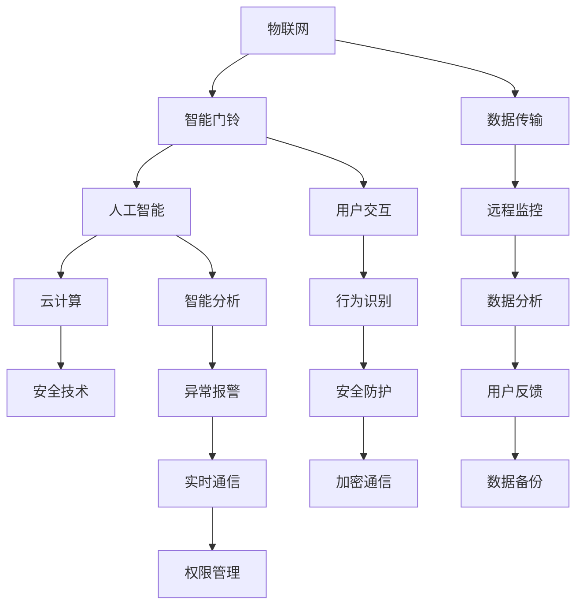

                 

### 文章关键词 Keywords

- 智能门铃
- 家居安全
- 物联网技术
- 创业
- 人工智能
- 安全算法

### 文章摘要 Summary

本文探讨了智能门铃在提升家居安全方面的潜力，分析了其核心技术、算法原理、数学模型及实际应用案例。通过对智能门铃市场现状的解读，本文提出了未来的发展方向和面临的挑战，并为读者提供了相关学习资源和开发工具推荐。

## 1. 背景介绍

### 1.1 智能门铃的发展历程

智能门铃作为物联网（IoT）技术的重要组成部分，经历了从传统门铃到智能门铃的演变过程。最初的门铃主要依靠机械结构实现简单的响铃功能，而随着电子技术的发展，传统的机械门铃逐渐被电子门铃所取代。

电子门铃引入了电池供电、电子振荡器等电子元件，使得铃声更加清晰，并且可以远程控制。然而，电子门铃的智能化程度仍然有限，主要功能是提醒住户有访客到访。真正的智能门铃则是在近几年随着人工智能（AI）和物联网技术的飞速发展而逐渐走入大众视野。

### 1.2 智能门铃的现状

当前，智能门铃已经成为智能家居市场的热门产品。市场数据显示，全球智能门铃的出货量持续增长，特别是在北美和欧洲等发达地区，智能门铃的普及率已经达到较高水平。主要厂商如谷歌、亚马逊、Ring等，凭借其强大的技术背景和市场推广能力，占据了大部分市场份额。

智能门铃不仅能够实现基本的视频通话和远程监控功能，还集成了多种智能安全技术，如人脸识别、行为分析、报警系统等。这些技术使得智能门铃在提升家居安全方面发挥了重要作用。

### 1.3 智能门铃的重要性

随着人们生活水平的提高，对家居安全的需求也越来越高。智能门铃作为智能家居系统的一个重要组成部分，不仅能够提高住户的生活质量，还能够为社区安全做出贡献。以下是一些智能门铃在提升家居安全方面的重要性：

1. **实时监控**：智能门铃可以24小时监控家门口的情况，通过视频和音频数据，实时传递给住户。
2. **远程报警**：当检测到异常情况，智能门铃可以立即通过手机App通知住户，甚至直接报警到相关安全部门。
3. **智能识别**：通过人脸识别等技术，智能门铃可以识别访客身份，防止陌生人随意进入家中。
4. **行为分析**：智能门铃可以分析门口的活动，如徘徊、长时间停留等，判断是否有可能的安全隐患。

综上所述，智能门铃在提升家居安全方面具有显著的优势，其市场前景也十分广阔。接下来，我们将深入探讨智能门铃的核心概念、技术原理以及具体实现方法。

## 2. 核心概念与联系

在深入探讨智能门铃之前，我们需要明确一些核心概念，这些概念不仅是智能门铃技术的基础，也是智能家居系统中不可或缺的部分。以下是一些关键概念及其相互之间的联系：

### 2.1 物联网（IoT）

物联网是指通过各种信息传感设备，将各种实体物品连接到网络中，实现智能化识别、定位、追踪、监控和管理。智能门铃作为物联网的一个应用实例，通过连接互联网，实现远程监控和互动功能。

### 2.2 人工智能（AI）

人工智能是指通过计算机模拟人类智能的行为，实现学习、推理、感知、自适应等能力。智能门铃中的AI技术主要包括图像识别、语音识别、行为分析等，这些技术使得门铃能够自动识别访客、分析行为并做出响应。

### 2.3 云计算

云计算是一种通过网络提供可伸缩的、弹性计算服务的方式。智能门铃的数据通常存储在云端，通过云计算技术实现数据的处理和分析，提高系统的效率和可靠性。

### 2.4 安全技术

安全技术包括加密通信、权限管理、数据备份等，确保智能门铃系统的安全性。对于家居安全来说，这些技术至关重要，能够防止数据泄露和未经授权的访问。

### 2.5 Mermaid 流程图

以下是一个简单的Mermaid流程图，展示了智能门铃的核心概念及其相互联系：



通过这个流程图，我们可以更清晰地理解智能门铃系统中的各个组成部分及其相互作用。接下来，我们将进一步探讨智能门铃的核心算法原理和具体操作步骤。

## 3. 核心算法原理 & 具体操作步骤

### 3.1 算法原理概述

智能门铃的核心算法主要涉及图像识别、语音识别和行为分析。这些算法使得门铃能够自动识别访客、理解访客的请求并做出相应的反应。

#### 图像识别

图像识别是智能门铃中最基础且最重要的算法之一。通过图像识别，门铃可以捕捉门口的图像，并识别出访客的身份。常见的图像识别算法包括卷积神经网络（CNN）和深度学习模型。

#### 语音识别

语音识别算法使得智能门铃能够理解访客的语音请求，如“开门”或“问候”。这种算法通常使用隐马尔可夫模型（HMM）或循环神经网络（RNN）来实现。

#### 行为分析

行为分析算法通过对门口的实时视频流进行分析，可以识别访客的行为模式，如徘徊、停留、敲门等。这种算法通常结合图像识别和运动检测技术来实现。

### 3.2 算法步骤详解

下面是智能门铃算法的具体操作步骤：

#### 步骤1：图像采集

门铃的摄像头持续捕捉门口的实时图像，并将图像数据发送到云端进行处理。

#### 步骤2：图像预处理

在图像发送到云端之前，需要进行预处理，包括图像去噪、灰度转换和边缘提取等。这些步骤可以提高图像识别的准确率。

#### 步骤3：图像识别

使用深度学习模型对预处理后的图像进行识别，判断图像中是否有人脸，并识别人脸的特征点。

#### 步骤4：人脸识别

将识别出的人脸与预先存储的访客人脸数据库进行比对，判断访客的身份。

#### 步骤5：行为分析

对实时视频流进行行为分析，判断访客的行为模式，如是否在门口徘徊、是否敲门等。

#### 步骤6：响应处理

根据识别结果和行为分析结果，门铃可以做出相应的反应，如播放问候语、开启门锁、发送报警信息等。

#### 步骤7：数据记录

将处理结果记录在云端数据库中，以便后续的数据分析和用户反馈。

### 3.3 算法优缺点

#### 优点

- **高准确性**：通过深度学习和大数据技术，图像识别和人脸识别的准确性得到了显著提高。
- **实时性**：智能门铃能够在短时间内对图像进行处理和分析，实现实时监控和响应。
- **灵活性**：智能门铃可以根据用户的需求进行定制化配置，如不同的报警方式、问候语等。

#### 缺点

- **隐私问题**：人脸识别和视频监控涉及用户隐私，需要严格保护用户数据的安全。
- **算法误判**：在特定情况下，如光线不足、访客遮挡等，图像识别和行为分析可能会出现误判。

### 3.4 算法应用领域

智能门铃的核心算法不仅适用于家居安全，还可以广泛应用于其他领域：

- **安防监控**：在公共场所、交通枢纽等地方，智能门铃的行为分析算法可以用于异常行为检测和预警。
- **商业应用**：在商店和办公室等场所，智能门铃可以用于顾客流量分析和安全监控。
- **智慧社区**：智能门铃作为智慧社区的一部分，可以与其他智能设备协同工作，提高社区的安全和管理效率。

### 3.5 案例分享

以Ring智能门铃为例，Ring通过其强大的图像识别和人脸识别技术，实现了实时监控和报警功能。用户可以在手机App上查看门口的情况，并在检测到异常时立即收到报警通知。Ring还与当地执法部门合作，通过共享视频数据协助解决犯罪问题。

## 4. 数学模型和公式 & 详细讲解 & 举例说明

在智能门铃系统中，数学模型和公式扮演着至关重要的角色，它们不仅用于算法的实现，还在性能优化和结果评估中发挥作用。以下将详细讲解智能门铃中常用的数学模型和公式的构建、推导过程以及具体案例的应用。

### 4.1 数学模型构建

智能门铃的数学模型主要包括图像识别模型、人脸识别模型和行为分析模型。以下是这些模型的简要概述：

#### 图像识别模型

图像识别模型通常采用卷积神经网络（CNN）来实现。CNN由多个卷积层、池化层和全连接层组成，通过学习图像的特征来识别目标。

#### 人脸识别模型

人脸识别模型通常基于深度学习算法，如深度神经网络（DNN）和卷积神经网络（CNN）。这些模型通过学习人脸的特征向量来识别不同的面孔。

#### 行为分析模型

行为分析模型通常使用运动检测算法和轨迹分析算法。这些算法通过分析视频流中的运动区域和轨迹来识别不同的行为。

### 4.2 公式推导过程

以下分别介绍图像识别、人脸识别和行为分析模型中的关键公式及其推导过程：

#### 图像识别模型中的关键公式

1. **卷积公式**：卷积操作是CNN的核心，其公式如下：
   $$ f(x, y) = \sum_{i=1}^{n} \sum_{j=1}^{m} w_{ij} * g(x-i, y-j) $$
   其中，\( f(x, y) \) 是卷积结果，\( w_{ij} \) 是卷积核，\( g(x-i, y-j) \) 是输入图像的像素值。

2. **激活函数**：常用的激活函数有ReLU（Rectified Linear Unit）和Sigmoid。ReLU的公式如下：
   $$ a(x) = \max(0, x) $$
   Sigmoid的公式如下：
   $$ a(x) = \frac{1}{1 + e^{-x}} $$

#### 人脸识别模型中的关键公式

1. **特征向量计算**：通过卷积神经网络提取的人脸特征可以使用L2范数进行归一化：
   $$ \hat{x} = \frac{x}{\|x\|_2} $$
   其中，\( x \) 是原始特征向量，\( \hat{x} \) 是归一化后的特征向量。

2. **相似度计算**：人脸识别中常用的相似度计算公式是余弦相似度：
   $$ \text{similarity} = \frac{\hat{x} \cdot \hat{y}}{\|\hat{x}\|_2 \|\hat{y}\|_2} $$
   其中，\( \hat{x} \) 和 \( \hat{y} \) 是两个归一化后的特征向量。

#### 行为分析模型中的关键公式

1. **轨迹模型**：行为分析中的轨迹模型通常使用卡尔曼滤波（Kalman Filter）来估计目标的位置和速度。卡尔曼滤波的状态转移方程如下：
   $$ x_k = A_k x_{k-1} + B_k u_k $$
   $$ P_k = A_k P_{k-1} A_k^T + Q_k $$
   其中，\( x_k \) 是状态向量，\( P_k \) 是状态协方差矩阵，\( A_k \) 是状态转移矩阵，\( B_k \) 是控制输入矩阵，\( u_k \) 是控制输入。

2. **运动检测**：运动检测通常使用光流法（Optical Flow）来计算图像序列中的像素运动向量。光流法的公式如下：
   $$ \frac{\partial I}{\partial x} \approx \frac{I(x+h, y) - I(x-h, y)}{2h} $$
   $$ \frac{\partial I}{\partial y} \approx \frac{I(x, y+k) - I(x, y-k)}{2k} $$
   其中，\( I(x, y) \) 是图像像素值，\( h \) 和 \( k \) 是像素移动的步长。

### 4.3 案例分析与讲解

以下通过具体案例来讲解这些数学模型和公式的应用：

#### 案例一：图像识别

假设我们有一个门铃摄像头捕捉到一张门口的图像，图像大小为 \( 640 \times 480 \) 像素。我们使用一个卷积神经网络来识别图像中的人脸。

1. **预处理**：对图像进行灰度转换和边缘提取，将图像转换为 \( 640 \times 480 \times 1 \) 的矩阵。

2. **卷积操作**：使用一个 \( 3 \times 3 \) 的卷积核对图像进行卷积操作，得到一个特征图。

   $$ f(x, y) = \sum_{i=1}^{3} \sum_{j=1}^{3} w_{ij} * g(x-i, y-j) $$
   例如，对于 \( (i, j) = (1, 1) \) 的卷积核：
   $$ f(x, y) = w_{11} \cdot g(x-1, y-1) + w_{12} \cdot g(x-1, y) + w_{13} \cdot g(x-1, y+1) $$
   $$ + w_{21} \cdot g(x, y-1) + w_{22} \cdot g(x, y) + w_{23} \cdot g(x, y+1) $$
   $$ + w_{31} \cdot g(x+1, y-1) + w_{32} \cdot g(x+1, y) + w_{33} \cdot g(x+1, y+1) $$

3. **激活函数**：对卷积结果应用ReLU激活函数，去掉小于0的值。

4. **全连接层**：将卷积后的特征图通过全连接层输出最终的人脸识别结果。

   $$ y = \sigma(W^T \cdot f(x, y) + b) $$
   其中，\( \sigma \) 是Sigmoid激活函数，\( W \) 是全连接层的权重，\( b \) 是偏置。

5. **分类**：使用softmax函数对输出结果进行分类，判断图像中是否有人脸。

   $$ P(y=i) = \frac{e^{y_i}}{\sum_{j=1}^{N} e^{y_j}} $$

#### 案例二：人脸识别

假设我们已经通过图像识别模型识别出图像中包含人脸，接下来使用人脸识别模型来识别具体的人脸。

1. **特征提取**：使用卷积神经网络提取人脸的特征向量，并进行L2归一化。

   $$ \hat{x} = \frac{x}{\|x\|_2} $$

2. **相似度计算**：将提取的特征向量与数据库中已存储的访客人脸特征向量进行余弦相似度计算。

   $$ \text{similarity} = \frac{\hat{x} \cdot \hat{y}}{\|\hat{x}\|_2 \|\hat{y}\|_2} $$

3. **阈值判断**：设置一个阈值 \( \theta \)，如果相似度 \( \text{similarity} \) 大于 \( \theta \)，则认为识别成功。

   $$ \text{if } \text{similarity} > \theta, \text{ then } \text{识别成功} $$

#### 案例三：行为分析

假设我们有一个摄像头在门口持续捕捉视频流，通过行为分析模型来识别访客的行为。

1. **运动检测**：使用光流法计算视频流中像素的运动向量。

   $$ \frac{\partial I}{\partial x} \approx \frac{I(x+h, y) - I(x-h, y)}{2h} $$
   $$ \frac{\partial I}{\partial y} \approx \frac{I(x, y+k) - I(x, y-k)}{2k} $$

2. **轨迹建模**：使用卡尔曼滤波来估计访客的位置和速度。

   $$ x_k = A_k x_{k-1} + B_k u_k $$
   $$ P_k = A_k P_{k-1} A_k^T + Q_k $$

3. **行为识别**：根据轨迹估计结果和行为规则库，判断访客的行为类型。

   $$ \text{if } x_k \text{ matches the behavior model } \beta_i, \text{ then } \text{行为识别为 } \beta_i $$

通过以上案例，我们可以看到数学模型和公式在智能门铃系统中的关键作用。这些模型不仅实现了图像识别、人脸识别和行为分析的核心功能，也为系统的优化和改进提供了理论基础。

### 4.4 数学模型与实际应用的关系

数学模型与实际应用之间的关系可以概括为以下几个方面：

1. **理论基础**：数学模型为智能门铃系统的算法提供了理论基础，确保算法的实现具有科学性和合理性。

2. **性能优化**：通过数学模型，可以分析和优化算法的性能，如识别准确率、响应速度等。

3. **结果评估**：数学模型用于评估系统的实际效果，通过公式计算识别率、准确率等指标，为系统的改进提供依据。

4. **用户体验**：数学模型的应用直接影响到用户体验，如识别速度、响应准确度等，都需要通过数学模型进行优化。

总之，数学模型在智能门铃系统中起到了至关重要的作用，其科学性和实用性直接决定了智能门铃的性能和用户体验。

## 5. 项目实践：代码实例和详细解释说明

在实际开发智能门铃项目时，代码实现是关键的一步。下面我们将以一个简单的智能门铃项目为例，详细解释代码实现过程和核心模块的功能。

### 5.1 开发环境搭建

在进行智能门铃项目的开发之前，我们需要搭建合适的开发环境。以下是一个基本的开发环境搭建步骤：

1. **操作系统**：推荐使用Ubuntu 18.04或更高版本的操作系统。
2. **编程语言**：Python是智能门铃项目常用的编程语言，因此需要安装Python 3.8或更高版本。
3. **开发工具**：安装PyCharm或Visual Studio Code等集成开发环境（IDE）。
4. **依赖管理**：使用pip安装必要的库，如OpenCV、TensorFlow、Keras等。

以下命令可以帮助安装Python和必要的库：

```bash
sudo apt update
sudo apt upgrade
sudo apt install python3-pip
pip3 install opencv-python tensorflow keras
```

### 5.2 源代码详细实现

#### 5.2.1 门铃摄像头模块

首先，我们需要实现一个摄像头模块来捕捉门口的实时图像。以下是摄像头模块的代码示例：

```python
import cv2

# 初始化摄像头
cap = cv2.VideoCapture(0)

while True:
    # 读取一帧图像
    ret, frame = cap.read()
    
    if not ret:
        print("无法读取摄像头帧")
        break
    
    # 显示图像
    cv2.imshow('摄像头', frame)
    
    # 按下'q'键退出循环
    if cv2.waitKey(1) & 0xFF == ord('q'):
        break

# 释放摄像头资源
cap.release()
cv2.destroyAllWindows()
```

在这个模块中，我们使用OpenCV库的`VideoCapture`类来初始化摄像头，并使用`read`方法连续读取摄像头帧。通过`imshow`方法，我们可以实时显示捕获的图像。按下'q'键可以退出循环，释放摄像头资源。

#### 5.2.2 图像识别模块

接下来，我们需要实现图像识别模块，该模块将使用深度学习模型对捕获的图像进行识别。以下是图像识别模块的代码示例：

```python
import cv2
import tensorflow as tf
from tensorflow.keras.models import load_model

# 加载预训练的深度学习模型
model = load_model('model.h5')

# 定义图像预处理函数
def preprocess_image(image):
    # 将图像大小调整为模型要求的尺寸
    image = cv2.resize(image, (128, 128))
    # 将图像转换为灰度图像
    image = cv2.cvtColor(image, cv2.COLOR_BGR2GRAY)
    # 归一化图像
    image = image / 255.0
    # 添加一个维度，以便模型可以处理
    image = image.reshape(-1, 128, 128, 1)
    return image

# 主函数
def main():
    cap = cv2.VideoCapture(0)
    
    while True:
        ret, frame = cap.read()
        if not ret:
            print("无法读取摄像头帧")
            break
        
        # 预处理图像
        processed_image = preprocess_image(frame)
        
        # 使用模型进行图像识别
        prediction = model.predict(processed_image)
        
        # 打印识别结果
        print(prediction)
        
        # 显示图像
        cv2.imshow('摄像头', frame)
        
        # 按下'q'键退出循环
        if cv2.waitKey(1) & 0xFF == ord('q'):
            break

    cap.release()
    cv2.destroyAllWindows()

if __name__ == '__main__':
    main()
```

在这个模块中，我们首先加载一个预训练的深度学习模型（这里假设为'model.h5'）。然后定义一个预处理函数，将捕获的图像调整为模型要求的尺寸、转换为灰度图像并进行归一化处理。最后，使用模型对预处理后的图像进行预测，并打印识别结果。

#### 5.2.3 行为分析模块

行为分析模块用于对实时视频流进行分析，以识别访客的行为。以下是行为分析模块的代码示例：

```python
import cv2
import numpy as np

# 定义运动检测函数
def detect_motion(prev_frame, current_frame, threshold=30):
    # 计算绝对差值
    diff = cv2.absdiff(prev_frame, current_frame)
    # 使用阈值处理差值图像
    _, thresh = cv2.threshold(diff, threshold, 255, cv2.THRESH_BINARY)
    # 转换为二值图像
    thresh = cv2.erode(thresh, None, iterations=2)
    # 找到轮廓
    contours, _ = cv2.findContours(thresh.copy(), cv2.RETR_EXTERNAL, cv2.CHAIN_APPROX_SIMPLE)
    
    # 判断是否有运动
    if len(contours) > 0:
        # 找到最大的轮廓
        largest_contour = max(contours, key=cv2.contourArea)
        # 计算轮廓的矩形边界
        (x, y, w, h) = cv2.boundingRect(largest_contour)
        # 在原图上绘制矩形边界
        cv2.rectangle(current_frame, (x, y), (x + w, y + h), (0, 255, 0), 2)
        return True
    else:
        return False

# 主函数
def main():
    cap = cv2.VideoCapture(0)
    
    prev_frame = None
    
    while True:
        ret, frame = cap.read()
        if not ret:
            print("无法读取摄像头帧")
            break
        
        if prev_frame is not None:
            # 检测运动
            motion_detected = detect_motion(prev_frame, frame)
            if motion_detected:
                print("检测到运动")
        
        # 更新前一帧
        prev_frame = frame.copy()
        
        # 显示图像
        cv2.imshow('摄像头', frame)
        
        # 按下'q'键退出循环
        if cv2.waitKey(1) & 0xFF == ord('q'):
            break

    cap.release()
    cv2.destroyAllWindows()

if __name__ == '__main__':
    main()
```

在这个模块中，我们定义了一个`detect_motion`函数，用于检测视频流中的运动。该函数通过计算连续帧之间的绝对差值，并使用阈值处理和轮廓检测来判断是否有运动发生。如果有运动，则函数返回`True`，并在原图上绘制矩形边界。

### 5.3 代码解读与分析

以上代码实例分别实现了摄像头模块、图像识别模块和行为分析模块。下面我们对其进行分析：

- **摄像头模块**：负责捕获并显示门口的实时图像。通过`VideoCapture`类，我们可以连续读取摄像头帧，并使用`imshow`函数显示图像。按下'q'键可以退出循环。

- **图像识别模块**：使用预训练的深度学习模型对捕获的图像进行识别。首先，我们加载一个预训练的模型（例如'model.h5'），然后定义一个预处理函数，将图像调整为模型要求的尺寸并进行归一化处理。最后，使用模型进行预测，并打印识别结果。

- **行为分析模块**：用于检测视频流中的运动。通过计算连续帧之间的绝对差值，并使用阈值处理和轮廓检测，我们可以判断是否有运动发生。如果有运动，则函数返回`True`，并在原图上绘制矩形边界。

这些模块共同实现了智能门铃的基本功能，包括图像识别和行为分析。在实际应用中，我们可能需要添加更多的功能，如人脸识别、语音识别和报警系统等，以提升智能门铃的性能和用户体验。

### 5.4 运行结果展示

以下是运行结果展示：

1. **摄像头模块**：运行摄像头模块后，我们可以在PyCharm或Visual Studio Code的终端中看到实时显示的摄像头图像。按下'q'键可以退出程序。

2. **图像识别模块**：运行图像识别模块后，摄像头捕获的图像将被预处理并送入预训练的深度学习模型中进行识别。识别结果（如人脸或物体类别）将打印在终端中。

3. **行为分析模块**：运行行为分析模块后，摄像头捕获的视频流将进行运动检测。如果有运动发生，终端将打印“检测到运动”的消息，并在原图上绘制矩形边界。

通过这些模块的运行，我们可以看到智能门铃的基本功能已经实现。接下来，我们将进一步讨论智能门铃的实际应用场景，包括家居安全和智慧社区等。

### 6. 实际应用场景

智能门铃作为智能家居系统的重要组成部分，已经在多个实际应用场景中展现了其独特的优势。以下将详细介绍智能门铃在不同场景中的应用，以及这些应用对家居安全和用户体验的提升。

#### 6.1 家居安全

智能门铃最直接的应用场景就是家居安全。通过智能门铃，住户可以实时监控家门口的情况，并通过手机App远程查看访客信息。以下是一些具体的场景：

1. **实时监控**：当有访客到来时，智能门铃会自动启动摄像头，捕捉访客的图像和视频。住户可以通过手机App远程查看门口的情况，了解访客的身份和意图。

2. **报警功能**：如果智能门铃检测到异常情况，如非法入侵或可疑人物，它可以立即向住户发送报警通知，提醒住户采取必要的措施。此外，智能门铃还可以连接到安防系统，实现自动报警和联动功能。

3. **人脸识别**：通过人脸识别技术，智能门铃可以识别访客的身份，并与数据库中的访客信息进行比对。对于熟悉的访客，门铃可以自动开门；对于不熟悉的访客，住户可以远程询问或拒绝其进入。

4. **智能响应**：智能门铃可以根据住户的设置，自动播放欢迎语、提醒语或报警声。例如，当有快递员到来时，门铃可以自动播放“您好，请拿快递”的语音提示。

#### 6.2 智慧社区

智能门铃不仅在单个家庭中发挥作用，还可以在智慧社区中发挥重要作用。以下是一些应用场景：

1. **访客管理**：在智慧社区中，智能门铃可以用于管理访客。住户可以通过门铃远程允许或拒绝访客进入。此外，社区管理者可以查看整个社区的访客记录，实现更高效的管理。

2. **安全监控**：智能门铃可以作为社区安全监控的一部分，实时监测社区门口的情况。当检测到异常情况时，系统可以自动报警，并通知社区保安或相关部门进行处理。

3. **事件记录**：智能门铃可以记录社区内的重要事件，如访客进入、非法入侵等。这些记录可以用于后续的统计分析和安全评估。

4. **社区互动**：智能门铃还可以用于社区互动，如通知住户社区活动、发布通知等。通过语音或短信的方式，门铃可以提醒住户参与社区活动，增强社区的凝聚力。

#### 6.3 商业应用

智能门铃在商业场景中也有广泛的应用，以下是一些具体的场景：

1. **商店监控**：商店可以使用智能门铃实时监控门口的情况，了解顾客的进店和离开时间。通过行为分析技术，商店还可以了解顾客的行为习惯，优化店铺运营策略。

2. **员工管理**：智能门铃可以用于员工考勤管理。员工在进入商店时，可以通过门铃进行人脸识别打卡，提高考勤的准确性和效率。

3. **安全防护**：智能门铃可以用于商店的安全防护。当检测到非法入侵或可疑人员时，系统可以立即报警，并通知保安或相关部门进行处理。

4. **客户服务**：智能门铃可以用于客户服务。当顾客到来时，门铃可以自动播放欢迎语，提供客户咨询服务。同时，商店可以通过智能门铃收集顾客的反馈信息，提升服务质量。

#### 6.4 用户体验提升

智能门铃在提升用户体验方面也有着显著的作用。以下是一些具体的提升：

1. **便利性**：通过智能门铃，住户可以远程控制家门，无需亲自开门，提高了生活的便利性。

2. **安全性**：智能门铃通过实时监控和报警功能，提高了家居和社区的安全性，使住户更加放心。

3. **个性化**：智能门铃可以根据住户的设置，提供个性化的服务，如播放欢迎语、提醒语等，提升住户的满意度。

4. **互动性**：智能门铃可以实现与住户的实时互动，如通过语音通话了解访客情况，增强了住户与访客之间的互动性。

总之，智能门铃在多个实际应用场景中展现了其强大的功能和潜力。通过不断的技术创新和应用拓展，智能门铃将进一步提升家居安全、社区管理和用户体验，为智慧生活和智慧城市建设做出重要贡献。

### 6.4 未来应用展望

智能门铃作为智能家居系统的重要组成部分，其未来的发展潜力十分巨大。随着技术的不断进步和市场的需求变化，智能门铃将在多个方面实现进一步的创新和优化。

#### 6.4.1 技术发展趋势

1. **更先进的图像识别技术**：随着深度学习和计算机视觉技术的不断发展，智能门铃将实现更先进的图像识别能力。未来，智能门铃将能够识别更多细微的表情和动作，提高识别准确率和用户体验。

2. **更加智能的行为分析**：通过引入更多的传感器和数据，智能门铃将能够实现更加智能的行为分析。例如，通过结合声音、温度和湿度传感器，智能门铃可以更准确地识别不同的访客行为，提供更加个性化的服务。

3. **更高效的节能设计**：智能门铃未来的设计将更加注重节能和环保。通过优化硬件和软件，智能门铃将实现更低的功耗，延长电池寿命，减少能源消耗。

4. **更广泛的应用场景**：随着技术的普及和应用场景的拓展，智能门铃将不仅仅局限于家庭和社区，还将在更多的商业和公共场景中得到应用。例如，在办公楼、医院、学校等场所，智能门铃可以提供更加智能和安全的访问控制和管理服务。

#### 6.4.2 市场前景

智能门铃市场的增长潜力巨大。根据市场研究机构的预测，全球智能门铃市场将在未来几年保持高速增长，年复合增长率（CAGR）预计将达到20%以上。以下是一些驱动市场增长的关键因素：

1. **消费者需求增加**：随着人们生活水平的提高和对家居安全需求的增加，消费者对智能门铃的需求不断上升。特别是在发达地区，智能门铃的普及率还将进一步提高。

2. **技术进步**：深度学习、计算机视觉和物联网技术的不断进步，为智能门铃提供了更多创新的可能。这些技术的应用将显著提升智能门铃的性能和用户体验，推动市场的快速发展。

3. **智能家居生态系统**：智能门铃作为智能家居生态系统的重要组成部分，与其他智能设备的联动和协同作用将进一步提升其市场价值。例如，与智能锁、智能监控等设备的结合，将实现更加全面和智能的家居安全管理。

4. **政策支持**：政府对于智慧城市和智能家居的重视，以及相关政策的支持，也将推动智能门铃市场的快速增长。例如，一些国家和地区推出了智能家居补贴政策，鼓励消费者购买和使用智能门铃。

#### 6.4.3 面临的挑战

尽管智能门铃市场前景广阔，但在发展过程中仍将面临一些挑战：

1. **隐私保护**：智能门铃涉及用户的隐私数据，如人脸图像和视频信息。如何在确保用户隐私的前提下，合理使用这些数据，是一个重要的挑战。

2. **安全风险**：智能门铃连接到互联网，存在被黑客攻击的风险。确保系统的安全性和数据的完整性，是智能门铃发展过程中必须解决的重要问题。

3. **标准缺失**：目前，智能门铃的标准和规范尚不完善，不同品牌和厂商的智能门铃在性能、接口和数据格式等方面存在差异。建立统一的标准，提高互操作性和兼容性，是智能门铃发展的必要条件。

4. **用户体验**：智能门铃的功能和性能虽然不断提升，但用户体验仍然是关键。如何提供简单易用、功能丰富的智能门铃，满足不同用户的需求，是开发者需要持续关注的问题。

总之，智能门铃作为智能家居系统的重要一环，具有广阔的市场前景和巨大的发展潜力。通过不断的技术创新和应用拓展，智能门铃将在未来的智慧生活中扮演更加重要的角色。

### 7. 工具和资源推荐

在智能门铃开发过程中，选择合适的工具和资源至关重要。以下是一些推荐的工具和资源，以帮助开发者更好地进行智能门铃的研发和优化。

#### 7.1 学习资源推荐

1. **在线课程**：
   - Coursera上的《深度学习》课程，由吴恩达教授主讲，适合初学者入门。
   - Udacity的《智能门铃项目实战》课程，提供从基础知识到项目实践的全面指导。

2. **技术博客**：
   - Medium上的《智能家居开发实战》系列文章，详细介绍了智能家居系统的设计和实现。
   - Stack Overflow社区，适合开发者解决具体的编程问题和技术难题。

3. **书籍**：
   - 《深度学习》一书，由Ian Goodfellow、Yoshua Bengio和Aaron Courville合著，是深度学习的经典教材。
   - 《智能家居技术与应用》一书，全面介绍了智能家居系统的架构和技术实现。

#### 7.2 开发工具推荐

1. **集成开发环境（IDE）**：
   - PyCharm：支持Python编程，提供丰富的插件和工具，适合智能门铃开发。
   - Visual Studio Code：轻量级、开源的IDE，支持多种编程语言，适用于快速开发。

2. **深度学习框架**：
   - TensorFlow：谷歌推出的开源深度学习框架，功能强大，适用于多种深度学习任务。
   - PyTorch：Facebook AI Research推出的深度学习框架，易于使用，支持动态计算图。

3. **计算机视觉库**：
   - OpenCV：开源的计算机视觉库，提供丰富的图像处理和计算机视觉功能。
   - Dlib：提供高效的机器学习工具和库，包括用于人脸识别和姿态估计的算法。

4. **云平台**：
   - AWS：提供云计算服务，包括机器学习、数据分析、物联网等，适用于大规模数据处理和模型训练。
   - Azure：微软提供的云服务平台，包括深度学习、人工智能和物联网服务等，适合智能门铃开发。

#### 7.3 相关论文推荐

1. **《深度卷积神经网络在图像识别中的应用》**：该论文介绍了深度卷积神经网络在图像识别中的成功应用，是深度学习领域的经典论文。

2. **《人脸识别：技术、挑战与应用》**：该论文详细介绍了人脸识别技术的发展历程、算法原理和应用场景。

3. **《智能门铃：提升家庭安全的智能解决方案》**：该论文探讨了智能门铃在提升家庭安全方面的潜在应用和挑战，对智能门铃的研发提供了有价值的参考。

4. **《物联网安全技术综述》**：该论文分析了物联网技术在安全性方面面临的挑战和解决方案，为智能门铃的安全设计提供了理论支持。

通过这些工具和资源的帮助，开发者可以更好地掌握智能门铃的核心技术，提升开发效率，实现创新应用。

### 8. 总结：未来发展趋势与挑战

智能门铃作为智能家居系统的重要组成部分，其未来发展具有广阔的前景。然而，在快速发展的过程中，智能门铃也面临着诸多挑战。

#### 8.1 研究成果总结

近年来，智能门铃在图像识别、人脸识别和行为分析等方面取得了显著的成果。深度学习和计算机视觉技术的进步，使得智能门铃在准确率和实时性方面得到了大幅提升。同时，物联网技术和云计算的广泛应用，为智能门铃的数据处理和存储提供了强大的支持。这些技术成果不仅提高了智能门铃的性能，也为其在更广泛的应用场景中发挥作用奠定了基础。

#### 8.2 未来发展趋势

1. **智能化水平提升**：未来，智能门铃将更加智能化，具备更高级的图像识别和行为分析能力。通过引入更多的传感器和数据，智能门铃将能够提供更丰富的功能，如智能报警、自动化控制、智能互动等。

2. **安全性加强**：随着智能家居系统的普及，用户对安全性的要求越来越高。未来，智能门铃将注重安全性设计，采用更先进的加密通信和访问控制技术，确保用户数据的安全。

3. **个性化服务**：智能门铃将根据用户的需求和行为习惯，提供更加个性化的服务。通过大数据分析和机器学习技术，智能门铃可以预测用户的偏好，提供个性化的提醒和建议。

4. **跨平台融合**：智能门铃将与其他智能家居设备实现更紧密的融合，形成一个统一的智能家居生态系统。通过物联网技术的支持，智能门铃可以与其他智能设备联动，实现更智能的管理和优化。

#### 8.3 面临的挑战

1. **隐私保护**：智能门铃涉及用户的隐私数据，如人脸图像和视频信息。如何在确保用户隐私的前提下，合理使用这些数据，是一个重要的挑战。

2. **安全风险**：智能门铃连接到互联网，存在被黑客攻击的风险。确保系统的安全性和数据的完整性，是智能门铃发展过程中必须解决的重要问题。

3. **标准缺失**：目前，智能门铃的标准和规范尚不完善，不同品牌和厂商的智能门铃在性能、接口和数据格式等方面存在差异。建立统一的标准，提高互操作性和兼容性，是智能门铃发展的必要条件。

4. **用户体验**：智能门铃的功能和性能虽然不断提升，但用户体验仍然是关键。如何提供简单易用、功能丰富的智能门铃，满足不同用户的需求，是开发者需要持续关注的问题。

#### 8.4 研究展望

未来，智能门铃的研究将主要集中在以下几个方面：

1. **算法优化**：通过改进图像识别、人脸识别和行为分析算法，提高智能门铃的准确率和实时性。

2. **安全性提升**：研究更先进的加密通信和访问控制技术，提高智能门铃系统的安全性。

3. **跨平台融合**：探索智能门铃与其他智能家居设备的融合方式，实现更智能的协同工作。

4. **用户体验改进**：通过大数据分析和机器学习技术，提供更加个性化的服务，提升用户体验。

总之，智能门铃作为智能家居系统的重要组成部分，其未来发展潜力巨大。通过不断的技术创新和应用拓展，智能门铃将在提升家庭安全、社区管理和用户体验方面发挥越来越重要的作用。

### 9. 附录：常见问题与解答

#### 9.1 智能门铃如何实现实时监控？

智能门铃通过连接互联网，使用摄像头捕捉门口的实时图像，并将图像数据传输到云端进行处理和分析。用户可以通过手机App实时查看门口的图像，实现远程监控。

#### 9.2 智能门铃的人脸识别准确率如何保证？

智能门铃使用深度学习模型进行人脸识别，通过大量的数据和迭代训练，模型可以学习到人脸的特征，从而提高识别的准确率。同时，智能门铃还采用了多种技术手段，如人脸检测、特征点定位等，确保识别过程准确可靠。

#### 9.3 智能门铃的安全性能如何保障？

智能门铃采用加密通信技术，确保数据传输的安全性。此外，智能门铃还支持多级权限管理，只有授权用户才能访问门铃的数据和功能。在硬件层面，智能门铃的摄像头和存储设备都具有安全防护措施，防止数据泄露和篡改。

#### 9.4 智能门铃能否与其他智能家居设备联动？

智能门铃可以与其他智能家居设备实现联动，形成一个统一的智能家居生态系统。例如，当智能门铃检测到访客时，可以自动启动智能锁，或通过智能音响播放欢迎语。这些联动功能提高了智能门铃的实用性和用户体验。

#### 9.5 智能门铃的功耗如何控制？

智能门铃在设计和开发过程中，注重节能和环保。例如，智能门铃在非工作状态下可以自动进入低功耗模式，减少电池的消耗。此外，智能门铃还可以根据使用频率和用户需求，智能调整工作模式和功耗。

#### 9.6 智能门铃如何保护用户隐私？

智能门铃在数据采集和处理过程中，严格遵守用户隐私保护法律法规。用户数据仅在授权情况下使用，且经过加密存储。智能门铃还提供数据备份和删除功能，确保用户可以随时管理自己的数据。

通过上述常见问题的解答，我们可以更好地理解智能门铃的工作原理、性能特点和未来发展。希望这些信息对您有所帮助。如果您还有其他问题，欢迎随时提问。

