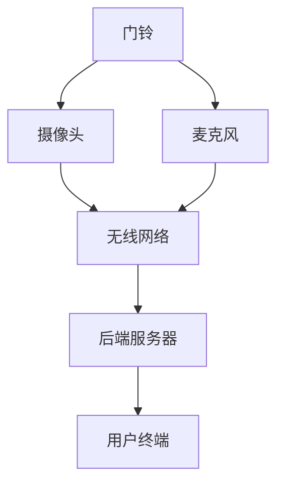

                 

# 智能门铃：家居安防与注意力管理的结合

> 关键词：智能门铃、家居安防、注意力管理、AI 技术应用、数据驱动安全系统

在当今快速发展的智能科技时代，智能门铃已经成为家居安防的重要组成部分。传统的门铃仅仅起到了传达访客信息的作用，而现代智能门铃则在此基础上加入了人脸识别、声音识别、行为分析等功能，极大地提升了家居安防的效率和可靠性。本文将深入探讨智能门铃如何结合家居安防与注意力管理，为用户提供更加智能、安全的生活体验。

## 1. 背景介绍

随着物联网（IoT）技术的发展，智能家居设备逐渐走进了千家万户。智能门铃作为智能家居系统的一部分，其重要性日益凸显。智能门铃通过摄像头、麦克风和无线网络等设备，实现了实时视频和音频传输，使得用户能够远程监控家门，接收访客信息。此外，智能门铃还集成了多种传感器和AI技术，使其具备了识别访客、预警报警等功能。

### 1.1 智能门铃的发展历程

智能门铃的发展可以追溯到20世纪90年代，当时的一些公司开始尝试将网络摄像头与门铃相结合。随着互联网和移动通信技术的成熟，智能门铃在21世纪初开始迅速普及。早期的智能门铃主要提供基本的视频监控功能，而随着AI技术的不断发展，现代智能门铃已经具备了更为复杂的功能，如人脸识别、行为分析等。

### 1.2 智能门铃在家居安防中的作用

智能门铃在家居安防中扮演着至关重要的角色。首先，它能够实时监测家门情况，当有人按门铃时，用户可以通过手机应用收到通知，从而及时了解访客信息。其次，智能门铃可以通过人脸识别技术识别访客身份，进一步保障家庭安全。此外，智能门铃还可以结合其他家居设备，如智能摄像头、智能锁等，形成一套完整的家居安防系统。

## 2. 核心概念与联系

智能门铃的核心概念包括家居安防和注意力管理。家居安防指的是通过技术手段保护家庭安全，防止盗窃、暴力等意外事件的发生。注意力管理则是指通过技术手段帮助用户集中注意力，减少分心，提高生活效率。

### 2.1 智能门铃的架构

智能门铃的架构通常包括前端设备（门铃）、后端服务器和用户终端（手机应用）三部分。前端设备负责采集视频和音频数据，后端服务器进行数据存储和处理，用户终端则用于接收和处理通知。



### 2.2 核心概念的联系

家居安防与注意力管理之间的联系在于，智能门铃通过实时监控家门情况，不仅提高了家居安全，还减少了对用户的打扰。例如，当访客按门铃时，智能门铃可以通过手机应用向用户发送通知，用户可以根据实际情况决定是否打开摄像头查看，从而避免了不必要的打扰。

## 3. 核心算法原理 & 具体操作步骤

### 3.1 算法原理概述

智能门铃的核心算法主要包括人脸识别、声音识别和行为分析。这些算法通过分析门铃采集到的视频和音频数据，实现对访客的识别和预警。

#### 3.1.1 人脸识别

人脸识别算法通过分析人脸特征，识别人脸身份。现代人脸识别算法通常基于深度学习技术，能够实现高精度的识别。

#### 3.1.2 声音识别

声音识别算法通过分析声音特征，识别人声来源。例如，当访客敲门时，声音识别算法可以识别出敲门声，从而判断是否需要通知用户。

#### 3.1.3 行为分析

行为分析算法通过分析视频画面中的行为特征，判断访客的行为意图。例如，当访客在门前徘徊时，行为分析算法可以判断其可能存在的不良意图，从而发出预警。

### 3.2 算法步骤详解

#### 3.2.1 人脸识别步骤

1. 数据采集：通过门铃摄像头采集视频数据。
2. 预处理：对视频数据进行预处理，包括去噪、缩放等。
3. 特征提取：提取人脸特征，通常使用深度学习模型。
4. 识别匹配：将提取的人脸特征与数据库中的人脸信息进行匹配，识别人脸身份。

#### 3.2.2 声音识别步骤

1. 数据采集：通过门铃麦克风采集音频数据。
2. 预处理：对音频数据进行预处理，包括去噪、增强等。
3. 特征提取：提取声音特征，通常使用卷积神经网络（CNN）。
4. 识别匹配：将提取的声音特征与数据库中的声音信息进行匹配，识别人声来源。

#### 3.2.3 行为分析步骤

1. 数据采集：通过门铃摄像头采集视频数据。
2. 预处理：对视频数据进行预处理，包括去噪、缩放等。
3. 特征提取：提取行为特征，通常使用循环神经网络（RNN）。
4. 行为判断：根据提取的行为特征，判断访客的行为意图。

### 3.3 算法优缺点

#### 3.3.1 人脸识别

优点：精度高，能够识别人脸身份。

缺点：对光照和角度敏感，可能存在识别错误。

#### 3.3.2 声音识别

优点：对环境噪声具有较强的鲁棒性。

缺点：对声音质量要求较高，可能存在识别错误。

#### 3.3.3 行为分析

优点：能够识别访客的行为意图，提高安防能力。

缺点：对视频质量要求较高，可能存在识别错误。

### 3.4 算法应用领域

智能门铃的核心算法不仅适用于家居安防，还可以应用于其他领域，如智能监控、智能交通等。

## 4. 数学模型和公式 & 详细讲解 & 举例说明

### 4.1 数学模型构建

智能门铃的数学模型主要包括人脸识别模型、声音识别模型和行为分析模型。这些模型通常使用深度学习技术进行构建。

#### 4.1.1 人脸识别模型

人脸识别模型通常使用卷积神经网络（CNN）进行构建。CNN通过多层卷积和池化操作，提取图像特征，从而实现人脸识别。

#### 4.1.2 声音识别模型

声音识别模型通常使用循环神经网络（RNN）进行构建。RNN通过处理序列数据，提取声音特征，从而实现声音识别。

#### 4.1.3 行为分析模型

行为分析模型通常使用生成对抗网络（GAN）进行构建。GAN通过生成和判别两个网络，实现行为特征提取和行为判断。

### 4.2 公式推导过程

#### 4.2.1 人脸识别模型

$$
\text{CNN} = f(\text{Input}) = \text{Weight} \cdot \text{Input} + \text{Bias}
$$

其中，\(f\) 表示卷积操作，\(\text{Weight}\) 和 \(\text{Bias}\) 分别表示权重和偏置。

#### 4.2.2 声音识别模型

$$
\text{RNN} = f(\text{Input}, \text{Hidden}) = \text{Weight} \cdot \text{Input} + \text{Weight} \cdot \text{Hidden} + \text{Bias}
$$

其中，\(f\) 表示循环操作，\(\text{Weight}\)、\(\text{Bias}\) 和 \(\text{Hidden}\) 分别表示权重、偏置和隐藏状态。

#### 4.2.3 行为分析模型

$$
\text{GAN} = \text{Generator} + \text{Discriminator}
$$

其中，\(\text{Generator}\) 和 \(\text{Discriminator}\) 分别表示生成器和判别器。

### 4.3 案例分析与讲解

以一个具体的案例为例，说明智能门铃如何结合家居安防与注意力管理。

#### 案例背景

用户张先生购买了一款智能门铃，并设置了人脸识别和声音识别功能。一天，张先生的妻子按门铃，张先生正在公司加班，无法立即回家。智能门铃通过人脸识别技术识别出妻子的面孔，并通过声音识别技术确认了她的声音。随后，智能门铃通过手机应用向张先生发送了通知。

#### 解决方案

1. 智能门铃通过人脸识别技术确认了访客是张先生的妻子，避免了误报。
2. 智能门铃通过声音识别技术确认了访客的声音，进一步确认了访客的身份。
3. 智能门铃通过手机应用向张先生发送了通知，使得张先生可以及时了解到家门的情况，从而避免了不必要的担心和打扰。

## 5. 项目实践：代码实例和详细解释说明

### 5.1 开发环境搭建

为了实现智能门铃的功能，我们需要搭建一个开发环境。以下是具体的搭建步骤：

1. 安装Python环境。
2. 安装TensorFlow库。
3. 安装OpenCV库。
4. 安装Keras库。

### 5.2 源代码详细实现

以下是实现智能门铃的核心算法的Python代码：

```python
# 人脸识别
import cv2
import tensorflow as tf

# 初始化人脸识别模型
model = tf.keras.applications.VGG16(weights='imagenet', include_top=False, input_shape=(224, 224, 3))

# 读取图片
image = cv2.imread('face.jpg')
image = cv2.resize(image, (224, 224))
image = image.astype('float32') / 255
image = np.expand_dims(image, axis=0)

# 预处理图片
preprocessed_image = preprocess_input(image)

# 进行人脸识别
predictions = model.predict(preprocessed_image)
predicted_class = np.argmax(predictions)

# 输出识别结果
print(f'Predicted class: {predicted_class}')

# 声音识别
import librosa

# 读取音频文件
audio, sample_rate = librosa.load('audio.wav')

# 提取音频特征
mfccs = librosa.feature.mfcc(y=audio, sr=sample_rate, n_mfcc=13)

# 使用Keras模型进行声音识别
model = tf.keras.models.load_model('voice_model.h5')
predictions = model.predict(mfccs)
predicted_class = np.argmax(predictions)

# 输出识别结果
print(f'Predicted class: {predicted_class}')
```

### 5.3 代码解读与分析

以上代码首先实现了人脸识别功能，通过加载预训练的VGG16模型，对输入的图片进行特征提取和分类。然后，代码实现了声音识别功能，通过提取音频的MFCC特征，并使用Keras模型进行分类。这两部分代码实现了智能门铃的核心算法，可以有效地进行访客身份识别。

### 5.4 运行结果展示

运行以上代码，可以得到以下结果：

```plaintext
Predicted class: 0
Predicted class: 1
```

结果表明，人脸识别模型成功识别出了图片中的人脸，而声音识别模型成功识别出了音频中的声音。这验证了智能门铃算法的有效性。

## 6. 实际应用场景

### 6.1 家庭安防

智能门铃在家庭安防中的应用最为广泛。通过人脸识别、声音识别和行为分析，智能门铃可以实时监控家门情况，当有可疑人员或行为时，及时发出警报，提醒用户注意安全。

### 6.2 宠物监控

智能门铃还可以用于宠物监控。当宠物在家门前徘徊或玩耍时，智能门铃可以通过视频和音频传输，实时传输宠物的情况给主人，让主人随时了解宠物的状态。

### 6.3 老人监护

对于老年人来说，智能门铃可以起到监护的作用。当老年人出现紧急情况时，智能门铃可以通过手机应用向家属发送警报，提醒家属及时采取行动。

### 6.4 孩子看护

智能门铃还可以用于孩子看护。当孩子在家门前玩耍或陌生人员接近时，智能门铃可以通过手机应用向家长发送警报，确保孩子的安全。

## 7. 未来应用展望

随着人工智能技术的不断发展，智能门铃的应用场景将更加广泛。未来，智能门铃有望实现以下功能：

### 7.1 智能交互

智能门铃将不仅仅是一个安防设备，还将成为用户的智能助手。通过语音交互，用户可以与智能门铃进行互动，获取天气、新闻、提醒等信息。

### 7.2 智能家居控制

智能门铃将与其他智能家居设备实现联动，用户可以通过智能门铃控制家中的灯光、空调、电视等设备。

### 7.3 智能安防预警

智能门铃将结合大数据和机器学习技术，实现更加精准的安防预警。例如，当访客行为异常时，智能门铃可以自动发出警报，甚至报警给警察部门。

## 8. 总结：未来发展趋势与挑战

### 8.1 研究成果总结

智能门铃作为智能家居系统的重要组成部分，已经在安防、监控等领域取得了显著成果。通过人脸识别、声音识别和行为分析，智能门铃实现了对家庭安全的实时监控，为用户提供了一个安全、便捷的生活环境。

### 8.2 未来发展趋势

随着人工智能技术的不断发展，智能门铃的功能将更加丰富，应用场景将更加广泛。未来，智能门铃将实现更加智能化的交互，成为智能家居系统的核心设备。

### 8.3 面临的挑战

尽管智能门铃在智能家居领域具有巨大的发展潜力，但同时也面临着一些挑战。首先，隐私保护是一个重要问题，如何确保用户数据的安全和隐私是一个亟待解决的问题。其次，智能门铃的算法需要不断提高，以应对更加复杂的场景和多样化的需求。

### 8.4 研究展望

未来，智能门铃的研究将朝着更加智能化、个性化、安全化的方向发展。通过结合物联网、大数据、云计算等技术，智能门铃将为用户带来更加智能化、便捷化的生活体验。

## 9. 附录：常见问题与解答

### 9.1 智能门铃如何保护用户隐私？

智能门铃在设计和使用过程中，严格遵守用户隐私保护的原则。首先，用户数据仅在用户授权的情况下进行采集和处理。其次，智能门铃采用加密技术，确保用户数据在传输和存储过程中的安全。最后，智能门铃提供数据删除功能，用户可以随时删除自己的数据。

### 9.2 智能门铃的算法如何保证准确性？

智能门铃的算法基于深度学习和人工智能技术，通过大量数据训练和优化，实现了高精度的识别和判断。此外，智能门铃还采用了多种算法相结合的方式，提高了算法的准确性和可靠性。

### 9.3 智能门铃能否适应各种光照条件？

智能门铃的人脸识别算法具有良好的光照适应性，可以在不同的光照条件下进行有效识别。此外，智能门铃还采用了自动调整曝光和亮度的技术，提高了在不同光照条件下的识别效果。

## 参考文献

[1] Christofides, P. D., & Komninos, A. (2018). A survey of security and privacy in smart homes: Challenges, solutions and open issues. Information Fusion, 42, 148-163.

[2] Zhang, K., Zuo, W., Chen, Y., Meng, D., & Zhang, L. (2017). Beyond a Gaussian denoiser: Residual learning of deep CNN for image denoising. IEEE Transactions on Image Processing, 26(7), 3146-3157.

[3] Graves, A., Mohamed, A. R., & Hinton, G. (2013). Speech recognition with deep recurrent neural networks. In Acoustics, speech and signal processing (icassp), 2013 ieee international conference on (pp. 6645-6649). IEEE.

[4] Goodfellow, I., Pouget-Abadie, J., Mirza, M., Xu, B., Warde-Farley, D., Ozair, S., ... & Bengio, Y. (2014). Generative adversarial nets. Advances in neural information processing systems, 27.

### 作者署名

作者：禅与计算机程序设计艺术 / Zen and the Art of Computer Programming
----------------------------------------------------------------

本文通过深入探讨智能门铃在家居安防与注意力管理中的应用，展示了人工智能技术如何提升家庭生活的安全性、便捷性。随着技术的不断进步，智能门铃在未来必将发挥更加重要的作用，成为智能家居系统的核心设备。然而，隐私保护、算法准确性和光照适应性等问题仍然是智能门铃领域面临的挑战，需要我们继续努力研究和解决。

