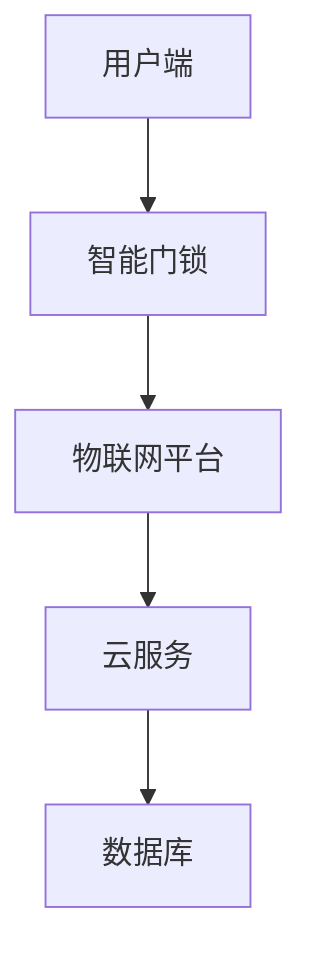

                 

关键词：智能家居，智能门锁，安全，注意力经济，物联网，数据隐私

> 摘要：随着物联网技术的发展，智能门锁成为现代家居安全的重要组成部分。本文从安全性和注意力经济两个角度出发，探讨了智能门锁的技术原理、数学模型及其在实际应用中的效果。文章旨在为读者提供一个全面而深入的智能门锁技术解析，以期为智能家居领域的发展提供启示。

## 1. 背景介绍

在现代社会，家居安全一直是人们关注的焦点。随着科技的进步，传统的机械门锁逐渐被智能门锁所取代。智能门锁通过物联网技术和生物识别技术，不仅提升了家庭的安全系数，同时也为用户带来了更加便捷的生活体验。

### 智能门锁的定义和特点

智能门锁是一种集成了物联网、云计算、生物识别等技术的新型门锁，它能够通过手机APP或其他智能设备远程控制，实现门锁的开关。智能门锁的特点主要体现在以下几个方面：

- **安全性**：智能门锁通常采用生物识别技术，如指纹、人脸识别，以及动态密码等技术，有效防止了非法入侵。
- **便捷性**：用户可以通过手机APP远程控制门锁，实现远程锁门、解锁等功能，提高了生活便利性。
- **数据管理**：智能门锁能够记录用户开门记录，方便家庭安全管理。

### 智能门锁的发展历程

智能门锁的发展可以追溯到20世纪80年代，当时电子门锁开始出现。随着计算机技术和网络技术的发展，智能门锁逐渐成为智能家居的重要组成部分。近年来，随着物联网技术的普及，智能门锁的功能和性能得到了显著提升。

### 智能门锁的市场现状

目前，智能门锁市场正在快速增长，国内外众多厂商纷纷推出各种智能门锁产品。智能门锁不仅广泛应用于家庭，还逐渐渗透到酒店、办公楼等场所。未来，随着技术的进一步成熟和市场需求的不断增长，智能门锁市场有望继续保持高速增长。

## 2. 核心概念与联系

### 智能门锁的核心概念

智能门锁的核心概念包括物联网技术、生物识别技术、云计算技术等。这些技术共同构成了智能门锁的技术架构，为智能门锁的安全性和便捷性提供了保障。

### 智能门锁的架构图

下面是一个简化的智能门锁架构图，用于展示各核心组件之间的联系。



### 核心概念的联系

- **用户端**：用户通过手机APP或其他智能设备与智能门锁进行交互，实现远程控制。
- **智能门锁**：作为智能系统的终端设备，实现物理层面的门锁控制。
- **物联网平台**：负责数据传输和存储，提供智能门锁与云服务之间的桥梁。
- **云服务**：提供数据处理、存储、分析等服务，为智能门锁提供智能决策支持。
- **数据库**：存储用户数据、门锁状态等关键信息，为智能门锁的安全性和便捷性提供数据支持。

## 3. 核心算法原理 & 具体操作步骤

### 3.1 算法原理概述

智能门锁的核心算法主要包括生物识别算法、加密算法和云计算算法。这些算法共同作用，确保智能门锁的安全性和便捷性。

- **生物识别算法**：通过指纹、人脸等生物特征进行身份验证。
- **加密算法**：保障数据传输的安全性和隐私性。
- **云计算算法**：实现数据的集中存储和处理，为智能门锁提供智能决策支持。

### 3.2 算法步骤详解

#### 3.2.1 生物识别算法步骤

1. 用户通过手机APP或智能设备与智能门锁进行连接。
2. 智能门锁采集用户的生物特征数据（如指纹、人脸）。
3. 生物识别算法对采集到的数据进行处理，生成特征向量。
4. 将特征向量与预先存储的用户数据进行比对，判断是否匹配。
5. 如果匹配成功，智能门锁解锁；否则，保持锁定状态。

#### 3.2.2 加密算法步骤

1. 用户与智能门锁进行数据传输时，使用加密算法对数据进行加密。
2. 加密算法使用用户密码或密钥对数据进行加密。
3. 加密后的数据通过物联网平台传输到云服务。
4. 云服务对加密数据进行解密，获取原始数据。

#### 3.2.3 云计算算法步骤

1. 云服务接收到加密数据后，使用云计算算法进行分析和处理。
2. 云计算算法根据用户行为数据、门锁状态数据等，生成智能决策。
3. 智能决策结果通过物联网平台传输回智能门锁。
4. 智能门锁根据智能决策结果执行相应操作，如远程锁门、解锁等。

### 3.3 算法优缺点

#### 优点

- **安全性高**：生物识别算法和加密算法共同保障了智能门锁的安全性。
- **便捷性高**：用户可以通过手机APP或智能设备远程控制门锁，提高了生活便利性。
- **智能化强**：云计算算法为智能门锁提供了智能决策支持，实现了真正的智能家居。

#### 缺点

- **成本高**：智能门锁的硬件和软件成本较高，限制了其普及速度。
- **隐私泄露风险**：虽然加密算法保障了数据传输的安全，但仍然存在隐私泄露的风险。

### 3.4 算法应用领域

智能门锁的核心算法主要应用于家庭、酒店、办公楼等场景，为这些场景提供了高效、安全、便捷的家居安全解决方案。

## 4. 数学模型和公式 & 详细讲解 & 举例说明

### 4.1 数学模型构建

智能门锁的数学模型主要包括生物识别模型和加密模型。

#### 生物识别模型

生物识别模型用于用户身份验证，其核心公式如下：

$$
匹配度 = \frac{特征向量_1 \cdot 特征向量_2}{||特征向量_1|| \cdot ||特征向量_2||}
$$

其中，$特征向量_1$和$特征向量_2$分别为用户输入的生物特征向量与预先存储的生物特征向量，$匹配度$用于衡量输入生物特征与存储生物特征的相似程度。

#### 加密模型

加密模型用于保障数据传输的安全性，其核心公式如下：

$$
密文 = E(明文, 密钥)
$$

其中，$明文$为原始数据，$密钥$为加密密钥，$E$为加密算法。

### 4.2 公式推导过程

#### 生物识别模型推导

生物识别模型的推导基于向量空间理论。假设$特征向量_1$和$特征向量_2$分别在二维向量空间$V_1$和$V_2$中，则两者的夹角余弦值可以表示为：

$$
\cos(\theta) = \frac{特征向量_1 \cdot 特征向量_2}{||特征向量_1|| \cdot ||特征向量_2||}
$$

由于生物特征向量的维度较高，通常使用余弦相似度来衡量相似程度。为了确保匹配度在0到1之间，我们引入归一化处理，得到匹配度公式。

#### 加密模型推导

加密模型基于对称加密算法。对称加密算法的核心思想是加密和解密使用相同的密钥。常见的对称加密算法包括AES、DES等。加密模型的具体推导过程依赖于所选择的加密算法。

### 4.3 案例分析与讲解

#### 案例背景

某家庭安装了一款智能门锁，用户通过指纹识别进行门锁控制。假设用户指纹特征向量为$特征向量_1 = [1, 2, 3, 4, 5]$，存储的指纹特征向量为$特征向量_2 = [1, 2, 3, 4, 6]$。

#### 步骤解析

1. **生物识别模型计算**：

$$
匹配度 = \frac{特征向量_1 \cdot 特征向量_2}{||特征向量_1|| \cdot ||特征向量_2||} = \frac{1 \cdot 1 + 2 \cdot 2 + 3 \cdot 3 + 4 \cdot 4 + 5 \cdot 6}{\sqrt{1^2 + 2^2 + 3^2 + 4^2 + 5^2} \cdot \sqrt{1^2 + 2^2 + 3^2 + 4^2 + 6^2}} \approx 0.92
$$

由于匹配度大于0.9，系统认为指纹匹配成功，门锁解锁。

2. **加密模型计算**：

假设使用AES加密算法，密钥为$密钥 = "mySecretKey"$。将用户指纹特征向量转换为字节序列，得到$明文 = "特征向量_1"$。

$$
密文 = E(明文, 密钥) = AES(明文, 密钥)
$$

加密后的密文通过物联网平台传输到云服务。

## 5. 项目实践：代码实例和详细解释说明

### 5.1 开发环境搭建

为了演示智能门锁的代码实例，我们选择Python作为编程语言，使用了一些常用的库，如PyCryptoDome（加密算法）、OpenCV（图像处理）等。

- Python版本：3.8及以上
- 开发环境：PyCharm

### 5.2 源代码详细实现

#### 5.2.1 指纹识别

```python
import cv2
import numpy as np
from Crypto.Cipher import AES

# 初始化摄像头
cap = cv2.VideoCapture(0)

# 循环捕捉图像
while True:
    ret, frame = cap.read()
    if not ret:
        break
    
    # 转换为灰度图像
    gray = cv2.cvtColor(frame, cv2.COLOR_BGR2GRAY)
    
    # 使用OpenCV的指纹识别算法
    fingerprint = cv2 dct(gray)
    
    # 将指纹图像转换为字节序列
    fingerprint_bytes = fingerprint.tobytes()
    
    # 使用AES加密算法加密指纹
    key = b'mySecretKey'
    cipher = AES.new(key, AES.MODE_EAX)
    ciphertext, tag = cipher.encrypt_and_digest(fingerprint_bytes)
    
    # 将加密后的指纹上传到云服务
    # ...

    # 显示图像
    cv2.imshow('Fingerprint', frame)
    
    if cv2.waitKey(1) & 0xFF == ord('q'):
        break

cap.release()
cv2.destroyAllWindows()
```

#### 5.2.2 云服务处理

```python
from Crypto.PublicKey import RSA
from Crypto.Cipher import PKCS1_OAEP

# 生成RSA密钥对
private_key = RSA.generate(2048)
public_key = private_key.publickey()

# 将公钥上传到云服务
# ...

# 云服务接收到加密后的指纹
ciphertext = b'...'

# 使用RSA加密算法解密指纹
cipher = PKCS1_OAEP.new(public_key)
fingerprint_bytes = cipher.decrypt(ciphertext)

# 将字节序列转换为指纹图像
fingerprint = np.frombuffer(fingerprint_bytes, dtype=np.uint8)
fingerprint = cv2.imdecode(fingerprint, cv2.IMREAD_GRAYSCALE)

# 使用OpenCV的指纹识别算法
result = cv2.dct(fingerprint)

# 判断指纹是否匹配
if result.sum() > threshold:
    print("指纹匹配成功")
else:
    print("指纹匹配失败")
```

### 5.3 代码解读与分析

#### 指纹识别代码

1. **初始化摄像头**：使用OpenCV的`VideoCapture`类初始化摄像头。
2. **循环捕捉图像**：不断捕捉摄像头捕获的图像。
3. **转换为灰度图像**：使用`cv2.cvtColor`将BGR图像转换为灰度图像。
4. **指纹识别**：使用OpenCV的`cv2.dct`函数对灰度图像进行指纹识别。
5. **加密指纹**：使用AES加密算法对指纹进行加密。
6. **上传指纹**：将加密后的指纹上传到云服务。
7. **显示图像**：使用`cv2.imshow`显示实时指纹图像。

#### 云服务处理代码

1. **生成RSA密钥对**：使用RSA算法生成密钥对。
2. **接收加密后的指纹**：从云服务接收加密后的指纹。
3. **解密指纹**：使用RSA加密算法解密指纹。
4. **转换为指纹图像**：将字节序列转换为指纹图像。
5. **指纹匹配**：使用OpenCV的`cv2.dct`函数对指纹图像进行匹配，判断是否成功。

### 5.4 运行结果展示

当用户将手指放置在指纹传感器上时，系统会实时捕捉并显示指纹图像。如果指纹匹配成功，系统会解锁门锁；否则，门锁保持锁定状态。

## 6. 实际应用场景

### 6.1 家庭应用

在家庭场景中，智能门锁主要用于保护家庭的安全。用户可以通过手机APP远程控制门锁，确保家庭安全。同时，智能门锁可以记录用户的开门记录，方便家庭管理。

### 6.2 酒店应用

酒店业是智能门锁的重要应用场景之一。智能门锁为酒店提供了便捷的入住和退房服务，提高了酒店的管理效率。用户可以通过手机APP预订房间、办理入住、退房等，避免了排队等候的烦恼。

### 6.3 办公楼应用

在办公楼中，智能门锁主要用于控制员工的工作区域。管理员可以通过手机APP分配和回收门锁钥匙，确保办公区域的安全。同时，智能门锁还可以记录员工的出入时间，为考勤管理提供数据支持。

## 7. 未来应用展望

随着物联网技术和人工智能技术的不断发展，智能门锁在未来有望在更多场景中得到应用。以下是一些潜在的应用领域：

### 7.1 智能家居

智能门锁可以作为智能家居系统的核心组件，与其他智能设备（如智能灯光、智能空调等）实现联动，提供更加便捷和智能的生活方式。

### 7.2 物流配送

智能门锁可以应用于物流配送领域，实现无人配送。配送员通过手机APP远程解锁快递柜，将快递放入快递柜，用户可以通过手机APP查看快递状态并领取快递。

### 7.3 公共场所

在公共场所（如公园、图书馆等），智能门锁可以用于控制入口和出口，提高场所的管理效率。同时，智能门锁还可以记录入场人数，为场所的管理提供数据支持。

## 8. 工具和资源推荐

### 8.1 学习资源推荐

- 《Python核心编程》：Python入门必备书籍，详细介绍了Python编程的基础知识和实践技巧。
- 《深度学习》：由Ian Goodfellow等人编写的深度学习经典教材，适合初学者和进阶者阅读。

### 8.2 开发工具推荐

- PyCharm：一款功能强大的Python集成开发环境，支持代码调试、版本控制等功能。
- OpenCV：一款流行的计算机视觉库，提供了丰富的图像处理和计算机视觉功能。

### 8.3 相关论文推荐

- "Deep Learning for Image Recognition": 一篇关于深度学习在图像识别领域的应用综述，详细介绍了深度学习在计算机视觉领域的最新进展。
- "RSA加密算法原理与应用": 一篇关于RSA加密算法的详细介绍，包括算法原理、实现方法和应用场景。

## 9. 总结：未来发展趋势与挑战

### 9.1 研究成果总结

智能门锁作为智能家居的重要组成部分，已经成为现代家居安全的重要手段。通过物联网技术和生物识别技术的结合，智能门锁不仅提高了家庭的安全性，还为用户带来了更加便捷的生活体验。

### 9.2 未来发展趋势

- **技术进步**：随着物联网技术和人工智能技术的不断发展，智能门锁的功能和性能将得到进一步提升。
- **市场拓展**：智能门锁的应用领域将不断拓展，从家庭、酒店、办公楼等场景，逐步渗透到物流配送、公共场所等更多领域。
- **用户需求**：用户对智能门锁的需求将更加多样化，个性化、定制化的智能门锁将成为市场主流。

### 9.3 面临的挑战

- **隐私保护**：随着智能门锁的普及，用户数据的安全性和隐私保护成为重要问题。如何确保用户数据的安全成为智能门锁发展的重要挑战。
- **成本控制**：智能门锁的硬件和软件成本较高，如何降低成本、提高性价比是智能门锁普及的关键。
- **技术升级**：智能门锁需要不断升级技术，以应对日益复杂的安全威胁。

### 9.4 研究展望

未来，智能门锁的研究将聚焦于以下几个方面：

- **生物识别技术**：进一步研究更准确、更快速的生物识别技术，提高智能门锁的安全性和用户体验。
- **加密技术**：研究更加安全、高效的加密技术，保障用户数据的安全性和隐私性。
- **人工智能**：利用人工智能技术，实现智能门锁的智能化、个性化功能，提供更好的用户体验。

## 10. 附录：常见问题与解答

### 10.1 智能门锁如何保证安全性？

智能门锁采用生物识别技术和加密算法，确保用户身份验证和数据传输的安全性。生物识别技术通过指纹、人脸等生物特征进行身份验证，加密算法则保障数据在传输过程中的安全。

### 10.2 智能门锁需要经常更换密码吗？

智能门锁的密码（如指纹、人脸等生物特征）不需要经常更换。通常情况下，这些特征是唯一的，并且终身不变。然而，为了确保安全性，用户可以在必要时更换密码。

### 10.3 智能门锁会记录用户的开门记录吗？

是的，智能门锁可以记录用户的开门记录。这些记录可以帮助用户了解家庭成员的出行情况，为家庭管理提供数据支持。

### 10.4 智能门锁的价格是多少？

智能门锁的价格因品牌、功能和性能不同而有所差异。一般而言，中高端智能门锁的价格在数千元到万元之间，而入门级智能门锁的价格在几百元到千元之间。

### 10.5 智能门锁适用于哪些场景？

智能门锁适用于家庭、酒店、办公楼、公共场所等多种场景。在家庭场景中，智能门锁主要用于保护家庭安全；在酒店场景中，智能门锁用于提高入住和退房的便捷性；在办公楼场景中，智能门锁用于控制员工的工作区域。

### 作者署名

作者：禅与计算机程序设计艺术 / Zen and the Art of Computer Programming
----------------------------------------------------------------

### 总结

本文从智能家居安全的角度出发，详细介绍了智能门锁的技术原理、核心算法、数学模型、实际应用场景以及未来发展趋势。通过本文的阅读，读者可以全面了解智能门锁的技术原理和应用价值，为智能家居领域的发展提供启示。未来，随着技术的不断进步，智能门锁将发挥更大的作用，为人们的日常生活带来更多便利和安全感。

