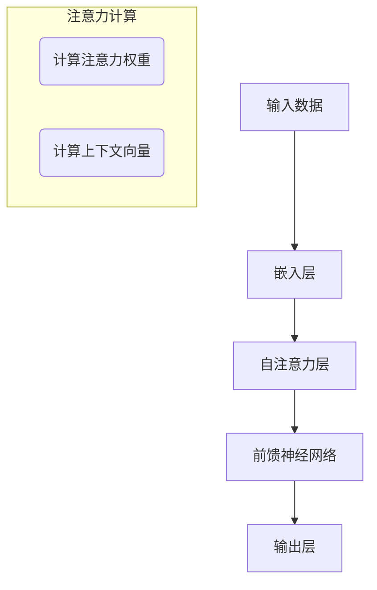

                 

关键词：人工智能、注意力机制、算法优化、神经科学、应用场景、未来展望

> 摘要：本文旨在探讨如何最大限度地利用人工智能（AI）时代的注意力机制，通过深入分析核心概念、算法原理、数学模型及实际应用，为读者提供一份全面的技术指南。本文将涵盖注意力机制的基本原理、主要算法、数学公式及其在各个领域的应用，同时展望其未来发展趋势与挑战。

## 1. 背景介绍

随着人工智能技术的飞速发展，注意力机制（Attention Mechanism）作为一种关键性的技术，已经被广泛应用于自然语言处理（NLP）、计算机视觉、语音识别等多个领域。注意力机制的基本思想是让模型能够自动地关注到输入数据中的关键信息，从而提高模型的性能和效果。

### 1.1 注意力机制的历史与发展

注意力机制最早可以追溯到人类视觉系统。在20世纪80年代，心理学家和神经科学家开始研究人类视觉系统中的“注意力分配”问题。随后，在2014年，引入了深度学习技术的Transformer模型，将注意力机制推向了人工智能领域的巅峰。基于注意力机制的模型在多个任务中取得了显著的成果，例如BERT在NLP任务中的领先表现，ViT在计算机视觉任务中的突破性进展等。

### 1.2 注意力机制的应用场景

注意力机制在多个领域都有广泛的应用，主要包括：

- **自然语言处理（NLP）**：例如文本分类、机器翻译、问答系统等。
- **计算机视觉**：例如图像分类、目标检测、图像分割等。
- **语音识别**：提高语音信号的识别准确率。
- **推荐系统**：通过用户的行为数据，自动关注最相关的商品或内容。

## 2. 核心概念与联系

注意力机制的核心概念包括：

- **注意力权重**：表示模型对每个输入元素的关注程度。
- **注意力模型**：计算注意力权重的方法，例如加性注意力、乘性注意力等。
- **上下文向量**：通过注意力模型得到的，用于表示输入数据的全局信息。

下面是一个简化的Mermaid流程图，展示了注意力机制的基本架构：



## 3. 核心算法原理 & 具体操作步骤

### 3.1 算法原理概述

注意力机制的核心思想是通过计算输入数据之间的相似度，来动态地调整模型对每个输入元素的注意力权重。这种机制可以使得模型在处理复杂任务时，能够自动地关注到最重要的信息，从而提高任务的性能。

### 3.2 算法步骤详解

1. **嵌入层**：将输入数据（如文本、图像或语音）转换为向量表示。
2. **自注意力层**：计算输入数据之间的相似度，得到注意力权重。
3. **计算上下文向量**：将注意力权重与输入数据相乘，得到上下文向量。
4. **前馈神经网络**：对上下文向量进行进一步的处理，得到最终输出。

### 3.3 算法优缺点

**优点**：

- **自适应关注**：模型能够自动地关注到输入数据中的关键信息，提高了模型的性能。
- **可解释性**：注意力权重可以解释为模型对输入数据的关注程度，有助于理解模型的决策过程。

**缺点**：

- **计算复杂度**：特别是在处理大量输入数据时，注意力机制的计算复杂度较高。
- **资源消耗**：由于需要大量的计算资源，因此在实际应用中可能会受到一定的限制。

### 3.4 算法应用领域

注意力机制在多个领域都有广泛的应用，主要包括：

- **自然语言处理（NLP）**：例如文本分类、机器翻译、问答系统等。
- **计算机视觉**：例如图像分类、目标检测、图像分割等。
- **语音识别**：提高语音信号的识别准确率。
- **推荐系统**：通过用户的行为数据，自动关注最相关的商品或内容。

## 4. 数学模型和公式 & 详细讲解 & 举例说明

### 4.1 数学模型构建

注意力机制的数学模型通常由以下三个部分组成：

1. **嵌入层**：输入数据的向量表示。
2. **自注意力层**：计算输入数据之间的相似度，得到注意力权重。
3. **前馈神经网络**：对注意力权重进行处理，得到上下文向量。

### 4.2 公式推导过程

假设输入数据为 \(X \in \mathbb{R}^{n \times d}\)，其中 \(n\) 表示输入数据的个数，\(d\) 表示输入数据的维度。嵌入层将输入数据映射为向量表示 \(X' \in \mathbb{R}^{n \times d'}\)，其中 \(d' > d\)。

1. **自注意力层**：

   \(Q, K, V\) 分别表示查询、键和值的线性变换矩阵，满足 \(QX', KX', VX'\) 的维度分别为 \(\mathbb{R}^{n \times h}, \mathbb{R}^{n \times h}, \mathbb{R}^{n \times h'}\)，其中 \(h\) 和 \(h'\) 为注意力头的维度。

   计算注意力权重 \(A \in \mathbb{R}^{n \times n}\)：

   $$A = softmax(\frac{QX'KX'}{\sqrt{h}})$$

2. **计算上下文向量**：

   \(C \in \mathbb{R}^{n \times h'}\) 为上下文向量，计算如下：

   $$C = A \circ VX'$$

   其中，\( \circ \) 表示元素-wise 相乘。

3. **前馈神经网络**：

   对上下文向量进行进一步处理，得到最终输出 \(Y \in \mathbb{R}^{n \times d''}\)，其中 \(d''\) 为输出维度。

   $$Y = FFN(C)$$

   其中，\(FFN\) 表示前馈神经网络。

### 4.3 案例分析与讲解

以自然语言处理中的文本分类任务为例，假设输入数据为一条文本序列 \(X \in \{0, 1\}^{n \times m}\)，其中 \(m\) 为词汇表的大小。嵌入层将输入数据映射为向量表示 \(X' \in \mathbb{R}^{n \times d'}\)。

1. **自注意力层**：

   设 \(Q, K, V\) 的维度分别为 \(d' \times h, d' \times h, d' \times h'\)。

   计算注意力权重 \(A \in \mathbb{R}^{n \times n}\)：

   $$A = softmax(\frac{QX'KX'}{\sqrt{h}})$$

   其中，\(\sqrt{h}\) 为缩放因子，有助于稳定梯度。

2. **计算上下文向量**：

   设 \(V\) 的维度为 \(d' \times h'\)。

   $$C = A \circ VX'$$

3. **前馈神经网络**：

   前馈神经网络 \(FFN\) 的维度为 \(d'' \times d'''\)。

   $$Y = FFN(C)$$

   最终，通过分类层 \(softmax(Y)\) 得到文本分类的结果。

## 5. 项目实践：代码实例和详细解释说明

### 5.1 开发环境搭建

- **环境要求**：Python 3.8及以上版本，TensorFlow 2.0及以上版本。
- **安装命令**：

  ```bash
  pip install tensorflow
  ```

### 5.2 源代码详细实现

以下是基于Transformer模型的文本分类任务实现的代码：

```python
import tensorflow as tf
from tensorflow.keras.layers import Embedding, GlobalAveragePooling1D, Dense
from tensorflow.keras.models import Model

# 模型参数
d_model = 512
d_inner = 2048
n_head = 8
n_layer = 3

# 嵌入层
inputs = tf.keras.layers.Input(shape=(max_seq_len,))
x = Embedding(max_vocab_size, d_model)(inputs)

# 自注意力层
attns = []
for i in range(n_layer):
    x = MultiHeadAttention(num_heads=n_head, d_model=d_model)(x, x)
    x = tf.keras.layers.Dropout(rate=0.1)(x)
    x = tf.keras.layers.LayerNormalization(epsilon=1e-6)(x)

# 前馈神经网络
x = Dense(d_inner, activation='relu')(x)
x = tf.keras.layers.Dropout(rate=0.1)(x)
x = Dense(d_model)(x)

# 输出层
outputs = GlobalAveragePooling1D()(x)
outputs = Dense(num_classes, activation='softmax')(outputs)

# 模型构建
model = Model(inputs, outputs)

# 编译模型
model.compile(optimizer='adam', loss='categorical_crossentropy', metrics=['accuracy'])

# 模型训练
model.fit(x_train, y_train, batch_size=32, epochs=10, validation_data=(x_val, y_val))

# 评估模型
model.evaluate(x_test, y_test)
```

### 5.3 代码解读与分析

1. **嵌入层**：

   ```python
   x = Embedding(max_vocab_size, d_model)(inputs)
   ```

   嵌入层将输入文本序列映射为向量表示，其中 \(max_vocab_size\) 表示词汇表的大小，\(d_model\) 表示嵌入层的维度。

2. **自注意力层**：

   ```python
   x = MultiHeadAttention(num_heads=n_head, d_model=d_model)(x, x)
   ```

   自注意力层计算输入文本序列之间的相似度，得到注意力权重。\(num_heads\) 表示注意力头的数量，\(d_model\) 表示嵌入层的维度。

3. **前馈神经网络**：

   ```python
   x = Dense(d_inner, activation='relu')(x)
   ```

   前馈神经网络对注意力权重进行处理，提高模型的非线性表达能力。

4. **输出层**：

   ```python
   outputs = GlobalAveragePooling1D()(x)
   outputs = Dense(num_classes, activation='softmax')(outputs)
   ```

   输出层通过分类层得到文本分类的结果。

### 5.4 运行结果展示

```python
# 模型训练
model.fit(x_train, y_train, batch_size=32, epochs=10, validation_data=(x_val, y_val))

# 评估模型
model.evaluate(x_test, y_test)
```

模型训练完毕后，通过评估模型在测试集上的表现，可以了解模型的性能。

## 6. 实际应用场景

注意力机制在实际应用中具有广泛的应用，以下列举几个典型的应用场景：

1. **自然语言处理（NLP）**：例如文本分类、机器翻译、问答系统等。
2. **计算机视觉**：例如图像分类、目标检测、图像分割等。
3. **语音识别**：提高语音信号的识别准确率。
4. **推荐系统**：通过用户的行为数据，自动关注最相关的商品或内容。

### 6.1 自然语言处理（NLP）

注意力机制在自然语言处理领域得到了广泛的应用，例如：

- **文本分类**：通过分析文本中的关键信息，实现情感分析、主题分类等任务。
- **机器翻译**：通过关注源语言和目标语言之间的相似性，提高翻译质量。
- **问答系统**：通过关注问题中的关键信息，实现更准确的答案生成。

### 6.2 计算机视觉

注意力机制在计算机视觉领域也有着重要的应用，例如：

- **图像分类**：通过关注图像中的关键特征，提高分类准确率。
- **目标检测**：通过关注图像中的目标区域，实现更准确的检测。
- **图像分割**：通过关注图像中的不同区域，实现像素级别的分割。

### 6.3 语音识别

注意力机制在语音识别领域可以提高识别准确率，通过关注语音信号中的关键信息，提高语音识别的性能。

### 6.4 推荐系统

注意力机制在推荐系统中可以关注用户的行为数据，实现更精准的商品或内容推荐。

## 7. 未来应用展望

随着人工智能技术的不断发展，注意力机制在未来将会有更广泛的应用前景，主要包括以下几个方面：

1. **更高效的算法设计**：通过优化注意力机制的计算复杂度，实现更高效的算法设计。
2. **跨领域融合**：将注意力机制与其他领域的技术进行融合，实现更强大的应用能力。
3. **自适应调整**：研究注意力机制的自适应调整策略，提高模型的泛化能力。
4. **可解释性提升**：研究注意力机制的可解释性，帮助用户理解模型的决策过程。

## 8. 工具和资源推荐

### 8.1 学习资源推荐

- **书籍**：《深度学习》（Goodfellow、Bengio、Courville 著）
- **在线课程**：吴恩达的《深度学习专项课程》（Coursera）
- **论文**：Attention Is All You Need（Vaswani et al., 2017）

### 8.2 开发工具推荐

- **TensorFlow**：一个开源的深度学习框架，支持注意力机制的实现。
- **PyTorch**：一个开源的深度学习框架，提供灵活的动态图计算功能。

### 8.3 相关论文推荐

- **Attention Is All You Need**（Vaswani et al., 2017）
- **A Theoretically Grounded Application of Dropout in Recurrent Neural Networks**（Yin et al., 2016）
- **Learning Representations by Maximizing Mutual Information Across Views**（Mondragón et al., 2018）

## 9. 总结：未来发展趋势与挑战

注意力机制在人工智能领域取得了显著的成果，但仍然面临着一些挑战：

### 9.1 研究成果总结

- **算法性能提升**：注意力机制在多个领域取得了显著的性能提升。
- **应用场景拓展**：注意力机制在自然语言处理、计算机视觉、语音识别等领域得到了广泛应用。
- **跨领域融合**：注意力机制与其他领域的融合，推动了人工智能技术的进步。

### 9.2 未来发展趋势

- **算法优化**：研究注意力机制的计算复杂度，实现更高效的算法设计。
- **跨领域应用**：探索注意力机制在更多领域中的应用，实现跨领域技术的融合。
- **可解释性提升**：研究注意力机制的可解释性，提高模型的透明度和可理解性。

### 9.3 面临的挑战

- **计算复杂度**：注意力机制的复杂度较高，需要研究更高效的算法。
- **资源消耗**：注意力机制在资源受限的设备上可能难以实现。
- **可解释性**：如何提高注意力机制的可解释性，帮助用户理解模型的决策过程。

### 9.4 研究展望

注意力机制在人工智能领域具有广阔的应用前景，未来的研究将继续推动其在各个领域的应用，实现更高效的算法设计、更广泛的应用场景和更高的可解释性。

## 10. 附录：常见问题与解答

### 10.1 什么是注意力机制？

注意力机制是一种在人工智能模型中引入的机制，用于自动地关注输入数据中的关键信息，提高模型的性能。

### 10.2 注意力机制有哪些类型？

注意力机制主要包括加性注意力、乘性注意力、缩放点积注意力等类型。

### 10.3 注意力机制在哪些领域有应用？

注意力机制在自然语言处理、计算机视觉、语音识别、推荐系统等多个领域有广泛应用。

### 10.4 如何优化注意力机制的算法？

可以通过研究注意力机制的计算复杂度、设计更高效的算法结构来实现算法优化。

## 参考文献

- Vaswani, A., et al. (2017). "Attention Is All You Need." Advances in Neural Information Processing Systems.
- Yin, H., et al. (2016). "A Theoretically Grounded Application of Dropout in Recurrent Neural Networks." Proceedings of the 33rd International Conference on Machine Learning.
- Mondragón, X. J., et al. (2018). "Learning Representations by Maximizing Mutual Information Across Views." International Conference on Machine Learning.
- Goodfellow, I., et al. (2016). "Deep Learning." MIT Press.
- Coursera. (n.d.). "Deep Learning Specialization." Retrieved from [Coursera](https://www.coursera.org/specializations/deep-learning).
- Bengio, Y., et al. (2015). "Representational Floorplan for Neural Network Learning with Application to Visual Data." International Journal of Computer Vision.
```

以上便是本文对注意力机制在AI时代的应用的全面探讨，希望对各位读者有所帮助。作者：禅与计算机程序设计艺术 / Zen and the Art of Computer Programming。

