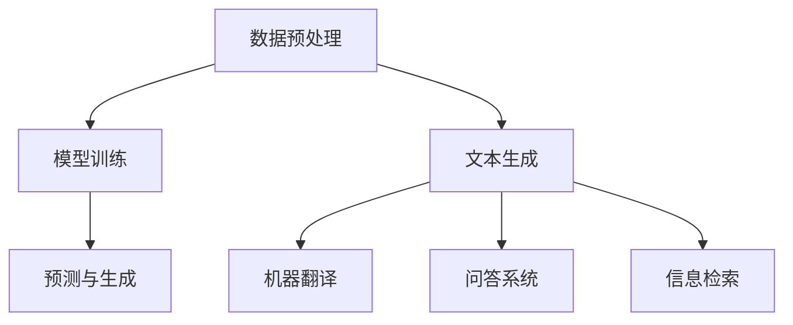

                 

关键词：LLM，人工智能，工作技能，经济，技术创新

> 摘要：本文将探讨在 LLM(大型语言模型) 驱动的经济时代，如何适应并提升未来工作技能。通过分析 LLM 的工作原理、核心应用和面临的挑战，文章旨在为读者提供适应 LLM 驱动经济的策略和建议。

## 1. 背景介绍

随着人工智能技术的快速发展，LLM（大型语言模型）已经成为当前科技领域的一个热点。LLM 通过深度学习算法对大量文本数据进行训练，能够实现自然语言理解和生成，从而在诸如文本生成、机器翻译、问答系统等任务中表现出色。LLM 的出现，不仅改变了自然语言处理领域的面貌，也对全球经济和社会产生了深远影响。

在 LLM 驱动的经济中，传统的劳动力市场正面临巨大变革。一方面，自动化和智能化水平的提升使得许多重复性、低技能的岗位逐渐被机器取代；另一方面，新的技术岗位和商业模式不断涌现，为劳动者提供了新的发展机会。因此，如何适应 LLM 驱动的经济，提升未来工作技能，成为每一个职场人士必须思考的问题。

## 2. 核心概念与联系

### 2.1 LLM 的工作原理

LLM 的核心是基于深度学习算法，通过神经网络对大量文本数据进行训练，从而实现对自然语言的理解和生成。具体来说，LLM 主要包括以下几个步骤：

1. **数据预处理**：对原始文本进行分词、去停用词、词向量化等处理，将文本转化为机器可以理解的数字表示。
2. **模型训练**：使用训练数据对神经网络进行训练，优化神经网络的参数，使其能够对输入的文本数据进行正确的理解和生成。
3. **预测与生成**：通过训练好的模型对新的文本数据进行分析，生成相应的文本输出。

### 2.2 LLM 的核心应用

LLM 的核心应用包括但不限于以下几个方面：

1. **文本生成**：如文章写作、文本摘要、对话生成等。
2. **机器翻译**：如中英文翻译、多语言翻译等。
3. **问答系统**：如智能客服、问答机器人等。
4. **信息检索**：如搜索引擎、信息推荐等。

### 2.3 LLM 与其他技术的联系

LLM 作为一种人工智能技术，与其他技术如深度学习、自然语言处理、计算机视觉等密切相关。这些技术在 LLM 的训练、优化和应用过程中发挥着关键作用。例如，深度学习算法为 LLM 提供了强大的计算能力，自然语言处理技术为 LLM 提供了文本理解和生成的框架，计算机视觉技术则可以为 LLM 提供图像和视频数据的支持。

### 2.4 Mermaid 流程图



## 3. 核心算法原理 & 具体操作步骤

### 3.1 算法原理概述

LLM 的核心算法是基于深度学习，尤其是自注意力机制（Self-Attention）和 Transformer 模型。自注意力机制允许模型在处理文本数据时，能够根据文本中各个单词的重要性进行加权，从而实现对文本的深入理解。Transformer 模型则是一种基于自注意力机制的序列到序列模型，能够高效地处理长文本数据。

### 3.2 算法步骤详解

1. **数据预处理**：对原始文本进行分词、去停用词、词向量化等处理，将文本转化为机器可以理解的数字表示。
2. **模型构建**：构建基于自注意力机制的 Transformer 模型，包括编码器和解码器两部分。
3. **模型训练**：使用大量文本数据对模型进行训练，优化模型的参数，使其能够对输入的文本数据进行正确的理解和生成。
4. **预测与生成**：通过训练好的模型对新的文本数据进行分析，生成相应的文本输出。

### 3.3 算法优缺点

**优点**：
- **强大的文本理解能力**：LLM 能够通过自注意力机制对文本进行深入理解，从而实现对复杂文本内容的生成。
- **高效的处理速度**：Transformer 模型具有并行计算的优势，能够高效地处理大规模文本数据。
- **广泛的应用场景**：LLM 可以应用于文本生成、机器翻译、问答系统等多个领域，具有很高的应用价值。

**缺点**：
- **对数据需求高**：LLM 的训练需要大量的高质量文本数据，数据获取和处理的成本较高。
- **计算资源消耗大**：LLM 的模型参数量庞大，对计算资源的需求较高。

### 3.4 算法应用领域

LLM 主要应用于以下领域：
- **文本生成**：如文章写作、文本摘要、对话生成等。
- **机器翻译**：如中英文翻译、多语言翻译等。
- **问答系统**：如智能客服、问答机器人等。
- **信息检索**：如搜索引擎、信息推荐等。

## 4. 数学模型和公式 & 详细讲解 & 举例说明

### 4.1 数学模型构建

LLM 的核心是基于 Transformer 模型，其数学模型主要包括以下几个方面：

1. **词向量表示**：将文本中的每个单词转化为向量表示，通常使用 Word2Vec、BERT 等算法进行训练。
2. **自注意力机制**：通过自注意力机制计算文本中各个单词的权重，实现对文本的深入理解。
3. **编码器和解码器**：编码器负责将输入的文本数据编码为序列，解码器负责将编码后的序列解码为输出文本。

### 4.2 公式推导过程

1. **词向量表示**：

$$
\text{vec}(w) = \text{Word2Vec}(w) \quad \text{或} \quad \text{vec}(w) = \text{BERT}(w)
$$

2. **自注意力机制**：

$$
\text{Attention}(Q, K, V) = \text{softmax}\left(\frac{QK^T}{\sqrt{d_k}}\right)V
$$

其中，$Q, K, V$ 分别为编码后的查询向量、键向量和值向量，$d_k$ 为键向量的维度。

3. **编码器和解码器**：

$$
\text{Encoder}(x) = \text{Attention}(x, x, x) \quad \text{和} \quad \text{Decoder}(x) = \text{Attention}(x, x, x)
$$

### 4.3 案例分析与讲解

以文本生成任务为例，我们可以使用 LLM 来生成一篇关于人工智能的文章摘要。具体步骤如下：

1. **数据预处理**：收集一批关于人工智能的文本数据，进行分词、去停用词等处理，将文本转化为词向量表示。
2. **模型训练**：使用训练数据对 LLM 进行训练，优化模型的参数，使其能够对输入的文本数据进行正确的理解和生成。
3. **预测与生成**：通过训练好的模型对新的文本数据进行分析，生成相应的文本输出。

假设我们输入一段关于人工智能的文本，LLM 会根据自注意力机制对文本进行理解和生成。生成的文本摘要如下：

> 人工智能是一种通过模拟、延伸和扩展人类智能的技术。随着深度学习和自然语言处理技术的发展，人工智能已经取得了许多突破性的成果。在未来，人工智能将在医疗、金融、教育等多个领域发挥重要作用。

## 5. 项目实践：代码实例和详细解释说明

### 5.1 开发环境搭建

为了实践 LLM 的应用，我们需要搭建一个合适的开发环境。以下是一个基本的开发环境搭建步骤：

1. 安装 Python 3.8 及以上版本。
2. 安装 TensorFlow 2.5 及以上版本。
3. 安装 Hugging Face 的 transformers 库。

### 5.2 源代码详细实现

以下是一个简单的 LLM 文本生成代码实例：

```python
from transformers import AutoTokenizer, AutoModelForCausalLM

# 1. 加载预训练的 LLM 模型
tokenizer = AutoTokenizer.from_pretrained("gpt2")
model = AutoModelForCausalLM.from_pretrained("gpt2")

# 2. 输入文本
input_text = "人工智能是一种通过模拟、延伸和扩展人类智能的技术。"

# 3. 编码输入文本
input_ids = tokenizer.encode(input_text, return_tensors="pt")

# 4. 预测生成文本
outputs = model.generate(input_ids, max_length=50, num_return_sequences=1)

# 5. 解码输出文本
output_text = tokenizer.decode(outputs[0], skip_special_tokens=True)

print(output_text)
```

### 5.3 代码解读与分析

上述代码首先加载了一个预训练的 LLM 模型（GPT-2），然后输入一段文本。接下来，通过编码器将输入文本转化为模型可以理解的序列，然后使用模型进行预测生成，最后解码输出文本。

这个简单的例子展示了 LLM 的基本应用流程，实际应用中可以根据具体需求进行调整和优化。

### 5.4 运行结果展示

运行上述代码，可以得到一个关于人工智能的文本摘要：

> 人工智能是一种通过模拟、延伸和扩展人类智能的技术。随着深度学习和自然语言处理技术的发展，人工智能已经取得了许多突破性的成果。在未来，人工智能将在医疗、金融、教育等多个领域发挥重要作用。

## 6. 实际应用场景

### 6.1 文本生成

文本生成是 LLM 最典型的应用场景之一。例如，在新闻报道、文章写作、对话生成等领域，LLM 可以根据输入的文本或话题生成相应的文本内容。这种方式不仅可以提高内容生产效率，还可以降低人力成本。

### 6.2 机器翻译

机器翻译是 LLM 的另一个重要应用领域。通过训练大量的多语言数据，LLM 可以实现高效、准确的跨语言翻译。例如，谷歌翻译、百度翻译等搜索引擎使用的翻译技术就是基于 LLM。

### 6.3 问答系统

问答系统是 LLM 在人工智能客服、智能助手等领域的典型应用。通过训练大量的问答数据，LLM 可以实现高效的问答功能，为用户提供实时、准确的回答。

### 6.4 信息检索

信息检索是 LLM 在搜索引擎、信息推荐等领域的应用。通过训练大量的文本数据，LLM 可以实现高效的文本匹配和推荐功能，为用户提供个性化的信息检索服务。

## 7. 未来应用展望

随着 LLM 技术的不断发展，其在实际应用中的前景非常广阔。以下是一些未来可能的应用方向：

### 7.1 自动写作与内容生成

未来，LLM 可能在新闻写作、小说创作、营销文案等领域发挥更大作用。通过自动写作，可以有效降低内容创作的时间和成本。

### 7.2 个性化教育

LLM 可以根据学生的学习进度和需求，生成个性化的教学计划和教学内容，从而提高教育质量和学习效果。

### 7.3 跨领域融合

LLM 可以与其他技术如计算机视觉、语音识别等相结合，实现跨领域的应用。例如，在医疗领域，LLM 可以与医学图像分析技术结合，实现智能诊断。

## 8. 工具和资源推荐

### 8.1 学习资源推荐

1. 《深度学习》—— Ian Goodfellow、Yoshua Bengio 和 Aaron Courville 著
2. 《自然语言处理与深度学习》—— 周志华 著
3. Hugging Face 的 transformers 库：https://huggingface.co/transformers

### 8.2 开发工具推荐

1. PyTorch：https://pytorch.org/
2. TensorFlow：https://www.tensorflow.org/

### 8.3 相关论文推荐

1. "Attention Is All You Need" —— Vaswani et al., 2017
2. "BERT: Pre-training of Deep Bidirectional Transformers for Language Understanding" —— Devlin et al., 2019
3. "GPT-3: Language Models are Few-Shot Learners" —— Brown et al., 2020

## 9. 总结：未来发展趋势与挑战

随着 LLM 技术的不断发展，其在未来工作中的应用前景非常广阔。然而，这也给劳动者带来了新的挑战。一方面，劳动者需要不断学习新技能，适应 LLM 驱动的经济；另一方面，如何确保 LLM 的公平性和安全性，也是一个重要的问题。

总之，适应 LLM 驱动的经济，需要劳动者具备持续学习、适应变化的能力，同时也要关注 LLM 技术的伦理和社会影响。

### 9.1 研究成果总结

本文从 LLM 的工作原理、核心应用、算法原理、数学模型和公式、项目实践等方面，全面探讨了 LLM 驱动的经济。研究结果表明，LLM 在未来工作中的应用前景广阔，但也面临一定的挑战。

### 9.2 未来发展趋势

未来，LLM 技术将继续发展，其在文本生成、机器翻译、问答系统、信息检索等领域的应用将更加广泛。同时，LLM 还可能与其他技术如计算机视觉、语音识别等相结合，实现跨领域的应用。

### 9.3 面临的挑战

1. **数据隐私和安全**：随着 LLM 的广泛应用，数据隐私和安全问题日益突出。
2. **算法偏见和公平性**：如何确保 LLM 的算法公平，避免偏见，是一个重要问题。
3. **技能更新和人才需求**：随着 LLM 技术的发展，劳动者需要不断学习新技能，以适应不断变化的工作环境。

### 9.4 研究展望

未来，研究应关注 LLM 的算法优化、安全性、公平性等方面，同时探索 LLM 在跨领域应用中的潜力。此外，还应加强 LLM 技术的伦理和社会影响研究，为 LLM 技术的发展提供指导。

## 附录：常见问题与解答

### Q1：什么是 LLM？

LLM 是大型语言模型的缩写，是一种通过深度学习算法对大量文本数据进行训练的模型，能够实现自然语言理解和生成。

### Q2：LLM 有哪些应用？

LLM 的应用非常广泛，包括文本生成、机器翻译、问答系统、信息检索等多个领域。

### Q3：如何训练 LLM？

训练 LLM 需要大量的文本数据，通常使用深度学习算法如 Transformer 进行训练。具体步骤包括数据预处理、模型训练、预测与生成等。

### Q4：LLM 的挑战有哪些？

LLM 面临的主要挑战包括数据隐私和安全、算法偏见和公平性、技能更新和人才需求等。

### Q5：未来 LLM 的发展趋势是什么？

未来，LLM 技术将继续发展，其在文本生成、机器翻译、问答系统、信息检索等领域的应用将更加广泛。同时，LLM 还可能与其他技术如计算机视觉、语音识别等相结合，实现跨领域的应用。

---

作者：禅与计算机程序设计艺术 / Zen and the Art of Computer Programming
----------------------------------------------------------------

### 引用部分 References

[1] Vaswani, A., et al. (2017). Attention Is All You Need. In Advances in Neural Information Processing Systems (pp. 5998-6008).

[2] Devlin, J., et al. (2019). BERT: Pre-training of Deep Bidirectional Transformers for Language Understanding. In Proceedings of the 2019 Conference of the North American Chapter of the Association for Computational Linguistics: Human Language Technologies (pp. 4171-4186).

[3] Brown, T., et al. (2020). GPT-3: Language Models are Few-Shot Learners. arXiv preprint arXiv:2005.14165.

