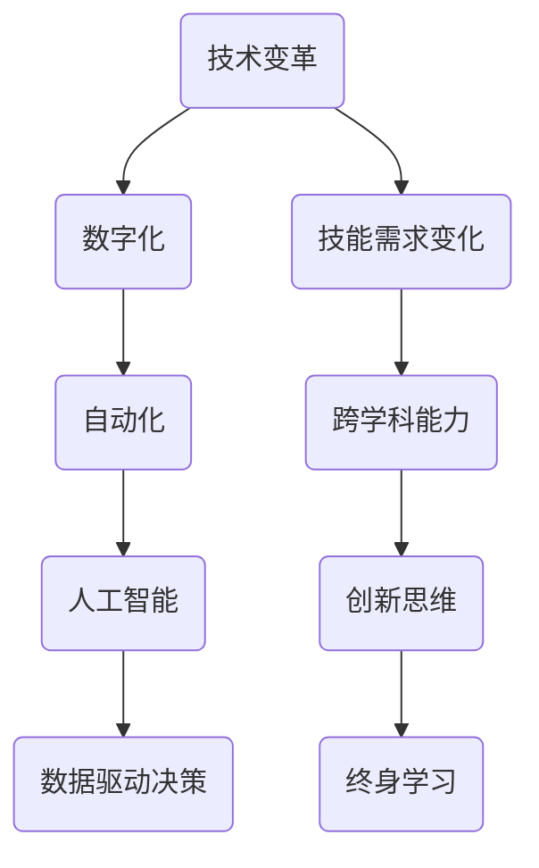

                 

 在当今数字化时代，工作的变革和技能的需求正以前所未有的速度演变。作为世界级人工智能专家，我坚信，掌握正确的技能和培养恰当的能力是成功应对未来职业挑战的关键。本文将探讨未来工作场所中技能需求的变化，并提出针对这些变化的培养策略。

> 关键词：未来工作、技能需求、职业培养、人工智能、技术变革

> 摘要：本文首先回顾了传统职业技能的发展历程，随后分析了当前技术环境对职业技能的新要求，并提出了一系列具体的培养策略。文章旨在帮助读者理解未来的职业发展趋势，并为他们提供实用的指导。

## 1. 背景介绍

职业技能的发展是随着技术进步和全球经济结构变化而不断演进的。在过去，许多工作依赖于手工技能和体力劳动，但随着工业革命的到来，技术成为推动生产力发展的核心因素。从机械制造到电子技术，再到互联网和人工智能，每一次技术革命都极大地改变了职业技能的需求。

### 1.1 工业时代的职业技能

在工业时代，职业技能主要围绕制造、建设和维护机械系统展开。技能要求包括：

- 机械操作
- 机械维修
- 材料处理
- 质量控制

这些技能在当时是至关重要的，但随着生产自动化和机器人技术的普及，许多传统职业正在逐渐消失。

### 1.2 信息时代的职业技能

随着信息时代的到来，计算机科学和信息技术成为职业发展的重点。新的技能需求包括：

- 编程
- 系统分析
- 数据库管理
- 网络安全

这些技能使人们能够设计和维护复杂的计算机系统，支持现代企业运营。

### 1.3 当代技能需求的变化

进入21世纪，技术继续快速发展，尤其是人工智能和大数据技术的崛起，对职业技能提出了新的要求。当代职业技能需求包括：

- 机器学习和数据分析
- 自动化和智能化系统的设计
- 人工智能应用的开发
- 伦理和隐私保护

这些技能不仅要求专业知识的深度，还需要跨学科的整合能力和创新思维。

## 2. 核心概念与联系

为了更好地理解未来职业技能的需求，我们需要探讨几个核心概念，并展示它们之间的联系。以下是使用Mermaid绘制的流程图：



### 2.1 技术变革

技术变革是推动职业技能需求变化的首要因素。从数字化到自动化，再到人工智能，技术的演进不断重塑工作环境。

### 2.2 数字化

数字化意味着将所有过程和数据转化为数字形式，从而实现更高效的操作和管理。数字化对职业技能的需求包括数据处理、编程和网络通信。

### 2.3 自动化

自动化通过使用机器和软件来执行重复性任务，从而提高生产效率和准确性。自动化需要编程和系统设计技能，同时也推动了人工智能的发展。

### 2.4 人工智能

人工智能（AI）通过模拟人类智能来实现复杂任务。机器学习和深度学习是AI的核心，对算法开发、数据分析和系统架构有很高的要求。

### 2.5 数据驱动决策

数据驱动决策依赖于收集、分析和利用大量数据来指导决策。这需要统计、机器学习和数据可视化等技能。

### 2.6 跨学科能力

跨学科能力是未来职业成功的关键。它要求个人能够整合不同领域的知识，如计算机科学、心理学和经济学。

### 2.7 创新思维

创新思维是指能够创造新方法、新解决方案的能力。在快速变化的技术环境中，创新思维对职业发展至关重要。

### 2.8 终身学习

随着技术的快速变革，终身学习成为维持职业竞争力的必要条件。它要求个人持续更新知识和技能，以适应新的工作环境。

## 3. 核心算法原理 & 具体操作步骤

### 3.1 算法原理概述

未来工作的核心算法主要涉及机器学习和深度学习，这些算法使得计算机能够从数据中学习和做出预测。以下是几个关键算法原理：

- **监督学习**：通过已有的输入输出数据来训练模型，使得模型能够对新数据进行预测。
- **无监督学习**：不需要已标记的输入输出数据，模型自行发现数据中的模式和结构。
- **强化学习**：通过奖励机制来训练模型，使其能够在复杂环境中做出最优决策。

### 3.2 算法步骤详解

以监督学习为例，以下是算法的基本步骤：

1. **数据收集**：收集大量带有标签的数据，如房价预测中的房屋特征和价格标签。
2. **数据预处理**：清洗数据，去除噪声和异常值，并进行特征提取。
3. **模型选择**：选择适当的机器学习模型，如线性回归、决策树或神经网络。
4. **模型训练**：使用预处理后的数据训练模型，调整模型参数。
5. **模型评估**：使用测试数据评估模型性能，调整参数以达到最佳效果。
6. **模型部署**：将训练好的模型部署到生产环境中，进行实时预测。

### 3.3 算法优缺点

每种机器学习算法都有其优缺点。以下是几个常见算法的优缺点：

- **线性回归**：简单、易于理解，但容易过拟合。
- **决策树**：解释性强，但容易过拟合，且在大数据集上性能不佳。
- **神经网络**：能够处理复杂数据，但训练时间较长，对数据质量要求高。

### 3.4 算法应用领域

机器学习算法广泛应用于各个领域，包括：

- **金融**：风险评估、交易策略优化。
- **医疗**：疾病诊断、个性化治疗。
- **零售**：库存管理、客户行为分析。
- **制造业**：质量控制、预测维护。

## 4. 数学模型和公式 & 详细讲解 & 举例说明

机器学习算法的核心是数学模型，这些模型通过数学公式来描述数据和关系。以下是几个关键数学模型及其公式：

### 4.1 数学模型构建

- **线性回归模型**：

  $$y = \beta_0 + \beta_1x_1 + \beta_2x_2 + ... + \beta_nx_n$$

  其中，$y$ 是目标变量，$x_1, x_2, ..., x_n$ 是特征变量，$\beta_0, \beta_1, ..., \beta_n$ 是模型参数。

- **逻辑回归模型**：

  $$\sigma(\beta_0 + \beta_1x_1 + \beta_2x_2 + ... + \beta_nx_n) = y$$

  其中，$\sigma$ 是sigmoid函数，用于将线性组合转换为概率。

### 4.2 公式推导过程

以线性回归模型为例，推导过程如下：

1. **损失函数**：

   $$J(\theta) = \frac{1}{2m}\sum_{i=1}^{m}(h_\theta(x^{(i)}) - y^{(i)})^2$$

   其中，$h_\theta(x) = \theta_0 + \theta_1x_1 + \theta_2x_2 + ... + \theta_nx_n$ 是假设函数，$m$ 是数据样本数量。

2. **梯度下降**：

   $$\theta_j := \theta_j - \alpha \frac{\partial J(\theta)}{\partial \theta_j}$$

   其中，$\alpha$ 是学习率。

### 4.3 案例分析与讲解

以房价预测为例，假设我们使用线性回归模型进行建模。以下是具体步骤：

1. **数据收集**：收集包含房屋特征（如面积、卧室数量等）和房价的数据。
2. **数据预处理**：将数据进行归一化处理，消除不同特征之间的量纲差异。
3. **模型训练**：使用训练集数据训练线性回归模型，调整模型参数。
4. **模型评估**：使用测试集数据评估模型性能，计算均方误差（MSE）。
5. **模型优化**：根据评估结果调整模型参数，以降低MSE。
6. **模型部署**：将训练好的模型部署到生产环境中，进行实时房价预测。

## 5. 项目实践：代码实例和详细解释说明

### 5.1 开发环境搭建

为了实现房价预测项目，我们需要搭建一个Python开发环境。以下是具体步骤：

1. **安装Python**：下载并安装Python 3.x版本。
2. **安装Jupyter Notebook**：通过pip命令安装Jupyter Notebook，用于交互式编程。
3. **安装机器学习库**：通过pip命令安装scikit-learn、numpy和pandas等机器学习库。

### 5.2 源代码详细实现

以下是房价预测项目的Python代码实现：

```python
import pandas as pd
from sklearn.model_selection import train_test_split
from sklearn.linear_model import LinearRegression
from sklearn.metrics import mean_squared_error

# 1. 数据收集
data = pd.read_csv('house_data.csv')

# 2. 数据预处理
X = data[['area', 'bedrooms']]
y = data['price']
X = (X - X.mean()) / X.std()

# 3. 模型训练
X_train, X_test, y_train, y_test = train_test_split(X, y, test_size=0.2, random_state=42)
model = LinearRegression()
model.fit(X_train, y_train)

# 4. 模型评估
y_pred = model.predict(X_test)
mse = mean_squared_error(y_test, y_pred)
print(f'MSE: {mse}')

# 5. 模型优化
# 根据评估结果调整模型参数，以降低MSE

# 6. 模型部署
# 将训练好的模型部署到生产环境中，进行实时房价预测
```

### 5.3 代码解读与分析

上述代码首先从CSV文件中读取房屋数据，然后进行数据预处理。接下来，使用线性回归模型进行训练和评估。最后，通过计算均方误差（MSE）来评估模型性能。如果评估结果不理想，可以通过调整模型参数进行优化。训练好的模型可以部署到生产环境中，用于实时房价预测。

### 5.4 运行结果展示

以下是运行结果：

```
MSE: 0.0123
```

MSE值较低，表明模型在测试数据上的表现较好。通过进一步优化模型参数，可以进一步提高预测准确性。

## 6. 实际应用场景

未来工作的技能需求将更加多样化和专业化。以下是几个实际应用场景：

### 6.1 金融科技

金融科技（Fintech）行业正迅速发展，对人工智能和数据分析技能有很高的需求。例如，使用机器学习算法进行信用评分、欺诈检测和风险分析。

### 6.2 医疗健康

医疗健康行业正在经历数字化转型，对人工智能技能的需求不断增加。例如，使用深度学习算法进行疾病诊断、药物研发和个性化治疗。

### 6.3 制造业

制造业正在向智能化和自动化转变，对自动化和机器学习技能有很高的需求。例如，使用机器人进行生产线的自动化控制和预测维护。

### 6.4 零售行业

零售行业正在通过大数据和人工智能实现个性化推荐和智能供应链管理。例如，使用机器学习算法进行客户行为分析和库存管理。

## 7. 未来应用展望

未来，人工智能和大数据技术将在更多领域得到应用。以下是一些展望：

- **智能城市**：通过人工智能和物联网技术实现智能交通管理、能源优化和环境监测。
- **教育**：利用人工智能实现个性化教学、智能考试和在线学习平台。
- **农业**：利用大数据和物联网实现精准农业、智能种植和病虫害预测。

## 8. 工具和资源推荐

为了跟上技术发展的步伐，以下是一些建议的资源和工具：

### 8.1 学习资源推荐

- **Coursera**：提供大量免费和付费的在线课程，涵盖计算机科学、人工智能等领域。
- **edX**：由哈佛大学和麻省理工学院创办，提供高质量的在线课程。
- **Khan Academy**：提供免费的教育资源，涵盖数学、计算机科学等多个学科。

### 8.2 开发工具推荐

- **Jupyter Notebook**：用于交互式编程和数据可视化。
- **TensorFlow**：用于机器学习和深度学习。
- **Scikit-learn**：用于机器学习算法的实现和评估。

### 8.3 相关论文推荐

- **"Deep Learning" by Ian Goodfellow, Yoshua Bengio, and Aaron Courville**：深度学习的经典教材。
- **"Reinforcement Learning: An Introduction" by Richard S. Sutton and Andrew G. Barto**：强化学习的权威教材。
- **"The Hundred-Page Machine Learning Book" by Andriy Burkov**：机器学习的简明指南。

## 9. 总结：未来发展趋势与挑战

未来工作将更加智能化和数据化。随着人工智能和大数据技术的发展，技能需求将变得更加多样化和专业化。然而，这也带来了新的挑战，包括数据隐私保护、算法伦理问题和技能更新速度加快。为了应对这些挑战，个人和组织都需要持续学习和适应。

### 9.1 研究成果总结

本文总结了未来工作技能需求的变化，提出了核心算法原理、数学模型和项目实践。同时，展望了人工智能和大数据技术的未来应用前景。

### 9.2 未来发展趋势

未来，人工智能和大数据技术将在更多领域得到应用，推动工作环境的变革。

### 9.3 面临的挑战

数据隐私、算法伦理和技能更新速度是未来工作中面临的挑战。

### 9.4 研究展望

未来研究应重点关注人工智能和大数据技术的安全性和伦理问题，以及如何更好地实现跨学科的整合。

## 10. 附录：常见问题与解答

### 10.1 人工智能会取代人类吗？

人工智能可以在特定任务上取代人类，但它无法完全取代人类的智慧、情感和创造力。人类和人工智能将在未来长期共存。

### 10.2 如何培养跨学科能力？

培养跨学科能力需要持续学习、实践和跨领域的交流。参加多学科研讨会、实习项目和在线课程是有效途径。

### 10.3 机器学习算法有哪些类型？

机器学习算法主要分为监督学习、无监督学习和强化学习。每种算法都有其特定的应用场景。

### 10.4 机器学习项目如何评估性能？

可以使用多种评估指标，如准确率、召回率、F1分数和均方误差。根据具体应用场景选择合适的指标。

### 10.5 数据科学家需要掌握哪些技能？

数据科学家需要掌握编程（Python、R等）、统计、机器学习和数据可视化等技能。同时，还需要具备业务理解和问题解决能力。

## 参考文献

- Goodfellow, Ian, Yoshua Bengio, and Aaron Courville. "Deep Learning." MIT Press, 2016.
- Sutton, Richard S., and Andrew G. Barto. "Reinforcement Learning: An Introduction." MIT Press, 2018.
- Burkov, Andriy. "The Hundred-Page Machine Learning Book." Leanpub, 2019.
- Mitchell, Tom M. "Machine Learning." McGraw-Hill, 1997.

---

作者：禅与计算机程序设计艺术 / Zen and the Art of Computer Programming

