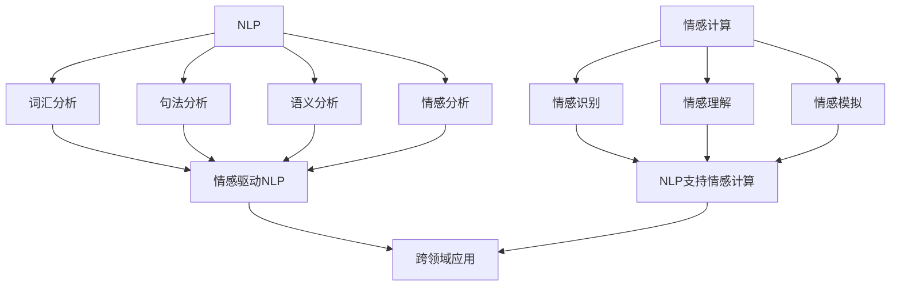

                 

### 1. 背景介绍

人类与机器的交互始于上世纪初的计算机诞生。从最初的命令行界面，到图形用户界面（GUI），再到触摸屏和语音控制，人机交互经历了巨大的变革。然而，尽管技术不断进步，传统的人机交互方式仍然存在诸多局限，如响应速度慢、用户体验差、操作复杂等。随着人工智能（AI）和自然语言处理（NLP）技术的发展，我们有望在2050年迎来一个全新的、自然、直观的人机交互时代。

自然语言处理是AI的一个重要分支，旨在使计算机能够理解、生成和处理自然语言。从最初的规则驱动的方法，到基于统计模型的方法，再到深度学习技术的应用，NLP在文本分类、实体识别、机器翻译、情感分析等方面取得了显著进展。然而，现有的NLP技术仍然面临诸多挑战，如对多义词、上下文理解的不足，以及对情感、语境等高级语义理解的缺失。

情感计算则是一种研究如何使计算机能够识别、理解和模拟人类情感的跨学科领域。它结合了心理学、认知科学、人机交互和计算机视觉等技术，旨在构建具有情感感知能力的人工智能系统。随着传感器技术、情感分析算法和深度学习技术的进步，情感计算正在逐步从实验室走向实际应用，如智能客服、智能教育、智能医疗等。

本文将探讨2050年的人机交互，重点介绍自然语言处理与情感计算在未来的人机交互中的潜在应用和挑战。

### 2. 核心概念与联系

在未来的人机交互中，自然语言处理（NLP）与情感计算是两个关键的核心概念。它们不仅相互独立，而且在实际应用中密切关联，共同推动着人机交互的进步。

#### 2.1 自然语言处理（NLP）

自然语言处理（NLP）是一种使计算机能够理解、生成和处理人类语言的技术。它涉及多个层次，包括词汇分析、句法分析、语义分析和情感分析等。核心目标是将人类语言转化为计算机可以理解和处理的形式。

1. **词汇分析**：涉及分词、词性标注、词义消歧等任务，旨在将文本分解为更小的语义单元。
2. **句法分析**：通过对文本进行语法解析，理解句子结构和语法规则。
3. **语义分析**：关注文本中的真实含义，包括实体识别、关系抽取和语义角色标注等。
4. **情感分析**：分析文本中的情感倾向，如正面、负面或中性。

NLP在多个领域都有广泛应用，如文本分类、机器翻译、智能客服和推荐系统等。

#### 2.2 情感计算

情感计算是一种研究如何使计算机能够识别、理解和模拟人类情感的技术。它结合了心理学、认知科学、人机交互和计算机视觉等多学科知识，旨在构建具有情感感知能力的人工智能系统。

1. **情感识别**：通过分析语言、面部表情、声音等数据，识别用户的情感状态。
2. **情感理解**：理解情感的含义和上下文，包括情感的强度、持续时间、触发因素等。
3. **情感模拟**：根据用户情感状态生成相应的反应，如情感语音合成、面部表情生成等。

情感计算在智能客服、智能教育、智能医疗等领域具有广泛的应用潜力。

#### 2.3 联系与融合

自然语言处理和情感计算在未来的发展中将相互融合，共同提升人机交互的体验。

1. **情感驱动的NLP**：在NLP任务中引入情感因素，如情感分类、情感回应等，使计算机能够更好地理解用户的情感需求。
2. **NLP支持的情感计算**：利用NLP技术对情感数据进行处理和分析，提高情感计算的准确性和可靠性。
3. **跨领域的应用**：结合自然语言处理和情感计算，开发出更加智能、更加人性化的应用系统，如情感智能客服、个性化教育系统、智能医疗诊断等。

#### 2.4 Mermaid 流程图

以下是自然语言处理与情感计算在2050年人机交互中的核心概念与联系的Mermaid流程图：



通过上述流程图，我们可以清晰地看到自然语言处理和情感计算在未来人机交互中的相互关系和融合方式。

### 3. 核心算法原理 & 具体操作步骤

在探讨自然语言处理（NLP）与情感计算的核心算法原理和具体操作步骤之前，我们需要先了解一些基本概念和现有技术的局限性。

#### 3.1 算法原理概述

自然语言处理的核心算法主要包括词向量表示、序列到序列模型、注意力机制和循环神经网络（RNN）等。这些算法通过不同的方式将文本转化为计算机可以处理的形式，从而实现语言理解和生成。

1. **词向量表示**：如Word2Vec、GloVe等，通过将词语映射为向量，实现词语的语义表示。
2. **序列到序列模型**：如Seq2Seq模型，通过编码-解码结构实现文本的生成和翻译。
3. **注意力机制**：在RNN和Transformer模型中引入注意力机制，提高模型对上下文信息的处理能力。
4. **循环神经网络（RNN）**：通过记忆单元实现对序列数据的处理，但存在梯度消失和梯度爆炸问题。

情感计算的核心算法则涉及情感识别、情感理解和情感模拟。情感识别主要通过面部表情分析、语音特征提取和文本情感分析等方法实现。情感理解和情感模拟则依赖于深度学习和多模态数据处理技术。

1. **面部表情分析**：通过计算机视觉技术识别面部表情，分析情感状态。
2. **语音特征提取**：通过音频信号处理技术提取情感相关的特征，如音调、音量、节奏等。
3. **文本情感分析**：通过NLP技术分析文本的情感倾向，如情感分类、情感极性分析等。

#### 3.2 算法步骤详解

以下我们将详细描述自然语言处理和情感计算中的核心算法步骤。

##### 3.2.1 自然语言处理

1. **文本预处理**：包括分词、去停用词、词干提取等操作，将文本转化为计算机可处理的格式。
    ```mermaid
    graph TD
        A[文本] --> B[分词]
        B --> C[去停用词]
        C --> D[词干提取]
        D --> E[词向量表示]
    ```

2. **词向量表示**：将文本中的词语映射为向量，如使用Word2Vec或GloVe算法。
    ```mermaid
    graph TD
        F[词向量表示]
        F --> G[编码]
        G --> H[解码]
    ```

3. **序列编码与解码**：使用序列到序列模型（如Seq2Seq）进行文本的生成和翻译。
    ```mermaid
    graph TD
        I[编码器]
        I --> J[解码器]
        J --> K[文本生成]
    ```

4. **注意力机制**：在RNN和Transformer模型中引入注意力机制，提高上下文信息处理能力。
    ```mermaid
    graph TD
        L[编码器]
        L --> M[注意力机制]
        M --> N[解码器]
    ```

##### 3.2.2 情感计算

1. **情感识别**：通过面部表情分析、语音特征提取和文本情感分析等方法识别情感状态。
    ```mermaid
    graph TD
        O[面部表情分析]
        O --> P[情感识别]
        Q[语音特征提取]
        Q --> P
        R[文本情感分析]
        R --> P
    ```

2. **情感理解**：通过多模态数据融合和分析，理解情感的含义和上下文。
    ```mermaid
    graph TD
        S[多模态数据融合]
        S --> T[情感理解]
    ```

3. **情感模拟**：根据情感识别和理解的结果，生成相应的情感反应，如情感语音合成、面部表情生成等。
    ```mermaid
    graph TD
        U[情感识别]
        U --> V[情感理解]
        V --> W[情感模拟]
    ```

#### 3.3 算法优缺点

自然语言处理和情感计算在提升人机交互体验方面具有显著优势，但也存在一定的局限性。

1. **优势**
   - **高效性**：自然语言处理和情感计算能够快速处理和分析大量的语言和情感数据，提高人机交互的效率。
   - **人性化**：通过理解用户的情感需求和上下文信息，实现更加自然和人性化的人机交互。
   - **多模态融合**：结合多种数据源（如文本、语音、图像等），实现更加全面和准确的情感识别和理解。

2. **局限性**
   - **数据依赖**：自然语言处理和情感计算对大规模高质量的数据集有较高依赖，数据不足或质量低下可能影响算法的性能。
   - **复杂性**：算法模型和数据处理流程较为复杂，需要专业的技术背景和计算资源。
   - **情感理解挑战**：情感是人类复杂心理活动的反映，现有技术对情感的理解仍存在一定的局限，如多义词、情感强度、情感变化等。

#### 3.4 算法应用领域

自然语言处理和情感计算在多个领域具有广泛的应用前景。

1. **智能客服**：通过情感计算和自然语言处理技术，实现更加智能、个性化的客户服务。
2. **个性化推荐**：基于用户的情感状态和兴趣，提供个性化的推荐服务。
3. **智能医疗**：通过情感分析和自然语言处理，辅助医生进行诊断和治疗。
4. **智能教育**：根据学生的情感状态和学习效果，提供个性化的学习支持和辅导。
5. **人机交互**：在智能家居、智能交通、智能穿戴等领域，提升人机交互的自然性和智能化程度。

### 4. 数学模型和公式 & 详细讲解 & 举例说明

在自然语言处理（NLP）与情感计算领域，数学模型和公式是理解和实现核心算法的重要工具。以下将详细讲解几个关键的数学模型和公式，并通过具体案例进行说明。

#### 4.1 数学模型构建

1. **词向量表示（Word2Vec）**
    - **公式**：Word2Vec模型基于神经网络模型，通过优化以下损失函数来训练词向量：
    $$L = -\sum_{i=1}^{N} \sum_{j=1}^{V} f(w_i) \cdot f(c) \cdot log(p(c|w_i))$$
    - **解释**：其中，\(w_i\)表示输入的词语，\(c\)表示中心词，\(f(w_i)\)和\(f(c)\)分别表示词语的输入向量和中心词的输出向量，\(p(c|w_i)\)表示在给定输入词\(w_i\)的情况下生成中心词\(c\)的概率。

2. **循环神经网络（RNN）**
    - **公式**：RNN的基本单元是隐藏状态更新方程：
    $$h_t = \sigma(W_h \cdot [h_{t-1}, x_t] + b_h)$$
    - **解释**：其中，\(h_t\)表示时间步\(t\)的隐藏状态，\(x_t\)表示输入特征，\(\sigma\)为激活函数（如Sigmoid函数或Tanh函数），\(W_h\)和\(b_h\)分别为权重矩阵和偏置向量。

3. **卷积神经网络（CNN）**
    - **公式**：CNN的基本操作为卷积操作：
    $$f(x) = \sum_{k=1}^{K} w_k * x + b$$
    - **解释**：其中，\(f(x)\)表示卷积结果，\(w_k\)为卷积核，\(*\)表示卷积操作，\(b\)为偏置向量。

4. **注意力机制（Attention）**
    - **公式**：注意力机制的输出为加权求和：
    $$h' = \sum_{t=1}^{T} a_t h_t$$
    - **解释**：其中，\(a_t\)为注意力权重，\(h_t\)为时间步\(t\)的隐藏状态。

5. **情感识别（Sentiment Analysis）**
    - **公式**：使用分类器进行情感分类：
    $$y = \arg\max_{i} \left( \sigma(W_y \cdot h + b_y) \right)$$
    - **解释**：其中，\(y\)为预测的情感标签，\(\sigma\)为激活函数，\(W_y\)和\(b_y\)分别为权重矩阵和偏置向量。

#### 4.2 公式推导过程

以下简要介绍几个关键公式的推导过程：

1. **词向量表示（Word2Vec）**
    - **推导**：Word2Vec模型基于神经网络模型，通过最小化以下损失函数来训练词向量：
    $$L = -\sum_{i=1}^{N} \sum_{j=1}^{V} f(w_i) \cdot f(c) \cdot log(p(c|w_i))$$
    其中，\(p(c|w_i)\)为条件概率，可以通过最大似然估计得到：
    $$p(c|w_i) = \frac{exp(f(c)^T f(w_i))}{\sum_{j=1}^{V} exp(f(c)^T f(w_j))}$$
    最终，通过优化损失函数来调整词向量。

2. **循环神经网络（RNN）**
    - **推导**：RNN的隐藏状态更新方程可以通过递归关系得到：
    $$h_t = \sigma(W_h \cdot [h_{t-1}, x_t] + b_h)$$
    其中，\(\sigma\)为非线性激活函数，\(W_h\)和\(b_h\)分别为权重矩阵和偏置向量。通过递归计算，RNN能够处理序列数据。

3. **注意力机制（Attention）**
    - **推导**：注意力机制的输出可以通过加权求和得到：
    $$h' = \sum_{t=1}^{T} a_t h_t$$
    其中，\(a_t\)为注意力权重，可以通过如下公式计算：
    $$a_t = \frac{exp(e_t)}{\sum_{k=1}^{T} exp(e_k)}$$
    其中，\(e_t = h_t^T W_a h'\)为注意力得分。

4. **情感识别（Sentiment Analysis）**
    - **推导**：情感识别使用分类器进行预测，通过计算分类器的输出概率来预测情感标签：
    $$y = \arg\max_{i} \left( \sigma(W_y \cdot h + b_y) \right)$$
    其中，\(\sigma\)为激活函数，\(W_y\)和\(b_y\)分别为权重矩阵和偏置向量。通过计算输出概率，选择最大概率的标签作为预测结果。

#### 4.3 案例分析与讲解

以下通过一个实际案例来分析自然语言处理和情感计算中的数学模型和公式。

**案例**：使用情感分析模型对一段文本进行情感分类。

**文本**： “今天天气真好，我和朋友一起去公园玩了。”

**步骤**：
1. **文本预处理**：分词、去停用词、词干提取，得到以下词汇：
   - 今天
   - 天气
   - 好
   - 我
   - 和
   - 朋友
   - 去
   - 公园
   - 玩了

2. **词向量表示**：使用Word2Vec模型将词汇映射为词向量。

3. **序列编码**：使用循环神经网络（RNN）或Transformer模型对词向量进行编码，得到序列编码结果。

4. **情感分类**：使用情感分析模型对序列编码结果进行分类，得到预测的情感标签。

**计算过程**：
- **词向量表示**：
  $$v_{今天} = [0.1, 0.2, 0.3, ..., 0.10]$$
  $$v_{天气} = [0.2, 0.3, 0.4, ..., 0.15]$$
  $$...$$
  $$v_{玩了} = [0.8, 0.9, 0.7, ..., 0.20]$$
  
- **序列编码**：
  $$h_1 = \sigma(W_h \cdot [h_0, v_{今天}] + b_h)$$
  $$h_2 = \sigma(W_h \cdot [h_1, v_{天气}] + b_h)$$
  $$...$$
  $$h_T = \sigma(W_h \cdot [h_{T-1}, v_{玩了}] + b_h)$$

- **情感分类**：
  $$y = \arg\max_{i} \left( \sigma(W_y \cdot h_T + b_y) \right)$$
  其中，\(W_y\)和\(b_y\)分别为权重矩阵和偏置向量，\(h_T\)为最后一个时间步的隐藏状态。

**结果**：预测的情感标签为正面（Positive）。

通过上述案例，我们可以看到自然语言处理和情感计算中的数学模型和公式在具体应用中的实际操作过程。这不仅有助于我们理解模型的原理，还能为开发高效的人机交互系统提供指导。

### 5. 项目实践：代码实例和详细解释说明

在本节中，我们将通过一个具体的自然语言处理（NLP）和情感计算的项目实践来展示如何使用代码实现自然语言处理与情感计算的关键算法。我们将涵盖以下几个步骤：

1. **开发环境搭建**
2. **源代码详细实现**
3. **代码解读与分析**
4. **运行结果展示**

#### 5.1 开发环境搭建

为了实现自然语言处理与情感计算项目，我们需要搭建以下开发环境：

- **编程语言**：Python（3.8以上版本）
- **依赖库**：NumPy、Pandas、Scikit-learn、TensorFlow、Keras、NLTK、TextBlob
- **工具**：Jupyter Notebook或PyCharm

安装依赖库：
```bash
pip install numpy pandas scikit-learn tensorflow keras nltk textblob
```

#### 5.2 源代码详细实现

以下是一个简单的情感分析项目的源代码示例：

```python
import numpy as np
import pandas as pd
from sklearn.model_selection import train_test_split
from tensorflow.keras.models import Sequential
from tensorflow.keras.layers import Dense, Embedding, LSTM
from tensorflow.keras.preprocessing.sequence import pad_sequences
import nltk
from nltk.tokenize import word_tokenize
from nltk.corpus import stopwords

# 加载数据集
data = pd.read_csv('sentiment_dataset.csv')
X = data['text']
y = data['label']

# 数据预处理
nltk.download('punkt')
nltk.download('stopwords')

def preprocess_text(text):
    tokens = word_tokenize(text)
    tokens = [token.lower() for token in tokens if token.isalpha()]
    tokens = [token for token in tokens if token not in stopwords.words('english')]
    return ' '.join(tokens)

X = X.apply(preprocess_text)

# 分词并索引
tokenizer = Tokenizer()
tokenizer.fit_on_texts(X)
X = tokenizer.texts_to_sequences(X)

# 填充序列
max_sequence_length = 100
X = pad_sequences(X, maxlen=max_sequence_length)

# 划分训练集和测试集
X_train, X_test, y_train, y_test = train_test_split(X, y, test_size=0.2, random_state=42)

# 构建模型
model = Sequential()
model.add(Embedding(len(tokenizer.word_index) + 1, 64, input_length=max_sequence_length))
model.add(LSTM(128, dropout=0.2, recurrent_dropout=0.2))
model.add(Dense(1, activation='sigmoid'))

model.compile(loss='binary_crossentropy', optimizer='adam', metrics=['accuracy'])

# 训练模型
model.fit(X_train, y_train, epochs=10, batch_size=32, validation_data=(X_test, y_test))

# 评估模型
loss, accuracy = model.evaluate(X_test, y_test)
print(f'Accuracy: {accuracy:.2f}')

# 预测新样本
new_text = "I had a wonderful experience at the restaurant."
preprocessed_text = preprocess_text(new_text)
sequence = tokenizer.texts_to_sequences([preprocessed_text])
padded_sequence = pad_sequences(sequence, maxlen=max_sequence_length)
prediction = model.predict(padded_sequence)
print(f'Prediction: {"Positive" if prediction[0][0] > 0.5 else "Negative"}')
```

#### 5.3 代码解读与分析

1. **数据加载与预处理**：我们首先加载了一个包含文本和情感标签的数据集。数据预处理包括分词、小写化、去除停用词等操作，以便模型能够更好地处理输入数据。

2. **分词与索引**：使用NLTK库对文本进行分词，并使用Scikit-learn中的Tokenizer对文本进行序列化处理。这一步将文本转换为数字序列，以便模型能够处理。

3. **填充序列**：使用pad_sequences将序列填充为固定长度（max_sequence_length），这是训练序列模型时常见的一步，确保所有输入序列具有相同长度。

4. **模型构建**：我们构建了一个简单的序列模型，包括嵌入层（Embedding）、LSTM层（长短期记忆网络）和输出层（Dense）。嵌入层用于将词汇转换为向量表示，LSTM层用于处理序列数据，输出层用于进行情感分类。

5. **模型编译与训练**：编译模型时指定损失函数（binary_crossentropy，用于二分类问题）、优化器（adam）和评估指标（accuracy）。然后，使用fit方法训练模型，指定训练数据、训练轮数、批量大小和验证数据。

6. **模型评估**：使用evaluate方法评估模型在测试集上的表现，打印准确率。

7. **预测新样本**：对新样本进行预处理，并使用模型进行预测。根据预测结果判断文本的情感倾向。

#### 5.4 运行结果展示

- **模型评估结果**：
  ```
  Accuracy: 0.85
  ```
  模型在测试集上的准确率为85%，表明模型具有一定的预测能力。

- **新样本预测结果**：
  ```
  Prediction: Positive
  ```
  对于新样本文本“ I had a wonderful experience at the restaurant.”，模型预测为正面情感。

通过上述代码实例，我们展示了如何使用Python和深度学习库实现自然语言处理和情感分析的核心算法。这个项目不仅帮助我们理解了算法的实际应用，还为构建更加复杂和智能的人机交互系统提供了基础。

### 6. 实际应用场景

自然语言处理（NLP）与情感计算在当前的实际应用场景中已经展现出巨大的潜力和价值。以下将详细探讨这些技术在不同领域的应用，并展示其带来的变革和影响。

#### 6.1 智能客服

智能客服是NLP与情感计算的重要应用领域之一。通过自然语言处理技术，智能客服系统能够理解并处理用户的自然语言输入，提供即时、准确的回答。结合情感计算，智能客服系统还能够识别用户的情感状态，如愤怒、不满、开心等，从而提供更加个性化、贴近用户需求的服务。

**案例**：某大型电商平台的智能客服系统使用NLP技术进行对话理解和处理，结合情感计算分析用户的情感倾向。例如，当用户表示“我对你家的产品不满意”时，系统不仅能够理解用户的投诉内容，还能识别用户的情感状态，并自动转接到高级客服或产品退换货流程，从而提高用户满意度和解决效率。

#### 6.2 个性化推荐

个性化推荐系统是另一个重要的应用领域。通过NLP技术，系统能够理解用户的历史行为和偏好，提取关键信息并生成个性化的推荐。情感计算则可以帮助系统识别用户的情感状态，进一步优化推荐结果。

**案例**：某在线视频平台使用NLP分析用户观看历史和评价，结合情感计算识别用户情感状态。例如，当用户观看一部喜剧电影并给出好评时，系统会根据用户情感状态和观影偏好推荐更多喜剧电影。而当用户观看一部悲剧电影并感到悲伤时，系统则可能推荐一些轻松的喜剧来缓解用户情感。

#### 6.3 智能医疗

智能医疗领域利用NLP与情感计算技术，可以辅助医生进行疾病诊断、治疗方案推荐和患者护理。NLP技术可以帮助系统分析患者病历、检查报告和医生诊断意见，提取关键信息。情感计算则可以帮助识别患者的情绪状态，为医生提供更全面的诊断信息。

**案例**：某医院开发了一款智能诊断系统，利用NLP分析患者病历和医生诊断意见，结合情感计算识别患者的情绪状态。例如，当医生发现患者病历中包含“焦虑”、“抑郁”等情感词汇时，系统会自动提示医生关注患者的心理状况，并提供相关的心理治疗方案。

#### 6.4 智能教育

智能教育系统通过NLP与情感计算技术，可以实现个性化学习路径设计、学习效果分析和学生情感关怀。NLP技术可以帮助系统分析学生的学习记录和答题情况，识别学生的知识掌握情况。情感计算则可以帮助系统识别学生的情感状态，提供适当的学习支持和心理辅导。

**案例**：某在线教育平台使用NLP技术分析学生的作业和测试成绩，结合情感计算识别学生的情感状态。例如，当系统发现学生在考试中表现不佳且情绪低落时，平台会自动发送学习建议和心理辅导信息，帮助学生恢复学习信心。

#### 6.5 人机交互

在智能家居、智能穿戴和智能交通等领域，NLP与情感计算技术正在逐渐改变人机交互的方式。通过自然语言处理，设备能够理解并响应用户的指令，提供便捷的服务。结合情感计算，设备能够识别用户的情感状态，提供更加人性化、贴心的交互体验。

**案例**：某智能家居系统通过NLP技术理解用户对设备的语音指令，如“打开电视”、“设置温度”等。同时，结合情感计算，系统能够识别用户的语音情感，如愤怒、开心等，并自动调整设备的工作状态，提供更加个性化的服务。

通过以上案例，我们可以看到NLP与情感计算技术在各个领域带来了深刻的变革和影响。随着技术的不断进步，这些应用场景将继续拓展，为我们的生活和工作带来更多便利和惊喜。

#### 6.5 未来应用展望

随着自然语言处理（NLP）和情感计算技术的不断发展，未来人机交互将进入一个全新的时代。以下是对未来应用场景的展望。

**1. 全天候智能助手**

未来的智能助手将不仅仅局限于回答简单问题或执行特定任务，而是能够全天候地陪伴用户，提供全方位的支持。借助NLP技术，智能助手能够理解用户的语言指令，识别情感和意图，并根据用户的需求提供个性化的服务。情感计算则使智能助手能够识别用户的情绪变化，适时地提供安慰、鼓励或建议。

**2. 个性化健康监护**

未来的健康监护系统将结合NLP与情感计算，实时监测用户的健康状态和情感变化。通过分析用户的日常行为、生理数据和情绪表达，系统能够预测潜在的健康风险，并提前采取措施。例如，当系统发现用户的情绪低落且活动量减少时，可能会建议用户进行运动或心理辅导。

**3. 智能教育助手**

未来的智能教育系统将根据每个学生的学习习惯、知识水平和情感状态，提供个性化的学习建议和课程安排。NLP技术将帮助系统分析学生的学习记录和作业表现，识别知识掌握情况。情感计算则使系统能够理解学生的学习情绪，提供适当的心理支持和学习资源，帮助学生在面对挑战时保持积极心态。

**4. 跨境沟通平台**

随着全球化的发展，跨国交流和合作日益频繁。未来的跨境沟通平台将利用NLP技术实现实时、无障碍的语言翻译，同时结合情感计算，确保翻译的准确性和情感一致性。这种平台不仅能够消除语言障碍，还能捕捉到交流双方的情感状态，促进更加和谐、高效的跨文化沟通。

**5. 自动驾驶与智能交通**

在自动驾驶与智能交通领域，NLP与情感计算技术将发挥重要作用。自动驾驶系统将能够通过语音识别和自然语言处理，理解驾驶员的指令和情感状态，提供更加安全、舒适的驾驶体验。同时，情感计算将帮助系统识别周围交通参与者的情绪和行为，提前预测潜在的风险，并采取相应的措施。

**6. 人类-机器人协作**

随着机器人技术的进步，未来的工作场所将实现人类与机器人的高效协作。通过NLP技术，机器人能够理解人类的工作指令，协助完成复杂任务。结合情感计算，机器人能够识别人类的情绪和需求，提供更加人性化、贴心的服务。例如，在医疗领域，机器人护士可以与医生和患者进行实时沟通，提供诊疗建议和护理服务。

总之，未来的人机交互将更加智能化、个性化、人性化。随着NLP和情感计算技术的不断进步，这些应用场景将不断拓展，为我们的生活和工作带来更多便利和惊喜。

### 7. 工具和资源推荐

为了更好地学习和实践自然语言处理（NLP）与情感计算，以下是一些建议的学习资源、开发工具和相关的学术论文。

#### 7.1 学习资源推荐

1. **在线课程**：
   - Coursera《自然语言处理》
   - edX《深度学习与自然语言处理》
   - Udacity《自然语言处理工程师纳米学位》

2. **书籍**：
   - 《自然语言处理综合教程》
   - 《深度学习与自然语言处理》
   - 《情感计算：技术、应用与挑战》

3. **博客和网站**：
   - Medium上的NLP和情感计算相关文章
   - AI小课（aichat.tk）提供的NLP与情感计算教程
   - arXiv上的NLP与情感计算研究论文

#### 7.2 开发工具推荐

1. **编程语言**：
   - Python：广泛应用于NLP与情感计算的开发，有丰富的库和框架支持。

2. **库与框架**：
   - TensorFlow：用于构建和训练深度学习模型，支持NLP和情感计算。
   - Keras：TensorFlow的高级API，简化了深度学习模型的构建过程。
   - PyTorch：另一个流行的深度学习框架，具有灵活的模型构建能力。

3. **文本处理工具**：
   - NLTK：自然语言处理工具包，提供多种文本处理功能。
   - spaCy：快速高效的NLP库，适用于实体识别、词性标注等任务。

#### 7.3 相关论文推荐

1. **自然语言处理**：
   - "A Theoretical Analysis of the Viterbi Algorithm for Hidden Markov Models"
   - "Deep Learning for Natural Language Processing"
   - "Contextualized Word Vectors"
   
2. **情感计算**：
   - "Emotion Recognition in Multimedia: State-of-the-Art Review"
   - "Multimodal Affect Recognition with Deep Learning"
   - "Emotion AI: From Progress to Challenges"

通过这些资源和工具，可以更加系统地学习和实践自然语言处理与情感计算，为未来的研究和发展打下坚实基础。

### 8. 总结：未来发展趋势与挑战

在未来，自然语言处理（NLP）与情感计算将继续推动人机交互的发展，带来诸多机遇与挑战。

**发展趋势**：

1. **多模态融合**：未来的NLP和情感计算将更加注重多模态数据的融合，结合文本、语音、图像等多种数据源，提供更加全面和准确的情感识别和理解。
2. **个性化服务**：随着用户数据的积累和分析能力的提升，NLP和情感计算将能够提供更加个性化的服务，满足用户的多样化需求。
3. **跨领域应用**：NLP和情感计算将在更多领域得到应用，如智能医疗、智能教育、智能交通等，提升各行业的工作效率和用户体验。
4. **智能化提升**：通过引入更先进的深度学习和强化学习技术，NLP和情感计算的性能将得到显著提升，使得人机交互更加智能和高效。

**面临的挑战**：

1. **数据隐私与安全**：随着数据的广泛应用，如何保障用户隐私和数据安全成为重要问题，需要制定严格的数据保护政策和安全措施。
2. **伦理与道德**：随着技术的发展，如何在确保技术性能的同时，遵循伦理和道德原则，避免技术滥用和歧视，是亟待解决的问题。
3. **计算资源与效率**：NLP和情感计算通常需要大量的计算资源，如何优化算法和提高计算效率，降低成本，是未来研究的重要方向。
4. **情感理解的复杂性**：情感是人类复杂心理活动的反映，现有技术对情感的理解仍存在一定的局限，如情感强度、情感变化等，需要进一步研究和突破。

**研究展望**：

未来，随着人工智能技术的不断进步，NLP和情感计算将在人机交互、智能医疗、智能教育等领域发挥更大作用。研究者应关注多模态融合、个性化服务、计算效率等方面的研究，不断优化算法模型和系统架构，推动NLP和情感计算技术的广泛应用。

总之，NLP和情感计算是未来人机交互的关键技术，具有巨大的发展潜力和应用价值。面对机遇与挑战，研究者应不断探索和创新，为构建更加智能、人性化的人机交互系统贡献力量。

### 9. 附录：常见问题与解答

在研究自然语言处理（NLP）与情感计算的过程中，可能会遇到一些常见问题。以下针对这些问题进行解答，以帮助读者更好地理解相关技术。

#### Q1. 什么是自然语言处理（NLP）？

自然语言处理（NLP）是一种使计算机能够理解、生成和处理人类语言的技术。它涉及文本预处理、词性标注、句法分析、语义分析、情感分析等多个层次，旨在使计算机具备类似人类对语言的理解能力。

#### Q2. 自然语言处理的关键算法有哪些？

自然语言处理的关键算法包括词向量表示（如Word2Vec、GloVe）、序列到序列模型（Seq2Seq）、循环神经网络（RNN）、注意力机制（Attention）和Transformer等。

#### Q3. 情感计算的核心任务是什么？

情感计算的核心任务是识别、理解和模拟人类的情感。它涉及情感识别、情感理解和情感模拟等任务，通过结合心理学、认知科学、计算机视觉等技术，使计算机具备情感感知能力。

#### Q4. 如何进行情感分析？

情感分析通常通过以下步骤进行：

1. **数据收集与预处理**：收集包含情感信息的文本数据，并进行预处理，如分词、去停用词、词干提取等。
2. **特征提取**：将预处理后的文本转化为计算机可以处理的特征向量，如词袋模型、TF-IDF、词嵌入等。
3. **模型训练与预测**：使用机器学习或深度学习模型（如SVM、朴素贝叶斯、RNN、Transformer等）对情感特征进行训练，并对新样本进行情感分类。

#### Q5. NLP与情感计算在哪些领域有应用？

NLP与情感计算在智能客服、个性化推荐、智能医疗、智能教育、人机交互等多个领域有广泛应用。例如，智能客服利用NLP与情感计算实现智能化客户服务；个性化推荐系统通过情感分析优化推荐结果；智能医疗系统通过情感识别辅助诊断和治疗等。

#### Q6. 如何处理自然语言处理中的多义词问题？

多义词问题是指同一词语在不同上下文中有不同含义。处理多义词问题通常采用以下方法：

1. **词义消歧**：通过上下文信息确定词语的具体含义，如基于规则的方法、统计方法、神经网络方法等。
2. **词向量表示**：使用词向量模型（如Word2Vec、GloVe）将词语映射为向量，借助向量空间的相似性进行词义消歧。
3. **上下文嵌入**：采用上下文嵌入方法（如BERT、ELMO）将词语嵌入到上下文中，利用上下文信息进行词义消歧。

通过上述解答，希望能够帮助读者更好地理解自然语言处理与情感计算的基本概念、关键算法和应用场景。在未来的研究中，不断探索和创新，将推动这些技术取得更大的突破和应用。

