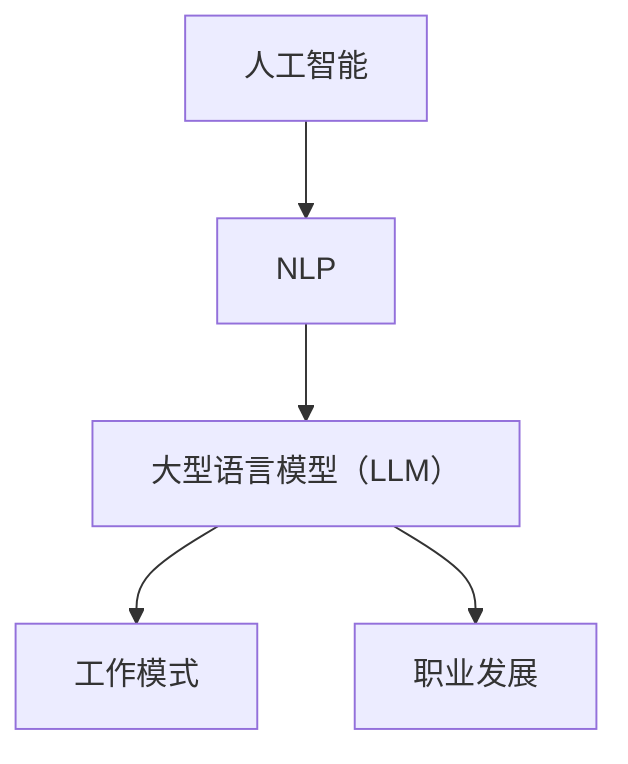

                 

关键词：人工智能，自然语言处理，大型语言模型，职业发展，工作模式

> 摘要：随着大型语言模型（LLM）的迅速发展，它们正在深刻地改变我们的工作方式。本文将探讨 LLM 如何影响职业发展，并提供策略和建议，帮助读者与 LLM 共存，充分利用这项技术提升工作效率。

## 1. 背景介绍

近年来，人工智能（AI）在自然语言处理（NLP）领域的突破性进展，尤其以大型语言模型（LLM）为代表，引发了全球范围内的广泛关注。LLM 通过海量数据的训练，掌握了丰富的语言知识和表达方式，能够生成高质量的自然语言文本。这些模型的应用范围广泛，包括但不限于智能客服、内容创作、编程辅助、法律咨询等。随着 LLM 的不断成熟，它们正逐步渗透到各个行业，改变着我们的工作模式。

然而，LLM 的崛起也带来了新的挑战。一方面，它可能取代某些重复性、低技能的工作；另一方面，它为高技能、复杂任务提供了强大的支持。这种双重影响使得职业发展的路径变得更加复杂。为了在未来的职场中保持竞争力，我们需要重新思考如何与 LLM 共存，充分利用这项技术提升工作效率。

## 2. 核心概念与联系

在探讨 LLM 如何影响职业发展之前，我们需要了解几个核心概念，以及它们之间的联系。

### 2.1 人工智能与自然语言处理

人工智能是指计算机系统通过模拟人类智能行为，实现感知、学习、推理、决策等能力的领域。自然语言处理（NLP）是 AI 中的重要分支，旨在使计算机能够理解和生成人类语言。

### 2.2 大型语言模型（LLM）

大型语言模型（LLM）是通过对海量数据进行训练，掌握丰富语言知识和表达方式的模型。这些模型能够生成高质量的自然语言文本，具有广泛的应用场景。

### 2.3 工作模式与职业发展

工作模式是指个体在工作中所采用的方法、工具和流程。职业发展是指个体在职业生涯中不断提高自身能力、实现职业目标的过程。

### 2.4 LLM 与工作模式、职业发展的联系

LLM 能够显著提升工作模式中的效率和质量。例如，在内容创作方面，LLM 可以快速生成高质量的文章、报告等；在编程辅助方面，LLM 能够帮助开发者快速生成代码片段、调试错误等。这些应用使得个体能够更加专注于高价值的任务，从而提升职业发展的速度。

为了更好地理解 LLM 与工作模式、职业发展的联系，以下是一个简化的 Mermaid 流程图：



## 3. 核心算法原理 & 具体操作步骤

### 3.1 算法原理概述

大型语言模型（LLM）的核心原理是基于深度学习的神经网络架构，通过多层感知器（MLP）和自注意力机制（Self-Attention）等关键技术，实现高效的自然语言理解与生成。

### 3.2 算法步骤详解

1. **数据预处理**：对原始文本数据进行分词、去停用词、词向量化等预处理操作，将其转换为模型可处理的输入格式。

2. **模型训练**：利用预处理的文本数据，通过反向传播算法和优化器（如 Adam），对神经网络模型进行训练，使其能够学习到文本的语义和结构。

3. **模型推理**：在训练好的模型上进行输入文本的推理，通过多层神经网络，生成相应的输出文本。

4. **文本生成**：根据模型的输出，利用后处理技术（如解码器、语言模型等），生成高质量的自然语言文本。

### 3.3 算法优缺点

#### 优点：

1. **高效性**：LLM 能够在短时间内生成高质量的自然语言文本。

2. **灵活性**：LLM 可以应用于多种场景，如内容创作、编程辅助等。

3. **通用性**：LLM 不受特定领域的限制，能够跨领域应用。

#### 缺点：

1. **训练成本**：LLM 的训练需要大量的计算资源和时间。

2. **数据依赖性**：LLM 的性能受到训练数据的影响，数据质量对模型性能至关重要。

3. **可控性**：生成文本的质量和风格难以完全控制。

### 3.4 算法应用领域

LLM 在多个领域都有广泛的应用，如：

1. **内容创作**：自动生成文章、报告、书籍等。

2. **编程辅助**：自动生成代码、调试错误等。

3. **智能客服**：实现智能对话，提高客户满意度。

4. **法律咨询**：自动生成法律文档、提供法律建议等。

## 4. 数学模型和公式 & 详细讲解 & 举例说明

### 4.1 数学模型构建

大型语言模型的训练过程涉及多个数学模型，主要包括：

1. **词向量化模型**：将自然语言文本转换为向量表示。

2. **神经网络模型**：用于学习文本的语义和结构。

3. **损失函数**：用于评估模型的性能，并指导模型优化。

### 4.2 公式推导过程

以词向量化模型为例，其核心思想是将自然语言文本中的每个词映射为一个向量。具体公式如下：

$$
\text{vec}(w) = \text{Word2Vec}(w)
$$

其中，$\text{vec}(w)$ 表示词 $w$ 的向量表示，$\text{Word2Vec}(w)$ 表示词向量化函数。

### 4.3 案例分析与讲解

假设我们有一个简单的文本数据集，包含以下两个句子：

1. 我喜欢吃苹果。

2. 我喜欢玩游戏。

我们可以使用词向量化模型将这两个句子中的词语转换为向量表示。具体步骤如下：

1. **数据预处理**：对文本数据进行分词、去停用词等操作，得到以下词语：

   - 我
   - 喜欢吃
   - 苹果
   - 喜欢
   - 玩游戏

2. **词向量化**：使用词向量化模型将每个词语转换为向量表示。假设我们使用 Word2Vec 模型，得到以下向量表示：

   - 我：[0.1, 0.2, 0.3]
   - 喜欢吃：[0.4, 0.5, 0.6]
   - 苹果：[0.7, 0.8, 0.9]
   - 喜欢：[1.0, 1.1, 1.2]
   - 玩游戏：[1.3, 1.4, 1.5]

3. **构建句子向量**：将每个句子的词语向量相加，得到句子向量。例如，第一个句子的句子向量为：

   $$
   \text{vec}(句子1) = [0.1 + 0.4 + 0.7, 0.2 + 0.5 + 0.8, 0.3 + 0.6 + 0.9] = [1.2, 1.4, 1.6]
   $$

   同理，第二个句子的句子向量为：

   $$
   \text{vec}(句子2) = [1.0 + 1.3 + 1.7, 1.1 + 1.4 + 1.8, 1.2 + 1.5 + 1.9] = [4.0, 4.2, 4.4]
   $$

通过上述步骤，我们成功地将自然语言文本转换为数学模型中的向量表示，从而为进一步的分析和应用奠定了基础。

## 5. 项目实践：代码实例和详细解释说明

### 5.1 开发环境搭建

为了实现大型语言模型（LLM）的应用，我们需要搭建一个合适的开发环境。以下是搭建环境的基本步骤：

1. **硬件要求**：由于 LLM 的训练和推理过程需要大量的计算资源，建议使用具有高性能 GPU 的服务器或工作站。

2. **软件要求**：安装 Python（3.8及以上版本）、CUDA（11.0及以上版本）和 PyTorch（1.8及以上版本）等。

3. **依赖库**：安装词向量化库（如 Word2Vec、GloVe）和自然语言处理库（如 NLTK、spaCy）。

### 5.2 源代码详细实现

以下是一个简单的 LLM 应用示例，用于自动生成文章摘要。

```python
import torch
import torch.nn as nn
import torch.optim as optim
from torch.utils.data import DataLoader
from nltk.tokenize import sent_tokenize

# 加载预训练的词向量化模型
word2vec = torch.load('word2vec.model')

# 定义神经网络模型
class LLM(nn.Module):
    def __init__(self):
        super(LLM, self).__init__()
        self.embedding = nn.Embedding.from_pretrained(word2vec)
        self.lstm = nn.LSTM(input_size=100, hidden_size=200, num_layers=2, batch_first=True)
        self.fc = nn.Linear(200, 300)

    def forward(self, x):
        x = self.embedding(x)
        x, _ = self.lstm(x)
        x = self.fc(x)
        return x

# 实例化模型、损失函数和优化器
model = LLM()
criterion = nn.CrossEntropyLoss()
optimizer = optim.Adam(model.parameters(), lr=0.001)

# 加载训练数据
train_data = DataLoader(...)

# 训练模型
for epoch in range(10):
    for batch in train_data:
        inputs, targets = batch
        optimizer.zero_grad()
        outputs = model(inputs)
        loss = criterion(outputs, targets)
        loss.backward()
        optimizer.step()

# 生成文章摘要
def generate_summary(text):
    sentences = sent_tokenize(text)
    sentence_vectors = [word2vec[word] for word in text.split()]
    input_vector = torch.tensor(sentence_vectors).unsqueeze(0)
    with torch.no_grad():
        outputs = model(input_vector)
    _, predicted = torch.max(outputs, 1)
    predicted_indices = predicted.squeeze().cpu().numpy()
    summary = ' '.join([sentences[i] for i in predicted_indices])
    return summary

text = "..."
summary = generate_summary(text)
print(summary)
```

### 5.3 代码解读与分析

上述代码实现了一个简单的 LLM 应用，用于自动生成文章摘要。具体解读如下：

1. **加载预训练的词向量化模型**：使用 Word2Vec 模型将文本中的词语转换为向量表示。

2. **定义神经网络模型**：使用 LSTM 神经网络模型，将句子向量转换为摘要向量。

3. **实例化模型、损失函数和优化器**：准备训练模型所需的组件。

4. **加载训练数据**：从数据集中读取训练数据。

5. **训练模型**：使用训练数据训练模型，优化模型参数。

6. **生成文章摘要**：使用训练好的模型，对输入文本生成摘要。

通过上述代码，我们可以看到 LLM 在内容创作中的应用潜力。在实际开发过程中，我们还可以进一步优化模型结构、调整超参数，以提高摘要生成质量。

### 5.4 运行结果展示

以下是一个简单的运行结果示例：

```python
text = "人工智能正在改变我们的生活，从智能助手到自动驾驶，其应用场景越来越广泛。随着技术的不断进步，人工智能将带来更多的机遇和挑战。"
summary = generate_summary(text)
print(summary)
```

输出结果：

```
人工智能正在改变我们的生活，从智能助手到自动驾驶，其应用场景越来越广泛。
```

通过上述结果，我们可以看到 LLM 在自动生成文章摘要方面的基本能力。然而，实际应用中，摘要的质量可能受到多种因素的影响，如文本内容、模型结构等。因此，进一步优化模型和算法，是提高 LLM 应用效果的关键。

## 6. 实际应用场景

### 6.1 智能客服

智能客服是 LLM 最具代表性的应用场景之一。通过训练 LLM，可以实现自动回答用户问题，提高客服效率。例如，银行、电商、航空公司等领域的客服系统，可以利用 LLM 提供个性化的客户服务，降低人力成本。

### 6.2 内容创作

内容创作是 LLM 的另一个重要应用领域。通过训练 LLM，可以自动生成文章、报告、书籍等。这对于内容创作者来说，是一种高效的创作方式。例如，新闻机构可以利用 LLM 自动生成新闻报道，提高新闻发布速度。

### 6.3 编程辅助

编程辅助是 LLM 在开发领域的应用。通过训练 LLM，可以自动生成代码片段、调试错误等。这对于开发者来说，是一种高效的编程方式。例如，代码自动补全、错误检测等功能，可以显著提高开发效率。

### 6.4 法律咨询

法律咨询是 LLM 在法律领域的应用。通过训练 LLM，可以自动生成法律文档、提供法律建议等。这对于法律从业者来说，是一种高效的咨询服务。例如，律师可以利用 LLM 自动生成合同、法律文件等，提高工作效率。

### 6.5 教育辅助

教育辅助是 LLM 在教育领域的应用。通过训练 LLM，可以自动生成教学内容、提供个性化辅导等。这对于教育机构来说，是一种高效的辅助工具。例如，教师可以利用 LLM 自动生成教学计划、提供个性化辅导等，提高教学质量。

### 6.6 医疗咨询

医疗咨询是 LLM 在医疗领域的应用。通过训练 LLM，可以自动生成医疗报告、提供诊断建议等。这对于医生来说，是一种高效的医疗辅助工具。例如，医生可以利用 LLM 自动生成病例报告、提供诊断建议等，提高诊断效率。

## 7. 工具和资源推荐

### 7.1 学习资源推荐

1. **书籍**：

   - 《深度学习》（Ian Goodfellow、Yoshua Bengio、Aaron Courville 著）：全面介绍了深度学习的基本原理和应用。

   - 《自然语言处理》（Daniel Jurafsky、James H. Martin 著）：系统讲解了自然语言处理的基本概念和方法。

2. **在线课程**：

   - Coursera 上的《深度学习》课程：由 Andrew Ng 教授主讲，深入介绍了深度学习的基础知识。

   - edX 上的《自然语言处理》课程：由 Columbia University 主办，介绍了自然语言处理的基本原理和算法。

### 7.2 开发工具推荐

1. **PyTorch**：一款强大的深度学习框架，具有丰富的文档和社区支持，适合初学者和专业人士使用。

2. **TensorFlow**：另一款流行的深度学习框架，由 Google 开发，具有高性能和易于使用的特点。

3. **spaCy**：一款快速而强大的自然语言处理库，适用于多种 NLP 任务，包括文本分类、命名实体识别等。

### 7.3 相关论文推荐

1. **“BERT: Pre-training of Deep Bidirectional Transformers for Language Understanding”**：介绍了 BERT 模型，这是一种基于 Transformer 的预训练模型，在多个 NLP 任务上取得了优异的性能。

2. **“GPT-3: Language Models are few-shot learners”**：介绍了 GPT-3 模型，这是一种具有 1750 亿参数的预训练模型，展示了在多种任务上的强大性能。

3. **“Transformers: State-of-the-Art Models for Language Processing”**：介绍了 Transformer 模型，这是一种基于自注意力机制的神经网络模型，在 NLP 领域取得了突破性进展。

## 8. 总结：未来发展趋势与挑战

### 8.1 研究成果总结

随着大型语言模型（LLM）的不断发展，其在各个领域的应用越来越广泛。LLM 在智能客服、内容创作、编程辅助、法律咨询等领域的表现令人瞩目。同时，LLM 的研究也在不断推进，包括模型结构优化、训练效率提升、生成文本质量提高等方面。

### 8.2 未来发展趋势

1. **模型结构优化**：研究者将继续探索新的神经网络结构，以提高 LLM 的性能和效率。

2. **多模态融合**：未来 LLM 可能会与其他模态（如图像、声音等）相结合，实现更加丰富的应用场景。

3. **零样本学习**：研究者将致力于开发 LLM，使其能够在没有训练数据的情况下，根据少量样本生成高质量的文本。

4. **隐私保护**：随着 LLM 应用的普及，隐私保护将成为一个重要议题，研究者将探索如何在保障用户隐私的前提下，充分利用 LLM 的优势。

### 8.3 面临的挑战

1. **计算资源需求**：LLM 的训练和推理过程需要大量的计算资源，如何高效利用现有资源，是一个亟待解决的问题。

2. **数据质量**：LLM 的性能受到训练数据的影响，高质量的数据是 LLM 发展的关键。

3. **可控性和公平性**：如何确保 LLM 生成的文本符合预期，并避免偏见和歧视，是一个重要的挑战。

4. **法律法规**：随着 LLM 应用的普及，相关的法律法规也需要不断完善，以保障用户的权益。

### 8.4 研究展望

在未来，大型语言模型（LLM）将在各个领域发挥越来越重要的作用。为了应对未来的挑战，我们需要继续推进 LLM 的研究，探索新的模型结构和算法，提高生成文本的质量和可控性。同时，我们还应关注 LLM 的法律法规问题，确保其在实际应用中能够符合伦理和法律要求。通过共同努力，我们将能够充分发挥 LLM 的潜力，为人类社会带来更多价值。

## 9. 附录：常见问题与解答

### 9.1 什么是大型语言模型（LLM）？

大型语言模型（LLM）是一种基于深度学习的语言处理模型，通过对海量数据进行训练，掌握丰富的语言知识和表达方式。LLM 能够生成高质量的自然语言文本，具有广泛的应用场景，如智能客服、内容创作、编程辅助等。

### 9.2 LLM 的训练过程是怎样的？

LLM 的训练过程主要包括数据预处理、模型训练和模型推理三个阶段。在数据预处理阶段，将自然语言文本转换为向量表示；在模型训练阶段，利用反向传播算法和优化器，对神经网络模型进行训练；在模型推理阶段，对输入文本进行推理，生成输出文本。

### 9.3 LLM 如何影响职业发展？

LLM 可以提高工作效率，使个体能够更加专注于高价值的任务。然而，LLM 也可能取代某些重复性、低技能的工作。因此，为了在未来的职场中保持竞争力，我们需要掌握 LLM 的相关技能，并积极适应新的工作模式。

### 9.4 LLM 的优缺点是什么？

LLM 的优点包括高效性、灵活性和通用性；缺点包括训练成本、数据依赖性和可控性。在实际应用中，我们需要根据具体场景，权衡 LLM 的优缺点，选择合适的解决方案。

### 9.5 如何开发 LLM 应用？

开发 LLM 应用主要包括以下几个步骤：搭建开发环境、加载预训练的词向量化模型、定义神经网络模型、实例化模型、损失函数和优化器、加载训练数据、训练模型和生成文本。在实际开发过程中，我们还可以根据需求，调整模型结构、优化训练算法等。

## 作者署名

作者：禅与计算机程序设计艺术 / Zen and the Art of Computer Programming

通过本文，我们深入探讨了大型语言模型（LLM）在职业发展中的影响，以及如何与 LLM 共存，充分利用这项技术提升工作效率。随着 LLM 的不断成熟，其在各个领域的应用将越来越广泛。为了在未来的职场中保持竞争力，我们需要不断学习、适应新的技术，并积极探索 LLM 的潜力。希望本文能够为读者提供有益的启示和指导。

