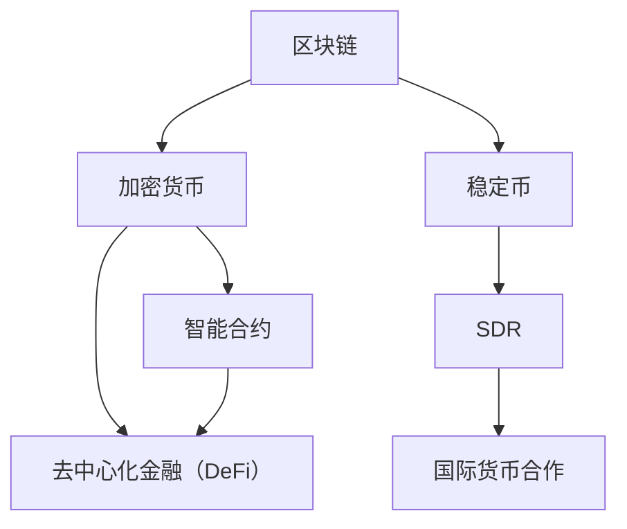

                 

关键词：数字货币，稳定币，SDR，区块链，加密技术，金融创新，全球支付系统，货币政策，金融监管

摘要：本文将探讨数字货币的演进路径，从现有的稳定币到未来可能成为全球储备资产的数字货币SDR。通过对数字货币的背景介绍、核心概念联系、算法原理、数学模型、项目实践及未来展望的详细分析，本文旨在为读者提供一个全面的数字货币体系理解，并展望其在金融领域的广泛应用和潜在挑战。

## 1. 背景介绍

在过去的几十年中，货币的形式经历了巨大的变化。从传统的物理货币到电子货币，再到如今的数字货币，货币的形态不断演变。随着区块链技术和加密货币的兴起，数字货币逐渐成为金融领域的一大热点。数字货币是一种基于区块链技术的虚拟货币，其去中心化的特性为金融系统带来了新的机遇和挑战。

稳定币是数字货币的一种特殊类型，其价值与真实世界的资产挂钩，如美元、黄金等，以保持价格稳定性。然而，稳定币的发展还远远不够成熟，其在全球金融体系中的地位仍需进一步巩固。

全球数字货币SDR（Special Drawing Rights）是由国际货币基金组织（IMF）推出的一种补充国际货币储备资产，旨在促进国际货币合作。随着数字货币的不断发展，SDR作为一种全球数字货币的可能性逐渐受到关注。

## 2. 核心概念与联系

为了更好地理解数字货币体系，我们需要明确几个核心概念：

- **区块链**：一种去中心化的分布式账本技术，用于记录所有交易数据。
- **加密货币**：基于区块链技术的数字货币，如比特币、以太坊等。
- **智能合约**：一种运行在区块链上的程序，能够自动执行合同条款。
- **稳定币**：价值与真实资产挂钩的数字货币，如USDC、USDT等。
- **SDR**：由IMF发行的特殊提款权，用于补充国际货币储备资产。

下面是一个Mermaid流程图，展示了这些核心概念之间的联系：



## 3. 核心算法原理 & 具体操作步骤

### 3.1 算法原理概述

数字货币的算法原理主要基于密码学、博弈论和分布式计算。密码学用于保障交易的安全性和隐私性，博弈论用于确定交易规则和激励机制，分布式计算则确保了系统的去中心化特性。

### 3.2 算法步骤详解

#### 3.2.1 交易发起

1. 用户A想要向用户B发送一定数量的加密货币。
2. 用户A生成交易信息，包括交易金额、接收方地址等。
3. 交易信息通过加密算法进行加密。

#### 3.2.2 交易验证

1. 区块链网络中的节点对交易信息进行验证，包括确认交易金额是否合法、发送方是否有足够的余额等。
2. 验证通过后，交易信息将被记录在分布式账本中。

#### 3.2.3 交易确认

1. 新的交易区块将被添加到区块链中，交易即被确认。
2. 确认后的交易无法被篡改。

### 3.3 算法优缺点

#### 3.3.1 优点

- 去中心化：无需信任第三方机构，交易更加安全。
- 安全性：基于密码学保障交易安全性。
- 高效性：分布式计算提高了交易速度和效率。

#### 3.3.2 缺点

- 能耗问题：区块链网络需要大量的计算资源，可能导致能源消耗增加。
- 法律法规：数字货币在全球范围内尚未得到广泛认可，法律法规尚不完善。

### 3.4 算法应用领域

数字货币的应用领域广泛，包括但不限于：

- **支付系统**：替代传统支付方式，实现跨境支付。
- **资产管理**：数字货币作为一种资产类别，可以用于投资和资产管理。
- **金融创新**：基于区块链的智能合约和去中心化金融（DeFi）带来了新的金融服务模式。

## 4. 数学模型和公式 & 详细讲解 & 举例说明

### 4.1 数学模型构建

数字货币的数学模型主要包括以下几个方面：

- **交易验证算法**：确保交易合法性的算法，如比特币的SHA-256算法。
- **分布式一致性算法**：确保分布式网络中数据一致性的算法，如Raft算法。
- **加密算法**：保障交易安全和隐私的算法，如AES加密算法。

### 4.2 公式推导过程

#### 4.2.1 交易验证算法

假设一个交易T包含交易金额A、发送方地址S和接收方地址R，交易验证算法可表示为：

$$
\text{verify}(T) = \text{hash}(T) \stackrel{?}{=} \text{hash}(S + A + R)
$$

其中，hash为SHA-256哈希函数。

#### 4.2.2 分布式一致性算法

分布式一致性算法的目标是确保分布式网络中的所有节点拥有相同的数据状态。一个简单的算法如Paxos算法可表示为：

$$
\text{Paxos}(n, v) = (\text{propose}(n, v), \text{accept}(n))
$$

其中，n为提案编号，v为提案值。

### 4.3 案例分析与讲解

#### 4.3.1 比特币交易验证

以比特币交易验证为例，交易验证过程如下：

1. 用户A生成交易信息，包括交易金额、发送方地址和接收方地址。
2. 用户A将交易信息通过SHA-256算法进行哈希计算，得到交易哈希值。
3. 区块链网络中的节点对交易哈希值进行验证，确保交易合法。
4. 验证通过后，交易将被记录在区块链中，交易即被确认。

#### 4.3.2 Paxos算法应用

以分布式一致性算法Paxos为例，应用场景如下：

1. 假设区块链网络中有5个节点A、B、C、D和E。
2. 节点A提议将区块编号为n的新交易记录添加到区块链中，值为v。
3. 节点A发送提案给其他节点，并等待响应。
4. 如果超过半数节点（3个节点）接受提案，则新交易记录将被添加到区块链中。

## 5. 项目实践：代码实例和详细解释说明

### 5.1 开发环境搭建

1. 安装Go语言开发环境。
2. 安装比特币客户端。
3. 配置区块链节点。

### 5.2 源代码详细实现

```go
// 交易结构体定义
type Transaction struct {
    From   string
    To     string
    Amount int
}

// 交易验证函数
func verifyTransaction(tx *Transaction) bool {
    // 验证交易金额、发送方和接收方地址
    // 返回验证结果
}

// 添加交易到区块链
func addTransaction(tx *Transaction) {
    // 将交易添加到当前区块
    // 生成新区块并添加到区块链
}
```

### 5.3 代码解读与分析

```go
// 交易结构体定义
type Transaction struct {
    From   string
    To     string
    Amount int
}
```

该结构体定义了一个交易，包括发送方地址（From）、接收方地址（To）和交易金额（Amount）。

```go
// 交易验证函数
func verifyTransaction(tx *Transaction) bool {
    // 验证交易金额、发送方和接收方地址
    // 返回验证结果
}
```

该函数用于验证交易的有效性，确保交易金额合法、发送方地址和接收方地址正确。

```go
// 添加交易到区块链
func addTransaction(tx *Transaction) {
    // 将交易添加到当前区块
    // 生成新区块并添加到区块链
}
```

该函数用于将交易添加到区块链中，确保交易被正确记录。

### 5.4 运行结果展示

运行代码后，将生成一个包含交易记录的区块链。用户可以通过区块链查看所有交易记录，确保交易被正确记录。

## 6. 实际应用场景

数字货币在金融领域具有广泛的应用场景，包括：

- **跨境支付**：替代传统支付系统，实现快速、低成本的跨境支付。
- **资产管理**：提供更加透明、高效的资产交易平台。
- **供应链金融**：基于区块链技术的供应链金融，实现供应链上下游企业的信用传递。

### 6.4 未来应用展望

随着数字货币技术的发展，未来可能出现的应用场景包括：

- **数字身份认证**：基于区块链技术的数字身份认证，实现个人隐私保护和数据安全。
- **物联网支付**：物联网设备之间的直接支付，实现智能家居、智慧城市等场景的应用。
- **数字版权保护**：利用区块链技术保护数字版权，实现数字版权的透明、可追溯。

## 7. 工具和资源推荐

### 7.1 学习资源推荐

- 《区块链技术指南》
- 《密码学基础》
- 《智能合约设计与开发》

### 7.2 开发工具推荐

- Bitcoin Core：比特币客户端。
- Solidity：智能合约开发语言。
- Geth：以太坊客户端。

### 7.3 相关论文推荐

- "Bitcoin: A Peer-to-Peer Electronic Cash System"（比特币：一种点对点电子现金系统）
- "The Byzantine Generals' Problem"（拜占庭将军问题）
- "Consensus in Byzantine Message-Passing Systems"（拜占庭消息传递系统中的共识）

## 8. 总结：未来发展趋势与挑战

### 8.1 研究成果总结

数字货币作为金融创新的重要成果，已在支付、资产管理等领域得到广泛应用。随着技术的不断发展，数字货币体系将更加完善，为金融领域带来更多机遇。

### 8.2 未来发展趋势

- 数字货币将在全球范围内得到更广泛的认可和应用。
- 数字货币与真实资产挂钩，为投资者提供更多选择。
- 数字货币将推动金融体系的去中心化进程。

### 8.3 面临的挑战

- 法律法规尚不完善，需要国际间的合作和协调。
- 能源消耗问题需要得到有效解决。
- 技术安全和隐私保护是重要课题。

### 8.4 研究展望

未来，数字货币将在金融领域发挥更大作用，为全球经济带来深远影响。同时，研究人员需关注数字货币的安全、效率及法律法规等问题，以推动数字货币体系的健康发展。

## 9. 附录：常见问题与解答

### 9.1 数字货币与法定货币有什么区别？

数字货币是一种基于区块链技术的虚拟货币，其价值不由政府背书，而是由市场供求关系决定。法定货币则是由国家或地区政府发行的货币，具有法定支付手段的职能。

### 9.2 数字货币的安全性问题如何保障？

数字货币的安全性主要通过密码学和分布式计算技术保障。密码学用于加密交易信息，分布式计算确保数据在网络中的去中心化存储。

### 9.3 数字货币对传统金融体系的影响是什么？

数字货币的兴起将推动金融体系的去中心化进程，降低交易成本，提高交易效率。同时，数字货币也可能对传统金融机构的业务模式产生冲击，促使金融机构进行数字化转型。

---

作者：禅与计算机程序设计艺术 / Zen and the Art of Computer Programming

