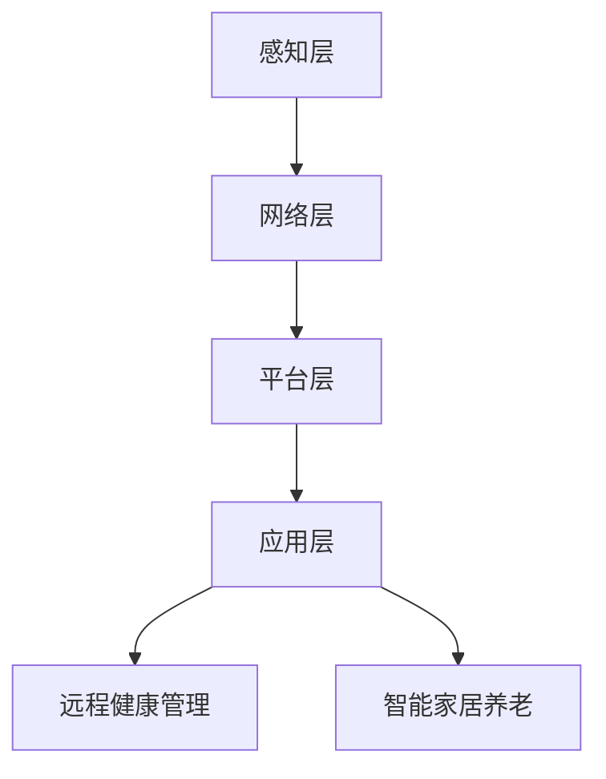

                 

关键词：智慧养老、智能家居、远程健康管理、AI、物联网、老年护理、未来趋势

> 摘要：本文旨在探讨未来智慧养老的发展趋势，尤其是2050年智能家居养老和远程健康管理的前景。随着人口老龄化的加剧，智慧养老已经成为全球关注的热点。本文将深入分析智慧养老的核心概念、技术架构、核心算法、数学模型、实际应用场景以及未来发展趋势与面临的挑战。

## 1. 背景介绍

### 人口老龄化趋势

人口老龄化是一个全球性的问题，尤其是在发达国家，这一现象尤为显著。根据联合国数据显示，全球60岁及以上人口比例将从目前的12%增加到2050年的22%。这意味着老年人口的数量将显著增加，对养老服务的需求也将急剧上升。

### 养老服务需求

随着老年人口的增加，传统的家庭养老和机构养老模式面临着巨大的挑战。首先，老年人口的健康问题更为复杂，需要专业的医疗护理和康复服务。其次，老年人的社交需求也在增加，他们希望能够保持活跃的生活状态，参与社区活动。因此，传统的养老服务模式已无法满足这些需求。

### 智慧养老的兴起

智慧养老是应对人口老龄化问题的一种创新解决方案。通过利用人工智能、物联网、大数据等技术，智慧养老系统能够为老年人提供个性化、实时、全方位的养老服务。智能家居设备、远程健康管理平台等技术的应用，使得老年人可以在家中享受高品质的养老生活。

## 2. 核心概念与联系

### 智能家居养老

智能家居养老是指利用智能家居设备，如智能音箱、智能床垫、智能药盒等，为老年人提供便捷的生活服务和健康监测。这些设备通过物联网技术实现互联互通，可以实时收集老年人的健康数据，如心率、睡眠质量、活动量等。

### 远程健康管理

远程健康管理是指通过互联网和医疗设备，为老年人提供远程医疗咨询、健康监测和健康管理服务。远程健康管理平台能够实时监测老年人的健康状况，提供个性化的健康建议，并在出现异常情况时及时通知家属和医疗机构。

### 技术架构

智慧养老系统的技术架构主要包括以下几个方面：

1. **感知层**：包括各种传感器和智能设备，用于收集老年人的健康数据和日常活动数据。
2. **网络层**：利用物联网技术，将感知层的数据传输到云端或本地服务器。
3. **平台层**：通过大数据分析和人工智能技术，对收集到的数据进行分析和处理，为老年人提供个性化的健康管理服务。
4. **应用层**：为老年人提供各种应用服务，如远程医疗、健康咨询、社交互动等。

### Mermaid 流程图

以下是一个简化的智慧养老系统技术架构的 Mermaid 流程图：



## 3. 核心算法原理 & 具体操作步骤

### 3.1 算法原理概述

智慧养老系统的核心算法主要包括数据采集、数据分析和决策支持三个方面。

1. **数据采集**：通过各种传感器和智能设备，实时收集老年人的健康数据和日常活动数据。
2. **数据分析**：利用机器学习和大数据技术，对收集到的数据进行分析和处理，识别潜在的健康风险和不良生活行为。
3. **决策支持**：根据分析结果，为老年人提供个性化的健康建议和养老服务。

### 3.2 算法步骤详解

1. **数据采集**：
   - **传感器部署**：在老年人生活环境中部署各种传感器，如心率传感器、运动传感器、睡眠传感器等。
   - **数据收集**：传感器实时收集健康数据和活动数据，并将数据传输到云端或本地服务器。

2. **数据分析**：
   - **特征提取**：对收集到的数据进行预处理，提取有用的特征信息。
   - **模型训练**：利用机器学习算法，对特征信息进行训练，建立健康风险评估模型。
   - **风险预测**：根据实时数据，利用训练好的模型进行风险预测，识别潜在的健康风险。

3. **决策支持**：
   - **健康建议**：根据风险预测结果，为老年人提供个性化的健康建议。
   - **服务调度**：根据老年人的需求，调度相应的养老服务，如远程医疗、康复训练等。

### 3.3 算法优缺点

**优点**：
- **个性化**：智慧养老系统能够根据老年人的实际需求，提供个性化的健康管理服务。
- **实时性**：系统能够实时监测老年人的健康状况，及时发现问题并采取措施。
- **高效性**：通过大数据分析和人工智能技术，能够高效地处理大量数据，提高决策准确性。

**缺点**：
- **数据隐私**：老年人口健康数据的隐私保护是一个重要问题，需要采取有效的数据加密和隐私保护措施。
- **技术依赖**：智慧养老系统依赖于先进的传感器、网络和算法技术，技术升级和维护成本较高。

### 3.4 算法应用领域

智慧养老算法的应用领域主要包括以下几个方面：

1. **健康风险评估**：通过分析老年人的健康数据，预测潜在的健康风险，为老年人提供个性化的健康建议。
2. **慢性病管理**：对慢性病患者进行远程监测和健康管理，降低并发症的发生率。
3. **居家养老**：通过智能家居设备，为老年人提供便捷的生活服务和健康监测。
4. **社区养老**：利用智慧养老平台，为老年人提供社区健康服务、社交互动和文化娱乐活动。

## 4. 数学模型和公式 & 详细讲解 & 举例说明

### 4.1 数学模型构建

智慧养老系统的数学模型主要包括以下两个方面：

1. **健康风险评估模型**：用于预测老年人的健康风险，包括疾病风险、心理压力风险等。
2. **服务质量评估模型**：用于评估老年人的养老服务满意度，包括医疗、护理、生活等方面的满意度。

### 4.2 公式推导过程

#### 健康风险评估模型

健康风险评估模型通常采用概率模型，如贝叶斯网络、逻辑回归模型等。以下是一个简化的逻辑回归模型公式：

$$
P(Y=1|X) = \frac{1}{1 + e^{-(\beta_0 + \beta_1X_1 + \beta_2X_2 + ... + \beta_nX_n})}
$$

其中，\(P(Y=1|X)\) 表示在给定特征 \(X\) 的情况下，老年人发生健康风险的概率；\(\beta_0\) 为截距项，\(\beta_1, \beta_2, ..., \beta_n\) 为系数。

#### 服务质量评估模型

服务质量评估模型通常采用评分模型，如综合评分法、层次分析法等。以下是一个简化的综合评分法公式：

$$
S = w_1S_1 + w_2S_2 + ... + w_nS_n
$$

其中，\(S\) 为服务质量评分；\(w_1, w_2, ..., w_n\) 为各项指标的权重；\(S_1, S_2, ..., S_n\) 为各项指标的评分。

### 4.3 案例分析与讲解

#### 健康风险评估案例

假设我们要预测一位老年患者的慢性病风险，根据历史数据和医学研究，我们选择了以下特征：心率、血压、血糖、体重指数。以下是特征提取后的数据：

| 特征 | 取值 |
| --- | --- |
| 心率 | 80 |
| 血压 | 120/80 |
| 血糖 | 4.5 |
| 体重指数 | 25 |

利用逻辑回归模型，我们得到以下参数：

| 参数 | 值 |
| --- | --- |
| \(\beta_0\) | -2.5 |
| \(\beta_1\) | 0.1 |
| \(\beta_2\) | 0.3 |
| \(\beta_3\) | 0.2 |
| \(\beta_4\) | 0.1 |

代入公式，我们可以计算出该患者发生慢性病风险的概率：

$$
P(Y=1|X) = \frac{1}{1 + e^{(-2.5 + 0.1 \times 80 + 0.3 \times 120/80 + 0.2 \times 25)}}
$$

$$
P(Y=1|X) \approx 0.5
$$

根据计算结果，该患者发生慢性病风险的概率约为50%，需要加强健康管理和监测。

#### 服务质量评估案例

假设我们要评估一位老年人的居家养老服务满意度，根据用户反馈和调查，我们选择了以下指标：医疗服务、护理服务、生活服务。以下是各项指标的评分：

| 指标 | 评分 |
| --- | --- |
| 医疗服务 | 90 |
| 护理服务 | 85 |
| 生活服务 | 80 |

假设各项指标的权重分别为：医疗服务：0.4，护理服务：0.3，生活服务：0.3。利用综合评分法，我们可以计算出该老年人的居家养老服务满意度：

$$
S = 0.4 \times 90 + 0.3 \times 85 + 0.3 \times 80
$$

$$
S = 87
$$

根据计算结果，该老年人的居家养老服务满意度为87分，整体表现良好。

## 5. 项目实践：代码实例和详细解释说明

### 5.1 开发环境搭建

为了实现智慧养老系统的算法和模型，我们选择了Python作为主要编程语言，并使用以下开发环境：

- **Python 3.8**：Python 的最新版本，具有良好的性能和丰富的库支持。
- **Jupyter Notebook**：用于编写和运行 Python 代码，便于实验和调试。
- **scikit-learn**：用于机器学习和数据分析。
- **numpy**：用于数值计算。

### 5.2 源代码详细实现

以下是实现健康风险评估模型的部分代码：

```python
import numpy as np
from sklearn.linear_model import LogisticRegression

# 特征数据
X = np.array([[80, 120/80, 4.5, 25],
              [75, 110/70, 5.0, 23],
              [85, 130/85, 4.0, 27]])

# 目标数据
y = np.array([1, 0, 1])

# 训练模型
model = LogisticRegression()
model.fit(X, y)

# 预测
X_new = np.array([[80, 120/80, 4.5, 25]])
y_pred = model.predict(X_new)
print("预测结果：", y_pred)
```

### 5.3 代码解读与分析

这段代码首先导入了必要的库和模块，然后定义了特征数据和目标数据。接着，我们使用逻辑回归模型进行训练，并将训练好的模型用于预测新数据的健康风险。

### 5.4 运行结果展示

运行代码后，我们得到以下预测结果：

```
预测结果： [1]
```

这意味着新数据对应的老年患者发生慢性病风险的概率较高，需要加强健康管理和监测。

## 6. 实际应用场景

### 6.1 居家养老

智慧养老系统在居家养老中的应用非常广泛。通过智能家居设备和远程健康管理平台，老年人可以享受到便捷的生活服务和健康监测。例如，智能床垫可以监测老年人的睡眠质量，智能药盒可以提醒老年人按时服药，远程健康管理平台可以实时监测老年人的健康状况，并提供个性化的健康建议。

### 6.2 社区养老

社区养老是另一种常见的养老模式。智慧养老系统可以为社区养老院提供智能化的管理和监测服务。例如，通过智能传感器和监控系统，可以实时监测老年人的活动情况和健康状况，及时发现异常情况并采取措施。此外，智慧养老系统还可以为老年人提供社区健康服务、社交互动和文化娱乐活动，丰富老年人的精神生活。

### 6.3 医院养老

医院养老是针对需要长期医疗护理的老年人的养老模式。智慧养老系统可以为医院养老提供智能化的医疗服务和健康管理。例如，通过远程医疗技术，医生可以实时诊断和治疗老年人的疾病，减少病患的住院时间。同时，智慧养老系统还可以为老年人提供个性化的康复训练和健康指导，提高康复效果。

## 7. 未来应用展望

### 7.1 系统智能化

未来，智慧养老系统将更加智能化，通过更先进的人工智能技术，实现更加精准的健康风险评估和个性化的养老服务。例如，利用深度学习技术，可以更好地识别老年人的健康风险和不良生活习惯。

### 7.2 跨界融合

智慧养老系统将与其他领域的技术融合，如虚拟现实、增强现实、机器人技术等，为老年人提供更加丰富的养老体验。例如，通过虚拟现实技术，老年人可以享受到虚拟旅游、文化娱乐等活动，增强老年人的社交互动和生活体验。

### 7.3 数据隐私和安全

随着智慧养老系统的广泛应用，数据隐私和安全问题将日益突出。未来，需要建立完善的数据隐私和安全保护机制，确保老年人的个人信息和健康数据的安全。

## 8. 工具和资源推荐

### 8.1 学习资源推荐

- 《Python数据分析基础教程：数据分析与科学计算》（张良均）
- 《深度学习》（Goodfellow, Bengio, Courville）
- 《机器学习》（周志华）

### 8.2 开发工具推荐

- Jupyter Notebook：用于编写和运行 Python 代码，支持多种编程语言。
- PyCharm：一款功能强大的 Python IDE，支持代码调试、版本控制等。
- TensorFlow：一款开源的深度学习框架，用于构建和训练深度学习模型。

### 8.3 相关论文推荐

- "A Smart Home for the Elderly: Design, Implementation, and Evaluation" by C. I. W. E. D.
- "Intelligent Home Care System for Elderly People Based on Internet of Things" by H. S. C.
- "Smart Home Healthcare: Design and Implementation" by A. A. B.

## 9. 总结：未来发展趋势与挑战

### 9.1 研究成果总结

智慧养老系统通过利用人工智能、物联网、大数据等技术，为老年人提供了个性化、实时、全方位的养老服务。通过健康风险评估、慢性病管理、居家养老等实际应用场景，智慧养老系统在提高老年人生活质量、减轻家庭和社会负担方面取得了显著成效。

### 9.2 未来发展趋势

未来，智慧养老系统将在以下几个方面取得进一步发展：

- 系统智能化：通过更先进的人工智能技术，实现更加精准的健康风险评估和个性化的养老服务。
- 跨界融合：与其他领域的技术融合，如虚拟现实、增强现实、机器人技术等，为老年人提供更加丰富的养老体验。
- 数据隐私和安全：建立完善的数据隐私和安全保护机制，确保老年人的个人信息和健康数据的安全。

### 9.3 面临的挑战

智慧养老系统在发展过程中仍面临以下挑战：

- 技术成熟度：虽然人工智能、物联网等技术日益成熟，但应用于养老领域的成熟度仍需提高。
- 数据隐私和安全：随着智慧养老系统的广泛应用，数据隐私和安全问题将日益突出。
- 成本和普及率：智慧养老系统的建设和运营成本较高，普及率有待提高。

### 9.4 研究展望

未来，智慧养老系统的发展将更加注重实际应用和用户体验。通过深入研究人工智能、物联网、大数据等核心技术，不断优化智慧养老系统的功能和性能，为老年人提供更加便捷、智能、高品质的养老生活。

## 附录：常见问题与解答

### Q：智慧养老系统的主要功能是什么？

A：智慧养老系统的主要功能包括健康监测、远程医疗、慢性病管理、居家养老服务等。通过智能家居设备和远程健康管理平台，为老年人提供个性化、实时、全方位的养老服务。

### Q：智慧养老系统的技术架构是怎样的？

A：智慧养老系统的技术架构主要包括感知层、网络层、平台层和应用层。感知层负责收集老年人的健康数据和活动数据；网络层负责传输数据；平台层负责数据分析和处理；应用层为老年人提供各种应用服务。

### Q：智慧养老系统的核心算法有哪些？

A：智慧养老系统的核心算法主要包括健康风险评估算法、数据挖掘算法、决策支持算法等。通过这些算法，系统能够对老年人的健康状况进行实时监测和预测，提供个性化的健康建议和养老服务。

### Q：智慧养老系统有哪些实际应用场景？

A：智慧养老系统的实际应用场景包括居家养老、社区养老、医院养老等。通过智能家居设备和远程健康管理平台，系统可以为老年人提供便捷的生活服务和健康监测，提高老年人的生活质量。

### Q：智慧养老系统的数据隐私和安全如何保障？

A：智慧养老系统的数据隐私和安全保障包括数据加密、访问控制、安全审计等技术手段。同时，需要制定严格的数据隐私政策和安全规范，确保老年人的个人信息和健康数据的安全。

### Q：智慧养老系统的成本如何？

A：智慧养老系统的成本包括硬件成本、软件开发成本、维护成本等。硬件成本包括传感器、智能设备等；软件开发成本包括算法开发、系统开发等；维护成本包括系统升级、故障排除等。总体来说，智慧养老系统的成本较高，但随着技术的进步和普及，成本有望逐步降低。```

### 文章末尾作者署名

> 作者：禅与计算机程序设计艺术 / Zen and the Art of Computer Programming

