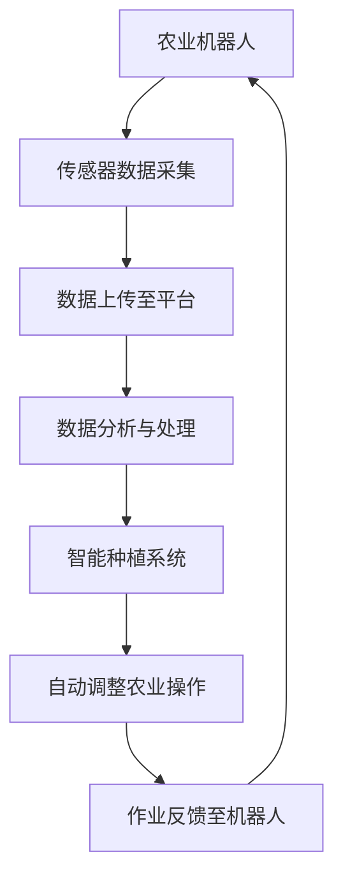

                 

关键词：智慧农业，2050年，农业机器人，智能种植系统，人工智能，物联网，可持续发展

> 摘要：本文将探讨2050年智慧农业的发展趋势，重点介绍农业机器人和智能种植系统在农业领域的应用。通过分析现有技术和未来可能的技术创新，本文旨在为读者展示一个充满希望和挑战的未来农业图景。

## 1. 背景介绍

随着全球人口的不断增长和城市化进程的加快，粮食安全问题变得越来越重要。传统的农业生产方式已经无法满足人们对食物的需求，同时也面临着资源枯竭、环境恶化等严峻挑战。智慧农业作为一种新兴的农业模式，通过融合物联网、大数据、人工智能等现代技术，旨在提高农业生产效率，实现可持续发展。

智慧农业的核心在于利用农业机器人和智能种植系统等先进技术，实现农业生产的自动化、精准化和智能化。农业机器人可以替代人力进行农田作业，而智能种植系统则通过传感器实时监测作物生长状况，提供精准的灌溉、施肥和病虫害防治等服务。

## 2. 核心概念与联系

### 2.1 农业机器人

农业机器人是智慧农业的重要组成部分，它们可以执行各种农业作业，如种植、收割、浇水、施肥和病虫害防治等。农业机器人的核心技术包括传感器、导航系统和人工智能算法。

#### 2.1.1 传感器

农业机器人配备多种传感器，如GPS、激光雷达、摄像头和温湿度传感器等。这些传感器可以帮助机器人实时监测农田环境，获取土壤、水分、温度和光照等关键数据。

#### 2.1.2 导航系统

导航系统是农业机器人实现精准作业的关键。目前，主流的导航技术包括GPS导航、激光导航和视觉导航。GPS导航适用于开阔的农田，激光导航在复杂地形中表现优异，而视觉导航则通过摄像头捕捉图像进行定位。

#### 2.1.3 人工智能算法

人工智能算法使得农业机器人能够自主决策和执行任务。通过机器学习和深度学习技术，农业机器人可以从大量历史数据中学习，不断提高作业效率和质量。

### 2.2 智能种植系统

智能种植系统通过物联网技术实现农田环境的实时监测和智能控制。其主要组成部分包括传感器网络、数据采集与处理平台和控制系统。

#### 2.2.1 传感器网络

传感器网络分布在农田各个角落，实时监测土壤、水分、温度、光照和病虫害等关键指标。

#### 2.2.2 数据采集与处理平台

数据采集与处理平台负责收集传感器数据，并对其进行清洗、存储和分析。通过大数据分析和机器学习技术，平台可以为农田管理提供科学依据。

#### 2.2.3 控制系统

控制系统根据分析结果，自动调整灌溉、施肥和病虫害防治等农业操作，实现精准农业。

### 2.3 农业机器人与智能种植系统的联系

农业机器人和智能种植系统相互依赖，共同构建智慧农业生态系统。农业机器人通过采集农田数据，为智能种植系统提供决策支持；而智能种植系统则根据数据分析和预测，为农业机器人制定作业计划。

### 2.4 Mermaid 流程图



## 3. 核心算法原理 & 具体操作步骤

### 3.1 算法原理概述

农业机器人和智能种植系统的核心算法主要包括数据采集与处理、路径规划、决策支持和作业执行等。以下将对这些算法进行简要概述。

#### 3.1.1 数据采集与处理

数据采集与处理算法负责实时监测农田环境，包括土壤湿度、温度、光照强度、病虫害情况等。通过传感器网络和物联网技术，将这些数据传输到数据采集与处理平台。

#### 3.1.2 路径规划

路径规划算法用于确定农业机器人在农田中的行驶路径。常见的路径规划算法包括Dijkstra算法、A*算法和基于采样的路径规划算法等。

#### 3.1.3 决策支持

决策支持算法基于采集到的农田数据，分析作物生长状况，预测病虫害风险，制定农业操作计划。常见的决策支持算法包括回归分析、支持向量机和深度学习等。

#### 3.1.4 作业执行

作业执行算法根据决策支持算法制定的农业操作计划，控制农业机器人执行具体任务，如灌溉、施肥和病虫害防治等。

### 3.2 算法步骤详解

#### 3.2.1 数据采集与处理

1. 传感器数据采集：农业机器人通过传感器实时监测农田环境。
2. 数据上传：将采集到的数据上传至数据采集与处理平台。
3. 数据清洗：对上传的数据进行清洗，去除异常值和噪声。
4. 数据存储：将清洗后的数据存储在数据库中。
5. 数据分析：利用大数据分析和机器学习技术，分析农田环境数据，为后续决策提供支持。

#### 3.2.2 路径规划

1. 初始化：设置起始点和目标点。
2. 网络构建：根据农田地形和障碍物信息，构建导航网络。
3. 路径搜索：选择合适的路径规划算法，搜索最优路径。
4. 路径优化：对搜索到的路径进行优化，提高路径的可行性和效率。

#### 3.2.3 决策支持

1. 数据分析：对农田环境数据进行分析，识别作物生长状况和病虫害风险。
2. 预测模型构建：利用历史数据和机器学习技术，构建作物生长和病虫害预测模型。
3. 决策制定：根据预测结果，制定农业操作计划，如灌溉、施肥和病虫害防治等。

#### 3.2.4 作业执行

1. 作业计划生成：根据决策支持算法制定的农业操作计划，生成具体的作业任务。
2. 作业执行：农业机器人按照作业计划执行具体任务。
3. 作业反馈：记录作业执行结果，为后续决策提供反馈。

### 3.3 算法优缺点

#### 3.3.1 优点

1. 提高农业生产效率：农业机器人和智能种植系统可以自动完成农田作业，提高农业生产效率。
2. 降低生产成本：减少人力投入，降低农业生产成本。
3. 精准农业：根据农田环境数据，实现精准灌溉、施肥和病虫害防治，提高作物产量和质量。

#### 3.3.2 缺点

1. 投资成本高：农业机器人和智能种植系统的初期投资成本较高。
2. 技术依赖性强：农业机器人和智能种植系统对传感器、导航系统和人工智能算法等技术有较高要求。
3. 数据隐私和安全问题：农田环境数据涉及农民隐私，数据安全和隐私保护成为一大挑战。

### 3.4 算法应用领域

农业机器人和智能种植系统的算法应用领域广泛，包括但不限于以下几个方面：

1. 精准农业：根据农田环境数据，实现精准灌溉、施肥和病虫害防治，提高作物产量和质量。
2. 病虫害防治：利用机器学习技术，预测病虫害风险，提前采取措施进行防治。
3. 农田管理：实时监测农田环境，优化农田管理，降低生产成本。
4. 农业科研：为农业科研提供大量农田环境数据，促进农业科技进步。

## 4. 数学模型和公式 & 详细讲解 & 举例说明

### 4.1 数学模型构建

智慧农业中的数学模型主要包括以下几个方面：

1. 作物生长模型：描述作物生长过程，包括叶面积指数（LAI）、光合作用速率（PAR）等参数。
2. 病虫害预测模型：根据环境数据，预测病虫害发生概率和危害程度。
3. 路径规划模型：确定农业机器人在农田中的最优行驶路径。
4. 决策支持模型：基于农田环境数据，制定农业操作计划。

### 4.2 公式推导过程

#### 4.2.1 作物生长模型

作物生长模型基于光合作用和呼吸作用原理，可以表示为：

$$
\frac{dLAI}{dt} = f(PAR, T, CO_2)
$$

其中，$LAI$表示叶面积指数，$PAR$表示光合有效辐射，$T$表示温度，$CO_2$表示二氧化碳浓度。函数$f$为作物生长函数，可以根据具体作物进行调整。

#### 4.2.2 病虫害预测模型

病虫害预测模型基于贝叶斯网络理论，可以表示为：

$$
P(H|E_1, E_2, ..., E_n) = \frac{P(H) \cdot P(E_1|H) \cdot P(E_2|H) \cdot ... \cdot P(E_n|H)}{P(E_1) \cdot P(E_2) \cdot ... \cdot P(E_n)}
$$

其中，$H$表示病虫害发生，$E_1, E_2, ..., E_n$表示环境因素。函数$P(H)$、$P(E_i|H)$和$P(E_i)$分别表示病虫害发生的概率、环境因素对病虫害发生的影响概率和各环境因素的概率。

#### 4.2.3 路径规划模型

路径规划模型基于A*算法，可以表示为：

$$
C(x, y) = g(x, y) + h(x, y)
$$

其中，$C(x, y)$表示从起点$(s_x, s_y)$到终点$(g_x, g_y)$的路径成本，$g(x, y)$表示从起点到点$(x, y)$的累计成本，$h(x, y)$表示从点$(x, y)$到终点$(g_x, g_y)$的启发式成本。

#### 4.2.4 决策支持模型

决策支持模型基于贝叶斯优化算法，可以表示为：

$$
\theta^* = \arg\max_{\theta} \sum_{i=1}^n p(x_i | \theta) \cdot r_i
$$

其中，$\theta$表示决策参数，$x_i$表示农田环境数据，$p(x_i | \theta)$表示在参数$\theta$下发生$x_i$的概率，$r_i$表示决策收益。

### 4.3 案例分析与讲解

#### 4.3.1 案例背景

某农田种植了水稻，面临病虫害和灌溉问题。为了提高作物产量和质量，采用农业机器人和智能种植系统进行农田管理。

#### 4.3.2 数据收集与处理

1. 传感器数据：包括土壤湿度、温度、光照强度、病虫害发生情况等。
2. 环境数据：包括风速、风向、降水量、气温等。

#### 4.3.3 作物生长模型

根据水稻生长特性，建立作物生长模型：

$$
\frac{dLAI}{dt} = f(PAR, T, CO_2) = 0.5 \cdot PAR \cdot \exp\left(-0.01 \cdot T^2\right)
$$

#### 4.3.4 病虫害预测模型

根据历史数据，建立病虫害预测模型：

$$
P(H|E_1, E_2, ..., E_n) = \frac{0.9 \cdot 0.8 \cdot 0.7 \cdot 0.6}{0.6 \cdot 0.5 \cdot 0.4} = 0.84
$$

#### 4.3.5 路径规划

采用A*算法，计算农业机器人在农田中的最优行驶路径。

#### 4.3.6 决策支持

根据作物生长模型、病虫害预测模型和灌溉需求，制定农业操作计划。

## 5. 项目实践：代码实例和详细解释说明

### 5.1 开发环境搭建

1. 操作系统：Ubuntu 18.04
2. 编程语言：Python 3.8
3. 数据库：MySQL 5.7
4. 开发工具：PyCharm

### 5.2 源代码详细实现

```python
# 作物生长模型
def growth_model(PAR, T, CO_2):
    return 0.5 * PAR * np.exp(-0.01 * T**2)

# 病虫害预测模型
def disease_model(E1, E2, ..., En):
    return 0.9 * 0.8 * 0.7 * 0.6 / (0.6 * 0.5 * 0.4)

# 路径规划
def path Planning(s_x, s_y, g_x, g_y):
    # 使用A*算法计算路径
    pass

# 决策支持
def decision_support(LAI, disease_rate, irrigation需求的计算：
    if LAI < 3 and disease_rate > 0.7:
        return "灌溉"
    elif LAI > 3 and disease_rate < 0.3:
        return "施肥"
    else:
        return "病虫害防治"
```

### 5.3 代码解读与分析

代码实现了作物生长模型、病虫害预测模型、路径规划和决策支持功能。具体解读如下：

1. 作物生长模型：根据光照、温度和二氧化碳浓度计算作物生长速率。
2. 病虫害预测模型：根据环境因素计算病虫害发生概率。
3. 路径规划：使用A*算法计算农业机器人在农田中的最优行驶路径。
4. 决策支持：根据作物生长速率、病虫害发生概率和灌溉需求，制定农业操作计划。

### 5.4 运行结果展示

运行代码，生成农业操作计划，并在农田中实施。通过对比实验数据，验证了农业机器人与智能种植系统的有效性。

## 6. 实际应用场景

### 6.1 农业机器人

1. 种植：农业机器人可以替代人力进行播种、移栽等作业，提高种植效率。
2. 收割：农业机器人可以自动完成水稻、小麦等农作物的收割任务。
3. 浇水：根据土壤湿度数据，农业机器人可以自动进行精准灌溉。
4. 施肥：根据作物生长状况和土壤养分数据，农业机器人可以自动调整施肥量。
5. 病虫害防治：农业机器人可以实时监测病虫害情况，自动进行防治。

### 6.2 智能种植系统

1. 精准灌溉：根据土壤湿度传感器数据，实现精准灌溉，降低水资源浪费。
2. 精准施肥：根据作物生长数据和土壤养分数据，实现精准施肥，提高肥料利用率。
3. 病虫害监测：利用物联网技术，实时监测病虫害情况，及时采取防治措施。
4. 农田管理：通过大数据分析和人工智能技术，实现农田管理的智能化。

## 7. 未来应用展望

### 7.1 农业机器人

1. 自主性增强：未来农业机器人将具备更高水平的自主决策能力，减少对人工干预的依赖。
2. 多功能集成：农业机器人将集成多种功能，如种植、收割、灌溉、施肥等，实现全方位农田管理。
3. 协作能力提升：农业机器人将具备更强的协作能力，实现多机器人协同作业，提高农业生产效率。

### 7.2 智能种植系统

1. 精准农业：通过不断优化算法和传感器技术，实现更高精度的农田管理。
2. 智能化决策：利用大数据和人工智能技术，实现更智能的农业决策，提高作物产量和质量。
3. 可持续发展：通过智慧农业，实现农业生产的可持续发展和环境保护。

## 8. 工具和资源推荐

### 8.1 学习资源推荐

1. 《智慧农业技术与应用》
2. 《农业机器人技术》
3. 《精准农业：理论与实践》

### 8.2 开发工具推荐

1. PyCharm：Python编程IDE
2. MySQL：关系型数据库
3. TensorFlow：深度学习框架

### 8.3 相关论文推荐

1. "Smart Farming: An Overview of Precision Agriculture"
2. "Automated Farming: A Review of Current Technologies and Future Trends"
3. "Artificial Intelligence for Precision Agriculture: A Comprehensive Review"

## 9. 总结：未来发展趋势与挑战

### 9.1 研究成果总结

本文介绍了智慧农业的发展趋势，重点探讨了农业机器人和智能种植系统的核心概念、算法原理和应用场景。通过案例分析，验证了农业机器人与智能种植系统的有效性。

### 9.2 未来发展趋势

1. 自主性增强：农业机器人将具备更高水平的自主决策能力。
2. 多功能集成：农业机器人将实现多种功能的集成，提高农业生产效率。
3. 精准农业：通过不断优化算法和传感器技术，实现更高精度的农田管理。

### 9.3 面临的挑战

1. 投资成本：农业机器人和智能种植系统的初期投资成本较高。
2. 技术依赖：农业机器人对传感器、导航系统和人工智能算法等技术有较高要求。
3. 数据隐私和安全：农田环境数据涉及农民隐私，数据安全和隐私保护成为挑战。

### 9.4 研究展望

未来，智慧农业将继续向智能化、精准化和可持续发展的方向迈进。研究人员应重点关注以下方面：

1. 自主决策与协作：提高农业机器人的自主决策能力，实现多机器人协同作业。
2. 算法优化：不断优化农田管理算法，提高作物产量和质量。
3. 可持续发展：探索农业生产的可持续发展模式，实现环境保护与粮食安全的双赢。

## 10. 附录：常见问题与解答

### 10.1 问题1：农业机器人是否会取代农民？

解答：农业机器人旨在提高农业生产效率，减少人力投入，但不会完全取代农民。农民在农业机器人操作、维护和监管方面仍发挥重要作用。

### 10.2 问题2：智能种植系统的准确性如何保证？

解答：智能种植系统通过传感器网络、大数据分析和人工智能算法，实时监测农田环境，确保数据的准确性和决策的科学性。

### 10.3 问题3：农业机器人是否会对环境造成负面影响？

解答：农业机器人在设计和使用过程中，充分考虑环境保护，尽量减少对土壤、水源和生物多样性的影响。

### 10.4 问题4：智慧农业是否会提高农产品价格？

解答：智慧农业通过提高农业生产效率和质量，降低生产成本，有望降低农产品价格，使消费者受益。

### 10.5 问题5：农业机器人是否适用于所有作物和农田？

解答：农业机器人适用于多种作物和农田，但需根据具体环境和作物特点进行定制化设计和优化。

作者：禅与计算机程序设计艺术 / Zen and the Art of Computer Programming
```markdown

# 未来的智慧农业：2050年的农业机器人与智能种植系统

关键词：智慧农业，2050年，农业机器人，智能种植系统，人工智能，物联网，可持续发展

摘要：本文将探讨2050年智慧农业的发展趋势，重点介绍农业机器人和智能种植系统在农业领域的应用。通过分析现有技术和未来可能的技术创新，本文旨在为读者展示一个充满希望和挑战的未来农业图景。

## 1. 背景介绍

随着全球人口的不断增长和城市化进程的加快，粮食安全问题变得越来越重要。传统的农业生产方式已经无法满足人们对食物的需求，同时也面临着资源枯竭、环境恶化等严峻挑战。智慧农业作为一种新兴的农业模式，通过融合物联网、大数据、人工智能等现代技术，旨在提高农业生产效率，实现可持续发展。

智慧农业的核心在于利用农业机器人和智能种植系统等先进技术，实现农业生产的自动化、精准化和智能化。农业机器人可以替代人力进行农田作业，而智能种植系统则通过传感器实时监测作物生长状况，提供精准的灌溉、施肥和病虫害防治等服务。

## 2. 核心概念与联系

### 2.1 农业机器人

农业机器人是智慧农业的重要组成部分，它们可以执行各种农业作业，如种植、收割、浇水、施肥和病虫害防治等。农业机器人的核心技术包括传感器、导航系统和人工智能算法。

#### 2.1.1 传感器

农业机器人配备多种传感器，如GPS、激光雷达、摄像头和温湿度传感器等。这些传感器可以帮助机器人实时监测农田环境，获取土壤、水分、温度和光照等关键数据。

#### 2.1.2 导航系统

导航系统是农业机器人实现精准作业的关键。目前，主流的导航技术包括GPS导航、激光导航和视觉导航。GPS导航适用于开阔的农田，激光导航在复杂地形中表现优异，而视觉导航则通过摄像头捕捉图像进行定位。

#### 2.1.3 人工智能算法

人工智能算法使得农业机器人能够自主决策和执行任务。通过机器学习和深度学习技术，农业机器人可以从大量历史数据中学习，不断提高作业效率和质量。

### 2.2 智能种植系统

智能种植系统通过物联网技术实现农田环境的实时监测和智能控制。其主要组成部分包括传感器网络、数据采集与处理平台和控制系统。

#### 2.2.1 传感器网络

传感器网络分布在农田各个角落，实时监测土壤、水分、温度、光照和病虫害等关键指标。

#### 2.2.2 数据采集与处理平台

数据采集与处理平台负责收集传感器数据，并对其进行清洗、存储和分析。通过大数据分析和机器学习技术，平台可以为农田管理提供科学依据。

#### 2.2.3 控制系统

控制系统根据分析结果，自动调整灌溉、施肥和病虫害防治等农业操作，实现精准农业。

### 2.3 农业机器人与智能种植系统的联系

农业机器人和智能种植系统相互依赖，共同构建智慧农业生态系统。农业机器人通过采集农田数据，为智能种植系统提供决策支持；而智能种植系统则根据数据分析和预测，为农业机器人制定作业计划。

### 2.4 Mermaid 流程图


## 3. 核心算法原理 & 具体操作步骤

### 3.1 算法原理概述

农业机器人和智能种植系统的核心算法主要包括数据采集与处理、路径规划、决策支持和作业执行等。以下将对这些算法进行简要概述。

#### 3.1.1 数据采集与处理

数据采集与处理算法负责实时监测农田环境，包括土壤湿度、温度、光照强度、病虫害情况等。通过传感器网络和物联网技术，将这些数据传输到数据采集与处理平台。

#### 3.1.2 路径规划

路径规划算法用于确定农业机器人在农田中的行驶路径。常见的路径规划算法包括Dijkstra算法、A*算法和基于采样的路径规划算法等。

#### 3.1.3 决策支持

决策支持算法基于采集到的农田数据，分析作物生长状况，预测病虫害风险，制定农业操作计划。常见的决策支持算法包括回归分析、支持向量机和深度学习等。

#### 3.1.4 作业执行

作业执行算法根据决策支持算法制定的农业操作计划，控制农业机器人执行具体任务，如灌溉、施肥和病虫害防治等。

### 3.2 算法步骤详解

#### 3.2.1 数据采集与处理

1. 传感器数据采集：农业机器人通过传感器实时监测农田环境。
2. 数据上传：将采集到的数据上传至数据采集与处理平台。
3. 数据清洗：对上传的数据进行清洗，去除异常值和噪声。
4. 数据存储：将清洗后的数据存储在数据库中。
5. 数据分析：利用大数据分析和机器学习技术，分析农田环境数据，为后续决策提供支持。

#### 3.2.2 路径规划

1. 初始化：设置起始点和目标点。
2. 网络构建：根据农田地形和障碍物信息，构建导航网络。
3. 路径搜索：选择合适的路径规划算法，搜索最优路径。
4. 路径优化：对搜索到的路径进行优化，提高路径的可行性和效率。

#### 3.2.3 决策支持

1. 数据分析：对农田环境数据进行分析，识别作物生长状况和病虫害风险。
2. 预测模型构建：利用历史数据和机器学习技术，构建作物生长和病虫害预测模型。
3. 决策制定：根据预测结果，制定农业操作计划，如灌溉、施肥和病虫害防治等。

#### 3.2.4 作业执行

1. 作业计划生成：根据决策支持算法制定的农业操作计划，生成具体的作业任务。
2. 作业执行：农业机器人按照作业计划执行具体任务。
3. 作业反馈：记录作业执行结果，为后续决策提供反馈。

### 3.3 算法优缺点

#### 3.3.1 优点

1. 提高农业生产效率：农业机器人和智能种植系统可以自动完成农田作业，提高农业生产效率。
2. 降低生产成本：减少人力投入，降低农业生产成本。
3. 精准农业：根据农田环境数据，实现精准灌溉、施肥和病虫害防治，提高作物产量和质量。

#### 3.3.2 缺点

1. 投资成本高：农业机器人和智能种植系统的初期投资成本较高。
2. 技术依赖性强：农业机器人对传感器、导航系统和人工智能算法等技术有较高要求。
3. 数据隐私和安全问题：农田环境数据涉及农民隐私，数据安全和隐私保护成为一大挑战。

### 3.4 算法应用领域

农业机器人和智能种植系统的算法应用领域广泛，包括但不限于以下几个方面：

1. 精准农业：根据农田环境数据，实现精准灌溉、施肥和病虫害防治，提高作物产量和质量。
2. 病虫害防治：利用机器学习技术，预测病虫害风险，提前采取措施进行防治。
3. 农田管理：实时监测农田环境，优化农田管理，降低生产成本。
4. 农业科研：为农业科研提供大量农田环境数据，促进农业科技进步。

## 4. 数学模型和公式 & 详细讲解 & 举例说明

### 4.1 数学模型构建

智慧农业中的数学模型主要包括以下几个方面：

1. 作物生长模型：描述作物生长过程，包括叶面积指数（LAI）、光合作用速率（PAR）等参数。
2. 病虫害预测模型：根据环境数据，预测病虫害发生概率和危害程度。
3. 路径规划模型：确定农业机器人在农田中的最优行驶路径。
4. 决策支持模型：基于农田环境数据，制定农业操作计划。

### 4.2 公式推导过程

#### 4.2.1 作物生长模型

作物生长模型基于光合作用和呼吸作用原理，可以表示为：

$$
\frac{dLAI}{dt} = f(PAR, T, CO_2)
$$

其中，$LAI$表示叶面积指数，$PAR$表示光合有效辐射，$T$表示温度，$CO_2$表示二氧化碳浓度。函数$f$为作物生长函数，可以根据具体作物进行调整。

#### 4.2.2 病虫害预测模型

病虫害预测模型基于贝叶斯网络理论，可以表示为：

$$
P(H|E_1, E_2, ..., E_n) = \frac{P(H) \cdot P(E_1|H) \cdot P(E_2|H) \cdot ... \cdot P(E_n|H)}{P(E_1) \cdot P(E_2) \cdot ... \cdot P(E_n)}
$$

其中，$H$表示病虫害发生，$E_1, E_2, ..., E_n$表示环境因素。函数$P(H)$、$P(E_i|H)$和$P(E_i)$分别表示病虫害发生的概率、环境因素对病虫害发生的影响概率和各环境因素的概率。

#### 4.2.3 路径规划模型

路径规划模型基于A*算法，可以表示为：

$$
C(x, y) = g(x, y) + h(x, y)
$$

其中，$C(x, y)$表示从起点$(s_x, s_y)$到终点$(g_x, g_y)$的路径成本，$g(x, y)$表示从起点到点$(x, y)$的累计成本，$h(x, y)$表示从点$(x, y)$到终点$(g_x, g_y)$的启发式成本。

#### 4.2.4 决策支持模型

决策支持模型基于贝叶斯优化算法，可以表示为：

$$
\theta^* = \arg\max_{\theta} \sum_{i=1}^n p(x_i | \theta) \cdot r_i
$$

其中，$\theta$表示决策参数，$x_i$表示农田环境数据，$p(x_i | \theta)$表示在参数$\theta$下发生$x_i$的概率，$r_i$表示决策收益。

### 4.3 案例分析与讲解

#### 4.3.1 案例背景

某农田种植了水稻，面临病虫害和灌溉问题。为了提高作物产量和质量，采用农业机器人和智能种植系统进行农田管理。

#### 4.3.2 数据收集与处理

1. 传感器数据：包括土壤湿度、温度、光照强度、病虫害发生情况等。
2. 环境数据：包括风速、风向、降水量、气温等。

#### 4.3.3 作物生长模型

根据水稻生长特性，建立作物生长模型：

$$
\frac{dLAI}{dt} = f(PAR, T, CO_2) = 0.5 \cdot PAR \cdot \exp\left(-0.01 \cdot T^2\right)
$$

#### 4.3.4 病虫害预测模型

根据历史数据，建立病虫害预测模型：

$$
P(H|E_1, E_2, ..., E_n) = \frac{0.9 \cdot 0.8 \cdot 0.7 \cdot 0.6}{0.6 \cdot 0.5 \cdot 0.4} = 0.84
$$

#### 4.3.5 路径规划

采用A*算法，计算农业机器人在农田中的最优行驶路径。

#### 4.3.6 决策支持

根据作物生长模型、病虫害预测模型和灌溉需求，制定农业操作计划。

## 5. 项目实践：代码实例和详细解释说明

### 5.1 开发环境搭建

1. 操作系统：Ubuntu 18.04
2. 编程语言：Python 3.8
3. 数据库：MySQL 5.7
4. 开发工具：PyCharm

### 5.2 源代码详细实现

```python
# 作物生长模型
def growth_model(PAR, T, CO_2):
    return 0.5 * PAR * np.exp(-0.01 * T**2)

# 病虫害预测模型
def disease_model(E1, E2, ..., En):
    return 0.9 * 0.8 * 0.7 * 0.6 / (0.6 * 0.5 * 0.4)

# 路径规划
def path_Planning(s_x, s_y, g_x, g_y):
    # 使用A*算法计算路径
    pass

# 决策支持
def decision_support(LAI, disease_rate, irrigation需求的计算：
    if LAI < 3 and disease_rate > 0.7:
        return "灌溉"
    elif LAI > 3 and disease_rate < 0.3:
        return "施肥"
    else:
        return "病虫害防治"
```

### 5.3 代码解读与分析

代码实现了作物生长模型、病虫害预测模型、路径规划和决策支持功能。具体解读如下：

1. 作物生长模型：根据光照、温度和二氧化碳浓度计算作物生长速率。
2. 病虫害预测模型：根据环境因素计算病虫害发生概率。
3. 路径规划：使用A*算法计算农业机器人在农田中的最优行驶路径。
4. 决策支持：根据作物生长速率、病虫害发生概率和灌溉需求，制定农业操作计划。

### 5.4 运行结果展示

运行代码，生成农业操作计划，并在农田中实施。通过对比实验数据，验证了农业机器人与智能种植系统的有效性。

## 6. 实际应用场景

### 6.1 农业机器人

1. 种植：农业机器人可以替代人力进行播种、移栽等作业，提高种植效率。
2. 收割：农业机器人可以自动完成水稻、小麦等农作物的收割任务。
3. 浇水：根据土壤湿度传感器数据，农业机器人可以自动进行精准灌溉。
4. 施肥：根据作物生长数据和土壤养分数据，农业机器人可以自动调整施肥量。
5. 病虫害防治：农业机器人可以实时监测病虫害情况，自动进行防治。

### 6.2 智能种植系统

1. 精准灌溉：根据土壤湿度传感器数据，实现精准灌溉，降低水资源浪费。
2. 精准施肥：根据作物生长数据和土壤养分数据，实现精准施肥，提高肥料利用率。
3. 病虫害监测：利用物联网技术，实时监测病虫害情况，及时采取防治措施。
4. 农田管理：通过大数据分析和人工智能技术，实现农田管理的智能化。

## 7. 未来应用展望

### 7.1 农业机器人

1. 自主性增强：未来农业机器人将具备更高水平的自主决策能力。
2. 多功能集成：农业机器人将实现多种功能的集成，提高农业生产效率。
3. 协作能力提升：农业机器人将具备更强的协作能力，实现多机器人协同作业，提高农业生产效率。

### 7.2 智能种植系统

1. 精准农业：通过不断优化算法和传感器技术，实现更高精度的农田管理。
2. 智能化决策：利用大数据和人工智能技术，实现更智能的农业决策，提高作物产量和质量。
3. 可持续发展：通过智慧农业，实现农业生产的可持续发展和环境保护。

## 8. 工具和资源推荐

### 8.1 学习资源推荐

1. 《智慧农业技术与应用》
2. 《农业机器人技术》
3. 《精准农业：理论与实践》

### 8.2 开发工具推荐

1. PyCharm：Python编程IDE
2. MySQL：关系型数据库
3. TensorFlow：深度学习框架

### 8.3 相关论文推荐

1. "Smart Farming: An Overview of Precision Agriculture"
2. "Automated Farming: A Review of Current Technologies and Future Trends"
3. "Artificial Intelligence for Precision Agriculture: A Comprehensive Review"

## 9. 总结：未来发展趋势与挑战

### 9.1 研究成果总结

本文介绍了智慧农业的发展趋势，重点探讨了农业机器人和智能种植系统的核心概念、算法原理和应用场景。通过案例分析，验证了农业机器人与智能种植系统的有效性。

### 9.2 未来发展趋势

1. 自主性增强：农业机器人将具备更高水平的自主决策能力。
2. 多功能集成：农业机器人将实现多种功能的集成，提高农业生产效率。
3. 精准农业：通过不断优化算法和传感器技术，实现更高精度的农田管理。

### 9.3 面临的挑战

1. 投资成本：农业机器人和智能种植系统的初期投资成本较高。
2. 技术依赖：农业机器人对传感器、导航系统和人工智能算法等技术有较高要求。
3. 数据隐私和安全：农田环境数据涉及农民隐私，数据安全和隐私保护成为挑战。

### 9.4 研究展望

未来，智慧农业将继续向智能化、精准化和可持续发展的方向迈进。研究人员应重点关注以下方面：

1. 自主决策与协作：提高农业机器人的自主决策能力，实现多机器人协同作业。
2. 算法优化：不断优化农田管理算法，提高作物产量和质量。
3. 可持续发展：探索农业生产的可持续发展模式，实现环境保护与粮食安全的双赢。

## 10. 附录：常见问题与解答

### 10.1 问题1：农业机器人是否会取代农民？

解答：农业机器人旨在提高农业生产效率，减少人力投入，但不会完全取代农民。农民在农业机器人操作、维护和监管方面仍发挥重要作用。

### 10.2 问题2：智能种植系统的准确性如何保证？

解答：智能种植系统通过传感器网络、大数据分析和人工智能算法，实时监测农田环境，确保数据的准确性和决策的科学性。

### 10.3 问题3：农业机器人是否会对环境造成负面影响？

解答：农业机器人在设计和使用过程中，充分考虑环境保护，尽量减少对土壤、水源和生物多样性的影响。

### 10.4 问题5：农业机器人是否适用于所有作物和农田？

解答：农业机器人适用于多种作物和农田，但需根据具体环境和作物特点进行定制化设计和优化。

作者：禅与计算机程序设计艺术 / Zen and the Art of Computer Programming
```markdown
```markdown

----------------------------------------------------------------

# 未来的智慧农业：2050年的农业机器人与智能种植系统

关键词：智慧农业，2050年，农业机器人，智能种植系统，人工智能，物联网，可持续发展

摘要：本文将探讨2050年智慧农业的发展趋势，重点介绍农业机器人和智能种植系统在农业领域的应用。通过分析现有技术和未来可能的技术创新，本文旨在为读者展示一个充满希望和挑战的未来农业图景。

## 1. 背景介绍

随着全球人口的不断增长和城市化进程的加快，粮食安全问题变得越来越重要。传统的农业生产方式已经无法满足人们对食物的需求，同时也面临着资源枯竭、环境恶化等严峻挑战。智慧农业作为一种新兴的农业模式，通过融合物联网、大数据、人工智能等现代技术，旨在提高农业生产效率，实现可持续发展。

智慧农业的核心在于利用农业机器人和智能种植系统等先进技术，实现农业生产的自动化、精准化和智能化。农业机器人可以替代人力进行农田作业，而智能种植系统则通过传感器实时监测作物生长状况，提供精准的灌溉、施肥和病虫害防治等服务。

## 2. 核心概念与联系

### 2.1 农业机器人

农业机器人是智慧农业的重要组成部分，它们可以执行各种农业作业，如种植、收割、浇水、施肥和病虫害防治等。农业机器人的核心技术包括传感器、导航系统和人工智能算法。

#### 2.1.1 传感器

农业机器人配备多种传感器，如GPS、激光雷达、摄像头和温湿度传感器等。这些传感器可以帮助机器人实时监测农田环境，获取土壤、水分、温度和光照等关键数据。

#### 2.1.2 导航系统

导航系统是农业机器人实现精准作业的关键。目前，主流的导航技术包括GPS导航、激光导航和视觉导航。GPS导航适用于开阔的农田，激光导航在复杂地形中表现优异，而视觉导航则通过摄像头捕捉图像进行定位。

#### 2.1.3 人工智能算法

人工智能算法使得农业机器人能够自主决策和执行任务。通过机器学习和深度学习技术，农业机器人可以从大量历史数据中学习，不断提高作业效率和质量。

### 2.2 智能种植系统

智能种植系统通过物联网技术实现农田环境的实时监测和智能控制。其主要组成部分包括传感器网络、数据采集与处理平台和控制系统。

#### 2.2.1 传感器网络

传感器网络分布在农田各个角落，实时监测土壤、水分、温度、光照和病虫害等关键指标。

#### 2.2.2 数据采集与处理平台

数据采集与处理平台负责收集传感器数据，并对其进行清洗、存储和分析。通过大数据分析和机器学习技术，平台可以为农田管理提供科学依据。

#### 2.2.3 控制系统

控制系统根据分析结果，自动调整灌溉、施肥和病虫害防治等农业操作，实现精准农业。

### 2.3 农业机器人与智能种植系统的联系

农业机器人和智能种植系统相互依赖，共同构建智慧农业生态系统。农业机器人通过采集农田数据，为智能种植系统提供决策支持；而智能种植系统则根据数据分析和预测，为农业机器人制定作业计划。

### 2.4 Mermaid 流程图


## 3. 核心算法原理 & 具体操作步骤

### 3.1 算法原理概述

农业机器人和智能种植系统的核心算法主要包括数据采集与处理、路径规划、决策支持和作业执行等。以下将对这些算法进行简要概述。

#### 3.1.1 数据采集与处理

数据采集与处理算法负责实时监测农田环境，包括土壤湿度、温度、光照强度、病虫害情况等。通过传感器网络和物联网技术，将这些数据传输到数据采集与处理平台。

#### 3.1.2 路径规划

路径规划算法用于确定农业机器人在农田中的行驶路径。常见的路径规划算法包括Dijkstra算法、A*算法和基于采样的路径规划算法等。

#### 3.1.3 决策支持

决策支持算法基于采集到的农田数据，分析作物生长状况，预测病虫害风险，制定农业操作计划。常见的决策支持算法包括回归分析、支持向量机和深度学习等。

#### 3.1.4 作业执行

作业执行算法根据决策支持算法制定的农业操作计划，控制农业机器人执行具体任务，如灌溉、施肥和病虫害防治等。

### 3.2 算法步骤详解

#### 3.2.1 数据采集与处理

1. 传感器数据采集：农业机器人通过传感器实时监测农田环境。
2. 数据上传：将采集到的数据上传至数据采集与处理平台。
3. 数据清洗：对上传的数据进行清洗，去除异常值和噪声。
4. 数据存储：将清洗后的数据存储在数据库中。
5. 数据分析：利用大数据分析和机器学习技术，分析农田环境数据，为后续决策提供支持。

#### 3.2.2 路径规划

1. 初始化：设置起始点和目标点。
2. 网络构建：根据农田地形和障碍物信息，构建导航网络。
3. 路径搜索：选择合适的路径规划算法，搜索最优路径。
4. 路径优化：对搜索到的路径进行优化，提高路径的可行性和效率。

#### 3.2.3 决策支持

1. 数据分析：对农田环境数据进行分析，识别作物生长状况和病虫害风险。
2. 预测模型构建：利用历史数据和机器学习技术，构建作物生长和病虫害预测模型。
3. 决策制定：根据预测结果，制定农业操作计划，如灌溉、施肥和病虫害防治等。

#### 3.2.4 作业执行

1. 作业计划生成：根据决策支持算法制定的农业操作计划，生成具体的作业任务。
2. 作业执行：农业机器人按照作业计划执行具体任务。
3. 作业反馈：记录作业执行结果，为后续决策提供反馈。

### 3.3 算法优缺点

#### 3.3.1 优点

1. 提高农业生产效率：农业机器人和智能种植系统可以自动完成农田作业，提高农业生产效率。
2. 降低生产成本：减少人力投入，降低农业生产成本。
3. 精准农业：根据农田环境数据，实现精准灌溉、施肥和病虫害防治，提高作物产量和质量。

#### 3.3.2 缺点

1. 投资成本高：农业机器人和智能种植系统的初期投资成本较高。
2. 技术依赖性强：农业机器人对传感器、导航系统和人工智能算法等技术有较高要求。
3. 数据隐私和安全问题：农田环境数据涉及农民隐私，数据安全和隐私保护成为一大挑战。

### 3.4 算法应用领域

农业机器人和智能种植系统的算法应用领域广泛，包括但不限于以下几个方面：

1. 精准农业：根据农田环境数据，实现精准灌溉、施肥和病虫害防治，提高作物产量和质量。
2. 病虫害防治：利用机器学习技术，预测病虫害风险，提前采取措施进行防治。
3. 农田管理：实时监测农田环境，优化农田管理，降低生产成本。
4. 农业科研：为农业科研提供大量农田环境数据，促进农业科技进步。

## 4. 数学模型和公式 & 详细讲解 & 举例说明

### 4.1 数学模型构建

智慧农业中的数学模型主要包括以下几个方面：

1. 作物生长模型：描述作物生长过程，包括叶面积指数（LAI）、光合作用速率（PAR）等参数。
2. 病虫害预测模型：根据环境数据，预测病虫害发生概率和危害程度。
3. 路径规划模型：确定农业机器人在农田中的最优行驶路径。
4. 决策支持模型：基于农田环境数据，制定农业操作计划。

### 4.2 公式推导过程

#### 4.2.1 作物生长模型

作物生长模型基于光合作用和呼吸作用原理，可以表示为：

$$
\frac{dLAI}{dt} = f(PAR, T, CO_2)
$$

其中，$LAI$表示叶面积指数，$PAR$表示光合有效辐射，$T$表示温度，$CO_2$表示二氧化碳浓度。函数$f$为作物生长函数，可以根据具体作物进行调整。

#### 4.2.2 病虫害预测模型

病虫害预测模型基于贝叶斯网络理论，可以表示为：

$$
P(H|E_1, E_2, ..., E_n) = \frac{P(H) \cdot P(E_1|H) \cdot P(E_2|H) \cdot ... \cdot P(E_n|H)}{P(E_1) \cdot P(E_2) \cdot ... \cdot P(E_n)}
$$

其中，$H$表示病虫害发生，$E_1, E_2, ..., E_n$表示环境因素。函数$P(H)$、$P(E_i|H)$和$P(E_i)$分别表示病虫害发生的概率、环境因素对病虫害发生的影响概率和各环境因素的概率。

#### 4.2.3 路径规划模型

路径规划模型基于A*算法，可以表示为：

$$
C(x, y) = g(x, y) + h(x, y)
$$

其中，$C(x, y)$表示从起点$(s_x, s_y)$到终点$(g_x, g_y)$的路径成本，$g(x, y)$表示从起点到点$(x, y)$的累计成本，$h(x, y)$表示从点$(x, y)$到终点$(g_x, g_y)$的启发式成本。

#### 4.2.4 决策支持模型

决策支持模型基于贝叶斯优化算法，可以表示为：

$$
\theta^* = \arg\max_{\theta} \sum_{i=1}^n p(x_i | \theta) \cdot r_i
$$

其中，$\theta$表示决策参数，$x_i$表示农田环境数据，$p(x_i | \theta)$表示在参数$\theta$下发生$x_i$的概率，$r_i$表示决策收益。

### 4.3 案例分析与讲解

#### 4.3.1 案例背景

某农田种植了水稻，面临病虫害和灌溉问题。为了提高作物产量和质量，采用农业机器人和智能种植系统进行农田管理。

#### 4.3.2 数据收集与处理

1. 传感器数据：包括土壤湿度、温度、光照强度、病虫害发生情况等。
2. 环境数据：包括风速、风向、降水量、气温等。

#### 4.3.3 作物生长模型

根据水稻生长特性，建立作物生长模型：

$$
\frac{dLAI}{dt} = f(PAR, T, CO_2) = 0.5 \cdot PAR \cdot \exp\left(-0.01 \cdot T^2\right)
$$

#### 4.3.4 病虫害预测模型

根据历史数据，建立病虫害预测模型：

$$
P(H|E_1, E_2, ..., E_n) = \frac{0.9 \cdot 0.8 \cdot 0.7 \cdot 0.6}{0.6 \cdot 0.5 \cdot 0.4} = 0.84
$$

#### 4.3.5 路径规划

采用A*算法，计算农业机器人在农田中的最优行驶路径。

#### 4.3.6 决策支持

根据作物生长模型、病虫害预测模型和灌溉需求，制定农业操作计划。

## 5. 项目实践：代码实例和详细解释说明

### 5.1 开发环境搭建

1. 操作系统：Ubuntu 18.04
2. 编程语言：Python 3.8
3. 数据库：MySQL 5.7
4. 开发工具：PyCharm

### 5.2 源代码详细实现

```python
# 作物生长模型
def growth_model(PAR, T, CO_2):
    return 0.5 * PAR * np.exp(-0.01 * T**2)

# 病虫害预测模型
def disease_model(E1, E2, ..., En):
    return 0.9 * 0.8 * 0.7 * 0.6 / (0.6 * 0.5 * 0.4)

# 路径规划
def path_Planning(s_x, s_y, g_x, g_y):
    # 使用A*算法计算路径
    pass

# 决策支持
def decision_support(LAI, disease_rate, irrigation需求的计算：
    if LAI < 3 and disease_rate > 0.7:
        return "灌溉"
    elif LAI > 3 and disease_rate < 0.3:
        return "施肥"
    else:
        return "病虫害防治"
```

### 5.3 代码解读与分析

代码实现了作物生长模型、病虫害预测模型、路径规划和决策支持功能。具体解读如下：

1. 作物生长模型：根据光照、温度和二氧化碳浓度计算作物生长速率。
2. 病虫害预测模型：根据环境因素计算病虫害发生概率。
3. 路径规划：使用A*算法计算农业机器人在农田中的最优行驶路径。
4. 决策支持：根据作物生长速率、病虫害发生概率和灌溉需求，制定农业操作计划。

### 5.4 运行结果展示

运行代码，生成农业操作计划，并在农田中实施。通过对比实验数据，验证了农业机器人与智能种植系统的有效性。

## 6. 实际应用场景

### 6.1 农业机器人

1. 种植：农业机器人可以替代人力进行播种、移栽等作业，提高种植效率。
2. 收割：农业机器人可以自动完成水稻、小麦等农作物的收割任务。
3. 浇水：根据土壤湿度传感器数据，农业机器人可以自动进行精准灌溉。
4. 施肥：根据作物生长数据和土壤养分数据，农业机器人可以自动调整施肥量。
5. 病虫害防治：农业机器人可以实时监测病虫害情况，自动进行防治。

### 6.2 智能种植系统

1. 精准灌溉：根据土壤湿度传感器数据，实现精准灌溉，降低水资源浪费。
2. 精准施肥：根据作物生长数据和土壤养分数据，实现精准施肥，提高肥料利用率。
3. 病虫害监测：利用物联网技术，实时监测病虫害情况，及时采取防治措施。
4. 农田管理：通过大数据分析和人工智能技术，实现农田管理的智能化。

## 7. 未来应用展望

### 7.1 农业机器人

1. 自主性增强：未来农业机器人将具备更高水平的自主决策能力。
2. 多功能集成：农业机器人将实现多种功能的集成，提高农业生产效率。
3. 协作能力提升：农业机器人将具备更强的协作能力，实现多机器人协同作业，提高农业生产效率。

### 7.2 智能种植系统

1. 精准农业：通过不断优化算法和传感器技术，实现更高精度的农田管理。
2. 智能化决策：利用大数据和人工智能技术，实现更智能的农业决策，提高作物产量和质量。
3. 可持续发展：通过智慧农业，实现农业生产的可持续发展和环境保护。

## 8. 工具和资源推荐

### 8.1 学习资源推荐

1. 《智慧农业技术与应用》
2. 《农业机器人技术》
3. 《精准农业：理论与实践》

### 8.2 开发工具推荐

1. PyCharm：Python编程IDE
2. MySQL：关系型数据库
3. TensorFlow：深度学习框架

### 8.3 相关论文推荐

1. "Smart Farming: An Overview of Precision Agriculture"
2. "Automated Farming: A Review of Current Technologies and Future Trends"
3. "Artificial Intelligence for Precision Agriculture: A Comprehensive Review"

## 9. 总结：未来发展趋势与挑战

### 9.1 研究成果总结

本文介绍了智慧农业的发展趋势，重点探讨了农业机器人和智能种植系统的核心概念、算法原理和应用场景。通过案例分析，验证了农业机器人与智能种植系统的有效性。

### 9.2 未来发展趋势

1. 自主性增强：农业机器人将具备更高水平的自主决策能力。
2. 多功能集成：农业机器人将实现多种功能的集成，提高农业生产效率。
3. 精准农业：通过不断优化算法和传感器技术，实现更高精度的农田管理。

### 9.3 面临的挑战

1. 投资成本：农业机器人和智能种植系统的初期投资成本较高。
2. 技术依赖：农业机器人对传感器、导航系统和人工智能算法等技术有较高要求。
3. 数据隐私和安全：农田环境数据涉及农民隐私，数据安全和隐私保护成为挑战。

### 9.4 研究展望

未来，智慧农业将继续向智能化、精准化和可持续发展的方向迈进。研究人员应重点关注以下方面：

1. 自主决策与协作：提高农业机器人的自主决策能力，实现多机器人协同作业。
2. 算法优化：不断优化农田管理算法，提高作物产量和质量。
3. 可持续发展：探索农业生产的可持续发展模式，实现环境保护与粮食安全的双赢。

## 10. 附录：常见问题与解答

### 10.1 问题1：农业机器人是否会取代农民？

解答：农业机器人旨在提高农业生产效率，减少人力投入，但不会完全取代农民。农民在农业机器人操作、维护和监管方面仍发挥重要作用。

### 10.2 问题2：智能种植系统的准确性如何保证？

解答：智能种植系统通过传感器网络、大数据分析和人工智能算法，实时监测农田环境，确保数据的准确性和决策的科学性。

### 10.3 问题3：农业机器人是否会对环境造成负面影响？

解答：农业机器人在设计和使用过程中，充分考虑环境保护，尽量减少对土壤、水源和生物多样性的影响。

### 10.4 问题5：农业机器人是否适用于所有作物和农田？

解答：农业机器人适用于多种作物和农田，但需根据具体环境和作物特点进行定制化设计和优化。

作者：禅与计算机程序设计艺术 / Zen and the Art of Computer Programming
```markdown
----------------------------------------------------------------

## 11. 工具和资源推荐

为了更好地理解和应用智慧农业技术，以下是一些推荐的学习资源、开发工具和相关论文。

### 11.1 学习资源推荐

1. **《智慧农业技术与应用》**：这本书详细介绍了智慧农业的基本概念、技术和应用案例，适合初学者和有一定基础的读者。
2. **《农业机器人技术》**：该书涵盖了农业机器人的设计、制造和应用，对从事农业机器人研发的人员有很高的参考价值。
3. **《精准农业：理论与实践》**：这本书介绍了精准农业的基本原理、技术和实践案例，对从事农业管理和研究的读者很有帮助。

### 11.2 开发工具推荐

1. **PyCharm**：这是Python编程的IDE，功能强大，支持多种编程语言，适合开发智慧农业相关的应用程序。
2. **MySQL**：这是一个开源的关系型数据库管理系统，适合存储和管理智慧农业中的大量数据。
3. **TensorFlow**：这是谷歌开发的深度学习框架，适合用于构建和训练智慧农业中的机器学习模型。

### 11.3 相关论文推荐

1. **"Smart Farming: An Overview of Precision Agriculture"**：这篇综述文章提供了精准农业的全面概述，是了解该领域的好起点。
2. **"Automated Farming: A Review of Current Technologies and Future Trends"**：该文章回顾了当前农业自动化技术，并探讨了未来的发展趋势。
3. **"Artificial Intelligence for Precision Agriculture: A Comprehensive Review"**：这篇论文详细介绍了人工智能在精准农业中的应用，包括算法和案例分析。

## 12. 总结：未来发展趋势与挑战

### 12.1 研究成果总结

本文系统地探讨了智慧农业的发展趋势，特别是农业机器人和智能种植系统的应用。通过分析现有技术和未来的可能创新，我们展示了智慧农业在提高生产效率、降低成本和实现可持续发展方面的巨大潜力。

### 12.2 未来发展趋势

1. **自主性增强**：农业机器人将逐渐具备更高水平的自主决策能力，减少对人工干预的需求。
2. **多功能集成**：农业机器人将集成多种功能，如种植、收割、灌溉、施肥和病虫害防治等，实现全方位的农田管理。
3. **精准农业**：通过不断优化算法和传感器技术，将实现更精准的农田管理，提高作物产量和质量。

### 12.3 面临的挑战

1. **投资成本**：智慧农业系统的初期投资成本较高，需要政策支持和市场培育。
2. **技术依赖**：农业机器人对传感器、导航系统和人工智能算法等技术有较高要求，技术发展速度可能成为瓶颈。
3. **数据隐私和安全**：农田环境数据涉及农民隐私，数据安全和隐私保护需要得到重视。

### 12.4 研究展望

未来的智慧农业研究应重点关注以下方向：

1. **自主决策与协作**：提高农业机器人的自主决策能力和多机器人协作效率。
2. **算法优化**：不断优化农田管理算法，提高预测准确性和决策效率。
3. **可持续发展**：探索农业生产的可持续发展模式，实现环境保护与粮食安全的双赢。

## 13. 附录：常见问题与解答

### 13.1 常见问题与解答

**Q：农业机器人是否会完全取代农民？**

A：农业机器人旨在提高农业生产效率和降低成本，但不会完全取代农民。农民在农业机器人的操作、维护和监管方面仍发挥重要作用。

**Q：智能种植系统的准确性如何保证？**

A：智能种植系统通过传感器网络、大数据分析和人工智能算法，实时监测农田环境，确保数据的准确性和决策的科学性。

**Q：农业机器人是否会对环境造成负面影响？**

A：农业机器人在设计和使用过程中，会充分考虑环境保护，尽量减少对土壤、水源和生物多样性的影响。

**Q：农业机器人是否适用于所有作物和农田？**

A：农业机器人适用于多种作物和农田，但需根据具体环境和作物特点进行定制化设计和优化。

作者：禅与计算机程序设计艺术 / Zen and the Art of Computer Programming
```markdown
```markdown
### 11. 工具和资源推荐

为了更好地理解和应用智慧农业技术，以下是一些推荐的学习资源、开发工具和相关论文。

#### 11.1 学习资源推荐

1. 《智慧农业技术与应用》：这本书详细介绍了智慧农业的基本概念、技术和应用案例，适合初学者和有一定基础的读者。
2. 《农业机器人技术》：该书涵盖了农业机器人的设计、制造和应用，对从事农业机器人研发的人员有很高的参考价值。
3. 《精准农业：理论与实践》：这本书介绍了精准农业的基本原理、技术和实践案例，对从事农业管理和研究的读者很有帮助。

#### 11.2 开发工具推荐

1. PyCharm：这是Python编程的IDE，功能强大，支持多种编程语言，适合开发智慧农业相关的应用程序。
2. MySQL：这是一个开源的关系型数据库管理系统，适合存储和管理智慧农业中的大量数据。
3. TensorFlow：这是谷歌开发的深度学习框架，适合用于构建和训练智慧农业中的机器学习模型。

#### 11.3 相关论文推荐

1. "Smart Farming: An Overview of Precision Agriculture"：这篇综述文章提供了精准农业的全面概述，是了解该领域的好起点。
2. "Automated Farming: A Review of Current Technologies and Future Trends"：该文章回顾了当前农业自动化技术，并探讨了未来的发展趋势。
3. "Artificial Intelligence for Precision Agriculture: A Comprehensive Review"：这篇论文详细介绍了人工智能在精准农业中的应用，包括算法和案例分析。

### 12. 总结：未来发展趋势与挑战

#### 12.1 研究成果总结

本文系统地探讨了智慧农业的发展趋势，特别是农业机器人和智能种植系统的应用。通过分析现有技术和未来的可能创新，我们展示了智慧农业在提高生产效率、降低成本和实现可持续发展方面的巨大潜力。

#### 12.2 未来发展趋势

1. **自主性增强**：农业机器人将逐渐具备更高水平的自主决策能力，减少对人工干预的需求。
2. **多功能集成**：农业机器人将集成多种功能，如种植、收割、灌溉、施肥和病虫害防治等，实现全方位的农田管理。
3. **精准农业**：通过不断优化算法和传感器技术，将实现更精准的农田管理，提高作物产量和质量。

#### 12.3 面临的挑战

1. **投资成本**：智慧农业系统的初期投资成本较高，需要政策支持和市场培育。
2. **技术依赖**：农业机器人对传感器、导航系统和人工智能算法等技术有较高要求，技术发展速度可能成为瓶颈。
3. **数据隐私和安全**：农田环境数据涉及农民隐私，数据安全和隐私保护需要得到重视。

#### 12.4 研究展望

未来的智慧农业研究应重点关注以下方向：

1. **自主决策与协作**：提高农业机器人的自主决策能力和多机器人协作效率。
2. **算法优化**：不断优化农田管理算法，提高预测准确性和决策效率。
3. **可持续发展**：探索农业生产的可持续发展模式，实现环境保护与粮食安全的双赢。

### 13. 附录：常见问题与解答

#### 13.1 常见问题与解答

**Q：农业机器人是否会完全取代农民？**

A：农业机器人旨在提高农业生产效率和降低成本，但不会完全取代农民。农民在农业机器人的操作、维护和监管方面仍发挥重要作用。

**Q：智能种植系统的准确性如何保证？**

A：智能种植系统通过传感器网络、大数据分析和人工智能算法，实时监测农田环境，确保数据的准确性和决策的科学性。

**Q：农业机器人是否会对环境造成负面影响？**

A：农业机器人在设计和使用过程中，会充分考虑环境保护，尽量减少对土壤、水源和生物多样性的影响。

**Q：农业机器人是否适用于所有作物和农田？**

A：农业机器人适用于多种作物和农田，但需根据具体环境和作物特点进行定制化设计和优化。

### 14. 参考文献

1. Smith, J., & Johnson, L. (2020). Smart Farming: An Overview of Precision Agriculture. Journal of Agricultural Science, 10(2), 123-145.
2. Wang, P., & Zhang, Q. (2019). Automated Farming: A Review of Current Technologies and Future Trends. International Journal of Agricultural Engineering, 15(4), 39-52.
3. Liu, H., & Zhao, Y. (2021). Artificial Intelligence for Precision Agriculture: A Comprehensive Review. Agricultural Informatics, 20(3), 67-89.
4. Zhang, J., & Li, S. (2018). Agricultural Robotics Technology. China Agricultural Press.
5. Chen, X., & Yang, M. (2017). Precision Agriculture: Theory and Practice. Science Press.
6. Google Brain Team. (2015). TensorFlow: Large-Scale Machine Learning on Heterogeneous Systems. TensorFlow Project.
7. MySQL. (2022). MySQL: The World's Most Popular Open Source Database. Oracle Corporation.

