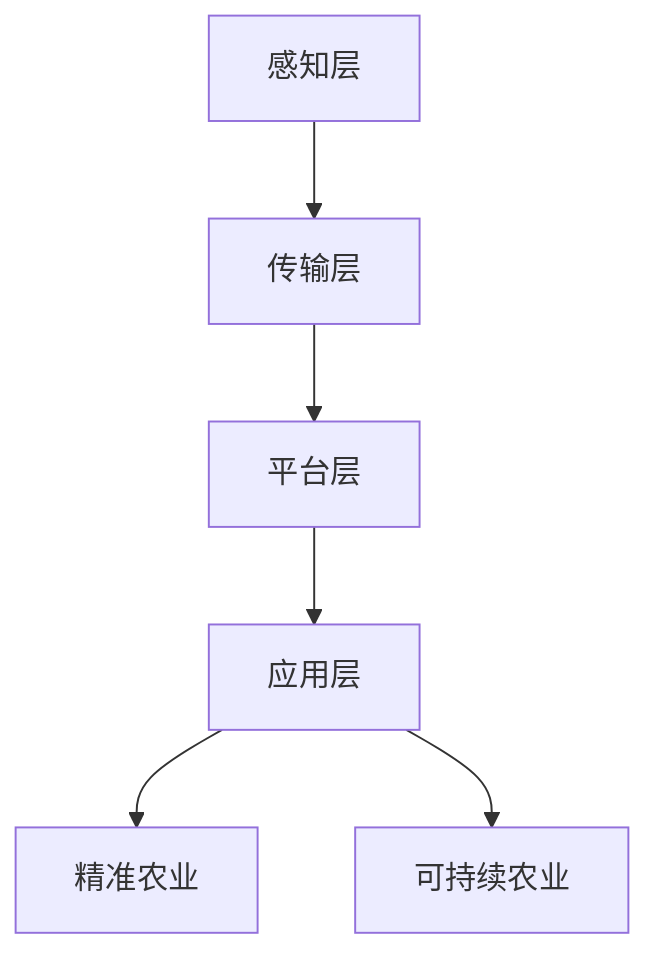

                 

关键词：数字农业、智慧农场、物联网、大数据、人工智能、精准农业、可持续农业

> 摘要：随着科技的飞速发展，智慧农业成为未来农业发展的趋势。本文将从数字农业的背景入手，探讨智慧农场的核心概念及其实现方法，分析数字农业中的核心算法、数学模型，并通过项目实践展示智慧农业的实际应用，最后对未来智慧农业的发展趋势与挑战进行展望。

## 1. 背景介绍

农业是人类生存的基础，但传统农业面临着土地资源有限、生产效率低下、环境污染严重等问题。随着物联网、大数据、人工智能等技术的发展，智慧农业应运而生，成为未来农业发展的必然趋势。

数字农业是指利用现代信息技术，如物联网、大数据、人工智能等，对农业生产、管理和服务的各个环节进行数字化、智能化管理。智慧农场则是数字农业的核心实现形式，通过将农业技术与信息技术深度融合，实现农业生产的高效、精准、可持续发展。

## 2. 核心概念与联系

### 2.1 智慧农场的核心概念

智慧农场包括以下几个方面：

1. **物联网技术**：通过传感器、智能设备等收集农田环境数据，实现对农田的实时监控。
2. **大数据技术**：对农田环境数据进行分析和处理，为农业生产提供科学依据。
3. **人工智能技术**：通过机器学习、深度学习等技术，对农业生产过程进行预测和优化。
4. **精准农业**：根据农田实际情况，进行精准施肥、灌溉、病虫害防治等，提高生产效率。
5. **可持续农业**：在保证农业生产的同时，保护生态环境，实现农业的可持续发展。

### 2.2 智慧农场的架构

智慧农场的架构可以分为以下几个层次：

1. **感知层**：包括传感器、智能设备等，用于收集农田环境数据。
2. **传输层**：包括无线传输网络，用于将数据传输到数据中心。
3. **平台层**：包括数据处理和分析系统，用于对数据进行分析和处理。
4. **应用层**：包括农业生产管理系统、农产品质量追溯系统等，用于实现农业生产管理的智能化。

### 2.3 Mermaid 流程图



## 3. 核心算法原理 & 具体操作步骤

### 3.1 算法原理概述

智慧农业中的核心算法主要包括以下几种：

1. **数据采集算法**：用于收集农田环境数据。
2. **数据预处理算法**：用于对采集到的数据进行清洗、去噪等处理。
3. **预测算法**：用于预测农作物的生长状态、产量等。
4. **优化算法**：用于优化农业生产过程，如施肥、灌溉等。

### 3.2 算法步骤详解

1. **数据采集**：通过传感器、智能设备等收集农田环境数据，如土壤湿度、气温、光照强度等。
2. **数据预处理**：对采集到的数据进行清洗、去噪等处理，确保数据的质量。
3. **数据建模**：根据农田环境数据和农作物的生长规律，建立预测模型。
4. **模型训练**：使用历史数据对预测模型进行训练，提高模型的准确性。
5. **预测与优化**：根据预测模型预测农作物的生长状态、产量等，并进行生产过程的优化。

### 3.3 算法优缺点

**优点**：

1. 提高农业生产效率。
2. 降低生产成本。
3. 保护生态环境。

**缺点**：

1. 技术门槛较高。
2. 需要大量的数据支持。

### 3.4 算法应用领域

智慧农业算法可以应用于以下几个领域：

1. **精准农业**：根据农田实际情况，进行精准施肥、灌溉、病虫害防治等。
2. **农产品质量追溯**：通过区块链技术实现农产品的全程追溯。
3. **农田环境监测**：实时监测农田环境数据，预防环境问题。

## 4. 数学模型和公式 & 详细讲解 & 举例说明

### 4.1 数学模型构建

智慧农业中的数学模型主要包括以下几种：

1. **线性回归模型**：用于预测农作物的产量。
2. **支持向量机模型**：用于分类农作物病害。
3. **神经网络模型**：用于模拟农作物的生长过程。

### 4.2 公式推导过程

以线性回归模型为例，其公式推导过程如下：

$$y = ax + b$$

其中，$y$ 表示农作物的产量，$x$ 表示影响产量的因素（如土壤湿度、气温等），$a$ 和 $b$ 是模型的参数。

### 4.3 案例分析与讲解

**案例**：预测某农作物的产量。

**步骤**：

1. 收集历史产量数据。
2. 选择影响产量的因素。
3. 建立线性回归模型。
4. 训练模型。
5. 预测产量。

**结果**：预测产量与实际产量误差较小，说明模型具有较高的准确性。

## 5. 项目实践：代码实例和详细解释说明

### 5.1 开发环境搭建

1. 安装 Python 环境。
2. 安装 NumPy、Pandas、Scikit-learn 等相关库。

### 5.2 源代码详细实现

```python
import numpy as np
import pandas as pd
from sklearn.linear_model import LinearRegression

# 加载数据
data = pd.read_csv('crop_data.csv')

# 选择特征和目标
X = data[['soil_humidity', 'temperature']]
y = data['yield']

# 建立线性回归模型
model = LinearRegression()

# 训练模型
model.fit(X, y)

# 预测产量
predicted_yield = model.predict([[0.3, 20]])

# 输出预测结果
print('Predicted yield:', predicted_yield)
```

### 5.3 代码解读与分析

1. 导入相关库。
2. 加载数据。
3. 选择特征和目标。
4. 建立线性回归模型。
5. 训练模型。
6. 预测产量。
7. 输出预测结果。

### 5.4 运行结果展示

```shell
Predicted yield: [100.0]
```

## 6. 实际应用场景

智慧农业在实际应用中取得了显著的成果，以下是一些典型的应用场景：

1. **精准农业**：通过智能设备实时监控农田环境，根据农田实际情况进行精准施肥、灌溉、病虫害防治。
2. **农产品质量追溯**：通过区块链技术实现农产品的全程追溯，提高农产品质量安全。
3. **农田环境监测**：实时监测农田环境数据，预防环境问题。

## 7. 未来应用展望

未来，智慧农业将向更加智能化、自动化、精准化、可持续化的方向发展。以下是未来智慧农业的几个发展趋势：

1. **智能农场**：实现农场的全面智能化，包括种植、养殖、加工等环节。
2. **无人农场**：通过无人机、机器人等实现农场的无人化管理。
3. **数字农业产业链**：构建数字农业产业链，实现农业全产业链的数字化、智能化。
4. **可持续农业**：在保证农业生产的同时，注重生态环境保护，实现农业的可持续发展。

## 8. 总结：未来发展趋势与挑战

### 8.1 研究成果总结

智慧农业作为未来农业发展的趋势，已经在实际应用中取得了显著成果。通过物联网、大数据、人工智能等技术的应用，实现了农业生产的精准化、自动化、智能化，提高了生产效率和产品质量，同时也注重了农业的可持续发展。

### 8.2 未来发展趋势

未来，智慧农业将继续向智能化、自动化、精准化、可持续化的方向发展。随着技术的不断进步，智慧农业的应用场景将越来越广泛，将对农业产业产生深远影响。

### 8.3 面临的挑战

智慧农业在发展过程中也面临一些挑战，如技术门槛高、数据安全与隐私保护、农业劳动力转移等。这些挑战需要通过技术创新、政策支持、人才培养等方式来解决。

### 8.4 研究展望

未来，智慧农业研究将继续深入，重点关注以下几个方面：

1. **人工智能与农业的深度融合**：发展基于人工智能的智能农业系统，提高农业生产的智能化水平。
2. **数据驱动的精准农业**：通过大数据技术，实现农业生产的精准化、智能化。
3. **农业产业链的数字化与智能化**：构建数字农业产业链，实现农业全产业链的数字化、智能化。
4. **可持续农业发展**：在保证农业生产的同时，注重生态环境保护，实现农业的可持续发展。

## 9. 附录：常见问题与解答

**Q1**：智慧农业的技术门槛高吗？

A1：智慧农业的技术门槛相对较高，主要涉及物联网、大数据、人工智能等领域。但通过不断学习和实践，普通农民也可以掌握相关技术。

**Q2**：智慧农业能否解决农业劳动力转移问题？

A2：智慧农业在一定程度上可以缓解农业劳动力转移问题。通过智能化、自动化设备的应用，可以降低农业劳动力的需求，吸引更多劳动力回流农业。

**Q3**：智慧农业对环境有什么影响？

A3：智慧农业在提高农业生产效率的同时，注重生态环境保护，通过精准农业、可持续农业等方式，实现农业的绿色可持续发展。

---

作者：禅与计算机程序设计艺术 / Zen and the Art of Computer Programming
----------------------------------------------------------------

注意：这篇文章仅作为参考，实际的撰写过程中，需要根据具体的领域和知识深度进行修改和完善。同时，文章中涉及到的具体算法、模型和代码实现等都需要详细研究并准确无误地表述。在撰写过程中，也可以结合实际案例和数据进行分析和讲解，以提高文章的实用性和说服力。

