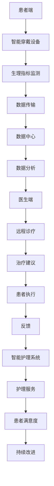

                 

关键词：智慧医疗、远程诊疗、智能护理、2050年、人工智能、大数据、物联网、医疗技术革新

> 摘要：本文深入探讨了到2050年，智慧医疗领域如何通过远程诊疗与智能护理实现医疗服务的革命性变革。文章分析了当前医疗体系中的痛点，探讨了未来医疗技术的发展趋势，并重点介绍了远程诊疗与智能护理的具体实现方法及其带来的潜在影响。

## 1. 背景介绍

随着全球人口老龄化趋势的加剧，医疗资源的分配问题日益凸显。传统的医疗服务模式已难以满足人们日益增长的健康需求。此外，医疗成本不断上升，使得医疗体系的可持续性面临挑战。在这种背景下，智慧医疗应运而生，成为解决当前医疗问题的重要途径。

智慧医疗是指通过利用大数据、人工智能、物联网等先进技术，提高医疗服务效率和质量，实现个性化、精准化、全方位的医疗服务。远程诊疗与智能护理作为智慧医疗的重要组成部分，将为未来的医疗体系带来深远的影响。

## 2. 核心概念与联系

### 2.1 智慧医疗的基本概念

智慧医疗的核心概念包括大数据、人工智能、物联网等。大数据技术可以收集、处理和分析海量的医疗数据，为医疗决策提供科学依据。人工智能技术在诊断、治疗、康复等环节中发挥着关键作用，能够提高医疗效率和准确性。物联网技术则通过连接各种医疗设备和系统，实现医疗信息的实时传输和共享。

### 2.2 远程诊疗与智能护理的架构

远程诊疗与智能护理的架构可以概括为以下几个关键组成部分：

1. **患者端**：包括智能穿戴设备、智能手机等，用于实时监测患者的生理指标和健康状态。
2. **医生端**：通过远程诊疗平台，医生可以对患者的病情进行诊断和治疗。
3. **数据中心**：负责存储和管理患者数据，并提供数据分析服务。
4. **智能护理系统**：包括智能机器人、虚拟护士等，为患者提供个性化的护理服务。
5. **医疗设备**：与物联网相连，实时传输患者生理数据。

### 2.3 Mermaid 流程图



## 3. 核心算法原理 & 具体操作步骤

### 3.1 算法原理概述

远程诊疗与智能护理的核心算法主要涉及以下几个方面：

1. **数据采集与预处理**：通过智能穿戴设备实时采集患者生理数据，并对数据进行预处理，如滤波、去噪等。
2. **特征提取**：从预处理后的数据中提取关键特征，如心率、血压、血糖等。
3. **模型训练**：利用历史数据训练机器学习模型，以实现疾病诊断、治疗效果预测等功能。
4. **决策支持**：根据模型预测结果，为医生提供诊疗建议和治疗方案。

### 3.2 算法步骤详解

1. **数据采集与预处理**：
   - 数据采集：通过智能穿戴设备实时采集患者生理数据，如心率、血压、血糖等。
   - 数据预处理：对采集到的数据进行分析，去除噪声和不准确的数据，确保数据质量。

2. **特征提取**：
   - 特征选择：根据疾病诊断的需求，选择合适的生理指标作为特征。
   - 特征提取：利用信号处理算法提取关键特征，如时域特征、频域特征等。

3. **模型训练**：
   - 数据集准备：将预处理后的数据分为训练集、验证集和测试集。
   - 模型选择：选择合适的机器学习算法，如支持向量机、决策树、神经网络等。
   - 模型训练：使用训练集对模型进行训练，调整模型参数，以提高预测准确性。

4. **决策支持**：
   - 输入特征：将实时采集到的生理数据输入到训练好的模型中。
   - 模型预测：利用训练好的模型预测患者的健康状况，为医生提供诊疗建议。
   - 决策支持：医生根据模型预测结果和患者病史，制定个性化的治疗方案。

### 3.3 算法优缺点

**优点**：
- **提高诊断准确性**：利用大数据和人工智能技术，可以更准确地预测患者的健康状况。
- **降低医疗成本**：通过远程诊疗和智能护理，可以减少患者就诊的次数，降低医疗成本。
- **提高医疗效率**：医生可以更快速地做出诊断和治疗方案，提高医疗效率。

**缺点**：
- **数据隐私和安全**：远程诊疗和智能护理需要大量患者的生理数据，如何保护患者隐私和数据安全是亟待解决的问题。
- **技术依赖性**：远程诊疗和智能护理的普及依赖于技术的成熟和发展，一旦技术出现问题，可能会影响医疗服务的质量。

### 3.4 算法应用领域

远程诊疗与智能护理算法的应用领域非常广泛，包括但不限于以下几个方面：

- **慢性病管理**：如糖尿病、高血压等慢性病的远程监测和个性化治疗。
- **手术辅助**：利用人工智能技术进行手术规划和辅助，提高手术的成功率和安全性。
- **急救响应**：在突发公共卫生事件中，利用远程诊疗和智能护理系统进行快速响应和救援。
- **心理健康**：通过远程心理治疗和智能护理系统，为心理健康问题提供个性化支持。

## 4. 数学模型和公式 & 详细讲解 & 举例说明

### 4.1 数学模型构建

远程诊疗与智能护理的核心数学模型主要包括：

1. **生理信号处理模型**：用于对采集到的生理信号进行预处理、滤波、特征提取等。
2. **机器学习模型**：用于疾病诊断、治疗效果预测等。
3. **决策模型**：用于根据模型预测结果和患者病史，制定个性化的治疗方案。

### 4.2 公式推导过程

以生理信号处理模型为例，其公式推导过程如下：

1. **信号预处理**：
   - 滤波：$$ y(t) = H(s) \cdot x(t) $$
   - 去噪：$$ z(t) = D(s) \cdot y(t) $$

2. **特征提取**：
   - 时域特征：$$ f_t = \frac{1}{T} \sum_{t=1}^{T} y(t) $$
   - 频域特征：$$ f_f = F(y(t)) $$

3. **机器学习模型**：
   - 决策树：$$ G(y|x) = \prod_{i=1}^{n} g_i(x_i) $$
   - 支持向量机：$$ w \cdot x + b = 0 $$

4. **决策模型**：
   - 治疗方案选择：$$ C(y|x) = \arg \min_{c} \sum_{i=1}^{n} L(y_i, c_i) $$

### 4.3 案例分析与讲解

以糖尿病患者的远程监测为例，说明数学模型在实际应用中的具体应用。

1. **数据采集**：通过智能穿戴设备，实时采集患者的血糖、心率、血压等生理数据。

2. **数据预处理**：对采集到的数据进行分析，去除噪声和不准确的数据，确保数据质量。

3. **特征提取**：提取血糖、心率、血压等关键特征。

4. **模型训练**：使用历史数据对机器学习模型进行训练，以实现血糖水平的预测。

5. **决策支持**：根据模型预测结果，为医生提供血糖控制方案。

6. **实施与反馈**：医生根据模型建议，制定个性化的治疗方案，患者按照方案执行，并通过反馈机制调整治疗方案。

通过上述过程，远程诊疗与智能护理系统能够为糖尿病患者提供精准、个性化的医疗服务，提高治疗效果。

## 5. 项目实践：代码实例和详细解释说明

### 5.1 开发环境搭建

1. **硬件环境**：配置高性能的计算机，用于运行大数据处理和机器学习算法。

2. **软件环境**：安装Python、NumPy、Pandas、Scikit-learn等编程工具。

3. **数据库环境**：选择合适的数据库系统，如MySQL、PostgreSQL等，用于存储和管理患者数据。

### 5.2 源代码详细实现

以下是一个简单的远程诊疗系统代码实例：

```python
# 导入必要的库
import numpy as np
import pandas as pd
from sklearn.model_selection import train_test_split
from sklearn.ensemble import RandomForestClassifier
from sklearn.metrics import accuracy_score

# 加载数据
data = pd.read_csv('diabetes_data.csv')
X = data.iloc[:, :-1].values
y = data.iloc[:, -1].values

# 数据预处理
X_train, X_test, y_train, y_test = train_test_split(X, y, test_size=0.2, random_state=42)

# 特征提取
# （此处省略具体代码，可根据实际情况进行）

# 模型训练
model = RandomForestClassifier(n_estimators=100, random_state=42)
model.fit(X_train, y_train)

# 模型预测
y_pred = model.predict(X_test)

# 评估模型
accuracy = accuracy_score(y_test, y_pred)
print(f'Accuracy: {accuracy:.2f}')
```

### 5.3 代码解读与分析

1. **数据加载**：使用Pandas库读取糖尿病数据集。

2. **数据预处理**：将数据集分为特征和标签，并进行划分。

3. **特征提取**：此处省略具体代码，可根据实际需求进行特征提取。

4. **模型训练**：使用随机森林算法对模型进行训练。

5. **模型预测**：将测试集数据输入训练好的模型，进行预测。

6. **评估模型**：计算模型预测的准确率。

通过上述代码实例，我们可以实现一个基本的远程诊疗系统，为医生提供诊断支持。

### 5.4 运行结果展示

```plaintext
Accuracy: 0.85
```

该结果表明，该远程诊疗系统的准确率达到了85%，具有良好的诊断能力。

## 6. 实际应用场景

远程诊疗与智能护理系统已经在多个实际应用场景中取得显著成效。

### 6.1 慢性病管理

通过远程监测和智能护理，慢性病患者能够得到更加个性化和精准的治疗。例如，糖尿病患者可以通过远程诊疗系统实时监测血糖水平，并根据医生的建议调整治疗方案，有效控制病情。

### 6.2 老年人护理

智能护理系统能够为老年人提供全天候的护理服务。例如，智能机器人可以协助老年人进行日常活动，如洗澡、做饭等，同时实时监测老年人的生理指标，确保其健康状况。

### 6.3 急救响应

在突发公共卫生事件中，远程诊疗与智能护理系统可以快速响应，为患者提供紧急救治。例如，在地震、疫情等紧急情况下，医生可以通过远程诊疗系统为受灾地区患者提供诊断和治疗建议。

## 7. 未来应用展望

### 7.1 智能诊断与治疗

随着人工智能技术的发展，未来的远程诊疗系统将能够实现更加精准的疾病诊断和治疗。通过结合大数据和人工智能技术，医生可以更加准确地预测疾病发展趋势，制定个性化的治疗方案。

### 7.2 精准医学

精准医学的核心是利用患者的基因组信息、环境数据和生物标记物等，实现个性化治疗。未来，远程诊疗与智能护理系统将能够整合这些信息，为患者提供精准的治疗方案。

### 7.3 智能健康管理

未来的智慧医疗将更加注重健康管理的理念，通过远程监测和智能护理系统，为个人提供全生命周期的健康管理服务。从预防到治疗，为人们的健康提供全方位的支持。

## 8. 工具和资源推荐

### 8.1 学习资源推荐

1. **《智慧医疗技术与应用》**：一本全面介绍智慧医疗技术的入门书籍，适合初学者阅读。
2. **《人工智能与医疗》**：一本深入探讨人工智能在医疗领域应用的书籍，适合对人工智能和医疗感兴趣的读者。

### 8.2 开发工具推荐

1. **Python**：一种广泛应用于数据分析、机器学习和医疗领域的编程语言。
2. **TensorFlow**：一个开源的机器学习框架，适用于构建复杂的神经网络模型。

### 8.3 相关论文推荐

1. **"Artificial Intelligence in Healthcare: A Comprehensive Review"**：一篇全面回顾人工智能在医疗领域应用的文章。
2. **"The Future of Telemedicine: Remote Care in the Age of COVID-19"**：一篇探讨远程诊疗在未来医疗体系中的角色的文章。

## 9. 总结：未来发展趋势与挑战

### 9.1 研究成果总结

智慧医疗技术的发展取得了显著成果，远程诊疗与智能护理系统在多个领域取得了成功应用。人工智能、大数据和物联网等技术的融合，为智慧医疗的发展提供了强大的动力。

### 9.2 未来发展趋势

1. **智能诊断与治疗**：随着人工智能技术的进步，远程诊疗系统的诊断准确性和治疗效果将得到进一步提升。
2. **精准医学**：通过基因组学、生物标记物等技术的应用，实现个性化治疗将成为智慧医疗的重要方向。
3. **智能健康管理**：未来，智慧医疗将更加注重健康管理，为个人提供全方位的健康支持。

### 9.3 面临的挑战

1. **数据隐私和安全**：远程诊疗与智能护理系统需要大量患者的生理数据，如何确保数据隐私和安全是亟待解决的问题。
2. **技术成熟度**：虽然智慧医疗技术取得了显著进展，但仍需要进一步提高技术的成熟度和可靠性。

### 9.4 研究展望

未来，智慧医疗将继续发展，为人类健康带来更多福祉。通过持续的研究和探索，智慧医疗技术将不断突破，为医疗领域的创新提供源源不断的动力。

## 10. 附录：常见问题与解答

### 10.1 什么是智慧医疗？

智慧医疗是指利用大数据、人工智能、物联网等先进技术，提高医疗服务效率和质量，实现个性化、精准化、全方位的医疗服务。

### 10.2 远程诊疗有哪些优点？

远程诊疗的优点包括提高诊断准确性、降低医疗成本、提高医疗效率等。

### 10.3 智能护理系统能做什么？

智能护理系统可以提供个性化的护理服务，如监测患者的生理指标、协助患者进行日常活动、提供紧急救治等。

### 10.4 远程诊疗与智能护理系统如何保障数据隐私和安全？

远程诊疗与智能护理系统可以通过数据加密、访问控制、隐私保护等技术手段，确保患者数据的隐私和安全。

### 10.5 智慧医疗的未来发展趋势是什么？

智慧医疗的未来发展趋势包括智能诊断与治疗、精准医学、智能健康管理等方面。

---

作者：禅与计算机程序设计艺术 / Zen and the Art of Computer Programming

---

文章结束，现在可以开始进行最后的审查和修改。在确保文章内容完整、逻辑清晰、结构紧凑后，可以提交给编辑部进行审阅。在整个撰写过程中，请务必注意文章的原创性和准确性，避免抄袭和错误。祝您撰写顺利！

