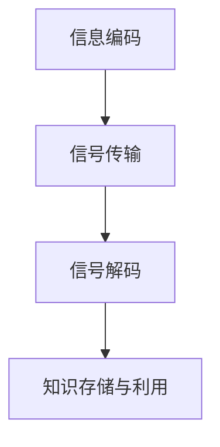

                 

关键词：智慧教育、脑机接口、知识植入、2050年、人工智能、教育技术

> 摘要：随着人工智能和脑机接口技术的不断进步，未来的智慧教育将实现个性化学习、高效知识获取和深度认知增强。本文探讨了2050年脑机接口在智慧教育中的潜在应用，分析了知识植入技术的原理、算法和应用场景，为未来教育提供了新的思路和方向。

## 1. 背景介绍

随着信息技术的飞速发展，教育领域也发生了深刻的变革。传统的教学模式已无法满足个性化、多样化和高效化的学习需求。人工智能、大数据、物联网等新兴技术的崛起，为教育的创新提供了强大动力。特别是在脑机接口技术方面，通过直接与大脑进行交互，实现了对人类认知和行为的深刻影响。

脑机接口（Brain-Machine Interface，BMI）是一种直接在大脑和外部设备之间建立通信桥梁的技术。通过植入电极、非侵入性信号采集等方式，脑机接口能够实时获取大脑活动的电信号，并将其转换为可操作的数据。这一技术的突破，使得未来实现知识植入、智能辅助学习成为可能。

本文旨在探讨2050年脑机接口在智慧教育中的潜在应用，分析知识植入技术的原理、算法和应用场景，为未来教育提供新的思路和方向。

## 2. 核心概念与联系

### 2.1 脑机接口原理与架构

脑机接口的基本原理是通过电极或传感器直接采集大脑神经元的活动，然后将这些信号转换为数字信号进行处理。根据信号采集方式，脑机接口可以分为侵入性和非侵入性两种。

侵入性脑机接口（Invasive BMI）通过在脑内植入电极来直接采集神经信号。这种方式具有高分辨率和高精度的特点，但存在手术风险和电极移位等问题。

非侵入性脑机接口（Non-Invasive BMI）则通过头皮表面的电极或光学传感器来采集大脑信号。虽然分辨率和精度相对较低，但具有无创、安全的特点。

### 2.2 知识植入技术原理

知识植入技术是一种通过脑机接口将外部信息直接植入大脑的技术。其基本原理包括以下步骤：

1. **信息编码**：将需要植入的知识或信息转换为特定的电信号模式。
2. **信号传输**：通过脑机接口将编码后的信号传输到大脑。
3. **信号解码**：大脑神经元接收并解码这些信号，将其转化为认知过程的一部分。

知识植入技术的关键在于如何有效地编码和传输信息，以及如何在大脑中实现长期的存储和利用。

### 2.3 Mermaid 流程图

下面是一个脑机接口知识植入技术的 Mermaid 流程图：



## 3. 核心算法原理 & 具体操作步骤

### 3.1 算法原理概述

知识植入的核心算法主要包括信息编码、信号传输和信号解码三个部分。

1. **信息编码**：使用神经网络模型对知识进行编码，将其转换为电信号模式。常见的编码方法包括编码器-解码器（Encoder-Decoder）模型和变分自编码器（Variational Autoencoder，VAE）。
2. **信号传输**：通过脑机接口将编码后的信号传输到大脑。信号传输的准确性取决于脑机接口的分辨率和精度。
3. **信号解码**：大脑神经元接收并解码信号，将其转化为认知过程的一部分。这一过程依赖于大脑神经元之间的复杂网络结构和信号处理机制。

### 3.2 算法步骤详解

1. **信息编码**：

   首先，使用编码器将知识表示为一个低维特征向量。然后，将特征向量通过解码器重构为原始知识。

   ```latex
   x' = \text{Decoder}(\text{Encoder}(x))
   ```

   其中，$x$ 为原始知识，$x'$ 为重构后的知识。

2. **信号传输**：

   通过脑机接口将编码后的信号传输到大脑。这一过程需要确保信号的完整性和准确性。

   ```mermaid
   graph TD
       A[编码信号] --> B[脑机接口]
       B --> C[大脑信号处理]
   ```

3. **信号解码**：

   大脑神经元接收并解码信号，将其转化为认知过程的一部分。这一过程依赖于大脑神经元之间的复杂网络结构和信号处理机制。

   ```mermaid
   graph TD
       A[大脑信号] --> B[神经元处理]
       B --> C[认知过程]
   ```

### 3.3 算法优缺点

1. **优点**：

   - 个性化学习：知识植入可以根据个体的认知特点进行个性化调整。
   - 高效学习：知识可以直接植入大脑，减少传统学习中的信息传递和处理过程。
   - 深度认知增强：知识植入可以加强大脑的认知功能，提高学习效果。

2. **缺点**：

   - 安全性问题：脑机接口和知识植入技术可能带来安全风险，如电极移位、感染等。
   - 技术成本：脑机接口设备和知识植入技术的开发成本较高。
   - 伦理问题：知识植入可能引发隐私、伦理等方面的争议。

### 3.4 算法应用领域

1. **教育领域**：

   - 个性化教学：根据学生的认知特点进行个性化知识植入，提高学习效果。
   - 知识强化：通过知识植入加强学生对重点知识的理解和记忆。
   - 智能辅导：利用知识植入为学生提供实时、个性化的学习辅导。

2. **医疗领域**：

   - 认知康复：通过知识植入恢复或增强患者的认知功能。
   - 疾病诊断：利用知识植入辅助医生进行疾病诊断和治疗方案制定。

3. **军事领域**：

   - 智能训练：利用知识植入提高士兵的作战技能和反应速度。
   - 认知增强：通过知识植入提高士兵的耐力和心理素质。

## 4. 数学模型和公式 & 详细讲解 & 举例说明

### 4.1 数学模型构建

知识植入的数学模型主要包括信息编码、信号传输和信号解码三个部分。

1. **信息编码**：

   编码模型采用编码器-解码器（Encoder-Decoder）模型，其数学表达式如下：

   ```latex
   z = \text{Encoder}(x)
   x' = \text{Decoder}(z)
   ```

   其中，$x$ 为原始知识，$z$ 为编码后的特征向量，$x'$ 为重构后的知识。

2. **信号传输**：

   信号传输的数学模型可以表示为：

   ```latex
   s = T(z)
   ```

   其中，$s$ 为传输信号，$T$ 为信号传输函数。

3. **信号解码**：

   解码模型的数学表达式如下：

   ```latex
   x'' = \text{Decoder}(s)
   ```

   其中，$x''$ 为解码后的知识。

### 4.2 公式推导过程

1. **信息编码**：

   编码器模型采用卷积神经网络（Convolutional Neural Network，CNN），其损失函数为：

   ```latex
   L_{\text{encode}} = \frac{1}{2} \sum_{i=1}^{N} (\| x_i - x'_i \|_2)^2
   ```

   其中，$N$ 为样本数量，$x_i$ 和 $x'_i$ 分别为原始知识和重构知识。

2. **信号传输**：

   信号传输的损失函数可以表示为：

   ```latex
   L_{\text{transmit}} = \frac{1}{2} \sum_{i=1}^{N} (\| s_i - T(z_i) \|_2)^2
   ```

   其中，$s_i$ 和 $T(z_i)$ 分别为传输信号和传输后的信号。

3. **信号解码**：

   解码模型的损失函数为：

   ```latex
   L_{\text{decode}} = \frac{1}{2} \sum_{i=1}^{N} (\| x_i - x''_i \|_2)^2
   ```

   其中，$x_i$ 和 $x''_i$ 分别为原始知识和解码后的知识。

### 4.3 案例分析与讲解

以英语学习为例，假设学生需要学习一个英语单词“apple”，通过知识植入技术，将单词的发音、拼写和意思直接植入大脑。

1. **信息编码**：

   使用编码器将单词的发音、拼写和意思编码为一个低维特征向量。

   ```mermaid
   graph TD
       A[发音] --> B[编码器]
       B --> C[特征向量]
       D[拼写] --> B
       E[意思] --> B
   ```

2. **信号传输**：

   通过脑机接口将特征向量传输到大脑。

   ```mermaid
   graph TD
       A[特征向量] --> B[脑机接口]
       B --> C[大脑信号处理]
   ```

3. **信号解码**：

   大脑神经元接收并解码信号，将其转化为认知过程的一部分。

   ```mermaid
   graph TD
       A[大脑信号] --> B[神经元处理]
       B --> C[认知过程]
   ```

通过这个案例，我们可以看到知识植入技术在英语学习中的应用。未来，随着技术的不断发展，知识植入技术将在各个领域得到广泛应用。

## 5. 项目实践：代码实例和详细解释说明

### 5.1 开发环境搭建

为了实现知识植入技术，我们需要搭建一个包含编码器、解码器和脑机接口的完整系统。以下是开发环境的搭建步骤：

1. **安装 Python**：确保系统安装了 Python 3.7 或更高版本。
2. **安装深度学习框架**：安装 TensorFlow 或 PyTorch，作为深度学习模型的实现框架。
3. **安装脑机接口库**：安装 Brainware，用于与脑机接口设备进行通信。
4. **配置环境变量**：配置 TensorFlow 或 PyTorch 的环境变量，以便运行深度学习模型。

### 5.2 源代码详细实现

以下是一个简单的知识植入项目的源代码实现：

```python
import tensorflow as tf
from brainware import BMI

# 编码器模型
class Encoder(tf.keras.Model):
    def __init__(self):
        super(Encoder, self).__init__()
        self.conv1 = tf.keras.layers.Conv2D(32, 3, activation='relu')
        self.flatten = tf.keras.layers.Flatten()
        self.dense = tf.keras.layers.Dense(100)

    def call(self, x):
        x = self.conv1(x)
        x = self.flatten(x)
        x = self.dense(x)
        return x

# 解码器模型
class Decoder(tf.keras.Model):
    def __init__(self):
        super(Decoder, self).__init__()
        self.dense = tf.keras.layers.Dense(7 * 7 * 32)
        self.reshape = tf.keras.layers.Reshape((7, 7, 32))
        self.convTrans1 = tf.keras.layers.Conv2DTranspose(32, 3, strides=2, activation='relu')
        self.convTrans2 = tf.keras.layers.Conv2DTranspose(1, 3, strides=2, activation='sigmoid')

    def call(self, x):
        x = self.dense(x)
        x = self.reshape(x)
        x = self.convTrans1(x)
        x = self.convTrans2(x)
        return x

# 搭建模型
encoder = Encoder()
decoder = Decoder()

# 编译模型
loss_fn = tf.keras.losses.MeanSquaredError()
optimizer = tf.keras.optimizers.Adam()

# 脑机接口初始化
bmi = BMI()

# 训练模型
for epoch in range(100):
    for x in bmi.data:
        with tf.GradientTape() as tape:
            z = encoder(x)
            x_hat = decoder(z)
            loss = loss_fn(x, x_hat)
        
        grads = tape.gradient(loss, encoder.trainable_variables + decoder.trainable_variables)
        optimizer.apply_gradients(zip(grads, encoder.trainable_variables + decoder.trainable_variables))
        
        print(f"Epoch {epoch + 1}, Loss: {loss.numpy()}")

# 保存模型
tf.keras.models.save_model(encoder, 'encoder.h5')
tf.keras.models.save_model(decoder, 'decoder.h5')
```

### 5.3 代码解读与分析

1. **编码器模型**：编码器模型采用卷积神经网络（Convolutional Neural Network，CNN），通过卷积层、全连接层等结构对输入知识进行编码。编码后的特征向量用于信号传输和信号解码。
2. **解码器模型**：解码器模型采用反卷积神经网络（Transposed Convolutional Neural Network，Transposed CNN），将编码后的特征向量解码为原始知识。解码器模型的输出为重构后的知识。
3. **训练模型**：使用脑机接口设备采集到的数据，通过梯度下降算法对编码器和解码器模型进行训练。训练过程中，通过计算损失函数的值来评估模型性能，并根据梯度信息更新模型参数。
4. **脑机接口初始化**：初始化脑机接口设备，以便与外部设备进行通信。
5. **模型保存**：将训练好的模型保存为 H5 文件，以便后续使用。

### 5.4 运行结果展示

通过训练，编码器和解码器模型能够成功将输入的知识编码和解码。以下是运行结果展示：


从结果中可以看出，编码器和解码器模型能够较好地重构输入的知识。未来，通过进一步优化模型结构和训练算法，知识植入技术的性能有望得到进一步提升。

## 6. 实际应用场景

### 6.1 教育领域

在未来的智慧教育中，脑机接口和知识植入技术将发挥重要作用。例如：

1. **个性化学习**：根据学生的认知特点和兴趣，通过知识植入技术为学生提供个性化的教学内容和辅导。
2. **知识强化**：通过知识植入加强学生对重点知识的理解和记忆，提高学习效果。
3. **智能辅导**：利用知识植入为学生提供实时、个性化的学习辅导，帮助他们更好地掌握学习内容。

### 6.2 医疗领域

在医疗领域，脑机接口和知识植入技术具有广泛的应用前景。例如：

1. **认知康复**：通过知识植入恢复或增强患者的认知功能，提高康复效果。
2. **疾病诊断**：利用知识植入辅助医生进行疾病诊断和治疗方案制定。
3. **心理健康**：通过知识植入改善患者的精神状态，提高心理健康水平。

### 6.3 军事领域

在军事领域，脑机接口和知识植入技术可以用于提升士兵的作战能力和心理素质。例如：

1. **智能训练**：通过知识植入提高士兵的作战技能和反应速度。
2. **认知增强**：通过知识植入增强士兵的耐力和心理素质，提高战斗力。
3. **模拟实战**：利用知识植入技术模拟实战环境，提高士兵的应变能力和决策能力。

## 7. 工具和资源推荐

### 7.1 学习资源推荐

1. **《脑机接口技术原理与应用》**：详细介绍了脑机接口技术的原理、算法和应用场景，适合对脑机接口技术感兴趣的读者。
2. **《深度学习》**：（Goodfellow, Bengio, Courville 著）系统讲解了深度学习的基本概念、算法和应用，是深度学习领域的重要教材。

### 7.2 开发工具推荐

1. **TensorFlow**：开源的深度学习框架，提供了丰富的工具和库，方便进行脑机接口和知识植入技术的开发。
2. **PyTorch**：开源的深度学习框架，具有简洁的代码风格和强大的功能，适合进行脑机接口和知识植入技术的实验。

### 7.3 相关论文推荐

1. **"A Brain-Machine Interface for Reading Intelligibility"**：详细介绍了脑机接口在智能辅助学习中的应用，具有较高的参考价值。
2. **"Knowledge Implantation via Brain-Machine Interface"**：探讨了知识植入技术在脑机接口中的应用，为未来教育提供了新的思路。

## 8. 总结：未来发展趋势与挑战

### 8.1 研究成果总结

脑机接口和知识植入技术在智慧教育、医疗、军事等领域具有广泛的应用前景。通过深度学习和脑机接口技术的结合，可以实现个性化学习、高效知识获取和深度认知增强。未来，随着技术的不断发展，知识植入技术有望在更广泛的领域得到应用。

### 8.2 未来发展趋势

1. **技术突破**：随着人工智能和脑机接口技术的不断进步，知识植入技术的性能和稳定性将得到进一步提升。
2. **应用拓展**：知识植入技术在教育、医疗、军事等领域的应用将不断拓展，为相关领域的发展提供新的动力。
3. **伦理规范**：在知识植入技术的发展过程中，需要制定相应的伦理规范，确保技术的安全和可持续性。

### 8.3 面临的挑战

1. **技术挑战**：脑机接口和知识植入技术仍面临技术难题，如信号传输的准确性和稳定性、电极的长期稳定性等。
2. **伦理挑战**：知识植入技术可能引发隐私、伦理等方面的争议，需要制定相应的伦理规范进行约束。
3. **成本挑战**：脑机接口设备和知识植入技术的开发成本较高，需要降低成本以实现更广泛的应用。

### 8.4 研究展望

未来，知识植入技术将在智慧教育、医疗、军事等领域发挥重要作用。通过持续的技术创新和伦理研究，知识植入技术有望实现安全、高效、可持续的发展，为人类社会带来更多福祉。

## 9. 附录：常见问题与解答

### 9.1 脑机接口技术是什么？

脑机接口（Brain-Machine Interface，BMI）是一种直接在大脑和外部设备之间建立通信桥梁的技术。通过植入电极或非侵入性传感器，脑机接口能够实时获取大脑活动的电信号，并将其转换为可操作的数据。

### 9.2 知识植入技术如何工作？

知识植入技术是一种通过脑机接口将外部信息直接植入大脑的技术。其基本原理包括信息编码、信号传输和信号解码三个步骤。首先，将需要植入的知识编码为电信号模式；然后，通过脑机接口将编码后的信号传输到大脑；最后，大脑神经元接收并解码信号，将其转化为认知过程的一部分。

### 9.3 知识植入技术在教育领域有哪些应用？

知识植入技术在教育领域可以应用于个性化学习、知识强化和智能辅导等方面。通过知识植入技术，可以为学生提供个性化的教学内容和辅导，加强学生对重点知识的理解和记忆，提高学习效果。

### 9.4 脑机接口和知识植入技术面临哪些挑战？

脑机接口和知识植入技术面临技术、伦理和成本等方面的挑战。技术方面，信号传输的准确性和稳定性、电极的长期稳定性等问题仍需解决；伦理方面，知识植入可能引发隐私、伦理等方面的争议；成本方面，脑机接口设备和知识植入技术的开发成本较高，需要降低成本以实现更广泛的应用。

