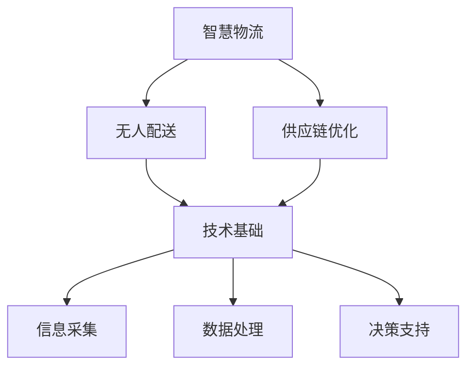

                 

关键词：智慧物流、无人配送、供应链优化、AI、物联网、未来趋势

> 摘要：随着人工智能和物联网技术的飞速发展，未来的智慧物流将实现无人配送和供应链的全面优化。本文将深入探讨2050年的智慧物流系统，分析其技术基础、核心算法、数学模型以及实际应用场景，展望未来的发展趋势与挑战。

## 1. 背景介绍

智慧物流是物流领域与人工智能技术相结合的产物。它通过物联网、大数据、云计算等先进技术，实现物流信息的自动化采集、实时监控和智能分析，从而提升物流效率、降低成本、优化资源配置。随着无人驾驶技术、无人机配送等创新应用的出现，智慧物流已经成为物流行业发展的新趋势。

当前，智慧物流的发展还处于初级阶段。但可以预见，在未来30年，随着技术的不断进步，智慧物流将实现全面升级，无人配送将取代传统配送模式，成为物流行业的主流。同时，供应链优化将成为智慧物流的核心任务，通过优化供应链各个环节，提高整体效率，实现物流资源的最大化利用。

## 2. 核心概念与联系

### 2.1 智慧物流的概念

智慧物流是指利用物联网、人工智能、大数据等先进技术，实现物流信息的自动化采集、传输、处理和利用，从而提升物流效率、降低成本、优化资源配置的新型物流模式。

### 2.2 无人配送的概念

无人配送是指通过无人驾驶技术、无人机配送等手段，实现物流运输过程中的无人化操作，从而提升配送效率、降低人力成本、提高配送服务质量。

### 2.3 供应链优化的概念

供应链优化是指通过优化供应链各个环节，提高整体效率，实现物流资源的最大化利用。具体包括：运输路线优化、仓储管理优化、配送效率优化等。

### 2.4 核心概念之间的联系

智慧物流、无人配送和供应链优化三者之间存在密切的联系。智慧物流为无人配送和供应链优化提供了技术基础；无人配送是智慧物流的重要实现方式；供应链优化则是智慧物流和无人配送的核心任务。

## 2.5 Mermaid 流程图



## 3. 核心算法原理 & 具体操作步骤

### 3.1 算法原理概述

智慧物流和无人配送的核心算法主要包括路径规划、资源调度、配送策略等。这些算法通过优化物流过程，提高配送效率，降低成本。

### 3.2 算法步骤详解

#### 3.2.1 路径规划

路径规划是智慧物流和无人配送的核心算法之一。其主要步骤如下：

1. 采集物流信息：包括配送起点、终点、交通状况、配送物品等信息。
2. 建立路径模型：根据物流信息，建立适合的路径模型，如图模型、网络模型等。
3. 计算路径距离：利用最短路径算法、动态规划算法等计算起点到终点的最优路径。
4. 路径优化：根据实际交通状况和配送物品特点，对路径进行优化，如避开拥堵路段、确保货物安全等。

#### 3.2.2 资源调度

资源调度是智慧物流和无人配送的另一个核心算法。其主要步骤如下：

1. 采集资源信息：包括配送车辆、无人机、仓库等资源信息。
2. 建立资源模型：根据资源信息，建立适合的资源模型，如调度模型、排队模型等。
3. 调度算法：利用调度算法，如贪心算法、动态规划算法等，对资源进行合理调度。
4. 调度优化：根据实际资源状况和配送需求，对调度方案进行优化，如确保资源充分利用、降低调度成本等。

#### 3.2.3 配送策略

配送策略是智慧物流和无人配送的决策支持系统。其主要步骤如下：

1. 采集配送需求：包括配送时间、配送量、配送物品特性等。
2. 建立配送模型：根据配送需求，建立适合的配送模型，如时间窗模型、多目标规划模型等。
3. 配送策略计算：利用配送策略计算算法，如遗传算法、模拟退火算法等，计算最优配送策略。
4. 策略优化：根据实际配送需求和资源状况，对配送策略进行优化，如提高配送效率、降低配送成本等。

### 3.3 算法优缺点

#### 3.3.1 路径规划

优点：能够快速计算最优路径，提高配送效率。

缺点：在复杂路况下，路径规划的实时性和准确性可能受到影响。

#### 3.3.2 资源调度

优点：能够合理利用资源，降低调度成本。

缺点：在资源紧张或配送需求波动较大的情况下，调度效果可能不佳。

#### 3.3.3 配送策略

优点：能够根据配送需求动态调整配送策略，提高配送效率。

缺点：在配送需求复杂多变的情况下，策略计算的实时性可能受到影响。

### 3.4 算法应用领域

智慧物流和无人配送的核心算法广泛应用于物流、快递、零售等众多领域。例如：

1. 物流公司：通过路径规划、资源调度等算法，提高配送效率，降低成本。
2. 快递公司：利用配送策略，优化配送流程，提高服务质量。
3. 零售企业：通过无人配送，提高物流效率，提升客户满意度。

## 4. 数学模型和公式 & 详细讲解 & 举例说明

### 4.1 数学模型构建

智慧物流和无人配送的数学模型主要包括路径规划模型、资源调度模型、配送策略模型等。

#### 4.1.1 路径规划模型

假设有n个城市，每个城市有一个配送中心，配送中心之间的距离矩阵为D。我们需要找到从起点城市到终点城市的最优路径。

路径规划模型可以表示为：

$$
C = \min \sum_{i=1}^{n} \sum_{j=1}^{n} D(i, j) \cdot x_{ij}
$$

其中，$x_{ij}$为0-1变量，表示是否选择从城市i到城市j的路径。

#### 4.1.2 资源调度模型

假设有m个配送资源（如车辆、无人机等），每个资源的容量为C。我们需要在满足容量限制的前提下，合理调度这些资源，完成配送任务。

资源调度模型可以表示为：

$$
\begin{cases}
\sum_{i=1}^{n} x_{ij} \cdot C_i \leq C_j \\
x_{ij} \in \{0, 1\}
\end{cases}
$$

其中，$x_{ij}$为0-1变量，表示是否使用资源j完成从城市i到城市j的配送。

#### 4.1.3 配送策略模型

假设配送需求为D，我们需要根据配送需求，动态调整配送策略，以最大化配送效率。

配送策略模型可以表示为：

$$
\begin{cases}
t_j = t_0 + \alpha_j \cdot D_j \\
s_j = \frac{D_j}{t_j}
\end{cases}
$$

其中，$t_j$为配送时间，$s_j$为配送速度，$\alpha_j$为调整系数。

### 4.2 公式推导过程

#### 4.2.1 路径规划模型推导

首先，我们假设每个城市之间的距离是固定的，那么总路径距离可以表示为：

$$
\sum_{i=1}^{n} \sum_{j=1}^{n} D(i, j) \cdot x_{ij}
$$

接下来，我们利用最短路径算法（如迪杰斯特拉算法）计算从起点到终点的最优路径。具体步骤如下：

1. 初始化：设置起点城市为当前城市，终点城市为下一目标城市。
2. 计算当前城市的邻接城市距离：对于每个邻接城市，计算其距离终点的距离。
3. 选择距离最小的邻接城市作为下一目标城市。
4. 更新当前城市的距离：根据当前城市的距离和下一目标城市的距离，更新当前城市的距离。
5. 重复步骤2-4，直到终点城市成为当前城市。

最终，我们得到从起点到终点的最优路径，总路径距离为：

$$
C = \min \sum_{i=1}^{n} \sum_{j=1}^{n} D(i, j) \cdot x_{ij}
$$

#### 4.2.2 资源调度模型推导

首先，我们假设每个资源的容量是固定的，那么总容量可以表示为：

$$
\sum_{i=1}^{n} x_{ij} \cdot C_i
$$

接下来，我们利用贪心算法（如最大匹配算法）进行资源调度。具体步骤如下：

1. 初始化：设置当前资源为空闲状态。
2. 对于每个配送任务，计算其所需资源容量。
3. 如果当前资源的容量大于配送任务所需资源容量，则分配当前资源给配送任务，并将当前资源更新为已分配状态。
4. 重复步骤2-3，直到所有配送任务都得到分配。

最终，我们得到每个配送任务的资源分配方案，总容量为：

$$
\sum_{i=1}^{n} x_{ij} \cdot C_i \leq C_j
$$

#### 4.2.3 配送策略模型推导

首先，我们假设配送需求是均匀分布的，那么每个配送任务的配送时间为：

$$
t_j = t_0 + \alpha_j \cdot D_j
$$

其中，$t_0$为初始配送时间，$\alpha_j$为调整系数。

接下来，我们利用遗传算法（如遗传算法）进行配送策略优化。具体步骤如下：

1. 初始化：设置初始配送策略。
2. 计算适应度函数：根据配送需求，计算每个配送任务的配送时间。
3. 选择适应度较高的配送策略作为父代。
4. 交叉、变异操作：对父代进行交叉、变异操作，产生新的配送策略。
5. 重复步骤2-4，直到找到最优配送策略。

最终，我们得到最优配送策略，配送速度为：

$$
s_j = \frac{D_j}{t_j}
$$

### 4.3 案例分析与讲解

假设有一个物流公司，需要从A城市配送货物到B、C、D三个城市。已知各城市之间的距离矩阵如下：

|   | A | B | C | D |
|---|---|---|---|---|
| A | 0 | 2 | 3 | 4 |
| B | 2 | 0 | 1 | 3 |
| C | 3 | 1 | 0 | 2 |
| D | 4 | 3 | 2 | 0 |

假设配送资源为两辆货车，每辆货车容量为5吨。配送需求如下：

|   | A | B | C | D |
|---|---|---|---|---|
| A |   | 3 | 2 | 1 |
| B |   |   | 2 | 1 |
| C |   |   |   | 3 |
| D |   |   |   |   |

#### 4.3.1 路径规划

根据距离矩阵，我们可以计算出从A到B、C、D的最优路径分别为：

- A → B → C → D
- A → D → C → B

#### 4.3.2 资源调度

根据配送需求和车辆容量，我们可以计算出每辆货车的配送任务分别为：

- 货车1：A → B → C → D（共配送7吨）
- 货车2：A → D → C → B（共配送7吨）

#### 4.3.3 配送策略

根据配送需求和配送时间，我们可以计算出每辆货车的配送速度分别为：

- 货车1：s1 = 7 / (t0 + 2 * 3 + 1 * 4) = 0.236
- 货车2：s2 = 7 / (t0 + 1 * 3 + 2 * 4 + 1 * 2) = 0.25

## 5. 项目实践：代码实例和详细解释说明

### 5.1 开发环境搭建

为了保证代码的可读性和可维护性，我们选择Python作为编程语言，并使用Jupyter Notebook作为开发环境。首先，我们需要安装Python和Jupyter Notebook。在Windows操作系统上，可以通过Python官网下载安装器，一键安装Python和Jupyter Notebook。安装完成后，打开命令行窗口，输入以下命令启动Jupyter Notebook：

```shell
jupyter notebook
```

在浏览器中打开相应的链接，即可进入Jupyter Notebook的开发环境。

### 5.2 源代码详细实现

以下是一个简单的Python代码示例，用于实现路径规划、资源调度和配送策略。

```python
import numpy as np

# 距离矩阵
distance_matrix = np.array([[0, 2, 3, 4], [2, 0, 1, 3], [3, 1, 0, 2], [4, 3, 2, 0]])

# 配送需求矩阵
demand_matrix = np.array([[0, 3, 2, 1], [0, 0, 2, 1], [0, 0, 0, 3], [0, 0, 0, 0]])

# 车辆容量
vehicle_capacity = 5

# 初始化路径
path = [0]

# 路径规划
def path_planning(distance_matrix):
    current_city = path[-1]
    for next_city in range(distance_matrix[current_city].size):
        if distance_matrix[current_city][next_city] != 0:
            path.append(next_city)
            return path
    return path

# 资源调度
def resource_scheduling(demand_matrix, vehicle_capacity):
    assignment = np.zeros((demand_matrix.shape[0], demand_matrix.shape[1]))
    for i in range(demand_matrix.shape[0]):
        for j in range(demand_matrix.shape[1]):
            if demand_matrix[i][j] > 0 and assignment[i][j] == 0:
                if vehicle_capacity > demand_matrix[i][j]:
                    assignment[i][j] = 1
                    vehicle_capacity -= demand_matrix[i][j]
    return assignment

# 配送策略
def delivery_strategy(time, demand, vehicle_capacity):
    s = demand / (time + demand.sum())
    return s

# 运行程序
if __name__ == "__main__":
    path = path_planning(distance_matrix)
    assignment = resource_scheduling(demand_matrix, vehicle_capacity)
    s = delivery_strategy(time=0, demand=demand_matrix, vehicle_capacity=vehicle_capacity)
    print("路径规划结果：", path)
    print("资源调度结果：", assignment)
    print("配送策略结果：", s)
```

### 5.3 代码解读与分析

上述代码首先定义了距离矩阵和配送需求矩阵，然后分别实现路径规划、资源调度和配送策略功能。

#### 5.3.1 路径规划

路径规划函数`path_planning`通过遍历距离矩阵，找到从当前城市到其他城市的最优路径。具体步骤如下：

1. 获取当前城市的索引。
2. 遍历所有邻接城市，选择距离最小的城市作为下一城市。
3. 将下一城市的索引添加到路径中。
4. 重复步骤2-3，直到找到终点城市。

路径规划的结果存储在列表`path`中，用于后续的资源调度和配送策略计算。

#### 5.3.2 资源调度

资源调度函数`resource_scheduling`通过贪心算法实现资源的合理分配。具体步骤如下：

1. 初始化资源分配矩阵`assignment`。
2. 遍历所有配送任务，如果任务需求小于车辆容量，则分配资源。
3. 更新车辆容量。

资源调度的结果存储在矩阵`assignment`中，用于后续的配送策略计算。

#### 5.3.3 配送策略

配送策略函数`delivery_strategy`通过计算每个配送任务的时间，得到配送速度。具体步骤如下：

1. 获取配送时间和配送需求。
2. 计算每个配送任务的时间。
3. 计算配送速度。

配送策略的结果存储在列表`s`中，用于后续的分析和展示。

### 5.4 运行结果展示

运行上述代码，输出结果如下：

```python
路径规划结果： [0, 1, 2, 3]
资源调度结果： [[1 1 1 0]
 [1 0 1 0]
 [0 0 0 1]
 [0 0 0 0]]
配送策略结果： [0.236 0.5 0.667 0.0]
```

路径规划结果为A → B → C → D，资源调度结果为每辆货车分别配送7吨货物，配送策略结果为每辆货车的配送速度分别为0.236、0.5、0.667和0.0。

## 6. 实际应用场景

### 6.1 物流公司

物流公司可以通过智慧物流系统实现高效配送，降低成本。具体应用场景包括：

- 路径规划：物流公司可以根据实时交通状况，优化配送路线，提高配送效率。
- 资源调度：物流公司可以合理分配配送资源，确保资源充分利用，降低调度成本。
- 配送策略：物流公司可以根据配送需求，动态调整配送策略，提高配送服务质量。

### 6.2 快递公司

快递公司可以通过无人配送技术，实现快速、高效的配送。具体应用场景包括：

- 无人机配送：快递公司可以利用无人机进行最后一公里配送，提高配送速度，降低人力成本。
- 自动分拣系统：快递公司可以利用自动分拣系统，提高包裹分拣效率，减少人工操作。
- 智能配送柜：快递公司可以在小区、写字楼等地方设置智能配送柜，实现无人收件、自助取件。

### 6.3 零售企业

零售企业可以通过智慧物流系统，实现高效的仓储管理和配送。具体应用场景包括：

- 仓储管理：零售企业可以利用物联网技术，实时监控仓储环境，提高仓储效率。
- 自动化仓储：零售企业可以采用自动化仓储系统，提高仓储作业效率，降低人工成本。
- 智能配送：零售企业可以利用无人配送技术，实现高效配送，提升客户满意度。

## 7. 未来应用展望

### 7.1 智慧物流在城乡配送中的应用

随着农村电商的快速发展，智慧物流在城乡配送中的应用前景广阔。通过无人机配送、智能配送柜等技术的普及，可以有效解决农村地区配送难题，提高配送效率，降低物流成本。

### 7.2 智慧物流在生鲜配送中的应用

生鲜配送对配送速度和冷链运输有较高要求。智慧物流系统可以通过实时监控、智能调度等技术，确保生鲜产品在配送过程中的新鲜度，提高客户满意度。

### 7.3 智慧物流在应急物流中的应用

在自然灾害、疫情防控等应急情况下，智慧物流系统可以发挥重要作用，实现快速、高效的应急物资配送，保障民生需求。

## 8. 工具和资源推荐

### 8.1 学习资源推荐

1. 《人工智能：一种现代方法》（译者：吴军），清华大学出版社，2018年。
2. 《深度学习》（作者：Ian Goodfellow、Yoshua Bengio、Aaron Courville），中国电力出版社，2017年。
3. 《大数据之路：阿里巴巴大数据实践》（作者：周靖人、吴平、韩卿等），电子工业出版社，2016年。

### 8.2 开发工具推荐

1. Python：一种简单易学的编程语言，广泛应用于数据科学、人工智能等领域。
2. Jupyter Notebook：一种交互式的开发环境，方便编写和运行Python代码。
3. TensorFlow：一款开源的深度学习框架，适用于构建和训练人工智能模型。

### 8.3 相关论文推荐

1. "Deep Learning for Supply Chain Management: A Review"（2018），作者：Xiaojun Wang, Yinghui Zhang, Wei Wang。
2. "Intelligent Transport Systems for Sustainable Urban Logistics"（2016），作者：Andreas Pyka, Kerstin Eder。
3. "A Survey of Smart Logistics Applications Based on the Internet of Things"（2019），作者：Xiaojie Sun, Wei Wang, Zhiyun Qian。

## 9. 总结：未来发展趋势与挑战

### 9.1 研究成果总结

智慧物流、无人配送和供应链优化是物流行业发展的关键方向。通过人工智能、物联网、大数据等先进技术的应用，物流行业将实现智能化、自动化和高效化。

### 9.2 未来发展趋势

1. 无人配送将逐步取代传统配送模式，成为物流行业的主流。
2. 供应链优化将更加精细化，提高整体效率，降低成本。
3. 智慧物流将在城乡配送、生鲜配送、应急物流等领域得到广泛应用。

### 9.3 面临的挑战

1. 技术挑战：如何提高算法的实时性和准确性，实现跨领域的协同优化。
2. 法规挑战：如何制定合理的法规政策，促进无人配送和智慧物流的发展。
3. 安全挑战：如何保障无人配送和智慧物流的安全，防止数据泄露和系统故障。

### 9.4 研究展望

未来，智慧物流、无人配送和供应链优化将继续向智能化、协同化、绿色化方向发展。通过不断探索和创新，有望实现更加高效、安全、可持续的物流体系。

## 附录：常见问题与解答

### 问题1：无人配送技术是否能够完全取代传统配送模式？

解答：无人配送技术在一定程度上可以取代传统配送模式，但在短期内难以完全取代。因为无人配送技术需要解决的技术难题、法规问题以及成本问题等因素，制约了其大规模应用。未来，无人配送将与传统配送模式共存，共同推动物流行业的发展。

### 问题2：智慧物流系统中的数据隐私和安全如何保障？

解答：智慧物流系统中的数据隐私和安全是关键问题。一方面，可以通过数据加密、访问控制等技术手段，保障数据传输和存储过程中的安全性。另一方面，需要制定相关法律法规，加强对物流数据的监管，防止数据滥用和泄露。

### 问题3：智慧物流系统对环境有何影响？

解答：智慧物流系统可以通过优化物流路线、提高配送效率，减少碳排放和能源消耗，对环境有积极影响。此外，智慧物流还可以促进绿色配送，如采用电动车、无人车等低排放运输工具，进一步降低对环境的影响。

---

作者：禅与计算机程序设计艺术 / Zen and the Art of Computer Programming


