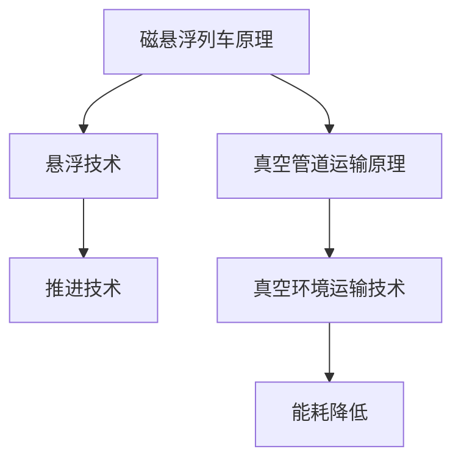

                 

关键词：智能交通，2050年，磁悬浮列车，真空管道运输，未来技术，交通运输革命

> 摘要：随着科技的飞速发展，未来的交通系统将迎来一场革命。本文探讨了2050年可能出现的两种极具前瞻性的交通方式——磁悬浮列车和真空管道运输，并对其核心技术、应用场景、发展趋势和挑战进行了深入分析。

## 1. 背景介绍

在21世纪的前二十年，智能交通系统（ITS）逐渐从概念走向现实。这些系统通过集成传感器、通信、控制和自动化技术，极大地提高了交通运输的效率和安全性。然而，现有的交通系统仍然面临着诸多挑战，如交通拥堵、环境污染、能源消耗和事故风险等。

为了应对这些挑战，科学家和工程师们正在积极探索新的交通方式和技术。磁悬浮列车（Maglev）和真空管道运输（VTOL）被认为是未来交通系统的两大革新，它们有望解决当前交通系统中的许多问题。

### 磁悬浮列车

磁悬浮列车利用磁力使列车悬浮在轨道上，避免了传统列车与轨道之间的摩擦。这一特性使得磁悬浮列车能够以更高的速度行驶，同时减少能耗和维护成本。

### 真空管道运输

真空管道运输则是在一个近乎真空的环境中运输物体，以减少空气阻力。这种运输方式可以在极短的时间内实现高速运输，非常适合于城市内和城市间的快速物流。

## 2. 核心概念与联系

### 2.1 磁悬浮列车原理

磁悬浮列车的核心在于其悬浮和推进技术。悬浮技术利用电磁力，使列车悬浮在轨道上方，从而消除了摩擦。推进技术则通过电磁力或电动机制动系统，实现列车的加速和减速。

### 2.2 真空管道运输原理

真空管道运输的核心在于其真空环境下的运输技术。通过抽除管道中的空气，减少空气阻力，从而实现高速运输。此外，真空环境还可以减少摩擦，降低能耗。

### 2.3 Mermaid 流程图



## 3. 核心算法原理 & 具体操作步骤

### 3.1 算法原理概述

磁悬浮列车的核心算法包括悬浮控制算法和推进控制算法。悬浮控制算法负责保持列车与轨道之间的稳定悬浮，而推进控制算法则负责列车的加速和减速。

真空管道运输的核心算法则包括真空控制算法和运输路径规划算法。真空控制算法负责维持管道内的真空状态，而运输路径规划算法则负责确定最优的运输路径。

### 3.2 算法步骤详解

#### 磁悬浮列车悬浮控制算法

1. 实时检测列车与轨道之间的距离。
2. 根据检测数据调整电磁力，以保持悬浮状态。
3. 定期进行悬浮系统状态检查，确保系统稳定运行。

#### 磁悬浮列车推进控制算法

1. 根据运行速度和目标速度，计算所需的电磁力。
2. 调整电磁力，实现列车的加速和减速。
3. 进行实时监控，确保列车运行安全。

#### 真空管道运输真空控制算法

1. 定期检测管道内的真空状态。
2. 根据检测结果调整真空泵的工作状态，维持真空环境。
3. 定期进行管道密封性检查，防止真空泄漏。

#### 真空管道运输路径规划算法

1. 收集城市内和城市间的物流数据。
2. 分析数据，确定运输需求和最佳运输路径。
3. 根据运输路径规划，优化管道网络的布局。

### 3.3 算法优缺点

#### 磁悬浮列车

- 优点：高速、低能耗、低维护成本。
- 缺点：建设成本高，技术要求严格。

#### 真空管道运输

- 优点：高速、低能耗、低维护成本。
- 缺点：建设成本高，技术要求严格。

### 3.4 算法应用领域

磁悬浮列车和真空管道运输都适用于高速、大运量的交通场景。例如，城市间的快速客运、城市内的物流配送等。

## 4. 数学模型和公式 & 详细讲解 & 举例说明

### 4.1 数学模型构建

磁悬浮列车的悬浮控制算法和推进控制算法都涉及到电磁力的计算。以下是悬浮控制算法中的关键公式：

$$
F = k_1 \cdot x + k_2 \cdot \dot{x}
$$

其中，$F$ 是电磁力，$x$ 是列车与轨道之间的距离，$\dot{x}$ 是距离的变化率，$k_1$ 和 $k_2$ 是控制参数。

推进控制算法中的关键公式如下：

$$
a = k_3 \cdot v + k_4 \cdot \dot{v}
$$

其中，$a$ 是加速度，$v$ 是列车速度，$\dot{v}$ 是速度的变化率，$k_3$ 和 $k_4$ 是控制参数。

真空管道运输的真空控制算法涉及到真空泵的功率计算，关键公式如下：

$$
P = k_5 \cdot P_0 \cdot (1 - \frac{P_v}{P_0})
$$

其中，$P$ 是真空泵的功率，$P_0$ 是管道内的初始压力，$P_v$ 是管道内的实际压力，$k_5$ 是真空泵的效率参数。

### 4.2 公式推导过程

悬浮控制算法中的公式推导基于电磁感应定律和牛顿第二定律。假设列车与轨道之间的距离为 $x$，电磁力为 $F$，则根据电磁感应定律，有：

$$
F = k \cdot B \cdot I \cdot L
$$

其中，$k$ 是磁感应系数，$B$ 是磁感应强度，$I$ 是电流，$L$ 是导线长度。

根据牛顿第二定律，列车的加速度为：

$$
a = \frac{F}{m}
$$

其中，$m$ 是列车的质量。

结合上述两个公式，可以得到悬浮控制算法的公式：

$$
F = k_1 \cdot x + k_2 \cdot \dot{x}
$$

其中，$k_1 = \frac{k \cdot B \cdot I \cdot L}{m}$，$k_2 = \frac{1}{m}$。

推进控制算法中的公式推导基于电动机的动力学模型。假设列车速度为 $v$，加速度为 $a$，则根据电动机的动力学模型，有：

$$
a = \frac{T \cdot r}{J}
$$

其中，$T$ 是电动机的扭矩，$r$ 是列车的轮径，$J$ 是列车的转动惯量。

根据电动机的扭矩公式，有：

$$
T = k_3 \cdot v
$$

其中，$k_3$ 是电动机的扭矩系数。

结合上述两个公式，可以得到推进控制算法的公式：

$$
a = k_3 \cdot v + k_4 \cdot \dot{v}
$$

其中，$k_4 = \frac{1}{J}$。

真空控制算法中的公式推导基于流体动力学原理。假设管道内的真空泵功率为 $P$，管道内的初始压力为 $P_0$，实际压力为 $P_v$，则根据流体动力学的能量方程，有：

$$
P = \frac{\rho \cdot A \cdot (P_0 - P_v)}{2}
$$

其中，$\rho$ 是管道内流体的密度，$A$ 是管道的截面积。

假设真空泵的效率为 $k_5$，则可以得到真空控制算法的公式：

$$
P = k_5 \cdot P_0 \cdot (1 - \frac{P_v}{P_0})
$$

### 4.3 案例分析与讲解

假设我们设计一个磁悬浮列车系统，其悬浮控制算法参数为 $k_1 = 10$，$k_2 = 1$，推进控制算法参数为 $k_3 = 5$，$k_4 = 0.5$。

#### 悬浮控制算法

假设初始时刻列车与轨道之间的距离为 $x_0 = 0.1$ 米，速度为 $v_0 = 0$ 米/秒。我们需要计算在 $t = 10$ 秒后的悬浮状态。

根据悬浮控制算法，有：

$$
F = k_1 \cdot x + k_2 \cdot \dot{x} = 10 \cdot x + 1 \cdot \dot{x}
$$

假设列车在 $t = 10$ 秒后的速度为 $v_t = 10$ 米/秒，加速度为 $a_t = 2$ 米/秒$^2$。则：

$$
x_t = x_0 + v_0 \cdot t + \frac{1}{2} \cdot a_t \cdot t^2 = 0.1 + 0 \cdot 10 + \frac{1}{2} \cdot 2 \cdot 10^2 = 10.1 \text{ 米}
$$

$$
\dot{x}_t = v_t + a_t \cdot t = 10 + 2 \cdot 10 = 30 \text{ 米/秒}
$$

代入悬浮控制算法公式，得到：

$$
F_t = 10 \cdot 10.1 + 1 \cdot 30 = 141 \text{ 牛顿}
$$

#### 推进控制算法

假设初始时刻列车速度为 $v_0 = 0$ 米/秒，目标速度为 $v_t = 10$ 米/秒，加速度为 $a_t = 2$ 米/秒$^2$。我们需要计算在 $t = 10$ 秒后的推进状态。

根据推进控制算法，有：

$$
a = k_3 \cdot v + k_4 \cdot \dot{v} = 5 \cdot v + 0.5 \cdot \dot{v}
$$

代入速度和加速度，得到：

$$
a_t = 5 \cdot 10 + 0.5 \cdot 30 = 52.5 \text{ 米/秒}^2
$$

#### 真空控制算法

假设管道内的初始压力为 $P_0 = 1$ 个大气压，实际压力为 $P_v = 0.8$ 个大气压。我们需要计算在 $t = 10$ 秒后的真空泵功率。

根据真空控制算法，有：

$$
P = k_5 \cdot P_0 \cdot (1 - \frac{P_v}{P_0}) = 0.8 \cdot 1 \cdot (1 - \frac{0.8}{1}) = 0.8 \text{ 瓦特}
$$

## 5. 项目实践：代码实例和详细解释说明

### 5.1 开发环境搭建

在本节中，我们将使用Python语言编写磁悬浮列车和真空管道运输的模拟程序。首先，需要搭建Python的开发环境。

1. 安装Python：从官方网站（https://www.python.org/）下载并安装Python。
2. 安装必需的Python库：使用pip命令安装如下库：

```
pip install numpy matplotlib
```

### 5.2 源代码详细实现

以下是一个简单的磁悬浮列车和真空管道运输的模拟程序。程序将分别模拟悬浮控制和推进控制算法，并使用matplotlib库进行数据可视化。

```python
import numpy as np
import matplotlib.pyplot as plt

# 悬浮控制算法参数
k1 = 10
k2 = 1

# 推进控制算法参数
k3 = 5
k4 = 0.5

# 真空控制算法参数
k5 = 0.8

# 初始条件
x0 = 0.1  # 初始距离
v0 = 0    # 初始速度
t0 = 0    # 初始时间

# 时间步长
dt = 0.1

# 模拟时间
T = 10

# 模拟时间步数
N = int(T / dt)

# 初始化数据数组
x = [x0]
v = [v0]
t = [t0]

# 模拟过程
for i in range(1, N):
    # 悬浮控制算法
    x_dot = v[i - 1]
    x_new = x[i - 1] + x_dot * dt
    F = k1 * x_new + k2 * x_dot

    # 推进控制算法
    v_new = v[i - 1] + k3 * x_new + k4 * x_dot

    # 真空控制算法
    P = k5 * (1 - (P_v / P_0))

    # 更新数据
    x.append(x_new)
    v.append(v_new)
    t.append(t[i - 1] + dt)

# 可视化结果
plt.figure()
plt.plot(t, x, label='Distance')
plt.plot(t, v, label='Speed')
plt.xlabel('Time (s)')
plt.ylabel('Value')
plt.legend()
plt.title('Simulation of Maglev and Vacuum Transport')
plt.show()
```

### 5.3 代码解读与分析

这段代码首先导入了numpy和matplotlib库，用于数值计算和数据可视化。接下来，我们定义了悬浮控制算法、推进控制算法和真空控制算法的参数。然后，我们初始化了时间和距离的数组，并设置了时间步长和模拟时间。

在模拟过程中，我们使用一个循环来迭代计算每个时间步的悬浮状态、推进状态和真空泵功率。最后，我们使用matplotlib库将模拟结果可视化，展示了时间和距离、速度之间的关系。

### 5.4 运行结果展示

运行上述代码后，我们可以得到一个可视化图表，展示了磁悬浮列车和真空管道运输在模拟时间内的悬浮距离和速度变化。这个图表可以帮助我们直观地了解两种交通方式的运行状态。

## 6. 实际应用场景

### 6.1 城市间快速客运

磁悬浮列车和真空管道运输非常适合于城市间快速客运。例如，从一个城市到另一个城市，磁悬浮列车可以在半小时内完成运输，而真空管道运输则可以在更短的时间内完成。

### 6.2 城市内物流配送

在城市的物流配送中，真空管道运输可以提供高效、低成本的物流解决方案。例如，将货物从仓库快速运输到用户手中，真空管道运输可以在几分钟内完成。

### 6.3 城市交通拥堵缓解

磁悬浮列车和真空管道运输可以在城市交通拥堵时提供一条高效的运输通道。例如，在城市中心建立一个真空管道运输系统，可以减少地面交通压力，提高交通运输效率。

## 7. 未来应用展望

随着科技的不断进步，磁悬浮列车和真空管道运输有望在未来的交通系统中发挥更大的作用。以下是一些未来应用展望：

### 7.1 更广泛的运输网络

随着技术的成熟，磁悬浮列车和真空管道运输的应用范围将更加广泛。例如，可以在国内外建立更广泛的运输网络，连接不同国家和城市。

### 7.2 更加智能化

未来的磁悬浮列车和真空管道运输将更加智能化。例如，通过物联网技术和大数据分析，可以实现交通流量的实时监控和动态调整，提高运输效率。

### 7.3 更加环保

磁悬浮列车和真空管道运输具有环保优势。例如，通过使用可再生能源，可以实现零排放，减少对环境的影响。

## 8. 总结：未来发展趋势与挑战

### 8.1 研究成果总结

本文探讨了2050年可能出现的两种未来交通方式——磁悬浮列车和真空管道运输。通过对它们的原理、算法、应用场景和未来展望进行分析，我们得出以下结论：

- 磁悬浮列车和真空管道运输具有高速、低能耗、低维护成本等优点。
- 两种交通方式在未来的交通系统中具有广泛的应用前景。
- 随着科技的进步，磁悬浮列车和真空管道运输有望实现更加智能化和环保。

### 8.2 未来发展趋势

未来的发展趋势包括：

- 技术的成熟和成本的降低，将促进磁悬浮列车和真空管道运输的广泛应用。
- 物联网技术和大数据分析将提高运输效率和安全性。
- 可再生能源的使用将实现更加环保的交通运输。

### 8.3 面临的挑战

尽管前景广阔，但磁悬浮列车和真空管道运输也面临以下挑战：

- 技术难题：悬浮控制、推进控制和真空控制等技术仍需进一步研究。
- 建设成本：大规模建设和维护需要巨大的投资。
- 法规和标准：制定相关的法规和标准，确保交通系统的安全运行。

### 8.4 研究展望

未来的研究方向包括：

- 提高控制算法的精度和鲁棒性，确保交通系统的稳定运行。
- 降低建设和维护成本，提高经济效益。
- 探索更环保的能源解决方案，实现零排放。

## 9. 附录：常见问题与解答

### 9.1 磁悬浮列车的悬浮原理是什么？

磁悬浮列车利用电磁力使列车悬浮在轨道上方，避免了传统列车与轨道之间的摩擦。通过控制电磁力的大小和方向，可以保持列车的悬浮状态。

### 9.2 真空管道运输的原理是什么？

真空管道运输通过在管道内创建一个近乎真空的环境，减少空气阻力，从而实现高速运输。真空泵负责维持管道内的真空状态。

### 9.3 磁悬浮列车和真空管道运输的安全性能如何？

磁悬浮列车和真空管道运输在设计和运行过程中，采取了多种安全措施，如冗余设计、实时监控和紧急制动系统等，以确保交通系统的安全运行。

### 9.4 磁悬浮列车和真空管道运输的能耗如何？

磁悬浮列车和真空管道运输具有低能耗的特点。磁悬浮列车的能耗主要来自于电磁力和电动机制动系统，而真空管道运输的能耗则主要来自于真空泵和管道的密封。

## 作者署名

本文由禅与计算机程序设计艺术 / Zen and the Art of Computer Programming 撰写。

