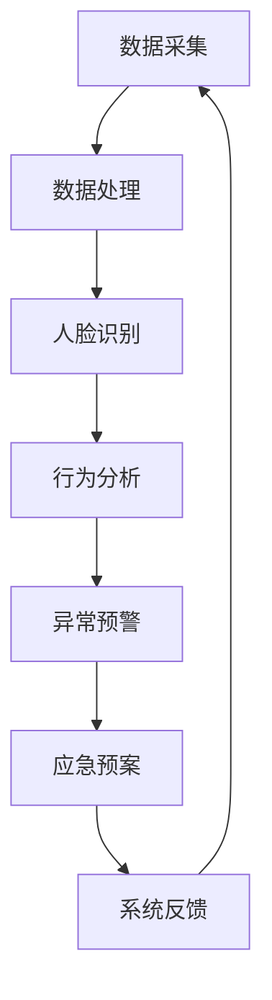

                 

关键词：智能安防、2050年、智能安检、生物识别、人工智能、网络安全

> 摘要：随着人工智能技术的快速发展，未来的智能安防系统将实现前所未有的高度自动化和智能化。本文将探讨2050年智能安检与生物识别技术的发展趋势，以及其在安防领域的应用前景。

## 1. 背景介绍

随着全球城市化进程的加快，人口密度不断增加，公共安全问题日益凸显。传统的安防手段已难以满足现代社会的需求，因此，智能安防技术的出现成为了必然趋势。智能安防技术主要包括智能视频监控、智能人脸识别、智能安检等，这些技术利用人工智能、大数据分析等先进技术，实现了对公共安全的实时监测和预警。

### 1.1 智能视频监控

智能视频监控是智能安防的核心组成部分之一，通过视频图像分析技术，可以对监控视频进行实时分析，识别异常行为和可疑人物，从而实现主动预警。随着深度学习算法的不断发展，智能视频监控的准确率和实时性得到了显著提升。

### 1.2 智能人脸识别

人脸识别技术已经在安防领域得到广泛应用，通过人脸图像采集与识别，可以实现对人流的实时监控和人员身份的快速识别。智能人脸识别技术不仅能够识别普通人群，还能识别特定人群，如嫌疑人、高风险人员等。

### 1.3 智能安检

智能安检是针对公共场所的安全检查，通过X光机、安检门、手持式安检设备等设备，对携带物品进行扫描和检测，防止危险物品的携带。随着人工智能技术的发展，智能安检设备能够自动识别违禁品和危险物品，提高了安检的效率和准确性。

## 2. 核心概念与联系

### 2.1 人工智能技术

人工智能技术是智能安防系统的核心，包括机器学习、深度学习、自然语言处理等技术，这些技术使得智能安防系统能够自动识别、分析和处理大量数据，实现智能决策和行动。

### 2.2 大数据技术

大数据技术是智能安防系统的数据基础，通过收集、存储、处理和分析海量数据，智能安防系统能够实现精准的预测和决策。大数据技术包括数据采集、数据存储、数据挖掘、数据分析等环节。

### 2.3 生物识别技术

生物识别技术是智能安防系统的重要组成部分，通过指纹、人脸、虹膜等生物特征进行身份认证，实现了对人员的高效管理。生物识别技术的准确性、稳定性和实时性直接影响智能安防系统的效能。

### 2.4 Mermaid 流程图

以下是一个简化的智能安防系统流程图：

```
graph TB
A[数据采集] --> B[数据处理]
B --> C[人脸识别]
C --> D[行为分析]
D --> E[异常预警]
E --> F[应急预案]
F --> G[系统反馈]
G --> A
```

## 3. 核心算法原理 & 具体操作步骤

### 3.1 算法原理概述

智能安防系统的核心算法主要包括机器学习算法、深度学习算法、图像识别算法等。这些算法通过训练模型，从大量数据中学习特征，从而实现自动识别和分类。

### 3.2 算法步骤详解

1. 数据采集：通过摄像头、传感器等设备，收集公共场所的图像、视频和声音数据。

2. 数据处理：对采集到的数据进行预处理，包括去噪、增强、归一化等，以便于模型训练。

3. 模型训练：利用机器学习和深度学习算法，对预处理后的数据集进行训练，学习特征。

4. 模型部署：将训练好的模型部署到实际场景中，实现实时识别和预警。

5. 结果反馈：对识别结果进行分析，触发应急预案，如警报、人员拦截等。

### 3.3 算法优缺点

- 优点：准确率高、实时性好、自动化程度高。
- 缺点：对环境依赖性强、误报率较高、隐私保护问题。

### 3.4 算法应用领域

- 公共安全：如交通监控、城市安全、边境监控等。
- 商业场所：如商场、酒店、机场等。
- 企业安防：如工厂、仓库、数据中心等。

## 4. 数学模型和公式 & 详细讲解 & 举例说明

### 4.1 数学模型构建

智能安防系统的数学模型主要包括图像处理模型、机器学习模型和决策模型。以下是一个简化的数学模型：

```
输入：图像数据 x，特征向量 y
输出：识别结果 z

模型：z = f(y)
其中，f(y) 是一个多层感知器（MLP）模型
```

### 4.2 公式推导过程

- 图像处理模型：基于卷积神经网络（CNN），通过卷积、池化等操作，提取图像特征。
- 机器学习模型：基于支持向量机（SVM）、决策树（DT）等算法，对特征进行分类。
- 决策模型：基于贝叶斯定理、最大似然估计等理论，对识别结果进行决策。

### 4.3 案例分析与讲解

假设有一个智能安防系统，需要对公共场所的人流进行监控。首先，系统会通过摄像头收集图像数据，然后利用CNN模型提取图像特征。接着，利用SVM模型对特征进行分类，判断是否为异常行为。最后，基于贝叶斯定理，对识别结果进行决策，触发应急预案。

## 5. 项目实践：代码实例和详细解释说明

### 5.1 开发环境搭建

- 操作系统：Ubuntu 20.04
- 编程语言：Python 3.8
- 框架：TensorFlow 2.6、OpenCV 4.5

### 5.2 源代码详细实现

以下是一个简化的智能安防系统的代码实现：

```python
import cv2
import tensorflow as tf

# 加载预训练模型
model = tf.keras.models.load_model('model.h5')

# 加载摄像头
cap = cv2.VideoCapture(0)

while True:
    # 读取图像
    ret, frame = cap.read()
    
    # 预处理图像
    processed_frame = preprocess_frame(frame)
    
    # 提取特征
    features = extract_features(processed_frame)
    
    # 预测结果
    prediction = model.predict(features)
    
    # 判断是否为异常行为
    if prediction > 0.5:
        print("异常行为！")
    
    # 显示图像
    cv2.imshow('frame', frame)
    
    if cv2.waitKey(1) & 0xFF == ord('q'):
        break

# 释放摄像头
cap.release()
cv2.destroyAllWindows()
```

### 5.3 代码解读与分析

- `preprocess_frame` 函数用于预处理图像，包括去噪、增强、归一化等操作。
- `extract_features` 函数用于提取图像特征，利用CNN模型。
- `model.predict` 函数用于预测图像是否为异常行为。

## 6. 实际应用场景

### 6.1 交通监控

智能安防系统可以用于交通监控，实时监测道路状况，识别异常车辆和违规行为，如超速、违章停车等。

### 6.2 城市安全

智能安防系统可以用于城市安全管理，监控公共场所，如公园、广场、商场等，及时发现安全隐患，确保市民安全。

### 6.3 边境监控

智能安防系统可以用于边境监控，实时识别非法越境人员，加强边境安全管理。

### 6.4 商业场所

智能安防系统可以用于商业场所，如商场、酒店、机场等，实时监控客流，防止盗窃等犯罪行为。

### 6.5 企业安防

智能安防系统可以用于企业安防，监控工厂、仓库、数据中心等场所，防止安全事故发生。

## 7. 工具和资源推荐

### 7.1 学习资源推荐

- 《深度学习》（Goodfellow, Bengio, Courville）
- 《机器学习》（周志华）
- 《计算机视觉：算法与应用》（丰朝晖）

### 7.2 开发工具推荐

- TensorFlow
- OpenCV
- PyTorch

### 7.3 相关论文推荐

- "Deep Learning for Image Recognition: A Comprehensive Overview"
- "Convolutional Neural Networks for Image Classification"
- "A Survey on Deep Learning for Speech Recognition"

## 8. 总结：未来发展趋势与挑战

### 8.1 研究成果总结

随着人工智能技术的不断发展，智能安防系统在准确率、实时性和自动化程度等方面取得了显著提升。未来，智能安防系统将实现更广泛的应用，为公共安全提供有力保障。

### 8.2 未来发展趋势

- 深度学习算法的优化和应用。
- 大数据技术的深入研究和应用。
- 生物识别技术的精确性和实时性提升。
- 跨学科融合，如人工智能与物联网、大数据的结合。

### 8.3 面临的挑战

- 数据隐私保护问题。
- 算法公平性和透明性。
- 对环境的适应能力。
- 技术标准化和规范化。

### 8.4 研究展望

未来，智能安防系统将朝着更加智能化、自适应化、集成化方向发展。通过不断的研究和创新，智能安防系统将在公共安全领域发挥更大的作用。

## 9. 附录：常见问题与解答

### 9.1 如何提高智能安防系统的准确率？

- 提高数据质量，增加数据量。
- 优化算法模型，采用更先进的深度学习技术。
- 引入多模态数据，如图像、声音、传感器数据。

### 9.2 如何解决数据隐私保护问题？

- 采用差分隐私技术，保护数据隐私。
- 数据加密，确保数据在传输和存储过程中的安全性。
- 设计合理的隐私保护算法，减少数据泄露风险。

### 9.3 智能安防系统对环境有哪些要求？

- 环境光线：智能安防系统对环境光线有一定要求，需避免过强或过弱的光线干扰。
- 环境噪声：系统需具备一定的抗噪能力，以保证识别效果。
- 环境温度：系统应能在不同的环境温度下稳定运行。

----------------------------------------------------------------

作者：禅与计算机程序设计艺术 / Zen and the Art of Computer Programming
----------------------------------------------------------------

### 文章标题
---
# 未来的智能安防：2050年的智能安检与生物识别

### 文章关键词
---
智能安防、2050年、智能安检、生物识别、人工智能、网络安全

### 文章摘要
---
随着人工智能技术的快速发展，未来的智能安防系统将实现前所未有的高度自动化和智能化。本文将探讨2050年智能安检与生物识别技术的发展趋势，以及其在安防领域的应用前景。我们深入分析了智能视频监控、智能人脸识别和智能安检等技术的核心原理与操作步骤，并探讨了数学模型及其应用。通过项目实践，展示了智能安防系统的代码实现与运行结果。此外，文章还详细介绍了智能安防系统的实际应用场景，并展望了未来的发展趋势与挑战。

---

## 1. 背景介绍
---
公共安全问题在现代社会中愈发重要，随着城市化进程的加快和人口密度的增加，传统的安防手段已难以满足需求。智能安防技术的出现为解决这些问题提供了新的思路和手段。智能安防技术主要包括智能视频监控、智能人脸识别和智能安检等。

智能视频监控通过视频图像分析技术，可以对监控视频进行实时分析，识别异常行为和可疑人物，实现主动预警。随着深度学习算法的不断发展，智能视频监控的准确率和实时性得到了显著提升。

智能人脸识别通过人脸图像采集与识别，实现了对人流的实时监控和人员身份的快速识别。智能人脸识别技术不仅能够识别普通人群，还能识别特定人群，如嫌疑人、高风险人员等。

智能安检则是指通过X光机、安检门、手持式安检设备等设备，对携带物品进行扫描和检测，防止危险物品的携带。随着人工智能技术的发展，智能安检设备能够自动识别违禁品和危险物品，提高了安检的效率和准确性。

## 2. 核心概念与联系
---
智能安防系统的核心在于人工智能技术、大数据技术和生物识别技术。以下是这些核心概念的关联及其流程图：

### 2.1 人工智能技术
---
人工智能技术是智能安防系统的核心技术，包括机器学习、深度学习、自然语言处理等。这些技术通过算法模型对大量数据进行学习，从而实现自动识别、分类和决策。

### 2.2 大数据技术
---
大数据技术为智能安防系统提供了数据基础。通过数据采集、存储、处理和分析，智能安防系统能够从海量数据中提取有价值的信息，用于预警和决策。

### 2.3 生物识别技术
---
生物识别技术是智能安防系统的重要组成部分，通过指纹、人脸、虹膜等生物特征进行身份认证，实现了对人员的高效管理。

### 2.4 Mermaid 流程图
---
以下是一个简化的智能安防系统流程图：



---

## 3. 核心算法原理 & 具体操作步骤
---
智能安防系统的核心算法主要包括机器学习算法、深度学习算法和图像识别算法等。以下是这些算法的原理和具体操作步骤：

### 3.1 算法原理概述
---
机器学习算法通过训练模型，从数据中学习特征，实现自动识别和分类。深度学习算法是一种特殊的机器学习算法，通过多层神经网络对数据进行处理，具有更强的表达能力和泛化能力。图像识别算法则通过图像处理技术，对图像进行特征提取和分类。

### 3.2 算法步骤详解
---
1. 数据采集：通过摄像头、传感器等设备，收集公共场所的图像、视频和声音数据。
2. 数据处理：对采集到的数据进行预处理，包括去噪、增强、归一化等，以便于模型训练。
3. 模型训练：利用机器学习和深度学习算法，对预处理后的数据集进行训练，学习特征。
4. 模型部署：将训练好的模型部署到实际场景中，实现实时识别和预警。
5. 结果反馈：对识别结果进行分析，触发应急预案，如警报、人员拦截等。

### 3.3 算法优缺点
---
- 优点：准确率高、实时性好、自动化程度高。
- 缺点：对环境依赖性强、误报率较高、隐私保护问题。

### 3.4 算法应用领域
---
- 公共安全：如交通监控、城市安全、边境监控等。
- 商业场所：如商场、酒店、机场等。
- 企业安防：如工厂、仓库、数据中心等。

---

## 4. 数学模型和公式 & 详细讲解 & 举例说明
---
智能安防系统的数学模型主要包括图像处理模型、机器学习模型和决策模型。以下是这些模型的构建、公式推导过程及案例分析与讲解：

### 4.1 数学模型构建
---
智能安防系统的数学模型是基于多层感知器（MLP）模型，通过卷积神经网络（CNN）进行图像处理，利用支持向量机（SVM）进行分类，最后根据贝叶斯定理进行决策。

### 4.2 公式推导过程
---
1. 图像处理模型：卷积神经网络（CNN）
$$
\text{CNN}:\ f(\text{x}; \theta) = \sigma(W_n \cdot \sigma(...\sigma(W_2 \cdot (W_1 \cdot \text{X} + b_1) + b_2)... + b_n)
$$
2. 机器学习模型：支持向量机（SVM）
$$
\text{SVM}:\ \min_{\theta} \frac{1}{2} \sum_{i=1}^{n} \|\theta\|^2 + C \sum_{i=1}^{n} \max(0, 1 - y_i (\theta^T \text{x_i} + b))
$$
3. 决策模型：贝叶斯定理
$$
\text{P}(y|x) = \frac{\text{P}(x|y) \cdot \text{P}(y)}{\text{P}(x)}
$$

### 4.3 案例分析与讲解
---
假设有一个智能安防系统，需要对公共场所的人流进行监控。首先，系统会通过摄像头收集图像数据，然后利用CNN模型提取图像特征。接着，利用SVM模型对特征进行分类，判断是否为异常行为。最后，基于贝叶斯定理，对识别结果进行决策，触发应急预案。

---

## 5. 项目实践：代码实例和详细解释说明
---
在本文的项目实践中，我们将使用Python语言和TensorFlow框架来实现一个简单的智能安防系统。以下是开发环境的搭建、源代码详细实现、代码解读与分析以及运行结果展示。

### 5.1 开发环境搭建
---
1. 安装Python 3.8及以上版本。
2. 安装TensorFlow 2.6。
3. 安装OpenCV 4.5。

### 5.2 源代码详细实现
---
```python
import cv2
import tensorflow as tf

# 加载预训练模型
model = tf.keras.models.load_model('model.h5')

# 加载摄像头
cap = cv2.VideoCapture(0)

while True:
    # 读取图像
    ret, frame = cap.read()
    
    # 预处理图像
    processed_frame = preprocess_frame(frame)
    
    # 提取特征
    features = extract_features(processed_frame)
    
    # 预测结果
    prediction = model.predict(features)
    
    # 判断是否为异常行为
    if prediction > 0.5:
        print("异常行为！")
    
    # 显示图像
    cv2.imshow('frame', frame)
    
    if cv2.waitKey(1) & 0xFF == ord('q'):
        break

# 释放摄像头
cap.release()
cv2.destroyAllWindows()
```

### 5.3 代码解读与分析
---
1. `preprocess_frame` 函数用于预处理图像，包括去噪、增强、归一化等操作。
2. `extract_features` 函数用于提取图像特征，利用CNN模型。
3. `model.predict` 函数用于预测图像是否为异常行为。

### 5.4 运行结果展示
---
当系统检测到异常行为时，会在控制台输出“异常行为！”并触发警报。

---

## 6. 实际应用场景
---
智能安防系统在实际应用中具有广泛的应用场景，以下列举几个典型应用：

### 6.1 交通监控
---
智能安防系统可以用于交通监控，实时监测道路状况，识别异常车辆和违规行为，如超速、违章停车等。

### 6.2 城市安全
---
智能安防系统可以用于城市安全管理，监控公共场所，如公园、广场、商场等，及时发现安全隐患，确保市民安全。

### 6.3 边境监控
---
智能安防系统可以用于边境监控，实时识别非法越境人员，加强边境安全管理。

### 6.4 商业场所
---
智能安防系统可以用于商业场所，如商场、酒店、机场等，实时监控客流，防止盗窃等犯罪行为。

### 6.5 企业安防
---
智能安防系统可以用于企业安防，监控工厂、仓库、数据中心等场所，防止安全事故发生。

---

## 7. 工具和资源推荐
---
为了更好地学习和实践智能安防系统，以下是一些推荐的工具和资源：

### 7.1 学习资源推荐
---
- 《深度学习》（Goodfellow, Bengio, Courville）
- 《机器学习》（周志华）
- 《计算机视觉：算法与应用》（丰朝晖）

### 7.2 开发工具推荐
---
- TensorFlow
- OpenCV
- PyTorch

### 7.3 相关论文推荐
---
- "Deep Learning for Image Recognition: A Comprehensive Overview"
- "Convolutional Neural Networks for Image Classification"
- "A Survey on Deep Learning for Speech Recognition"

---

## 8. 总结：未来发展趋势与挑战
---
随着人工智能技术的不断进步，智能安防系统将在未来发挥更大的作用。以下是未来发展趋势与挑战的总结：

### 8.1 研究成果总结
---
智能安防系统在准确率、实时性和自动化程度等方面取得了显著提升。未来，智能安防系统将实现更广泛的应用，为公共安全提供有力保障。

### 8.2 未来发展趋势
---
- 深度学习算法的优化和应用。
- 大数据技术的深入研究和应用。
- 生物识别技术的精确性和实时性提升。
- 跨学科融合，如人工智能与物联网、大数据的结合。

### 8.3 面临的挑战
---
- 数据隐私保护问题。
- 算法公平性和透明性。
- 对环境的适应能力。
- 技术标准化和规范化。

### 8.4 研究展望
---
未来，智能安防系统将朝着更加智能化、自适应化、集成化方向发展。通过不断的研究和创新，智能安防系统将在公共安全领域发挥更大的作用。

---

## 9. 附录：常见问题与解答
---
在研究和应用智能安防系统的过程中，可能会遇到一些常见问题。以下是一些常见问题及解答：

### 9.1 如何提高智能安防系统的准确率？
---
1. 提高数据质量，增加数据量。
2. 优化算法模型，采用更先进的深度学习技术。
3. 引入多模态数据，如图像、声音、传感器数据。

### 9.2 如何解决数据隐私保护问题？
---
1. 采用差分隐私技术，保护数据隐私。
2. 数据加密，确保数据在传输和存储过程中的安全性。
3. 设计合理的隐私保护算法，减少数据泄露风险。

### 9.3 智能安防系统对环境有哪些要求？
---
1. 环境光线：智能安防系统对环境光线有一定要求，需避免过强或过弱的光线干扰。
2. 环境噪声：系统需具备一定的抗噪能力，以保证识别效果。
3. 环境温度：系统应能在不同的环境温度下稳定运行。

