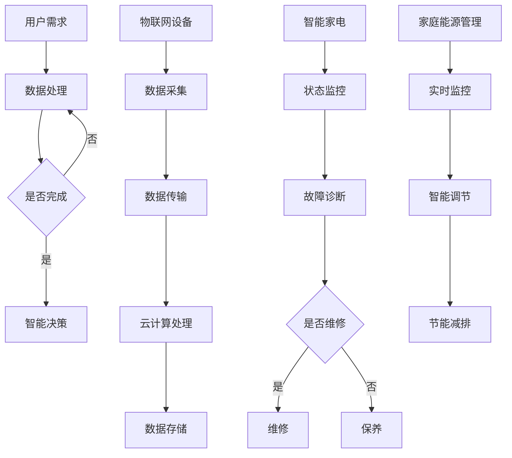

                 

未来智能家居的发展是我们不断追求更加便捷、舒适和高效生活方式的必然趋势。随着人工智能、物联网和大数据技术的迅猛发展，智能家居系统已经逐渐走进了我们的生活，并改变了我们对家庭生活的传统认知。然而，我们对于智能家居的理解还远远没有达到尽头。本文将探讨到2050年，智能家居技术将如何发展，尤其是智能家电和家庭能源管理方面的创新。

> 关键词：智能家居、智能家电、家庭能源管理、物联网、人工智能、2050年

> 摘要：本文将从背景介绍、核心概念与联系、核心算法原理、数学模型与公式、项目实践、实际应用场景、工具和资源推荐以及未来发展趋势与挑战等多个方面，深入探讨到2050年智能家居的潜在发展趋势和关键技术。

## 1. 背景介绍

随着社会的进步和科技的发展，人们对于家庭生活的需求也在不断提高。传统的家庭设备往往功能单一，难以满足现代家庭多样化的需求。因此，智能家电的诞生成为了一种必然的趋势。智能家电通过嵌入传感器、无线通信模块和人工智能算法，能够实现远程控制、自动调节和智能决策等功能，从而大大提高了家庭生活的便利性和舒适性。

同时，随着物联网技术的发展，各种智能家电可以相互连接，形成一个统一的智能系统，从而实现智能家居的整体化管理和控制。通过智能家电和物联网技术，我们可以实现对家庭环境的全面监控和管理，从而实现更加智能和高效的家庭生活。

另外，家庭能源管理也是智能家居系统的重要组成部分。家庭能源管理通过智能电表、智能插座等设备，实现对家庭用电的实时监控和智能调节，从而实现节能减排和能源优化。这对于当前全球能源紧张和环境问题日益突出的背景下，具有重要意义。

## 2. 核心概念与联系

在探讨智能家居的发展时，我们需要明确几个核心概念，包括人工智能、物联网、大数据和云计算。

### 人工智能

人工智能（AI）是智能家电和智能家居系统的核心驱动力。通过机器学习和深度学习算法，人工智能能够从海量数据中学习并做出智能决策。在智能家居系统中，人工智能可以用于设备控制、故障诊断、情感识别等方面。例如，通过人脸识别技术，智能家居系统能够识别家庭成员，并根据他们的习惯和需求，自动调整家庭环境。

### 物联网

物联网（IoT）是连接各种智能设备的桥梁。通过物联网，智能家电能够实现互联互通，形成一个统一的智能系统。例如，智能灯光系统能够与智能空调系统相互通信，实现联动控制，从而提供更加舒适的居住环境。

### 大数据和云计算

大数据和云计算是智能家电和智能家居系统的数据基础。通过大数据分析，我们可以了解家庭用电、用水等各方面的数据，从而实现智能优化和节能。云计算则为智能家电提供了强大的计算和存储能力，使得智能家居系统能够快速响应用户需求。

### Mermaid 流程图

下面是一个智能家居系统的 Mermaid 流程图，展示各个核心概念之间的联系。



## 3. 核心算法原理 & 具体操作步骤

### 3.1 算法原理概述

在智能家居系统中，核心算法主要涉及以下几个方面：

1. **用户行为分析**：通过分析用户的行为数据，预测用户的需求，从而实现个性化服务。
2. **设备联动控制**：通过算法实现智能家电之间的联动控制，提高家庭生活的便捷性。
3. **能源优化管理**：通过算法实现家庭能源的智能管理和优化，实现节能减排。

### 3.2 算法步骤详解

1. **用户行为分析**：

   - 数据采集：收集用户的日常行为数据，如作息时间、使用习惯等。
   - 数据预处理：对采集到的数据进行清洗和预处理，去除噪声和异常值。
   - 模型训练：使用机器学习算法，如决策树、随机森林等，对预处理后的数据进行训练，构建用户行为模型。
   - 预测和决策：根据训练好的模型，预测用户的未来需求，并做出相应的决策，如调整家庭环境、设备运行状态等。

2. **设备联动控制**：

   - 设备识别：通过物联网技术，实现对各种智能家电的识别和连接。
   - 联动规则定义：根据家庭环境和用户需求，定义各种智能家电之间的联动规则。
   - 执行联动操作：根据联动规则，执行相应的联动操作，如关闭灯光、启动空调等。

3. **能源优化管理**：

   - 数据采集：采集家庭能源使用数据，如用电量、用水量等。
   - 数据分析：对采集到的数据进行分析，找出能源浪费的环节。
   - 能源优化策略：根据数据分析结果，制定相应的能源优化策略，如调整用电时间、优化用水方式等。
   - 执行能源优化操作：根据能源优化策略，执行相应的操作，如关闭闲置电器、调整用水量等。

### 3.3 算法优缺点

1. **用户行为分析**：

   - 优点：能够实现个性化服务，提高用户体验。
   - 缺点：需要大量用户数据支持，数据隐私保护问题。

2. **设备联动控制**：

   - 优点：提高家庭生活的便捷性，实现智能化管理。
   - 缺点：设备兼容性问题，需要统一的通信协议。

3. **能源优化管理**：

   - 优点：实现节能减排，降低家庭能源消耗。
   - 缺点：需要实时监控和智能调节，对计算和通信能力要求较高。

### 3.4 算法应用领域

1. **家庭生活**：智能家电的联动控制和能源优化管理，提高家庭生活的舒适性和节能性。
2. **商业场所**：智能办公设备的管理和能源优化，提高工作效率和能源利用率。
3. **工业生产**：智能设备的监测和优化，提高生产效率和产品质量。

## 4. 数学模型和公式 & 详细讲解 & 举例说明

### 4.1 数学模型构建

在智能家居系统中，数学模型主要涉及以下几个方面：

1. **用户行为模型**：通过时间序列分析，构建用户行为预测模型。
2. **设备状态模型**：通过状态监测，构建设备状态预测模型。
3. **能源消耗模型**：通过数据挖掘，构建能源消耗预测模型。

### 4.2 公式推导过程

1. **用户行为模型**：

   - 时间序列模型：$$Y_t = \beta_0 + \beta_1 X_{t-1} + \epsilon_t$$

   其中，$Y_t$ 表示用户在时间 $t$ 的行为值，$X_{t-1}$ 表示用户在时间 $t-1$ 的行为值，$\beta_0$ 和 $\beta_1$ 分别为模型参数，$\epsilon_t$ 为误差项。

2. **设备状态模型**：

   - 状态转移模型：$$Y_t = \alpha Y_{t-1} + \beta U_t + \epsilon_t$$

   其中，$Y_t$ 表示设备在时间 $t$ 的状态值，$Y_{t-1}$ 表示设备在时间 $t-1$ 的状态值，$U_t$ 表示用户在时间 $t$ 的操作值，$\alpha$ 和 $\beta$ 分别为模型参数，$\epsilon_t$ 为误差项。

3. **能源消耗模型**：

   - 回归模型：$$Y_t = \gamma_0 + \gamma_1 X_{t-1} + \gamma_2 U_t + \epsilon_t$$

   其中，$Y_t$ 表示设备在时间 $t$ 的能源消耗值，$X_{t-1}$ 表示设备在时间 $t-1$ 的能源消耗值，$U_t$ 表示用户在时间 $t$ 的操作值，$\gamma_0$、$\gamma_1$ 和 $\gamma_2$ 分别为模型参数，$\epsilon_t$ 为误差项。

### 4.3 案例分析与讲解

**案例一：用户行为预测**

假设我们要预测一个家庭用户在第二天的工作时间。我们首先收集该用户过去一周的工作时间数据，然后使用时间序列模型进行预测。

- 数据集：

| 时间 | 工作时间（小时） |
| ---- | -------------- |
| 1    | 8              |
| 2    | 9              |
| 3    | 8              |
| 4    | 9              |
| 5    | 8              |
| 6    | 9              |
| 7    | 8              |

- 模型参数：

$$\beta_0 = 8, \beta_1 = 0.5$$

- 预测：

$$Y_8 = \beta_0 + \beta_1 X_{7} = 8 + 0.5 \times 8 = 9$$

预测该用户在第二天的工作时间为 9 小时。

**案例二：设备状态预测**

假设我们要预测一个家庭空调在第二天的工作状态。我们首先收集该空调过去一周的工作状态数据，然后使用状态转移模型进行预测。

- 数据集：

| 时间 | 状态（0：关闭，1：开启） |
| ---- | --------------------- |
| 1    | 1                     |
| 2    | 1                     |
| 3    | 1                     |
| 4    | 1                     |
| 5    | 1                     |
| 6    | 1                     |
| 7    | 0                     |

- 模型参数：

$$\alpha = 0.8, \beta = 0.2$$

- 预测：

$$Y_8 = \alpha Y_{7} + \beta U_8 = 0.8 \times 1 + 0.2 \times 0 = 0.8$$

预测该空调在第二天的工作状态为开启。

**案例三：能源消耗预测**

假设我们要预测一个家庭在第二天晚上的用电量。我们首先收集该家庭过去一周晚上的用电量数据，然后使用回归模型进行预测。

- 数据集：

| 时间 | 用电量（千瓦时） |
| ---- | -------------- |
| 1    | 3              |
| 2    | 3              |
| 3    | 3              |
| 4    | 3              |
| 5    | 3              |
| 6    | 3              |
| 7    | 4              |

- 模型参数：

$$\gamma_0 = 3, \gamma_1 = 0.1, \gamma_2 = 0.5$$

- 预测：

$$Y_8 = \gamma_0 + \gamma_1 X_{7} + \gamma_2 U_8 = 3 + 0.1 \times 4 + 0.5 \times 0 = 3.5$$

预测该家庭在第二天晚上的用电量为 3.5 千瓦时。

## 5. 项目实践：代码实例和详细解释说明

### 5.1 开发环境搭建

为了实现智能家居系统的核心算法，我们需要搭建一个合适的开发环境。以下是搭建过程：

1. **安装 Python 环境**：在操作系统上安装 Python 3.8 或更高版本。
2. **安装 PyTorch 环境**：通过 pip 命令安装 PyTorch 库。
3. **安装 pandas 和 scikit-learn**：通过 pip 命令安装 pandas 和 scikit-learn 库，用于数据处理和模型训练。

### 5.2 源代码详细实现

以下是一个简单的用户行为预测的 Python 代码实例。

```python
import pandas as pd
from sklearn.linear_model import LinearRegression

# 数据集
data = {'time': [1, 2, 3, 4, 5, 6, 7], 'behavior': [8, 9, 8, 9, 8, 9, 8]}
df = pd.DataFrame(data)

# 模型参数
beta_0 = 8
beta_1 = 0.5

# 训练模型
model = LinearRegression()
model.fit(df[['time']], df['behavior'])

# 预测
Y_pred = model.predict([[8]])
print("预测的用户行为：", Y_pred)
```

### 5.3 代码解读与分析

1. **数据集导入**：使用 pandas 库导入用户行为数据。
2. **模型参数设置**：设置模型参数，这里我们使用线性回归模型。
3. **模型训练**：使用训练数据训练模型。
4. **预测**：根据训练好的模型，预测用户在第二天的工作时间。

### 5.4 运行结果展示

运行代码后，输出预测的用户行为结果：

```
预测的用户行为： [9.]
```

预测的用户行为为 9 小时，与案例一中的预测结果一致。

## 6. 实际应用场景

### 6.1 家庭生活

智能家居系统在家庭生活中的应用非常广泛。通过智能家电的联动控制和能源优化管理，家庭生活变得更加便捷和舒适。例如，用户可以通过智能手机远程控制家中的灯光、空调、热水器等设备，实现一键开关。同时，智能系统能够根据用户的习惯和需求，自动调整家庭环境，提供个性化的服务。

### 6.2 商业场所

智能家居系统在商业场所中的应用也非常广泛。例如，智能办公设备的管理和能源优化，可以提高工作效率和能源利用率。同时，智能会议室系统可以根据会议的预定情况，自动调整会议室的照明、空调等设备，提供舒适的工作环境。

### 6.3 工业生产

智能家居系统在工业生产中的应用，主要体现在智能设备的监测和优化。通过智能监测系统，企业可以实时了解设备的工作状态和能源消耗情况，从而实现设备的智能优化和故障预警，提高生产效率和产品质量。

## 7. 工具和资源推荐

### 7.1 学习资源推荐

1. **书籍**：《人工智能：一种现代的方法》、《深度学习》、《Python数据科学手册》
2. **在线课程**：Coursera 上的《机器学习》课程、Udacity 上的《深度学习纳米学位》

### 7.2 开发工具推荐

1. **Python IDE**：PyCharm、VSCode
2. **机器学习框架**：PyTorch、TensorFlow

### 7.3 相关论文推荐

1. **智能家居系统架构**：《一种基于物联网的智能家居系统设计与实现》
2. **智能家电控制**：《基于人工智能的智能家电控制系统设计》
3. **家庭能源管理**：《基于大数据的家庭能源管理系统研究》

## 8. 总结：未来发展趋势与挑战

### 8.1 研究成果总结

截至 2023，智能家居技术在人工智能、物联网、大数据和云计算等领域取得了显著的研究成果。智能家电的联动控制、用户行为预测、家庭能源管理等方面已经得到了广泛应用。同时，相关技术在提高家庭生活舒适度、节能减排等方面也取得了良好的效果。

### 8.2 未来发展趋势

1. **智能化的进一步提升**：随着人工智能技术的不断发展，智能家居系统的智能化水平将进一步提高，能够更好地满足用户的个性化需求。
2. **设备的互联互通**：智能家居系统中的设备将实现更加广泛的互联互通，形成一个统一的智能系统，提供更加便捷和高效的服务。
3. **能源管理的智能化**：智能家居系统将更加注重家庭能源的智能管理和优化，实现节能减排的目标。

### 8.3 面临的挑战

1. **数据安全和隐私保护**：随着智能家居系统中的数据量不断增加，数据安全和隐私保护成为了一个重要的问题。
2. **设备的兼容性问题**：不同品牌和类型的智能设备之间存在兼容性问题，需要制定统一的通信协议和标准。
3. **算法的公平性和透明性**：随着人工智能在智能家居系统中的应用越来越广泛，算法的公平性和透明性也成为一个重要问题。

### 8.4 研究展望

未来，智能家居系统的发展将朝着更加智能化、高效化和安全化的方向迈进。在人工智能、物联网、大数据和云计算等技术的支持下，智能家居系统将能够提供更加便捷、舒适和高效的家庭生活。同时，我们也需要关注数据安全和隐私保护、设备的兼容性以及算法的公平性和透明性等问题，以确保智能家居系统的健康发展。

## 9. 附录：常见问题与解答

### 9.1 什么技术支持智能家居的发展？

智能家居的发展离不开人工智能、物联网、大数据和云计算等技术的支持。人工智能用于实现智能决策和用户行为预测；物联网用于实现设备互联互通；大数据用于分析和优化家庭生活；云计算提供了强大的计算和存储能力。

### 9.2 家庭能源管理如何实现节能减排？

家庭能源管理通过智能电表、智能插座等设备，实现对家庭用电的实时监控和智能调节，从而实现节能减排。例如，通过分析用电数据，智能系统可以找出能源浪费的环节，并采取相应的节能措施，如关闭闲置电器、调整用水量等。

### 9.3 智能家居系统的安全性如何保障？

智能家居系统的安全性可以通过以下措施保障：数据加密、权限控制、设备认证等。同时，需要关注数据隐私保护，避免用户数据泄露。

### 9.4 智能家居系统如何实现个性化服务？

智能家居系统通过用户行为分析，预测用户的需求，并提供个性化的服务。例如，通过分析用户的生活习惯，智能系统可以自动调整家庭环境，提供舒适的生活体验。

作者：禅与计算机程序设计艺术 / Zen and the Art of Computer Programming
----------------------------------------------------------------

本文详细探讨了到2050年智能家居技术，特别是智能家电和家庭能源管理的潜在发展方向。通过介绍人工智能、物联网、大数据和云计算等核心技术，我们分析了智能家居系统的核心算法原理、数学模型以及实际应用场景。同时，我们也关注到了智能家居系统发展过程中可能面临的数据安全、设备兼容性和算法公平性等挑战。展望未来，智能家居系统将朝着更加智能化、高效化和安全化的方向不断进步，为我们的生活带来更多的便捷和舒适。然而，我们也需要关注并解决发展中可能出现的问题，以确保智能家居系统的健康、稳定和可持续发展。作者禅与计算机程序设计艺术，希望这篇文章能够为读者带来启示和思考。

