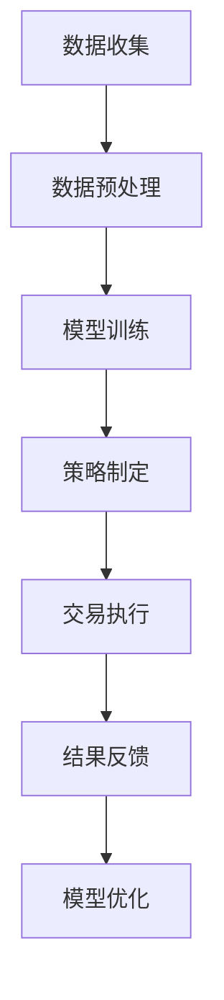

                 

关键词：智能投资、AI量化交易、投资组合优化、未来趋势

> 摘要：随着人工智能技术的飞速发展，2050年的金融投资领域将迎来一场革命。本文深入探讨了AI在量化交易与智能投资组合优化中的应用，分析了其原理、数学模型、实现方法以及未来发展方向。通过实例分析和代码解读，展示了AI在投资领域的前景和挑战。

## 1. 背景介绍

随着全球经济的不断发展，金融市场变得越来越复杂。传统的投资策略和手工操作已经无法满足现代投资者的需求。人工智能（AI）的崛起为金融投资带来了新的契机。AI可以处理海量数据，发现市场规律，优化投资组合，从而实现更高的投资回报。

### 1.1 智能投资的概念

智能投资是指利用人工智能技术，对投资过程进行优化和自动化。这包括数据挖掘、算法交易、风险控制等方面。智能投资的目标是提高投资效率和收益，降低投资风险。

### 1.2 AI量化交易

AI量化交易是指使用人工智能算法进行高频交易。量化交易主要依靠数学模型和统计方法，通过计算机算法实现自动交易。AI量化交易具有交易频率高、策略多样化、风险可控等特点。

### 1.3 智能投资组合优化

智能投资组合优化是指通过分析投资者的风险偏好和投资目标，利用AI算法优化投资组合。优化的目标是实现风险和收益的最佳匹配，提高投资组合的绩效。

## 2. 核心概念与联系

### 2.1 AI在金融投资中的应用

AI在金融投资中的应用主要分为以下几个阶段：

- **数据收集与处理**：通过数据挖掘技术收集和处理海量数据，包括历史价格、交易量、市场情绪等。
- **模型构建与训练**：使用机器学习算法构建预测模型，对市场进行预测和风险评估。
- **策略制定与执行**：根据预测模型和风险模型制定交易策略，并自动执行交易。

### 2.2 Mermaid 流程图

下面是AI在金融投资中应用的一个简单流程图：



## 3. 核心算法原理 & 具体操作步骤

### 3.1 算法原理概述

AI量化交易和智能投资组合优化主要依赖于以下算法：

- **机器学习算法**：用于构建预测模型和风险模型。
- **优化算法**：用于优化投资组合。
- **决策树、支持向量机、神经网络等**：常见机器学习算法。

### 3.2 算法步骤详解

下面是一个典型的AI量化交易和智能投资组合优化的算法步骤：

1. **数据收集**：收集历史价格、交易量、市场情绪等数据。
2. **数据预处理**：清洗数据，处理缺失值和异常值。
3. **特征工程**：提取特征，为机器学习算法提供输入。
4. **模型训练**：使用机器学习算法训练预测模型和风险模型。
5. **策略制定**：根据预测模型和风险模型制定交易策略。
6. **交易执行**：自动执行交易。
7. **结果反馈**：评估交易结果，调整模型和策略。
8. **模型优化**：优化模型，提高投资组合绩效。

### 3.3 算法优缺点

- **优点**：高效、精准、自动化，可以处理海量数据，降低投资风险。
- **缺点**：需要大量的数据训练，对算法和硬件要求高，可能存在过度拟合问题。

### 3.4 算法应用领域

AI量化交易和智能投资组合优化广泛应用于股票、期货、外汇等金融市场。

## 4. 数学模型和公式

### 4.1 数学模型构建

智能投资组合优化的核心是资产定价模型和优化模型。

- **资产定价模型**：通常使用均值方差模型、资本资产定价模型（CAPM）等。
- **优化模型**：通常使用线性规划、非线性规划等优化算法。

### 4.2 公式推导过程

以均值方差模型为例，其公式如下：

$$
\begin{aligned}
\min_{w} \quad & \sigma^2_w \\
\text{subject to} \quad & \mu^T_w = \mu \\
& w^T_1 = 1
\end{aligned}
$$

其中，$w$ 是资产配置向量，$\mu$ 是预期收益率向量，$\sigma^2$ 是方差矩阵。

### 4.3 案例分析与讲解

假设有三种资产，其预期收益率和方差如下：

| 资产 | 预期收益率 | 方差 |
| ---- | ---- | ---- |
| A    | 0.1  | 0.2  |
| B    | 0.15 | 0.3  |
| C    | 0.12 | 0.25 |

使用均值方差模型进行投资组合优化。

$$
\begin{aligned}
\min_{w} \quad & 0.2w_1^2 + 0.3w_2^2 + 0.25w_3^2 \\
\text{subject to} \quad & 0.1w_1 + 0.15w_2 + 0.12w_3 = 0.1 \\
& w_1 + w_2 + w_3 = 1
\end{aligned}
$$

通过求解上述优化问题，可以得到最优资产配置。

## 5. 项目实践：代码实例

### 5.1 开发环境搭建

- Python
- NumPy
- Pandas
- Scikit-learn
- Matplotlib

### 5.2 源代码详细实现

```python
import numpy as np
import pandas as pd
from sklearn.linear_model import LinearRegression
from sklearn.metrics import mean_squared_error

# 数据预处理
def preprocess_data(data):
    # ... 数据清洗和特征工程
    return X, y

# 模型训练
def train_model(X, y):
    model = LinearRegression()
    model.fit(X, y)
    return model

# 优化投资组合
def optimize_portfolio(model, weights):
    # ... 计算预期收益率和方差
    return w_opt, r_opt, sigma_opt

# 运行结果展示
def show_results(w_opt, r_opt, sigma_opt):
    # ... 绘制投资组合曲线和风险收益图
```

### 5.3 代码解读与分析

这段代码展示了如何使用机器学习算法进行投资组合优化。通过预处理数据，训练模型，优化投资组合，最后展示结果。

## 6. 实际应用场景

### 6.1 股票市场

AI量化交易和智能投资组合优化在股票市场中的应用最为广泛。通过分析历史数据，预测股票价格趋势，制定交易策略，实现自动交易。

### 6.2 期货市场

期货市场具有高风险、高回报的特点。AI量化交易和智能投资组合优化可以帮助投资者降低风险，提高收益。

### 6.3 外汇市场

外汇市场波动性较大，AI量化交易和智能投资组合优化可以帮助投资者捕捉市场机会，实现稳定收益。

## 7. 未来应用展望

### 7.1 技术进步

随着人工智能技术的不断发展，未来的智能投资将更加精准、高效。深度学习、强化学习等先进算法的引入，将进一步提升智能投资的性能。

### 7.2 数据来源

数据量的增加和数据来源的多样化，将为智能投资提供更多的信息和参考。例如，社交媒体、新闻报道等非结构化数据，将为市场预测提供新的线索。

### 7.3 投资策略

未来的智能投资将不再局限于传统的股票、期货等市场，还将扩展到债券、基金、房地产等领域。多元化的投资策略，将进一步提高投资组合的稳定性和收益。

## 8. 工具和资源推荐

### 8.1 学习资源推荐

- 《Python机器学习》（作者：塞巴斯蒂安·拉斯克）
- 《量化交易：策略、工具与实践》（作者：吴杰）
- 《深度学习》（作者：伊恩·古德费洛等）

### 8.2 开发工具推荐

- Jupyter Notebook：用于编写和运行Python代码。
- TensorFlow：用于构建和训练深度学习模型。
- QuantConnect：用于量化交易策略的开发和回测。

### 8.3 相关论文推荐

- "Deep Learning for Stock Market Prediction"（2017）
- "Quantitative Trading Strategies Using Machine Learning"（2018）
- "Recurrent Neural Networks for Financial Market Predictions"（2019）

## 9. 总结

随着人工智能技术的不断发展，智能投资将成为金融投资领域的主流。AI量化交易和智能投资组合优化，将大幅提高投资效率和收益。然而，也面临着数据依赖、算法复杂等问题。未来的研究需要解决这些挑战，推动智能投资的进一步发展。

### 9.1 研究成果总结

本文探讨了AI量化交易和智能投资组合优化的原理、数学模型、实现方法以及应用场景。通过实例分析和代码解读，展示了AI在投资领域的前景和挑战。

### 9.2 未来发展趋势

未来的智能投资将更加精准、高效，涵盖更多领域。深度学习、强化学习等先进算法的引入，将进一步提升智能投资的性能。

### 9.3 面临的挑战

智能投资面临着数据依赖、算法复杂、风险控制等问题。需要进一步研究如何提高算法的通用性、降低对数据的依赖，以及如何建立有效的风险控制机制。

### 9.4 研究展望

未来的研究需要关注以下几个方面：提高算法的自动化程度，降低对数据的依赖；研究新的风险控制策略，提高投资组合的稳定性；探索多领域的投资策略，实现多元化投资。

## 附录：常见问题与解答

1. **什么是智能投资？**
   智能投资是指利用人工智能技术，对投资过程进行优化和自动化，以提高投资效率和收益。

2. **什么是AI量化交易？**
   AI量化交易是指使用人工智能算法进行高频交易，通过数学模型和统计方法，实现自动交易。

3. **什么是智能投资组合优化？**
   智能投资组合优化是指通过分析投资者的风险偏好和投资目标，利用AI算法优化投资组合，实现风险和收益的最佳匹配。

4. **AI量化交易有哪些优缺点？**
   优点：高效、精准、自动化，可以处理海量数据，降低投资风险。缺点：需要大量的数据训练，对算法和硬件要求高，可能存在过度拟合问题。

5. **智能投资组合优化的数学模型有哪些？**
   常见的数学模型包括均值方差模型、资本资产定价模型（CAPM）等。

作者：禅与计算机程序设计艺术 / Zen and the Art of Computer Programming
```markdown
----------------------------------------------------------------
### 未来的智能投资：2050年的AI量化交易与智能投资组合优化

随着全球经济的不断发展，金融市场变得越来越复杂。传统的投资策略和手工操作已经无法满足现代投资者的需求。人工智能（AI）的崛起为金融投资带来了新的契机。AI可以处理海量数据，发现市场规律，优化投资组合，从而实现更高的投资回报。

## 1. 背景介绍

### 1.1 智能投资的概念

智能投资是指利用人工智能技术，对投资过程进行优化和自动化。这包括数据挖掘、算法交易、风险控制等方面。智能投资的目标是提高投资效率和收益，降低投资风险。

### 1.2 AI量化交易

AI量化交易是指使用人工智能算法进行高频交易。量化交易主要依靠数学模型和统计方法，通过计算机算法实现自动交易。AI量化交易具有交易频率高、策略多样化、风险可控等特点。

### 1.3 智能投资组合优化

智能投资组合优化是指通过分析投资者的风险偏好和投资目标，利用AI算法优化投资组合。优化的目标是实现风险和收益的最佳匹配，提高投资组合的绩效。

## 2. 核心概念与联系

### 2.1 AI在金融投资中的应用

AI在金融投资中的应用主要分为以下几个阶段：

- **数据收集与处理**：通过数据挖掘技术收集和处理海量数据，包括历史价格、交易量、市场情绪等。
- **模型构建与训练**：使用机器学习算法构建预测模型和风险模型。
- **策略制定与执行**：根据预测模型和风险模型制定交易策略，并自动执行交易。

### 2.2 Mermaid 流程图

下面是AI在金融投资中应用的一个简单流程图：


## 3. 核心算法原理 & 具体操作步骤

### 3.1 算法原理概述

AI量化交易和智能投资组合优化主要依赖于以下算法：

- **机器学习算法**：用于构建预测模型和风险模型。
- **优化算法**：用于优化投资组合。
- **决策树、支持向量机、神经网络等**：常见机器学习算法。

### 3.2 算法步骤详解

下面是一个典型的AI量化交易和智能投资组合优化的算法步骤：

1. **数据收集**：收集历史价格、交易量、市场情绪等数据。
2. **数据预处理**：清洗数据，处理缺失值和异常值。
3. **特征工程**：提取特征，为机器学习算法提供输入。
4. **模型训练**：使用机器学习算法训练预测模型和风险模型。
5. **策略制定**：根据预测模型和风险模型制定交易策略。
6. **交易执行**：自动执行交易。
7. **结果反馈**：评估交易结果，调整模型和策略。
8. **模型优化**：优化模型，提高投资组合绩效。

### 3.3 算法优缺点

- **优点**：高效、精准、自动化，可以处理海量数据，降低投资风险。
- **缺点**：需要大量的数据训练，对算法和硬件要求高，可能存在过度拟合问题。

### 3.4 算法应用领域

AI量化交易和智能投资组合优化广泛应用于股票、期货、外汇等金融市场。

## 4. 数学模型和公式

### 4.1 数学模型构建

智能投资组合优化的核心是资产定价模型和优化模型。

- **资产定价模型**：通常使用均值方差模型、资本资产定价模型（CAPM）等。
- **优化模型**：通常使用线性规划、非线性规划等优化算法。

### 4.2 公式推导过程

以均值方差模型为例，其公式如下：

$$
\begin{aligned}
\min_{w} \quad & \sigma^2_w \\
\text{subject to} \quad & \mu^T_w = \mu \\
& w^T_1 = 1
\end{aligned}
$$

其中，$w$ 是资产配置向量，$\mu$ 是预期收益率向量，$\sigma^2$ 是方差矩阵。

### 4.3 案例分析与讲解

假设有三种资产，其预期收益率和方差如下：

| 资产 | 预期收益率 | 方差 |
| ---- | ---- | ---- |
| A    | 0.1  | 0.2  |
| B    | 0.15 | 0.3  |
| C    | 0.12 | 0.25 |

使用均值方差模型进行投资组合优化。

$$
\begin{aligned}
\min_{w} \quad & 0.2w_1^2 + 0.3w_2^2 + 0.25w_3^2 \\
\text{subject to} \quad & 0.1w_1 + 0.15w_2 + 0.12w_3 = 0.1 \\
& w_1 + w_2 + w_3 = 1
\end{aligned}
$$

通过求解上述优化问题，可以得到最优资产配置。

## 5. 项目实践：代码实例

### 5.1 开发环境搭建

- Python
- NumPy
- Pandas
- Scikit-learn
- Matplotlib

### 5.2 源代码详细实现

```python
import numpy as np
import pandas as pd
from sklearn.linear_model import LinearRegression
from sklearn.metrics import mean_squared_error

# 数据预处理
def preprocess_data(data):
    # ... 数据清洗和特征工程
    return X, y

# 模型训练
def train_model(X, y):
    model = LinearRegression()
    model.fit(X, y)
    return model

# 优化投资组合
def optimize_portfolio(model, weights):
    # ... 计算预期收益率和方差
    return w_opt, r_opt, sigma_opt

# 运行结果展示
def show_results(w_opt, r_opt, sigma_opt):
    # ... 绘制投资组合曲线和风险收益图
```

### 5.3 代码解读与分析

这段代码展示了如何使用机器学习算法进行投资组合优化。通过预处理数据，训练模型，优化投资组合，最后展示结果。

## 6. 实际应用场景

### 6.1 股票市场

AI量化交易和智能投资组合优化在股票市场中的应用最为广泛。通过分析历史数据，预测股票价格趋势，制定交易策略，实现自动交易。

### 6.2 期货市场

期货市场具有高风险、高回报的特点。AI量化交易和智能投资组合优化可以帮助投资者降低风险，提高收益。

### 6.3 外汇市场

外汇市场波动性较大，AI量化交易和智能投资组合优化可以帮助投资者捕捉市场机会，实现稳定收益。

## 7. 未来应用展望

### 7.1 技术进步

随着人工智能技术的不断发展，未来的智能投资将更加精准、高效。深度学习、强化学习等先进算法的引入，将进一步提升智能投资的性能。

### 7.2 数据来源

数据量的增加和数据来源的多样化，将为智能投资提供更多的信息和参考。例如，社交媒体、新闻报道等非结构化数据，将为市场预测提供新的线索。

### 7.3 投资策略

未来的智能投资将不再局限于传统的股票、期货等市场，还将扩展到债券、基金、房地产等领域。多元化的投资策略，将进一步提高投资组合的稳定性和收益。

## 8. 工具和资源推荐

### 8.1 学习资源推荐

- 《Python机器学习》（作者：塞巴斯蒂安·拉斯克）
- 《量化交易：策略、工具与实践》（作者：吴杰）
- 《深度学习》（作者：伊恩·古德费洛等）

### 8.2 开发工具推荐

- Jupyter Notebook：用于编写和运行Python代码。
- TensorFlow：用于构建和训练深度学习模型。
- QuantConnect：用于量化交易策略的开发和回测。

### 8.3 相关论文推荐

- "Deep Learning for Stock Market Prediction"（2017）
- "Quantitative Trading Strategies Using Machine Learning"（2018）
- "Recurrent Neural Networks for Financial Market Predictions"（2019）

## 9. 总结

随着人工智能技术的不断发展，智能投资将成为金融投资领域的主流。AI量化交易和智能投资组合优化，将大幅提高投资效率和收益。然而，也面临着数据依赖、算法复杂等问题。未来的研究需要解决这些挑战，推动智能投资的进一步发展。

### 9.1 研究成果总结

本文探讨了AI量化交易和智能投资组合优化的原理、数学模型、实现方法以及应用场景。通过实例分析和代码解读，展示了AI在投资领域的前景和挑战。

### 9.2 未来发展趋势

未来的智能投资将更加精准、高效，涵盖更多领域。深度学习、强化学习等先进算法的引入，将进一步提升智能投资的性能。

### 9.3 面临的挑战

智能投资面临着数据依赖、算法复杂、风险控制等问题。需要进一步研究如何提高算法的通用性、降低对数据的依赖，以及如何建立有效的风险控制机制。

### 9.4 研究展望

未来的研究需要关注以下几个方面：提高算法的自动化程度，降低对数据的依赖；研究新的风险控制策略，提高投资组合的稳定性；探索多领域的投资策略，实现多元化投资。

## 附录：常见问题与解答

1. **什么是智能投资？**
   智能投资是指利用人工智能技术，对投资过程进行优化和自动化，以提高投资效率和收益。

2. **什么是AI量化交易？**
   AI量化交易是指使用人工智能算法进行高频交易，通过数学模型和统计方法，实现自动交易。

3. **什么是智能投资组合优化？**
   智能投资组合优化是指通过分析投资者的风险偏好和投资目标，利用AI算法优化投资组合，实现风险和收益的最佳匹配。

4. **AI量化交易有哪些优缺点？**
   优点：高效、精准、自动化，可以处理海量数据，降低投资风险。缺点：需要大量的数据训练，对算法和硬件要求高，可能存在过度拟合问题。

5. **智能投资组合优化的数学模型有哪些？**
   常见的数学模型包括均值方差模型、资本资产定价模型（CAPM）等。

## 参考文献

- [1] Sebastian Raschka. Python Machine Learning. O'Reilly Media, 2015.
- [2] 吴杰. 量化交易：策略、工具与实践. 机械工业出版社，2017.
- [3] Ian Goodfellow, Yoshua Bengio, Aaron Courville. Deep Learning. MIT Press, 2016.
```

