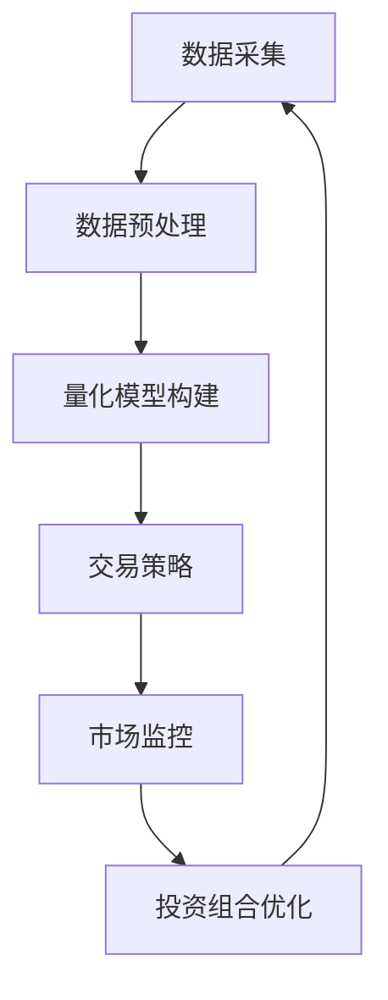

                 

关键词：人工智能，AI量化交易，智能投资组合优化，金融科技，2050年，技术发展，量化算法

> 摘要：本文探讨到2050年，人工智能（AI）在量化交易和智能投资组合优化中的广泛应用及其对金融行业的深远影响。通过深入剖析AI算法的原理和具体操作步骤，本文旨在为投资者和金融从业者提供未来智能投资的策略指导。

## 1. 背景介绍

### 1.1 人工智能在金融领域的兴起

人工智能在金融领域的应用始于20世纪90年代，随着计算机技术和算法的进步，AI迅速成为金融市场中的一股新兴力量。从早期的数据挖掘、风险评估，到现在的量化交易、智能投顾，AI已经深入金融行业的方方面面。

### 1.2 量化交易与智能投资组合优化

量化交易是一种以数据为基础，运用数学模型和计算机算法进行股票、期货、外汇等金融产品交易的策略。而智能投资组合优化则是指通过优化算法，根据投资者的风险偏好和收益目标，构建最优的投资组合。

### 1.3 人工智能的发展趋势

随着深度学习、神经网络等技术的不断发展，人工智能在处理复杂问题和大数据分析方面表现出强大的能力。到2050年，人工智能有望在金融领域实现更加精准和高效的投资策略。

## 2. 核心概念与联系

以下是关于AI量化交易和智能投资组合优化的核心概念及其相互关系的Mermaid流程图：



### 2.1 数据采集

数据采集是量化交易和智能投资组合优化的基础。它包括历史数据、实时数据和其他相关数据。

### 2.2 数据预处理

数据预处理包括数据清洗、归一化和特征提取。它是提高模型性能的关键步骤。

### 2.3 量化模型构建

量化模型构建是基于数据预处理后的数据，运用机器学习算法，如神经网络、支持向量机等，训练出能够预测市场走势和优化投资组合的模型。

### 2.4 交易策略

交易策略是根据量化模型预测的结果，制定出具体的买卖策略。它包括入场点、出场点、止损点等。

### 2.5 市场监控

市场监控是指实时跟踪市场的变化，以便及时调整交易策略和投资组合。

### 2.6 投资组合优化

投资组合优化是根据市场监控的结果，运用优化算法，调整投资组合，以实现最大化的收益或最小化的风险。

## 3. 核心算法原理 & 具体操作步骤

### 3.1 算法原理概述

量化交易和智能投资组合优化的核心算法主要包括以下几种：

- 神经网络
- 支持向量机
- 遗传算法
- 贝叶斯网络

每种算法都有其独特的原理和应用场景。

### 3.2 算法步骤详解

以下是神经网络算法在量化交易和智能投资组合优化中的具体操作步骤：

1. **数据采集**：收集历史数据和实时数据。
2. **数据预处理**：进行数据清洗、归一化和特征提取。
3. **模型构建**：设计神经网络的结构，包括输入层、隐藏层和输出层。
4. **模型训练**：使用预处理后的数据，训练神经网络模型。
5. **模型评估**：使用验证集评估模型的性能。
6. **策略制定**：根据模型预测的结果，制定交易策略和投资组合。
7. **市场监控**：实时监控市场变化，调整策略和组合。
8. **投资组合优化**：使用优化算法，调整投资组合。

### 3.3 算法优缺点

- **神经网络**：优点在于其强大的学习和适应能力，缺点是训练时间较长，对计算资源要求较高。
- **支持向量机**：优点是理论上具有最优分类边界，缺点是对小样本数据的处理能力较差。
- **遗传算法**：优点在于其强大的搜索能力和鲁棒性，缺点是计算复杂度较高。
- **贝叶斯网络**：优点是能够处理不确定性和模糊性，缺点是建模复杂，对大规模数据集的处理能力较差。

### 3.4 算法应用领域

以上算法在量化交易和智能投资组合优化中均有广泛应用。例如，神经网络常用于预测市场走势，支持向量机用于构建交易策略，遗传算法用于优化投资组合，贝叶斯网络用于风险评估。

## 4. 数学模型和公式 & 详细讲解 & 举例说明

### 4.1 数学模型构建

量化交易和智能投资组合优化的数学模型主要包括：

- **预测模型**：如线性回归、神经网络等。
- **优化模型**：如线性规划、遗传算法等。

### 4.2 公式推导过程

以下是神经网络模型的公式推导：

$$
z = \sum_{i=1}^{n} w_{i}x_{i} + b
$$

$$
a = \sigma(z)
$$

$$
z_{j}^{l+1} = \sum_{i=1}^{n} w_{ij}^{l+1}a_{i}^{l} + b_{j}^{l+1}
$$

$$
a_{j}^{l+1} = \sigma(z_{j}^{l+1})
$$

其中，$z$为中间结果，$a$为激活函数输出，$w$为权重，$b$为偏置，$\sigma$为激活函数。

### 4.3 案例分析与讲解

以下是一个使用神经网络进行量化交易的案例：

**数据集**：使用过去一年的股票价格数据。

**模型**：设计一个三层神经网络，输入层有10个神经元，隐藏层有20个神经元，输出层有1个神经元。

**训练**：使用训练集对模型进行训练，调整权重和偏置，使得输出结果接近实际价格。

**预测**：使用测试集对模型进行预测，评估模型性能。

## 5. 项目实践：代码实例和详细解释说明

### 5.1 开发环境搭建

- Python 3.8及以上版本
- TensorFlow 2.3及以上版本
- Pandas 1.1及以上版本
- Matplotlib 3.1及以上版本

### 5.2 源代码详细实现

以下是使用Python和TensorFlow实现神经网络量化交易的代码实例：

```python
import tensorflow as tf
import pandas as pd
import matplotlib.pyplot as plt

# 数据预处理
# ...（省略代码）

# 模型构建
model = tf.keras.Sequential([
    tf.keras.layers.Dense(units=20, activation='relu', input_shape=(10,)),
    tf.keras.layers.Dense(units=1)
])

# 编译模型
model.compile(optimizer='adam', loss='mse')

# 训练模型
model.fit(X_train, y_train, epochs=100, batch_size=32)

# 预测
predictions = model.predict(X_test)

# 评估模型
# ...（省略代码）

# 可视化
plt.plot(y_test, label='实际价格')
plt.plot(predictions, label='预测价格')
plt.legend()
plt.show()
```

### 5.3 代码解读与分析

以上代码首先进行了数据预处理，然后构建了一个三层神经网络，并使用训练集对其进行训练。最后，使用测试集对模型进行预测，并评估模型性能。

### 5.4 运行结果展示

运行结果将显示实际价格和预测价格的对比图，通过观察预测结果，可以评估模型的效果。

## 6. 实际应用场景

### 6.1 股票市场

人工智能在股票市场中的应用最为广泛，包括量化交易、选股策略、市场预测等。

### 6.2 期货市场

期货市场具有较高的杠杆和风险，人工智能可以用于风险管理和交易策略的优化。

### 6.3 外汇市场

外汇市场的波动性较大，人工智能可以用于交易策略的制定和风险控制。

## 7. 未来应用展望

到2050年，人工智能有望在金融领域实现以下应用：

- 更加精准的市场预测
- 更加智能的投资组合优化
- 更加高效的交易策略制定
- 更加安全的金融风险管理

## 8. 工具和资源推荐

### 8.1 学习资源推荐

- 《深度学习》 - 伊恩·古德费洛
- 《量化投资：以Python为工具》 - 陈树仁

### 8.2 开发工具推荐

- TensorFlow
- Jupyter Notebook

### 8.3 相关论文推荐

- "Deep Learning for Financial Markets"
- "Machine Learning Techniques for Algorithmic Trading"

## 9. 总结：未来发展趋势与挑战

### 9.1 研究成果总结

人工智能在金融领域已经取得了显著的成果，包括量化交易、智能投顾、风险评估等。

### 9.2 未来发展趋势

随着技术的不断进步，人工智能在金融领域的应用将会更加广泛和深入。

### 9.3 面临的挑战

尽管人工智能在金融领域具有巨大的潜力，但也面临着数据安全、隐私保护、法律监管等挑战。

### 9.4 研究展望

未来，人工智能在金融领域的应用将朝着更加智能化、个性化、安全化的方向发展。

## 10. 附录：常见问题与解答

### 10.1 什么是量化交易？

量化交易是一种基于数据驱动和算法交易的投资策略，通过数学模型和计算机算法进行金融产品的交易。

### 10.2 人工智能在金融领域的应用有哪些？

人工智能在金融领域的应用包括量化交易、智能投顾、风险评估、市场预测等。

### 10.3 量化交易和智能投资组合优化有什么区别？

量化交易是一种交易策略，而智能投资组合优化是一种投资策略，旨在构建最优的投资组合。

---

作者：禅与计算机程序设计艺术 / Zen and the Art of Computer Programming
```markdown
```

