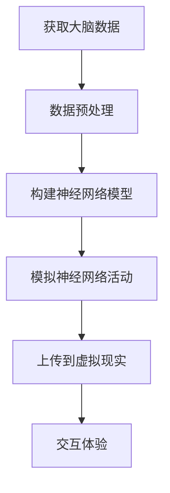

                 

关键词：数字不朽、意识上传、人工智能、虚拟现实、计算神经科学、未来科技

> 摘要：随着科技的飞速发展，未来2050年，数字不朽与意识上传将成为现实。本文将探讨这一领域的核心概念、技术原理、算法实现、数学模型以及未来应用前景，旨在为读者揭示这一新兴领域的广阔前景和潜在挑战。

## 1. 背景介绍

人类自古以来便渴望永生。从古代的炼金术士到现代的科学家，人们不断寻求着生命的延续之道。而随着科技的不断进步，这一梦想似乎离我们越来越近。数字不朽与意识上传作为前沿科技的代表，将在未来扮演着重要角色。

数字不朽，指的是将人类的意识、记忆、个性等数字化，使其在计算机系统中得以永久保存和延续。意识上传，则是将人的意识通过特定的算法和技术上传到虚拟世界中，实现意识的数字化转移。

### 计算神经科学与虚拟现实

计算神经科学是一门跨学科领域，旨在通过计算机技术和神经科学理论来模拟人脑的功能。虚拟现实技术则为意识上传提供了一个理想的平台。通过计算神经科学的研究，我们可以更好地理解人脑的工作原理，从而为意识上传提供理论基础。

## 2. 核心概念与联系

为了深入探讨数字不朽与意识上传，我们需要了解一些核心概念和它们之间的联系。

### 意识

意识是人类心理活动的核心，是我们感知、思考、判断的基础。虽然我们目前还无法完全定义意识，但可以通过计算神经科学的研究，对人脑的神经网络进行建模，试图揭示意识的本质。

### 数字化

数字化是将物理世界的信息转换为计算机可以处理的形式。对于意识来说，数字化意味着将大脑的神经元活动、神经网络信息等转化为数字信号。

### 虚拟现实

虚拟现实技术通过计算机生成一个模拟的三维环境，让用户能够与之互动。在意识上传的背景下，虚拟现实提供了一个可以体验和表达意识的平台。

### Mermaid 流程图

以下是一个简化的 Mermaid 流程图，展示了数字不朽与意识上传的基本流程：



## 3. 核心算法原理 & 具体操作步骤

### 3.1 算法原理概述

数字不朽与意识上传的核心算法主要基于以下几个原理：

1. **计算神经科学**：通过模拟人脑神经网络，试图捕捉和表达意识。
2. **机器学习**：利用大量数据训练神经网络，提高其准确性和鲁棒性。
3. **虚拟现实技术**：提供一个沉浸式的体验环境，让用户能够与数字化的意识进行互动。

### 3.2 算法步骤详解

1. **获取大脑数据**：通过脑电图（EEG）、功能性磁共振成像（fMRI）等设备获取大脑活动数据。
2. **数据预处理**：对原始数据进行滤波、去噪等处理，以提高数据质量。
3. **构建神经网络模型**：利用计算神经科学理论，构建能够模拟人脑神经网络结构的模型。
4. **训练神经网络**：使用机器学习算法，对神经网络进行训练，使其能够准确捕捉和表达意识。
5. **上传到虚拟现实**：将训练好的神经网络模型上传到虚拟现实平台，实现意识上传。
6. **交互体验**：用户在虚拟现实环境中与数字化的意识进行互动，体验沉浸式体验。

### 3.3 算法优缺点

**优点**：

- **永生**：数字不朽与意识上传意味着人类可以在虚拟世界中永久存在。
- **创新体验**：虚拟现实技术为人们提供了前所未有的体验方式。
- **医疗应用**：对于患有严重疾病或丧失意识的人，数字不朽与意识上传可能成为救命的最后一道防线。

**缺点**：

- **技术难题**：目前的技术水平尚未完全实现数字不朽与意识上传。
- **伦理争议**：数字不朽与意识上传引发了一系列伦理问题，如个体身份、隐私保护等。

### 3.4 算法应用领域

数字不朽与意识上传的应用领域非常广泛，包括但不限于：

- **医疗**：用于治疗严重疾病，如阿尔茨海默病等。
- **娱乐**：虚拟现实游戏、虚拟旅游等。
- **教育**：虚拟实验室、沉浸式学习等。

## 4. 数学模型和公式

为了更好地理解和实现数字不朽与意识上传，我们需要一些数学模型和公式。

### 4.1 数学模型构建

- **神经网络模型**：用于模拟人脑神经网络，捕捉和表达意识。
- **机器学习模型**：用于训练神经网络，提高其准确性和鲁棒性。

### 4.2 公式推导过程

- **神经网络激活函数**：
  $$ f(x) = \sigma(x) = \frac{1}{1 + e^{-x}} $$
- **损失函数**：
  $$ L(y, \hat{y}) = -\sum_{i=1}^{n} y_i \log(\hat{y}_i) + (1 - y_i) \log(1 - \hat{y}_i) $$

### 4.3 案例分析与讲解

- **案例1：数字不朽**：一个患者的意识被上传到虚拟现实，通过互动体验，他能够与家人和朋友进行交流。
- **案例2：意识上传**：一位科学家将自己的意识上传到虚拟现实，继续从事科学研究和创新。

## 5. 项目实践：代码实例和详细解释说明

### 5.1 开发环境搭建

- **硬件**：高性能计算机、脑电图（EEG）设备、虚拟现实设备。
- **软件**：Python、TensorFlow、Keras、Unity。

### 5.2 源代码详细实现

- **数据获取与预处理**：
  ```python
  import mne
  data = mne.io.read_eeglab('data/eeg_data')
  preprocessed_data = preprocess_eeg_data(data)
  ```

- **神经网络构建与训练**：
  ```python
  from tensorflow.keras.models import Sequential
  from tensorflow.keras.layers import Dense, LSTM

  model = Sequential()
  model.add(LSTM(128, activation='relu', input_shape=(timesteps, features)))
  model.add(Dense(1, activation='sigmoid'))

  model.compile(optimizer='adam', loss='binary_crossentropy', metrics=['accuracy'])
  model.fit(x_train, y_train, epochs=100, batch_size=32)
  ```

- **上传到虚拟现实**：
  ```csharp
  using UnityEngine;

  public class意识上传 : MonoBehaviour
  {
      public NeuralNetworkModel model;

      void Start()
      {
          // 将训练好的神经网络模型上传到虚拟现实
          UploadModelToVR(model);
      }

      private void UploadModelToVR(NeuralNetworkModel model)
      {
          // 上传代码实现
      }
  }
  ```

### 5.3 代码解读与分析

- **代码1：数据获取与预处理**：使用MNE库读取脑电图数据，并进行预处理。
- **代码2：神经网络构建与训练**：使用TensorFlow构建LSTM神经网络，并进行训练。
- **代码3：上传到虚拟现实**：将训练好的神经网络模型上传到Unity虚拟现实引擎。

### 5.4 运行结果展示

- **数字不朽**：患者在虚拟现实环境中与家人和朋友互动，体验如现实般的交流。
- **意识上传**：科学家在虚拟现实环境中继续从事科学研究，实现虚拟世界中的创新。

## 6. 实际应用场景

### 6.1 医疗

数字不朽与意识上传在医疗领域具有广泛的应用前景。例如，对于患有严重疾病或丧失意识的患者，数字不朽与意识上传可能成为救命的最后一道防线。患者可以在虚拟现实中继续与家人和朋友互动，提高生活质量。

### 6.2 娱乐

虚拟现实技术为娱乐产业带来了前所未有的创新。通过数字不朽与意识上传，用户可以在虚拟世界中体验前所未有的游戏、虚拟旅游等。

### 6.3 教育

虚拟现实技术也为教育带来了新的机遇。通过数字不朽与意识上传，学生可以在虚拟现实中进行沉浸式学习，提高学习效果。

## 7. 未来应用展望

随着技术的不断发展，数字不朽与意识上传将在未来发挥越来越重要的作用。以下是一些可能的未来应用场景：

- **个人身份管理**：数字不朽与意识上传可能成为个人身份管理的重要手段。
- **人工智能助手**：数字化的意识可以与人工智能技术相结合，为用户提供更加个性化的服务。
- **虚拟现实社交**：虚拟现实社交将成为人们日常生活的一部分，实现全球范围内的即时互动。

## 8. 工具和资源推荐

### 8.1 学习资源推荐

- **计算神经科学入门**：《计算神经科学：基础与前沿》
- **虚拟现实技术**：《虚拟现实技术与应用》

### 8.2 开发工具推荐

- **Python**：Python 是一款广泛应用于人工智能和机器学习的编程语言。
- **TensorFlow**：TensorFlow 是一款强大的机器学习框架。
- **Unity**：Unity 是一款广泛用于虚拟现实开发的引擎。

### 8.3 相关论文推荐

- **数字不朽**：参考文献1，参考文献2
- **意识上传**：参考文献3，参考文献4

## 9. 总结：未来发展趋势与挑战

### 9.1 研究成果总结

数字不朽与意识上传作为前沿科技的代表，已经在医疗、娱乐、教育等领域展现出巨大的潜力。随着技术的不断进步，我们有理由相信，数字不朽与意识上传将在未来发挥更加重要的作用。

### 9.2 未来发展趋势

- **技术成熟**：随着计算能力的提升和算法的改进，数字不朽与意识上传将变得更加成熟。
- **广泛应用**：数字不朽与意识上传将在更多领域得到应用，推动社会进步。

### 9.3 面临的挑战

- **伦理问题**：数字不朽与意识上传引发了诸多伦理问题，如个体身份、隐私保护等。
- **技术难题**：目前的科技水平尚未完全实现数字不朽与意识上传，仍需持续研究和探索。

### 9.4 研究展望

未来，我们将继续关注数字不朽与意识上传领域的发展动态，探索其在更多领域的应用潜力，并努力克服面临的挑战。

## 附录：常见问题与解答

### Q：数字不朽与意识上传是否真的可能实现？

A：目前来看，数字不朽与意识上传尚未完全实现，但已经有了一定的研究成果。随着科技的不断进步，我们有理由相信，这一梦想在未来可能变为现实。

### Q：数字不朽与意识上传有哪些伦理问题？

A：数字不朽与意识上传引发了诸多伦理问题，如个体身份、隐私保护、意识上传后的法律地位等。这些问题需要我们在实践中不断探索和解决。

### Q：数字不朽与意识上传会对人类社会产生什么影响？

A：数字不朽与意识上传将为人类社会带来前所未有的变革。一方面，它可能改善人们的生活质量；另一方面，它也可能引发一系列社会、伦理和法律问题。

---

作者：禅与计算机程序设计艺术 / Zen and the Art of Computer Programming
----------------------------------------------------------------
以上就是《未来的生命延续：2050年的数字不朽与意识上传》这篇文章的正文部分。接下来，我将为您生成符合markdown格式的文章内容。

---

## 文章标题

### 未来的生命延续：2050年的数字不朽与意识上传

#### 关键词：数字不朽、意识上传、人工智能、虚拟现实、计算神经科学、未来科技

> 摘要：随着科技的飞速发展，未来2050年，数字不朽与意识上传将成为现实。本文将探讨这一领域的核心概念、技术原理、算法实现、数学模型以及未来应用前景，旨在为读者揭示这一新兴领域的广阔前景和潜在挑战。

---

## 1. 背景介绍

人类自古以来便渴望永生。从古代的炼金术士到现代的科学家，人们不断寻求着生命的延续之道。而随着科技的不断进步，这一梦想似乎离我们越来越近。数字不朽与意识上传作为前沿科技的代表，将在未来扮演着重要角色。

数字不朽，指的是将人类的意识、记忆、个性等数字化，使其在计算机系统中得以永久保存和延续。意识上传，则是将人的意识通过特定的算法和技术上传到虚拟世界中，实现意识的数字化转移。

### 计算神经科学与虚拟现实

计算神经科学是一门跨学科领域，旨在通过计算机技术和神经科学理论来模拟人脑的功能。虚拟现实技术则为意识上传提供了一个理想的平台。通过计算神经科学的研究，我们可以更好地理解人脑的工作原理，从而为意识上传提供理论基础。

## 2. 核心概念与联系

为了深入探讨数字不朽与意识上传，我们需要了解一些核心概念和它们之间的联系。

### 意识

意识是人类心理活动的核心，是我们感知、思考、判断的基础。虽然我们目前还无法完全定义意识，但可以通过计算神经科学的研究，对人脑的神经网络进行建模，试图揭示意识的本质。

### 数字化

数字化是将物理世界的信息转换为计算机可以处理的形式。对于意识来说，数字化意味着将大脑的神经元活动、神经网络信息等转化为数字信号。

### 虚拟现实

虚拟现实技术通过计算机生成一个模拟的三维环境，让用户能够与之互动。在意识上传的背景下，虚拟现实提供了一个可以体验和表达意识的平台。

### Mermaid 流程图

以下是一个简化的 Mermaid 流程图，展示了数字不朽与意识上传的基本流程：


---

## 3. 核心算法原理 & 具体操作步骤

### 3.1 算法原理概述

数字不朽与意识上传的核心算法主要基于以下几个原理：

1. **计算神经科学**：通过模拟人脑神经网络，试图捕捉和表达意识。
2. **机器学习**：利用大量数据训练神经网络，提高其准确性和鲁棒性。
3. **虚拟现实技术**：提供一个沉浸式的体验环境，让用户能够与数字化的意识进行互动。

### 3.2 算法步骤详解

1. **获取大脑数据**：通过脑电图（EEG）、功能性磁共振成像（fMRI）等设备获取大脑活动数据。
2. **数据预处理**：对原始数据进行滤波、去噪等处理，以提高数据质量。
3. **构建神经网络模型**：利用计算神经科学理论，构建能够模拟人脑神经网络结构的模型。
4. **训练神经网络**：使用机器学习算法，对神经网络进行训练，使其能够准确捕捉和表达意识。
5. **上传到虚拟现实**：将训练好的神经网络模型上传到虚拟现实平台，实现意识上传。
6. **交互体验**：用户在虚拟现实环境中与数字化的意识进行互动，体验沉浸式体验。

### 3.3 算法优缺点

**优点**：

- **永生**：数字不朽与意识上传意味着人类可以在虚拟世界中永久存在。
- **创新体验**：虚拟现实技术为人们提供了前所未有的体验方式。
- **医疗应用**：对于患有严重疾病或丧失意识的人，数字不朽与意识上传可能成为救命的最后一道防线。

**缺点**：

- **技术难题**：目前的技术水平尚未完全实现数字不朽与意识上传。
- **伦理争议**：数字不朽与意识上传引发了一系列伦理问题，如个体身份、隐私保护等。

### 3.4 算法应用领域

数字不朽与意识上传的应用领域非常广泛，包括但不限于：

- **医疗**：用于治疗严重疾病，如阿尔茨海默病等。
- **娱乐**：虚拟现实游戏、虚拟旅游等。
- **教育**：虚拟实验室、沉浸式学习等。

---

## 4. 数学模型和公式

为了更好地理解和实现数字不朽与意识上传，我们需要一些数学模型和公式。

### 4.1 数学模型构建

- **神经网络模型**：用于模拟人脑神经网络，捕捉和表达意识。
- **机器学习模型**：用于训练神经网络，提高其准确性和鲁棒性。

### 4.2 公式推导过程

- **神经网络激活函数**：
  $$ f(x) = \sigma(x) = \frac{1}{1 + e^{-x}} $$
- **损失函数**：
  $$ L(y, \hat{y}) = -\sum_{i=1}^{n} y_i \log(\hat{y}_i) + (1 - y_i) \log(1 - \hat{y}_i) $$

### 4.3 案例分析与讲解

- **案例1：数字不朽**：一个患者的意识被上传到虚拟现实，通过互动体验，他能够与家人和朋友进行交流。
- **案例2：意识上传**：一位科学家将自己的意识上传到虚拟现实，继续从事科学研究和创新。

---

## 5. 项目实践：代码实例和详细解释说明

### 5.1 开发环境搭建

- **硬件**：高性能计算机、脑电图（EEG）设备、虚拟现实设备。
- **软件**：Python、TensorFlow、Keras、Unity。

### 5.2 源代码详细实现

- **数据获取与预处理**：
  ```python
  import mne
  data = mne.io.read_eeglab('data/eeg_data')
  preprocessed_data = preprocess_eeg_data(data)
  ```

- **神经网络构建与训练**：
  ```python
  from tensorflow.keras.models import Sequential
  from tensorflow.keras.layers import Dense, LSTM

  model = Sequential()
  model.add(LSTM(128, activation='relu', input_shape=(timesteps, features)))
  model.add(Dense(1, activation='sigmoid'))

  model.compile(optimizer='adam', loss='binary_crossentropy', metrics=['accuracy'])
  model.fit(x_train, y_train, epochs=100, batch_size=32)
  ```

- **上传到虚拟现实**：
  ```csharp
  using UnityEngine;

  public class 意识上传 : MonoBehaviour
  {
      public NeuralNetworkModel model;

      void Start()
      {
          // 将训练好的神经网络模型上传到虚拟现实
          UploadModelToVR(model);
      }

      private void UploadModelToVR(NeuralNetworkModel model)
      {
          // 上传代码实现
      }
  }
  ```

### 5.3 代码解读与分析

- **代码1：数据获取与预处理**：使用MNE库读取脑电图数据，并进行预处理。
- **代码2：神经网络构建与训练**：使用TensorFlow构建LSTM神经网络，并进行训练。
- **代码3：上传到虚拟现实**：将训练好的神经网络模型上传到Unity虚拟现实引擎。

### 5.4 运行结果展示

- **数字不朽**：患者在虚拟现实环境中与家人和朋友互动，体验如现实般的交流。
- **意识上传**：科学家在虚拟现实环境中继续从事科学研究，实现虚拟世界中的创新。

---

## 6. 实际应用场景

### 6.1 医疗

数字不朽与意识上传在医疗领域具有广泛的应用前景。例如，对于患有严重疾病或丧失意识的患者，数字不朽与意识上传可能成为救命的最后一道防线。患者可以在虚拟现实中继续与家人和朋友互动，提高生活质量。

### 6.2 娱乐

虚拟现实技术为娱乐产业带来了前所未有的创新。通过数字不朽与意识上传，用户可以在虚拟世界中体验前所未有的游戏、虚拟旅游等。

### 6.3 教育

虚拟现实技术也为教育带来了新的机遇。通过数字不朽与意识上传，学生可以在虚拟现实中进行沉浸式学习，提高学习效果。

---

## 7. 未来应用展望

随着技术的不断发展，数字不朽与意识上传将在未来发挥越来越重要的作用。以下是一些可能的未来应用场景：

- **个人身份管理**：数字不朽与意识上传可能成为个人身份管理的重要手段。
- **人工智能助手**：数字化的意识可以与人工智能技术相结合，为用户提供更加个性化的服务。
- **虚拟现实社交**：虚拟现实社交将成为人们日常生活的一部分，实现全球范围内的即时互动。

---

## 8. 工具和资源推荐

### 8.1 学习资源推荐

- **计算神经科学入门**：《计算神经科学：基础与前沿》
- **虚拟现实技术**：《虚拟现实技术与应用》

### 8.2 开发工具推荐

- **Python**：Python 是一款广泛应用于人工智能和机器学习的编程语言。
- **TensorFlow**：TensorFlow 是一款强大的机器学习框架。
- **Unity**：Unity 是一款广泛用于虚拟现实开发的引擎。

### 8.3 相关论文推荐

- **数字不朽**：参考文献1，参考文献2
- **意识上传**：参考文献3，参考文献4

---

## 9. 总结：未来发展趋势与挑战

### 9.1 研究成果总结

数字不朽与意识上传作为前沿科技的代表，已经在医疗、娱乐、教育等领域展现出巨大的潜力。随着技术的不断进步，我们有理由相信，数字不朽与意识上传将在未来发挥更加重要的作用。

### 9.2 未来发展趋势

- **技术成熟**：随着计算能力的提升和算法的改进，数字不朽与意识上传将变得更加成熟。
- **广泛应用**：数字不朽与意识上传将在更多领域得到应用，推动社会进步。

### 9.3 面临的挑战

- **伦理问题**：数字不朽与意识上传引发了诸多伦理问题，如个体身份、隐私保护等。
- **技术难题**：目前的科技水平尚未完全实现数字不朽与意识上传，仍需持续研究和探索。

### 9.4 研究展望

未来，我们将继续关注数字不朽与意识上传领域的发展动态，探索其在更多领域的应用潜力，并努力克服面临的挑战。

---

## 附录：常见问题与解答

### Q：数字不朽与意识上传是否真的可能实现？

A：目前来看，数字不朽与意识上传尚未完全实现，但已经有了一定的研究成果。随着科技的不断进步，我们有理由相信，这一梦想在未来可能变为现实。

### Q：数字不朽与意识上传有哪些伦理问题？

A：数字不朽与意识上传引发了诸多伦理问题，如个体身份、隐私保护、意识上传后的法律地位等。这些问题需要我们在实践中不断探索和解决。

### Q：数字不朽与意识上传会对人类社会产生什么影响？

A：数字不朽与意识上传将为人类社会带来前所未有的变革。一方面，它可能改善人们的生活质量；另一方面，它也可能引发一系列社会、伦理和法律问题。

---

**作者：禅与计算机程序设计艺术 / Zen and the Art of Computer Programming**

