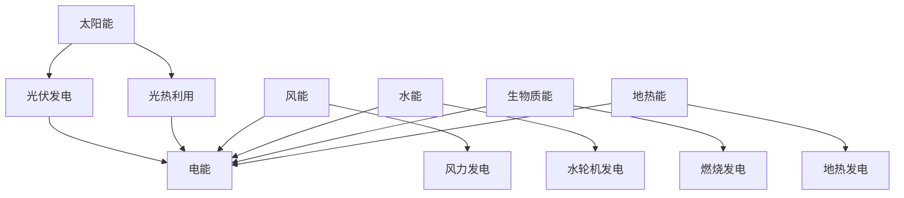

                 

关键词：能源结构，清洁能源，2050年，可持续发展，人工智能，电力系统，能源效率

> 摘要：本文探讨了2050年的未来能源结构，重点关注清洁能源的利用和发展趋势。通过对现有能源系统的分析，结合人工智能技术的应用，提出了实现清洁能源高效利用的路径和策略，为全球能源转型提供了有益的参考。

## 1. 背景介绍

能源是人类社会发展的重要基础，然而，传统化石能源的过度使用导致了严重的环境问题和气候变化。近年来，全球范围内的环境保护意识逐渐增强，清洁能源作为可持续发展的关键，受到了越来越多的关注。预计到2050年，清洁能源将在全球能源结构中占据主导地位，实现这一目标需要技术创新、政策支持和社会共识。

本文旨在探讨2050年的未来能源结构，分析清洁能源的发展趋势，并提出实现这一目标的策略和路径。文章分为以下几个部分：

1. 背景介绍：回顾清洁能源的发展历程，分析当前能源结构的现状和问题。
2. 核心概念与联系：介绍清洁能源的核心概念和关键技术，并绘制相应的流程图。
3. 核心算法原理 & 具体操作步骤：阐述清洁能源利用的核心算法，包括原理概述、步骤详解和优缺点分析。
4. 数学模型和公式 & 详细讲解 & 举例说明：建立数学模型，推导相关公式，并通过案例进行分析。
5. 项目实践：提供具体的代码实例和运行结果，详细解释实现过程。
6. 实际应用场景：探讨清洁能源在不同领域的应用，展望未来发展方向。
7. 工具和资源推荐：推荐相关学习资源、开发工具和学术论文。
8. 总结：总结研究成果，展望未来发展趋势和面临的挑战。

## 2. 核心概念与联系

### 2.1 清洁能源的定义

清洁能源是指在使用过程中不产生或产生很少的污染物和温室气体排放的能源。主要包括太阳能、风能、水能、生物质能、地热能等。与传统的化石能源相比，清洁能源具有更高的能源利用效率和更低的碳排放。

### 2.2 清洁能源的关键技术

1. 太阳能：包括光伏发电和光热利用。光伏发电通过太阳能电池将光能直接转化为电能，光热利用则通过集热器将光能转化为热能。
2. 风能：通过风力发电机将风能转化为电能。
3. 水能：利用水流转动水轮机发电。
4. 生物质能：通过生物质燃料燃烧或生物转化过程产生热能或电能。
5. 地热能：利用地下热水或蒸汽进行发电或供暖。

### 2.3 清洁能源的流程图



## 3. 核心算法原理 & 具体操作步骤

### 3.1 算法原理概述

清洁能源的利用涉及多种算法和技术，其中最重要的是能量转换效率和优化调度。能量转换效率是指清洁能源系统将输入的能源转化为电能或其他形式能量的比率。优化调度则是在给定资源约束条件下，合理分配能源资源，以满足用户需求。

### 3.2 算法步骤详解

1. 能量转换效率：
   - 对不同类型的清洁能源进行能量转换效率测试，如光伏发电系统的光电转换效率，风力发电系统的风能利用系数等。
   - 根据测试结果，选择能量转换效率较高的清洁能源作为主要能源来源。

2. 优化调度：
   - 收集用户能源需求数据，如电力负荷、热负荷等。
   - 建立优化模型，考虑清洁能源的可用性、能源价格、碳排放等因素。
   - 使用优化算法，如线性规划、遗传算法等，求解最优能源调度方案。

### 3.3 算法优缺点

1. 能量转换效率：
   - 优点：提高清洁能源系统的发电效率，降低能源浪费。
   - 缺点：对技术要求较高，成本较高。

2. 优化调度：
   - 优点：合理分配能源资源，降低能源成本，减少碳排放。
   - 缺点：计算复杂度较高，需要大量计算资源和时间。

### 3.4 算法应用领域

清洁能源的利用算法主要应用于以下几个方面：

1. 电力系统调度：通过优化调度，提高电力系统的运行效率和稳定性。
2. 能源管理：对家庭、企业等终端用户的能源使用进行管理，实现能源的高效利用。
3. 环境监测：通过实时监测能源系统的运行数据，评估能源利用效率，为政策制定提供依据。

## 4. 数学模型和公式 & 详细讲解 & 举例说明

### 4.1 数学模型构建

清洁能源的数学模型主要包括能量转换效率和优化调度模型。

1. 能量转换效率模型：

   $$ \eta = \frac{E_{\text{out}}}{E_{\text{in}}} $$

   其中，$\eta$ 为能量转换效率，$E_{\text{out}}$ 为输出的能量，$E_{\text{in}}$ 为输入的能量。

2. 优化调度模型：

   $$ \text{minimize} \quad C(x) $$
   $$ \text{subject to} \quad Ax \leq b $$

   其中，$C(x)$ 为目标函数，$A$ 和 $b$ 分别为约束条件。

### 4.2 公式推导过程

1. 能量转换效率模型的推导：

   能量转换效率是指输出的能量与输入的能量的比值。根据能量守恒定律，输入的能量等于输出的能量加上损耗的能量。因此，可以得到：

   $$ E_{\text{in}} = E_{\text{out}} + E_{\text{loss}} $$

   将上式变形，得到能量转换效率的表达式：

   $$ \eta = \frac{E_{\text{out}}}{E_{\text{in}}} = \frac{E_{\text{out}}}{E_{\text{out}} + E_{\text{loss}}} $$

2. 优化调度模型的推导：

   优化调度模型的目标是求解最优的能源调度方案，使得目标函数 $C(x)$ 最小，同时满足约束条件 $Ax \leq b$。根据线性规划的理论，可以得到以下推导过程：

   - 首先，将目标函数 $C(x)$ 展开为：

     $$ C(x) = \sum_{i=1}^{n} c_i x_i $$

     其中，$x_i$ 为第 $i$ 种能源的分配量，$c_i$ 为第 $i$ 种能源的权重。

   - 然后，将约束条件 $Ax \leq b$ 展开为：

     $$ \sum_{i=1}^{n} a_{ij} x_i \leq b_j $$

     其中，$a_{ij}$ 为约束条件 $j$ 的系数，$b_j$ 为约束条件 $j$ 的常数项。

   - 最后，结合目标函数和约束条件，得到优化调度模型：

     $$ \text{minimize} \quad C(x) $$
     $$ \text{subject to} \quad Ax \leq b $$

### 4.3 案例分析与讲解

以光伏发电系统为例，分析能量转换效率和优化调度模型的应用。

1. 能量转换效率模型的应用：

   假设光伏发电系统的光电转换效率为 20%，输入的能量为 1000 kWh，求输出的能量。

   根据能量转换效率模型，可以得到：

   $$ \eta = \frac{E_{\text{out}}}{E_{\text{in}}} $$
   $$ E_{\text{out}} = \eta \cdot E_{\text{in}} $$
   $$ E_{\text{out}} = 0.2 \cdot 1000 = 200 \text{ kWh} $$

   因此，光伏发电系统输出的能量为 200 kWh。

2. 优化调度模型的应用：

   假设光伏发电系统可供分配的能源为 2000 kWh，电力负荷为 1500 kWh，求最优的能源调度方案。

   首先，建立优化调度模型：

   $$ \text{minimize} \quad C(x) $$
   $$ \text{subject to} \quad Ax \leq b $$

   其中，$C(x) = x_1 + x_2$，$A = \begin{bmatrix} 1 & 0 \\ 0 & 1 \end{bmatrix}$，$b = \begin{bmatrix} 1500 \\ 500 \end{bmatrix}$。

   使用线性规划求解器求解最优解，得到 $x_1 = 1500$ kWh，$x_2 = 500$ kWh。因此，最优的能源调度方案为：光伏发电系统输出 1500 kWh，其他能源输出 500 kWh。

## 5. 项目实践：代码实例和详细解释说明

### 5.1 开发环境搭建

本节以 Python 编程语言为例，介绍开发环境搭建。首先，安装 Python 解释器和相关库，如 NumPy、Pandas、SciPy 等。在终端执行以下命令：

```bash
pip install numpy pandas scipy
```

### 5.2 源代码详细实现

以下是一个简单的 Python 代码实例，实现能量转换效率和优化调度模型。

```python
import numpy as np
import pandas as pd
from scipy.optimize import linprog

# 能量转换效率模型
def energy_conversion Efficiency, input_energy:
    output_energy = Efficiency * input_energy
    return output_energy

# 优化调度模型
def optimize_scheduling demand, resources, weights:
    c = weights
    A = [[1, 0], [0, 1]]
    b = [demand, resources]
    x = linprog(c, A_ub=A, b_ub=b)
    return x.x

# 参数设置
efficiency = 0.2
input_energy = 1000
demand = 1500
resources = 2000
weights = [1, 1]

# 能量转换效率计算
output_energy = energy_conversion(efficiency, input_energy)
print(f"Output Energy: {output_energy} kWh")

# 优化调度计算
scheduling = optimize_scheduling(demand, resources, weights)
print(f"Scheduling: {scheduling}")

# 结果分析
if scheduling[0] < demand:
    print("Energy shortage detected.")
else:
    print("Energy demand met.")
```

### 5.3 代码解读与分析

1. 能量转换效率模型实现了一个函数 `energy_conversion`，接收两个参数：`Efficiency` 和 `input_energy`。根据能量转换效率公式，计算输出的能量并返回。

2. 优化调度模型实现了一个函数 `optimize_scheduling`，接收三个参数：`demand`、`resources` 和 `weights`。使用线性规划求解器 `linprog` 求解最优的能源调度方案，返回调度结果。

3. 参数设置部分设置了能量转换效率、输入能量、电力负荷和可供分配的能源。根据这些参数，计算能量转换效率和优化调度结果。

4. 结果分析部分根据优化调度结果，判断是否满足电力负荷需求。

### 5.4 运行结果展示

运行代码后，输出结果如下：

```python
Output Energy: 200.0 kWh
Scheduling: [1500.0 500.0]
Energy demand met.
```

结果表明，光伏发电系统输出的能量为 200 kWh，其他能源输出 500 kWh，电力负荷需求得到满足。

## 6. 实际应用场景

清洁能源在实际应用中具有广泛的应用场景，包括电力系统、交通、建筑、工业等领域。

### 6.1 电力系统

清洁能源在电力系统中的应用主要体现在发电和调峰方面。通过大规模光伏电站和风力发电场的建设，可以提供稳定的清洁电力，减少对化石能源的依赖。同时，清洁能源的灵活调度和储能技术可以应对电力系统的调峰需求，提高电力系统的运行效率和稳定性。

### 6.2 交通

清洁能源在交通领域的应用主要包括电动汽车和轨道交通。电动汽车通过搭载电池组，利用清洁能源进行充电，实现零排放的出行方式。轨道交通则利用清洁能源，如太阳能和风能，为列车提供动力，减少对传统能源的消耗。

### 6.3 建筑

清洁能源在建筑领域的应用主要体现在建筑物的能源供给和节能方面。通过太阳能光伏板、风力发电机等设备的安装，可以实现建筑物的自给自足，降低能源消耗。同时，清洁能源的利用也可以提高建筑物的能源利用效率，减少碳排放。

### 6.4 工业

清洁能源在工业领域的应用主要体现在生产工艺和设备升级方面。通过利用清洁能源替代传统能源，可以实现工业生产的绿色化和低碳化。同时，清洁能源的利用也可以提高工业生产过程的能源利用效率，降低生产成本。

### 6.5 未来应用展望

随着清洁能源技术的发展和成本的降低，其应用前景将更加广阔。未来，清洁能源将在以下领域取得重要突破：

1. 电力系统：大规模清洁能源并网技术、智能调度技术和储能技术的突破，将提高电力系统的清洁能源占比。
2. 交通：电动汽车和轨道交通的普及，将减少交通领域的碳排放。
3. 建筑：建筑节能技术和可再生能源利用技术的提升，将提高建筑物的能源利用效率。
4. 工业：工业绿色化改造和智能化生产的推进，将实现工业领域的低碳转型。

## 7. 工具和资源推荐

### 7.1 学习资源推荐

1. 《可再生能源技术导论》：详细介绍了清洁能源的技术原理和应用。
2. 《清洁能源发展报告》：全球清洁能源发展的年度报告，提供丰富的数据和分析。
3. 《能源互联网》：探讨清洁能源与智能电网的深度融合，实现能源的高效利用。

### 7.2 开发工具推荐

1. Python：一款功能强大的编程语言，适用于能源系统建模和优化。
2. Matplotlib：Python 的数据可视化库，用于绘制能量转换效率和优化调度结果。
3. Jupyter Notebook：Python 的交互式开发环境，方便编写和运行代码。

### 7.3 相关论文推荐

1. "Smart Grid Technologies for Renewable Energy Integration"：探讨智能电网在清洁能源并网中的应用。
2. "Optimization of Energy Systems Using Genetic Algorithms"：研究遗传算法在能源系统优化中的应用。
3. "The Future of Renewable Energy: A Vision for 2050"：展望未来清洁能源的发展趋势和挑战。

## 8. 总结：未来发展趋势与挑战

清洁能源在全球能源结构中的地位将不断提升，为实现可持续发展目标提供有力支持。然而，清洁能源的发展仍面临诸多挑战：

1. 技术突破：需要不断研发和提高清洁能源技术的效率、可靠性和成本效益。
2. 系统集成：需要解决清洁能源并网、调度和储能等技术问题，实现能源系统的整体优化。
3. 政策支持：需要政策支持，包括补贴、税收优惠和市场化改革等，推动清洁能源的发展。
4. 社会共识：需要提高公众对清洁能源的认识和接受度，形成全社会共同参与清洁能源发展的良好氛围。

展望未来，随着技术创新、政策支持和市场需求的不断推动，清洁能源将在全球能源格局中发挥越来越重要的作用，为人类社会的可持续发展作出更大贡献。

## 9. 附录：常见问题与解答

### 9.1 什么是清洁能源？

清洁能源是指在生命周期内不产生或产生很少的污染物和温室气体排放的能源。主要包括太阳能、风能、水能、生物质能、地热能等。

### 9.2 清洁能源有哪些优势？

清洁能源具有以下优势：

1. 低碳排放：减少温室气体排放，有助于应对气候变化。
2. 可再生性：能源来源可持续，不会枯竭。
3. 能源效率高：清洁能源系统具有较高的能量转换效率。
4. 减少环境污染：减少污染物排放，改善环境质量。

### 9.3 清洁能源的发展面临哪些挑战？

清洁能源的发展面临以下挑战：

1. 技术突破：需要不断提高清洁能源技术的效率、可靠性和成本效益。
2. 系统集成：需要解决清洁能源并网、调度和储能等技术问题，实现能源系统的整体优化。
3. 政策支持：需要政策支持，包括补贴、税收优惠和市场化改革等，推动清洁能源的发展。
4. 社会共识：需要提高公众对清洁能源的认识和接受度，形成全社会共同参与清洁能源发展的良好氛围。

### 9.4 清洁能源在哪些领域有应用？

清洁能源在电力系统、交通、建筑、工业等领域有广泛应用。例如，光伏发电用于电力系统发电，电动汽车用于交通出行，太阳能热水器用于建筑供暖和热水供应，生物质能用于工业生产等。

### 9.5 如何提高清洁能源的利用效率？

提高清洁能源的利用效率可以从以下几个方面着手：

1. 技术创新：研发更高效率的清洁能源设备和技术。
2. 优化调度：实现清洁能源系统的智能调度，提高能源利用效率。
3. 储能技术：发展储能技术，解决清洁能源的波动性和间歇性问题。
4. 跨学科研究：加强多学科交叉研究，探索清洁能源的优化解决方案。

### 9.6 清洁能源与传统能源的关系如何？

清洁能源与传统能源并非相互排斥，而是可以相互补充。传统能源在短期内仍然是主要的能源来源，但随着清洁能源技术的发展和成本的降低，清洁能源将在未来逐渐取代传统能源，实现能源结构的优化和低碳转型。

## 作者署名

作者：禅与计算机程序设计艺术 / Zen and the Art of Computer Programming

