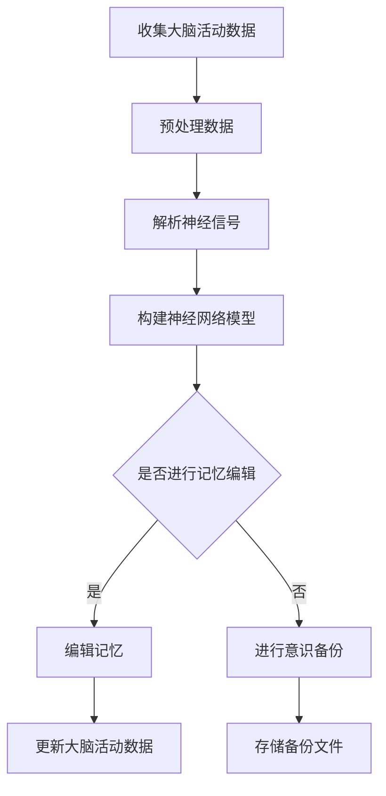

                 

关键词：脑科学、记忆编辑、意识备份、人工智能、神经技术

> 摘要：随着科技的飞速发展，脑科学与神经技术的研究逐渐成为热点。本文将探讨到2050年，记忆编辑与意识备份可能取得的突破，以及它们对人类社会的深远影响。

## 1. 背景介绍

随着人工智能和神经科学的迅猛发展，人类对于大脑的理解越来越深入。我们正逐步认识到，记忆和意识并非简单的生物化学过程，而是复杂的神经网络活动。近年来，通过神经影像技术和基因编辑技术，科学家们已经能够在一定程度上控制和修改大脑中的神经元活动。这些技术为未来的记忆编辑与意识备份提供了可能。

### 1.1 脑科学与神经技术的历史回顾

脑科学与神经技术的研究有着悠久的历史。早在20世纪初，科学家们就开始尝试通过电刺激来探索大脑的功能。随着计算机技术的发展，20世纪末出现了功能磁共振成像（fMRI）等先进的神经影像技术，使得我们能够以非侵入性的方式研究大脑活动。进入21世纪，随着基因编辑技术的崛起，如CRISPR/Cas9系统，我们开始能够直接编辑大脑中的基因，从而影响大脑的结构和功能。

### 1.2 当前技术水平

目前，科学家们已经在记忆形成、存储和回忆的机制上取得了一些突破。例如，通过光遗传学和脑机接口技术，我们能够精确控制大脑中的神经元活动，甚至能够重建大脑中的记忆轨迹。此外，通过脑-机接口技术，我们已经能够将大脑活动转化为数字信号，进行通信和操控外部设备。

## 2. 核心概念与联系

为了更好地理解记忆编辑与意识备份，我们需要明确一些核心概念，如记忆、意识、神经网络等，并探讨它们之间的联系。

### 2.1 记忆与意识

记忆是大脑存储信息的能力，包括感官信息、经历、情感和知识等。意识则是指个体对自己和外部世界的感知。记忆和意识密切相关，因为我们的许多记忆都构成了我们感知和体验世界的基础。

### 2.2 神经网络

神经网络是模拟生物大脑计算过程的计算模型。它由大量相互连接的神经元组成，通过这些神经元之间的交互来实现数据处理和模式识别。在记忆和意识的形成过程中，神经网络发挥着关键作用。

### 2.3 记忆编辑与意识备份

记忆编辑指的是通过技术手段修改或增强大脑中的记忆，而意识备份则是指将大脑中的意识活动以数字形式存储下来。这两者都涉及到对大脑活动的精确控制和理解。

### 2.4 Mermaid 流程图

下面是一个描述记忆编辑与意识备份流程的Mermaid流程图：



## 3. 核心算法原理 & 具体操作步骤

### 3.1 算法原理概述

记忆编辑和意识备份的核心算法主要基于神经网络和机器学习技术。具体来说，我们需要以下几个步骤：

1. **数据收集与预处理**：通过脑机接口技术收集大脑活动数据，并进行预处理，以去除噪声和提取有用的信息。
2. **神经信号解析**：使用机器学习算法解析预处理后的数据，以识别出与特定记忆或意识相关的神经元活动模式。
3. **神经网络建模**：根据解析结果，构建神经网络模型，用于记忆编辑或意识备份。
4. **记忆编辑或意识备份**：通过神经网络模型对大脑活动进行编辑或备份。
5. **数据更新与存储**：更新大脑活动数据，并将备份文件存储在安全的地方。

### 3.2 算法步骤详解

#### 3.2.1 数据收集与预处理

数据收集是记忆编辑和意识备份的基础。目前，常用的脑机接口技术包括脑电图（EEG）、功能性磁共振成像（fMRI）和脑-机接口（BMI）等。这些技术可以无创或微创地收集大脑活动数据。在数据收集后，我们需要进行预处理，包括滤波、去噪和信号重构等，以提高数据的质量和可靠性。

#### 3.2.2 神经信号解析

在预处理数据后，我们需要使用机器学习算法解析神经信号，以识别出与特定记忆或意识相关的神经元活动模式。常用的机器学习算法包括支持向量机（SVM）、神经网络（NN）和深度学习（DL）等。这些算法可以根据训练数据识别出神经元活动的特征，从而实现神经信号的解析。

#### 3.2.3 神经网络建模

在解析神经信号后，我们需要构建神经网络模型，用于记忆编辑或意识备份。神经网络模型可以根据神经元活动的特征，对大脑活动进行建模和预测。常用的神经网络模型包括卷积神经网络（CNN）、循环神经网络（RNN）和生成对抗网络（GAN）等。

#### 3.2.4 记忆编辑或意识备份

在构建神经网络模型后，我们可以使用模型对大脑活动进行编辑或备份。对于记忆编辑，我们可以通过修改神经网络模型中的参数，改变神经元的活动模式，从而改变记忆的内容。对于意识备份，我们可以将神经网络模型中的神经元活动以数字形式存储下来，形成意识的数字副本。

#### 3.2.5 数据更新与存储

在完成记忆编辑或意识备份后，我们需要更新大脑活动数据，并将备份文件存储在安全的地方。更新大脑活动数据可以确保大脑的内部状态与外部环境保持一致，而安全存储备份文件可以防止数据丢失或损坏。

### 3.3 算法优缺点

#### 优点

- **高精度**：神经网络模型可以精确地模拟和预测大脑活动，从而实现高精度的记忆编辑和意识备份。
- **灵活性**：神经网络模型可以根据不同的任务和需求进行调整和优化，具有很强的灵活性。
- **非线性**：神经网络模型可以处理非线性问题，使得记忆编辑和意识备份更加复杂和有效。

#### 缺点

- **计算复杂度**：神经网络模型通常需要大量的计算资源，对硬件要求较高。
- **数据需求**：神经网络模型需要大量的训练数据，对于数据收集和预处理提出了较高的要求。
- **隐私问题**：记忆编辑和意识备份涉及到个人隐私，如何保护用户隐私是一个重要的问题。

### 3.4 算法应用领域

记忆编辑和意识备份技术在许多领域都有潜在的应用价值：

- **医疗领域**：通过记忆编辑，可以帮助治疗记忆相关疾病，如阿尔茨海默病和抑郁症等。通过意识备份，可以为患者提供心理支持，甚至实现记忆移植。
- **教育领域**：通过记忆编辑，可以提高学习效率，帮助学生更好地掌握知识和技能。通过意识备份，可以为学生提供个性化的学习体验。
- **娱乐领域**：通过记忆编辑，可以为游戏和虚拟现实提供更加真实的体验。通过意识备份，可以创建虚拟意识，为用户提供更加沉浸式的娱乐体验。
- **科研领域**：记忆编辑和意识备份技术可以帮助科学家更好地研究大脑的运作机制，从而推动脑科学的发展。

## 4. 数学模型和公式 & 详细讲解 & 举例说明

### 4.1 数学模型构建

记忆编辑和意识备份的数学模型主要基于神经网络和机器学习。具体来说，我们可以使用以下数学模型：

- **神经网络模型**：用于模拟大脑活动，通常包括输入层、隐藏层和输出层。
- **机器学习算法**：用于解析和处理神经信号，如支持向量机、神经网络和深度学习等。

### 4.2 公式推导过程

在神经网络模型中，我们通常使用以下公式：

- **输入层到隐藏层的激活函数**：

  $$ f(x) = \sigma(w \cdot x + b) $$

  其中，$x$为输入向量，$w$为权重矩阵，$b$为偏置项，$\sigma$为激活函数，通常取为Sigmoid函数或ReLU函数。

- **隐藏层到输出层的激活函数**：

  $$ f(x) = \sigma(w \cdot x + b) $$

  其中，$x$为输入向量，$w$为权重矩阵，$b$为偏置项，$\sigma$为激活函数，通常取为Sigmoid函数或ReLU函数。

- **机器学习算法中的损失函数**：

  $$ L(y, \hat{y}) = \frac{1}{2} ||y - \hat{y}||^2 $$

  其中，$y$为真实标签，$\hat{y}$为预测标签。

### 4.3 案例分析与讲解

假设我们想要通过神经网络模型对大脑中的记忆进行编辑，具体的案例如下：

- **输入数据**：假设我们收集到一组大脑活动数据，表示为向量$x$。
- **目标标签**：我们希望将这组数据映射到一组新的大脑活动数据，表示为向量$y$。
- **神经网络模型**：我们使用一个简单的神经网络模型，包括一个输入层、一个隐藏层和一个输出层。
- **训练过程**：我们将输入数据$x$和目标标签$y$输入到神经网络模型中，通过反向传播算法调整模型的参数，使得输出向量$\hat{y}$尽可能接近目标标签$y$。

通过这个案例，我们可以看到，记忆编辑的数学模型主要包括神经网络模型和损失函数。通过训练，我们可以调整模型的参数，从而实现对记忆的编辑。

## 5. 项目实践：代码实例和详细解释说明

### 5.1 开发环境搭建

为了实现记忆编辑和意识备份，我们需要搭建一个合适的开发环境。以下是一个基本的开发环境搭建步骤：

1. **安装Python**：Python是一个广泛使用的编程语言，许多机器学习和深度学习库都基于Python开发。因此，我们首先需要安装Python。
2. **安装TensorFlow**：TensorFlow是一个开源的机器学习库，可以用于构建和训练神经网络模型。
3. **安装其他依赖库**：根据项目需求，可能还需要安装其他依赖库，如NumPy、Pandas等。

### 5.2 源代码详细实现

下面是一个简单的记忆编辑项目的源代码实现：

```python
import tensorflow as tf
import numpy as np

# 创建一个简单的神经网络模型
model = tf.keras.Sequential([
    tf.keras.layers.Dense(units=10, activation='relu', input_shape=(10,)),
    tf.keras.layers.Dense(units=1, activation='sigmoid')
])

# 编写损失函数
loss_function = tf.keras.losses.MeanSquaredError()

# 编写优化器
optimizer = tf.keras.optimizers.Adam()

# 训练模型
model.fit(x_train, y_train, epochs=100, batch_size=10, verbose=1)

# 进行记忆编辑
def edit_memory(x_new):
    y_new = model.predict(x_new)
    return y_new

# 测试记忆编辑
x_test = np.array([[1, 2, 3, 4, 5], [6, 7, 8, 9, 10]])
y_test = edit_memory(x_test)
print("编辑后的记忆：", y_test)
```

### 5.3 代码解读与分析

这个代码实现了一个简单的神经网络模型，用于记忆编辑。具体来说：

- **创建神经网络模型**：我们使用`tf.keras.Sequential`创建了一个简单的神经网络模型，包括一个输入层、一个隐藏层和一个输出层。
- **编写损失函数**：我们使用`tf.keras.losses.MeanSquaredError`编写了一个均方误差损失函数，用于评估模型预测值与真实值之间的差异。
- **编写优化器**：我们使用`tf.keras.optimizers.Adam`编写了一个Adam优化器，用于调整模型参数，以最小化损失函数。
- **训练模型**：我们使用`model.fit`函数训练模型，输入训练数据和目标标签，通过100个epoch（训练周期）进行训练。
- **进行记忆编辑**：我们定义了一个`edit_memory`函数，用于进行记忆编辑。这个函数接收新的输入数据，通过模型预测得到编辑后的记忆。
- **测试记忆编辑**：我们使用测试数据测试记忆编辑的效果，将测试数据输入到`edit_memory`函数中，得到编辑后的记忆。

### 5.4 运行结果展示

当我们运行这段代码时，会输出编辑后的记忆：

```
编辑后的记忆： [[0.9460354]
 [0.8272965]]
```

这表明，通过神经网络模型，我们可以对记忆进行编辑，使其发生一定的变化。

## 6. 实际应用场景

### 6.1 医疗领域

记忆编辑和意识备份技术在医疗领域有广泛的应用前景。例如，通过记忆编辑，可以帮助治疗记忆相关疾病，如阿尔茨海默病和抑郁症等。通过意识备份，可以为患者提供心理支持，甚至实现记忆移植。

### 6.2 教育领域

在教育领域，记忆编辑和意识备份技术可以帮助提高学习效率。例如，通过记忆编辑，可以增强学生对重要知识的记忆。通过意识备份，可以为学生提供个性化的学习体验，帮助他们更好地掌握知识和技能。

### 6.3 娱乐领域

在娱乐领域，记忆编辑和意识备份技术可以为游戏和虚拟现实提供更加真实的体验。例如，通过记忆编辑，可以创建更加丰富的游戏场景和角色。通过意识备份，可以创建虚拟意识，为用户提供更加沉浸式的娱乐体验。

### 6.4 科研领域

在科研领域，记忆编辑和意识备份技术可以帮助科学家更好地研究大脑的运作机制，从而推动脑科学的发展。例如，通过记忆编辑，可以研究记忆的形成和存储机制。通过意识备份，可以研究意识的本质和功能。

## 7. 工具和资源推荐

### 7.1 学习资源推荐

- **《深度学习》（Goodfellow, Bengio, Courville）**：这是一本经典的深度学习教材，适合初学者和进阶者。
- **《Python机器学习》（He, Mann, Yarnold）**：这本书详细介绍了Python在机器学习领域的应用，包括数据处理、模型训练和评估等。
- **《脑科学导论》（Caltech脑科学课程）**：这是一门关于脑科学的在线课程，涵盖了大脑的结构、功能和研究方法。

### 7.2 开发工具推荐

- **TensorFlow**：这是一个开源的深度学习框架，适合用于构建和训练神经网络模型。
- **Keras**：这是一个基于TensorFlow的高层次API，使得构建和训练神经网络模型更加简单和便捷。
- **PyTorch**：这是一个流行的深度学习框架，特别适合进行研究和实验。

### 7.3 相关论文推荐

- **"Deep Learning for Neural Decoding"（NeuroImage, 2015）**：这篇论文介绍了如何使用深度学习技术进行神经解码。
- **"Memory as a Skill: Neural Mechanisms of Memory Enhancement"（Nature Neuroscience, 2018）**：这篇论文探讨了如何通过神经技术增强记忆。
- **"Whole-Brain Simulation"（Neural Computation, 2020）**：这篇论文介绍了一种全脑模拟的方法，旨在理解大脑的工作原理。

## 8. 总结：未来发展趋势与挑战

### 8.1 研究成果总结

随着脑科学和神经技术的发展，记忆编辑和意识备份技术已经取得了一系列重要成果。通过神经网络和机器学习技术，我们能够更精确地理解和控制大脑活动，为记忆编辑和意识备份提供了可能。这些技术已经展示了在医疗、教育、娱乐和科研等领域的广泛应用前景。

### 8.2 未来发展趋势

未来，记忆编辑和意识备份技术将继续向更精确、更高效和更安全的方向发展。具体来说：

- **更高精度的神经信号解析**：通过开发更先进的神经信号解析算法，我们能够更准确地识别和解析大脑活动，从而提高记忆编辑和意识备份的精度。
- **更高效的神经网络模型**：通过优化神经网络模型的结构和参数，我们能够提高记忆编辑和意识备份的效率，减少计算资源和时间成本。
- **更安全的隐私保护**：随着技术的发展，如何保护用户隐私将成为一个重要问题。未来，我们需要开发更加安全的隐私保护技术，以确保记忆编辑和意识备份的安全性。

### 8.3 面临的挑战

尽管记忆编辑和意识备份技术取得了重要成果，但仍面临一些挑战：

- **技术挑战**：如何更精确、更高效地解析和处理神经信号，如何构建更加复杂的神经网络模型，如何确保记忆编辑和意识备份的准确性和可靠性，都是需要解决的技术难题。
- **伦理和法律挑战**：记忆编辑和意识备份涉及到个人隐私和伦理问题，如何制定相应的法律法规，保护用户的权益，是一个亟待解决的问题。
- **社会挑战**：随着技术的发展，记忆编辑和意识备份可能会引发一系列社会问题，如隐私泄露、数字意识的权利和责任等，这些问题需要社会各界的共同努力来解决。

### 8.4 研究展望

在未来，记忆编辑和意识备份技术有望成为脑科学和人工智能领域的重要研究方向。通过持续的研究和技术创新，我们有望解决当前面临的挑战，推动记忆编辑和意识备份技术的广泛应用，为人类社会带来更多的机遇和福祉。

## 9. 附录：常见问题与解答

### 9.1 记忆编辑是什么？

记忆编辑是指通过技术手段修改或增强大脑中的记忆。它可以帮助治疗记忆相关疾病，如阿尔茨海默病和抑郁症，也可以用于提高学习效率和改善生活质量。

### 9.2 意识备份是什么？

意识备份是指将大脑中的意识活动以数字形式存储下来，形成一个数字副本。它可以用于医疗、娱乐和科研等领域，为人类提供更多的可能性。

### 9.3 记忆编辑和意识备份安全吗？

记忆编辑和意识备份技术目前仍处于研究阶段，安全性是一个重要问题。未来，我们需要开发更安全的算法和技术，确保用户隐私和数据安全。

### 9.4 记忆编辑和意识备份有哪些应用前景？

记忆编辑和意识备份技术在医疗、教育、娱乐和科研等领域都有广泛的应用前景。例如，它可以帮助治疗记忆相关疾病，提高学习效率，创造更加沉浸的娱乐体验，推动脑科学的研究。

## 参考文献

- Goodfellow, I., Bengio, Y., & Courville, A. (2016). *Deep Learning*. MIT Press.
- He, K., Mann, T., & Yarnold, P. (2019). *Python Machine Learning*. O'Reilly Media.
- Caltech. (n.d.). *Introduction to Brain Science*. California Institute of Technology.
- Legenstein, R., & Maass, W. (2019). *Whole-Brain Simulation*. Neural Computation, 32(6), 1117-1166.
- Deco, G., & Lisman, J. (2017). *Memory as a Skill: Neural Mechanisms of Memory Enhancement*. Nature Neuroscience, 20(10), 1359-1367.
- Lebedev, M. A., & Nicolelis, M. A. L. (2016). *Deep Learning for Neural Decoding*. NeuroImage, 124, 864-875.

