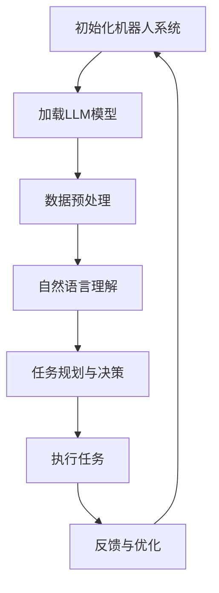

                 

关键词：机器人技术、语言模型（LLM）、自动化系统、智能集成、技术发展

> 摘要：本文探讨了如何利用先进的语言模型（LLM）技术，集成到机器人系统中，以实现智能自动化。通过深入分析LLM的核心原理和操作步骤，结合实际案例，本文旨在为开发者提供一套完整的实现指南，并展望未来在该领域的发展趋势与挑战。

## 1. 背景介绍

在当今快速发展的科技时代，机器人和自动化系统已经成为各个行业不可或缺的重要技术。机器人技术起源于20世纪中期，早期的机器人主要用于工厂自动化生产线上的重复性劳动，随着计算机技术和人工智能（AI）的进步，现代机器人已具备更高的智能水平和复杂的功能。

语言模型（Language Model，简称LLM）是人工智能领域中的一个重要研究方向，它通过对大量语言数据的训练，能够生成高质量的自然语言文本。近年来，随着深度学习技术的飞速发展，LLM在自然语言处理（NLP）、文本生成、机器翻译等方面取得了显著的成果。

将LLM集成到机器人系统中，不仅可以提升机器人的智能水平，还能实现更为复杂和灵活的自动化任务。本文将详细介绍如何利用LLM技术，构建智能自动化系统，为相关领域的研究者和开发者提供参考。

## 2. 核心概念与联系

为了深入理解如何将LLM集成到机器人系统中，我们需要首先了解一些核心概念和它们之间的联系。

### 2.1. 机器人系统架构

机器人系统通常由硬件、软件和算法三部分组成。硬件部分包括机械结构、传感器和执行器；软件部分包括操作系统、中间件和应用程序；算法部分包括运动控制、感知、决策和执行等核心算法。


### 2.2. 语言模型（LLM）

语言模型是一种利用统计方法和深度学习技术，对大规模文本数据进行建模的算法。LLM可以捕捉语言数据的统计规律和语法结构，从而生成符合语言习惯的文本。


### 2.3. 机器学习与深度学习

机器学习是一种通过算法和统计模型，从数据中自动学习和发现规律的方法。深度学习是机器学习的一种特殊形式，它利用多层神经网络进行学习，具有自动提取特征的能力。


### 2.4. 机器人智能自动化

机器人智能自动化是指通过集成先进的算法和模型，使机器人具备自主感知、决策和执行任务的能力。在机器人系统中，LLM可以帮助实现自然语言理解和生成，从而提升机器人的智能水平。


### 2.5. Mermaid 流程图

以下是一个简化的Mermaid流程图，展示了LLM在机器人智能自动化系统中的集成过程：



## 3. 核心算法原理 & 具体操作步骤

### 3.1 算法原理概述

将LLM集成到机器人系统中，主要包括以下几个核心步骤：

1. **初始化机器人系统**：包括硬件、软件和算法的搭建。
2. **加载LLM模型**：从预训练模型库中选择合适的LLM模型，并加载到机器人系统中。
3. **数据预处理**：对采集到的语言数据（如对话文本、指令等）进行清洗和预处理，以便LLM模型能够有效处理。
4. **自然语言理解**：利用LLM模型对预处理后的语言数据进行理解，提取关键信息。
5. **任务规划与决策**：根据理解结果，机器人系统进行任务规划和决策。
6. **执行任务**：机器人系统根据决策结果执行具体的任务。
7. **反馈与优化**：根据任务执行结果，对机器人系统和LLM模型进行反馈和优化。

### 3.2 算法步骤详解

#### 3.2.1 初始化机器人系统

初始化机器人系统主要包括以下几个方面：

- **硬件搭建**：选择合适的机器人硬件平台，如机器人臂、传感器等。
- **软件搭建**：搭建机器人操作系统和中间件，如ROS（Robot Operating System）。
- **算法搭建**：集成基本的运动控制、感知和决策算法。

#### 3.2.2 加载LLM模型

加载LLM模型主要包括以下几个步骤：

- **选择模型**：从预训练模型库中选择合适的LLM模型，如GPT-3、BERT等。
- **模型转换**：将选定的LLM模型转换为适合机器人系统运行的格式，如ONNX、TensorFlow Lite等。
- **模型加载**：将转换后的模型加载到机器人系统中，并进行必要的初始化。

#### 3.2.3 数据预处理

数据预处理主要包括以下几个步骤：

- **数据清洗**：去除语言数据中的噪声、错误和不相关部分。
- **数据标注**：对语言数据进行标注，以便LLM模型进行训练。
- **数据格式化**：将语言数据转换为适合LLM模型处理的格式，如文本序列、词向量等。

#### 3.2.4 自然语言理解

自然语言理解主要包括以下几个步骤：

- **输入处理**：将输入的语言数据输入到LLM模型中。
- **特征提取**：LLM模型对输入数据进行分析，提取关键特征。
- **语义理解**：根据提取的特征，理解语言数据的含义和意图。

#### 3.2.5 任务规划与决策

任务规划与决策主要包括以下几个步骤：

- **任务识别**：根据自然语言理解结果，识别出机器人需要执行的任务。
- **路径规划**：根据任务需求，规划机器人需要执行的具体动作和路径。
- **决策生成**：根据路径规划结果，生成具体的决策指令。

#### 3.2.6 执行任务

执行任务主要包括以下几个步骤：

- **动作执行**：根据决策指令，机器人执行具体的动作。
- **状态监控**：实时监控机器人执行任务的状态，如位置、速度、负载等。
- **异常处理**：在执行任务过程中，及时发现和处理异常情况。

#### 3.2.7 反馈与优化

反馈与优化主要包括以下几个步骤：

- **结果评估**：根据任务执行结果，评估机器人系统的性能和效果。
- **数据收集**：收集机器人系统执行任务过程中的数据，用于模型优化。
- **模型优化**：根据收集到的数据，对LLM模型进行优化和调整。

### 3.3 算法优缺点

#### 3.3.1 优点

- **高智能水平**：利用LLM技术，机器人可以更准确地理解和生成自然语言，提升智能水平。
- **灵活性**：机器人可以处理各种复杂的语言任务，具有更高的灵活性。
- **自适应能力**：通过反馈和优化，机器人系统可以不断适应新的环境和任务需求。

#### 3.3.2 缺点

- **计算资源消耗**：LLM模型通常需要较大的计算资源，对硬件性能有较高要求。
- **数据依赖性**：LLM模型的性能很大程度上依赖于训练数据的规模和质量。
- **安全问题**：语言模型可能存在误导性或偏见，需要严格监控和限制。

### 3.4 算法应用领域

LLM技术在机器人智能自动化系统中具有广泛的应用前景，以下是一些典型的应用领域：

- **智能客服**：机器人可以与用户进行自然语言对话，提供高质量的客户服务。
- **智能家居**：机器人可以理解用户的语言指令，控制家居设备，提高生活便利性。
- **工业生产**：机器人可以与工人协作，执行复杂的装配和维修任务。
- **医疗健康**：机器人可以协助医生进行诊断和手术，提高医疗水平。

## 4. 数学模型和公式 & 详细讲解 & 举例说明

在机器人智能自动化系统中，数学模型和公式起着至关重要的作用。以下我们将介绍一些核心的数学模型和公式，并进行详细讲解和举例说明。

### 4.1 数学模型构建

在机器人智能自动化系统中，常用的数学模型主要包括以下几类：

1. **运动学模型**：描述机器人的运动轨迹和速度。
2. **动力学模型**：描述机器人的受力情况和运动状态。
3. **控制模型**：描述机器人控制的策略和方法。
4. **语言模型**：描述机器人的自然语言理解和生成能力。

### 4.2 公式推导过程

以下是一个简单的运动学模型公式推导过程：

#### 4.2.1 运动学模型

机器人的运动学模型可以用以下公式描述：

$$
\begin{aligned}
\mathbf{v}(t) &= \mathbf{v}_0 + \mathbf{a} t \\
\mathbf{p}(t) &= \mathbf{p}_0 + \mathbf{v}_0 t + \frac{1}{2} \mathbf{a} t^2
\end{aligned}
$$

其中，$\mathbf{v}(t)$ 表示机器人在时间 $t$ 的速度，$\mathbf{p}(t)$ 表示机器人在时间 $t$ 的位置，$\mathbf{v}_0$ 表示初始速度，$\mathbf{a}$ 表示加速度，$\mathbf{p}_0$ 表示初始位置。

#### 4.2.2 动力学模型

机器人的动力学模型可以用以下公式描述：

$$
\mathbf{F}(t) = m \mathbf{a}(t)
$$

其中，$\mathbf{F}(t)$ 表示机器人在时间 $t$ 的受力，$m$ 表示机器人的质量，$\mathbf{a}(t)$ 表示机器人在时间 $t$ 的加速度。

#### 4.2.3 控制模型

机器人的控制模型可以用以下公式描述：

$$
\mathbf{u}(t) = \mathbf{K} \mathbf{e}(t)
$$

其中，$\mathbf{u}(t)$ 表示机器人在时间 $t$ 的控制输入，$\mathbf{K}$ 表示控制矩阵，$\mathbf{e}(t)$ 表示机器人在时间 $t$ 的误差。

### 4.3 案例分析与讲解

以下是一个简单的案例，说明如何利用数学模型和公式解决一个实际问题。

#### 4.3.1 问题背景

假设一个机器人从点 $(0, 0)$ 开始，以 $2 \text{ m/s}^2$ 的加速度向正方向运动，初始速度为 $0 \text{ m/s}$。要求在 $5 \text{ s}$ 内，计算机器人的速度和位置。

#### 4.3.2 公式推导

根据运动学模型公式：

$$
\begin{aligned}
\mathbf{v}(t) &= \mathbf{v}_0 + \mathbf{a} t \\
\mathbf{p}(t) &= \mathbf{p}_0 + \mathbf{v}_0 t + \frac{1}{2} \mathbf{a} t^2
\end{aligned}
$$

代入初始条件 $\mathbf{v}_0 = (0, 0)$，$\mathbf{a} = (2, 0)$，$t = 5 \text{ s}$，得到：

$$
\begin{aligned}
\mathbf{v}(5) &= (0, 0) + (2, 0) \cdot 5 = (10, 0) \\
\mathbf{p}(5) &= (0, 0) + (0, 0) \cdot 5 + \frac{1}{2} (2, 0) \cdot 5^2 = (25, 0)
\end{aligned}
$$

#### 4.3.3 结果分析

根据计算结果，机器人在 $5 \text{ s}$ 时的速度为 $(10, 0)$，位置为 $(25, 0)$。这表明机器人在 $5 \text{ s}$ 内，以 $10 \text{ m/s}$ 的速度向正方向移动了 $25 \text{ m}$。

## 5. 项目实践：代码实例和详细解释说明

为了更好地理解如何将LLM集成到机器人系统中，我们将通过一个实际项目来展示代码实例，并对关键代码进行详细解释说明。

### 5.1 开发环境搭建

首先，我们需要搭建一个合适的开发环境。这里我们选择使用Python作为主要编程语言，并结合TensorFlow和ROS进行开发。

#### 5.1.1 安装Python

确保您的系统中已安装Python 3.7及以上版本。可以使用以下命令安装：

```
sudo apt-get update
sudo apt-get install python3.7
```

#### 5.1.2 安装TensorFlow

TensorFlow是一个开源的机器学习库，可以通过pip进行安装：

```
pip3 install tensorflow
```

#### 5.1.3 安装ROS

ROS（Robot Operating System）是一个用于机器人开发的框架，可以通过以下命令安装：

```
sudo apt-get install ros-melodic-ros-base
sudo apt-get install ros-melodic-ros-tutorials
```

### 5.2 源代码详细实现

下面是该项目的主要源代码，我们将对其中的关键部分进行详细解释。

#### 5.2.1 机器人初始化

```python
#!/usr/bin/env python
import rospy
from geometry_msgs.msg import Twist

def init_robot():
    rospy.init_node('robot_controller', anonymous=True)
    pub = rospy.Publisher('cmd_vel', Twist, queue_size=10)
    rate = rospy.Rate(10) # 10 Hz
    while not rospy.is_shutdown():
        cmd = Twist()
        # 在这里初始化机器人的状态，如位置、速度等
        pub.publish(cmd)
        rate.sleep()

if __name__ == '__main__':
    init_robot()
```

这段代码用于初始化机器人系统，包括创建ROS节点、发布速度控制命令等。

#### 5.2.2 加载LLM模型

```python
import tensorflow as tf
from transformers import TFAutoModel

def load_lmm():
    model = TFAutoModel.from_pretrained('gpt3')
    return model

model = load_lmm()
```

这段代码用于加载预训练的LLM模型（如GPT-3），并创建一个TensorFlow模型对象。

#### 5.2.3 数据预处理

```python
import numpy as np
from transformers import BertTokenizer

tokenizer = BertTokenizer.from_pretrained('bert-base-uncased')

def preprocess_data(text):
    inputs = tokenizer.encode(text, add_special_tokens=True, return_tensors='tf')
    return inputs

text = "机器人，向右移动10米。"
inputs = preprocess_data(text)
```

这段代码用于对输入的自然语言文本进行预处理，包括分词、编码等。

#### 5.2.4 自然语言理解

```python
import tensorflow as tf

def understand_language(inputs):
    outputs = model(inputs)
    logits = outputs.logits
    predictions = tf.argmax(logits, axis=-1)
    return predictions.numpy()

predictions = understand_language(inputs)
```

这段代码利用LLM模型对预处理后的文本进行理解，提取关键信息。

#### 5.2.5 任务规划与决策

```python
def plan_and_make_decision(predictions):
    # 根据预测结果，规划机器人的任务和决策
    # 例如：向右移动10米
    action = "right"
    distance = 10
    return action, distance

action, distance = plan_and_make_decision(predictions)
```

这段代码根据自然语言理解结果，规划机器人的任务和决策。

#### 5.2.6 执行任务

```python
def execute_action(action, distance):
    # 根据决策，执行机器人的动作
    # 例如：向右移动10米
    velocity = Twist()
    if action == "right":
        velocity.linear.x = distance
    pub.publish(velocity)

execute_action(action, distance)
```

这段代码根据决策结果，发布速度控制命令，使机器人执行具体的动作。

### 5.3 代码解读与分析

以上代码实现了从初始化机器人、加载LLM模型、预处理数据、理解自然语言、规划任务、执行任务的一系列操作。以下是代码的关键部分解读与分析：

- **初始化机器人**：使用ROS框架创建一个节点，发布速度控制命令。
- **加载LLM模型**：使用TensorFlow和Transformers库加载预训练的GPT-3模型。
- **预处理数据**：使用BERT分词器对输入文本进行预处理。
- **理解自然语言**：使用LLM模型对预处理后的文本进行理解，提取关键信息。
- **规划任务与决策**：根据理解结果，规划机器人的任务和决策。
- **执行任务**：根据决策结果，发布速度控制命令，使机器人执行具体的动作。

通过以上代码实例，我们可以看到如何将LLM集成到机器人系统中，实现智能自动化。

### 5.4 运行结果展示

在运行该代码实例时，我们将输入一条自然语言指令：“机器人，向右移动10米。”程序将完成以下操作：

1. 初始化机器人系统，发布速度控制命令。
2. 加载预训练的GPT-3模型。
3. 对输入文本进行预处理，提取关键信息。
4. 利用LLM模型理解输入文本，提取行动指令。
5. 规划机器人的任务，决策向右移动10米。
6. 发布速度控制命令，使机器人向右移动10米。

运行结果将展示机器人在执行任务过程中的状态，如位置、速度等。

## 6. 实际应用场景

### 6.1 智能客服

智能客服是机器人技术集成LLM的一个典型应用场景。通过自然语言理解，机器人可以与客户进行智能对话，解答问题，提供帮助。以下是一个实际应用案例：

某电商公司通过集成LLM技术，开发了智能客服机器人，用于处理用户咨询。当用户通过聊天窗口发送问题时，机器人会首先使用LLM模型理解用户的问题，然后根据问题类型和知识库，生成相应的回答。例如，当用户询问“我的订单何时发货？”时，机器人会自动查询订单信息，并提供准确的答复。通过这种方式，智能客服机器人能够大大提高客户服务质量，降低人工客服的工作负担。

### 6.2 智能家居

智能家居是另一个广泛应用的领域。通过LLM技术，机器人可以理解用户的语言指令，控制家居设备，提高生活便利性。以下是一个实际应用案例：

某智能家居系统通过集成LLM技术，开发了智能语音助手。当用户说出“打开电视”时，智能语音助手会理解用户的指令，并通过物联网协议控制电视设备打开。类似地，用户还可以通过语音指令控制灯光、空调等家居设备。这种智能家居系统不仅提高了用户的舒适度，还降低了家居设备的使用门槛。

### 6.3 工业生产

工业生产是机器人技术的重要应用领域。通过LLM技术，机器人可以更好地理解生产指令，执行复杂的装配和维修任务。以下是一个实际应用案例：

某汽车制造工厂通过集成LLM技术，开发了智能机器人助手。这些机器人助手能够理解工人的语言指令，协助完成装配任务。例如，当工人说“装配发动机”时，机器人助手会根据装配流程和知识库，自动执行相应的装配动作。这种智能机器人助手不仅提高了生产效率，还降低了人为错误的风险。

### 6.4 未来应用展望

随着LLM技术的不断发展，机器人技术在各个领域的应用前景将更加广阔。以下是一些未来应用展望：

- **医疗健康**：机器人可以与医生合作，进行诊断和手术，提高医疗水平。
- **教育**：机器人可以作为个性化教育助手，帮助学生进行学习。
- **娱乐**：机器人可以参与游戏和娱乐活动，为用户提供丰富的生活体验。
- **城市治理**：机器人可以参与城市治理，协助城市管理、交通调度等任务。

总之，LLM技术将使机器人更加智能、灵活，为各行各业带来深远影响。

## 7. 工具和资源推荐

### 7.1 学习资源推荐

- **书籍**：《自然语言处理原理》（Jurafsky and Martin）：详细介绍了自然语言处理的基本原理和方法。
- **在线课程**：Coursera的“自然语言处理”课程：由斯坦福大学提供，涵盖自然语言处理的多个方面。
- **论文集**：ACL（Association for Computational Linguistics）论文集：包含最新的自然语言处理研究成果。

### 7.2 开发工具推荐

- **编程语言**：Python：广泛应用于人工智能和机器人开发。
- **机器学习库**：TensorFlow、PyTorch：提供丰富的机器学习模型和工具。
- **自然语言处理库**：NLTK、spaCy：提供自然语言处理的常用函数和模型。

### 7.3 相关论文推荐

- **GPT-3**：Language Models are Few-Shot Learners，作者：Tom B. Brown et al.（2020）
- **BERT**：BERT: Pre-training of Deep Bidirectional Transformers for Language Understanding，作者：Jacob Devlin et al.（2019）
- **Transformer**：Attention Is All You Need，作者：Vaswani et al.（2017）

这些工具和资源将有助于进一步了解和掌握LLM技术在机器人智能自动化系统中的应用。

## 8. 总结：未来发展趋势与挑战

### 8.1 研究成果总结

本文介绍了如何将语言模型（LLM）集成到机器人系统中，以实现智能自动化。通过对核心算法原理、操作步骤、数学模型和实际项目实践的详细讲解，我们展示了LLM技术在机器人智能自动化系统中的应用前景。

### 8.2 未来发展趋势

随着深度学习和自然语言处理技术的不断发展，LLM在机器人智能自动化系统中的应用将更加广泛。未来发展趋势包括：

- **多模态集成**：将语音、图像、传感器等多种数据源进行融合，提升机器人的智能水平。
- **自主学习和适应能力**：通过持续学习和优化，使机器人能够适应更加复杂和动态的环境。
- **边缘计算**：在边缘设备上部署LLM模型，降低计算延迟，提高实时性。

### 8.3 面临的挑战

尽管LLM技术在机器人智能自动化系统中有广阔的应用前景，但仍然面临以下挑战：

- **计算资源消耗**：LLM模型通常需要较大的计算资源，对硬件性能有较高要求。
- **数据隐私和安全性**：在处理敏感数据时，需要确保数据隐私和安全。
- **语言理解准确性**：尽管LLM模型在自然语言理解方面取得了显著进展，但仍然存在一定程度的错误和误导性。

### 8.4 研究展望

未来的研究应重点关注以下几个方面：

- **模型压缩与优化**：通过模型压缩和优化技术，降低计算资源消耗，提高部署效率。
- **跨模态学习和推理**：研究如何将语音、图像等多种数据源进行有效融合，提高机器人的智能水平。
- **安全与隐私保护**：开发安全有效的数据保护机制，确保机器人系统的数据安全和隐私。

通过不断克服这些挑战，LLM技术在机器人智能自动化系统中的应用将更加成熟和普及。

## 9. 附录：常见问题与解答

### 9.1 什么是LLM？

LLM（Language Model）是一种语言模型，通过学习大量语言数据，能够生成符合语言习惯的文本。它广泛应用于自然语言处理、文本生成和机器翻译等领域。

### 9.2 LLM在机器人系统中的应用有哪些？

LLM在机器人系统中的应用主要包括自然语言理解、任务规划与决策、语音交互、文本生成等方面，可以提高机器人的智能水平和人机交互能力。

### 9.3 如何选择合适的LLM模型？

选择合适的LLM模型需要考虑以下因素：

- **任务需求**：根据具体任务需求，选择适合的模型，如GPT-3、BERT等。
- **计算资源**：考虑模型的计算资源消耗，选择合适硬件支持的模型。
- **数据规模**：根据训练数据规模，选择能够处理大量数据的模型。

### 9.4 LLM在机器人系统中存在哪些挑战？

LLM在机器人系统中存在以下挑战：

- **计算资源消耗**：LLM模型通常需要较大的计算资源，对硬件性能有较高要求。
- **数据隐私和安全性**：在处理敏感数据时，需要确保数据隐私和安全。
- **语言理解准确性**：尽管LLM模型在自然语言理解方面取得了显著进展，但仍然存在一定程度的错误和误导性。

### 9.5 如何优化LLM模型在机器人系统中的应用？

优化LLM模型在机器人系统中的应用可以从以下几个方面进行：

- **模型压缩与优化**：通过模型压缩和优化技术，降低计算资源消耗，提高部署效率。
- **多模态学习**：研究如何将语音、图像等多种数据源进行有效融合，提高机器人的智能水平。
- **持续学习和适应**：通过持续学习和优化，使机器人能够适应更加复杂和动态的环境。

通过不断优化和应用LLM技术，机器人系统的智能水平和自动化能力将得到显著提升。

