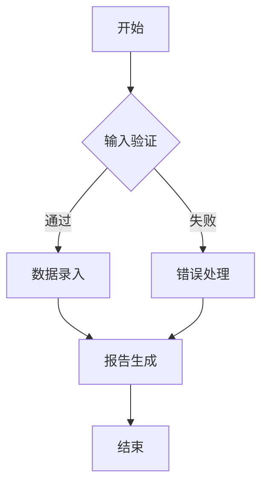

                 

 关键词：机器人流程自动化（RPA）、企业运营效率、流程优化、自动化工具、业务流程管理、人工智能

> 摘要：本文将深入探讨机器人流程自动化（RPA）在企业中的应用，分析其如何通过自动化流程来提升企业运营效率。文章将从背景介绍、核心概念、算法原理、数学模型、项目实践、应用场景、未来展望等多个方面，系统性地阐述RPA在企业发展中的重要性及其面临的挑战。

## 1. 背景介绍

在现代商业环境中，企业面临着日益增长的数据量、复杂的业务流程以及不断变化的市场需求。这些因素共同促使企业寻求提高运营效率的方法。传统的人工操作方式在处理这些挑战时显得力不从心，不仅效率低下，而且容易出现人为错误。因此，自动化成为企业提高运营效率的一种必然选择。

机器人流程自动化（RPA）作为一种新兴技术，逐渐成为企业数字化转型的关键推动力。RPA通过模拟人类操作员的动作，自动化执行重复性高、规则明确的业务流程，从而实现流程的优化和效率的提升。RPA不仅能够减少人力成本，提高处理速度，还能够提高数据处理的准确性。

## 2. 核心概念与联系

### 2.1 RPA的定义

机器人流程自动化（RPA）是指使用软件机器人（通常被称为“数字员工”）来模拟和自动化人类操作员的常规业务流程。这些软件机器人可以与企业的现有系统进行交互，执行诸如数据录入、报告生成、审批流程等任务。

### 2.2 RPA的关键组件

- **流程自动化引擎**：这是RPA系统的核心，负责定义、执行和监控自动化流程。
- **界面自动化工具**：用于捕获和模拟用户操作，例如点击、拖放等，与企业的应用程序和系统进行交互。
- **集成框架**：用于连接和整合不同的系统和应用程序，确保数据在不同系统间的流畅传输。

### 2.3 RPA的工作原理

RPA软件机器人通过以下步骤实现自动化流程：

1. **流程设计**：使用RPA开发工具定义自动化流程的步骤和规则。
2. **流程执行**：软件机器人根据流程设计执行任务，如与系统进行数据交互、执行逻辑判断等。
3. **监控与报告**：实时监控自动化流程的执行情况，并生成报告以供分析和改进。

### 2.4 Mermaid流程图

下面是一个使用Mermaid语言描述的RPA流程图：



在这个流程图中，A表示流程的开始，B表示输入验证步骤，如果验证通过则继续执行数据录入（C），否则进行错误处理（D）。数据录入完成后，流程进入报告生成（E），最终结束（F）。

## 3. 核心算法原理 & 具体操作步骤

### 3.1 算法原理概述

RPA的核心算法原理是模仿人类操作员的动作，通过一系列预定义的步骤和规则来实现自动化。这些步骤和规则可以包括点击、输入、拖放、数据比对等基本操作。

### 3.2 算法步骤详解

1. **流程设计**：使用RPA开发工具（如UiPath、Blue Prism等）创建一个新的流程。
2. **界面捕获**：在开发工具中捕获目标应用程序的界面元素，如按钮、输入框等。
3. **定义动作**：根据业务需求，定义一系列动作，如点击按钮、输入数据、执行条件判断等。
4. **调试与优化**：执行调试，确保自动化流程能够按照预期运行，并进行优化以提高性能。
5. **部署与监控**：将自动化流程部署到生产环境中，并设置监控机制，实时跟踪流程的执行情况。

### 3.3 算法优缺点

**优点**：

- **提高效率**：自动化流程可以大幅减少人工操作的时间，提高处理速度。
- **减少错误**：通过自动化，减少由于人为错误导致的数据处理问题。
- **灵活性与可扩展性**：RPA系统可以根据业务需求灵活调整和扩展。

**缺点**：

- **实施成本**：RPA的实施和部署需要一定的初期投资。
- **依赖现有系统**：RPA依赖于企业的现有系统和应用程序，可能需要额外的集成工作。
- **维护问题**：自动化流程需要定期更新和维护，以适应系统变化。

### 3.4 算法应用领域

RPA可以在多个领域得到广泛应用，包括：

- **财务与会计**：自动化财务报表生成、发票处理、账单支付等。
- **人力资源**：自动化招聘流程、员工信息管理、薪资计算等。
- **客户服务**：自动化客户支持流程、电子邮件响应、社交媒体管理等。
- **供应链管理**：自动化采购订单处理、库存管理、物流跟踪等。

## 4. 数学模型和公式 & 详细讲解 & 举例说明

### 4.1 数学模型构建

RPA的数学模型主要涉及流程执行的时间优化和资源分配。以下是一个简化的数学模型：

$$
\begin{aligned}
\min_{x} & \quad T(x) \\
s.t. & \quad C_j(x) \geq 0, \quad \forall j \in J \\
& \quad A_{ij} x_j \geq b_i, \quad \forall i \in I, \forall j \in J \\
\end{aligned}
$$

其中，$T(x)$表示流程的总执行时间，$x_j$表示第j个任务的执行情况（0或1），$C_j(x)$表示第j个任务的执行成本，$A_{ij}$表示第i个任务的执行时间，$b_i$表示第i个任务的可用时间。

### 4.2 公式推导过程

流程执行时间优化的目标是最小化总执行时间。为了实现这一目标，需要考虑以下因素：

- **任务依赖关系**：某些任务需要在其他任务完成后才能执行。
- **资源限制**：系统资源（如CPU、内存等）的可用性可能限制任务的处理速度。
- **任务优先级**：根据业务需求，某些任务可能具有更高的优先级。

### 4.3 案例分析与讲解

假设一个企业需要完成以下四个任务：

1. 数据收集（时间：2小时）
2. 数据清洗（时间：3小时）
3. 数据分析（时间：4小时）
4. 报告生成（时间：2小时）

任务依赖关系如下：

- 数据收集完成后才能进行数据清洗。
- 数据清洗完成后才能进行数据分析。
- 数据分析完成后才能进行报告生成。

企业希望在8小时内完成所有任务。根据上述数学模型，可以构建以下线性规划问题：

$$
\begin{aligned}
\min_{x} & \quad T(x) = 2x_1 + 3x_2 + 4x_3 + 2x_4 \\
s.t. & \quad x_1 \leq 1 \\
& \quad x_2 \leq x_1 \\
& \quad x_3 \leq x_2 \\
& \quad x_4 \leq x_3 \\
& \quad x_1, x_2, x_3, x_4 \in \{0, 1\}
\end{aligned}
$$

通过求解这个线性规划问题，可以得到最优解$x^* = (1, 1, 1, 1)$，即所有任务都在8小时内完成。

## 5. 项目实践：代码实例和详细解释说明

### 5.1 开发环境搭建

为了演示RPA的应用，我们选择使用UiPath作为开发工具。以下是搭建UiPath开发环境的基本步骤：

1. 下载并安装UiPath Studio，这是一个用于设计RPA流程的集成开发环境。
2. 下载并安装UiPath Robot，这是一个用于执行自动化流程的软件机器人。
3. 使用UiPath Studio创建一个新的项目，并配置所需的连接器和应用程序。

### 5.2 源代码详细实现

以下是一个简单的UiPath流程示例，用于自动登录一个网站并提取特定网页上的数据：

```csharp
// 引入所需的命名空间
using System;
using System.Diagnostics;
using System.Net.Http;
using System.Threading;
using UiPath.Engine;
using UiPath.Activity.HumanInteraction;

// 定义流程入口
public void LoginAndExtractData()
{
    // 启动浏览器
    Process.Start("chrome.exe");

    // 等待浏览器加载完成
    Thread.Sleep(5000);

    // 输入用户名和密码
    ChromeDriver chromeDriver = new ChromeDriver();
    chromeDriver.Navigate("http://example.com/login");
    chromeDriver.FindElementById("username").SendKeys("test_user");
    chromeDriver.FindElementById("password").SendKeys("test_password");
    chromeDriver.FindElementByXPath("//input[@type='submit']").Click();

    // 等待登录成功
    Thread.Sleep(5000);

    // 提取数据
    string data = chromeDriver.FindElementByXPath("//div[@class='data']").Text;

    // 输出提取的数据
    Console.WriteLine("Extracted Data: " + data);

    // 关闭浏览器
    chromeDriver.Quit();
}

// 主函数
public static void Main(string[] args)
{
    LoginAndExtractData();
}
```

### 5.3 代码解读与分析

上述代码演示了一个简单的RPA流程，用于登录一个网站并提取特定网页上的数据。以下是代码的主要部分及其解读：

- **浏览器启动**：使用`Process.Start("chrome.exe")`启动Chrome浏览器。
- **等待浏览器加载**：使用`Thread.Sleep(5000)`等待5秒钟，以确保浏览器加载完成。
- **登录网站**：使用`ChromeDriver chromeDriver = new ChromeDriver();`创建一个新的ChromeDriver对象，并使用该对象导航到登录页面、输入用户名和密码、点击登录按钮。
- **提取数据**：登录成功后，使用`chromeDriver.FindElementByXPath("//div[@class='data']").Text`提取特定网页上的数据。
- **输出数据**：使用`Console.WriteLine("Extracted Data: " + data)`将提取的数据输出到控制台。
- **关闭浏览器**：使用`chromeDriver.Quit()`关闭浏览器。

### 5.4 运行结果展示

运行上述代码后，RPA流程将启动Chrome浏览器、登录到指定网站、提取指定数据，并将结果输出到控制台。

## 6. 实际应用场景

### 6.1 财务与会计

RPA在财务与会计领域的应用非常广泛。例如，自动化财务报表生成、发票处理、账单支付等流程，可以大幅提高处理速度和准确性。RPA还可以与财务系统进行集成，实现数据自动传输和校验，减少人为错误。

### 6.2 客户服务

在客户服务领域，RPA可以自动化处理大量的客户查询和投诉。例如，RPA机器人可以自动回复常见问题、处理订单查询、管理客户反馈等。这不仅可以提高响应速度，还可以降低人工成本。

### 6.3 人力资源

RPA在人力资源领域的应用包括自动化招聘流程、员工信息管理、薪资计算等。RPA机器人可以快速筛选简历、管理员工档案、计算薪资，提高人力资源管理的效率和准确性。

### 6.4 供应链管理

在供应链管理中，RPA可以自动化处理采购订单、库存管理、物流跟踪等流程。RPA机器人可以实时监控库存水平、自动生成采购订单、优化物流路线，提高供应链的整体效率。

## 7. 工具和资源推荐

### 7.1 学习资源推荐

- **UiPath官方文档**：[https://www.uipath.com/documentation](https://www.uipath.com/documentation)
- **Blue Prism官方文档**：[https://www.blueprism.com/docs](https://www.blueprism.com/docs)
- **RPA社区**：[https://www.rpa.com](https://www.rpa.com)

### 7.2 开发工具推荐

- **UiPath Studio**：适用于流程设计、自动化测试和机器人开发。
- **Blue Prism Designer**：适用于高级用户和开发人员，提供强大的流程自动化工具。
- **Automation Anywhere**：适用于各种自动化任务，包括数据采集、报告生成和客户服务。

### 7.3 相关论文推荐

- **"Robotic Process Automation: An Overview of Current Technology and Applications"**：该论文概述了RPA的技术原理和应用场景。
- **"The Impact of Robotic Process Automation on Workforce Productivity and Employee Well-being"**：该论文研究了RPA对企业生产力和员工福祉的影响。
- **"A Survey on Robotic Process Automation: Challenges, Opportunities, and Future Directions"**：该论文分析了RPA面临的挑战、机会和未来发展趋势。

## 8. 总结：未来发展趋势与挑战

### 8.1 研究成果总结

本文系统地介绍了机器人流程自动化（RPA）在企业中的应用，分析了其核心概念、算法原理、数学模型、项目实践和实际应用场景。RPA通过自动化重复性高、规则明确的业务流程，显著提高了企业的运营效率。

### 8.2 未来发展趋势

随着人工智能和云计算技术的不断发展，RPA将更加智能化和灵活。未来，RPA有望实现以下发展趋势：

- **智能化**：RPA机器人将具备更高级的智能能力，如自然语言处理、图像识别等，实现更复杂的自动化任务。
- **流程优化**：RPA将集成更多的业务分析工具，帮助企业实现更深入的流程优化。
- **跨平台集成**：RPA将更好地与各种业务系统和应用程序集成，实现跨平台自动化。

### 8.3 面临的挑战

尽管RPA具有巨大的潜力，但其发展仍面临一些挑战：

- **技术瓶颈**：RPA在处理复杂业务流程时可能面临技术瓶颈，需要不断优化和升级。
- **安全与隐私**：随着RPA的普及，如何确保数据安全和隐私成为重要问题。
- **人才短缺**：RPA的实施和运维需要专业人才，但市场上相关人才相对短缺。

### 8.4 研究展望

未来，RPA的研究应重点关注以下几个方面：

- **智能化**：提高RPA机器人的智能水平，实现更高级的自动化。
- **安全性与合规性**：确保RPA系统的安全性和合规性，保护企业和客户的数据。
- **生态系统建设**：构建完善的RPA生态系统，促进技术创新和产业发展。

## 9. 附录：常见问题与解答

### Q1. RPA与人工智能（AI）有什么区别？

A1. RPA主要关注业务流程的自动化，通过模拟人类操作员的动作实现重复性任务的处理。而AI则是一种模拟人类智能的技术，能够通过学习和推理来执行复杂的任务。RPA和AI可以协同工作，RPA负责执行规则的自动化，AI则负责处理不确定性和复杂任务。

### Q2. RPA能解决哪些业务问题？

A2. RPA可以解决各种业务流程中的重复性高、规则明确的问题，如数据录入、报告生成、审批流程等。通过RPA，企业可以减少人工操作、提高处理速度、降低错误率，从而提升整体运营效率。

### Q3. RPA实施需要哪些步骤？

A3. RPA的实施主要包括以下步骤：

1. 需求分析：确定需要自动化的业务流程和任务。
2. 流程设计：使用RPA开发工具设计自动化流程。
3. 开发与测试：编写和测试自动化脚本，确保流程按照预期运行。
4. 部署与监控：将自动化流程部署到生产环境中，并设置监控机制。

### Q4. RPA有哪些潜在风险？

A4. RPA的潜在风险包括：

- **数据安全**：自动化流程可能暴露企业的敏感数据，需要加强安全措施。
- **系统稳定性**：自动化流程可能对现有系统造成冲击，影响系统的稳定性。
- **人才短缺**：RPA的实施和运维需要专业人才，但市场上相关人才相对短缺。

### Q5. 如何评估RPA的投资回报率（ROI）？

A5. 评估RPA的投资回报率可以从以下几个方面考虑：

- **成本节约**：计算自动化流程带来的成本节约，如人力成本、错误成本等。
- **效率提升**：评估自动化流程提高的效率，如处理速度、准确率等。
- **业务收益**：分析自动化流程对业务收益的提升，如订单量增加、客户满意度提高等。

通过综合考虑这些因素，可以评估RPA的投资回报率。

---

以上是对RPA在企业中的应用进行深入探讨的完整文章。文章涵盖了RPA的核心概念、算法原理、数学模型、项目实践、实际应用场景、未来展望和常见问题与解答等内容，旨在为读者提供全面而深入的RPA应用指南。作者：禅与计算机程序设计艺术 / Zen and the Art of Computer Programming。

