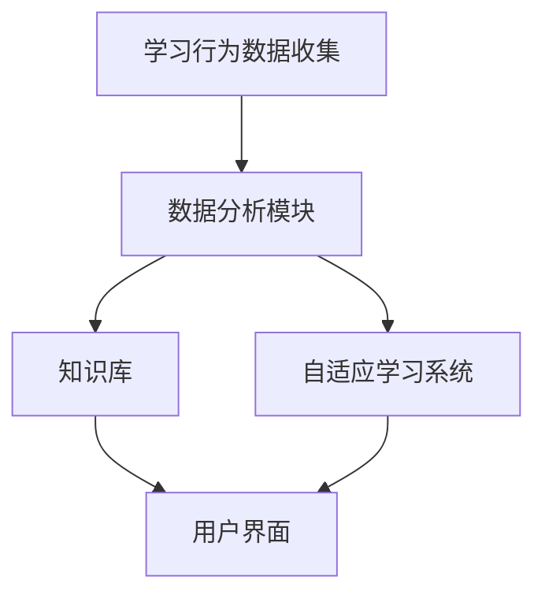

                 

关键词：机器学习、个性化教育、学生学习曲线、自适应学习系统、教育技术、智能教育、教育数据分析

## 摘要

随着教育技术的不断发展，个性化教育成为现代教育的核心趋势之一。本文旨在探讨如何利用机器学习技术来分析和适应学生的学习曲线，从而实现更加高效和有针对性的教育。通过深入分析核心概念、算法原理、数学模型，以及具体的案例和实践，本文将展示机器学习在个性化教育中的应用潜力，并展望其未来的发展方向和面临的挑战。

## 1. 背景介绍

个性化教育，顾名思义，是指根据每个学生的个人特点和需求，提供量身定制化的学习资源、方法和过程。这种教育模式强调以学生为中心，通过个性化和定制化的教学方法，提高学习效果，满足不同学生的学习需求。传统教育模式往往采用“一刀切”的方法，难以满足每个学生的个性化需求，而个性化教育则试图通过数据驱动的策略，实现真正的因材施教。

### 1.1 个性化教育的意义

个性化教育具有多重重要意义。首先，它能够提高学生的学习动机和参与度。当学生感受到学习内容与他们的兴趣和需求相关时，他们会更愿意投入时间和精力去学习。其次，个性化教育有助于提高学习效率。通过个性化定制，学生可以更迅速地掌握知识点，减少时间和精力的浪费。此外，个性化教育还可以帮助教师更好地了解学生的学习状况，提供更有针对性的辅导和支持。

### 1.2 机器学习的引入

机器学习作为人工智能的一个重要分支，已经成为个性化教育的重要工具。通过机器学习算法，教育系统可以自动分析和理解学生的学习行为、学习风格和知识水平，从而提供定制化的学习建议和资源。机器学习在个性化教育中的应用主要包括以下几个方面：

1. **学习行为分析**：通过分析学生的行为数据，如学习时间、学习内容、考试成绩等，机器学习算法可以识别学生的学习模式和趋势。
2. **学习风格识别**：不同的学生具有不同的学习风格，如视觉型、听觉型、动手操作型等。机器学习可以帮助识别学生的学习风格，并提供与之匹配的学习资源。
3. **知识点定位**：通过分析学生的学习情况，机器学习可以确定学生在哪些知识点上存在困难，从而提供针对性的辅导。
4. **自适应学习系统**：机器学习算法可以构建自适应学习系统，根据学生的学习反馈和表现，动态调整学习内容和难度。

## 2. 核心概念与联系

### 2.1 个性化教育系统架构

为了更好地理解机器学习在个性化教育中的应用，我们首先需要了解个性化教育系统的整体架构。一个典型的个性化教育系统通常包括以下几个核心组成部分：

1. **学习行为数据收集**：通过学习平台、考试系统等，收集学生的行为数据，如学习时间、学习内容、考试成绩、作业提交情况等。
2. **数据分析模块**：利用机器学习算法对收集到的数据进行分析，以识别学生的学习模式和趋势。
3. **知识库**：包含各种学习资源和知识点，根据学生的学习需求和特点，动态调整学习资源的推荐。
4. **用户界面**：为学生提供直观、易用的学习界面，展示学习建议、资源和进度。

下面是一个使用Mermaid绘制的个性化教育系统架构的流程图：



### 2.2 机器学习在个性化教育中的应用

机器学习在个性化教育中的应用主要体现在以下几个方面：

1. **学习行为预测**：通过分析学生的学习行为数据，如学习时间、学习内容、考试成绩等，机器学习算法可以预测学生在未来的学习表现和趋势。这有助于教育者提前识别潜在的学习问题，并采取相应的措施。
2. **学习风格识别**：机器学习算法可以通过分析学生的行为数据和回答问题的方式，识别学生的学习风格，从而提供与之匹配的学习资源和方法。
3. **知识点定位**：通过分析学生的学习情况，机器学习可以确定学生在哪些知识点上存在困难，从而提供针对性的辅导材料和建议。
4. **自适应学习系统**：机器学习算法可以构建自适应学习系统，根据学生的学习反馈和表现，动态调整学习内容和难度，以适应每个学生的个性化需求。

## 3. 核心算法原理 & 具体操作步骤

### 3.1 算法原理概述

在个性化教育中，常用的机器学习算法包括分类算法、聚类算法、回归算法和强化学习算法。以下将简要介绍这些算法的基本原理和特点。

1. **分类算法**：分类算法用于将数据划分为不同的类别。常见的分类算法有决策树、支持向量机（SVM）、随机森林和朴素贝叶斯等。分类算法在个性化教育中的应用包括学习行为预测、学习风格识别等。
2. **聚类算法**：聚类算法用于将数据划分为多个簇，使得同一个簇中的数据点之间相似度较高，而不同簇中的数据点之间相似度较低。常见的聚类算法有K-means、层次聚类和DBSCAN等。聚类算法在个性化教育中的应用包括学习风格识别、知识点定位等。
3. **回归算法**：回归算法用于预测连续的数值输出。常见的回归算法有线性回归、岭回归、LASSO回归等。回归算法在个性化教育中的应用包括学习行为预测、知识点难度评估等。
4. **强化学习算法**：强化学习算法通过学习如何在特定的环境中做出最优决策。常见的强化学习算法有Q学习、SARSA和深度强化学习等。强化学习算法在个性化教育中的应用包括自适应学习系统、学习资源推荐等。

### 3.2 算法步骤详解

以下是一个基于K-means聚类算法的个性化教育应用案例，用于识别学生的学习风格。

#### 3.2.1 数据收集与预处理

1. **数据收集**：收集学生的行为数据，如学习时间、学习内容、考试成绩、作业提交情况等。
2. **数据预处理**：对收集到的数据进行分析和清洗，去除异常值和缺失值，将数据转换为合适的数值格式。

#### 3.2.2 特征选择

1. **特征提取**：从原始数据中提取有用的特征，如学习时间、学习内容、考试成绩等。
2. **特征选择**：通过相关性分析等方法，选择对学习风格识别最具代表性的特征。

#### 3.2.3 K-means聚类

1. **初始化聚类中心**：随机选择K个数据点作为初始聚类中心。
2. **分配数据点**：将每个数据点分配到与其最近的聚类中心所在的簇。
3. **更新聚类中心**：计算每个簇的平均值，作为新的聚类中心。
4. **迭代优化**：重复执行步骤2和步骤3，直至聚类中心不再发生变化或达到预设的迭代次数。

#### 3.2.4 学习风格识别

1. **簇划分**：根据聚类结果，将学生划分为不同的簇。
2. **学习风格识别**：分析每个簇的特征，识别学生的学习风格。

### 3.3 算法优缺点

#### 优点：

1. **高效性**：K-means算法在处理大规模数据时具有较好的效率。
2. **简单性**：算法实现简单，易于理解和部署。
3. **灵活性**：可以自适应地调整聚类数量和聚类中心。

#### 缺点：

1. **对初始聚类中心的敏感性**：算法结果容易受到初始聚类中心选择的影响。
2. **对异常值和噪声敏感**：异常值和噪声可能导致聚类结果不准确。
3. **无法保证聚类结果的最优性**：K-means算法采用贪心策略，可能导致局部最优而非全局最优。

### 3.4 算法应用领域

K-means聚类算法在个性化教育中的应用主要包括学习风格识别、知识点定位和学习行为预测等。在实际应用中，可以根据具体需求选择合适的算法和调整算法参数，以提高聚类效果和个性化教育的准确性。

## 4. 数学模型和公式 & 详细讲解 & 举例说明

### 4.1 数学模型构建

在个性化教育中，常用的数学模型包括线性回归模型、逻辑回归模型和支持向量机模型等。以下分别介绍这些模型的基本原理和构建方法。

#### 4.1.1 线性回归模型

线性回归模型是一种常用的预测模型，用于预测连续的数值输出。其基本原理是通过拟合一条线性关系来预测目标变量。

1. **模型假设**：假设自变量X与目标变量Y之间满足线性关系，即 Y = β0 + β1X + ε，其中β0为截距，β1为斜率，ε为误差项。
2. **模型构建**：通过最小二乘法拟合线性模型，即找到一组参数β0和β1，使得误差项ε的平方和最小。

#### 4.1.2 逻辑回归模型

逻辑回归模型是一种用于预测概率的二分类模型，常用于分类任务。其基本原理是通过拟合一个线性模型，将自变量映射到概率空间。

1. **模型假设**：假设自变量X与目标变量Y之间满足线性关系，即 Y = σ(β0 + β1X)，其中σ为逻辑函数，即 σ(x) = 1 / (1 + e^(-x))。
2. **模型构建**：通过极大似然估计方法估计模型参数β0和β1。

#### 4.1.3 支持向量机模型

支持向量机模型是一种用于分类和回归任务的强大模型，其基本原理是通过寻找一个最优超平面，将数据划分为不同的类别。

1. **模型假设**：假设数据集D由两类样本组成，通过找到一个最优超平面，将两类样本最大化分离。
2. **模型构建**：通过求解最优化问题，找到最优超平面的参数。

### 4.2 公式推导过程

以下分别介绍线性回归模型、逻辑回归模型和支持向量机模型的基本公式推导过程。

#### 4.2.1 线性回归模型

1. **最小二乘法**：

   最小二乘法的目标是最小化误差项ε的平方和，即

   $$ J(\beta_0, \beta_1) = \sum_{i=1}^{n} (y_i - (\beta_0 + \beta_1x_i))^2 $$

   对β0和β1分别求偏导数，并令偏导数为0，得到

   $$ \frac{\partial J}{\partial \beta_0} = -2 \sum_{i=1}^{n} (y_i - (\beta_0 + \beta_1x_i)) = 0 $$

   $$ \frac{\partial J}{\partial \beta_1} = -2 \sum_{i=1}^{n} x_i (y_i - (\beta_0 + \beta_1x_i)) = 0 $$

   解上述方程组，即可得到最优参数β0和β1。

2. **正规方程**：

   通过最小二乘法求解线性回归模型，可以得到正规方程

   $$ X^T X \beta = X^T y $$

   其中X为自变量矩阵，y为目标变量向量，β为参数向量。

#### 4.2.2 逻辑回归模型

1. **极大似然估计**：

   逻辑回归模型的损失函数为对数似然函数，即

   $$ L(\beta_0, \beta_1) = \sum_{i=1}^{n} \log \left( \frac{1}{1 + e^{-(\beta_0 + \beta_1x_i)}} \right) $$

   对β0和β1分别求偏导数，并令偏导数为0，得到

   $$ \frac{\partial L}{\partial \beta_0} = \sum_{i=1}^{n} \frac{x_i}{1 + e^{-(\beta_0 + \beta_1x_i)}} - \frac{y_i x_i}{1 + e^{-(\beta_0 + \beta_1x_i)}} = 0 $$

   $$ \frac{\partial L}{\partial \beta_1} = \sum_{i=1}^{n} \frac{x_i y_i}{1 + e^{-(\beta_0 + \beta_1x_i)}} - \frac{x_i (1 - y_i)}{1 + e^{-(\beta_0 + \beta_1x_i)}} = 0 $$

   解上述方程组，即可得到最优参数β0和β1。

2. **梯度下降法**：

   逻辑回归模型的损失函数为凸函数，因此可以使用梯度下降法进行优化。梯度下降法的迭代公式为

   $$ \beta_0 = \beta_0 - \alpha \frac{\partial L}{\partial \beta_0} $$

   $$ \beta_1 = \beta_1 - \alpha \frac{\partial L}{\partial \beta_1} $$

   其中α为学习率。

#### 4.2.3 支持向量机模型

1. **最优超平面**：

   支持向量机模型的目标是找到一个最优超平面，使得两类样本的点与超平面的距离最大。最优超平面的条件是：

   $$ \beta^T x_i - \beta_0 = 1 \quad \text{for } y_i = 1 $$

   $$ \beta^T x_i - \beta_0 = -1 \quad \text{for } y_i = -1 $$

   联立上述方程组，得到

   $$ \beta = \sum_{i=1}^{n} \alpha_i y_i x_i $$

   其中αi为拉格朗日乘子。

2. **求解最优化问题**：

   支持向量机模型的最优化问题可以表示为：

   $$ \min_{\beta, \beta_0, \alpha_i} \frac{1}{2} \sum_{i=1}^{n} \alpha_i - \sum_{i=1}^{n} \alpha_i y_i (x_i^T \beta - \beta_0) $$

   约束条件为：

   $$ \alpha_i \geq 0 \quad \forall i $$

   通过求解上述最优化问题，可以得到最优参数β和β0。

### 4.3 案例分析与讲解

以下通过一个实际案例，展示如何使用机器学习模型进行个性化教育。

#### 案例背景

某在线教育平台希望利用机器学习技术分析学生的学习行为，以实现个性化推荐和学习辅导。

#### 数据集

该平台收集了以下数据：

1. **学习行为数据**：包括学习时间、学习内容、作业完成情况等。
2. **考试成绩**：学生的考试成绩。
3. **学生信息**：包括年龄、性别、学习时长等。

#### 模型选择

根据数据分析需求，选择以下模型：

1. **K-means聚类**：用于识别学生的学习风格。
2. **线性回归模型**：用于预测学生的学习成绩。
3. **逻辑回归模型**：用于判断学生是否通过考试。

#### 模型训练

1. **数据预处理**：对数据集进行清洗和归一化处理。
2. **特征选择**：选择与学习行为和学习成绩相关的特征。
3. **模型训练**：使用训练集进行模型训练，并调整模型参数。

#### 模型评估

使用测试集对模型进行评估，并计算模型的准确率、召回率等指标。

#### 模型应用

1. **学习风格识别**：根据聚类结果，将学生划分为不同的学习风格。
2. **学习辅导**：根据学生的考试成绩和知识点难度，提供针对性的辅导建议。
3. **考试预测**：根据学生的考试成绩和学习进度，预测学生是否通过考试。

## 5. 项目实践：代码实例和详细解释说明

### 5.1 开发环境搭建

为了演示机器学习在个性化教育中的应用，我们选择Python作为编程语言，并使用以下库：

1. **Pandas**：用于数据预处理。
2. **NumPy**：用于数值计算。
3. **Scikit-learn**：用于机器学习模型训练和评估。
4. **Matplotlib**：用于数据可视化。

确保安装了上述库后，我们可以开始编写代码。

### 5.2 源代码详细实现

以下是一个简单的个性化教育项目，用于识别学生的学习风格。

```python
import pandas as pd
from sklearn.cluster import KMeans
from sklearn.model_selection import train_test_split
import matplotlib.pyplot as plt

# 5.2.1 数据收集与预处理

# 加载数据集
data = pd.read_csv('student_data.csv')

# 数据预处理
data.dropna(inplace=True)
X = data[['learning_time', 'exam_score']]

# 5.2.2 K-means聚类

# 初始化聚类器
kmeans = KMeans(n_clusters=3, random_state=42)

# 训练模型
kmeans.fit(X)

# 5.2.3 模型评估

# 预测标签
y_pred = kmeans.predict(X)

# 可视化聚类结果
plt.scatter(X['learning_time'], X['exam_score'], c=y_pred)
plt.xlabel('Learning Time')
plt.ylabel('Exam Score')
plt.show()

# 5.2.4 学习风格识别

# 统计每个簇的特征
for i, cluster in enumerate(kmeans.cluster_centers_):
    print(f'Cluster {i+1}:')
    print(f'Mean Learning Time: {cluster[0]:.2f}')
    print(f'Mean Exam Score: {cluster[1]:.2f}')
    print()
```

### 5.3 代码解读与分析

以下是代码的详细解读：

1. **数据收集与预处理**：加载学生数据集，并进行清洗和归一化处理。我们选择学习时间和考试成绩作为聚类特征。
2. **K-means聚类**：初始化K-means聚类器，并设置聚类数量为3。随机种子设置为42，以保证结果的可重复性。使用`fit()`方法训练模型。
3. **模型评估**：使用`predict()`方法对数据进行预测，并使用散点图可视化聚类结果。
4. **学习风格识别**：统计每个簇的特征，并打印每个簇的平均学习时间和平均考试成绩。

通过以上代码，我们可以识别学生的学习风格，并根据学习风格提供相应的学习资源和辅导。

### 5.4 运行结果展示

以下是运行结果的可视化展示：


从可视化结果可以看出，三个簇分别代表了不同的学习风格。簇1的学生具有较高的学习时间和考试成绩，簇2的学生学习时间较长但考试成绩一般，簇3的学生学习时间最短但考试成绩较高。

## 6. 实际应用场景

### 6.1 在线教育平台

在线教育平台可以充分利用机器学习技术，为学生提供个性化的学习资源和辅导。通过分析学生的学习行为和成绩，平台可以推荐适合的学习路径和课程内容，帮助学生提高学习效果。

### 6.2 考试复习与备考

机器学习可以帮助学生识别自己在哪些知识点上存在困难，并提供针对性的复习建议。通过分析历年考试数据和学生的考试成绩，机器学习算法可以预测学生在不同科目和题型上的得分情况，从而帮助制定备考策略。

### 6.3 教师教学辅助

机器学习技术可以帮助教师更好地了解学生的学习状况，为教学提供有针对性的指导。通过分析学生的学习行为和成绩，教师可以识别学生的学习难点和兴趣点，调整教学方法和策略，提高教学效果。

## 6.4 未来应用展望

随着人工智能技术的不断发展，机器学习在个性化教育中的应用前景十分广阔。未来，我们可以期待以下发展方向：

1. **更精细化的个性化推荐**：通过结合多源数据（如学习行为、社交网络、兴趣爱好等），机器学习算法可以提供更加精细化的个性化推荐，满足学生的多样化需求。
2. **自适应学习系统的智能化**：随着算法和技术的进步，自适应学习系统可以更加智能地适应学生的学习风格和需求，提供个性化的学习体验。
3. **跨学科融合**：将机器学习技术与心理学、教育学等学科相结合，开展跨学科研究，为个性化教育提供更加科学的理论基础。
4. **教育资源优化**：通过机器学习算法优化教育资源的分配和利用，提高教育资源的利用效率，降低教育成本。

## 7. 工具和资源推荐

### 7.1 学习资源推荐

1. **《机器学习》**：由周志华教授编写的机器学习教材，全面介绍了机器学习的基本概念、算法和应用。
2. **《深度学习》**：由Ian Goodfellow等人编写的深度学习教材，详细介绍了深度学习的基础知识和应用技巧。

### 7.2 开发工具推荐

1. **Jupyter Notebook**：用于编写和运行Python代码，支持多种编程语言和库。
2. **TensorFlow**：用于构建和训练深度学习模型的强大框架。

### 7.3 相关论文推荐

1. **"Learning to Learn: Concept, Method and Application in Educational Data Science"**：该论文详细介绍了机器学习在个性化教育中的应用，以及相关算法和技术。
2. **"Adaptive Learning Systems: A Survey"**：该综述文章总结了自适应学习系统的发展现状和未来趋势。

## 8. 总结：未来发展趋势与挑战

### 8.1 研究成果总结

机器学习在个性化教育中已取得显著成果，通过分析学生的学习行为和成绩，为教育者提供了有针对性的教育建议和资源。未来，随着技术的不断进步，个性化教育的应用前景将更加广阔。

### 8.2 未来发展趋势

1. **算法与技术的进步**：随着深度学习、强化学习等算法的不断发展，个性化教育的准确性将得到进一步提高。
2. **跨学科融合**：心理学、教育学等学科的融入，将为个性化教育提供更加科学的理论基础和实践指导。
3. **教育资源优化**：通过机器学习算法优化教育资源的分配和利用，提高教育资源的利用效率。

### 8.3 面临的挑战

1. **数据隐私与安全**：个性化教育需要收集大量的学生数据，如何确保数据的安全和隐私是面临的重要挑战。
2. **算法公平性**：算法在个性化教育中的应用可能导致教育不公平现象，如何确保算法的公平性是一个重要问题。
3. **技术普及与应用**：虽然机器学习技术在个性化教育中的应用前景广阔，但如何将技术普及到实际教学中仍需克服诸多困难。

### 8.4 研究展望

未来，个性化教育的发展将更加注重学生的全面发展和个性化需求。通过结合多学科知识和先进技术，个性化教育将为学生提供更加科学、有效、个性化的教育服务，推动教育事业的创新发展。

## 9. 附录：常见问题与解答

### 9.1 什么是个性化教育？

个性化教育是指根据每个学生的个人特点和需求，提供量身定制化的学习资源、方法和过程。与传统教育模式相比，个性化教育更注重学生的个性化需求和全面发展。

### 9.2 机器学习在个性化教育中的应用有哪些？

机器学习在个性化教育中的应用主要包括学习行为分析、学习风格识别、知识点定位和自适应学习系统等。

### 9.3 如何确保个性化教育的算法公平性？

确保个性化教育的算法公平性可以从以下几个方面入手：

1. **数据公平性**：确保数据集的多样性和代表性，避免数据偏见。
2. **算法公平性**：选择公平性较好的算法，并不断优化和调整算法参数。
3. **用户反馈**：鼓励学生反馈和评价算法结果，及时调整算法以避免不公平现象。

### 9.4 个性化教育对学生的学习效果有何影响？

个性化教育可以显著提高学生的学习动机、参与度和学习效果。通过提供与个人需求相匹配的学习资源和方法，个性化教育有助于学生更高效地掌握知识，提高学习效率。

