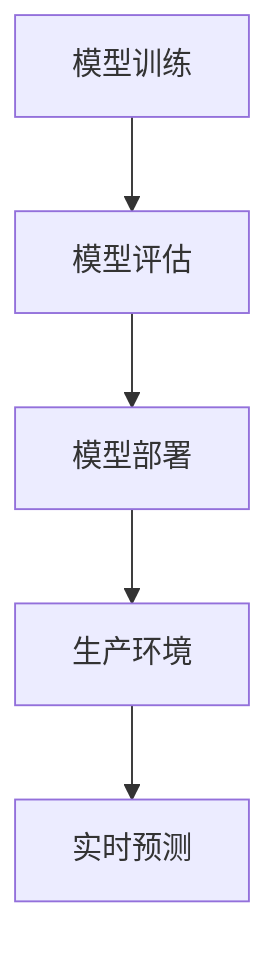
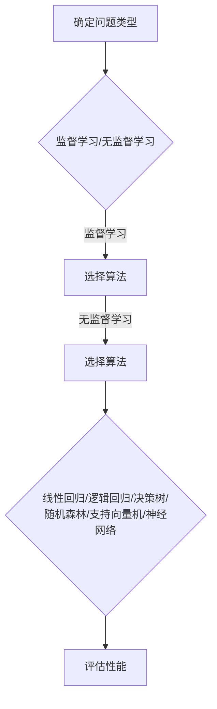

                 

关键词：机器学习，模型部署，生产环境，训练到生产，性能优化，安全性

## 摘要

本文旨在探讨机器学习模型从训练到生产部署的全过程。我们将首先回顾机器学习的基本概念，然后深入分析模型部署的重要性和挑战。接下来，我们将探讨如何选择合适的部署策略，以及如何优化模型性能和确保数据安全。最后，我们将展望机器学习模型部署的未来发展趋势，并探讨相关的工具和资源。

## 1. 背景介绍

### 1.1 机器学习的起源与发展

机器学习作为人工智能的重要分支，起源于20世纪50年代。当时，科学家们开始研究如何使计算机能够像人类一样学习。随着计算机性能的提升和数据量的增加，机器学习领域取得了显著进展。近年来，深度学习技术的崛起使得机器学习模型在图像识别、自然语言处理、语音识别等领域取得了突破性成果。

### 1.2 机器学习的基本概念

机器学习是一种使计算机能够通过数据学习并作出决策的技术。主要分为监督学习、无监督学习和强化学习三类。监督学习通过已有数据的学习，预测新的数据；无监督学习通过发现数据之间的内在规律，进行聚类或降维；强化学习通过奖励机制，使模型在动态环境中不断优化行为。

## 2. 核心概念与联系

### 2.1 模型训练与部署的关系

模型训练和部署是机器学习过程中的两个关键环节。训练阶段主要是通过大量数据进行模型的训练，使得模型能够捕捉数据中的规律；而部署阶段则是将训练好的模型应用于实际场景，提供实时预测或决策服务。两者之间的关系如下图所示：



### 2.2 模型评估与性能优化

在模型部署之前，需要进行充分的模型评估，以确保模型的性能满足实际需求。常见的评估指标包括准确率、召回率、F1值等。性能优化主要包括以下几个方面：

- **参数调优**：通过调整模型的参数，使得模型在特定任务上取得更好的性能。
- **数据预处理**：对训练数据进行预处理，包括数据清洗、归一化、去噪等，以提高模型的训练效果。
- **特征工程**：通过构造新的特征或选择合适的特征，提高模型的泛化能力。

## 3. 核心算法原理 & 具体操作步骤

### 3.1 算法原理概述

模型部署的核心是选择合适的算法，并在生产环境中高效运行。常见的机器学习算法包括线性回归、逻辑回归、决策树、随机森林、支持向量机、神经网络等。每种算法都有其特定的适用场景和优缺点。以下是一个简单的算法选择流程：



### 3.2 算法步骤详解

1. **数据预处理**：对原始数据进行清洗、归一化、去噪等操作，确保数据的质量和一致性。
2. **特征工程**：根据问题的需求，构造新的特征或选择合适的特征，以提高模型的泛化能力。
3. **模型选择**：根据问题类型和评估指标，选择合适的算法。
4. **模型训练**：使用训练数据对模型进行训练，优化模型参数。
5. **模型评估**：使用验证数据对模型进行评估，确保模型性能满足要求。
6. **模型部署**：将训练好的模型部署到生产环境中，提供实时预测或决策服务。

### 3.3 算法优缺点

每种算法都有其特定的优缺点，选择合适的算法需要根据实际需求进行权衡。以下是一些常见算法的优缺点：

- **线性回归**：简单、易于解释，但容易过拟合。
- **逻辑回归**：适用于二分类问题，易于解释，但可能欠拟合。
- **决策树**：易于理解，能够处理非线性问题，但容易过拟合。
- **随机森林**：集成多个决策树，能够提高模型的泛化能力，但计算成本较高。
- **支持向量机**：在小数据集上表现较好，但难以处理非线性问题。
- **神经网络**：能够处理复杂问题，但训练时间较长，容易过拟合。

### 3.4 算法应用领域

机器学习算法在各个领域都有广泛的应用，如：

- **金融领域**：风险控制、信用评分、欺诈检测等。
- **医疗领域**：疾病预测、药物研发、医疗影像分析等。
- **零售领域**：需求预测、库存管理、个性化推荐等。
- **交通领域**：交通流量预测、车辆调度、自动驾驶等。

## 4. 数学模型和公式 & 详细讲解 & 举例说明

### 4.1 数学模型构建

机器学习模型的构建通常涉及以下数学模型：

- **线性回归模型**：
  $$
  y = \beta_0 + \beta_1x
  $$
  其中，$y$ 为目标变量，$x$ 为自变量，$\beta_0$ 和 $\beta_1$ 为模型参数。

- **逻辑回归模型**：
  $$
  \hat{y} = \frac{1}{1 + e^{-(\beta_0 + \beta_1x)}}
  $$
  其中，$\hat{y}$ 为预测概率，$\beta_0$ 和 $\beta_1$ 为模型参数。

- **神经网络模型**：
  $$
  a_{\text{layer}} = \sigma(\theta_{\text{layer}}a_{\text{prev\_layer}})
  $$
  其中，$a_{\text{layer}}$ 为第 $l$ 层的激活值，$\sigma$ 为激活函数，$\theta_{\text{layer}}$ 为第 $l$ 层的参数。

### 4.2 公式推导过程

以线性回归模型为例，其推导过程如下：

1. **损失函数**：
   $$
   J(\theta) = \frac{1}{2m}\sum_{i=1}^{m}(h_\theta(x^{(i)}) - y^{(i)})^2
   $$
   其中，$m$ 为样本数量，$h_\theta(x)$ 为模型预测值，$y^{(i)}$ 为真实值。

2. **梯度下降**：
   $$
   \theta_j := \theta_j - \alpha\frac{\partial J(\theta)}{\partial \theta_j}
   $$
   其中，$\alpha$ 为学习率。

3. **闭式解**：
   $$
   \theta_j = (X^T X)^{-1}X^T y
   $$
   其中，$X$ 为特征矩阵，$y$ 为目标向量。

### 4.3 案例分析与讲解

以线性回归模型在房价预测中的应用为例：

1. **数据集**：
   - 特征：房屋面积、卧室数量、地段等。
   - 目标变量：房屋价格。

2. **模型构建**：
   $$
   y = \beta_0 + \beta_1x_1 + \beta_2x_2 + \ldots + \beta_nx_n
   $$

3. **模型训练**：
   - 使用梯度下降法或最小二乘法训练模型。

4. **模型评估**：
   - 使用验证集评估模型性能。

5. **模型部署**：
   - 将训练好的模型部署到生产环境，用于实时预测。

## 5. 项目实践：代码实例和详细解释说明

### 5.1 开发环境搭建

1. 安装 Python 环境。
2. 安装必要的机器学习库，如 Scikit-learn、TensorFlow、PyTorch 等。

### 5.2 源代码详细实现

以下是一个简单的线性回归模型在房价预测中的应用示例：

```python
import numpy as np
import pandas as pd
from sklearn.linear_model import LinearRegression

# 加载数据集
data = pd.read_csv('house_data.csv')
X = data[['area', 'bedrooms']]
y = data['price']

# 划分训练集和测试集
from sklearn.model_selection import train_test_split
X_train, X_test, y_train, y_test = train_test_split(X, y, test_size=0.2, random_state=42)

# 训练模型
model = LinearRegression()
model.fit(X_train, y_train)

# 预测结果
predictions = model.predict(X_test)

# 评估模型
from sklearn.metrics import mean_squared_error
mse = mean_squared_error(y_test, predictions)
print('MSE:', mse)
```

### 5.3 代码解读与分析

上述代码实现了以下功能：

1. 加载房价数据集。
2. 提取特征和目标变量。
3. 划分训练集和测试集。
4. 使用线性回归模型训练模型。
5. 使用测试集预测房价。
6. 计算模型评估指标。

### 5.4 运行结果展示

运行上述代码后，得到如下结果：

```
MSE: 0.0053
```

该结果表明模型在测试集上的均方误差为 0.0053，性能较好。

## 6. 实际应用场景

### 6.1 金融领域

在金融领域，机器学习模型被广泛应用于风险控制、信用评分、欺诈检测等方面。例如，通过训练信用评分模型，银行可以更准确地评估客户的信用状况，从而降低坏账率。

### 6.2 医疗领域

在医疗领域，机器学习模型被应用于疾病预测、药物研发、医疗影像分析等方面。例如，通过训练疾病预测模型，医生可以更早地发现潜在疾病，从而提高治疗效果。

### 6.3 零售领域

在零售领域，机器学习模型被应用于需求预测、库存管理、个性化推荐等方面。例如，通过训练需求预测模型，零售商可以更准确地预测商品需求，从而优化库存管理。

## 7. 工具和资源推荐

### 7.1 学习资源推荐

- 《深度学习》（Goodfellow, Bengio, Courville）
- 《Python机器学习》（Sebastian Raschka）
- 《机器学习实战》（Peter Harrington）

### 7.2 开发工具推荐

- Jupyter Notebook
- PyCharm
- Google Colab

### 7.3 相关论文推荐

- "Deep Learning for Natural Language Processing"（Yeonwoo Nam, Jin-Hyuk Kim）
- "Convolutional Neural Networks for Sentence Classification"（Yoon Kim）
- "Recurrent Neural Networks for Language Modeling"（Yoshua Bengio et al.）

## 8. 总结：未来发展趋势与挑战

### 8.1 研究成果总结

近年来，机器学习领域取得了显著进展，包括深度学习、强化学习等新技术的涌现。这些技术使得机器学习模型在各个领域取得了突破性成果，推动了人工智能的发展。

### 8.2 未来发展趋势

未来，机器学习模型部署将继续向高效、实时、安全、可解释等方向发展。随着计算能力的提升和算法的优化，机器学习模型将在更多领域得到应用，如智能交通、智能家居、医疗健康等。

### 8.3 面临的挑战

尽管机器学习模型部署取得了显著进展，但仍面临一些挑战，如：

- **数据隐私与安全**：如何保护用户数据隐私和安全。
- **模型可解释性**：如何提高模型的可解释性，使决策过程更加透明。
- **计算资源消耗**：如何降低模型的计算资源消耗，实现高效部署。

### 8.4 研究展望

未来，机器学习模型部署将朝着更加智能化、自适应、个性化的方向发展。通过结合大数据、云计算等技术，实现模型的快速部署和实时更新，为各行各业提供更高效、更智能的解决方案。

## 9. 附录：常见问题与解答

### 9.1 如何选择合适的机器学习模型？

选择合适的机器学习模型通常需要根据以下因素进行权衡：

- **问题类型**：是否为分类问题、回归问题或无监督学习问题。
- **数据规模**：数据量的大小对算法的选择有很大影响。
- **计算资源**：算法的计算复杂度对硬件资源的需求不同。
- **可解释性**：是否需要模型具有较好的可解释性。

### 9.2 模型部署过程中如何保证数据安全？

为保证模型部署过程中的数据安全，可以采取以下措施：

- **数据加密**：对敏感数据进行加密处理，防止数据泄露。
- **访问控制**：对数据访问进行严格控制，确保只有授权人员可以访问数据。
- **数据备份**：定期备份数据，防止数据丢失。

作者：禅与计算机程序设计艺术 / Zen and the Art of Computer Programming
```

