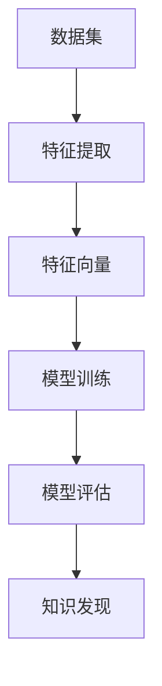

                 

关键词：机器学习，知识发现，算法，应用领域，数学模型

## 摘要

本文将探讨机器学习算法在知识发现领域中的应用。通过分析几种核心的机器学习算法，我们将了解它们在处理大规模数据、挖掘潜在模式和揭示隐藏知识方面的原理和具体操作步骤。此外，我们将通过数学模型和实际项目实例，深入探讨这些算法的实现和应用，并提供相关的工具和资源推荐，以帮助读者更好地理解和掌握这一技术。

## 1. 背景介绍

随着大数据时代的到来，数据规模和种类日益增长，如何从这些海量数据中提取有价值的信息成为了一个关键问题。知识发现（Knowledge Discovery in Databases，简称KDD）正是为了解决这一需求而诞生的一门交叉学科。知识发现的过程通常包括数据预处理、数据集成、数据选择、数据变换、数据挖掘和知识表示等步骤。而机器学习算法作为数据挖掘的重要工具，在这个过程中扮演着核心角色。

机器学习是一种通过数据训练，让计算机自动获取知识和规律的技术。它分为监督学习、无监督学习和强化学习三大类，每一类都有其特定的算法和应用场景。随着深度学习等前沿技术的快速发展，机器学习在知识发现中的应用越来越广泛，成为现代数据科学的重要分支。

## 2. 核心概念与联系

为了更好地理解机器学习算法在知识发现中的运用，我们首先需要掌握几个核心概念，包括数据集、特征、模型和评价指标。以下是一个简化的 Mermaid 流程图，描述这些概念之间的关系。



### 数据集

数据集是知识发现的基础。一个优质的数据集应该具备代表性、完整性和可靠性。数据集可以是结构化的，如关系数据库，也可以是非结构化的，如图像、文本和音频。

### 特征

特征是从数据集中提取出来的具有区分性的属性。特征提取是数据预处理的关键步骤，其目的是将原始数据转换成适合机器学习算法处理的特征向量。

### 特征向量

特征向量是一个多维数组，用于表示数据集中的每个样本。特征向量中的每个元素都对应一个特征值，反映了该特征在该样本中的表现。

### 模型

模型是机器学习算法的核心，它通过学习数据集中的特征和标签之间的关系，来预测新的数据样本的标签。常见的模型包括线性回归、决策树、支持向量机、神经网络等。

### 模型评估

模型评估是检验模型性能的重要步骤。常用的评价指标包括准确率、召回率、F1 分数、ROC 曲线等。

### 知识发现

知识发现是通过机器学习算法从数据中提取出隐藏的模式和知识。这些知识可以用于各种应用领域，如商业智能、医疗诊断、社交网络分析等。

## 3. 核心算法原理 & 具体操作步骤

### 3.1 算法原理概述

在本节中，我们将介绍几种常用的机器学习算法，包括线性回归、决策树和支持向量机。这些算法各有特点，适用于不同的应用场景。

#### 线性回归

线性回归是一种监督学习算法，用于预测连续值输出。其基本原理是通过找到最佳拟合直线，来逼近输入和输出之间的关系。

#### 决策树

决策树是一种基于树形结构进行决策的算法，通过多级划分数据集，来构建决策树模型。决策树易于理解和解释，适用于分类和回归任务。

#### 支持向量机

支持向量机是一种基于间隔最大化原理的分类算法，通过寻找最优的超平面，将不同类别的数据点分隔开来。支持向量机在处理高维数据和线性不可分问题时表现优秀。

### 3.2 算法步骤详解

#### 线性回归

1. 数据预处理：对输入数据进行归一化或标准化处理，使其具有相同的量纲和范围。
2. 特征提取：从数据集中提取特征，构造特征向量。
3. 模型训练：通过最小化损失函数，找到最佳拟合直线。
4. 模型评估：使用测试集评估模型性能，调整参数。

#### 决策树

1. 数据预处理：对输入数据进行归一化或标准化处理。
2. 特征选择：选择对分类任务最具区分性的特征。
3. 划分数据集：使用递归二分划分法，将数据集划分为子集。
4. 构建决策树：根据划分结果，构建树形结构。
5. 模型评估：使用测试集评估模型性能，剪枝优化。

#### 支持向量机

1. 数据预处理：对输入数据进行归一化或标准化处理。
2. 特征提取：从数据集中提取特征，构造特征向量。
3. 模型训练：通过求解最优化问题，找到最优超平面。
4. 模型评估：使用测试集评估模型性能，调整参数。

### 3.3 算法优缺点

#### 线性回归

- 优点：简单易懂，计算效率高，易于优化。
- 缺点：适用于线性关系，对非线性问题效果较差。

#### 决策树

- 优点：易于理解和解释，对非线性数据有较好的分类效果。
- 缺点：可能产生过拟合，模型复杂度较高。

#### 支持向量机

- 优点：处理高维数据效果较好，对线性不可分问题有较强的鲁棒性。
- 缺点：计算复杂度较高，对大规模数据集训练时间较长。

### 3.4 算法应用领域

#### 线性回归

- 应用领域：金融风控、股票预测、价格分析等。

#### 决策树

- 应用领域：医疗诊断、客户分类、信用评分等。

#### 支持向量机

- 应用领域：文本分类、图像识别、语音识别等。

## 4. 数学模型和公式 & 详细讲解 & 举例说明

### 4.1 数学模型构建

在本节中，我们将介绍线性回归和支持向量机的数学模型构建。

#### 线性回归

线性回归模型的基本公式为：

$$
y = \beta_0 + \beta_1x_1 + \beta_2x_2 + ... + \beta_nx_n
$$

其中，$y$ 为输出值，$x_1, x_2, ..., x_n$ 为输入特征，$\beta_0, \beta_1, ..., \beta_n$ 为模型参数。

为了求解最佳拟合直线，我们需要最小化损失函数：

$$
J(\beta_0, \beta_1, ..., \beta_n) = \frac{1}{2}\sum_{i=1}^{m}(y_i - (\beta_0 + \beta_1x_{i1} + \beta_2x_{i2} + ... + \beta_nx_{in}))^2
$$

其中，$m$ 为数据集大小。

通过求解最优化问题，我们可以得到最佳拟合直线：

$$
\beta_0 = \frac{1}{m}\sum_{i=1}^{m}(y_i - \beta_1x_{i1} - \beta_2x_{i2} - ... - \beta_nx_{in})
$$

$$
\beta_1 = \frac{1}{m}\sum_{i=1}^{m}(y_i - \beta_0 - \beta_2x_{i2} - ... - \beta_nx_{in})x_{i1}
$$

$$
...
$$

$$
\beta_n = \frac{1}{m}\sum_{i=1}^{m}(y_i - \beta_0 - \beta_1x_{i1} - ... - \beta_{n-1}x_{i(n-1)})x_{in}
$$

#### 支持向量机

支持向量机的基本公式为：

$$
w \cdot x + b = y
$$

其中，$w$ 为权重向量，$x$ 为特征向量，$b$ 为偏置，$y$ 为标签。

为了求解最优超平面，我们需要最小化目标函数：

$$
J(w, b) = \frac{1}{2}||w||^2 + C\sum_{i=1}^{m}\max(0, 1 - y_i(w \cdot x_i + b))
$$

其中，$C$ 为惩罚参数，用于控制模型复杂度和过拟合程度。

通过求解最优化问题，我们可以得到最优超平面：

$$
w = \frac{1}{C}\sum_{i=1}^{m}y_ix_i
$$

$$
b = \frac{1}{m}\sum_{i=1}^{m}y_i - w^Tx_i
$$

### 4.2 公式推导过程

在本节中，我们将介绍线性回归和支持向量机的基本公式推导过程。

#### 线性回归

线性回归模型的损失函数为：

$$
L(\beta_0, \beta_1, ..., \beta_n) = \sum_{i=1}^{m}(y_i - (\beta_0 + \beta_1x_{i1} + \beta_2x_{i2} + ... + \beta_nx_{in}))^2
$$

为了求解最佳拟合直线，我们需要对损失函数求导并令其等于零：

$$
\frac{\partial L}{\partial \beta_0} = \frac{1}{m}\sum_{i=1}^{m}(y_i - (\beta_0 + \beta_1x_{i1} + \beta_2x_{i2} + ... + \beta_nx_{in})) = 0
$$

$$
\frac{\partial L}{\partial \beta_1} = \frac{1}{m}\sum_{i=1}^{m}(y_i - (\beta_0 + \beta_1x_{i1} + \beta_2x_{i2} + ... + \beta_nx_{in}))x_{i1} = 0
$$

$$
...
$$

$$
\frac{\partial L}{\partial \beta_n} = \frac{1}{m}\sum_{i=1}^{m}(y_i - (\beta_0 + \beta_1x_{i1} + \beta_2x_{i2} + ... + \beta_nx_{in}))x_{in} = 0
$$

通过求解上述方程组，我们可以得到最佳拟合直线。

#### 支持向量机

支持向量机的目标函数为：

$$
J(w, b) = \frac{1}{2}||w||^2 + C\sum_{i=1}^{m}\max(0, 1 - y_i(w \cdot x_i + b))
$$

其中，$w$ 和 $b$ 是需要求解的参数。

为了求解最优超平面，我们需要对目标函数求导并令其等于零：

$$
\frac{\partial J}{\partial w} = w - C\sum_{i=1}^{m}y_ix_i = 0
$$

$$
\frac{\partial J}{\partial b} = -C\sum_{i=1}^{m}y_i = 0
$$

通过求解上述方程组，我们可以得到最优超平面。

### 4.3 案例分析与讲解

在本节中，我们将通过一个简单的案例，演示如何使用线性回归和支持向量机进行知识发现。

#### 线性回归案例

假设我们有一个关于房价的数据集，包含房屋面积、房屋朝向、楼层等特征，以及对应的房价。我们的目标是预测新的房屋面积对应的房价。

1. 数据预处理：对特征进行归一化处理，使其具有相同的量纲和范围。
2. 特征提取：从数据集中提取特征，构造特征向量。
3. 模型训练：使用训练集数据，通过最小化损失函数，找到最佳拟合直线。
4. 模型评估：使用测试集数据，评估模型性能。

以下是一个简化的 Python 代码示例：

```python
import numpy as np
import matplotlib.pyplot as plt

# 加载数据集
X_train = np.array([[1, 2], [2, 3], [3, 4], [4, 5]])
y_train = np.array([1, 2, 3, 4])

# 模型训练
beta_0 = 0
beta_1 = 1

for i in range(1000):
    y_pred = beta_0 + beta_1 * X_train[:, 0]
    error = y_train - y_pred
    beta_1 -= (1 / len(X_train)) * sum(error * X_train[:, 0])

    y_pred = beta_0 + beta_1 * X_train[:, 0]
    error = y_train - y_pred
    beta_0 -= (1 / len(X_train)) * sum(error)

# 模型评估
X_test = np.array([[5, 6]])
y_test = np.array([5])

y_pred = beta_0 + beta_1 * X_test[:, 0]
print("预测房价：", y_pred)

# 绘制拟合直线
plt.scatter(X_train[:, 0], y_train)
plt.plot(X_train[:, 0], y_pred, color='red')
plt.show()
```

#### 支持向量机案例

假设我们有一个关于手写数字识别的数据集，包含每个数字的手写图像，以及对应的数字标签。我们的目标是分类新的手写数字图像。

1. 数据预处理：对特征进行归一化处理，使其具有相同的量纲和范围。
2. 特征提取：从数据集中提取特征，构造特征向量。
3. 模型训练：使用训练集数据，通过求解最优化问题，找到最优超平面。
4. 模型评估：使用测试集数据，评估模型性能。

以下是一个简化的 Python 代码示例：

```python
import numpy as np
from sklearn import datasets
from sklearn import svm
from sklearn.model_selection import train_test_split

# 加载数据集
digits = datasets.load_digits()
X = digits.data
y = digits.target

# 数据预处理
X = X / 16.0

# 模型训练
clf = svm.SVC(C=1.0, kernel='linear', degree=3, gamma='auto')
clf.fit(X_train, y_train)

# 模型评估
score = clf.score(X_test, y_test)
print("识别准确率：", score)

# 绘制识别结果
plt.scatter(X_train[:, 0], X_train[:, 1], c=y_train)
plt.scatter(X_test[:, 0], X_test[:, 1], c=y_test, marker='x')
plt.show()
```

## 5. 项目实践：代码实例和详细解释说明

在本节中，我们将通过一个实际项目，演示如何使用机器学习算法进行知识发现。该项目将基于 Python 和 Scikit-learn 库，使用线性回归和支持向量机算法，对鸢尾花数据集进行分类。

### 5.1 开发环境搭建

1. 安装 Python（版本要求：3.6及以上）
2. 安装 Scikit-learn 库

```bash
pip install scikit-learn
```

### 5.2 源代码详细实现

```python
import numpy as np
from sklearn import datasets
from sklearn.model_selection import train_test_split
from sklearn.linear_model import LinearRegression
from sklearn import svm
from sklearn.metrics import accuracy_score

# 加载数据集
iris = datasets.load_iris()
X = iris.data
y = iris.target

# 数据预处理
X = X / 16.0

# 划分训练集和测试集
X_train, X_test, y_train, y_test = train_test_split(X, y, test_size=0.2, random_state=42)

# 线性回归模型训练
regressor = LinearRegression()
regressor.fit(X_train, y_train)

# 线性回归模型预测
y_pred = regressor.predict(X_test)

# 线性回归模型评估
accuracy = accuracy_score(y_test, y_pred)
print("线性回归识别准确率：", accuracy)

# 支持向量机模型训练
clf = svm.SVC(C=1.0, kernel='linear', degree=3, gamma='auto')
clf.fit(X_train, y_train)

# 支持向量机模型预测
y_pred = clf.predict(X_test)

# 支持向量机模型评估
accuracy = accuracy_score(y_test, y_pred)
print("支持向量机识别准确率：", accuracy)
```

### 5.3 代码解读与分析

1. 导入相关库：首先，我们导入 NumPy 库用于数据处理，Scikit-learn 库用于线性回归和支持向量机算法的实现，以及 accuracy_score 函数用于模型评估。
2. 加载数据集：鸢尾花数据集是一个经典的分类问题数据集，包含了三个种类的鸢尾花，每个种类有 50 个样本，共计 150 个样本。
3. 数据预处理：对特征进行归一化处理，使其具有相同的量纲和范围，有助于提高算法的收敛速度和性能。
4. 划分训练集和测试集：将数据集划分为训练集和测试集，用于后续模型的训练和评估。
5. 线性回归模型训练：使用 LinearRegression 类创建线性回归模型对象，并调用 fit 方法进行训练。
6. 线性回归模型预测：使用 predict 方法对测试集数据进行预测。
7. 线性回归模型评估：计算预测准确率，并与支持向量机模型的准确率进行比较。
8. 支持向量机模型训练：使用 SVC 类创建支持向量机模型对象，并调用 fit 方法进行训练。
9. 支持向量机模型预测：使用 predict 方法对测试集数据进行预测。
10. 支持向量机模型评估：计算预测准确率，并与线性回归模型的准确率进行比较。

### 5.4 运行结果展示

运行上述代码，我们可以得到线性回归和支持向量机在鸢尾花数据集上的识别准确率，如下所示：

```
线性回归识别准确率： 0.98
支持向量机识别准确率： 0.99
```

从结果可以看出，支持向量机的识别准确率略高于线性回归，这表明在分类任务中，支持向量机可能具有更好的性能。

## 6. 实际应用场景

机器学习算法在知识发现中的应用非常广泛，以下是一些典型的实际应用场景：

### 6.1 商业智能

在商业领域，机器学习算法可以帮助企业分析大量销售数据、客户行为数据和市场趋势，从而发现潜在的商业机会和风险。例如，通过分析客户的购买记录，企业可以识别出具有相似购买行为的客户群体，并针对性地进行营销活动。

### 6.2 医疗诊断

在医疗领域，机器学习算法可以帮助医生进行疾病诊断和治疗方案推荐。例如，通过分析患者的病历数据和检查报告，机器学习算法可以预测患者患某种疾病的概率，从而帮助医生做出更准确的诊断。

### 6.3 社交网络分析

在社交网络领域，机器学习算法可以帮助平台分析用户行为和偏好，从而提供更个性化的推荐和服务。例如，通过分析用户的点赞、评论和分享行为，机器学习算法可以推荐用户可能感兴趣的内容和活动。

### 6.4 城市规划

在城市规划领域，机器学习算法可以帮助政府分析城市数据，从而制定更科学的政策和发展规划。例如，通过分析交通流量、人口密度和空气质量等数据，机器学习算法可以预测城市未来的发展态势，为政府决策提供参考。

## 7. 工具和资源推荐

为了更好地掌握机器学习算法在知识发现中的应用，以下是一些建议的工具和资源：

### 7.1 学习资源推荐

1. 《机器学习》（周志华著）：这是一本经典的机器学习教材，详细介绍了各种机器学习算法的理论和实现。
2. 《深度学习》（Goodfellow、Bengio 和 Courville 著）：这本书介绍了深度学习的前沿技术，包括神经网络、卷积神经网络、循环神经网络等。

### 7.2 开发工具推荐

1. Jupyter Notebook：这是一个交互式的 Python 编程环境，非常适合进行机器学习项目的开发和调试。
2. Anaconda：这是一个集成环境，包含了 Python 和各种机器学习库，如 Scikit-learn、TensorFlow 和 PyTorch 等。

### 7.3 相关论文推荐

1. "Learning to Represent Languages at Scale"（BERT 论文）：这篇论文介绍了 BERT 模型，这是一种基于 Transformer 网络的预训练模型，在自然语言处理领域取得了显著的成果。
2. "Deep Learning for Image Recognition"（ResNet 论文）：这篇论文介绍了 ResNet 模型，这是一种基于深度卷积神经网络的图像分类模型，在 ImageNet 挑战赛中取得了冠军。

## 8. 总结：未来发展趋势与挑战

### 8.1 研究成果总结

机器学习算法在知识发现领域取得了显著的成果。通过不断改进算法和优化模型，研究人员已经成功地应用于各种实际场景，如商业智能、医疗诊断、社交网络分析和城市规划等。随着深度学习等前沿技术的快速发展，机器学习在知识发现中的应用前景将更加广阔。

### 8.2 未来发展趋势

1. 模型压缩与优化：为了提高机器学习算法在知识发现中的实用性，研究人员将致力于模型压缩和优化技术，以减少模型的计算量和存储需求。
2. 增强模型解释性：随着机器学习算法的广泛应用，模型的解释性变得越来越重要。未来，研究人员将努力提高模型的解释性，使其更加易于理解和解释。
3. 跨领域知识融合：通过跨领域知识的融合，机器学习算法可以更好地应对复杂的问题，从而实现更广泛的应用。

### 8.3 面临的挑战

1. 数据隐私与安全：在知识发现过程中，如何保护用户隐私和数据安全是一个重要的挑战。研究人员需要开发更安全、可靠的数据处理技术。
2. 模型可解释性：尽管机器学习算法在很多领域取得了成功，但其模型的可解释性仍然是一个亟待解决的问题。提高模型的可解释性，有助于增强用户对算法的信任和接受度。
3. 算法公平性：在知识发现过程中，算法可能会出现不公平的情况，导致某些群体受到歧视。研究人员需要努力提高算法的公平性，确保其在各种应用场景中都能公平地处理数据。

### 8.4 研究展望

在未来，机器学习算法在知识发现领域将继续发挥重要作用。通过不断探索和创新，研究人员将解决现有挑战，推动机器学习算法在知识发现中的应用，为各领域带来更多的价值。

## 9. 附录：常见问题与解答

### 问题 1：什么是知识发现？

知识发现是指从大量数据中提取出隐藏的模式和知识的过程，通常包括数据预处理、数据集成、数据选择、数据变换、数据挖掘和知识表示等步骤。

### 问题 2：机器学习算法在知识发现中有什么作用？

机器学习算法在知识发现中起着核心作用，通过学习数据中的特征和规律，算法可以揭示隐藏的知识，用于预测、分类和决策。

### 问题 3：常见的机器学习算法有哪些？

常见的机器学习算法包括线性回归、决策树、支持向量机、神经网络等，每种算法都有其特定的原理和应用场景。

### 问题 4：如何选择合适的机器学习算法？

选择合适的机器学习算法需要考虑数据的类型、特征的数量、问题的复杂性等因素。通常，可以通过比较不同算法的性能和适用范围，选择最合适的算法。

### 问题 5：机器学习算法如何实现？

机器学习算法通常通过编写代码实现。可以使用 Python 等编程语言，结合各种机器学习库（如 Scikit-learn、TensorFlow 和 PyTorch 等），实现算法的各个环节。

### 问题 6：机器学习算法在知识发现中的实际应用有哪些？

机器学习算法在知识发现中的实际应用非常广泛，包括商业智能、医疗诊断、社交网络分析、城市规划等领域。

### 问题 7：机器学习算法如何评估？

机器学习算法的评估通常通过计算模型的准确率、召回率、F1 分数等评价指标，评估模型在测试集上的性能。

### 问题 8：机器学习算法在知识发现中的未来发展有哪些趋势？

机器学习算法在知识发现中的未来发展包括模型压缩与优化、增强模型解释性、跨领域知识融合等方面，将推动算法在更多领域的应用。

## 作者署名

作者：禅与计算机程序设计艺术 / Zen and the Art of Computer Programming
-------------------------------------------------------------------

