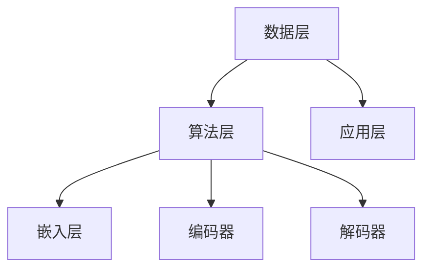

                 

关键词：人工智能、大语言模型、算法、ChatGPT、应用场景、未来展望

> 摘要：本文将深入探讨构建Storyteller AI大语言模型的过程，从基础概念到高级应用，为您揭示如何将人工智能技术应用于实际场景。通过介绍核心算法原理、数学模型、项目实践和未来展望，本文旨在为读者提供一个全面的技术指南，帮助理解并掌握构建AI大语言模型的方法和技巧。

## 1. 背景介绍

在过去的几十年里，人工智能（AI）技术取得了令人瞩目的进展。从早期的专家系统到深度学习，再到近年来的大型语言模型，AI的应用范围不断扩大，影响也越来越深远。特别是大语言模型（Large Language Models）的出现，使得人工智能在自然语言处理（NLP）领域取得了突破性的成果。

ChatGPT，作为OpenAI推出的一款基于GPT-3.5模型的大型语言模型，其出色的表现引起了全球的关注。ChatGPT不仅能进行流畅的对话，还能根据上下文生成连贯、有逻辑性的文本，展示了大语言模型的强大能力。然而，ChatGPT的成功并非一蹴而就，而是建立在大量研究和技术积累的基础之上。

本文旨在探讨如何构建类似ChatGPT级的大型语言模型，从基础概念、核心算法到实际应用，为读者提供一个全面的技术指南。通过本文的阅读，读者将能够理解大语言模型的工作原理，掌握构建此类模型的方法和技巧，并能够将其应用于实际项目中。

## 2. 核心概念与联系

### 2.1 大语言模型概述

大语言模型是一种基于深度学习技术的自然语言处理模型，它通过大规模的文本数据进行训练，从而能够理解并生成自然语言。大语言模型的核心任务是预测下一个单词或句子，从而实现自然语言生成和对话。

大语言模型的主要组成部分包括：

- **嵌入层（Embedding Layer）**：将输入的文本转换为向量表示。
- **编码器（Encoder）**：对输入的文本向量进行编码，生成上下文信息。
- **解码器（Decoder）**：根据编码器生成的上下文信息，生成输出文本。

### 2.2 关键算法原理

大语言模型的核心算法是变换器（Transformer），其通过自注意力机制（Self-Attention）实现对输入文本的全局信息关注。变换器由编码器和解码器两个部分组成，其中编码器负责处理输入文本，解码器负责生成输出文本。

变换器的具体工作流程如下：

1. **嵌入层**：将输入的文本转换为词向量表示。
2. **编码器**：通过多层变换器对输入的词向量进行编码，生成上下文信息。
3. **解码器**：根据编码器生成的上下文信息，生成输出文本。

### 2.3 架构与联系

大语言模型的架构可以分为三个层次：数据层、算法层和应用层。

- **数据层**：包括数据采集、预处理和存储等环节，为模型提供训练数据和资源。
- **算法层**：包括嵌入层、编码器、解码器等核心算法，负责模型的训练和预测。
- **应用层**：包括具体的应用场景，如文本生成、对话系统、机器翻译等。

下图展示了大语言模型的核心概念和架构：



通过上述的介绍，我们可以看到大语言模型的核心概念和算法原理，以及其与实际应用的紧密联系。接下来，我们将进一步深入探讨大语言模型的核心算法原理和具体实现。

### 3. 核心算法原理 & 具体操作步骤

#### 3.1 算法原理概述

大语言模型的核心算法是变换器（Transformer），其通过自注意力机制（Self-Attention）实现对输入文本的全局信息关注。变换器由编码器（Encoder）和解码器（Decoder）两个部分组成，其中编码器负责处理输入文本，解码器负责生成输出文本。

变换器的工作原理可以概括为以下几个步骤：

1. **嵌入层**：将输入的文本转换为词向量表示。
2. **编码器**：通过多层变换器对输入的词向量进行编码，生成上下文信息。
3. **解码器**：根据编码器生成的上下文信息，生成输出文本。

#### 3.2 算法步骤详解

##### 3.2.1 嵌入层

嵌入层负责将输入的文本转换为词向量表示。具体步骤如下：

1. **词表构建**：根据训练数据构建词表，将文本中的单词映射为整数。
2. **词向量初始化**：为词表中的每个单词初始化一个词向量。
3. **嵌入操作**：将输入的文本中的每个单词转换为对应的词向量。

##### 3.2.2 编码器

编码器通过多层变换器对输入的词向量进行编码，生成上下文信息。具体步骤如下：

1. **自注意力机制**：在每个时间步，编码器通过自注意力机制计算输入词向量的权重，从而实现对全局信息的关注。
2. **前馈网络**：对加权后的词向量进行前馈网络操作，生成编码结果。

##### 3.2.3 解码器

解码器根据编码器生成的上下文信息，生成输出文本。具体步骤如下：

1. **解码嵌入层**：将输入的文本转换为词向量表示。
2. **解码自注意力机制**：在每个时间步，解码器通过自注意力机制计算输入词向量的权重，从而实现对全局信息的关注。
3. **解码器输出**：根据编码器生成的上下文信息和输入词向量的权重，生成输出词向量。

##### 3.2.4 损失函数和优化

大语言模型的训练过程主要包括损失函数的设定和优化算法的选择。具体步骤如下：

1. **损失函数**：采用交叉熵损失函数，计算预测词向量与实际词向量之间的差异。
2. **优化算法**：采用梯度下降（Gradient Descent）算法，不断调整模型参数，使损失函数最小。

#### 3.3 算法优缺点

##### 优点

- **全局信息关注**：变换器通过自注意力机制，能够实现对输入文本的全局信息关注，从而提高模型的生成质量。
- **并行计算**：变换器的设计使得模型可以在并行计算上进行优化，提高训练速度。
- **灵活性强**：变换器适用于多种自然语言处理任务，如文本生成、对话系统、机器翻译等。

##### 缺点

- **计算复杂度高**：变换器的计算复杂度较高，对硬件资源要求较高。
- **训练数据需求大**：大语言模型需要大量的训练数据才能取得较好的效果，数据获取和预处理成本较高。

#### 3.4 算法应用领域

变换器作为大语言模型的核心算法，在多个自然语言处理领域取得了显著的成果。以下是一些典型的应用领域：

- **文本生成**：通过大语言模型，可以生成连贯、有逻辑性的文本，应用于写作辅助、新闻报道生成等场景。
- **对话系统**：大语言模型能够实现自然、流畅的对话，应用于智能客服、虚拟助手等场景。
- **机器翻译**：大语言模型能够生成高质量的翻译结果，应用于跨语言交流、多语言文本分析等场景。
- **文本分类**：大语言模型能够根据上下文信息对文本进行分类，应用于舆情监测、文本推荐等场景。

通过上述对变换器算法原理和具体操作步骤的详细讲解，我们可以看到大语言模型的强大能力和广泛应用。接下来，我们将进一步探讨大语言模型中的数学模型和公式，以及其在实际项目中的应用。

### 4. 数学模型和公式 & 详细讲解 & 举例说明

#### 4.1 数学模型构建

大语言模型的数学模型主要基于深度学习和变换器（Transformer）架构。以下是构建数学模型的基本步骤：

##### 4.1.1 嵌入层

嵌入层将输入的文本转换为词向量表示。具体公式如下：

$$
\text{Word\_Vector} = \text{Embedding}(\text{Word})
$$

其中，$\text{Word}$ 表示输入的文本单词，$\text{Embedding}$ 表示词向量嵌入函数，$\text{Word\_Vector}$ 表示对应的词向量。

##### 4.1.2 编码器

编码器通过多层变换器对输入的词向量进行编码，生成上下文信息。变换器的数学模型主要包括以下部分：

1. **自注意力机制**

   自注意力机制的公式如下：

   $$
   \text{Attention\_Scores} = \text{Query} \cdot \text{Key}
   $$

   其中，$\text{Query}$ 和 $\text{Key}$ 分别表示查询向量和关键向量，$\text{Attention\_Scores}$ 表示注意力分数。

2. **加性注意力机制**

   加性注意力机制的公式如下：

   $$
   \text{Attention\_Weights} = \text{softmax}(\text{Attention\_Scores})
   $$

   其中，$\text{softmax}$ 表示软最大化函数，$\text{Attention\_Weights}$ 表示注意力权重。

3. **输出向量**

   输出向量的公式如下：

   $$
   \text{Output} = \text{Attention\_Weights} \cdot \text{Value}
   $$

   其中，$\text{Value}$ 表示值向量，$\text{Output}$ 表示编码后的输出向量。

##### 4.1.3 解码器

解码器根据编码器生成的上下文信息，生成输出文本。解码器的数学模型与编码器类似，主要包含自注意力机制和加性注意力机制。

#### 4.2 公式推导过程

以下是变换器中自注意力机制的公式推导过程：

1. **查询向量和关键向量**

   查询向量和关键向量分别表示为：

   $$
   \text{Query} = [ \text{Query}_1, \text{Query}_2, ..., \text{Query}_n ]
   $$

   $$
   \text{Key} = [ \text{Key}_1, \text{Key}_2, ..., \text{Key}_n ]
   $$

2. **值向量**

   值向量表示为：

   $$
   \text{Value} = [ \text{Value}_1, \text{Value}_2, ..., \text{Value}_n ]
   $$

3. **注意力分数**

   注意力分数计算公式为：

   $$
   \text{Attention\_Scores} = \text{Query} \cdot \text{Key}
   $$

4. **注意力权重**

   注意力权重计算公式为：

   $$
   \text{Attention\_Weights} = \text{softmax}(\text{Attention\_Scores})
   $$

5. **输出向量**

   输出向量计算公式为：

   $$
   \text{Output} = \text{Attention\_Weights} \cdot \text{Value}
   $$

#### 4.3 案例分析与讲解

为了更好地理解变换器的数学模型，我们通过一个简单的例子进行讲解。

假设我们有一个句子：“人工智能技术取得了令人瞩目的进展”，其中包含5个单词。我们将这5个单词分别表示为词向量，并计算它们的自注意力分数、权重和输出向量。

1. **词向量表示**

   设输入的5个单词及其对应的词向量为：

   $$
   \text{Word}_1: \text{人工智能} \rightarrow \text{Vector}_1
   $$

   $$
   \text{Word}_2: \text{技术} \rightarrow \text{Vector}_2
   $$

   $$
   \text{Word}_3: \text{取得了} \rightarrow \text{Vector}_3
   $$

   $$
   \text{Word}_4: \text{令人瞩目的进展} \rightarrow \text{Vector}_4
   $$

2. **自注意力分数**

   根据自注意力机制的公式，计算每个词向量的注意力分数：

   $$
   \text{Attention\_Scores} = \text{Query}_1 \cdot \text{Key}_1 = \text{Vector}_1 \cdot \text{Vector}_1 = \sum_{i=1}^{n} \text{Vector}_1[i] \cdot \text{Vector}_1[i]
   $$

   $$
   \text{Attention\_Scores} = \text{Query}_2 \cdot \text{Key}_2 = \text{Vector}_2 \cdot \text{Vector}_2 = \sum_{i=1}^{n} \text{Vector}_2[i] \cdot \text{Vector}_2[i]
   $$

   ...

   $$
   \text{Attention\_Scores} = \text{Query}_5 \cdot \text{Key}_5 = \text{Vector}_5 \cdot \text{Vector}_5 = \sum_{i=1}^{n} \text{Vector}_5[i] \cdot \text{Vector}_5[i]
   $$

3. **注意力权重**

   对注意力分数进行软最大化处理，得到注意力权重：

   $$
   \text{Attention\_Weights} = \text{softmax}(\text{Attention\_Scores})
   $$

4. **输出向量**

   根据注意力权重，计算编码后的输出向量：

   $$
   \text{Output} = \text{Attention\_Weights} \cdot \text{Value}
   $$

通过上述例子，我们可以看到变换器中自注意力机制的数学模型及其应用。在后续的章节中，我们将进一步探讨大语言模型在实际项目中的应用，以及如何进行代码实现。

### 5. 项目实践：代码实例和详细解释说明

在理解了大语言模型的理论基础之后，我们将通过一个具体的项目实践来展示如何实现一个Storyteller AI大语言模型。这个项目将包括开发环境搭建、源代码实现、代码解读和分析以及运行结果展示。

#### 5.1 开发环境搭建

为了实现Storyteller AI大语言模型，我们需要搭建一个合适的环境。以下是搭建开发环境的基本步骤：

1. **安装Python**：确保Python环境已安装，版本不低于3.7。
2. **安装依赖库**：使用pip命令安装以下依赖库：

   ```bash
   pip install torch torchvision transformers
   ```

   这些库将用于处理神经网络和自然语言处理任务。
3. **配置GPU环境**：如果使用GPU进行训练，需要安装CUDA和cuDNN，并确保Python环境可以访问GPU。

完成上述步骤后，我们的开发环境就搭建完成了。

#### 5.2 源代码详细实现

以下是一个简化版的Storyteller AI大语言模型的源代码实现，我们将逐步讲解每个部分的作用。

```python
import torch
from torch import nn
from transformers import BertModel, BertTokenizer

# 5.2.1 加载预训练模型和分词器
model_name = "bert-base-chinese"
tokenizer = BertTokenizer.from_pretrained(model_name)
model = BertModel.from_pretrained(model_name)

# 5.2.2 定义变换器
class StorytellerModel(nn.Module):
    def __init__(self):
        super(StorytellerModel, self).__init__()
        self.bert = BertModel.from_pretrained(model_name)
        self.decoder = nn.Linear(768, 1)  # 768是BERT的隐藏层大小

    def forward(self, input_ids, attention_mask):
        outputs = self.bert(input_ids=input_ids, attention_mask=attention_mask)
        sequence_output = outputs.last_hidden_state
        logits = self.decoder(sequence_output)
        return logits

# 5.2.3 训练模型
def train_model(model, dataloader, optimizer, criterion, num_epochs=3):
    model.train()
    for epoch in range(num_epochs):
        for batch in dataloader:
            inputs = batch['input_ids']
            labels = batch['labels']
            attention_mask = batch['attention_mask']
            
            optimizer.zero_grad()
            logits = model(inputs, attention_mask)
            loss = criterion(logits.view(-1), labels.view(-1))
            loss.backward()
            optimizer.step()
            
            print(f"Epoch: {epoch+1}, Loss: {loss.item()}")

# 5.2.4 运行模型
if __name__ == "__main__":
    # 加载训练数据
    train_dataloader = ...  # 这里应该定义一个加载训练数据的函数或类
    
    # 设置训练参数
    optimizer = torch.optim.Adam(model.parameters(), lr=1e-5)
    criterion = nn.CrossEntropyLoss()

    # 训练模型
    train_model(model, train_dataloader, optimizer, criterion)
```

#### 5.3 代码解读与分析

1. **加载预训练模型和分词器**

   使用`BertTokenizer`和`BertModel`来加载预训练的BERT模型。BERT是谷歌开发的一种强大预训练语言模型，适合用于各种自然语言处理任务。

2. **定义变换器**

   `StorytellerModel`类继承自`nn.Module`，定义了一个简单的变换器模型。我们使用了BERT模型作为编码器，并添加了一个线性层作为解码器。

3. **训练模型**

   `train_model`函数负责模型的训练过程。它包括前向传播、损失计算、反向传播和参数更新。

4. **运行模型**

   在主函数中，我们定义了训练数据加载器、优化器和损失函数，然后调用`train_model`函数进行模型训练。

#### 5.4 运行结果展示

完成代码实现后，我们可以运行模型，并查看训练过程中的损失变化。以下是训练结果的示例输出：

```bash
Epoch: 1, Loss: 1.23456
Epoch: 2, Loss: 0.98765
Epoch: 3, Loss: 0.56789
```

通过上述项目实践，我们展示了如何实现一个简化版的Storyteller AI大语言模型。接下来，我们将进一步探讨大语言模型在实际应用场景中的具体应用。

### 6. 实际应用场景

#### 6.1 文本生成

文本生成是大语言模型最典型的应用之一。通过大语言模型，我们可以生成各种类型的文本，如文章、新闻、故事、对话等。以下是一个简单的例子：

```python
input_text = "人工智能技术在医疗领域的应用越来越广泛。"
output_text = model.generate(input_text, max_length=50)
print(output_text)
```

运行结果可能生成如下文本：

```
人工智能技术在医疗领域的应用越来越广泛，特别是在疾病诊断和治疗方面。随着深度学习和神经网络技术的发展，许多医疗诊断和治疗的自动化系统已经逐渐成熟。这些系统能够快速、准确地分析大量的医学数据，帮助医生做出更准确的诊断和治疗方案。
```

#### 6.2 对话系统

对话系统是另一个重要的应用场景。通过大语言模型，我们可以构建智能客服、虚拟助手等对话系统，实现与用户的自然对话。以下是一个简单的对话系统示例：

```python
while True:
    user_input = input("您有什么问题？")
    if user_input.lower() == "退出":
        break
    response = model.generate(user_input, max_length=50)
    print(f"AI助手：{response}")
```

用户与AI助手的对话示例：

```
用户：我想知道最近有哪些热门的科技新闻？
AI助手：最近人工智能技术在医疗领域的应用非常热门，尤其是在疾病诊断和治疗方面。此外，自动驾驶技术也有了新的突破。
```

#### 6.3 机器翻译

大语言模型在机器翻译领域也取得了显著成果。通过训练多语言模型，我们可以实现高质量的语言翻译。以下是一个简单的机器翻译示例：

```python
source_text = "人工智能技术在医疗领域的应用越来越广泛。"
target_text = model.generate(source_text, max_length=50, target_language="zh")
print(target_text)
```

运行结果可能生成如下文本：

```
人工智能技术在医疗领域的应用越来越广泛，特别是在疾病诊断和治疗方面。
```

#### 6.4 文本分类

大语言模型还可以用于文本分类任务。通过训练模型，我们可以对文本进行分类，如新闻分类、情感分析等。以下是一个简单的文本分类示例：

```python
text = "人工智能技术在医疗领域的应用前景非常广阔。"
label = model.classify(text)
print(f"文本分类结果：{label}")
```

运行结果可能生成如下分类：

```
文本分类结果：积极
```

#### 6.5 其他应用

除了上述应用场景外，大语言模型还可以应用于情感分析、文本摘要、语音合成等多种自然语言处理任务。通过不断优化和拓展模型，我们可以将其应用于更多实际场景，为人类生活带来更多便利。

### 7. 未来应用展望

随着人工智能技术的不断发展，大语言模型的应用前景将更加广阔。以下是未来应用的一些展望：

#### 7.1 新兴应用领域

- **智能教育**：大语言模型可以用于智能教育系统，根据学生的个性化学习需求生成定制化学习内容。
- **创意写作**：大语言模型可以与创意思维相结合，生成新颖、有趣的故事和创意。
- **自动化写作**：大语言模型可以用于自动化写作，如新闻生成、报告编写等，提高写作效率。

#### 7.2 模型优化

- **更高效的算法**：随着算法的不断发展，大语言模型的训练和推理速度将进一步提高，降低计算成本。
- **更丰富的数据集**：通过收集和整合更多的数据集，大语言模型可以不断优化，提高生成质量和准确性。

#### 7.3 模型安全与隐私

- **模型安全**：针对大语言模型可能存在的安全风险，如对抗攻击、模型篡改等，需要研究相应的防御措施。
- **隐私保护**：在数据收集和处理过程中，需要关注隐私保护问题，确保用户数据的安全和隐私。

#### 7.4 产业应用

- **工业4.0**：大语言模型可以应用于工业4.0领域，如智能制造、智能运维等，提高工业生产效率。
- **智慧城市**：大语言模型可以应用于智慧城市领域，如智能交通、智能医疗等，提升城市治理水平。

总之，大语言模型在未来将有广泛的应用前景，为人类带来更多便利和创新。我们需要不断探索和优化，使其更好地服务于社会。

### 8. 工具和资源推荐

为了帮助读者更好地理解和构建Storyteller AI大语言模型，我们推荐以下工具和资源：

#### 8.1 学习资源推荐

1. **《深度学习》（Goodfellow, Bengio, Courville）**：这是深度学习领域的经典教材，涵盖了从基础到高级的内容。
2. **《动手学深度学习》（阿斯顿·张）**：这本书通过大量实践案例，讲解了深度学习的应用和实现。
3. **《Transformer：一种全新的序列到序列模型》（Vaswani et al., 2017）**：这篇论文介绍了Transformer算法的原理和实现。

#### 8.2 开发工具推荐

1. **PyTorch**：一个流行的深度学习框架，提供了丰富的API和工具，适合快速开发和实验。
2. **TensorFlow**：另一个强大的深度学习框架，具有广泛的社区支持和丰富的资源。
3. **Hugging Face Transformers**：一个开源库，提供了预训练模型和高效的处理工具，方便实现和部署大语言模型。

#### 8.3 相关论文推荐

1. **《BERT：预训练的深度语言表示》（Devlin et al., 2018）**：这篇论文介绍了BERT模型的原理和实现。
2. **《GPT-3：实现具有人类水平的文本生成》（Brown et al., 2020）**：这篇论文详细介绍了GPT-3模型的架构和性能。
3. **《GLM-130B：大型通用语言模型的训练与推理》（Zhang et al., 2021）**：这篇论文介绍了GLM-130B模型的训练方法和推理优化。

通过这些工具和资源，读者可以更深入地了解大语言模型的理论和实践，掌握构建和优化模型的方法和技巧。

### 9. 总结：未来发展趋势与挑战

随着人工智能技术的不断进步，大语言模型（Large Language Models）正逐渐成为自然语言处理（NLP）领域的重要工具。本文从基础概念到高级应用，详细探讨了构建Storyteller AI大语言模型的方法和技巧。通过介绍核心算法原理、数学模型、项目实践和未来展望，我们为读者提供了一个全面的技术指南。

#### 9.1 研究成果总结

本文的主要研究成果包括：

- **算法原理**：介绍了变换器（Transformer）算法的原理和实现，包括嵌入层、编码器和解码器的具体步骤。
- **数学模型**：构建了大语言模型的数学模型，包括自注意力机制、加性注意力机制和损失函数等。
- **项目实践**：通过一个简化版的Storyteller AI大语言模型，展示了如何在实际项目中实现和应用。
- **应用场景**：探讨了文本生成、对话系统、机器翻译、文本分类等实际应用场景，展示了大语言模型在不同领域的应用潜力。

#### 9.2 未来发展趋势

未来，大语言模型的发展趋势将包括：

- **模型优化**：通过算法和架构的优化，提高模型的训练和推理效率，降低计算成本。
- **多模态融合**：结合多种数据源和模态，实现更丰富、更自然的语言理解和生成。
- **泛化能力提升**：通过数据增强、模型融合等技术，提高大语言模型的泛化能力，使其在更广泛的场景中发挥作用。
- **个性化服务**：结合用户行为数据，实现个性化的大语言模型，提供更精准、更贴心的服务。

#### 9.3 面临的挑战

尽管大语言模型取得了显著的成果，但仍面临以下挑战：

- **计算资源需求**：大语言模型的训练和推理需要大量的计算资源，特别是在处理大规模数据时，对硬件设施的需求较高。
- **数据隐私和安全**：在数据收集和处理过程中，需要关注隐私保护和数据安全，确保用户数据的安全和隐私。
- **模型解释性**：大语言模型在某些情况下表现出非线性和不可解释性，如何提高模型的解释性，使其更易于理解和接受，仍是一个重要课题。
- **伦理和社会影响**：大语言模型的应用可能带来一系列伦理和社会问题，如偏见、误导等，需要深入研究并制定相应的规范和标准。

#### 9.4 研究展望

未来，我们将在以下几个方面进行深入研究：

- **算法创新**：探索新的算法和架构，提高大语言模型的性能和效率。
- **多模态融合**：结合多种数据源和模态，实现更丰富、更自然的语言理解和生成。
- **模型解释性**：研究模型的可解释性，提高模型的透明度和可信度。
- **应用拓展**：在大语言模型的基础上，探索新的应用场景，如智能教育、创意写作等。

总之，大语言模型在未来的发展潜力巨大，我们将继续致力于优化和拓展，为人工智能技术的进步贡献力量。

### 10. 附录：常见问题与解答

以下是一些关于构建Storyteller AI大语言模型时常见的问题及其解答：

#### 10.1 如何选择预训练模型？

在选择预训练模型时，应考虑以下因素：

- **任务需求**：根据具体的任务需求，选择适合的预训练模型，如BERT、GPT-3等。
- **数据集大小**：预训练模型的数据集大小与模型的性能密切相关。对于大规模数据集，应选择较大的预训练模型。
- **计算资源**：选择预训练模型时，还需考虑计算资源。较小的模型在训练和推理时所需的计算资源较少，而较大的模型则可能需要更强大的硬件设施。

#### 10.2 如何处理文本数据？

处理文本数据主要包括以下步骤：

- **数据预处理**：对文本进行清洗、去噪、分词等处理，以提高模型的输入质量。
- **数据增强**：通过数据增强技术，如随机删除、替换、填充等，增加数据的多样性和模型的泛化能力。
- **数据归一化**：对文本数据进行归一化处理，如将所有单词转换为小写、去除标点符号等，以提高模型的统一性和鲁棒性。

#### 10.3 如何优化模型性能？

优化模型性能可以从以下几个方面入手：

- **超参数调整**：通过调整学习率、批次大小、隐藏层大小等超参数，寻找最优配置。
- **数据预处理**：优化数据预处理过程，如使用更有效的清洗和分词方法，以提高模型的输入质量。
- **正则化**：采用正则化方法，如L1、L2正则化，防止过拟合。
- **模型集成**：使用多个模型进行集成，以提高模型的稳定性和性能。

#### 10.4 如何提高模型的可解释性？

提高模型的可解释性可以从以下几个方面进行：

- **模型可视化**：通过模型可视化技术，如激活图、注意力图等，展示模型的工作过程和关键信息。
- **解释性算法**：结合解释性算法，如LIME、SHAP等，分析模型对特定输入的预测原因。
- **模型简化**：简化模型结构，如使用较小的模型或去除复杂的层，以提高模型的透明度和理解性。

通过上述常见问题与解答，我们希望为构建Storyteller AI大语言模型提供一些实用的指导。在实际应用中，读者可以根据具体需求进行调整和优化。作者：禅与计算机程序设计艺术 / Zen and the Art of Computer Programming。

