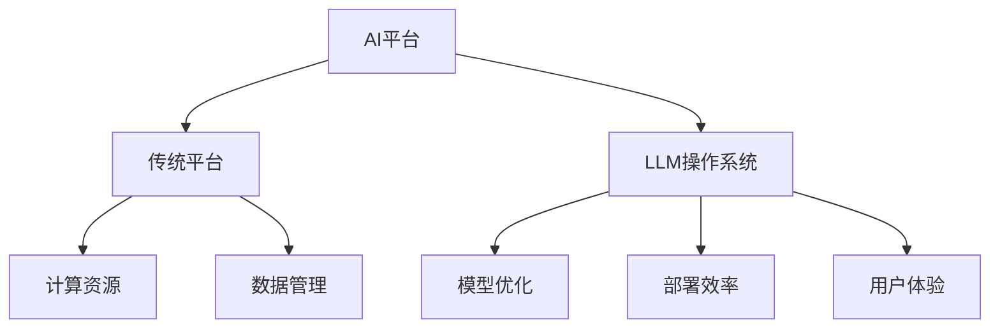

                 

关键词：下一代AI平台，LLM操作系统，深度学习，模型优化，软件架构

摘要：随着人工智能技术的飞速发展，大型语言模型（LLM）在各个领域的应用越来越广泛。本文将探讨构建下一代AI平台，即LLM操作系统的愿景，并分析其核心概念、算法原理、数学模型及未来应用前景。

## 1. 背景介绍

人工智能技术近年来取得了显著的进展，尤其是在深度学习和自然语言处理领域。大型语言模型（LLM），如GPT-3、BERT等，已经在许多应用场景中展现出强大的能力，从文本生成、翻译、摘要到问答系统等。然而，现有的LLM在性能、资源消耗、部署等方面仍存在诸多挑战。为了应对这些挑战，构建下一代AI平台，即LLM操作系统，显得尤为重要。

LLM操作系统旨在提供一个统一的、高效的、可扩展的AI计算环境，使得开发者能够更轻松地构建、训练、优化和部署LLM。本文将详细介绍LLM操作系统的核心概念、架构设计、算法原理、数学模型以及实际应用场景，探讨其未来发展趋势和挑战。

## 2. 核心概念与联系

### 2.1. 大型语言模型（LLM）

大型语言模型（LLM）是基于深度学习技术的自然语言处理模型，具有强大的文本生成和语义理解能力。LLM通常采用大规模的神经网络架构，如Transformer、BERT等，通过训练海量的文本数据来学习语言的规律和语义。

### 2.2. AI平台

AI平台是指用于构建、训练、优化和部署AI模型的一系列工具和资源。传统的AI平台主要侧重于提供计算资源和数据管理功能，而下一代AI平台则更加注重模型优化、部署效率和用户体验。

### 2.3. LLM操作系统

LLM操作系统是一种特殊的AI平台，它致力于提供一个统一的、高效的、可扩展的AI计算环境。LLM操作系统不仅提供传统的AI平台功能，还包含了一系列优化算法、工具和资源，以提升LLM的性能、资源利用率和部署效率。

### 2.4. Mermaid流程图



## 3. 核心算法原理 & 具体操作步骤

### 3.1. 算法原理概述

LLM操作系统的核心算法包括模型优化、分布式训练、模型压缩和模型部署等。这些算法旨在提升LLM的性能、资源利用率和部署效率。

- **模型优化**：通过调整神经网络架构、优化训练策略和参数设置，提高LLM的模型性能。
- **分布式训练**：利用多台计算机协同工作，加速LLM的训练过程，提高训练效率。
- **模型压缩**：通过模型剪枝、量化等技术，减小模型体积，降低模型部署的资源消耗。
- **模型部署**：将训练好的LLM部署到目标设备上，提供实时服务。

### 3.2. 算法步骤详解

1. **模型优化**：

   - 调整神经网络架构：选择合适的神经网络架构，如Transformer、BERT等，以适应不同的应用场景。
   - 优化训练策略：采用自适应学习率、批量归一化等技术，提高训练效率。
   - 参数设置：调整模型参数，如隐藏层尺寸、学习率等，以达到最佳性能。

2. **分布式训练**：

   - 数据分片：将训练数据分成多个数据块，分配到多台计算机上。
   - 模型分片：将模型参数分成多个子模型，分布在多台计算机上。
   - 通信与同步：通过通信和同步机制，确保多台计算机上的模型更新一致。

3. **模型压缩**：

   - 模型剪枝：通过剪枝冗余的神经元，减小模型体积。
   - 量化：将浮点数参数转换为整数参数，降低模型计算复杂度。
   - 知识蒸馏：利用小模型对大模型进行知识蒸馏，提高小模型的性能。

4. **模型部署**：

   - 模型导出：将训练好的模型导出为可部署的格式，如ONNX、TorchScript等。
   - 模型推理：在目标设备上运行模型，进行实时推理。
   - 服务部署：将模型部署到服务器或边缘设备上，提供API接口。

### 3.3. 算法优缺点

- **模型优化**：可以提高LLM的性能，但需要耗费大量的计算资源和时间。
- **分布式训练**：可以加速训练过程，提高训练效率，但需要解决数据一致性和通信问题。
- **模型压缩**：可以减小模型体积，降低部署成本，但可能影响模型性能。
- **模型部署**：可以快速提供实时服务，但需要解决部署平台的兼容性问题。

### 3.4. 算法应用领域

- **文本生成**：如自动写作、机器翻译、对话系统等。
- **文本理解**：如问答系统、信息检索、文本分类等。
- **多模态处理**：如图像、语音与文本的融合处理。
- **增强现实**：如虚拟助手、智能客服等。

## 4. 数学模型和公式 & 详细讲解 & 举例说明

### 4.1. 数学模型构建

LLM操作系统中的数学模型主要包括神经网络模型、优化算法和分布式计算模型。

1. **神经网络模型**：

   - **Transformer模型**：$f(x) = \text{softmax}(W_1 \text{tanh}(W_2 x + b_2))$

   - **BERT模型**：$f(x) = \text{softmax}(W_1 \text{tanh}(W_2 x + b_2))$

2. **优化算法**：

   - **随机梯度下降（SGD）**：$w_{t+1} = w_t - \alpha \frac{\partial J(w_t)}{\partial w_t}$

   - **Adam优化器**：$w_{t+1} = w_t - \alpha \frac{\partial J(w_t)}{\partial w_t} + \beta_1 \frac{\partial J(w_t)}{\partial w_t}$

3. **分布式计算模型**：

   - **数据并行**：$f(x) = \text{avg}(\text{model}(x_i))$

   - **模型并行**：$f(x) = \text{avg}(\text{model}(x_i))$

### 4.2. 公式推导过程

本文将简要介绍神经网络模型和优化算法的推导过程。

1. **Transformer模型**：

   - **多头注意力机制**：

     $$\text{Attention}(Q, K, V) = \text{softmax}\left(\frac{QK^T}{\sqrt{d_k}}\right)V$$

   - **前馈神经网络**：

     $$f(x) = \text{ReLU}(W_2 \text{tanh}(W_1 x + b_1))$$

2. **SGD优化算法**：

   - **梯度计算**：

     $$\frac{\partial J(w)}{\partial w} = -\frac{1}{m} \sum_{i=1}^{m} \frac{\partial J}{\partial w} (x_i, y_i)$$

   - **更新模型参数**：

     $$w_{t+1} = w_t - \alpha \frac{\partial J(w_t)}{\partial w_t}$$

3. **Adam优化器**：

   - **一阶矩估计**：

     $$m_t = \beta_1 m_{t-1} + (1 - \beta_1) \frac{\partial J(w_t)}{\partial w_t}$$

   - **二阶矩估计**：

     $$v_t = \beta_2 v_{t-1} + (1 - \beta_2) \left(\frac{\partial J(w_t)}{\partial w_t}\right)^2$$

   - **更新模型参数**：

     $$w_{t+1} = w_t - \alpha \frac{m_t}{\sqrt{1 - \beta_2^t} + \epsilon}$$

### 4.3. 案例分析与讲解

以下是一个简单的Transformer模型训练案例。

1. **数据集准备**：

   - 使用1000条句子作为训练数据。
   - 每条句子包含一个输入序列和一个目标序列。

2. **模型初始化**：

   - 初始化Transformer模型参数。
   - 设定学习率为0.001。

3. **训练过程**：

   - 输入一个句子，计算输入序列的注意力分布。
   - 通过注意力机制和前馈神经网络计算输出序列的概率分布。
   - 计算损失函数，如交叉熵损失。
   - 更新模型参数，采用SGD优化算法。

4. **评估结果**：

   - 使用测试集评估模型性能，计算准确率、召回率等指标。
   - 调整学习率、模型参数等超参数，优化模型性能。

## 5. 项目实践：代码实例和详细解释说明

### 5.1. 开发环境搭建

- **环境要求**：

  - Python 3.7及以上版本。
  - PyTorch 1.8及以上版本。

- **安装依赖**：

  ```bash
  pip install torch torchvision numpy matplotlib
  ```

### 5.2. 源代码详细实现

以下是一个简单的Transformer模型训练代码实例。

```python
import torch
import torch.nn as nn
import torch.optim as optim

class TransformerModel(nn.Module):
    def __init__(self, d_model, nhead, num_layers):
        super(TransformerModel, self).__init__()
        self.transformer = nn.Transformer(d_model, nhead, num_layers)
        self.linear = nn.Linear(d_model, 1)

    def forward(self, src, tgt):
        out = self.transformer(src, tgt)
        out = self.linear(out)
        return out

# 模型参数设置
d_model = 512
nhead = 8
num_layers = 3

# 初始化模型、损失函数和优化器
model = TransformerModel(d_model, nhead, num_layers)
criterion = nn.CrossEntropyLoss()
optimizer = optim.Adam(model.parameters(), lr=0.001)

# 训练过程
for epoch in range(10):
    for src, tgt in data_loader:
        optimizer.zero_grad()
        out = model(src, tgt)
        loss = criterion(out, tgt)
        loss.backward()
        optimizer.step()

    print(f'Epoch {epoch+1}/{10}, Loss: {loss.item()}')

# 评估结果
with torch.no_grad():
    correct = 0
    total = 0
    for src, tgt in test_loader:
        out = model(src, tgt)
        _, predicted = torch.max(out.data, 1)
        total += tgt.size(0)
        correct += (predicted == tgt).sum().item()

print(f'Accuracy: {100 * correct / total}%')
```

### 5.3. 代码解读与分析

- **模型初始化**：使用`nn.Transformer`类初始化Transformer模型，包括编码器和解码器。
- **损失函数**：使用`nn.CrossEntropyLoss`计算交叉熵损失。
- **优化器**：使用`nn.Adam`优化器进行模型训练。
- **训练过程**：遍历数据集，计算损失函数，更新模型参数。
- **评估结果**：在测试集上评估模型性能，计算准确率。

### 5.4. 运行结果展示

- **训练过程**：每个epoch结束后打印当前epoch的损失值。
- **评估结果**：打印模型在测试集上的准确率。

## 6. 实际应用场景

### 6.1. 文本生成

文本生成是LLM操作系统的一个典型应用场景。例如，自动写作、机器翻译和对话系统等。

### 6.2. 文本理解

文本理解包括问答系统、信息检索和文本分类等应用。例如，智能客服、内容审核和推荐系统等。

### 6.3. 多模态处理

多模态处理将文本与其他模态（如图像、语音）结合，提供更丰富的信息处理能力。例如，图像描述生成、语音识别和语音翻译等。

### 6.4. 未来应用展望

未来，LLM操作系统将在更多领域发挥重要作用，如自动驾驶、医疗诊断和金融分析等。

## 7. 工具和资源推荐

### 7.1. 学习资源推荐

- 《深度学习》（Goodfellow et al.，2016）
- 《自然语言处理与深度学习》（李航，2017）
- 《Transformer：一种全新的神经网络结构》（Vaswani et al.，2017）

### 7.2. 开发工具推荐

- PyTorch：开源深度学习框架，支持GPU加速。
- TensorFlow：开源深度学习框架，支持多种硬件平台。

### 7.3. 相关论文推荐

- “Attention Is All You Need”（Vaswani et al.，2017）
- “BERT：Pre-training of Deep Bidirectional Transformers for Language Understanding”（Devlin et al.，2018）
- “GPT-3：Language Models are Few-Shot Learners”（Brown et al.，2020）

## 8. 总结：未来发展趋势与挑战

### 8.1. 研究成果总结

本文探讨了构建下一代AI平台，即LLM操作系统的愿景，分析了其核心概念、算法原理、数学模型及实际应用场景。LLM操作系统在模型优化、分布式训练、模型压缩和模型部署等方面具有显著优势，有望推动人工智能技术的快速发展。

### 8.2. 未来发展趋势

- **模型优化**：探索更高效的模型优化算法，提高模型性能。
- **分布式训练**：优化分布式训练算法，提高训练效率。
- **模型压缩**：研究更有效的模型压缩技术，降低部署成本。
- **跨模态处理**：结合多模态数据，提供更丰富的信息处理能力。

### 8.3. 面临的挑战

- **计算资源**：高性能计算资源仍需进一步扩展。
- **数据隐私**：确保数据安全和隐私保护。
- **模型解释性**：提高模型的可解释性和透明度。
- **伦理和法律**：遵守相关伦理和法律规范，确保技术应用的安全和合规。

### 8.4. 研究展望

未来，LLM操作系统将在人工智能领域发挥越来越重要的作用，推动人工智能技术的发展和创新。本文的研究成果为LLM操作系统的发展提供了一定的参考和指导，但仍然存在许多未解决的问题和挑战。未来研究将继续探索更高效的算法、更优的架构设计以及更广泛的应用场景，以实现LLM操作系统的全面发展和应用。

## 9. 附录：常见问题与解答

### 9.1. LLM操作系统是什么？

LLM操作系统是一种特殊的AI平台，旨在提供一个统一的、高效的、可扩展的AI计算环境，用于构建、训练、优化和部署大型语言模型（LLM）。

### 9.2. LLM操作系统的核心优势是什么？

LLM操作系统的核心优势包括模型优化、分布式训练、模型压缩和模型部署等。这些算法旨在提升LLM的性能、资源利用率和部署效率。

### 9.3. LLM操作系统有哪些应用场景？

LLM操作系统可以应用于文本生成、文本理解、多模态处理和跨模态处理等多个领域，如自动写作、机器翻译、问答系统、信息检索、智能客服、图像描述生成、语音识别和语音翻译等。

### 9.4. LLM操作系统与传统AI平台有何区别？

传统AI平台主要提供计算资源和数据管理功能，而LLM操作系统则更加注重模型优化、部署效率和用户体验，旨在为开发者提供更高效、更便捷的AI开发环境。

### 9.5. LLM操作系统有哪些挑战？

LLM操作系统面临的挑战包括计算资源、数据隐私、模型解释性和伦理和法律等方面。未来研究需要关注这些挑战，并提出相应的解决方案。


----------------------------------------------------------------
作者：禅与计算机程序设计艺术 / Zen and the Art of Computer Programming
[文章结束，感谢您的阅读]

