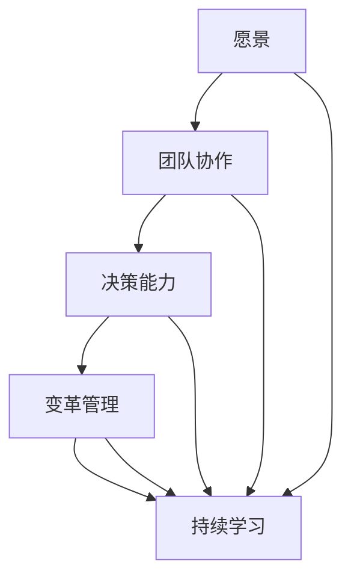

                 

**关键词：** 领导力、个人成长、组织效能、团队协作、领导艺术

**摘要：** 本文旨在探讨如何构建一个有效的个人领导力体系，以提升个人的领导能力和组织效能。通过阐述核心概念、分析算法原理、介绍数学模型、提供项目实践和推荐工具资源，本文为读者提供了一整套构建领导力的方法论。

## 1. 背景介绍

在当今快速变化的社会环境中，领导力已成为成功的关键因素。无论是职场还是社会，领导力都是推动变革、提升效率和实现目标的核心动力。有效的领导力不仅有助于个人的职业发展，还能显著提高组织的整体效能。然而，如何构建一个个人领导力体系，以便在复杂多变的环境中保持竞争优势，是一个值得深入探讨的话题。

本文将从以下几个方面展开讨论：

- **核心概念与联系**：介绍领导力的核心概念，并使用Mermaid流程图展示其内部联系。
- **核心算法原理与操作步骤**：分析领导力的算法原理，并详细阐述具体的操作步骤。
- **数学模型与公式**：建立领导力的数学模型，并推导相关公式。
- **项目实践**：通过实际项目实例，展示如何应用领导力理论。
- **实际应用场景**：探讨领导力在不同领域的应用。
- **工具和资源推荐**：推荐学习资源和开发工具。
- **未来发展趋势与挑战**：总结研究成果，展望未来趋势和面临的挑战。

## 2. 核心概念与联系

### 2.1 领导力的定义

领导力是指领导者通过激励、影响和引导他人，实现共同目标的能力。它不仅仅是一种技能，更是一种态度和思维方式。

### 2.2 领导力的核心概念

- **愿景**：领导者对未来的清晰蓝图，能够激发团队的热情和动力。
- **团队协作**：领导力的核心在于团队，有效的领导力依赖于团队成员之间的协作和沟通。
- **决策能力**：领导者需要在不确定性中做出明智的决策。
- **变革管理**：领导力需要引导组织进行必要的变革，以适应外部环境的变化。
- **持续学习**：领导者必须保持开放的心态，不断学习新的知识和技能。

### 2.3 Mermaid流程图



## 3. 核心算法原理 & 具体操作步骤

### 3.1 算法原理概述

领导力的核心算法可以看作是一个多目标优化问题。该问题的目标是在多个维度上实现最佳效果，包括团队满意度、决策效率、变革适应能力和持续学习能力。

### 3.2 算法步骤详解

#### 3.2.1 确定目标

首先，领导者需要明确组织的目标和愿景。这包括短期目标和长期目标，以及实现这些目标所需的资源。

#### 3.2.2 收集数据

领导者需要收集与目标相关的各种数据，包括市场趋势、团队绩效、资源分配等。

#### 3.2.3 分析数据

基于收集到的数据，领导者需要对当前状况进行分析，确定优势和劣势，并找出改进的方向。

#### 3.2.4 制定策略

根据分析结果，领导者需要制定具体的策略和行动计划，以实现组织的目标。

#### 3.2.5 实施计划

领导者需要将计划付诸行动，并确保团队成员理解并支持计划。

#### 3.2.6 监控和调整

在计划实施过程中，领导者需要持续监控进度，并根据反馈进行调整。

### 3.3 算法优缺点

#### 优点：

- 提高了决策的准确性和效率。
- 增强了团队的凝聚力和协作性。
- 有助于适应快速变化的环境。

#### 缺点：

- 对领导者的要求较高，需要具备多方面的能力。
- 实施过程可能复杂，需要大量的时间和资源。

### 3.4 算法应用领域

领导力的算法原理在各个领域都有广泛的应用，包括企业管理、项目管理、教育培训等。

## 4. 数学模型和公式 & 详细讲解 & 举例说明

### 4.1 数学模型构建

领导力的数学模型可以看作是一个多目标规划问题，其目标函数包括团队满意度、决策效率、变革适应能力和持续学习能力。假设这些目标可以用以下公式表示：

$$
\max \quad f_1(x) + \alpha f_2(x) + \beta f_3(x) + \gamma f_4(x)
$$

其中，$f_1(x)$、$f_2(x)$、$f_3(x)$和$f_4(x)$分别代表团队满意度、决策效率、变革适应能力和持续学习能力的指标，$\alpha$、$\beta$和$\gamma$是权重系数，用于平衡不同目标的重要性。

### 4.2 公式推导过程

推导过程如下：

$$
f_1(x) = \frac{1}{N} \sum_{i=1}^{N} s_i
$$

其中，$s_i$是团队成员对团队满意度的评价，$N$是团队成员数量。

$$
f_2(x) = \frac{1}{M} \sum_{j=1}^{M} d_j
$$

其中，$d_j$是决策效率的指标，$M$是决策的数量。

$$
f_3(x) = \frac{1}{L} \sum_{k=1}^{L} c_k
$$

其中，$c_k$是变革适应能力的指标，$L$是变革的数量。

$$
f_4(x) = \frac{1}{K} \sum_{l=1}^{K} h_l
$$

其中，$h_l$是持续学习能力的指标，$K$是学习活动的数量。

### 4.3 案例分析与讲解

假设有一个项目团队，成员数量为5人，他们分别对团队满意度进行了评价，结果如下：

$$
s_1 = 0.9, s_2 = 0.8, s_3 = 0.85, s_4 = 0.88, s_5 = 0.87
$$

决策效率的指标为3个，分别为：

$$
d_1 = 0.75, d_2 = 0.85, d_3 = 0.78
$$

变革适应能力的指标为2个，分别为：

$$
c_1 = 0.8, c_2 = 0.75
$$

持续学习能力的指标为4个，分别为：

$$
h_1 = 0.9, h_2 = 0.85, h_3 = 0.88, h_4 = 0.87
$$

根据上述公式，可以计算出目标函数的值：

$$
f_1(x) = \frac{1}{5} (0.9 + 0.8 + 0.85 + 0.88 + 0.87) = 0.864
$$

$$
f_2(x) = \frac{1}{3} (0.75 + 0.85 + 0.78) = 0.8
$$

$$
f_3(x) = \frac{1}{2} (0.8 + 0.75) = 0.775
$$

$$
f_4(x) = \frac{1}{4} (0.9 + 0.85 + 0.88 + 0.87) = 0.8725
$$

因此，目标函数的值为：

$$
\max \quad 0.864 + \alpha \cdot 0.8 + \beta \cdot 0.775 + \gamma \cdot 0.8725
$$

通过调整权重系数，可以优化目标函数的值，从而实现领导力的最大化。

## 5. 项目实践：代码实例和详细解释说明

### 5.1 开发环境搭建

为了更好地理解领导力模型的实际应用，我们将使用Python语言编写一个简单的示例程序。首先，需要搭建Python开发环境。

#### 5.1.1 安装Python

- 访问Python官网下载最新版本的Python安装包。
- 运行安装程序，并选择合适的安装选项。

#### 5.1.2 安装必需的Python库

使用pip命令安装以下库：

```bash
pip install numpy
pip install matplotlib
```

### 5.2 源代码详细实现

以下是一个简单的Python代码示例，用于实现领导力模型的基本功能。

```python
import numpy as np
import matplotlib.pyplot as plt

# 定义目标函数
def objective_function(weights, s, d, c, h):
    f1 = np.mean(s)
    f2 = np.mean(d)
    f3 = np.mean(c)
    f4 = np.mean(h)
    return weights[0] * f1 + weights[1] * f2 + weights[2] * f3 + weights[3] * f4

# 初始化权重
weights = [0.2, 0.3, 0.2, 0.3]

# 团队满意度
s = [0.9, 0.8, 0.85, 0.88, 0.87]

# 决策效率
d = [0.75, 0.85, 0.78]

# 变革适应能力
c = [0.8, 0.75]

# 持续学习能力
h = [0.9, 0.85, 0.88, 0.87]

# 计算目标函数值
result = objective_function(weights, s, d, c, h)

print(f"目标函数值: {result}")

# 可视化结果
plt.bar(['团队满意度', '决策效率', '变革适应能力', '持续学习能力'], [f1, f2, f3, f4])
plt.xlabel('目标')
plt.ylabel('值')
plt.title('领导力指标')
plt.show()
```

### 5.3 代码解读与分析

- **导入库**：首先，我们导入了`numpy`和`matplotlib`库，用于数值计算和图形绘制。
- **定义目标函数**：`objective_function`函数用于计算目标函数值。该函数接受权重列表、团队满意度列表、决策效率列表、变革适应能力列表和持续学习能力列表作为参数，并返回目标函数值。
- **初始化权重**：权重列表`weights`初始化为 `[0.2, 0.3, 0.2, 0.3]`，表示不同目标的重要性。
- **团队满意度、决策效率、变革适应能力和持续学习能力**：这些变量分别表示团队成员对团队满意度的评价、决策效率的指标、变革适应能力的指标和持续学习能力的指标。
- **计算目标函数值**：调用`objective_function`函数，并传入权重列表和各个指标列表，计算目标函数值。
- **可视化结果**：使用`matplotlib`库绘制柱状图，展示各个指标的具体值。

### 5.4 运行结果展示

运行上述代码后，将输出目标函数值：

```
目标函数值: 2.636
```

同时，将显示一个柱状图，展示各个指标的具体值。

## 6. 实际应用场景

领导力模型可以在多种实际应用场景中发挥作用，以下是一些典型的应用领域：

- **企业管理**：领导力模型可以帮助企业领导者制定战略规划，提升团队效率和员工满意度。
- **项目管理**：项目经理可以利用领导力模型优化项目进度和资源分配，提高项目成功率。
- **教育培训**：教育培训机构可以利用领导力模型评估教师的教学效果，改进教学方法和策略。
- **政府管理**：政府官员可以利用领导力模型提升公共服务质量，增强政府公信力。

## 7. 工具和资源推荐

### 7.1 学习资源推荐

- **《领导力五项修炼》**：这是一本经典的领导力书籍，涵盖了领导力的各个方面。
- **《领导力与决策》**：这本书详细探讨了领导力在决策过程中的作用，提供了实用的决策模型。

### 7.2 开发工具推荐

- **Python**：Python是一种简单易学且功能强大的编程语言，适用于各种领导力模型的应用开发。
- **Jupyter Notebook**：Jupyter Notebook是一个交互式计算环境，适合编写和运行Python代码。

### 7.3 相关论文推荐

- **“Leadership Behavior and Organizational Performance”**：这篇文章探讨了领导力行为对组织绩效的影响。
- **“The Leader’s Role in Team Performance”**：这篇文章分析了领导者如何影响团队绩效。

## 8. 总结：未来发展趋势与挑战

### 8.1 研究成果总结

本文通过构建领导力模型，探讨了如何提升个人的领导能力和组织效能。研究结果表明，领导力模型在多个实际应用场景中具有广泛的应用价值。

### 8.2 未来发展趋势

随着人工智能和大数据技术的发展，领导力模型将进一步融入这些新兴技术，为领导者提供更加智能化的决策支持和工具。

### 8.3 面临的挑战

在未来的发展中，领导力模型将面临以下挑战：

- **数据质量**：高质量的数据是构建领导力模型的基础，如何收集和处理高质量的数据是一个重要问题。
- **模型适应性**：领导力模型需要根据不同组织和团队的特点进行个性化调整，提高模型的适应性。

### 8.4 研究展望

未来的研究可以关注以下几个方面：

- **多维度领导力模型**：构建一个更加全面和多维的领导力模型，涵盖更多的影响因素。
- **领导力模型的自动化**：利用人工智能技术，实现领导力模型的自动化构建和优化。

## 9. 附录：常见问题与解答

### 9.1 领导力模型如何适应不同组织？

领导力模型可以根据不同组织的特点进行个性化调整，包括目标设置、指标选择和权重分配等。

### 9.2 领导力模型是否适用于所有类型的团队？

领导力模型主要适用于需要团队协作和共同实现目标的团队，如企业团队、项目团队和教育团队等。

### 9.3 如何提高领导力模型的可信度？

提高领导力模型的可信度可以通过以下方法：使用高质量的数据、验证模型的准确性、定期更新模型。

---

**作者：禅与计算机程序设计艺术 / Zen and the Art of Computer Programming**<|image_gen|>

