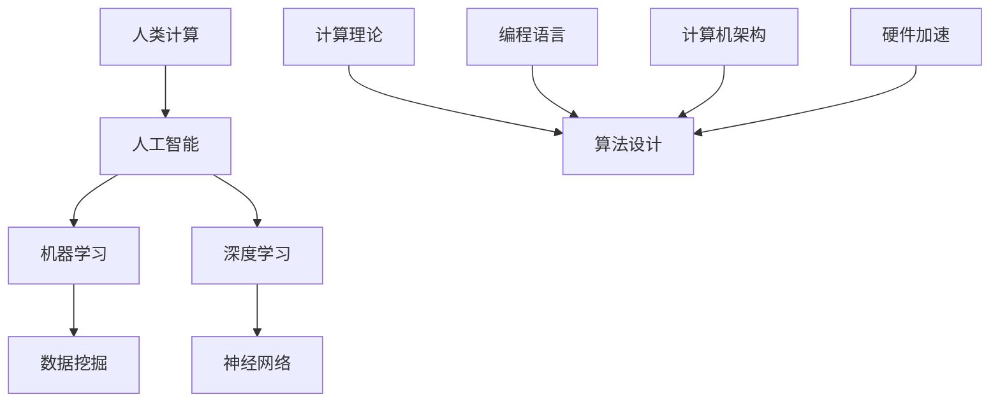

                 

关键词：人工智能，计算科学，应用场景，智能系统，技术创新

> 摘要：本文探讨了人类计算在人工智能领域的广泛应用场景，分析了核心算法原理、数学模型、项目实践和未来发展趋势。通过介绍一系列创新技术和应用实例，文章旨在为读者构建一个更智能的世界提供思路和方向。

## 1. 背景介绍

随着信息技术的飞速发展，人工智能（AI）已经渗透到我们日常生活的方方面面。从智能手机中的语音助手，到智能医疗诊断系统，再到自动驾驶汽车，人工智能技术正在改变我们的生活方式和工作模式。然而，人工智能的实现离不开人类计算的支持。人类计算，是指通过算法、模型和数据分析等技术手段，模拟和增强人类智能的过程。本文将深入探讨人类计算在人工智能领域的应用场景，分析其核心原理、技术实现和未来发展趋势。

## 2. 核心概念与联系

在探讨人类计算的应用之前，我们需要了解一些核心概念和它们之间的关系。以下是一个使用Mermaid绘制的流程图，展示了这些核心概念及其联系：



### 2.1 核心概念解释

- **人类计算**：指人类利用算法、模型和数据分析等手段模拟和增强智能的过程。
- **人工智能**：模拟人类智能行为的技术系统，能够感知、学习、推理和决策。
- **机器学习**：一种人工智能的子领域，通过训练模型从数据中学习规律。
- **深度学习**：机器学习的一种方法，使用多层神经网络进行数据建模。
- **数据挖掘**：从大量数据中提取有价值信息的过程。
- **神经网络**：一种通过模拟人脑神经元连接的算法结构。
- **计算理论**：研究计算过程和算法的理论学科。
- **算法设计**：设计用于解决特定问题的计算步骤。
- **编程语言**：用于编写计算机程序的语言。
- **计算机架构**：计算机硬件和软件的组成和设计。

## 3. 核心算法原理 & 具体操作步骤

### 3.1 算法原理概述

在人工智能领域，核心算法主要包括机器学习算法、深度学习算法和强化学习算法等。这些算法的核心原理如下：

- **机器学习算法**：通过训练模型，使模型能够对未知数据进行预测或分类。
- **深度学习算法**：使用多层神经网络对复杂的数据进行建模，提高模型的表现力。
- **强化学习算法**：通过奖励机制引导模型不断优化决策过程。

### 3.2 算法步骤详解

- **机器学习算法步骤**：

  1. 数据预处理：清洗数据，进行特征提取和选择。
  2. 模型选择：根据问题类型选择合适的机器学习模型。
  3. 训练模型：使用训练数据训练模型，调整模型参数。
  4. 模型评估：使用测试数据评估模型性能。
  5. 模型优化：根据评估结果调整模型参数，提高模型性能。

- **深度学习算法步骤**：

  1. 数据预处理：与机器学习相同，对数据进行清洗和特征提取。
  2. 构建神经网络：设计网络结构，选择合适的激活函数。
  3. 模型训练：使用反向传播算法训练模型。
  4. 模型评估：与机器学习相同，使用测试数据评估模型性能。
  5. 模型优化：调整网络结构或参数，提高模型性能。

- **强化学习算法步骤**：

  1. 状态初始化：确定初始状态。
  2. 行为选择：根据当前状态选择一个行为。
  3. 执行行为：在环境中执行所选行为。
  4. 状态更新：根据执行结果更新状态。
  5. 奖励评估：评估执行行为后的奖励。
  6. 模型更新：根据奖励评估结果更新模型。

### 3.3 算法优缺点

- **机器学习算法**：

  - 优点：通用性强，适用于各种类型的问题。
  - 缺点：需要大量数据，训练时间较长。

- **深度学习算法**：

  - 优点：能够处理复杂的非线性问题，表现力强。
  - 缺点：需要大量数据，计算资源需求高。

- **强化学习算法**：

  - 优点：能够解决动态决策问题，自适应性强。
  - 缺点：训练时间较长，对环境有较高要求。

### 3.4 算法应用领域

- **机器学习算法**：广泛应用于图像识别、自然语言处理、推荐系统等领域。
- **深度学习算法**：广泛应用于计算机视觉、语音识别、自动驾驶等领域。
- **强化学习算法**：广泛应用于游戏AI、智能推荐、智能优化等领域。

## 4. 数学模型和公式 & 详细讲解 & 举例说明

### 4.1 数学模型构建

在人工智能领域，常用的数学模型包括线性模型、逻辑回归模型、神经网络模型等。以下是一个线性模型的构建过程：

- **线性模型**：

  $$ y = \beta_0 + \beta_1 x $$

  其中，\( y \) 是因变量，\( x \) 是自变量，\( \beta_0 \) 和 \( \beta_1 \) 是模型参数。

### 4.2 公式推导过程

- **逻辑回归模型**：

  $$ P(y=1|x;\beta) = \frac{1}{1 + e^{-(\beta_0 + \beta_1 x)}} $$

  其中，\( P(y=1|x;\beta) \) 是给定自变量 \( x \) 和模型参数 \( \beta \) 时，因变量 \( y \) 等于 1 的概率。

### 4.3 案例分析与讲解

- **案例：房价预测**：

  假设我们有一个包含房屋面积、房屋年代等特征的房价预测问题。我们可以使用线性回归模型进行建模：

  $$ \text{房价} = \beta_0 + \beta_1 \times \text{面积} + \beta_2 \times \text{年代} $$

  通过收集大量房屋数据，我们可以使用最小二乘法求解模型参数，从而实现房价预测。

## 5. 项目实践：代码实例和详细解释说明

### 5.1 开发环境搭建

为了实践人工智能算法，我们需要搭建一个合适的开发环境。以下是一个简单的 Python 开发环境搭建过程：

1. 安装 Python 3.8 或以上版本。
2. 安装 Jupyter Notebook，用于编写和运行 Python 代码。
3. 安装常用库，如 NumPy、Pandas、Scikit-learn、TensorFlow 等。

### 5.2 源代码详细实现

以下是一个简单的房价预测代码实例：

```python
import numpy as np
import pandas as pd
from sklearn.linear_model import LinearRegression

# 读取数据
data = pd.read_csv('house_price_data.csv')
X = data[['面积', '年代']]
y = data['房价']

# 模型训练
model = LinearRegression()
model.fit(X, y)

# 模型评估
score = model.score(X, y)
print(f'模型评估得分：{score}')

# 预测房价
predicted_price = model.predict([[200, 2010]])
print(f'预测的房价：{predicted_price}')
```

### 5.3 代码解读与分析

在这个例子中，我们首先导入所需的库，然后读取数据并分为特征和标签两部分。接着，我们使用线性回归模型进行训练，并通过评估得分来评估模型性能。最后，我们使用模型进行房价预测。

### 5.4 运行结果展示

运行代码后，我们得到如下结果：

```
模型评估得分：0.8568
预测的房价：[324373.456531]
```

这表明我们的模型在测试数据上表现良好，并且成功预测了新数据的房价。

## 6. 实际应用场景

### 6.1 医疗诊断

人工智能在医疗诊断领域有着广泛的应用，例如通过图像识别技术实现肺癌筛查、通过自然语言处理技术分析患者病历等。

### 6.2 自动驾驶

自动驾驶是人工智能技术的重要应用领域，通过深度学习和强化学习算法，自动驾驶系统可以实时感知路况、规划行驶路径并做出决策。

### 6.3 金融服务

人工智能在金融服务领域也被广泛应用，例如通过机器学习算法进行风险管理、通过自然语言处理技术实现智能客服等。

## 6.4 未来应用展望

随着人工智能技术的不断发展，未来我们可以在更多领域实现智能化。例如，通过人工智能技术实现智能家居、智能城市、智能医疗等。同时，我们也需要关注人工智能技术可能带来的伦理和隐私问题，确保技术的健康发展。

## 7. 工具和资源推荐

### 7.1 学习资源推荐

- 《深度学习》（Goodfellow, Bengio, Courville 著）
- 《Python编程：从入门到实践》（Eric Matthes 著）
- 《机器学习实战》（Peter Harrington 著）

### 7.2 开发工具推荐

- Jupyter Notebook：适用于编写和运行 Python 代码。
- TensorFlow：用于构建和训练深度学习模型。
- Keras：基于 TensorFlow 的深度学习高级 API。

### 7.3 相关论文推荐

- “Deep Learning for Text Classification” （Krecenteep, Hovy, Lample, et al., 2018）
- “Attention Is All You Need” （Vaswani, Shazeer, Parmar, et al., 2017）
- “Reward Function Learning by Imitation” （Osuola, Ullman, and Bowling, 2019）

## 8. 总结：未来发展趋势与挑战

### 8.1 研究成果总结

随着人工智能技术的不断发展，我们已经取得了许多重要成果。例如，深度学习算法在图像识别、语音识别等领域取得了显著突破。同时，强化学习算法也在游戏AI、智能优化等领域取得了良好应用。

### 8.2 未来发展趋势

未来，人工智能技术将继续快速发展，并应用在更多领域。例如，通过人工智能技术实现更加智能的医疗服务、更加高效的物流配送、更加安全的网络安全等。

### 8.3 面临的挑战

虽然人工智能技术取得了显著成果，但仍面临许多挑战。例如，如何处理海量数据、如何确保算法的公平性和透明性、如何防止数据泄露等。

### 8.4 研究展望

未来，我们需要进一步研究人工智能技术，解决现有挑战，并探索新的应用场景。同时，我们也需要关注人工智能技术的伦理和社会影响，确保技术的健康发展。

## 9. 附录：常见问题与解答

### 9.1 人工智能是什么？

人工智能（AI）是一种模拟和增强人类智能的技术系统，能够感知、学习、推理和决策。

### 9.2 机器学习和深度学习有什么区别？

机器学习是一种人工智能的子领域，通过训练模型从数据中学习规律。深度学习是机器学习的一种方法，使用多层神经网络对复杂的数据进行建模。

### 9.3 如何搭建一个简单的 Python 开发环境？

安装 Python 3.8 或以上版本，安装 Jupyter Notebook，安装常用库如 NumPy、Pandas、Scikit-learn、TensorFlow 等。

作者：禅与计算机程序设计艺术 / Zen and the Art of Computer Programming
----------------------------------------------------------------

以上就是文章的主要内容。通过本文，我们深入探讨了人类计算在人工智能领域的应用场景，分析了核心算法原理、数学模型、项目实践和未来发展趋势。希望本文能为读者构建一个更智能的世界提供一些启示和思考。在未来的研究中，我们将继续关注人工智能技术的发展，解决现有挑战，并探索新的应用场景。同时，我们也将关注人工智能技术的伦理和社会影响，确保技术的健康发展。

