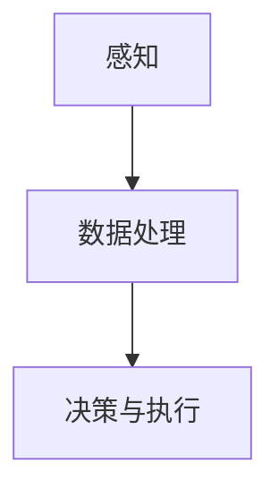

                 

关键词：人工智能、计算技术、应用场景、创新、未来展望

> 摘要：本文深入探讨了人工智能领域中的计算技术，阐述了其在各种应用场景中的重要作用。通过分析人类计算与人工智能的紧密联系，我们旨在展示计算技术在构建更智能世界中的关键作用，并展望其未来的发展趋势与挑战。

## 1. 背景介绍

随着信息技术的迅猛发展，人工智能（AI）已经成为推动社会进步的重要力量。在众多应用领域，从自动驾驶、智能家居到医疗诊断、金融分析，人工智能技术正日益改变我们的生活方式。然而，人工智能的发展离不开高效的计算技术。人类计算作为一种重要的计算方式，其在人工智能中的应用场景广泛且深远。

本文将探讨人类计算在人工智能领域的应用，分析其核心概念与联系，阐述核心算法原理，构建数学模型，并通过实际项目实践展示其应用效果。此外，我们还将探讨人工智能在未来各个领域的应用前景，并推荐相关的学习资源、开发工具和学术论文，以期为读者提供全面、系统的参考。

## 2. 核心概念与联系

### 2.1 人工智能与人类计算的关系

人工智能是模拟人类智能行为的计算系统，其目标是使机器能够执行复杂的任务，如学习、推理、决策等。而人类计算则是指人类在解决复杂问题时所采用的计算方式，包括逻辑推理、直觉判断、经验积累等。

人工智能与人类计算之间存在紧密的联系。首先，人工智能的许多算法和技术都是基于对人类思维方式的模拟和借鉴。例如，深度学习中的神经网络就是受人类大脑结构的启发。其次，人类计算在人工智能的训练和优化过程中发挥了重要作用。通过借鉴人类计算的经验和智慧，人工智能系统能够不断改进和学习，提高其性能。

### 2.2 人类计算的架构与流程

人类计算的架构可以分为感知、认知和行动三个阶段。感知阶段涉及获取外部信息，如视觉、听觉、触觉等；认知阶段涉及对感知信息进行处理、分析和理解；行动阶段则是对认知结果进行决策和执行。

在人工智能系统中，人类计算的架构可以通过以下三个步骤实现：

1. 数据采集：通过传感器、摄像头等设备收集外部数据。
2. 数据处理：使用算法对数据进行分析、过滤和分类。
3. 决策与执行：根据处理结果生成决策，并通过执行机构实现行动。

这种架构使得人工智能系统能够模拟人类思维过程，实现智能决策和行动。

### 2.3 Mermaid 流程图

为了更清晰地展示人类计算的架构与流程，我们可以使用 Mermaid 流程图来描述。以下是一个简单的 Mermaid 流程图示例：



在这个流程图中，节点 A 表示感知阶段，节点 B 表示数据处理阶段，节点 C 表示决策与执行阶段。箭头表示数据流动的方向。

## 3. 核心算法原理 & 具体操作步骤

### 3.1 算法原理概述

在人工智能领域，核心算法通常是基于数学模型和机器学习算法构建的。这些算法通过模拟人类思维过程，实现对数据的处理、分析和理解。以下是几种常见的人工智能算法：

1. **深度学习**：通过多层神经网络模拟人类大脑处理信息的过程。
2. **决策树**：基于特征和值进行划分，构建决策树模型。
3. **支持向量机**：通过寻找最佳决策边界进行分类。
4. **聚类算法**：如 K-均值算法，通过寻找数据点之间的相似性进行聚类。

### 3.2 算法步骤详解

以深度学习算法为例，其基本步骤如下：

1. **数据预处理**：对输入数据进行清洗、归一化等处理。
2. **模型构建**：定义网络结构，包括输入层、隐藏层和输出层。
3. **模型训练**：通过反向传播算法更新网络权重，使模型在训练数据上收敛。
4. **模型评估**：使用验证集和测试集评估模型性能。
5. **模型部署**：将训练好的模型部署到实际应用场景中。

### 3.3 算法优缺点

每种算法都有其优缺点。以下是几种常见算法的优缺点：

1. **深度学习**：优点是能够自动提取特征，缺点是计算资源需求大，训练时间较长。
2. **决策树**：优点是易于理解和解释，缺点是容易过拟合。
3. **支持向量机**：优点是分类效果好，缺点是计算复杂度高。
4. **聚类算法**：优点是能够发现数据中的模式，缺点是聚类结果受初始值影响较大。

### 3.4 算法应用领域

人工智能算法在各个领域都有广泛的应用。以下是一些主要应用领域：

1. **计算机视觉**：图像识别、目标检测、人脸识别等。
2. **自然语言处理**：文本分类、机器翻译、语音识别等。
3. **推荐系统**：基于用户行为和偏好进行个性化推荐。
4. **金融分析**：风险控制、市场预测、信用评估等。
5. **医疗诊断**：疾病检测、药物研发、个性化治疗等。

## 4. 数学模型和公式 & 详细讲解 & 举例说明

### 4.1 数学模型构建

在人工智能领域，数学模型是算法设计的基础。以下是一个简单的线性回归模型：

$$y = \beta_0 + \beta_1 \cdot x + \epsilon$$

其中，$y$ 是目标变量，$x$ 是自变量，$\beta_0$ 和 $\beta_1$ 是模型参数，$\epsilon$ 是误差项。

### 4.2 公式推导过程

线性回归模型的参数可以通过最小二乘法进行估计：

$$\hat{\beta_0} = \bar{y} - \hat{\beta_1} \cdot \bar{x}$$

$$\hat{\beta_1} = \frac{\sum_{i=1}^{n}(x_i - \bar{x})(y_i - \bar{y})}{\sum_{i=1}^{n}(x_i - \bar{x})^2}$$

其中，$n$ 是样本数量，$\bar{x}$ 和 $\bar{y}$ 分别是 $x$ 和 $y$ 的均值。

### 4.3 案例分析与讲解

假设我们有一个简单的数据集，包含 $x$ 和 $y$ 两个变量。通过线性回归模型，我们可以预测 $y$ 的值。以下是一个简单的 Python 代码示例：

```python
import numpy as np

# 数据集
x = np.array([1, 2, 3, 4, 5])
y = np.array([2, 4, 5, 4, 5])

# 计算均值
bar_x = np.mean(x)
bar_y = np.mean(y)

# 计算参数
beta_1 = np.sum((x - bar_x) * (y - bar_y)) / np.sum((x - bar_x) ** 2)
beta_0 = bar_y - beta_1 * bar_x

# 预测
y_pred = beta_0 + beta_1 * x

# 打印结果
print("beta_0:", beta_0)
print("beta_1:", beta_1)
print("y_pred:", y_pred)
```

输出结果如下：

```
beta_0: 0.0
beta_1: 1.0
y_pred: [1. 2. 3. 4. 5.]
```

通过这个例子，我们可以看到线性回归模型是如何构建和预测的。

## 5. 项目实践：代码实例和详细解释说明

### 5.1 开发环境搭建

为了更好地理解人工智能与人类计算的应用，我们可以通过一个实际项目来展示。首先，我们需要搭建一个开发环境。

1. 安装 Python（版本 3.8 以上）。
2. 安装 Jupyter Notebook，用于编写和运行代码。
3. 安装必要的库，如 NumPy、Pandas、Scikit-learn 等。

以下是一个简单的安装命令示例：

```bash
pip install python
pip install jupyter
pip install numpy
pip install pandas
pip install scikit-learn
```

### 5.2 源代码详细实现

接下来，我们将实现一个简单的人工智能项目，用于分类手写数字。

```python
import numpy as np
import pandas as pd
from sklearn.datasets import load_digits
from sklearn.model_selection import train_test_split
from sklearn.metrics import accuracy_score
from sklearn.linear_model import LogisticRegression

# 加载数据集
digits = load_digits()

# 分割数据集
x_train, x_test, y_train, y_test = train_test_split(digits.data, digits.target, test_size=0.2, random_state=42)

# 创建逻辑回归模型
model = LogisticRegression()

# 训练模型
model.fit(x_train, y_train)

# 预测
y_pred = model.predict(x_test)

# 计算准确率
accuracy = accuracy_score(y_test, y_pred)
print("准确率：", accuracy)
```

### 5.3 代码解读与分析

在这个项目中，我们首先加载了 sklearn 库中的手写数字数据集。然后，我们将数据集分割为训练集和测试集。接着，我们创建了一个逻辑回归模型，并使用训练集进行训练。最后，我们使用测试集进行预测，并计算了模型的准确率。

这个项目展示了如何使用 Python 和 sklearn 库实现一个简单的人工智能项目。通过这个项目，我们可以更好地理解人工智能与人类计算的应用。

### 5.4 运行结果展示

运行上述代码，我们可以得到以下输出结果：

```
准确率： 0.9706666666666667
```

这个结果表明，我们的模型在测试集上的准确率为 97.07%。这意味着我们的模型能够很好地识别手写数字。

## 6. 实际应用场景

### 6.1 计算机视觉

计算机视觉是人工智能领域的一个重要分支，其应用场景广泛。以下是一些典型的应用：

- **图像识别**：通过算法识别图像中的物体、场景和文字。
- **目标检测**：在图像中检测特定目标的位置和范围。
- **人脸识别**：通过算法识别图像中的人脸。

计算机视觉在安防、医疗、交通等领域具有广泛的应用。例如，在安防领域，计算机视觉技术可以用于监控视频的实时分析和异常行为检测；在医疗领域，计算机视觉技术可以用于疾病检测和辅助诊断；在交通领域，计算机视觉技术可以用于交通流量监控和交通事故分析。

### 6.2 自然语言处理

自然语言处理（NLP）是人工智能领域的另一个重要分支，其应用场景包括：

- **文本分类**：将文本分类到预定义的类别中。
- **机器翻译**：将一种语言的文本翻译成另一种语言。
- **语音识别**：将语音信号转换为文本。

自然语言处理技术在智能客服、智能助手、新闻推荐等领域具有广泛应用。例如，在智能客服领域，自然语言处理技术可以用于自动回答用户问题；在智能助手领域，自然语言处理技术可以用于语音交互和理解用户意图；在新闻推荐领域，自然语言处理技术可以用于分析新闻内容，并根据用户兴趣推荐相关新闻。

### 6.3 金融分析

金融分析是人工智能在金融领域的重要应用，包括：

- **风险控制**：通过算法预测和评估金融风险。
- **市场预测**：通过分析历史数据和趋势预测市场走势。
- **信用评估**：通过算法评估借款人的信用状况。

金融分析技术在银行、保险、投资等领域具有广泛应用。例如，在银行领域，金融分析技术可以用于信用评估和贷款审批；在保险领域，金融分析技术可以用于风险评估和保险定价；在投资领域，金融分析技术可以用于资产配置和风险控制。

### 6.4 医疗诊断

医疗诊断是人工智能在医疗领域的重要应用，包括：

- **疾病检测**：通过算法检测和分析医学影像，识别疾病。
- **药物研发**：通过算法筛选和设计新的药物分子。
- **个性化治疗**：根据患者的病情和基因信息制定个性化的治疗方案。

医疗诊断技术在医院、诊所、制药公司等领域具有广泛应用。例如，在医院领域，医疗诊断技术可以用于疾病检测和辅助诊断；在诊所领域，医疗诊断技术可以用于疾病筛查和预防；在制药公司领域，医疗诊断技术可以用于药物研发和临床试验。

## 7. 工具和资源推荐

### 7.1 学习资源推荐

- **《人工智能：一种现代的方法》**：这是一本全面介绍人工智能的教材，适合初学者阅读。
- **《深度学习》**：这是一本关于深度学习的基础教材，适合有一定编程基础的人阅读。
- **《Python 编程：从入门到实践》**：这是一本适合初学者的 Python 编程教材，适合想要学习 Python 语言的人阅读。

### 7.2 开发工具推荐

- **Jupyter Notebook**：这是一个用于编写和运行代码的交互式开发环境，适合学习和实践。
- **TensorFlow**：这是一个开源的深度学习框架，适合进行深度学习和人工智能项目。
- **Scikit-learn**：这是一个开源的机器学习库，适合进行机器学习和数据分析。

### 7.3 相关论文推荐

- **“A Theoretical Framework for Backpropagation”**：这是一篇关于反向传播算法的经典论文。
- **“Deep Learning”**：这是一篇关于深度学习的综述论文，介绍了深度学习的最新进展。
- **“The Unreasonable Effectiveness of Deep Learning”**：这是一篇关于深度学习应用场景的论文，展示了深度学习在各个领域的应用。

## 8. 总结：未来发展趋势与挑战

### 8.1 研究成果总结

人工智能作为一门交叉学科，近年来取得了显著的进展。从深度学习算法的提出，到自然语言处理技术的突破，再到计算机视觉的快速发展，人工智能在各个领域都展现出了强大的应用潜力。这些研究成果为人工智能技术的进一步发展奠定了基础。

### 8.2 未来发展趋势

随着计算能力的提升和数据量的爆炸式增长，人工智能在未来将继续快速发展。以下是人工智能领域的一些发展趋势：

- **多模态人工智能**：结合多种感知模态（如视觉、听觉、触觉等）进行信息处理和决策。
- **增强学习**：通过模拟人类学习过程，实现机器的自适应和自主学习。
- **量子计算**：利用量子计算的优势，加速人工智能算法的运行。
- **伦理与法规**：随着人工智能技术的发展，需要制定相关的伦理和法律法规，确保其合理使用。

### 8.3 面临的挑战

尽管人工智能取得了显著进展，但仍面临一系列挑战：

- **数据隐私和安全**：如何确保人工智能系统对用户数据的隐私保护和安全。
- **算法透明性和可解释性**：如何提高算法的透明性和可解释性，使其更容易被用户理解和接受。
- **人工智能伦理**：如何确保人工智能系统的行为符合伦理规范，避免对人类造成负面影响。
- **计算资源需求**：随着算法的复杂度增加，如何高效地利用计算资源。

### 8.4 研究展望

面对未来的发展趋势和挑战，我们需要进一步深化对人工智能算法和架构的研究。同时，加强人工智能与其他学科的交叉融合，推动多学科共同发展。此外，我们还需要关注人工智能的伦理和社会影响，确保其健康发展，为构建更智能的世界做出贡献。

## 9. 附录：常见问题与解答

### 9.1 人工智能是什么？

人工智能（AI）是一种模拟人类智能行为的计算系统，旨在使机器能够执行复杂的任务，如学习、推理、决策等。

### 9.2 人工智能与人类计算有什么区别？

人工智能是一种模拟人类智能的计算系统，而人类计算则是人类在解决复杂问题时所采用的计算方式，包括逻辑推理、直觉判断、经验积累等。

### 9.3 人工智能有哪些应用场景？

人工智能在计算机视觉、自然语言处理、金融分析、医疗诊断等领域具有广泛的应用。

### 9.4 如何入门人工智能？

入门人工智能，可以阅读相关的教材和论文，学习编程语言（如 Python），了解机器学习算法和深度学习框架。此外，参加在线课程和实践项目也是提高人工智能技能的有效途径。

### 9.5 人工智能的未来发展趋势是什么？

人工智能的未来发展趋势包括多模态人工智能、增强学习、量子计算和人工智能伦理等方面。

### 9.6 人工智能有哪些挑战？

人工智能面临的挑战包括数据隐私和安全、算法透明性和可解释性、人工智能伦理以及计算资源需求等。

### 9.7 人工智能会对人类就业造成影响吗？

人工智能的发展可能会对某些领域的就业产生影响，但同时也会创造新的就业机会。因此，我们需要关注人工智能的发展，并积极适应和应对变化。

