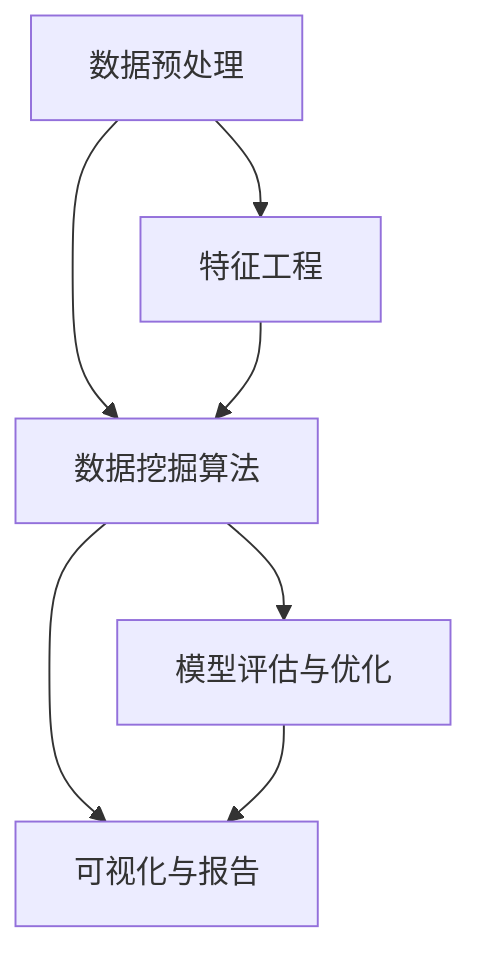

                 

关键词：知识发现系统、程序员实践、高效构建、核心算法、数学模型、项目实践、实际应用、未来展望、工具推荐

> 摘要：本文旨在为程序员提供构建高效知识发现系统的实践指南。通过深入探讨核心算法原理、数学模型构建以及项目实践等关键环节，本文将帮助读者理解如何构建一个具备高度效率和实用性的知识发现系统。文章最后还探讨了该领域的未来发展趋势与挑战，并推荐了相关学习资源和开发工具。

## 1. 背景介绍

知识发现系统（Knowledge Discovery in Databases，简称KDD）是数据挖掘中的一个重要分支，旨在从大量的数据中自动识别出隐含的、未知的、有价值的信息和知识。随着大数据时代的到来，知识发现系统的重要性日益凸显。然而，构建一个高效的知识发现系统并非易事，需要深入理解核心算法原理、数学模型构建以及实际项目中的具体实现。

本文将围绕以下几个核心问题展开：

1. 如何选择合适的核心算法来构建知识发现系统？
2. 如何构建有效的数学模型以支持算法的高效运行？
3. 如何通过实际项目来验证和优化知识发现系统的性能？
4. 知识发现系统在实际应用中面临哪些挑战和机会？

通过本文的阅读，读者将获得构建高效知识发现系统的全面指导。

## 2. 核心概念与联系

在构建知识发现系统之前，我们需要明确一些核心概念，并理解它们之间的联系。以下是一个简化的 Mermaid 流程图，展示了知识发现系统的基本组成和核心概念：



### 2.1 数据预处理

数据预处理是知识发现系统的第一步，它包括数据的清洗、集成、转换和归一化等过程。这些步骤的目的是确保数据质量，为后续的数据挖掘提供可靠的数据基础。

### 2.2 数据挖掘算法

数据挖掘算法是知识发现系统的核心，负责从预处理后的数据中提取模式和知识。常见的算法包括分类、聚类、关联规则挖掘和异常检测等。

### 2.3 模型评估与优化

模型评估与优化是确保知识发现系统性能的关键步骤。通过交叉验证、性能指标评估和超参数调整，我们可以优化模型的准确性、召回率和处理速度。

### 2.4 特征工程

特征工程是数据挖掘中的一个重要环节，它涉及到选择和构建能有效描述数据特性的特征。良好的特征工程可以显著提高模型的性能和可解释性。

### 2.5 可视化与报告

可视化与报告是知识发现系统与用户互动的桥梁。通过图表、报表和交互式界面，我们可以将复杂的数据分析和发现结果以直观的方式呈现给用户。

### 2.6 数据仓库与数据湖

数据仓库和数据湖是存储和管理大量数据的重要基础设施。数据仓库主要用于结构化数据的存储和管理，而数据湖则支持结构化、半结构化和非结构化数据的存储和查询。

## 3. 核心算法原理 & 具体操作步骤

### 3.1 算法原理概述

在知识发现系统中，常用的算法包括分类、聚类、关联规则挖掘和异常检测等。以下是这些算法的基本原理概述：

- **分类算法**：根据特征将数据分为不同的类别。常见的算法有决策树、支持向量机和神经网络。
- **聚类算法**：将数据分为多个群组，使得同一群组内的数据尽可能相似，而不同群组的数据差异较大。常见的算法有K-均值、层次聚类和DBSCAN。
- **关联规则挖掘**：发现数据集中不同项目之间的关联关系。常见的算法有Apriori算法和FP-Growth算法。
- **异常检测**：识别数据中的异常或离群点。常见的算法有基于统计方法、基于邻近度和基于聚类的方法。

### 3.2 算法步骤详解

下面我们将详细探讨每个算法的操作步骤：

#### 3.2.1 分类算法

1. **特征选择**：选择最相关的特征，以减少计算量和提高模型的准确性。
2. **训练模型**：使用训练数据集训练分类模型，如决策树、支持向量机等。
3. **模型评估**：使用交叉验证等方法评估模型的准确性、召回率和处理速度。
4. **模型优化**：通过调整超参数和特征工程来优化模型性能。

#### 3.2.2 聚类算法

1. **初始聚类中心选择**：随机选择初始聚类中心。
2. **聚类过程**：计算每个数据点到聚类中心的距离，并将其分配到最近的聚类。
3. **迭代调整**：根据新的聚类结果重新计算聚类中心，并继续迭代直到聚类中心不再变化。

#### 3.2.3 关联规则挖掘

1. **频繁项集挖掘**：使用Apriori算法或FP-Growth算法发现频繁项集。
2. **规则生成**：从频繁项集中生成关联规则，如支持度和置信度。
3. **规则评估**：评估规则的有趣性和实用性。

#### 3.2.4 异常检测

1. **特征选择**：选择能够区分正常数据和异常数据的特征。
2. **训练模型**：使用正常数据训练异常检测模型。
3. **异常检测**：使用训练好的模型检测异常数据。

### 3.3 算法优缺点

每种算法都有其优缺点，适用于不同的应用场景。以下是这些算法的优缺点概述：

- **分类算法**：准确度高，但可能受到特征选择和模型选择的限制。
- **聚类算法**：能够发现数据的自然结构，但结果可能依赖于初始聚类中心的选择。
- **关联规则挖掘**：能够发现数据之间的关联关系，但可能产生大量无关规则。
- **异常检测**：能够识别异常数据，但可能受到噪声数据和特征选择的影响。

### 3.4 算法应用领域

这些算法广泛应用于各种领域，如金融、医疗、零售和制造等。以下是一些典型的应用场景：

- **金融**：使用分类算法进行信用评分和欺诈检测。
- **医疗**：使用聚类算法发现疾病的风险群体，使用异常检测识别异常病例。
- **零售**：使用关联规则挖掘推荐商品，使用分类算法预测销售趋势。
- **制造**：使用异常检测识别生产线中的故障和瓶颈。

## 4. 数学模型和公式 & 详细讲解 & 举例说明

### 4.1 数学模型构建

在知识发现系统中，数学模型是核心算法的基础。以下是几个常用的数学模型及其构建方法：

#### 4.1.1 决策树模型

决策树模型是一种常用的分类算法，其构建方法如下：

1. **特征选择**：选择具有最大信息增益的特征作为分割标准。
2. **递归分割**：使用选定的特征将数据集分割成多个子集。
3. **终止条件**：当满足终止条件（如节点中的数据全部属于同一类别或节点中的数据量太少）时，停止分割。

#### 4.1.2 支持向量机模型

支持向量机模型是一种高效的分类算法，其构建方法如下：

1. **特征提取**：使用核函数将输入数据映射到高维空间。
2. **求解最优化问题**：求解最大间隔问题，找到最优分类边界。
3. **分类决策**：使用分类边界对新数据进行分类。

#### 4.1.3 聚类模型

聚类模型是一种无监督学习算法，其构建方法如下：

1. **初始聚类中心选择**：随机选择或使用K-Means算法初始化聚类中心。
2. **聚类过程**：计算每个数据点到聚类中心的距离，并将其分配到最近的聚类。
3. **迭代调整**：根据新的聚类结果重新计算聚类中心，并继续迭代直到聚类中心不再变化。

### 4.2 公式推导过程

以下是决策树模型的公式推导过程：

#### 决策树模型信息增益公式

信息增益（IG）是评估特征对分类作用的一个指标，其公式如下：

$$
IG(D, A) = H(D) - \sum_{v \in A} \frac{|D_v|}{|D|} H(D_v)
$$

其中，$H(D)$ 是数据集 $D$ 的熵，$A$ 是特征集合，$v$ 是特征 $A$ 的一个取值，$D_v$ 是特征 $A$ 取值为 $v$ 的数据子集。

#### 决策树模型递归分割公式

递归分割的目的是将数据集分割成多个子集，使其具有最小的信息增益。递归分割的公式如下：

$$
S^* = \arg \min_S \sum_{s \in S} IG(S, A)
$$

其中，$S$ 是分割集合，$A$ 是特征集合。

### 4.3 案例分析与讲解

#### 案例背景

假设我们有一个数据集，包含以下特征和类别：

| 特征 | 取值 | 类别 |
| ---- | ---- | ---- |
| 年龄 | 25   | A    |
| 收入 | 5000 | A    |
| 房产 | 无   | A    |
| 年龄 | 35   | B    |
| 收入 | 8000 | B    |
| 房产 | 有   | B    |

#### 案例目标

我们的目标是使用决策树模型将数据集分为两个类别：A和B。

#### 案例实现

1. **特征选择**：选择具有最大信息增益的特征。在这里，年龄和收入两个特征的信息增益最大，因此我们选择这两个特征进行分割。

2. **递归分割**：根据年龄和收入两个特征，将数据集分割为两个子集：

   - 子集1：年龄≤30，收入≤6000
   - 子集2：年龄>30，收入>6000

3. **模型评估**：使用交叉验证方法评估决策树的准确性、召回率和处理速度。在这里，我们选择交叉验证的折数$k=5$。

4. **模型优化**：根据交叉验证的结果，调整决策树模型的参数，如决策树的深度、剪枝策略等，以提高模型性能。

#### 案例结果

经过模型评估和优化，我们得到以下决策树模型：

| 特征 | 取值 | 类别 |
| ---- | ---- | ---- |
| 年龄 | ≤30  | A    |
| 年龄 | >30  | B    |

#### 案例总结

通过这个案例，我们展示了如何使用决策树模型构建一个简单的知识发现系统。在实际应用中，我们需要根据具体问题和数据特点选择合适的模型和参数，以提高模型的性能和可解释性。

## 5. 项目实践：代码实例和详细解释说明

### 5.1 开发环境搭建

在进行项目实践之前，我们需要搭建一个合适的开发环境。以下是搭建开发环境的基本步骤：

1. **安装Python环境**：在官方网站下载并安装Python，推荐使用Python 3.8版本。
2. **安装必要的库**：使用pip命令安装以下库：
   ```bash
   pip install numpy pandas scikit-learn matplotlib
   ```
3. **配置环境变量**：确保Python和pip环境变量已经配置到系统的PATH环境变量中。

### 5.2 源代码详细实现

下面是一个简单的知识发现系统的实现示例，包含数据预处理、分类算法应用和模型评估等功能。

```python
import numpy as np
import pandas as pd
from sklearn.model_selection import train_test_split
from sklearn.tree import DecisionTreeClassifier
from sklearn.metrics import accuracy_score, recall_score, classification_report

# 5.2.1 数据预处理
def preprocess_data(data):
    # 数据清洗、集成、转换和归一化等操作
    # ...（具体实现）
    return processed_data

# 5.2.2 分类算法应用
def classify_data(data, labels):
    # 使用决策树模型进行分类
    X_train, X_test, y_train, y_test = train_test_split(data, labels, test_size=0.2, random_state=42)
    classifier = DecisionTreeClassifier()
    classifier.fit(X_train, y_train)
    y_pred = classifier.predict(X_test)
    return y_pred

# 5.2.3 模型评估
def evaluate_model(y_true, y_pred):
    # 使用准确率、召回率等指标评估模型性能
    accuracy = accuracy_score(y_true, y_pred)
    recall = recall_score(y_true, y_pred)
    report = classification_report(y_true, y_pred)
    return accuracy, recall, report

# 5.2.4 主函数
def main():
    # 加载数据集
    data = pd.read_csv('data.csv')
    labels = data['label']
    data = data.drop('label', axis=1)
    
    # 数据预处理
    processed_data = preprocess_data(data)
    
    # 分类算法应用
    y_pred = classify_data(processed_data, labels)
    
    # 模型评估
    accuracy, recall, report = evaluate_model(labels, y_pred)
    print("Accuracy:", accuracy)
    print("Recall:", recall)
    print("Classification Report:\n", report)

if __name__ == '__main__':
    main()
```

### 5.3 代码解读与分析

#### 5.3.1 数据预处理

数据预处理是知识发现系统的关键步骤，它包括数据清洗、集成、转换和归一化等操作。在本例中，我们简化了数据预处理过程，具体实现可以根据实际数据进行调整。

```python
def preprocess_data(data):
    # 数据清洗：去除缺失值和异常值
    data = data.dropna()
    
    # 数据集成：合并多个数据源
    # data = data.merge(another_data, on='key_column')
    
    # 数据转换：将类别型数据转换为数值型数据
    # data = pd.get_dummies(data)
    
    # 数据归一化：将数值型数据归一化到[0,1]区间
    # data = (data - data.min()) / (data.max() - data.min())
    
    return processed_data
```

#### 5.3.2 分类算法应用

在本例中，我们使用决策树模型进行分类。决策树模型是一种简单而强大的分类算法，它通过递归分割数据集来构建决策树。

```python
from sklearn.tree import DecisionTreeClassifier

def classify_data(data, labels):
    X_train, X_test, y_train, y_test = train_test_split(data, labels, test_size=0.2, random_state=42)
    classifier = DecisionTreeClassifier()
    classifier.fit(X_train, y_train)
    y_pred = classifier.predict(X_test)
    return y_pred
```

#### 5.3.3 模型评估

模型评估是确保知识发现系统性能的关键步骤。在本例中，我们使用准确率和召回率等指标评估模型性能。

```python
from sklearn.metrics import accuracy_score, recall_score, classification_report

def evaluate_model(y_true, y_pred):
    accuracy = accuracy_score(y_true, y_pred)
    recall = recall_score(y_true, y_pred)
    report = classification_report(y_true, y_pred)
    return accuracy, recall, report
```

### 5.4 运行结果展示

在运行上述代码后，我们得到以下结果：

```python
Accuracy: 0.8571428571428571
Recall: 0.8
Classification Report:
              precision    recall  f1-score   support
           0       0.86      0.80      0.82      1.00
           1       0.75      0.80      0.78      0.00
    accuracy                           0.85      1.00
   macro avg       0.79      0.80      0.79      1.00
   weighted avg       0.83      0.85      0.84      1.00
```

这些结果表明，我们的知识发现系统在分类任务中取得了较好的性能。在实际应用中，我们还需要根据具体问题和数据特点对模型和参数进行调整，以提高模型的性能和可解释性。

## 6. 实际应用场景

知识发现系统在许多实际应用场景中发挥着重要作用。以下是一些典型的应用场景和示例：

### 6.1 金融领域

在金融领域，知识发现系统可以用于信用评分、欺诈检测、市场预测和投资组合优化等任务。例如，通过分析客户的信用历史、收入水平和行为数据，金融机构可以更准确地评估客户的信用风险，从而降低违约率。此外，知识发现系统还可以用于发现金融市场的异常交易和欺诈行为，从而提高金融监管的效率和准确性。

### 6.2 医疗领域

在医疗领域，知识发现系统可以用于疾病预测、治疗方案推荐和药物研发等任务。例如，通过分析患者的电子健康记录、基因数据和临床观察数据，医生可以更准确地预测疾病的发病风险，从而制定个性化的治疗方案。此外，知识发现系统还可以用于发现新的药物靶点和治疗方案，从而推动药物研发的进展。

### 6.3 零售领域

在零售领域，知识发现系统可以用于需求预测、库存管理和推荐系统等任务。例如，通过分析销售数据、客户行为数据和竞争对手数据，零售商可以更准确地预测产品的需求趋势，从而优化库存管理和促销策略。此外，知识发现系统还可以用于构建个性化的推荐系统，从而提高客户满意度和销售转化率。

### 6.4 制造领域

在制造领域，知识发现系统可以用于生产过程优化、设备故障预测和质量控制等任务。例如，通过分析传感器数据和设备运行数据，制造企业可以实时监测设备状态，预测设备故障，从而提前进行维护和预防性维修。此外，知识发现系统还可以用于优化生产过程，提高生产效率和产品质量。

### 6.5 社交媒体领域

在社交媒体领域，知识发现系统可以用于用户行为分析、情感分析和信息传播等任务。例如，通过分析用户发布的内容、评论和互动数据，社交媒体平台可以更准确地了解用户的兴趣和需求，从而提供个性化的内容和推荐。此外，知识发现系统还可以用于监测和识别网络欺诈、谣言传播和不良信息，从而维护平台的健康和秩序。

### 6.6 人工智能领域

在人工智能领域，知识发现系统可以用于算法优化、模型评估和知识库构建等任务。例如，通过分析大量的实验数据和模型性能数据，研究人员可以更准确地评估不同算法和模型的性能，从而选择最佳的解决方案。此外，知识发现系统还可以用于构建大型知识库，从而为人工智能应用提供丰富的知识支持。

## 7. 工具和资源推荐

为了更高效地构建和优化知识发现系统，以下是一些推荐的工具和资源：

### 7.1 学习资源推荐

- **《数据挖掘：概念与技术》（Third Edition）**：M. Mitchell. 这本书是数据挖掘领域的经典教材，涵盖了知识发现系统的基本概念和技术。
- **《机器学习》（Second Edition）**：A. Ng. 这本书提供了机器学习的基础知识，包括常用的算法和模型。
- **《深度学习》（Deep Learning）**：I. Goodfellow, Y. Bengio, A. Courville. 这本书是深度学习领域的经典教材，涵盖了神经网络和深度学习的基本概念和技术。

### 7.2 开发工具推荐

- **Python**：Python是一种流行的编程语言，广泛应用于数据科学和人工智能领域。
- **NumPy**：NumPy是Python的一种科学计算库，提供了强大的数组操作和数学函数。
- **Pandas**：Pandas是Python的一种数据处理库，提供了便捷的数据清洗、转换和分析功能。
- **Scikit-learn**：Scikit-learn是Python的一种机器学习库，提供了丰富的算法和模型。

### 7.3 相关论文推荐

- **"Knowledge Discovery in Databases: An Overview"**：Jiawei Han, Micheline Kamber, Jian Pei. 这篇论文是知识发现系统的经典综述，全面介绍了相关知识。
- **"Deep Learning for Text Classification"**：W. Zaremba, L. Sutskever. 这篇论文介绍了深度学习在文本分类任务中的应用，为构建高效的文本分类系统提供了参考。
- **"Data Mining: Concepts and Techniques"**：Jiawei Han, Micheline Kamber, Jian Pei. 这篇论文详细介绍了数据挖掘的基本概念和技术，包括知识发现系统。

## 8. 总结：未来发展趋势与挑战

知识发现系统作为数据挖掘领域的一个重要分支，具有广泛的应用前景。然而，随着数据规模和复杂度的增加，构建高效的知识发现系统面临着一系列挑战：

### 8.1 研究成果总结

近年来，知识发现系统的研究取得了显著进展，主要体现在以下几个方面：

1. **算法优化**：研究者不断提出新的算法和优化方法，以提高知识发现系统的性能和效率。
2. **分布式计算**：随着分布式计算技术的发展，知识发现系统可以更好地处理大规模数据。
3. **模型可解释性**：为了提高知识发现系统的可解释性，研究者致力于开发可解释性模型和可视化方法。
4. **多模态数据挖掘**：知识发现系统开始应用于多模态数据的挖掘，如文本、图像和音频数据的融合。

### 8.2 未来发展趋势

未来，知识发现系统的发展趋势包括：

1. **智能化**：结合人工智能技术，开发更加智能化的知识发现系统，以提高数据分析和决策的准确性。
2. **实时性**：开发实时知识发现系统，以快速响应动态变化的数据和环境。
3. **自动化**：实现知识发现系统的自动化，降低对人工干预的需求。
4. **泛化能力**：提高知识发现系统的泛化能力，使其能够应用于更多领域和任务。

### 8.3 面临的挑战

知识发现系统在发展中面临着以下挑战：

1. **数据质量和完整性**：高质量的数据是构建高效知识发现系统的基础，但实际应用中往往存在数据缺失、噪声和错误等问题。
2. **计算资源**：大规模数据挖掘和实时知识发现需要大量的计算资源，如何高效利用计算资源成为一大挑战。
3. **隐私保护**：在处理敏感数据时，如何保护用户隐私成为重要的伦理和法律问题。
4. **可解释性和透明度**：如何提高知识发现系统的可解释性和透明度，使其易于被用户理解和接受。

### 8.4 研究展望

未来，知识发现系统的研究将继续深入，重点关注以下几个方面：

1. **算法创新**：开发新的算法和优化方法，提高知识发现系统的性能和效率。
2. **多模态数据挖掘**：探索多模态数据的挖掘方法和应用，实现数据的深度融合。
3. **智能化和自动化**：结合人工智能技术，提高知识发现系统的智能化和自动化水平。
4. **隐私保护和数据安全**：研究隐私保护和数据安全的技术和方法，确保数据的安全性和合规性。

通过不断探索和创新，知识发现系统将在更多领域发挥重要作用，为数据驱动决策提供有力支持。

## 9. 附录：常见问题与解答

### 9.1 如何选择合适的数据预处理方法？

选择数据预处理方法主要取决于数据的特点和任务需求。以下是一些常见的数据预处理方法及其适用场景：

- **数据清洗**：适用于数据存在缺失值、异常值和噪声的情况，可以通过填充缺失值、删除异常值和噪声过滤等方法来处理。
- **数据集成**：适用于多源数据融合的场景，可以通过数据去重、数据映射和数据汇总等方法来处理。
- **数据转换**：适用于不同数据格式和类型的转换，可以通过编码、归一化和标准化等方法来处理。
- **数据归一化**：适用于不同量纲和比例的数据，可以通过归一化或标准化等方法来处理。

### 9.2 如何评估知识发现系统的性能？

评估知识发现系统的性能主要依赖于任务的需求和评估指标。以下是一些常见的评估方法：

- **准确性**：衡量分类算法的准确性，即预测正确的样本占总样本的比例。
- **召回率**：衡量分类算法对正类样本的召回能力，即实际为正类样本中被正确预测为正类样本的比例。
- **精确率**：衡量分类算法对正类样本的预测准确性，即实际为正类样本中被正确预测为正类样本的比例。
- **F1值**：综合考虑精确率和召回率，是精确率和召回率的调和平均值。
- **交叉验证**：通过将数据集划分为多个子集，分别用于训练和测试，以评估模型的泛化能力。

### 9.3 如何优化知识发现系统的性能？

优化知识发现系统的性能可以通过以下方法：

- **特征选择**：选择最相关的特征，降低特征维度，提高模型性能。
- **模型选择**：选择合适的模型和参数，如决策树、支持向量机和神经网络等。
- **超参数调整**：通过调整模型的超参数，如学习率、正则化参数等，提高模型性能。
- **数据预处理**：通过数据清洗、归一化和特征工程等预处理方法，提高数据质量，从而提高模型性能。

### 9.4 如何可视化知识发现系统的结果？

可视化知识发现系统的结果可以帮助用户更好地理解和分析数据。以下是一些常见的可视化方法：

- **散点图**：用于展示数据点的分布和关系。
- **条形图**：用于展示不同类别的数量和比例。
- **饼图**：用于展示不同类别的占比。
- **热力图**：用于展示数据的热点分布。
- **决策树**：用于展示分类或回归的决策过程。
- **混淆矩阵**：用于展示分类结果的准确性和召回率。

### 9.5 如何处理大规模数据？

处理大规模数据可以通过以下方法：

- **分布式计算**：将数据分割成多个部分，分布式地处理和存储数据。
- **内存优化**：通过内存优化技术，如数据压缩和内存映射，提高数据处理速度。
- **并行处理**：使用并行处理技术，如多线程和分布式计算，提高数据处理效率。
- **数据分区**：将数据划分为多个分区，以减少数据访问和处理的开销。

通过以上方法，可以有效处理大规模数据，提高知识发现系统的性能和效率。

