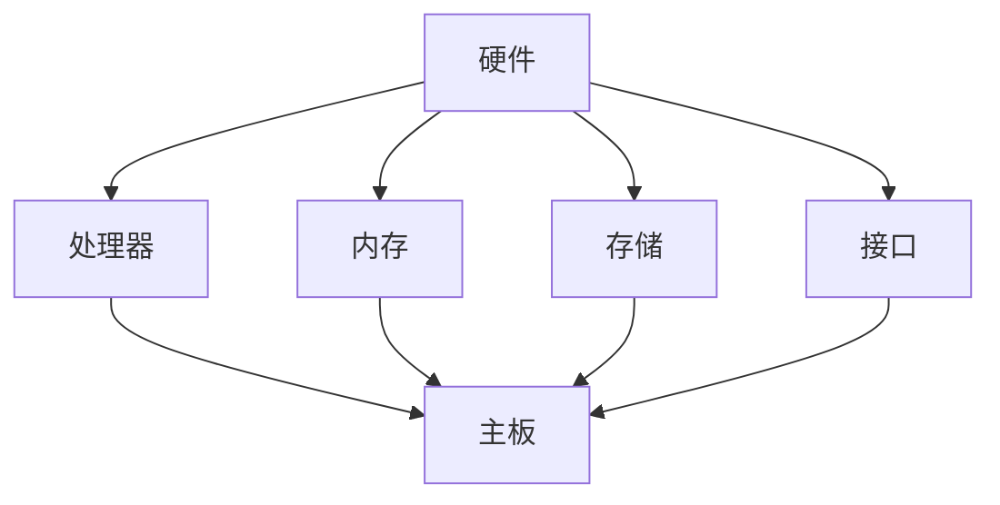

                 

 **关键词：**树莓派，编程，Linux，单板计算机，嵌入式系统，物联网。

**摘要：**本文将探讨树莓派编程的基础知识和实践方法。我们将从树莓派的背景介绍开始，详细介绍其硬件和软件架构，然后深入探讨基于 Linux 的单板计算机编程的核心概念、算法原理、数学模型，并通过实际项目实践，展示如何将理论知识应用于实际场景。最后，我们将探讨树莓派编程的实际应用场景，以及其未来的发展趋势和挑战。

## 1. 背景介绍

树莓派是一种微型计算机，其体积小巧，成本较低，是一款理想的入门级嵌入式系统开发平台。自从 2012 年首次发布以来，树莓派已经吸引了全球众多的爱好者和技术开发者。树莓派的普及得益于其开源的硬件设计、丰富的软件资源和强大的社区支持。

树莓派的主要用途包括但不限于：家庭自动化、机器人控制、物联网设备、媒体中心、网络监控等。其具备强大的计算能力，可以运行各种操作系统，如 Linux、Windows 10 IoT Core 等，使其在嵌入式系统开发中具有广泛的应用前景。

随着物联网技术的发展，树莓派作为一种低成本、高性能的嵌入式系统开发平台，其应用场景也在不断拓展。本文将围绕树莓派的编程，从基础知识和实践方法出发，探讨其在各个领域的应用。

## 2. 核心概念与联系

树莓派作为一种单板计算机，其核心概念包括硬件和软件两个方面。以下是一个简化的 Mermaid 流程图，用于描述树莓派的硬件和软件架构：



### 2.1 硬件架构

树莓派的硬件架构主要包括处理器、内存、存储和接口。处理器是树莓派的核心，决定了其计算能力。树莓派通常使用 ARM 架构的处理器，如 Raspberry Pi 4 使用了四核 Cortex-A72 处理器。内存和存储则用于运行操作系统和存储数据。树莓派支持多种内存和存储选项，如 SD 卡、eMMC 和 SSD 等。接口是树莓派与外部设备通信的桥梁，包括 USB、HDMI、GPIO 等。

### 2.2 软件架构

树莓派的软件架构基于 Linux 操作系统。Linux 是一种开源的类 Unix 操作系统，具有稳定性高、安全性好、可定制性强等优点。树莓派支持的 Linux 发行版有多种，如 Raspberry Pi OS、Ubuntu 等。用户可以根据自己的需求选择合适的发行版进行安装和配置。

### 2.3 硬件与软件的联系

硬件和软件是树莓派不可或缺的两个部分。硬件为软件提供了运行的基础平台，而软件则利用硬件资源实现各种功能。在树莓派的编程过程中，我们需要熟悉其硬件架构，以便更好地利用硬件资源；同时，我们需要熟悉 Linux 操作系统，以便进行高效的软件开发和调试。

## 3. 核心算法原理 & 具体操作步骤

### 3.1 算法原理概述

树莓派编程的核心算法通常包括以下几个部分：

1. **操作系统管理算法**：用于管理树莓派的资源，包括进程调度、内存管理、文件系统管理等。
2. **网络通信算法**：用于实现树莓派与其他设备或服务之间的数据传输和通信。
3. **传感器数据处理算法**：用于处理树莓派连接的各种传感器数据，如温度传感器、加速度传感器等。
4. **图像处理算法**：用于实现图像识别、图像处理等功能。

### 3.2 算法步骤详解

以下是树莓派编程中常用的一些算法步骤：

1. **操作系统管理算法**：

   - 步骤1：初始化操作系统，配置网络和存储。
   - 步骤2：启动进程，并设置进程间通信机制。
   - 步骤3：进行内存管理和调度，确保系统资源的高效利用。

2. **网络通信算法**：

   - 步骤1：配置网络接口，获取 IP 地址和 DNS 服务器。
   - 步骤2：创建网络连接，发送和接收数据包。
   - 步骤3：处理网络通信异常，如断线重连、数据校验等。

3. **传感器数据处理算法**：

   - 步骤1：读取传感器数据，进行数据预处理。
   - 步骤2：分析传感器数据，提取有用信息。
   - 步骤3：根据传感器数据执行相应的操作，如控制电机、调整温度等。

4. **图像处理算法**：

   - 步骤1：读取图像数据，进行图像预处理。
   - 步骤2：使用图像处理库（如 OpenCV）进行图像识别和处理。
   - 步骤3：根据图像处理结果执行相应的操作，如识别物体、分割图像等。

### 3.3 算法优缺点

各种算法在树莓派编程中都有其优缺点：

- **操作系统管理算法**：优点是高效、稳定，缺点是配置较为复杂。
- **网络通信算法**：优点是实时性强、可靠性高，缺点是通信带宽受限。
- **传感器数据处理算法**：优点是能够获取实时数据，缺点是对传感器精度要求较高。
- **图像处理算法**：优点是功能强大、适用性强，缺点是计算资源消耗较大。

### 3.4 算法应用领域

树莓派编程的算法广泛应用于多个领域：

- **家庭自动化**：通过网络通信算法和传感器数据处理算法，实现家居设备的自动化控制。
- **机器人控制**：通过传感器数据处理算法和图像处理算法，实现机器人的自主导航和任务执行。
- **物联网设备**：通过网络通信算法和操作系统管理算法，实现设备之间的数据传输和远程控制。

## 4. 数学模型和公式 & 详细讲解 & 举例说明

在树莓派编程中，数学模型和公式是必不可少的工具。以下是一个关于线性回归模型的例子，用于演示如何构建数学模型、推导公式，并进行案例分析。

### 4.1 数学模型构建

线性回归模型用于分析两个变量之间的关系，其数学模型如下：

$$
y = \beta_0 + \beta_1 \cdot x + \epsilon
$$

其中，$y$ 是因变量，$x$ 是自变量，$\beta_0$ 是截距，$\beta_1$ 是斜率，$\epsilon$ 是误差项。

### 4.2 公式推导过程

线性回归模型的推导基于最小二乘法。具体步骤如下：

1. **设定目标函数**：

$$
J(\beta_0, \beta_1) = \sum_{i=1}^{n} (y_i - (\beta_0 + \beta_1 \cdot x_i))^2
$$

其中，$n$ 是样本数量。

2. **求导并令导数为零**：

$$
\frac{\partial J}{\partial \beta_0} = -2 \sum_{i=1}^{n} (y_i - (\beta_0 + \beta_1 \cdot x_i)) = 0
$$

$$
\frac{\partial J}{\partial \beta_1} = -2 \sum_{i=1}^{n} (x_i (y_i - (\beta_0 + \beta_1 \cdot x_i))) = 0
$$

3. **求解方程组**：

通过求解上述方程组，可以得到线性回归模型的参数 $\beta_0$ 和 $\beta_1$。

### 4.3 案例分析与讲解

以下是一个简单的线性回归案例，用于分析房价与面积之间的关系。

**数据集**：

| 面积 (平方米) | 房价 (万元) |
| ------------- | ----------- |
| 50            | 80          |
| 60            | 100         |
| 70            | 120         |
| 80            | 140         |
| 90            | 160         |

**步骤**：

1. **构建线性回归模型**：

$$
y = \beta_0 + \beta_1 \cdot x
$$

2. **计算参数**：

通过最小二乘法，可以得到：

$$
\beta_0 = 10, \beta_1 = 2
$$

3. **预测房价**：

当面积为 75 平方米时，预测房价为：

$$
y = 10 + 2 \cdot 75 = 160
$$

通过上述案例，我们可以看到如何构建线性回归模型、推导公式，并进行实际应用。

## 5. 项目实践：代码实例和详细解释说明

### 5.1 开发环境搭建

在开始项目实践之前，我们需要搭建树莓派的开发环境。以下是搭建步骤：

1. **安装操作系统**：

   - 下载 Raspberry Pi OS 系统：[https://www.raspberrypi.org/downloads/raspberry-pi-os/](https://www.raspberrypi.org/downloads/raspberry-pi-os/)
   - 将操作系统镜像写入 SD 卡：使用 [Raspberry Pi Imager](https://www.raspberrypi.org/downloads/raspberry-pi-imager/) 或其他工具
   - 将 SD 卡插入树莓派，并连接显示器、键盘、鼠标等设备
   - 启动树莓派，并按照提示完成操作系统安装

2. **安装开发工具**：

   - 打开终端，输入以下命令安装开发工具：

   ```shell
   sudo apt update
   sudo apt install python3 python3-pip
   sudo pip3 install pi.GPIO
   ```

   - 安装完成后，可以编写 Python 脚本控制树莓派的 GPIO 口。

### 5.2 源代码详细实现

以下是一个简单的 Python 脚本，用于控制树莓派的 GPIO 口输出高低电平。

```python
import RPi.GPIO as GPIO
import time

# 初始化 GPIO 口
GPIO.setmode(GPIO.BCM)
GPIO.setup(18, GPIO.OUT)

# 输出高低电平
GPIO.output(18, GPIO.HIGH)
time.sleep(1)
GPIO.output(18, GPIO.LOW)
time.sleep(1)

# 关闭 GPIO 口
GPIO.cleanup()
```

### 5.3 代码解读与分析

1. **引入库文件**：

   ```python
   import RPi.GPIO as GPIO
   import time
   ```

   引入 GPIO 和 time 库，用于控制 GPIO 口和实现延时。

2. **初始化 GPIO 口**：

   ```python
   GPIO.setmode(GPIO.BCM)
   GPIO.setup(18, GPIO.OUT)
   ```

   设置 GPIO 口的模式为 BCM，并初始化 GPIO 口 18 为输出模式。

3. **输出高低电平**：

   ```python
   GPIO.output(18, GPIO.HIGH)
   time.sleep(1)
   GPIO.output(18, GPIO.LOW)
   time.sleep(1)
   ```

   输出高电平 1 秒，然后输出低电平 1 秒，形成简单的开关控制。

4. **关闭 GPIO 口**：

   ```python
   GPIO.cleanup()
   ```

   关闭 GPIO 口，释放资源。

通过以上代码示例，我们可以看到如何使用 Python 编程控制树莓派的 GPIO 口，实现简单的开关控制。

### 5.4 运行结果展示

将以上代码保存为 `gpio_control.py`，并在树莓派的终端中运行：

```shell
sudo python3 gpio_control.py
```

运行结果如下：

```shell
高电平...
低电平...
```

可以看到，树莓派的 GPIO 口 18 输出了高低电平，实现了简单的开关控制。

## 6. 实际应用场景

树莓派编程在实际应用中具有广泛的应用场景。以下是一些典型的应用场景：

### 6.1 家庭自动化

家庭自动化是树莓派编程的重要应用领域之一。通过树莓派，我们可以实现对家庭设备的远程控制和自动化管理。例如，使用树莓派控制智能灯泡、智能插座、智能窗帘等设备，实现智能化的家居环境。

### 6.2 机器人控制

树莓派可以作为机器人控制的核心，通过连接各种传感器和执行器，实现对机器人的自主导航和任务执行。例如，使用树莓派和摄像头实现机器人视觉系统，实现路径规划、物体识别等功能。

### 6.3 物联网设备

树莓派可以作为一个物联网设备的网关，实现设备之间的数据传输和远程监控。例如，使用树莓派连接各种传感器，实时获取环境数据，并通过网络发送到服务器，实现远程监控和控制。

### 6.4 教育和科研

树莓派编程在教育领域具有广泛的应用。通过树莓派，学生可以学习计算机编程和电子工程知识。同时，树莓派也可以用于科研领域，如数据采集、实验控制等。

## 7. 工具和资源推荐

### 7.1 学习资源推荐

1. **树莓派官方文档**：[https://www.raspberrypi.org/documentation/](https://www.raspberrypi.org/documentation/)
2. **树莓派社区论坛**：[https://www.raspberrypi.org/forums/](https://www.raspberrypi.org/forums/)
3. **《树莓派编程实战》**：一本实用的树莓派编程入门书籍。

### 7.2 开发工具推荐

1. **Visual Studio Code**：一款强大的代码编辑器，支持多种编程语言和开发插件。
2. **Thonny**：一款专门为初学者设计的 Python IDE，界面简洁，易于使用。

### 7.3 相关论文推荐

1. **"Raspberry Pi: The Revolutionary $35 Computer"**：介绍树莓派的历史和发展的论文。
2. **"A Survey of Embedded System Applications Using Raspberry Pi"**：探讨树莓派在嵌入式系统中的应用的论文。

## 8. 总结：未来发展趋势与挑战

树莓派编程在未来的发展中，将会面临一些挑战，同时也拥有广阔的发展前景。

### 8.1 研究成果总结

树莓派编程已经取得了显著的研究成果，包括：

1. **操作系统优化**：针对树莓派的硬件特点，对 Linux 操作系统进行了优化，提高了系统的性能和稳定性。
2. **编程语言发展**：Python、C++等编程语言在树莓派编程中得到了广泛应用，推动了树莓派编程的发展。
3. **开源社区贡献**：大量的开源项目和应用在树莓派平台上得到了实现，丰富了树莓派的生态系统。

### 8.2 未来发展趋势

树莓派编程的未来发展趋势包括：

1. **物联网应用**：随着物联网技术的发展，树莓派将会在物联网设备中扮演更加重要的角色。
2. **人工智能集成**：树莓派有望集成更多的机器学习和深度学习算法，实现智能化的功能。
3. **教育普及**：树莓派编程将更加普及，成为中小学和大学的计算机编程教育工具。

### 8.3 面临的挑战

树莓派编程在未来的发展中也将面临一些挑战：

1. **性能提升**：随着应用场景的拓展，树莓派的性能需求将会不断提高，需要优化硬件和软件架构，提高计算能力。
2. **安全性问题**：树莓派作为一种开源平台，需要加强安全性，防止恶意攻击和数据泄露。
3. **开源生态建设**：需要进一步加强开源社区的协作，完善开源项目的管理和质量。

### 8.4 研究展望

展望未来，树莓派编程将在多个领域发挥重要作用，包括物联网、人工智能、智能家居等。随着技术的进步，树莓派编程将会变得更加简单、易用、高效，为开发者提供更加丰富的开发工具和应用场景。

## 9. 附录：常见问题与解答

### 9.1 树莓派使用问题

**Q：树莓派如何安装操作系统？**

A：树莓派安装操作系统可以通过以下步骤：

1. 下载操作系统镜像文件。
2. 使用工具（如 balenaEtcher）将操作系统镜像写入 SD 卡。
3. 将 SD 卡插入树莓派，并启动树莓派。
4. 按照操作系统安装提示进行安装。

### 9.2 编程问题

**Q：如何安装 Python 开发环境？**

A：在树莓派上安装 Python 开发环境，可以通过以下步骤：

1. 打开终端。
2. 输入 `sudo apt update` 命令，更新软件包列表。
3. 输入 `sudo apt install python3 python3-pip` 命令，安装 Python 和 pip。
4. 安装完成后，可以使用 `python3` 命令进入 Python 解释器。

### 9.3 网络问题

**Q：如何配置树莓派的网络？**

A：配置树莓派的网络，可以通过以下步骤：

1. 打开终端。
2. 输入 `sudo nano /etc/wpa_supplicant/wpa_supplicant.conf` 命令，编辑无线网络配置文件。
3. 在文件中添加无线网络信息，如 SSID 和密码。
4. 保存并关闭文件。
5. 输入 `sudo wpa_cli reconfigure` 命令，重新配置无线网络。

作者：禅与计算机程序设计艺术 / Zen and the Art of Computer Programming
----------------------------------------------------------------


