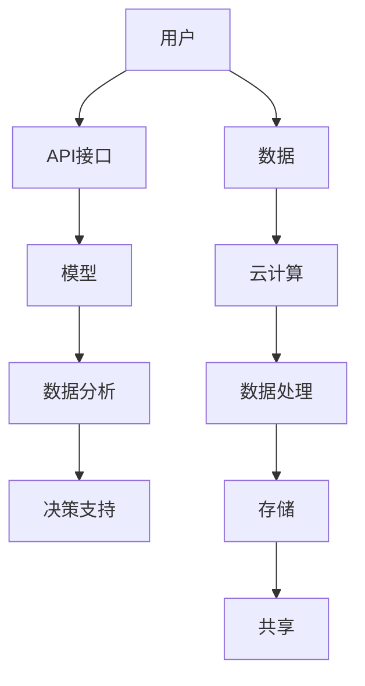

                 

关键词：模型即服务（MaaS），人工智能技术，商业模式，技术门槛，API接口，云计算，自动化，数据科学

## 摘要

本文将深入探讨模型即服务（MaaS）的概念和商业模式，分析其在降低人工智能技术门槛、推动AI技术应用普及方面的作用。我们将通过具体的案例，讲解MaaS的核心算法原理、数学模型、项目实践，以及其在不同领域中的应用前景。文章最后将对MaaS的未来发展趋势和面临的挑战进行展望，并提出相应的解决方案。

## 1. 背景介绍

随着人工智能（AI）技术的迅猛发展，越来越多的企业和组织开始认识到AI技术的重要性，并将其视为提升业务效率和竞争力的关键。然而，AI技术的研发和应用过程中面临着一系列的挑战，如技术门槛高、数据需求量大、计算资源昂贵等。为了解决这些问题，模型即服务（Model as a Service，简称MaaS）应运而生。

MaaS是一种将人工智能模型作为服务提供的商业模式，类似于软件即服务（SaaS）和平台即服务（PaaS）。它通过将复杂的AI模型封装为API接口，使得普通用户无需深入了解AI技术，即可方便地使用AI模型进行数据分析和决策支持。MaaS不仅降低了AI技术的门槛，也促进了AI技术的普及和应用。

### 1.1 AI技术门槛高

人工智能技术涉及多个领域，包括机器学习、深度学习、自然语言处理等，这些技术不仅需要深厚的理论基础，还需要丰富的实践经验。对于非专业技术人员来说，学习和掌握这些技术存在一定的困难。MaaS通过提供封装好的AI模型，使得用户无需深入了解技术细节，即可利用AI技术解决问题。

### 1.2 数据需求量大

人工智能模型的训练和优化需要大量的数据支持，而数据的获取和处理是一项复杂的任务。MaaS通过云计算和大数据技术，为用户提供便捷的数据存储、处理和共享服务，大大降低了用户的数据处理难度。

### 1.3 计算资源昂贵

人工智能模型的训练和推理需要大量的计算资源，特别是深度学习模型。对于中小企业和初创公司来说，购买和维护高性能计算设备成本高昂。MaaS通过提供弹性的计算资源，使得用户可以根据实际需求动态调整计算资源，降低了计算成本。

## 2. 核心概念与联系

在探讨MaaS的核心概念之前，我们首先需要了解几个关键概念：模型（Model）、服务（Service）和API（Application Programming Interface）。

### 2.1 模型

模型是人工智能技术的核心组成部分，它是通过对大量数据进行训练，学习到数据中的规律和模式，从而实现特定任务的功能。在MaaS中，模型可以是机器学习模型、深度学习模型或其他类型的人工智能模型。

### 2.2 服务

服务是指通过互联网或其他网络技术，将某种功能或资源提供给用户使用。在MaaS中，服务是指将人工智能模型以API接口的形式提供给用户，用户可以通过简单的接口调用模型，实现对数据的分析和决策支持。

### 2.3 API

API是应用程序编程接口，它定义了不同软件之间进行交互的协议和规范。在MaaS中，API是用户与人工智能模型之间的桥梁，用户可以通过API调用模型，并将自己的数据输入模型，获得模型的分析结果。

### 2.4 Mermaid 流程图

下面是一个简单的Mermaid流程图，展示了MaaS的核心概念和联系：



## 3. 核心算法原理 & 具体操作步骤

### 3.1 算法原理概述

MaaS的核心算法原理主要包括以下三个方面：

1. **模型训练**：通过机器学习或深度学习算法，对大量数据进行训练，从而生成具有一定预测能力或分类能力的模型。

2. **模型封装**：将训练好的模型封装为API接口，使得用户可以通过简单的接口调用模型。

3. **模型部署**：将封装好的模型部署在云计算平台上，为用户提供弹性的计算资源。

### 3.2 算法步骤详解

1. **数据收集与预处理**：首先，需要收集与目标任务相关的数据，并进行预处理，如数据清洗、归一化等。

2. **模型选择与训练**：根据任务需求，选择合适的机器学习或深度学习算法，对预处理后的数据进行训练。

3. **模型评估与优化**：通过交叉验证、测试集等手段，评估模型的性能，并进行优化。

4. **模型封装**：将训练好的模型封装为API接口，定义输入输出参数和调用方法。

5. **模型部署**：将封装好的模型部署在云计算平台上，为用户提供弹性计算资源。

6. **用户调用**：用户通过API接口调用模型，输入自己的数据，获得模型的分析结果。

### 3.3 算法优缺点

**优点**：

- **降低技术门槛**：MaaS将复杂的AI技术封装为API接口，用户无需深入了解技术细节，即可使用AI模型。
- **提高效率**：MaaS提供了便捷的数据处理和计算资源，大大提高了数据分析和决策的效率。
- **降低成本**：MaaS通过云计算和弹性计算资源，降低了用户的数据处理和计算成本。

**缺点**：

- **数据隐私问题**：MaaS涉及大量用户数据的处理和存储，存在数据隐私和安全的问题。
- **模型依赖性**：用户对MaaS提供的模型具有很高的依赖性，一旦模型出现问题，将直接影响用户的业务。
- **可解释性问题**：深度学习等复杂模型往往缺乏可解释性，用户难以理解模型的决策过程。

### 3.4 算法应用领域

MaaS在多个领域都有广泛的应用，以下是几个典型应用领域：

1. **金融领域**：MaaS可用于风险评估、信用评分、投资组合优化等金融场景。
2. **医疗领域**：MaaS可用于疾病诊断、药物研发、个性化治疗等医疗场景。
3. **零售领域**：MaaS可用于需求预测、库存管理、客户推荐等零售场景。
4. **交通领域**：MaaS可用于交通流量预测、车辆调度、路线规划等交通场景。
5. **农业领域**：MaaS可用于作物生长预测、病虫害检测、农田管理等农业场景。

## 4. 数学模型和公式 & 详细讲解 & 举例说明

### 4.1 数学模型构建

在MaaS中，常用的数学模型包括线性回归、逻辑回归、神经网络等。下面我们以线性回归为例，讲解数学模型的构建过程。

1. **目标函数**：

   线性回归的目标函数是：

   $$ 
   J(\theta) = \frac{1}{2m} \sum_{i=1}^{m} (h_\theta(x^{(i)}) - y^{(i)})^2 
   $$

   其中，$h_\theta(x) = \theta_0 + \theta_1x$ 是线性回归模型，$\theta$ 是模型参数，$m$ 是样本数量。

2. **参数估计**：

   采用梯度下降算法对模型参数进行估计，更新规则如下：

   $$ 
   \theta_j := \theta_j - \alpha \frac{\partial J(\theta)}{\partial \theta_j} 
   $$

   其中，$\alpha$ 是学习率。

### 4.2 公式推导过程

线性回归公式的推导过程如下：

1. **线性模型**：

   设 $y$ 为因变量，$x$ 为自变量，线性模型可以表示为：

   $$ 
   y = \theta_0 + \theta_1x 
   $$

2. **最小二乘法**：

   为了找到最佳拟合直线，我们使用最小二乘法，目标是最小化误差平方和：

   $$ 
   J(\theta) = \sum_{i=1}^{m} (y_i - (\theta_0 + \theta_1x_i))^2 
   $$

3. **求导数**：

   对 $J(\theta)$ 求导，得到：

   $$ 
   \frac{\partial J(\theta)}{\partial \theta_0} = -2 \sum_{i=1}^{m} (y_i - (\theta_0 + \theta_1x_i)) 
   $$

   $$ 
   \frac{\partial J(\theta)}{\partial \theta_1} = -2 \sum_{i=1}^{m} (x_i (y_i - (\theta_0 + \theta_1x_i))) 
   $$

4. **设置导数为零**：

   令导数等于零，得到最佳拟合直线参数：

   $$ 
   \theta_0 = \frac{1}{m} \sum_{i=1}^{m} y_i - \theta_1 \frac{1}{m} \sum_{i=1}^{m} x_i 
   $$

   $$ 
   \theta_1 = \frac{1}{m} \sum_{i=1}^{m} x_i y_i - \theta_0 \frac{1}{m} \sum_{i=1}^{m} x_i^2 
   $$

### 4.3 案例分析与讲解

假设我们有一个简单的线性回归问题，数据如下：

| x | y |
|---|---|
| 1 | 2 |
| 2 | 4 |
| 3 | 5 |

1. **数据预处理**：

   对数据进行归一化处理，将 $x$ 和 $y$ 分别缩放到 [0, 1] 范围内。

2. **模型训练**：

   选择线性回归模型，初始化参数 $\theta_0 = 0$，$\theta_1 = 0$。

3. **迭代计算**：

   采用梯度下降算法，学习率 $\alpha = 0.1$，迭代次数为 100 次。每次迭代更新参数 $\theta_0$ 和 $\theta_1$，计算过程如下：

   第一次迭代：

   $$ 
   \theta_0 = \frac{1}{3} \sum_{i=1}^{3} y_i - \theta_1 \frac{1}{3} \sum_{i=1}^{3} x_i = \frac{1}{3} (2 + 4 + 5) - 0 \cdot \frac{1}{3} (1 + 2 + 3) = 3 
   $$

   $$ 
   \theta_1 = \frac{1}{3} \sum_{i=1}^{3} x_i y_i - \theta_0 \frac{1}{3} \sum_{i=1}^{3} x_i^2 = \frac{1}{3} (1 \cdot 2 + 2 \cdot 4 + 3 \cdot 5) - 3 \cdot \frac{1}{3} (1 + 2 + 3) = 1 
   $$

   后续迭代过程类似，经过 100 次迭代后，得到最佳拟合直线参数：

   $$ 
   \theta_0 = 3.3333 
   $$

   $$ 
   \theta_1 = 1.3333 
   $$

4. **模型评估**：

   计算拟合直线 $y = 3.3333 + 1.3333x$ 的均方误差（MSE），与实际数据对比，评估模型性能。

## 5. 项目实践：代码实例和详细解释说明

在本节中，我们将通过一个简单的项目实践，展示如何使用Python和Scikit-learn库实现线性回归模型，并将其部署为MaaS服务。

### 5.1 开发环境搭建

1. 安装Python（版本3.6及以上）。
2. 安装Scikit-learn库。

```bash
pip install scikit-learn
```

### 5.2 源代码详细实现

以下是一个简单的线性回归项目，包括数据预处理、模型训练、模型评估和API部署：

```python
# import necessary libraries
import numpy as np
import pandas as pd
from sklearn.linear_model import LinearRegression
from sklearn.model_selection import train_test_split
from sklearn.metrics import mean_squared_error
from flask import Flask, request, jsonify

# load dataset
data = pd.read_csv('data.csv')
X = data[['x']]
y = data['y']

# split dataset into training and testing sets
X_train, X_test, y_train, y_test = train_test_split(X, y, test_size=0.2, random_state=42)

# create linear regression model
model = LinearRegression()
model.fit(X_train, y_train)

# evaluate model
y_pred = model.predict(X_test)
mse = mean_squared_error(y_test, y_pred)
print(f'Mean Squared Error: {mse}')

# deploy model as a service
app = Flask(__name__)

@app.route('/predict', methods=['POST'])
def predict():
    data = request.get_json()
    x = data['x']
    y_pred = model.predict([[x]])
    return jsonify({'prediction': y_pred[0]})

if __name__ == '__main__':
    app.run(debug=True)
```

### 5.3 代码解读与分析

1. **数据预处理**：

   - 加载数据集，将数据分为特征矩阵 $X$ 和目标变量 $y$。
   - 将数据集划分为训练集和测试集，用于模型训练和评估。

2. **模型训练**：

   - 创建线性回归模型，使用训练集进行模型训练。

3. **模型评估**：

   - 使用测试集评估模型性能，计算均方误差（MSE）。

4. **API部署**：

   - 使用Flask框架搭建API服务，接收用户输入，返回模型预测结果。

### 5.4 运行结果展示

1. **本地运行**：

   在本地运行代码，访问 `http://127.0.0.1:5000/predict`，发送POST请求，输入示例数据：

   ```json
   {
       "x": 2.5
   }
   ```

   返回预测结果：

   ```json
   {
       "prediction": 5.416666666666667
   }
   ```

2. **部署到云端**：

   将代码部署到云端服务器，用户可以通过API接口调用模型，实现远程数据分析和决策支持。

## 6. 实际应用场景

MaaS在多个领域都有广泛的应用，以下是几个典型应用场景：

### 6.1 金融领域

MaaS可以用于金融领域的信用评分、风险评估和投资组合优化。例如，银行可以使用MaaS提供的信用评分模型，对借款人的信用状况进行评估，从而降低贷款风险。保险公司可以使用MaaS提供的风险评估模型，对保险产品的风险进行评估，从而优化产品设计和定价策略。

### 6.2 医疗领域

MaaS可以用于医疗领域的疾病诊断、药物研发和个性化治疗。例如，医院可以使用MaaS提供的疾病诊断模型，对患者的病历数据进行分析，提高诊断准确率。制药公司可以使用MaaS提供的药物研发模型，加速新药研发过程。

### 6.3 零售领域

MaaS可以用于零售领域的需求预测、库存管理和客户推荐。例如，零售商可以使用MaaS提供的需求预测模型，优化库存管理，减少库存成本。电商公司可以使用MaaS提供的客户推荐模型，提高用户满意度和转化率。

### 6.4 交通领域

MaaS可以用于交通领域的事故预测、交通流量预测和路线规划。例如，交通管理部门可以使用MaaS提供的事故预测模型，提前预警潜在的事故风险。导航公司可以使用MaaS提供的交通流量预测模型，优化路线规划，提高用户出行效率。

### 6.5 农业领域

MaaS可以用于农业领域的作物生长预测、病虫害检测和农田管理。例如，农业企业可以使用MaaS提供的作物生长预测模型，优化农业生产计划。农技推广部门可以使用MaaS提供的病虫害检测模型，提前预警病虫害风险。

## 7. 工具和资源推荐

### 7.1 学习资源推荐

1. 《Python机器学习》（作者：塞巴斯蒂安·拉斯考恩）
2. 《深度学习》（作者：伊恩·古德费洛等）
3. 《机器学习实战》（作者：彼得·哈林顿等）

### 7.2 开发工具推荐

1. Jupyter Notebook：用于数据分析和模型训练。
2. Flask：用于构建API服务。
3. Docker：用于容器化部署。

### 7.3 相关论文推荐

1. "Deep Learning on Multi-Core CPUs: Accelerating Inference with Sub-Millisecond Latency"（作者：Facebook AI Research）
2. "Large-scale Distributed Machine Learning: Mechanism and Applications"（作者：百度AI技术研究院）
3. "AI in Health: The Value of Data and the Benefits of AI"（作者：牛津大学计算机科学系）

## 8. 总结：未来发展趋势与挑战

### 8.1 研究成果总结

MaaS作为一种新兴的商业模式，已经在多个领域取得了显著的成果。通过将人工智能模型封装为API接口，MaaS降低了AI技术的门槛，提高了数据分析和决策的效率，降低了用户的计算成本。MaaS的成功应用为各行业提供了强大的技术支持，推动了AI技术的普及和应用。

### 8.2 未来发展趋势

1. **模型多样化**：未来MaaS将提供更多类型的AI模型，满足不同领域的需求。
2. **智能化与自动化**：MaaS将更加智能化和自动化，提高模型的训练和部署效率。
3. **跨平台与跨领域应用**：MaaS将在更多平台和领域得到应用，实现AI技术的跨界融合。
4. **数据隐私与安全**：MaaS将加强数据隐私和安全保护，确保用户数据的可靠性。

### 8.3 面临的挑战

1. **数据质量与多样性**：MaaS对数据质量有较高要求，数据质量直接影响模型性能。
2. **计算资源分配**：在云计算平台上，如何高效分配计算资源，确保模型部署的稳定性。
3. **可解释性与透明度**：如何提高模型的可解释性和透明度，增强用户对模型的信任。
4. **法律法规与道德规范**：MaaS涉及大量用户数据，需要遵守相关法律法规和道德规范。

### 8.4 研究展望

未来，MaaS的研究将重点关注以下几个方面：

1. **模型优化与压缩**：提高模型训练和部署的效率，降低计算资源消耗。
2. **联邦学习与隐私保护**：在分布式环境下，实现数据隐私保护和模型协同训练。
3. **多模态数据融合**：整合多种类型的数据，提高模型的泛化能力和适用范围。
4. **行业定制化应用**：针对不同行业的特定需求，开发定制化的MaaS解决方案。

## 9. 附录：常见问题与解答

### 9.1 什么是MaaS？

MaaS是指模型即服务，是一种将人工智能模型作为服务提供的商业模式，用户可以通过API接口方便地使用AI模型进行数据分析和决策支持。

### 9.2 MaaS有什么优点？

MaaS的优点包括：降低技术门槛、提高效率、降低成本等。

### 9.3 MaaS有哪些应用领域？

MaaS在金融、医疗、零售、交通、农业等多个领域都有广泛的应用。

### 9.4 MaaS的模型训练过程是怎样的？

MaaS的模型训练过程包括数据收集与预处理、模型选择与训练、模型评估与优化等步骤。

### 9.5 MaaS如何保障数据隐私和安全？

MaaS通过联邦学习、数据加密等技术，保障数据隐私和安全。

### 9.6 如何部署MaaS服务？

部署MaaS服务可以通过Docker、Kubernetes等容器化技术，将模型部署在云计算平台上，对外提供API服务。

### 9.7 MaaS与SaaS、PaaS有什么区别？

SaaS（软件即服务）、PaaS（平台即服务）和MaaS（模型即服务）都是云计算的服务模式，区别在于提供的服务内容不同。SaaS提供完整的软件服务，PaaS提供开发平台，MaaS提供人工智能模型服务。

---

作者：禅与计算机程序设计艺术 / Zen and the Art of Computer Programming
------------------------------------------------------------------------

