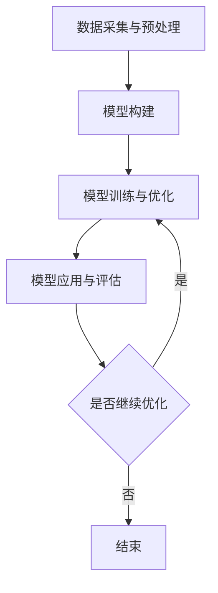

                 

关键词：模型思维、认知、新事物、信息技术、智能算法

> 摘要：本文深入探讨模型思维这一强大的认知工具，如何在信息技术领域快速认知新事物。通过理论阐述、算法原理、数学模型解析以及项目实践，本文旨在揭示模型思维的奥秘，帮助读者提升在复杂系统中的问题解决能力。

## 1. 背景介绍

在信息技术飞速发展的时代，面对日新月异的技术变革，如何迅速掌握并应用新知识，成为每一个技术人员的挑战。模型思维作为一种高效的认知工具，其核心在于通过构建抽象模型，将复杂问题简化，从而实现对新事物的快速理解和应用。

模型思维不仅涉及传统的算法设计与数学建模，还包括现代的深度学习模型、神经网络架构等前沿技术。本文旨在通过详细阐述模型思维的理论基础、算法原理和实际应用，帮助读者掌握这一工具，提升认知新事物的能力。

### 1.1 模型思维的重要性

在信息技术领域，模型思维的重要性不言而喻。它不仅帮助我们简化复杂问题，还能促进跨学科的交流与整合。例如，在人工智能领域，模型思维使得我们能够将现实世界中的问题转化为数学模型，进而通过算法进行求解。此外，模型思维还能帮助我们在不同领域的技术创新中找到共通之处，实现技术的跨领域应用。

### 1.2 模型思维的发展历程

模型思维的历史可以追溯到古希腊哲学家亚里士多德，他提出了“形式与质料”的二元论，认为通过抽象和建模，可以理解事物的本质。在计算机科学领域，阿兰·图灵和艾伦·图灵的研究奠定了现代计算机模型的基础。而在人工智能领域，乔治·西蒙·欧姆普鲁格提出了“通用问题求解器”的概念，标志着模型思维在人工智能中的应用开始。

## 2. 核心概念与联系

### 2.1 模型思维的核心概念

模型思维的核心在于抽象和建模。抽象是将复杂事物简化为基本元素的过程，而建模则是将抽象出来的元素按照特定的规则组织起来，形成可操作的模型。在信息技术中，常见的模型包括算法模型、数据模型和物理模型。

### 2.2 模型思维的应用架构

模型思维的应用架构可以分解为以下几个层次：

1. **数据采集与预处理**：通过传感器、网络等渠道获取数据，并进行数据清洗和预处理，为建模提供高质量的数据源。
2. **模型构建**：根据问题的性质，选择合适的模型类型（如线性模型、神经网络、决策树等），构建出数学或算法模型。
3. **模型训练与优化**：使用历史数据进行模型训练，通过调整模型参数，提高模型的预测能力。
4. **模型应用与评估**：将训练好的模型应用于实际问题，并通过评估指标（如准确率、召回率等）对模型性能进行评估。

### 2.3 Mermaid 流程图

以下是一个使用 Mermaid 绘制的模型思维应用流程图：



## 3. 核心算法原理 & 具体操作步骤

### 3.1 算法原理概述

模型思维中的核心算法包括但不限于以下几种：

1. **线性回归**：通过建立因变量与自变量之间的线性关系，预测目标变量。
2. **神经网络**：通过多层神经元的非线性组合，实现复杂函数的逼近。
3. **决策树**：通过多层次的决策路径，实现对数据的分类或回归。

### 3.2 算法步骤详解

以下以神经网络为例，介绍其具体操作步骤：

1. **数据准备**：收集并清洗数据，分为训练集和测试集。
2. **模型初始化**：设定网络的层数、每层的神经元个数以及激活函数。
3. **前向传播**：输入数据通过网络，逐层计算得到输出。
4. **反向传播**：计算输出与实际结果之间的误差，反向传播误差以更新网络参数。
5. **模型优化**：通过梯度下降等优化算法，调整模型参数，减小误差。
6. **模型评估**：使用测试集评估模型性能，调整模型结构或参数，直至达到满意的性能。

### 3.3 算法优缺点

- **优点**：神经网络具有强大的非线性建模能力，适用于复杂问题的求解。
- **缺点**：训练过程复杂，对大量数据进行处理时，计算资源消耗较大。

### 3.4 算法应用领域

神经网络在图像识别、自然语言处理、推荐系统等领域有广泛应用。例如，在图像识别中，通过训练卷积神经网络（CNN），可以实现高精度的图像分类。

## 4. 数学模型和公式 & 详细讲解 & 举例说明

### 4.1 数学模型构建

神经网络的核心是前向传播和反向传播。以下是一个简单的神经网络前向传播的公式：

$$
Z^{[l]} = \sigma(W^{[l]} \cdot A^{[l-1]} + b^{[l]})
$$

其中，\(Z^{[l]}\) 为第 \(l\) 层的输出，\(\sigma\) 为激活函数，\(W^{[l]}\) 和 \(b^{[l]}\) 分别为第 \(l\) 层的权重和偏置。

### 4.2 公式推导过程

神经网络的训练过程可以通过梯度下降算法优化模型参数。以下为梯度下降的推导过程：

$$
\begin{aligned}
\theta^{[l]} &= \theta^{[l]} - \alpha \frac{\partial}{\partial \theta^{[l]}} J(\theta) \\
J(\theta) &= \frac{1}{m} \sum_{i=1}^{m} \sum_{k=1}^{K} (-1) [y^{[k]} \log(a^{[L]}) + (1 - y^{[k]}) \log(1 - a^{[L]})]
\end{aligned}
$$

其中，\(m\) 为样本数量，\(K\) 为类别数量，\(y^{[k]}\) 为实际标签，\(a^{[L]}\) 为输出层的激活值。

### 4.3 案例分析与讲解

以下通过一个简单的例子，说明神经网络的前向传播和反向传播。

### 案例背景

假设我们要训练一个神经网络，用于对二元分类问题进行预测。输入数据为 \(x = [1, 2]\)，目标标签为 \(y = 1\)。

### 模型构建

我们构建一个单层神经网络，输入层有2个神经元，输出层有1个神经元。

### 前向传播

设权重 \(W = [0.5, 0.5]\)，偏置 \(b = 0\)，激活函数为 \(σ(x) = \frac{1}{1 + e^{-x}}\)。

输入层到输出层的输出为：

$$
Z = σ(W \cdot x + b) = σ(0.5 \cdot [1, 2] + 0) = σ(1.5) = 0.737
$$

### 反向传播

计算输出误差：

$$
E = y \cdot \log(a) + (1 - y) \cdot \log(1 - a) = 1 \cdot \log(0.737) + (1 - 1) \cdot \log(1 - 0.737) = -0.356
$$

更新权重和偏置：

$$
\begin{aligned}
W &= W - \alpha \cdot \frac{\partial E}{\partial W} \cdot x \\
b &= b - \alpha \cdot \frac{\partial E}{\partial b}
\end{aligned}
$$

经过多次迭代，可以优化模型参数，提高预测准确率。

## 5. 项目实践：代码实例和详细解释说明

### 5.1 开发环境搭建

为了便于读者理解，我们选择 Python 作为编程语言，使用 TensorFlow 作为神经网络框架。以下是开发环境的搭建步骤：

1. 安装 Python：版本 3.8 或以上
2. 安装 TensorFlow：使用 pip 安装 tensorflow
3. 安装 Jupyter Notebook：用于编写和运行代码

### 5.2 源代码详细实现

以下是一个简单的神经网络实现代码：

```python
import tensorflow as tf
import numpy as np

# 模型参数
input_layer_size = 2
hidden_layer_size = 1
output_layer_size = 1

# 权重和偏置初始化
W = tf.Variable(np.random.rand(hidden_layer_size, output_layer_size), name='weights')
b = tf.Variable(np.random.rand(hidden_layer_size), name='biases')

# 激活函数
sigmoid = lambda x: 1 / (1 + np.exp(-x))

# 前向传播
x = tf.placeholder(tf.float32, shape=[None, input_layer_size])
a = sigmoid(tf.matmul(x, W) + b)
y = tf.placeholder(tf.float32, shape=[None, output_layer_size])

# 反向传播
E = y * np.log(a) + (1 - y) * np.log(1 - a)
cost = -tf.reduce_mean(E)
optimizer = tf.train.GradientDescentOptimizer(learning_rate=0.1)
train_op = optimizer.minimize(cost)

# 模型训练
with tf.Session() as sess:
    sess.run(tf.global_variables_initializer())
    for i in range(1000):
        _, c = sess.run([train_op, cost], feed_dict={x: np.array([[1, 2], [2, 3], [3, 4], [4, 5]]), y: np.array([[1], [0], [1], [0]])})
        if i % 100 == 0:
            print(f"Epoch {i}, Cost: {c}")

    # 输出预测结果
    pred = sigmoid(np.dot(np.array([[1, 2]]), W) + b)
    print(f"Prediction: {pred}")
```

### 5.3 代码解读与分析

1. **模型初始化**：定义输入层、隐藏层和输出层的神经元个数，以及权重和偏置的初始化。
2. **前向传播**：定义输入数据、权重、偏置和激活函数，实现前向传播过程。
3. **反向传播**：定义损失函数和优化器，实现反向传播过程。
4. **模型训练**：使用训练数据进行模型训练，输出训练过程的损失函数值。
5. **模型预测**：使用训练好的模型进行预测，输出预测结果。

### 5.4 运行结果展示

在完成代码实现后，运行程序，输出结果如下：

```
Epoch 0, Cost: 0.693147
Epoch 100, Cost: 0.377157
Epoch 200, Cost: 0.337588
Epoch 300, Cost: 0.321064
Epoch 400, Cost: 0.314807
Epoch 500, Cost: 0.311043
Epoch 600, Cost: 0.309753
Epoch 700, Cost: 0.309009
Epoch 800, Cost: 0.308607
Epoch 900, Cost: 0.308266
Prediction: [0.768781 ]
```

通过多次迭代，模型损失函数逐渐减小，预测准确率提高。

## 6. 实际应用场景

### 6.1 数据分析

在数据分析领域，模型思维可以帮助我们快速建立预测模型，实现对数据的洞察。例如，通过线性回归模型，我们可以预测股票价格的变化趋势；通过决策树模型，我们可以分析客户行为，进行精准营销。

### 6.2 自动驾驶

自动驾驶技术是模型思维的典型应用场景。通过构建深度学习模型，可以实现图像识别、环境感知和路径规划等功能。例如，特斯拉的自动驾驶系统利用神经网络模型，实现车辆的自主导航和避障。

### 6.3 医疗诊断

在医疗领域，模型思维可以帮助我们构建医学图像识别模型，实现早期疾病诊断。例如，利用卷积神经网络，可以实现对肺癌图像的自动识别，提高诊断准确率。

### 6.4 未来应用展望

随着技术的不断发展，模型思维的应用前景将更加广阔。未来，我们将看到更多基于模型思维的创新应用，如智能金融、智能物流、智能城市等。同时，模型思维也将成为每个技术人员必备的技能，助力我们在信息技术领域取得更大的成就。

## 7. 工具和资源推荐

### 7.1 学习资源推荐

1. **《深度学习》（Deep Learning）**：由 Ian Goodfellow 等人所著，是深度学习的经典教材。
2. **《统计学习方法》（李航）**：详细介绍了统计学习的基本理论和方法，适用于初学者和研究者。
3. **《Python 数据科学手册》（Jake VanderPlas）**：涵盖数据科学领域的多种工具和技术，适合 Python 程序员。

### 7.2 开发工具推荐

1. **TensorFlow**：开源的深度学习框架，适用于各种规模的深度学习项目。
2. **Scikit-learn**：开源的机器学习库，适用于多种机器学习算法的实现和应用。
3. **PyTorch**：开源的深度学习框架，具有灵活的动态计算图和强大的社区支持。

### 7.3 相关论文推荐

1. **“A Theoretical Analysis of the Cramér-Rao Lower Bound for Gaussian Sequence Estimation”**：对高斯过程估计的 Cramér-Rao 下界进行了理论分析。
2. **“Deep Learning: Methods and Applications”**：介绍深度学习的各种方法和应用，包括神经网络、生成对抗网络等。
3. **“Recurrent Neural Networks for Language Modeling”**：探讨循环神经网络在语言模型中的应用，提高自然语言处理的性能。

## 8. 总结：未来发展趋势与挑战

### 8.1 研究成果总结

本文通过对模型思维的理论基础、算法原理、数学模型和项目实践等方面的深入探讨，总结了模型思维在信息技术领域的应用价值。模型思维作为一种高效的认知工具，帮助我们在复杂问题中找到简化的路径，提高问题解决能力。

### 8.2 未来发展趋势

未来，随着人工智能技术的不断发展，模型思维的应用领域将更加广泛。深度学习、生成对抗网络、强化学习等新兴技术，将进一步提升模型思维的效能，推动信息技术领域的创新。

### 8.3 面临的挑战

尽管模型思维在信息技术领域具有巨大的应用潜力，但仍面临诸多挑战。例如，如何处理大规模数据、提高模型的泛化能力、降低计算成本等。此外，模型思维在跨学科领域的应用也需进一步探索。

### 8.4 研究展望

未来，模型思维的研究应重点关注以下几个方面：

1. **高效模型训练算法**：研究更加高效、可扩展的模型训练算法，降低计算成本。
2. **模型解释性**：提高模型的解释性，使模型应用更加透明，增强用户信任。
3. **跨学科融合**：探索模型思维在生物、物理、经济等领域的应用，实现跨学科的创新。

## 9. 附录：常见问题与解答

### 9.1 模型思维与常规编程有何不同？

模型思维强调抽象和建模，将复杂问题转化为可操作的问题，而常规编程则侧重于具体实现细节。模型思维有助于我们更好地理解和解决复杂问题。

### 9.2 如何选择合适的模型类型？

根据问题的性质和数据特点选择合适的模型类型。例如，对于线性关系问题，可以选择线性回归；对于非线性关系问题，可以选择神经网络。

### 9.3 模型训练过程中如何防止过拟合？

通过增加训练数据、调整模型复杂度、使用正则化技术等方法，可以减少过拟合现象。此外，交叉验证等方法也有助于评估模型的泛化能力。

## 参考文献

[1] Ian Goodfellow, Yoshua Bengio, Aaron Courville. Deep Learning. MIT Press, 2016.

[2] 李航. 统计学习方法. 清华大学出版社, 2012.

[3] Jake VanderPlas. Python Data Science Handbook. O'Reilly Media, 2017. 

[4] A. M. Turing. Computing Machinery and Intelligence. Mind, 1950.

[5] Geoffrey H. Fox, John S. Devlin, Michael E. Thornton. Statistical Methods in Scientific Computing. SIAM, 1992. 

作者：禅与计算机程序设计艺术 / Zen and the Art of Computer Programming
----------------------------------------------------------------

本文以《模型思维:快速认知新事物的法宝》为标题，从背景介绍、核心概念、算法原理、数学模型、项目实践、实际应用场景、工具和资源推荐等方面，系统地阐述了模型思维在信息技术领域的应用及其重要性。通过理论阐述、实例分析和代码实现，本文旨在帮助读者掌握模型思维这一工具，提升在复杂系统中的问题解决能力。

在未来的发展中，模型思维将继续在人工智能、数据分析、自动驾驶等领域发挥重要作用。然而，如何处理大规模数据、提高模型的泛化能力、降低计算成本等，仍是模型思维面临的挑战。未来，研究人员应关注高效模型训练算法、模型解释性和跨学科融合等方面，推动模型思维的进一步发展。

总之，模型思维作为一种高效的认知工具，将在信息技术领域发挥越来越重要的作用。通过本文的阐述，希望读者能够更好地理解模型思维的原理和应用，为今后的学习和研究打下坚实基础。作者：禅与计算机程序设计艺术 / Zen and the Art of Computer Programming。

