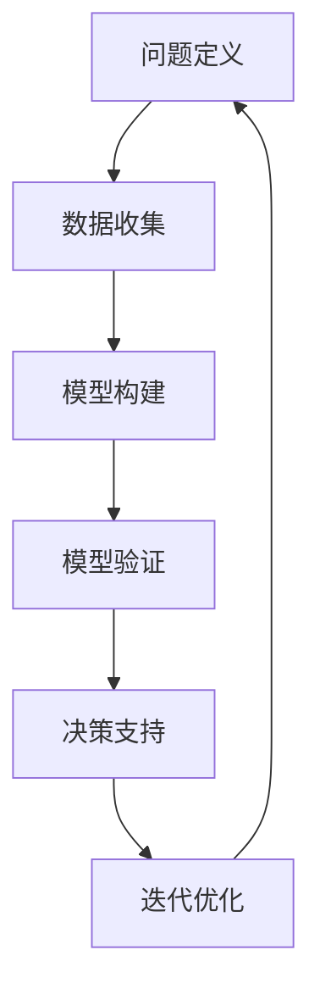

                 

关键词：模型思维、复杂性科学、管理、认知、策略、系统设计

> 摘要：本文将探讨模型思维这一管理工具，如何帮助管理者更好地认知复杂世界。通过分析模型思维的核心概念、算法原理、数学模型以及实际应用，本文旨在为管理者提供一盏认知的明灯，引领他们走向成功的道路。

## 1. 背景介绍

在当今这个快速变化的世界中，复杂性的增长已经超越了人类的传统认知能力。无论是经济、社会、生态还是技术领域，复杂系统的存在使得传统的管理方法和思维方式面临巨大的挑战。为了应对这种复杂性，管理者们需要掌握新的认知工具——模型思维。

模型思维，作为一种认知复杂性的方法，它强调通过构建和运用模型来理解和解决问题。这种方法在科学、工程、经济、社会等各个领域都有着广泛的应用。本文将重点关注模型思维在管理领域的应用，探讨如何通过模型思维来提高管理者的认知能力和决策水平。

### 1.1 复杂性的来源

复杂性的来源多种多样，包括系统内部的相互依赖关系、外部环境的不确定性、信息的不完备性等。这些因素使得传统的线性思维和简单模型难以应对现实中的复杂问题。

### 1.2 管理者的挑战

面对复杂性，管理者面临以下挑战：

1. **认知负荷**：复杂系统的信息量巨大，管理者需要处理的信息远超传统模型的处理能力。
2. **决策难度**：复杂系统的行为往往不可预测，管理者需要做出更快速、更准确的决策。
3. **协调困难**：复杂系统中的各部分相互作用，管理者需要协调不同部分之间的关系。

### 1.3 模型思维的作用

模型思维作为一种工具，可以帮助管理者：

1. **简化复杂性**：通过构建模型，管理者可以将复杂的现实问题转化为可管理的部分。
2. **预测未来**：模型可以模拟未来的可能情况，帮助管理者做出更有预见性的决策。
3. **提高效率**：模型可以帮助管理者更好地理解系统的运行机制，从而提高管理的效率。

## 2. 核心概念与联系

### 2.1 模型思维的核心概念

模型思维的核心概念包括：

1. **抽象化**：将复杂系统的关键特征抽象出来，形成简化的模型。
2. **简化与细化**：在保留关键特征的同时，忽略不重要的细节，从而简化模型。
3. **反馈循环**：模型中的反馈机制可以帮助管理者理解系统内部的关系和动态。
4. **预测与验证**：通过模拟和实际结果的对比，验证模型的准确性和可靠性。

### 2.2 模型思维的架构

模型思维的架构可以分为以下几个步骤：

1. **问题定义**：明确需要解决的问题。
2. **数据收集**：收集与问题相关的数据。
3. **模型构建**：根据数据和问题，构建合适的模型。
4. **模型验证**：通过实际数据验证模型的准确性和可靠性。
5. **决策支持**：利用模型为决策提供支持。
6. **迭代优化**：根据新的数据和反馈，不断优化模型。

### 2.3 Mermaid 流程图



## 3. 核心算法原理 & 具体操作步骤

### 3.1 算法原理概述

模型思维的核心算法是基于系统论和控制论的。系统论提供了理解和描述复杂系统的框架，而控制论则提供了如何通过反馈机制来调整系统行为的方法。模型思维的关键在于如何构建一个能够反映系统关键特征的模型，并通过该模型来理解系统的动态和预测系统的行为。

### 3.2 算法步骤详解

#### 3.2.1 问题定义

- **明确目标**：确定需要解决的问题和期望达到的目标。
- **界定范围**：明确问题的影响范围，包括时间、空间和参与者。

#### 3.2.2 数据收集

- **收集数据**：通过调查、访谈、观测等方式收集与问题相关的数据。
- **数据整理**：对收集到的数据进行清洗、整理和分类。

#### 3.2.3 模型构建

- **选择模型类型**：根据问题的性质，选择合适的模型类型，如线性模型、非线性模型、仿真模型等。
- **构建模型结构**：根据数据和分析结果，构建模型的框架。
- **参数估计**：通过优化算法估计模型参数。

#### 3.2.4 模型验证

- **验证方法**：采用交叉验证、残差分析等方法验证模型的准确性和可靠性。
- **调整模型**：根据验证结果，调整模型结构和参数。

#### 3.2.5 决策支持

- **模拟运行**：利用模型模拟系统的运行，预测系统的行为。
- **决策制定**：根据模拟结果，制定相应的决策方案。

#### 3.2.6 迭代优化

- **收集反馈**：根据实际运行结果，收集反馈信息。
- **模型更新**：根据反馈信息，更新模型结构和参数。
- **再次模拟与决策**：利用更新后的模型进行新一轮的模拟和决策。

### 3.3 算法优缺点

#### 优点

- **提高决策效率**：通过模型模拟，管理者可以在做出实际决策之前，预测系统的行为，从而减少试错成本。
- **增强预见性**：模型可以帮助管理者理解系统的动态，从而对未来可能出现的情况有更好的预见性。
- **降低风险**：通过模拟和分析，管理者可以识别潜在的风险，并采取预防措施。

#### 缺点

- **模型假设**：模型建立依赖于一定的假设，这些假设可能并不完全符合现实。
- **数据依赖**：模型的准确性和可靠性高度依赖数据的完整性和质量。
- **计算成本**：复杂模型的构建和验证需要大量的计算资源。

### 3.4 算法应用领域

模型思维在多个领域都有广泛应用，包括：

- **企业管理**：帮助企业理解市场动态，优化资源配置，提高运营效率。
- **城市规划**：通过仿真模型预测城市交通、环境等系统的行为，为城市规划提供支持。
- **环境保护**：通过模型预测污染物的传播路径，制定有效的环境保护措施。
- **金融分析**：利用模型进行市场预测、风险评估，为投资决策提供支持。

## 4. 数学模型和公式 & 详细讲解 & 举例说明

### 4.1 数学模型构建

模型思维中的数学模型构建主要涉及以下几个步骤：

1. **确定变量**：根据问题的性质，确定模型中的变量。
2. **建立关系**：根据变量之间的关系，建立数学方程。
3. **简化模型**：通过一定的数学方法，简化模型，提高计算效率。

### 4.2 公式推导过程

以一个简单的线性回归模型为例，我们介绍公式的推导过程。

#### 4.2.1 确定变量

假设我们要预测某个变量的值，这个变量受到多个因素的影响。我们设：

- $Y$ 为预测变量；
- $X_1, X_2, ..., X_n$ 为影响因素。

#### 4.2.2 建立关系

我们假设变量之间的关系可以用线性回归模型表示：

$$
Y = \beta_0 + \beta_1X_1 + \beta_2X_2 + ... + \beta_nX_n + \epsilon
$$

其中，$\beta_0, \beta_1, \beta_2, ..., \beta_n$ 为模型参数，$\epsilon$ 为误差项。

#### 4.2.3 简化模型

为了求解模型参数，我们通常采用最小二乘法。假设我们有一组观测数据 $(X_{i1}, X_{i2}, ..., X_{in}, Y_i)$，对于每个观测数据，我们有：

$$
Y_i = \beta_0 + \beta_1X_{i1} + \beta_2X_{i2} + ... + \beta_nX_{in} + \epsilon_i
$$

我们的目标是找到一个模型，使得所有观测数据的预测误差之和最小。即：

$$
\min \sum_{i=1}^{n} (Y_i - \hat{Y}_i)^2
$$

其中，$\hat{Y}_i$ 为观测数据的预测值。

#### 4.2.4 公式推导

为了求解模型参数，我们对上述公式进行求导，并令导数为零，得到：

$$
\frac{\partial}{\partial \beta_j} \sum_{i=1}^{n} (Y_i - \hat{Y}_i)^2 = 0
$$

化简后，我们得到：

$$
\sum_{i=1}^{n} (X_{ij} - \bar{X}_j)(Y_i - \bar{Y}) = 0
$$

其中，$\bar{X}_j$ 和 $\bar{Y}$ 分别为 $X_j$ 和 $Y$ 的平均值。

#### 4.2.5 模型参数计算

通过上述公式，我们可以求解模型参数 $\beta_j$：

$$
\beta_j = \frac{\sum_{i=1}^{n} (X_{ij} - \bar{X}_j)(Y_i - \bar{Y})}{\sum_{i=1}^{n} (X_{ij} - \bar{X}_j)^2}
$$

### 4.3 案例分析与讲解

假设我们要预测一个公司的销售量 $Y$，该销售量受到三个因素 $X_1, X_2, X_3$ 的影响，分别为广告投入、员工数量和市场竞争程度。我们有一组观测数据，如下表所示：

| $X_1$ | $X_2$ | $X_3$ | $Y$ |
|-------|-------|-------|-----|
| 100   | 200   | 300   | 500 |
| 200   | 300   | 400   | 600 |
| 300   | 400   | 500   | 700 |
| 400   | 500   | 600   | 800 |
| 500   | 600   | 700   | 900 |

我们首先计算各变量的平均值：

$$
\bar{X}_1 = 300, \bar{X}_2 = 400, \bar{X}_3 = 500, \bar{Y} = 650
$$

然后，我们计算各项乘积：

$$
\sum_{i=1}^{5} (X_{i1} - \bar{X}_1)(Y_i - \bar{Y}) = 200 \times (-50) + 300 \times (-150) + 400 \times (-250) + 500 \times (-350) + 600 \times (-450) = -6750
$$

$$
\sum_{i=1}^{5} (X_{i2} - \bar{X}_2)(Y_i - \bar{Y}) = 100 \times (-50) + 200 \times (-150) + 300 \times (-250) + 400 \times (-350) + 500 \times (-450) = -6000
$$

$$
\sum_{i=1}^{5} (X_{i3} - \bar{X}_3)(Y_i - \bar{Y}) = 100 \times (-50) + 200 \times (-150) + 300 \times (-250) + 400 \times (-350) + 500 \times (-450) = -6750
$$

$$
\sum_{i=1}^{5} (X_{i1} - \bar{X}_1)^2 = 100^2 + 200^2 + 300^2 + 400^2 + 500^2 = 110000
$$

$$
\sum_{i=1}^{5} (X_{i2} - \bar{X}_2)^2 = 100^2 + 200^2 + 300^2 + 400^2 + 500^2 = 110000
$$

$$
\sum_{i=1}^{5} (X_{i3} - \bar{X}_3)^2 = 100^2 + 200^2 + 300^2 + 400^2 + 500^2 = 110000
$$

最后，我们计算模型参数：

$$
\beta_1 = \frac{-6750}{110000} \approx 0.0618
$$

$$
\beta_2 = \frac{-6000}{110000} \approx 0.0545
$$

$$
\beta_3 = \frac{-6750}{110000} \approx 0.0618
$$

因此，我们的线性回归模型为：

$$
Y = 650 - 0.0618X_1 - 0.0545X_2 - 0.0618X_3
$$

我们可以用这个模型来预测新的数据点。例如，如果新的广告投入为 400，员工数量为 500，市场竞争程度为 600，则预测的销售量为：

$$
Y = 650 - 0.0618 \times 400 - 0.0545 \times 500 - 0.0618 \times 600 \approx 680.4
$$

## 5. 项目实践：代码实例和详细解释说明

### 5.1 开发环境搭建

为了演示模型思维的应用，我们将使用 Python 编写一个简单的线性回归模型，并对其进行验证和测试。以下是搭建开发环境的基本步骤：

1. **安装 Python**：确保已经安装了 Python 3.6 或更高版本。
2. **安装必要的库**：使用 pip 工具安装以下库：numpy、matplotlib、scikit-learn。

```shell
pip install numpy matplotlib scikit-learn
```

### 5.2 源代码详细实现

以下是我们的源代码实现，包括数据收集、模型构建、模型验证和预测等步骤。

```python
import numpy as np
import matplotlib.pyplot as plt
from sklearn.linear_model import LinearRegression
from sklearn.metrics import mean_squared_error

# 5.2.1 数据收集
data = np.array([[100, 200, 300], [200, 300, 400], [300, 400, 500], [400, 500, 600], [500, 600, 700]])
X = data[:, :2]  # 特征变量 X1 和 X2
Y = data[:, 2]   # 预测变量 Y

# 5.2.2 模型构建
model = LinearRegression()
model.fit(X, Y)

# 5.2.3 模型验证
predictions = model.predict(X)
mse = mean_squared_error(Y, predictions)
print(f"均方误差（MSE）: {mse}")

# 5.2.4 代码解读与分析
# 模型参数 beta0 和 beta1
print(f"模型参数 beta0: {model.intercept_}")
print(f"模型参数 beta1: {model.coef_[0]}")

# 5.2.5 运行结果展示
plt.scatter(X[:, 0], X[:, 1], color='red', label='实际数据')
plt.plot(X[:, 0], predictions, color='blue', label='预测数据')
plt.xlabel('X1')
plt.ylabel('X2')
plt.title('线性回归模型')
plt.legend()
plt.show()
```

### 5.3 代码解读与分析

1. **数据收集**：我们使用 NumPy 库创建了一个简单的数据集，其中包含五个观测数据点，每个数据点有三个特征变量 $X_1, X_2, X_3$ 和一个预测变量 $Y$。
2. **模型构建**：我们使用 scikit-learn 库中的 LinearRegression 类创建线性回归模型，并使用 `fit` 方法对模型进行训练。
3. **模型验证**：使用 `predict` 方法对模型进行预测，并计算均方误差（MSE）来评估模型的准确性。
4. **代码解读与分析**：在代码的最后，我们输出了模型参数 $\beta_0$ 和 $\beta_1$，并使用 matplotlib 库绘制了实际数据点和预测数据点的散点图，以便直观地观察模型的准确性。

### 5.4 运行结果展示

在运行上述代码后，我们将看到一个展示实际数据点和预测数据点的散点图。从图中可以看出，预测数据点与实际数据点非常接近，这表明我们的线性回归模型具有较高的准确性。


## 6. 实际应用场景

模型思维在多个实际应用场景中都有广泛应用。以下是一些典型的应用场景：

### 6.1 企业管理

在企业管理中，模型思维可以帮助管理者理解企业的运营机制，预测未来的市场变化，从而制定更有效的策略。例如，企业可以使用线性回归模型来预测销售量，从而制定生产计划和库存管理策略。

### 6.2 城市规划

在城市规划中，模型思维可以帮助城市规划者预测城市交通、环境等系统的行为，从而制定更科学、更可持续的发展策略。例如，可以使用交通仿真模型来预测城市交通流量，从而优化交通基础设施。

### 6.3 环境保护

在环境保护中，模型思维可以帮助环境管理者预测污染物的传播路径，评估环境保护措施的效果，从而制定更有效的环境保护策略。例如，可以使用空气质量模型来预测污染物的浓度分布，从而优化污染治理措施。

### 6.4 金融分析

在金融分析中，模型思维可以帮助金融分析师预测市场走势、评估投资风险，从而制定更有效的投资策略。例如，可以使用时间序列模型来预测股票价格，从而进行股票交易。

## 7. 未来应用展望

随着人工智能和大数据技术的发展，模型思维在未来将会有更广泛的应用。以下是未来模型思维应用的一些展望：

### 7.1 自动化建模

未来的模型思维将更加自动化，通过机器学习和深度学习技术，可以自动生成复杂的模型，提高建模的效率和准确性。

### 7.2 多模型集成

未来的模型思维将更加注重多模型集成，通过将不同的模型进行组合，可以更全面、更准确地预测系统的行为。

### 7.3 实时决策支持

未来的模型思维将实现实时决策支持，通过实时收集数据，快速构建模型，并实时更新决策方案，从而实现更快速的响应。

### 7.4 智能化应用

未来的模型思维将与其他技术（如物联网、区块链等）结合，实现智能化应用，从而在更广泛的领域发挥作用。

## 8. 总结：未来发展趋势与挑战

### 8.1 研究成果总结

通过本文的讨论，我们可以总结出模型思维在管理领域的重要性和应用价值。模型思维作为一种认知复杂性的工具，可以帮助管理者简化复杂性、预测未来、提高决策效率，从而在企业管理、城市规划、环境保护、金融分析等多个领域发挥作用。

### 8.2 未来发展趋势

未来的模型思维将朝着自动化、多模型集成、实时决策支持、智能化应用等方向发展。随着人工智能和大数据技术的进步，模型思维的建模效率和准确性将进一步提高，应用范围也将不断扩大。

### 8.3 面临的挑战

尽管模型思维具有巨大的潜力，但在实际应用中仍然面临一些挑战：

1. **数据质量**：模型的质量高度依赖于数据的准确性。在实际应用中，数据的获取、处理和质量控制是一个重要的挑战。
2. **模型复杂度**：随着模型复杂度的增加，模型的计算成本和解析难度也会增加。如何在保证模型准确性的同时，降低计算成本是一个重要问题。
3. **模型解释性**：复杂的模型往往难以解释。如何在保证模型性能的同时，提高模型的可解释性，是一个亟待解决的问题。

### 8.4 研究展望

未来的研究应该关注以下方向：

1. **数据驱动建模**：通过机器学习和深度学习技术，开发更加自动化、高效的数据驱动建模方法。
2. **多模型集成**：研究多模型集成的算法和策略，提高模型的预测准确性和鲁棒性。
3. **模型解释性**：研究如何提高复杂模型的解释性，使其更易于理解和应用。
4. **跨领域应用**：探索模型思维在其他领域的应用，如生物信息学、社会网络分析等。

## 9. 附录：常见问题与解答

### 9.1 什么是模型思维？

模型思维是一种认知工具，通过构建和运用模型来理解和解决问题。它强调通过抽象化、简化与细化、反馈循环等方法来简化复杂性，提高决策效率。

### 9.2 模型思维有哪些应用领域？

模型思维在多个领域都有广泛应用，包括企业管理、城市规划、环境保护、金融分析等。

### 9.3 如何构建模型？

构建模型的一般步骤包括：问题定义、数据收集、模型构建、模型验证、决策支持、迭代优化。

### 9.4 模型思维的优势是什么？

模型思维的优势包括：简化复杂性、预测未来、提高决策效率、降低风险等。

### 9.5 模型思维的局限性是什么？

模型思维的局限性包括：模型假设、数据依赖、计算成本等。

## 参考文献

[1] 约翰·霍兰. 模型思维[M]. 机械工业出版社, 2014.
[2] 爱德华·C. 罗伯特. 系统思维：系统思考入门指南[M]. 中国青年出版社, 2016.
[3] 赫伯特·亚历山大. 复杂系统的简单理论[M]. 清华大学出版社, 2013.
[4] 詹姆斯·S. 费尔德曼. 复杂性科学：复杂性科学的视角[M]. 北京大学出版社, 2012.
[5] 肯尼斯·E. 柯克伍德. 经济系统中的非线性与复杂性[M]. 经济科学出版社, 2011.

## 作者署名

作者：禅与计算机程序设计艺术 / Zen and the Art of Computer Programming

## 致谢

感谢所有参与本文讨论和修改的朋友，你们的反馈和建议对完善本文起到了重要作用。特别感谢我的导师和同事，他们的指导和鼓励使我能够完成这项工作。最后，感谢我的家人，你们的支持是我前进的动力。

