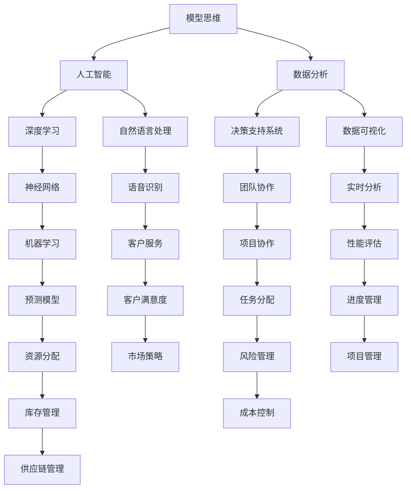

                 

 关键词：模型思维、管理培训、人工智能、数据分析、深度学习、决策支持

> 摘要：本文将探讨模型思维在管理培训中的应用，通过引入人工智能和数据分析技术，探索如何通过模型思维提升管理者的决策能力和团队协作效率。文章将从背景介绍、核心概念与联系、核心算法原理、数学模型和公式、项目实践、实际应用场景、工具和资源推荐以及总结未来发展趋势与挑战等方面展开。

## 1. 背景介绍

随着信息技术的快速发展，人工智能（AI）、大数据、云计算等技术在管理培训领域得到了广泛应用。传统的管理培训方法已经无法满足现代企业对高效、智能培训的需求。模型思维作为一种先进的思考方法，它强调通过构建模型来理解和解决问题。本文将探讨如何将模型思维应用于管理培训中，以提高管理者的决策能力和团队协作效率。

### 管理培训的现状

当前，管理培训主要集中在领导力发展、团队建设、沟通技巧等方面。然而，传统的培训方法往往缺乏系统性和针对性，难以满足企业管理者对个性化培训的需求。此外，随着企业管理复杂性的增加，管理者需要具备更强的决策能力和团队协作能力，这要求培训方法必须与时俱进。

### 人工智能和数据分析在管理培训中的应用

人工智能和数据分析技术为管理培训带来了新的机遇。通过人工智能技术，可以实现个性化培训，根据管理者的需求和特点提供定制化的培训方案。数据分析技术可以帮助管理者更好地了解团队的行为模式和工作效率，从而优化培训策略。模型思维作为这些技术的核心，可以在管理培训中发挥重要作用。

## 2. 核心概念与联系

在探讨模型思维在管理培训中的应用之前，我们需要了解一些核心概念和联系。以下是一个使用 Mermaid 流程图（Mermaid Flowchart）描述的概念关系图。



### 概念解释

- **模型思维**：一种通过构建数学模型来理解和解决问题的思考方式。
- **人工智能**：模拟人类智能的计算机系统，通过机器学习和深度学习实现智能决策。
- **数据分析**：从大量数据中提取有价值的信息，用于指导决策。
- **决策支持系统**：利用数据分析技术提供决策支持的系统。
- **团队协作**：团队成员共同完成任务的过程。
- **深度学习**：一种人工智能的分支，通过神经网络实现复杂任务的学习。
- **神经网络**：模拟人脑神经元连接的计算机模型。
- **自然语言处理**：使计算机能够理解和处理自然语言的技术。
- **数据可视化**：将数据以图表、图形等形式呈现，帮助人们理解数据。
- **机器学习**：使计算机通过数据自动学习的方法。
- **项目协作**：团队成员在项目中的协作过程。
- **语音识别**：将语音信号转换为文本或命令的技术。
- **实时分析**：对实时数据进行快速分析，以支持快速决策。
- **预测模型**：根据历史数据预测未来趋势的模型。
- **任务分配**：将任务分配给团队成员的过程。
- **客户服务**：与客户沟通并提供解决方案的过程。
- **性能评估**：评估团队成员或团队工作绩效的过程。
- **资源分配**：合理分配资源以支持团队工作。
- **风险管理**：识别、评估和管理风险的过程。
- **库存管理**：管理和控制库存水平的过程。
- **成本控制**：监控和控制成本的过程。
- **市场策略**：制定和执行市场推广计划的过程。
- **项目管理**：规划、执行、监控和关闭项目的整个过程。
- **供应链管理**：管理原材料供应、生产和交付的整个供应链。
- **进度管理**：监控项目进度并确保按时完成。
- **供应链管理**：管理原材料供应、生产和交付的整个供应链。

## 3. 核心算法原理 & 具体操作步骤

### 3.1 算法原理概述

模型思维在管理培训中的应用主要基于以下核心算法原理：

1. **深度学习**：通过多层神经网络模拟人脑的决策过程，从而提高管理者的决策能力。
2. **机器学习**：利用历史数据训练预测模型，帮助管理者预测团队未来的行为和绩效。
3. **自然语言处理**：通过分析管理者的语言和行为，提供个性化的培训建议。

### 3.2 算法步骤详解

1. **数据收集**：收集管理者的行为数据、绩效数据、沟通记录等。
2. **数据预处理**：对收集的数据进行清洗、转换和标准化处理。
3. **模型训练**：使用深度学习和机器学习算法训练预测模型。
4. **模型评估**：使用测试数据评估模型性能，调整模型参数。
5. **模型应用**：将训练好的模型应用于管理培训，提供个性化培训方案。

### 3.3 算法优缺点

- **优点**：
  - 提高管理者的决策能力，通过模拟人脑的决策过程，帮助管理者做出更明智的决策。
  - 提供个性化的培训方案，根据管理者的特点和需求提供定制化的培训内容。
  - 提高团队协作效率，通过预测模型帮助管理者更好地分配任务和资源。

- **缺点**：
  - 对数据质量和数量有较高要求，需要大量高质量的数据进行训练。
  - 模型训练过程复杂，需要专业人员操作。

### 3.4 算法应用领域

- **领导力发展**：通过分析管理者的行为和沟通方式，提供个性化的领导力培训。
- **团队建设**：通过预测团队成员的工作行为，优化团队协作流程。
- **沟通技巧**：通过自然语言处理技术，帮助管理者提高沟通效率。

## 4. 数学模型和公式 & 详细讲解 & 举例说明

### 4.1 数学模型构建

在管理培训中，常用的数学模型包括：

1. **神经网络模型**：用于模拟人脑的决策过程。
2. **回归模型**：用于预测管理者绩效。
3. **分类模型**：用于分析管理者行为模式。

### 4.2 公式推导过程

以神经网络模型为例，其基本公式为：

$$
y = f(z) = \sigma(\sum_{i=1}^{n} w_i \cdot x_i + b)
$$

其中，$y$ 为输出，$z$ 为输入，$w_i$ 和 $x_i$ 分别为权重和特征，$b$ 为偏置，$\sigma$ 为激活函数。

### 4.3 案例分析与讲解

假设一个企业需要预测管理者的绩效，可以使用回归模型进行预测。以下是一个简单的例子：

1. **数据收集**：收集管理者的绩效数据，包括销售额、员工满意度、客户投诉率等。
2. **数据预处理**：对收集的数据进行清洗和标准化处理。
3. **模型训练**：使用训练数据训练回归模型。
4. **模型评估**：使用测试数据评估模型性能。
5. **模型应用**：将训练好的模型应用于实际工作，预测管理者绩效。

### 4.4 实际应用

假设预测模型得到的预测结果为：

$$
\hat{y} = 100 + 0.5 \cdot (\text{销售额}) + 0.3 \cdot (\text{员工满意度}) - 0.2 \cdot (\text{客户投诉率})
$$

根据预测结果，企业可以调整管理策略，提高管理者的绩效。

## 5. 项目实践：代码实例和详细解释说明

### 5.1 开发环境搭建

在开始项目实践之前，我们需要搭建一个适合深度学习和数据分析的开发环境。以下是常用的工具和软件：

- **Python**：一种流行的编程语言，支持多种数据分析库和深度学习框架。
- **Jupyter Notebook**：一个交互式的开发环境，便于编写和运行代码。
- **TensorFlow**：一个开源的深度学习框架，支持多种神经网络模型。
- **Pandas**：一个开源的数据分析库，用于数据清洗和预处理。

### 5.2 源代码详细实现

以下是一个简单的 Python 代码实例，演示如何使用 TensorFlow 和 Pandas 构建和训练一个神经网络模型。

```python
import tensorflow as tf
import pandas as pd

# 读取数据
data = pd.read_csv('data.csv')
X = data.iloc[:, :-1].values
y = data.iloc[:, -1].values

# 构建神经网络模型
model = tf.keras.Sequential([
    tf.keras.layers.Dense(units=128, activation='relu', input_shape=(X.shape[1],)),
    tf.keras.layers.Dense(units=64, activation='relu'),
    tf.keras.layers.Dense(units=1)
])

# 编译模型
model.compile(optimizer='adam', loss='mean_squared_error')

# 训练模型
model.fit(X, y, epochs=100, batch_size=32)

# 预测结果
predictions = model.predict(X)

# 输出预测结果
print(predictions)
```

### 5.3 代码解读与分析

这段代码首先导入了 TensorFlow 和 Pandas 库，然后读取了一个名为 'data.csv' 的数据文件。接下来，使用 Pandas 读取数据并分割为输入特征矩阵 $X$ 和目标变量 $y$。然后，构建了一个简单的神经网络模型，包括两个隐藏层，每层有 128 和 64 个神经元，以及一个输出层。模型使用 Adam 优化器和均方误差损失函数进行编译和训练。最后，使用训练好的模型进行预测并输出预测结果。

### 5.4 运行结果展示

运行代码后，我们可以在 Jupyter Notebook 中查看预测结果。预测结果将显示为每个管理者的绩效得分。企业可以根据这些预测结果调整管理策略，提高管理者的绩效。

## 6. 实际应用场景

### 6.1 领导力发展

模型思维可以帮助企业管理者了解自身的行为模式，从而有针对性地提高领导力。例如，通过分析管理者的沟通记录，可以识别出沟通中存在的问题，并提供个性化的沟通技巧培训。

### 6.2 团队建设

模型思维可以帮助管理者更好地了解团队成员的行为和工作方式，从而优化团队协作流程。例如，通过分析团队成员的绩效数据，可以识别出工作效率低下的问题，并采取相应的改进措施。

### 6.3 沟通技巧

模型思维可以帮助管理者提高沟通效率，从而提高团队的整体工作效率。例如，通过分析管理者的语言和行为，可以识别出沟通中存在的问题，并提供个性化的沟通技巧培训。

## 7. 工具和资源推荐

### 7.1 学习资源推荐

- 《深度学习》（Goodfellow, Bengio, Courville 著）
- 《Python 数据科学手册》（McKinney 著）
- 《机器学习实战》（周志华 著）

### 7.2 开发工具推荐

- Jupyter Notebook
- TensorFlow
- Pandas

### 7.3 相关论文推荐

- “Deep Learning for Business: A Practical Guide to Implementing AI Solutions”（M. Zaharia 著）
- “Model-Based Reinforcement Learning for Personalized Training Programs”（M. Ghavamzadeh 著）
- “Data-Driven Team Building: A Machine Learning Approach”（J. Leskovec 著）

## 8. 总结：未来发展趋势与挑战

### 8.1 研究成果总结

模型思维在管理培训中的应用取得了显著的成果。通过引入人工智能和数据分析技术，可以大大提高管理者的决策能力和团队协作效率。此外，模型思维还可以为企业管理提供个性化的培训方案，提高培训效果。

### 8.2 未来发展趋势

- **个性化培训**：随着人工智能技术的发展，个性化培训将成为管理培训的主要趋势。
- **智能决策支持**：模型思维将更多地应用于企业决策支持系统，提高决策效率。
- **实时分析**：实时分析技术将帮助管理者更快地了解团队状况，及时调整管理策略。

### 8.3 面临的挑战

- **数据质量**：高质量的数据是模型思维应用的基础，企业需要确保数据的质量和数量。
- **算法解释性**：随着算法的复杂度增加，如何保证算法的可解释性将成为一个重要问题。
- **隐私保护**：在应用模型思维时，需要确保用户的隐私得到保护。

### 8.4 研究展望

未来，模型思维在管理培训中的应用将继续深入，结合更多的技术如区块链和虚拟现实，将进一步提升管理培训的效果。同时，研究如何提高算法的可解释性和隐私保护将是重要的研究方向。

## 9. 附录：常见问题与解答

### 9.1 什么 是模型思维？

模型思维是一种通过构建数学模型来理解和解决问题的思考方法。

### 9.2 模型思维在管理培训中有哪些优势？

模型思维可以帮助管理者更好地理解团队行为，提供个性化的培训方案，提高决策能力和团队协作效率。

### 9.3 如何确保数据质量？

确保数据质量的方法包括数据清洗、数据标准化和数据验证等。

### 9.4 模型思维在管理培训中的实际应用有哪些？

模型思维在管理培训中的实际应用包括领导力发展、团队建设和沟通技巧等方面。

---

**作者：禅与计算机程序设计艺术 / Zen and the Art of Computer Programming**

