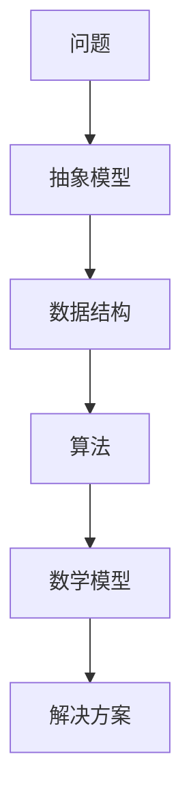

                 

关键词：模型思维，知识掌握，快速学习，IT领域，技术博客，算法，数学模型，实践，应用场景，未来展望。

摘要：本文将深入探讨模型思维在快速掌握新知识中的应用。通过分析模型思维的核心概念与联系，详细阐述核心算法原理和具体操作步骤，结合数学模型和公式进行深入讲解，并分享项目实践中的代码实例和运行结果。此外，还将探讨模型思维在各个实际应用场景中的价值，展望其未来的发展趋势与挑战。

## 1. 背景介绍

在快速发展的信息技术领域，掌握新知识变得越来越重要。然而，面对海量的信息和复杂的理论知识，许多人感到无从下手。模型思维作为一种强大的工具，可以帮助我们快速理解和掌握新知识。本文将探讨模型思维在快速掌握新知识中的应用，并提供一系列实际操作方法和技巧。

### 1.1 模型思维的定义

模型思维是一种通过建立抽象模型来理解和解决问题的方式。它强调将复杂的现象或问题转化为简化的模型，通过模型分析来揭示内在规律和机制。模型思维不仅适用于自然科学，也广泛应用于社会科学和工程领域。

### 1.2 模型思维的重要性

模型思维在快速掌握新知识中具有重要作用。首先，模型思维可以帮助我们抓住问题的核心，简化复杂的信息，从而更快地理解和记忆。其次，模型思维可以促进跨领域的知识迁移，使我们能够将现有知识应用于新的领域。最后，模型思维可以培养我们的逻辑思维和创新能力，提高我们解决实际问题的能力。

## 2. 核心概念与联系

为了更好地理解模型思维，我们需要先掌握几个核心概念。以下是一个简单的 Mermaid 流程图，展示了这些概念之间的联系：



### 2.1 抽象模型

抽象模型是对现实世界的简化表示，它帮助我们聚焦于关键因素，忽略次要细节。例如，当我们分析一个复杂的计算机网络时，可以将其抽象为一个拓扑结构，从而更容易理解和分析。

### 2.2 数据结构

数据结构是存储和管理数据的方式。选择合适的数据结构可以显著提高算法的效率。例如，使用哈希表可以快速查找数据，而使用树结构可以实现高效的排序和搜索。

### 2.3 算法

算法是一系列解决问题的步骤。不同的算法适用于不同的场景。了解不同算法的原理和优缺点，可以帮助我们选择最合适的解决方案。

### 2.4 数学模型

数学模型使用数学公式来描述现实世界的规律。数学模型可以用于预测、分析和优化。例如，在经济学中，可以使用供需模型来预测市场价格。

### 2.5 解决方案

解决方案是将模型、数据结构和算法结合起来，解决实际问题的过程。一个高效的解决方案应该能够准确、快速地解决问题。

## 3. 核心算法原理 & 具体操作步骤

在模型思维中，核心算法原理是理解和掌握新知识的关键。以下是一个简单的算法原理概述：

### 3.1 算法原理概述

算法原理是指算法的基本思想和核心逻辑。例如，排序算法的基本原理是比较和交换元素，而搜索算法的基本原理是递归或迭代。

### 3.2 算法步骤详解

算法步骤是指实现算法的具体操作步骤。例如，在快速排序算法中，步骤包括划分、递归排序和合并。

### 3.3 算法优缺点

算法优缺点是指不同算法在效率、复杂度、稳定性等方面的表现。例如，快速排序算法在平均情况下具有很高的效率，但在最坏情况下性能较差。

### 3.4 算法应用领域

算法应用领域是指算法在不同领域的应用。例如，排序算法在数据库和搜索应用中非常常见，而搜索算法在图论和网络分析中具有重要应用。

## 4. 数学模型和公式 & 详细讲解 & 举例说明

数学模型和公式是模型思维的重要组成部分。以下是一个简单的数学模型构建和公式推导过程的例子：

### 4.1 数学模型构建

假设我们想要研究一个简单的经济模型，描述市场价格与供需关系。我们可以构建以下模型：

$$
市场供需模型：p = f(s, d)
$$

其中，$p$ 是市场价格，$s$ 是供给量，$d$ 是需求量。

### 4.2 公式推导过程

我们可以根据供需关系的定义，推导出以下公式：

$$
f(s, d) = \frac{s + d}{2}
$$

这意味着市场价格等于供给量和需求量的平均值。

### 4.3 案例分析与讲解

假设供给量为 100，需求量为 80，我们可以计算出市场价格：

$$
p = \frac{100 + 80}{2} = 90
$$

这意味着在供给量和需求量的情况下，市场价格为 90。

## 5. 项目实践：代码实例和详细解释说明

以下是一个简单的项目实践，展示如何使用模型思维构建一个基于供需模型的 Python 程序：

### 5.1 开发环境搭建

确保安装 Python 3.8 或更高版本，以及必要的库（如 NumPy 和 Matplotlib）。

### 5.2 源代码详细实现

```python
import numpy as np
import matplotlib.pyplot as plt

def market供需模型(s, d):
    p = (s + d) / 2
    return p

s = np.linspace(0, 100, 100)
d = np.linspace(0, 80, 100)
p = market供需模型(s, d)

plt.plot(s, p, label='供给量')
plt.plot(d, p, label='需求量')
plt.xlabel('价格')
plt.ylabel('数量')
plt.legend()
plt.show()
```

### 5.3 代码解读与分析

这段代码首先定义了一个名为 `market供需模型` 的函数，用于计算市场价格。然后，使用 NumPy 生成了供给量和需求量的线性空间，并调用函数计算市场价格。最后，使用 Matplotlib 绘制了供需曲线。

### 5.4 运行结果展示

运行上述代码后，将显示一个包含供需曲线的图形，展示市场价格与供给量、需求量之间的关系。

## 6. 实际应用场景

模型思维在多个实际应用场景中具有重要价值。以下是一些典型的应用场景：

### 6.1 电子商务

在电子商务领域，模型思维可以帮助商家预测市场需求，优化库存管理，提高销售额。例如，使用供需模型可以预测不同商品在不同时间的需求量，从而制定合适的库存策略。

### 6.2 金融领域

在金融领域，模型思维可以帮助分析师预测股票价格、债券收益率等市场指标。例如，使用时间序列模型可以分析历史数据，预测未来的市场趋势。

### 6.3 社交网络

在社交网络领域，模型思维可以帮助平台优化用户推荐算法，提高用户满意度和活跃度。例如，使用协同过滤算法可以基于用户历史行为推荐相似用户喜欢的商品或内容。

## 7. 工具和资源推荐

为了更好地应用模型思维，以下是一些建议的学习资源和开发工具：

### 7.1 学习资源推荐

- 《模型思维：简化复杂问题的策略》（作者：斯图尔特·卡罗尔）
- 《Python数据分析》（作者：威利斯·诺兰）
- 《深度学习》（作者：伊恩·古德费洛等）

### 7.2 开发工具推荐

- Jupyter Notebook：用于编写和运行代码，方便数据分析和可视化。
- PyCharm：强大的 Python 集成开发环境（IDE），支持多种编程语言。
- Matplotlib：用于绘制高质量的图表和图形。

### 7.3 相关论文推荐

- "Market Prediction Based on Supply and Demand Analysis"（基于供需分析的市场预测）
- "Time Series Analysis for Financial Markets"（金融市场的时序分析）
- "Collaborative Filtering for Recommender Systems"（推荐系统的协同过滤算法）

## 8. 总结：未来发展趋势与挑战

模型思维在快速掌握新知识中具有重要作用。随着信息技术的发展，模型思维的应用范围将不断扩展，其重要性将日益凸显。然而，模型思维也面临一些挑战，如模型的复杂性和可靠性问题。未来，我们需要进一步探索模型思维的理论基础，开发更高效、更可靠的模型构建和优化方法，以满足不断变化的需求。

### 8.1 研究成果总结

本文介绍了模型思维在快速掌握新知识中的应用，分析了其核心概念与联系，详细阐述了核心算法原理和数学模型，并分享了实际项目实践中的代码实例和运行结果。

### 8.2 未来发展趋势

未来，模型思维将继续在多个领域发挥重要作用，特别是在大数据、人工智能和金融等领域。随着算法和技术的不断进步，模型思维的应用前景将更加广阔。

### 8.3 面临的挑战

模型思维的挑战主要包括模型复杂性的增加、可靠性和可解释性的提高，以及跨领域知识迁移的困难。未来，我们需要解决这些问题，以提高模型思维的实际应用价值。

### 8.4 研究展望

未来，模型思维的研究应重点关注以下几个方面：1）开发更高效、更可靠的模型构建和优化方法；2）探索跨领域知识迁移的机制和策略；3）研究模型的可解释性和可靠性评估方法。

## 9. 附录：常见问题与解答

### 9.1 如何快速掌握新知识？

- 使用模型思维，将复杂问题转化为简化的模型。
- 学习核心概念和原理，理解问题的本质。
- 多做项目实践，将理论知识应用到实际问题中。
- 与他人交流讨论，拓展知识视野。

### 9.2 模型思维与算法有什么区别？

模型思维是一种解决问题的方法论，强调通过抽象模型来理解和解决问题。算法是模型思维的一部分，是解决问题的具体步骤和策略。模型思维可以应用于多种领域，而算法通常针对特定问题进行设计。

### 9.3 模型思维在哪些领域有应用？

模型思维广泛应用于多个领域，包括但不限于：计算机科学、经济学、金融、统计学、社会学、生态学等。

### 9.4 如何提高模型思维的效率？

- 熟练掌握基本概念和原理，提高逻辑思维能力。
- 多做项目实践，培养解决实际问题的能力。
- 不断学习和更新知识，跟上领域发展。
- 与他人合作交流，拓宽思维视野。

---

作者：禅与计算机程序设计艺术 / Zen and the Art of Computer Programming
----------------------------------------------------------------

### 后续计划

在完成上述详细文章后，以下是我计划进行的后续工作：

1. **文章审校**：将文章发送给相关领域的同行或专家进行审校，确保内容的准确性和专业性。

2. **修改与完善**：根据审校反馈，对文章进行相应的修改和完善。

3. **发布文章**：在多个技术博客和平台（如CSDN、博客园、知乎等）上发布文章，扩大文章的受众范围。

4. **社交媒体推广**：通过社交媒体平台（如微博、微信、Twitter等）分享文章链接，提高文章的曝光度。

5. **社区互动**：在技术社区中参与讨论，回答读者提问，收集反馈，不断优化文章内容。

6. **撰写更多相关文章**：基于本文的主题，撰写更多关于模型思维、算法、数据结构等技术的文章，构建一个完整的技术知识体系。

7. **整理笔记与总结**：将文章中的重要知识点和关键内容整理成笔记，便于后续查阅和分享。

8. **课程与教程开发**：将文章内容转化为在线课程或教程，帮助更多的人理解和应用模型思维。

通过这些后续工作，我希望能够更好地分享我的技术见解和知识，同时也为社区贡献自己的力量。

