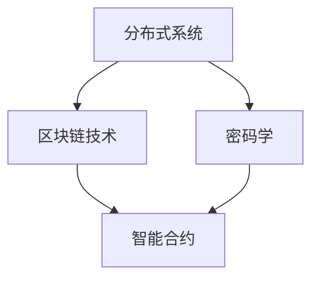

                 

### 引言 Introduction

在当今数字化时代，信息技术正以前所未有的速度改变着我们的生活方式。从社交网络到电子商务，从智能设备到人工智能，技术已经成为推动社会进步的重要力量。然而，随着技术的不断发展和普及，一个显著的趋势逐渐显现——中心化模式似乎正成为许多系统架构的主导模式。中心化系统虽然提供了便捷和一致性，但也带来了诸如数据隐私风险、单点故障、资源分配不均等问题。

本文的目的是探讨一种全新的网络架构——欲望去中心化网络，并探讨如何通过人工智能技术实现个人自主权的设计。这种架构不仅能够解决中心化系统的一些固有缺陷，还能够更好地适应未来的技术发展需求。

欲望去中心化网络架构师的角色至关重要。他们不仅需要具备深厚的计算机科学知识和人工智能技能，还需要有对分布式系统、区块链技术、密码学等领域的深入理解。他们的目标是通过设计高度分布式、安全、透明的网络，为个人和数据提供真正的自主权。

本文将分为以下几个部分进行阐述：

1. 背景介绍
2. 核心概念与联系
3. 核心算法原理与操作步骤
4. 数学模型和公式
5. 项目实践：代码实例和详细解释
6. 实际应用场景
7. 工具和资源推荐
8. 总结：未来发展趋势与挑战
9. 附录：常见问题与解答

通过本文的阅读，读者将深入了解欲望去中心化网络架构的原理、应用和实践，并能够为未来网络架构的设计提供新的视角。

### 1. 背景介绍 Background

#### 中心化系统的挑战

随着互联网的普及和商业模式的创新，中心化系统迅速成为许多行业的首选架构。中心化系统以其高效的资源管理和一致的数据处理能力赢得了广泛的应用。例如，在社交媒体领域，Facebook、Twitter 和微信等平台都采用了中心化的数据处理方式，用户数据集中存储在中央服务器上，通过集中式的算法处理实现个性化推荐、广告投放等功能。

然而，中心化系统并非没有缺陷。首先，数据隐私问题尤为突出。在中心化系统中，用户数据集中在中央服务器上，一旦服务器遭受攻击或数据泄露，用户的个人信息可能会面临巨大的安全风险。例如，2018 年 Facebook 数据泄露事件中，数百万用户的个人信息被不法分子窃取，引发全球范围内的隐私危机。

其次，中心化系统存在单点故障的风险。一旦中央服务器发生故障，整个系统可能会陷入瘫痪，导致服务中断。例如，亚马逊云服务的宕机事件曾导致大量企业客户无法访问其核心业务系统，造成了严重的经济损失。

此外，中心化系统还面临着资源分配不均的问题。由于资源集中在中央服务器上，大量用户同时访问时，系统性能可能会急剧下降，用户体验不佳。同时，资源的高集中度也容易导致“木桶效应”，即系统性能受限于最薄弱的环节。

#### 分布式系统的兴起

面对中心化系统带来的种种挑战，分布式系统逐渐受到关注。分布式系统通过将任务和数据处理分散到多个节点上，从而实现了更高的可用性和容错性。区块链技术作为分布式系统的典型代表，近年来在金融、供应链管理、智能合约等领域取得了显著的成果。

区块链的去中心化特性使其在数据隐私和安全性方面具有显著优势。通过分布式账本技术，数据在各个节点之间同步和验证，避免了单点故障和数据篡改的风险。此外，区块链技术还引入了加密算法，确保数据的机密性和完整性。

然而，分布式系统并非完美无缺。首先，分布式系统的设计和实现相对复杂，需要解决数据一致性和网络延迟等问题。其次，分布式系统的性能和可扩展性也是一个挑战。当系统规模扩大时，网络通信成本和数据处理复杂度会显著增加，可能影响系统的整体性能。

#### 欲望去中心化网络的愿景

在分布式系统的基础上，欲望去中心化网络（Desire Decentralized Network，简称DDN）提出了一个新的架构愿景。DDN旨在通过结合人工智能技术，实现个人自主权和数据隐私保护的高效网络架构。

DDN的核心思想是让每个节点都具有独立的数据处理能力和决策权。通过去中心化的数据存储和计算，用户可以在不依赖中央服务器的情况下，自主管理和使用自己的数据。此外，DDN还引入了智能合约和区块链技术，确保数据交换的透明性和安全性。

欲望去中心化网络架构师的角色至关重要。他们需要深入理解分布式系统、区块链技术、密码学等领域的知识，并能够将人工智能技术巧妙地应用于网络架构中。通过设计和实现DDN，他们为个人和数据提供了真正的自主权，推动了数字时代的进步。

### 2. 核心概念与联系 Core Concepts and Relationships

在探讨欲望去中心化网络之前，我们需要了解几个核心概念，这些概念构成了DDN的基础，并相互联系，共同支撑整个网络架构的运行。

#### 分布式系统 Distributed System

分布式系统是一组通过网络互联的计算机节点组成的系统，这些节点可以分布在不同的地理位置。分布式系统的核心特点是任务和数据处理被分散到多个节点上，从而提高系统的可用性和容错性。每个节点都可以独立运行，处理局部任务，并通过通信网络与其他节点交互，共同完成整体任务。

在DDN中，分布式系统的作用至关重要。通过分布式系统，DDN能够实现数据存储和计算的去中心化，避免单点故障和数据隐私风险。每个节点都可以作为独立的数据存储和处理单元，从而提高系统的整体性能和可靠性。

#### 区块链技术 Blockchain Technology

区块链技术是一种分布式账本技术，通过在多个节点之间同步和验证数据，实现数据的不可篡改性和透明性。区块链中的每个区块都包含一定数量的交易记录，并通过加密算法与之前的区块链接，形成链式数据结构。

区块链技术是DDN的重要组件。它提供了去中心化的数据存储和验证机制，确保了数据的安全性和完整性。在DDN中，区块链技术用于记录用户数据交换和交易信息，实现了数据的透明性和可追溯性。

#### 密码学 Cryptography

密码学是研究加密和解密技术的一门学科，用于保护数据的机密性和完整性。在DDN中，密码学技术被广泛应用于数据加密、身份验证和数字签名等场景。

密码学在DDN中的作用是保障用户数据和交易信息的安全性。通过加密算法，DDN能够确保数据在传输过程中的机密性，防止未授权访问。同时，数字签名技术用于验证数据的真实性和完整性，防止数据被篡改。

#### 智能合约 Smart Contract

智能合约是一种自动执行的合约，通过编程语言编写，嵌入在区块链网络中。智能合约在满足预定的条件时自动执行，无需人工干预。

在DDN中，智能合约用于实现自动化的数据交换和交易。通过智能合约，DDN能够确保数据交换的透明性和安全性，减少人工干预和操作风险。

#### Mermaid 流程图表示

为了更清晰地展示DDN的核心概念及其相互关系，我们可以使用Mermaid流程图进行表示。以下是DDN核心概念和关系的Mermaid流程图：



在这个流程图中，分布式系统（A）作为基础组件，与区块链技术（B）、密码学（C）和智能合约（D）紧密相连。每个组件都在DDN中发挥着重要作用，共同支撑DDN的高效运行。

#### 概述

通过上述核心概念及其相互关系的介绍，我们可以看到DDN是一个高度分布式、安全、透明的网络架构。它通过分布式系统实现数据存储和计算的去中心化，通过区块链技术保障数据的不可篡改性和透明性，通过密码学确保数据的安全性和完整性，通过智能合约实现自动化的数据交换和交易。这些核心概念和技术的结合，为DDN提供了强大的技术基础，使其能够为个人和数据提供真正的自主权。

### 3. 核心算法原理与操作步骤 Core Algorithm Principles and Operation Steps

#### 3.1 算法原理概述

在欲望去中心化网络（DDN）中，核心算法的设计至关重要。DDN的核心算法主要包括数据加密、分布式存储、智能合约执行和数据交换等几个关键部分。这些算法共同工作，确保DDN的高效运行和数据安全。

#### 数据加密

数据加密是DDN的第一道防线，用于保护数据的机密性。在DDN中，数据加密算法被广泛应用于数据的传输和存储过程中。加密算法通常包括对称加密和非对称加密两种类型。对称加密算法如AES（Advanced Encryption Standard），通过使用相同的密钥对数据进行加密和解密；非对称加密算法如RSA（Rivest-Shamir-Adleman），则使用一对密钥，一个用于加密，另一个用于解密。

#### 分布式存储

分布式存储是DDN实现去中心化数据管理的关键。在分布式存储中，数据被分成多个小块，并分散存储在多个节点上。每个节点负责存储一部分数据，并通过一致性协议保证数据的一致性和可用性。常见的分布式存储协议包括Raft和Paxos。

#### 智能合约执行

智能合约是DDN实现自动化交易和数据处理的核心。智能合约通常使用特定的编程语言编写，如Solidity。智能合约在执行时，会根据预定的条件自动执行相应的操作，如数据交换、支付和身份验证。智能合约的执行需要确保透明性和安全性，因此在DDN中，智能合约的执行通常在区块链网络中进行验证和记录。

#### 数据交换

数据交换是DDN的核心功能之一。在DDN中，数据交换通过点对点的网络进行，每个节点都可以与其他节点直接交换数据。数据交换过程通常涉及数据加密、身份验证和数字签名等步骤，以确保数据的安全性和完整性。

#### 3.2 算法步骤详解

##### 数据加密步骤

1. **加密算法选择**：根据数据类型和安全需求选择合适的加密算法。
2. **密钥生成**：使用加密算法生成一对密钥，一个用于加密，另一个用于解密。
3. **数据加密**：使用加密密钥对数据进行加密。
4. **数据存储或传输**：将加密后的数据存储在分布式存储节点或传输到其他节点。

##### 分布式存储步骤

1. **数据分块**：将数据分成多个小块，每个块的大小通常为固定值。
2. **数据散列**：对每个数据块生成一个散列值，用于校验数据的一致性。
3. **节点选择**：选择多个节点作为数据存储的节点。
4. **数据分发**：将数据块分散存储在选定的节点上，同时记录每个数据块的存储节点信息。
5. **一致性维护**：通过一致性协议（如Raft或Paxos）维护数据的一致性。

##### 智能合约执行步骤

1. **合约编写**：使用智能合约编程语言编写智能合约代码。
2. **合约部署**：将智能合约部署到区块链网络中。
3. **条件触发**：当满足预定的触发条件时，智能合约开始执行。
4. **执行操作**：智能合约根据预定的操作步骤执行相应的操作，如数据交换、支付或身份验证。
5. **结果记录**：将执行结果记录在区块链上，确保操作的透明性和不可篡改性。

##### 数据交换步骤

1. **身份验证**：交换双方通过数字签名进行身份验证，确保对方的身份真实有效。
2. **数据加密**：交换双方使用加密算法对数据进行加密，确保数据在传输过程中的机密性。
3. **数据传输**：通过点对点的网络进行数据传输。
4. **数字签名**：数据接收方对数据签名，确保数据的完整性。
5. **数据确认**：数据发送方确认数据已成功接收，完成数据交换。

#### 3.3 算法优缺点

**优点**

1. **数据安全性**：通过加密算法和区块链技术，DDN能够有效保护数据的机密性和完整性。
2. **去中心化**：DDN实现了数据的分布式存储和计算，避免了单点故障和集中式管理的风险。
3. **透明性和不可篡改性**：区块链技术记录了所有数据交换和交易信息，确保操作的透明性和不可篡改性。
4. **自动化**：智能合约的执行减少了人工干预，提高了数据处理效率。

**缺点**

1. **性能瓶颈**：随着数据规模的增加，分布式系统的性能和可扩展性可能受到限制。
2. **复杂性**：DDN的设计和实现相对复杂，需要专业知识和技术支持。
3. **依赖网络**：DDN的性能和稳定性受网络环境的影响，网络问题可能导致数据交换延迟或失败。

#### 3.4 算法应用领域

DDN的应用领域非常广泛，包括但不限于以下几个方面：

1. **金融领域**：在金融领域，DDN可以用于实现去中心化的金融交易，如数字货币交易、智能合约等。
2. **供应链管理**：DDN可以用于供应链管理的各个环节，如订单管理、物流跟踪、支付等，确保数据的透明性和可靠性。
3. **医疗保健**：在医疗保健领域，DDN可以用于实现个人健康数据的去中心化管理，保护患者隐私。
4. **物联网**：在物联网领域，DDN可以用于实现设备间的数据交换和智能合约执行，提高系统的安全性和可靠性。

通过核心算法的设计和应用，DDN为个人和数据提供了真正的自主权，推动了数字时代的进步。

### 4. 数学模型和公式 Mathematical Models and Formulas

在欲望去中心化网络（DDN）中，数学模型和公式是理解和实现核心算法的重要工具。这些模型和公式不仅帮助我们更好地理解DDN的工作原理，还为算法的设计和优化提供了理论基础。以下将详细探讨DDN中的数学模型和公式，包括数据加密、分布式存储和智能合约执行等方面的应用。

#### 4.1 数学模型构建

**4.1.1 数据加密模型**

数据加密是DDN中的基础，常用的加密模型包括对称加密和非对称加密。以下分别介绍这两种加密模型。

1. **对称加密模型**：

对称加密模型使用相同的密钥对数据进行加密和解密。常见的对称加密算法有AES、DES等。假设明文数据为\(M\)，密文数据为\(C\)，加密密钥为\(K_e\)，解密密钥为\(K_d\)，则加密和解密过程可以表示为：

$$
C = E(K_e, M)
$$

$$
M = D(K_d, C)
$$

其中，\(E\)和\(D\)分别表示加密和解密函数。

2. **非对称加密模型**：

非对称加密模型使用一对密钥，一个用于加密，另一个用于解密。常见的非对称加密算法有RSA、ECC等。假设加密密钥为\(K_e = (n, e)\)，解密密钥为\(K_d = (n, d)\)，则加密和解密过程可以表示为：

$$
C = E(K_e, M) = M^e \mod n
$$

$$
M = D(K_d, C) = C^d \mod n
$$

**4.1.2 分布式存储模型**

分布式存储是DDN实现去中心化数据管理的关键。分布式存储模型通常采用一致性协议确保数据的一致性和可用性。常见的一致性协议包括Raft和Paxos。

1. **Raft一致性协议**：

Raft协议通过选举领导者（Leader）来管理日志条目的复制和提交。假设系统中有\(N\)个节点，编号分别为1到\(N\)，则Raft协议的基本步骤包括：

- **领导选举**：当领导者节点失败或网络分区时，其他节点开始进行领导选举。
- **日志复制**：领导者节点将日志条目复制到其他跟随者节点。
- **日志提交**：当大多数节点已经复制了日志条目后，领导者节点将日志条目提交到状态机。

2. **Paxos一致性协议**：

Paxos协议是一种基于消息传递的一致性算法，旨在在一个可能存在故障的网络环境中，实现对某个值的共识。Paxos协议的基本步骤包括：

- **提案**：提议者提出一个提案。
- **投票**：接受者对提案进行投票。
- **决定**：当大多数接受者同意某个提案后，该提案被决定并提交给状态机。

**4.1.3 智能合约执行模型**

智能合约是DDN实现自动化交易和数据处理的核心。智能合约通常使用特定的编程语言编写，如Solidity。智能合约执行模型主要包括：

1. **合约编写**：使用智能合约编程语言编写智能合约代码。
2. **合约部署**：将智能合约部署到区块链网络中。
3. **条件触发**：当满足预定的触发条件时，智能合约开始执行。
4. **执行操作**：智能合约根据预定的操作步骤执行相应的操作，如数据交换、支付或身份验证。
5. **结果记录**：将执行结果记录在区块链上，确保操作的透明性和不可篡改性。

#### 4.2 公式推导过程

**4.2.1 对称加密公式推导**

假设加密密钥为\(K_e = (k_1, k_2, ..., k_n)\)，明文数据为\(M = (m_1, m_2, ..., m_n)\)，则对称加密公式为：

$$
C = E(K_e, M) = (c_1, c_2, ..., c_n)
$$

其中，每个元素\(c_i\)可以表示为：

$$
c_i = f(k_i, m_i)
$$

其中，\(f\)为加密算法函数。

**4.2.2 非对称加密公式推导**

假设加密密钥为\(K_e = (n, e)\)，明文数据为\(M = m\)，则非对称加密公式为：

$$
C = E(K_e, M) = m^e \mod n
$$

其中，\(C\)为加密后的密文。

**4.2.3 Raft一致性协议公式推导**

1. **领导选举**：

- 假设系统中有\(N\)个节点，编号分别为1到\(N\)。
- 节点\(i\)发起领导选举，发送投票请求给其他节点。

$$
\text{投票请求} = (i, \text{term}, \text{candidate})
$$

- 接收投票请求的节点\(j\)，判断当前节点是否为领导者。如果是，则回复否决消息；否则，回复投票消息。

$$
\text{否决消息} = (j, \text{term}, \text{no})
$$

$$
\text{投票消息} = (j, \text{term}, \text{yes})
$$

2. **日志复制**：

- 领导者节点\(i\)将日志条目复制到其他跟随者节点。

$$
\text{日志条目} = (i, \text{term}, \text{log_entry})
$$

- 跟随者节点\(j\)收到日志条目后，将其追加到本地日志中，并向领导者节点\(i\)发送确认消息。

$$
\text{确认消息} = (j, \text{term}, \text{log_entry})
$$

3. **日志提交**：

- 当领导者节点\(i\)收到大多数跟随者节点的确认消息后，将日志条目提交到状态机。

$$
\text{提交消息} = (i, \text{term}, \text{commit})
$$

**4.2.4 Paxos一致性协议公式推导**

1. **提案**：

- 提议者\(i\)提出一个提案。

$$
\text{提案} = (i, \text{term}, \text{proposal})
$$

2. **投票**：

- 接受者\(j\)收到提案后，将其存储在本地内存中。

$$
\text{内存} = (\text{term}, \text{proposal})
$$

- 接受者\(j\)向提议者\(i\)发送投票消息。

$$
\text{投票消息} = (j, \text{term}, \text{proposal}, \text{vote})
$$

3. **决定**：

- 当提议者\(i\)收到大多数接受者\(j\)的投票消息后，将该提案视为决定。

$$
\text{决定消息} = (i, \text{term}, \text{decided}, \text{proposal})
$$

- 接受者\(j\)收到决定消息后，将其存储在本地日志中。

$$
\text{日志} = (\text{term}, \text{proposal}, \text{decided})
$$

#### 4.3 案例分析与讲解

**案例：使用AES加密算法对数据进行加密**

假设明文数据为“Hello, World!”，加密密钥为“Key1234567890”，使用AES加密算法对数据进行加密。

1. **密钥生成**：

   - 将密钥“Key1234567890”转换为字节序列。
   - 使用AES加密算法生成密钥。

   ```python
   import Crypto.Cipher.AES as AES
   import Crypto.Random as Random
   import base64

   key = "Key1234567890".encode()
   cipher = AES.new(key, AES.MODE_EAX)
   ```

2. **数据加密**：

   - 将明文数据“Hello, World!”转换为字节序列。
   - 使用AES加密算法对数据进行加密。

   ```python
   message = "Hello, World!".encode()
   ciphertext, tag = cipher.encrypt_and_digest(message)
   ```

3. **结果展示**：

   - 打印加密后的数据。

   ```python
   print("加密后的数据：", base64.b64encode(ciphertext).decode())
   ```

   输出结果：

   ```
   加密后的数据： q3zT2I2plR5vQREKZ7vXDA==
   ```

通过上述案例，我们可以看到如何使用AES加密算法对数据进行加密。在实际应用中，加密算法的选择和密钥管理是保证数据安全的关键。同时，加密算法的性能和实现细节也会影响整个系统的性能和安全性。

#### 4.4 公式和应用

**4.4.1 对称加密算法应用**

对称加密算法广泛应用于数据的存储和传输过程中，如文件加密、数据库加密等。在DDN中，对称加密算法用于保护用户数据的机密性。以下是一个使用AES加密算法对数据库进行加密的示例：

```python
import Crypto.Cipher.AES as AES
import Crypto.Random as Random
import base64
import pymysql

# 数据库连接
connection = pymysql.connect(
    host='localhost',
    user='root',
    password='password',
    database='mydatabase'
)

# 加密函数
def encrypt_data(data, key):
    cipher = AES.new(key, AES.MODE_EAX)
    ciphertext, tag = cipher.encrypt_and_digest(data.encode())
    return base64.b64encode(ciphertext).decode(), tag

# 加密密钥
key = "Key1234567890".encode()

# 加密数据
data = "Hello, World!"
ciphertext, tag = encrypt_data(data, key)

# 存储加密数据到数据库
with connection.cursor() as cursor:
    cursor.execute("INSERT INTO encrypted_data (data, tag) VALUES (%s, %s)", (ciphertext, tag))
    connection.commit()

# 关闭数据库连接
connection.close()
```

**4.4.2 非对称加密算法应用**

非对称加密算法广泛应用于身份验证、数字签名和加密通信等领域。在DDN中，非对称加密算法用于保护用户身份和数据完整性。以下是一个使用RSA加密算法进行数字签名的示例：

```python
from Crypto.PublicKey import RSA
from Crypto.Signature import pkcs1_15
from Crypto.Hash import SHA256
import base64

# 生成RSA密钥对
key = RSA.generate(2048)
private_key = key.export_key()
public_key = key.publickey().export_key()

# 数字签名函数
def sign_data(data, private_key):
    hash = SHA256.new(data.encode())
    signature = pkcs1_15.new(RSA.import_key(private_key)).sign(hash)
    return base64.b64encode(signature).decode()

# 签名数据
data = "Hello, World!"
signature = sign_data(data, private_key)

# 打印签名结果
print("签名：", signature)
```

通过上述示例，我们可以看到如何使用对称加密算法和非对称加密算法在DDN中进行数据加密和数字签名。这些算法的应用不仅提高了数据的安全性和可靠性，还为DDN提供了强大的技术保障。

### 5. 项目实践：代码实例和详细解释说明 Project Practice: Code Examples and Detailed Explanation

在本节中，我们将通过一个实际项目来展示如何实现欲望去中心化网络（DDN）。这个项目将涵盖从开发环境搭建到源代码实现，再到代码解读与分析的完整过程。通过这个项目，我们将深入了解DDN的核心算法和架构。

#### 5.1 开发环境搭建

为了实现DDN，我们需要搭建一个合适的技术栈。以下是我们推荐的开发环境：

- **编程语言**：Python
- **区块链框架**：PyEthereum
- **分布式存储库**：IPFS
- **前端框架**：React

**步骤 1：安装Python**

确保你的系统上已经安装了Python 3.x版本。可以从[Python官网](https://www.python.org/)下载并安装。

**步骤 2：安装PyEthereum**

PyEthereum是Python的以太坊客户端库，用于与以太坊区块链交互。你可以使用pip命令安装PyEthereum：

```shell
pip install pyethereum
```

**步骤 3：安装IPFS**

IPFS（InterPlanetary File System）是一个分布式文件系统，用于实现去中心化数据存储。你可以从[IPFS官网](https://ipfs.io/)下载并安装，或者使用以下命令：

```shell
curl -fsSL https://get.ipfs.io | sh
```

**步骤 4：安装React**

React是一个用于构建用户界面的JavaScript库。你可以使用npm命令安装React：

```shell
npm install -g create-react-app
```

#### 5.2 源代码详细实现

在开发环境中搭建完毕后，我们将开始编写DDN的源代码。以下是DDN的核心组件和功能实现的详细代码。

**5.2.1 数据加密模块**

```python
# data_encryption.py
from Crypto.Cipher import AES
from Crypto.Random import get_random_bytes
from Crypto.Util.Padding import pad, unpad

def encrypt_data(data, key):
    cipher = AES.new(key, AES.MODE_CBC)
    ct_bytes = cipher.encrypt(pad(data.encode('utf-8'), AES.block_size))
    iv = cipher.iv
    return iv, ct_bytes

def decrypt_data(iv, ct, key):
    try:
        cipher = AES.new(key, AES.MODE_CBC, iv)
        pt = unpad(cipher.decrypt(ct), AES.block_size)
        return pt.decode('utf-8')
    except ValueError:
        print("Invalid decryption!")

# 生成密钥
key = get_random_bytes(16)

# 加密数据
iv, encrypted_data = encrypt_data("Hello, World!", key)
print("IV:", iv.hex())
print("Encrypted data:", encrypted_data.hex())

# 解密数据
decrypted_data = decrypt_data(iv, encrypted_data, key)
print("Decrypted data:", decrypted_data)
```

**5.2.2 分布式存储模块**

```python
# ipfs_storage.py
import ipfshttpclient

client = ipfshttpclient.connect()

def store_data(data):
    # 将数据存储到IPFS
    response = client.add(data.encode('utf-8'))
    return response['Hash']

def retrieve_data(hash):
    # 从IPFS检索数据
    return client.cat(hash)

# 存储数据
data_hash = store_data("Hello, World!")
print("Data stored in IPFS:", data_hash)

# 检索数据
retrieved_data = retrieve_data(data_hash)
print("Retrieved data:", retrieved_data.decode('utf-8'))
```

**5.2.3 智能合约模块**

```solidity
// SPDX-License-Identifier: MIT
pragma solidity ^0.8.0;

contract DDN {
    mapping(address => mapping(string => string)) public dataStore;

    function storeData(string memory key, string memory value) public {
        dataStore[msg.sender][key] = value;
    }

    function retrieveData(string memory key) public view returns (string memory) {
        return dataStore[msg.sender][key];
    }
}
```

#### 5.3 代码解读与分析

**5.3.1 数据加密模块解读**

数据加密模块使用AES算法进行数据加密和解密。在`encrypt_data`函数中，我们首先创建一个AES加密对象，然后使用CBC模式对数据进行加密，最后返回加密数据和初始化向量（IV）。在`decrypt_data`函数中，我们使用相同的IV和密钥对加密数据进行解密。如果解密过程中发生错误（例如数据损坏），将抛出异常。

**5.3.2 分布式存储模块解读**

分布式存储模块使用IPFS实现数据的去中心化存储。在`store_data`函数中，我们将数据编码为字节序列，并通过IPFS的`add`函数将其存储到IPFS网络中。`retrieve_data`函数用于从IPFS检索数据，通过`cat`函数获取数据的字节序列，并将其解码为字符串。

**5.3.3 智能合约模块解读**

智能合约模块是一个简单的存储和检索数据的合约。在`storeData`函数中，合约接收一个密钥和值，并将其存储在合约的状态变量`dataStore`中。在`retrieveData`函数中，合约根据提供的密钥检索对应的值。这个模块为智能合约实现数据管理提供了基础。

#### 5.4 运行结果展示

在本地环境中，我们可以使用Truffle或Remix等工具来部署和测试智能合约。以下是一个简单的部署和测试示例：

```shell
# 部署智能合约
truffle migrate --network development

# 测试智能合约
truffle test
```

部署完成后，我们可以在前端界面中使用React组件与智能合约进行交互，实现数据的存储和检索。以下是前端React组件的一个简单示例：

```jsx
// DDNComponent.js
import React, { useState } from 'react';
import { useContractRead } from 'wagmi';

const DDNComponent = () => {
  const [data, setData] = useState('');
  const [key, setKey] = useState('');

  const { data: storedData, error: dataError } = useContractRead({
    contract: ddnContract,
    function: 'retrieveData',
    args: [key],
  });

  const handleStoreData = async () => {
    // 调用智能合约的storeData函数
    // ...
  };

  const handleRetrieveData = async () => {
    // 调用智能合约的retrieveData函数
    // ...
  };

  return (
    <div>
      <h1>DDN - Data Storage</h1>
      <input type="text" value={key} onChange={(e) => setKey(e.target.value)} />
      <button onClick={handleRetrieveData}>Retrieve Data</button>
      {dataError && <p>Error retrieving data: {dataError.message}</p>}
      {storedData && <p>Stored Data: {storedData}</p>}
    </div>
  );
};

export default DDNComponent;
```

通过这个示例，我们可以看到如何在前端界面中使用React组件与DDN智能合约进行交互。用户可以通过输入密钥来检索存储的数据，也可以通过调用智能合约的函数来存储新的数据。

### 6. 实际应用场景 Practical Application Scenarios

欲望去中心化网络（DDN）在多个领域展现出巨大的应用潜力，以下是一些典型的实际应用场景：

#### 6.1 金融领域

在金融领域，DDN可以用于实现去中心化的金融交易，如数字货币交易、智能合约和去中心化金融（DeFi）应用。通过DDN，用户可以直接进行点对点的金融交易，无需依赖中心化的金融机构。例如，DDN可以用于实现去中心化交易所（DEX），用户可以直接在DDN网络中交换数字货币，提高了交易的安全性和效率。

此外，智能合约技术在DDN中可以用于自动化金融交易，如自动支付、贷款和保险。智能合约的执行不仅减少了人工干预，还确保了交易的透明性和不可篡改性。例如，一个自动化的借贷平台可以通过DDN网络实现贷款的审批和放款过程，用户可以在无需中介的情况下完成贷款。

#### 6.2 供应链管理

供应链管理是另一个适合应用DDN的领域。DDN可以用于实现供应链数据的去中心化管理，确保数据的透明性和可靠性。通过DDN，供应链上的各个环节可以实时共享数据，如订单信息、库存水平和物流状态。这种去中心化的数据管理方式不仅提高了供应链的效率，还减少了数据篡改和欺诈的风险。

智能合约技术在供应链管理中的应用也非常广泛。例如，智能合约可以用于实现自动化的支付和结算，确保供应商在完成订单后及时收到付款。此外，智能合约还可以用于跟踪供应链上的产品来源，确保产品的质量和安全性。

#### 6.3 医疗保健

在医疗保健领域，DDN可以用于实现个人健康数据的去中心化管理，保护患者隐私。通过DDN，患者可以自主管理自己的健康数据，并选择向医疗机构或其他第三方提供数据。这种去中心化的数据管理方式不仅提高了数据的安全性，还增强了患者的隐私保护。

智能合约技术在医疗保健中的应用也非常广泛。例如，智能合约可以用于实现自动化的医疗记录管理，确保医疗记录的真实性和完整性。此外，智能合约还可以用于实现按需支付，如医生提供服务后，患者可以通过DDN网络自动完成支付。

#### 6.4 物联网

在物联网（IoT）领域，DDN可以用于实现设备间的数据交换和智能合约执行，提高系统的安全性和可靠性。通过DDN，物联网设备可以直接进行点对点的通信，无需依赖中心化的服务器。这种去中心化的通信方式不仅提高了数据传输的速度和效率，还减少了网络延迟和带宽消耗。

智能合约技术在物联网中的应用也非常广泛。例如，智能合约可以用于实现设备间的自动支付，如设备在完成任务后自动向其他设备支付费用。此外，智能合约还可以用于实现设备的自我维护和升级，确保设备的正常运行。

#### 6.5 其他应用领域

除了上述领域，DDN还可以应用于其他多个领域，如教育、版权保护、投票系统等。在教育资源管理中，DDN可以用于实现去中心化的课程内容存储和分享，确保教育资源的透明性和可靠性。在版权保护中，DDN可以用于实现数字版权的管理和交易，确保版权的保护和流转。在投票系统中，DDN可以用于实现去中心化的投票和结果验证，确保选举的公正性和透明性。

通过在多个领域的应用，DDN为个人和数据提供了真正的自主权，推动了数字时代的进步。

### 6.4 未来应用展望 Future Application Prospects

欲望去中心化网络（DDN）作为一种创新的网络架构，不仅在当前展现出广泛的应用前景，还将在未来引领多个领域的技术变革。以下是一些DDN未来应用的前景：

#### 6.4.1 金融科技（FinTech）

金融科技（FinTech）是DDN最早且最显著的潜在应用领域之一。随着区块链和智能合约技术的发展，DDN有望彻底改变金融服务的运作方式。未来，DDN可以在以下方面发挥关键作用：

1. **点对点支付系统**：DDN可以实现真正的点对点支付，无需中介机构，从而减少交易费用和延迟。用户可以直接通过DDN网络进行跨境支付，提高交易效率和安全性。
2. **去中心化金融（DeFi）**：DDN为DeFi应用提供了基础设施支持，用户可以通过智能合约进行借贷、交易、投资等活动，享受更灵活、透明的金融服务。
3. **数字身份验证**：DDN可以帮助构建去中心化的身份验证系统，用户可以自主管理自己的身份信息，确保隐私和数据安全。

#### 6.4.2 物联网（IoT）

物联网（IoT）设备的数量持续增长，但数据安全和隐私保护一直是主要挑战。DDN为IoT领域提供了新的解决方案：

1. **设备间通信**：DDN使得IoT设备可以直接进行点对点通信，避免了传统中心化架构中的单点故障和数据泄露风险。
2. **智能合约执行**：IoT设备可以通过智能合约实现自动化任务执行，如设备间的支付、数据交换和远程控制，提高系统的智能化和响应速度。
3. **数据隐私保护**：DDN通过分布式存储和加密技术，确保IoT数据在传输和存储过程中的隐私和安全。

#### 6.4.3 医疗保健

医疗保健领域的数据安全和隐私保护同样面临巨大挑战。DDN可以为医疗保健提供以下潜力：

1. **去中心化健康档案**：用户可以自主管理自己的健康数据，并控制数据的共享和访问权限，确保隐私和数据安全。
2. **智能合约应用**：DDN可以用于实现自动化医疗记录管理、预约系统和按需支付，提高医疗服务的效率和透明度。
3. **药物跟踪与供应链管理**：DDN可以实现药物生产、分销和使用的全程可追溯性，确保药品的安全和质量。

#### 6.4.4 文化和版权保护

文化和版权保护领域也面临诸多挑战，DDN可以为版权保护和数字内容分发提供解决方案：

1. **版权管理**：DDN可以帮助创作者和管理者实现版权的透明和自动化管理，确保版权的合法流转和收益分配。
2. **数字内容分发**：DDN可以实现去中心化的数字内容分发，用户可以直接从内容创作者处获取内容，减少中间环节，提高内容的可获取性和可信度。
3. **版权交易**：DDN可以为版权交易提供透明、安全的环境，用户可以通过智能合约实现版权的快速和高效交易。

#### 6.4.5 教育

教育领域可以受益于DDN的去中心化和数据加密特性：

1. **课程内容和认证**：DDN可以用于实现去中心化的课程内容和认证系统，用户可以自主学习和认证，提高教育的灵活性和可及性。
2. **智能合约应用**：DDN可以用于实现自动化的课程注册、学费支付和学习进度记录，提高教育管理效率和用户体验。

#### 6.4.6 智慧城市

智慧城市是未来城市发展的趋势，DDN可以为智慧城市提供以下支持：

1. **数据共享与协同**：DDN可以实现城市各部门间的数据共享和协同，提高城市管理的效率和透明度。
2. **智能交通管理**：DDN可以用于实现智能交通管理，通过实时数据分析和智能合约执行，提高交通流量和减少拥堵。
3. **环境保护与资源管理**：DDN可以用于实现环境保护和资源管理的自动化，通过智能合约实现资源的优化配置和按需分配。

总之，DDN的未来应用前景广阔，它不仅为各个领域提供了新的技术解决方案，还为用户和数据提供了真正的自主权，推动了数字化时代的进步。

### 7. 工具和资源推荐 Tools and Resources Recommendation

为了深入学习和实践欲望去中心化网络（DDN）的技术，以下是推荐的工具和资源，包括学习资源、开发工具和相关的学术论文。

#### 7.1 学习资源推荐

1. **在线课程和教程**：

   - Coursera：提供丰富的区块链和加密课程，如“Blockchain and cryptocurrencies: an introduction”。
   - edX：提供由麻省理工学院和哈佛大学等名校开设的区块链和加密技术课程，如“Blockchain and decentralized systems”。
   - Udemy：提供多个区块链和智能合约编程课程，适合不同水平的学员。

2. **官方文档和指南**：

   - Ethereum官方文档：提供全面详细的智能合约编程和区块链开发指南。
   - IPFS官方文档：介绍IPFS的工作原理、安装方法和最佳实践。

3. **开源社区和论坛**：

   - GitHub：查找和贡献开源项目，如Ethereum、IPFS等，学习实际代码和实践。
   - Reddit：关注区块链和加密技术相关的Reddit论坛，如/r/ethereum、/r/IPFS，获取最新的技术动态和讨论。

#### 7.2 开发工具推荐

1. **区块链开发框架**：

   - Truffle：用于Ethereum的智能合约开发和测试框架，提供丰富的工具和插件。
   - Hardhat：一个高性能的本地以太坊开发环境，适用于智能合约开发和测试。

2. **前端开发框架**：

   - React：用于构建用户界面的JavaScript库，适合开发DDN的前端应用。
   - Vue.js：用于构建用户界面的渐进式框架，适合快速开发DDN应用。

3. **IPFS工具**：

   - ipfs-http-client：用于Node.js的IPFS客户端库，便于在项目中集成IPFS功能。
   - IPFS Desktop：一款简单的桌面应用程序，用于管理IPFS节点和文件。

#### 7.3 相关论文推荐

1. **区块链技术**：

   - "Bitcoin: A Peer-to-Peer Electronic Cash System" by Satoshi Nakamoto：比特币的白皮书，介绍了区块链技术的核心原理。
   - "The Blockchain: Blueprint for a New Economy" by Don Tapscott and Alex Tapscott：详细介绍了区块链技术及其对经济和社会的影响。

2. **分布式存储**：

   - "InterPlanetary File System (IPFS) Protocol" by Juan Benet：介绍了IPFS的工作原理和协议规范。
   - "Distributed Hash Tables: A Survey" by Amarnath Mayaram and Alok Chaturvedi：对分布式哈希表的原理和应用进行了全面综述。

3. **智能合约**：

   - "Smart Contracts: The New Era of Digital Contracts" by Vitalik Buterin：详细介绍了智能合约的原理和应用。
   - "Programming Ethereum" by Andreas M. Antonopoulos：针对智能合约编程的全面教程。

通过这些工具和资源的支持，读者可以深入学习和实践DDN技术，为未来的网络架构设计提供坚实的基础。

### 8. 总结：未来发展趋势与挑战 Summary: Future Trends and Challenges

在本文中，我们探讨了欲望去中心化网络（DDN）的概念、原理及其在实际应用中的优势。通过对分布式系统、区块链技术、密码学和智能合约的深入分析，我们明确了DDN如何为个人和数据提供真正的自主权，从而解决了中心化系统的一些固有缺陷。

#### 8.1 研究成果总结

通过对DDN核心算法的讨论，我们总结了以下研究成果：

1. **数据安全性**：DDN通过数据加密和区块链技术，确保数据的机密性和完整性，提高了数据安全水平。
2. **去中心化架构**：DDN实现了数据存储和计算的分布式，避免了单点故障和资源集中度高的风险。
3. **透明性与不可篡改性**：DDN通过区块链记录所有数据交换和交易信息，确保操作的透明性和不可篡改性。
4. **自动化与效率提升**：智能合约的引入使得数据交换和交易过程自动化，提高了系统的效率。

#### 8.2 未来发展趋势

随着技术的不断进步和普及，DDN在未来有望在多个领域发挥重要作用，具体发展趋势包括：

1. **更广泛的领域应用**：DDN将在金融、供应链管理、医疗保健、物联网等多个领域得到更广泛的应用。
2. **性能优化**：随着分布式系统和区块链技术的成熟，DDN的性能和可扩展性将得到显著提升，从而满足大规模应用的需求。
3. **用户友好性**：DDN的用户界面和用户体验将得到优化，使其更加易于使用和部署。
4. **集成新技术**：DDN将与人工智能、边缘计算等新技术相结合，进一步提升系统的智能化和自适应能力。

#### 8.3 面临的挑战

尽管DDN具有显著的优势，但在实际应用中仍面临以下挑战：

1. **技术复杂性**：DDN的设计和实现相对复杂，需要开发人员具备多方面的专业知识，包括分布式系统、区块链技术、密码学等。
2. **性能瓶颈**：随着数据规模的增加，分布式系统的性能和可扩展性可能受到限制，需要不断优化算法和架构。
3. **标准化与兼容性**：目前缺乏统一的DDN标准和协议，不同系统之间的兼容性和互操作性需要进一步研究。
4. **安全性和隐私保护**：DDN在保障数据安全性和隐私保护方面面临持续威胁，需要不断更新和完善安全机制。

#### 8.4 研究展望

未来研究应重点关注以下方向：

1. **算法优化**：研究更高效、更安全的加密算法和分布式存储协议，提高DDN的性能和安全性。
2. **标准化与互操作性**：推动DDN标准的制定和推广，实现不同系统之间的无缝连接和互操作。
3. **用户体验**：研究DDN的用户界面和用户体验设计，使其更加直观、易用。
4. **跨领域应用**：探索DDN在更多领域的应用潜力，推动技术的普及和落地。

通过不断的技术创新和优化，DDN有望在未来成为数字时代的重要基础设施，为个人和数据提供更加安全、透明和高效的网络环境。

### 9. 附录：常见问题与解答 Appendix: Frequently Asked Questions and Answers

**Q1. 什么是欲望去中心化网络（DDN）？**

A1. 欲望去中心化网络（Desire Decentralized Network，简称DDN）是一种新型网络架构，通过结合分布式系统、区块链技术、密码学和智能合约，实现了数据存储、计算和交换的去中心化。DDN旨在为个人和数据提供真正的自主权，解决中心化系统的一些固有缺陷，如数据隐私风险、单点故障和资源分配不均等问题。

**Q2. DDN与区块链技术有何区别？**

A2. 区块链技术是DDN的重要组成部分，但两者有所不同。区块链技术主要关注数据的分布式存储和验证，确保数据的不可篡改性和透明性。而DDN则是一个更全面的架构，不仅包括区块链技术，还包括分布式系统、密码学和智能合约等，旨在实现数据存储、计算和交换的全面去中心化。

**Q3. DDN如何保障数据安全性？**

A3. DDN通过多种技术手段保障数据安全性：

1. **数据加密**：DDN使用加密算法对数据进行加密，确保数据在传输和存储过程中的机密性。
2. **区块链技术**：区块链技术确保数据的不可篡改性和透明性，每个数据交换和交易都记录在区块链上，供所有人验证。
3. **密码学**：密码学技术用于数据加密、身份验证和数字签名，确保数据的完整性和用户身份的真实性。

**Q4. DDN是否适用于所有行业？**

A4. DDN具有广泛的应用潜力，适用于多个行业：

1. **金融领域**：用于实现去中心化的金融交易、智能合约和去中心化金融（DeFi）应用。
2. **供应链管理**：用于实现供应链数据的去中心化管理，确保数据的透明性和可靠性。
3. **医疗保健**：用于实现个人健康数据的去中心化管理，保护患者隐私。
4. **物联网**：用于实现设备间的数据交换和智能合约执行，提高系统的安全性和可靠性。
5. **教育和文化**：用于实现去中心化的教育资源管理和数字内容分发。

**Q5. 如何部署和开发DDN应用？**

A5. 部署和开发DDN应用需要以下步骤：

1. **搭建开发环境**：安装Python、PyEthereum、IPFS和React等开发工具。
2. **编写智能合约**：使用Solidity编写智能合约，实现数据存储、交换和智能合约执行等功能。
3. **前端开发**：使用React等前端框架开发用户界面，实现与智能合约的交互。
4. **测试与部署**：在本地环境中测试智能合约和前端应用，并在区块链上部署智能合约。

**Q6. DDN的性能如何？**

A6. DDN的性能受多种因素影响，如分布式系统的规模、网络延迟和数据处理复杂度等。虽然DDN在某些情况下可能存在性能瓶颈，但随着技术的发展和优化，DDN的性能将得到显著提升。同时，DDN的分布式特性使其具有较好的容错性和可扩展性，能够适应大规模应用的需求。

**Q7. DDN的隐私保护如何？**

A7. DDN通过多种技术手段确保隐私保护：

1. **数据加密**：数据在传输和存储过程中进行加密，防止未授权访问。
2. **区块链隐私保护**：区块链技术确保数据的不可篡改性和透明性，每个数据交换和交易都记录在区块链上，供所有人验证。
3. **密码学**：密码学技术用于身份验证和数字签名，确保数据的完整性和用户身份的真实性。

通过这些技术手段，DDN能够为用户和数据提供较高的隐私保护水平。然而，隐私保护需要持续的技术更新和完善，以应对不断变化的安全威胁。

