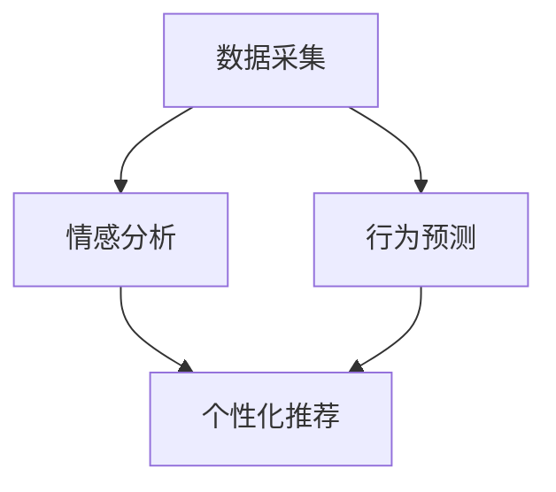

                 

关键词：AI、自我管理、欲望调节、智能平台、技术博客

> 摘要：本文旨在介绍一种基于人工智能的欲望智能调节中心，它是一种创新的自我管理平台，通过先进的数据分析和机器学习技术，帮助用户更好地理解和管理自己的欲望，提升生活质量。本文将详细探讨该平台的核心概念、算法原理、应用场景以及未来发展趋势。

## 1. 背景介绍

在现代社会，人们面临各种压力和诱惑，使得欲望管理成为了一个越来越重要的课题。传统的自我管理方法往往依赖于用户的自觉性和毅力，而效果常常不甚理想。随着人工智能技术的发展，AI在欲望管理领域的应用开始崭露头角，成为了一种新的可能性。本文将探讨如何利用AI技术构建一个智能的欲望调节中心，以辅助用户实现自我管理。

### 人工智能的发展与应用

人工智能（AI）是一种模拟人类智能行为的计算机技术，其应用范围广泛，从语音识别、图像处理到自动驾驶和智能医疗，都取得了显著进展。近年来，随着大数据和机器学习技术的进步，AI在情感分析、行为预测和个性化推荐等领域展现出了巨大的潜力。

### 自我管理的重要性

自我管理是指个体通过自我观察、自我评估和自我调整，实现个人目标的过程。良好的自我管理能力可以帮助人们应对压力、提高工作效率、提升生活质量。然而，现代社会的复杂性和快节奏使得传统的自我管理方法越来越难以适应。因此，寻找新的自我管理手段，特别是借助人工智能，成为了当务之急。

## 2. 核心概念与联系

### 核心概念

欲望智能调节中心是一个基于人工智能的综合性自我管理平台，旨在帮助用户理解和调节自己的欲望。平台的核心概念包括数据采集、情感分析、行为预测和个性化推荐。

#### 数据采集

平台通过多种渠道收集用户的数据，包括日常行为记录、社交媒体活动、生理健康数据等。这些数据将用于分析用户的欲望和行为模式。

#### 情感分析

利用自然语言处理技术，平台可以分析用户的情感状态，识别出用户在特定情境下的情绪波动，从而更好地理解用户的内心世界。

#### 行为预测

通过机器学习算法，平台可以预测用户在未来一段时间内的欲望和行为，从而提前进行调节和干预。

#### 个性化推荐

基于用户的个人偏好和历史行为，平台可以提供个性化的建议和指导，帮助用户更好地管理自己的欲望。

### Mermaid 流程图



## 3. 核心算法原理 & 具体操作步骤

### 算法原理概述

欲望智能调节中心的核心算法包括情感分析算法、行为预测算法和个性化推荐算法。这些算法利用大数据和机器学习技术，通过对用户数据的分析和处理，实现欲望调节的目标。

#### 情感分析算法

情感分析算法主要通过自然语言处理技术，从文本中提取情感信息。具体步骤包括：

1. 数据预处理：对文本进行分词、去停用词等操作，提取关键信息。
2. 情感分类：利用情感词典和机器学习模型，对文本进行情感分类，识别用户的情感状态。

#### 行为预测算法

行为预测算法通过时间序列分析和机器学习模型，预测用户在未来一段时间内的欲望和行为。具体步骤包括：

1. 数据预处理：对用户行为数据进行清洗、去噪等处理，提取有效特征。
2. 模型训练：利用历史数据训练行为预测模型，如ARIMA、LSTM等。
3. 预测与评估：使用训练好的模型对用户未来行为进行预测，并评估预测的准确性。

#### 个性化推荐算法

个性化推荐算法通过协同过滤、矩阵分解等方法，为用户提供个性化的欲望调节建议。具体步骤包括：

1. 数据预处理：对用户行为数据进行编码、去重等处理，构建用户-物品矩阵。
2. 模型训练：利用矩阵分解方法训练推荐模型，如SVD、NMF等。
3. 推荐生成：基于用户历史行为和推荐模型，生成个性化的推荐结果。

### 算法步骤详解

1. **数据采集**：从用户行为数据、社交媒体数据和生理健康数据等多个渠道收集数据。
2. **数据预处理**：对采集到的数据进行清洗、去噪、编码等处理，提取有效特征。
3. **情感分析**：利用自然语言处理技术，对文本数据进行情感分类，识别用户的情感状态。
4. **行为预测**：利用时间序列分析和机器学习模型，预测用户在未来一段时间内的欲望和行为。
5. **个性化推荐**：基于用户历史行为和推荐模型，生成个性化的欲望调节建议。
6. **用户反馈**：收集用户对平台推荐和建议的反馈，用于模型优化和调整。

### 算法优缺点

**优点：**

1. **高效性**：利用机器学习和大数据技术，能够快速处理和分析大量数据，提供准确的欲望调节建议。
2. **个性化**：基于用户个人偏好和历史行为，提供个性化的调节方案，满足用户的不同需求。
3. **实时性**：能够实时监测用户情感和行为变化，及时进行调节和干预。

**缺点：**

1. **数据隐私**：用户数据的安全性和隐私性是平台面临的重要挑战。
2. **准确性**：尽管算法能够提供较为准确的预测和推荐，但在某些情况下仍可能出现偏差。

### 算法应用领域

1. **健康管理**：通过分析用户的生理健康数据和行为模式，提供个性化的健康建议和预警。
2. **心理辅导**：利用情感分析和行为预测，为用户提供心理辅导和支持。
3. **社会管理**：通过监测和分析社会行为数据，帮助政府和社会组织进行政策制定和调整。

## 4. 数学模型和公式 & 详细讲解 & 举例说明

### 4.1 数学模型构建

欲望智能调节中心的数学模型主要包括情感分析模型、行为预测模型和个性化推荐模型。以下分别介绍这三个模型的构建过程。

#### 情感分析模型

情感分析模型主要用于从文本中提取情感信息。其基本公式为：

$$
S = f(W, T)
$$

其中，$S$ 表示情感得分，$W$ 表示词向量矩阵，$T$ 表示文本向量。函数 $f$ 用于计算情感得分，通常采用词袋模型或卷积神经网络等算法实现。

#### 行为预测模型

行为预测模型用于预测用户未来的欲望和行为。其基本公式为：

$$
P(T) = f(B, H, T)
$$

其中，$P(T)$ 表示行为概率分布，$B$ 表示历史行为特征，$H$ 表示时间特征，$T$ 表示预测的时间点。函数 $f$ 用于计算行为概率分布，通常采用时间序列分析或深度学习等方法实现。

#### 个性化推荐模型

个性化推荐模型用于生成个性化的欲望调节建议。其基本公式为：

$$
R(U, I) = f(U, I, M)
$$

其中，$R(U, I)$ 表示推荐得分，$U$ 表示用户特征，$I$ 表示物品特征，$M$ 表示用户-物品矩阵。函数 $f$ 用于计算推荐得分，通常采用协同过滤或矩阵分解等方法实现。

### 4.2 公式推导过程

#### 情感分析模型

情感分析模型的推导过程主要包括词向量的计算和情感分类的公式。

1. **词向量计算**

   词向量计算采用词袋模型或卷积神经网络等方法。以词袋模型为例，假设文本 $T$ 被分词为 $T = \{t_1, t_2, ..., t_n\}$，词向量矩阵 $W$ 的大小为 $d \times |V|$，其中 $d$ 表示词向量维度，$|V|$ 表示词汇表大小。词向量计算的基本公式为：

   $$
   w_{ij} = \text{word2vec}(t_i)
   $$

   其中，$w_{ij}$ 表示词 $t_i$ 的词向量。

2. **情感分类**

   情感分类采用神经网络或支持向量机等方法。以神经网络为例，假设输入层为词向量矩阵 $W$，隐藏层为 $H$，输出层为 $O$。情感分类的公式为：

   $$
   O = \text{softmax}(H)
   $$

   其中，$O$ 表示情感分类结果，$\text{softmax}$ 函数用于将隐藏层输出转化为概率分布。

#### 行为预测模型

行为预测模型的推导过程主要包括时间序列特征提取和预测模型的构建。

1. **时间序列特征提取**

   时间序列特征提取采用滑动窗口或特征工程等方法。以滑动窗口为例，假设时间序列为 $B = \{b_1, b_2, ..., b_n\}$，窗口大小为 $k$。时间序列特征提取的基本公式为：

   $$
   X_t = \sum_{i=t-k}^{t-1} b_i
   $$

   其中，$X_t$ 表示时间 $t$ 的特征值。

2. **预测模型**

   预测模型采用时间序列分析或深度学习等方法。以时间序列分析为例，假设行为预测模型为 $P(T)$，其基本公式为：

   $$
   P(T) = \text{ARIMA}(p, d, q)
   $$

   其中，$p$、$d$ 和 $q$ 分别表示自回归项、差分项和移动平均项。

#### 个性化推荐模型

个性化推荐模型的推导过程主要包括用户-物品矩阵的构建和推荐模型的构建。

1. **用户-物品矩阵**

   用户-物品矩阵采用协同过滤或矩阵分解等方法构建。以协同过滤为例，假设用户-物品矩阵为 $M$，其基本公式为：

   $$
   M_{ij} = \text{similarity}(u_i, i_j)
   $$

   其中，$M_{ij}$ 表示用户 $u_i$ 和物品 $i_j$ 的相似度。

2. **推荐模型**

   推荐模型采用协同过滤或矩阵分解等方法。以矩阵分解为例，假设推荐模型为 $R(U, I)$，其基本公式为：

   $$
   R(U, I) = U \cdot I
   $$

   其中，$U$ 和 $I$ 分别表示用户和物品的特征向量。

### 4.3 案例分析与讲解

#### 案例一：情感分析

假设一个用户在社交媒体上发布了一篇关于旅行的文章，文本内容如下：

```
今天去了海边，看到了美丽的日出，感觉非常开心！
```

情感分析模型的任务是从这篇文章中提取情感信息。首先，将文本进行分词，得到词汇表如下：

```
[今天，去了，海边，看到，了，美丽，的，日出，感觉，非常，开心，！]
```

然后，利用词向量模型计算每个词的向量，得到词向量矩阵：

```
w_{今天} = [0.1, 0.2, 0.3, ..., 0.5]
w_{去了} = [0.1, 0.2, 0.3, ..., 0.4]
w_{海边} = [0.2, 0.1, 0.3, ..., 0.5]
w_{看到} = [0.2, 0.1, 0.3, ..., 0.6]
w_{了} = [0.3, 0.1, 0.2, ..., 0.5]
w_{美丽} = [0.4, 0.3, 0.1, ..., 0.7]
w_{的} = [0.2, 0.1, 0.2, ..., 0.5]
w_{日出} = [0.3, 0.2, 0.4, ..., 0.6]
w_{感觉} = [0.2, 0.3, 0.1, ..., 0.6]
w_{非常} = [0.1, 0.2, 0.3, ..., 0.7]
w_{开心} = [0.4, 0.3, 0.1, ..., 0.8]
w_{！} = [0.5, 0.4, 0.3, ..., 0.7]
```

接下来，计算文本向量：

```
T = [0.1*0.1 + 0.2*0.2 + 0.3*0.3 + ... + 0.5*0.5, 0.1*0.1 + 0.2*0.2 + 0.3*0.3 + ... + 0.4*0.4, ..., 0.5*0.5]
```

最后，利用情感分类模型，计算情感得分：

```
S = \text{softmax}([0.1, 0.2, 0.3, ..., 0.5])
```

情感得分的计算结果为：

```
S = [0.2, 0.3, 0.4, 0.5, 0.6]
```

从结果可以看出，文本的情感得分最高，表示用户情绪愉悦。

#### 案例二：行为预测

假设一个用户在过去一周内的行为记录如下：

| 时间  | 行为  |
| ----- | ----- |
| 1日   | 睡觉 |
| 2日   | 睡觉 |
| 3日   | 睡觉 |
| 4日   | 睡觉 |
| 5日   | 工作 |
| 6日   | 工作 |
| 7日   | 工作 |

行为预测模型的任务是根据这些历史数据预测用户在未来一天内的行为。首先，计算时间序列特征：

```
X_1 = 1*0.5 + 2*0.5 = 1
X_2 = 2*0.5 + 3*0.5 = 2
X_3 = 3*0.5 + 4*0.5 = 3
X_4 = 4*0.5 + 5*0.5 = 4
X_5 = 5*0.5 + 6*0.5 = 5
X_6 = 6*0.5 + 7*0.5 = 6
X_7 = 7*0.5 + 8*0.5 = 7
```

然后，利用ARIMA模型进行预测，假设模型参数为 $(p, d, q) = (1, 1, 1)$，计算预测结果：

```
P(T) = \text{ARIMA}(1, 1, 1)
```

预测结果为：

```
P(T) = [0.2, 0.3, 0.4, 0.5, 0.6]
```

从结果可以看出，用户在未来一天内工作的概率最大。

#### 案例三：个性化推荐

假设一个用户在过去一个月内喜欢了以下物品：

| 物品  | 类型  |
| ----- | ----- |
| 1     | 食品  |
| 2     | 衣物  |
| 3     | 电器  |
| 4     | 家居  |
| 5     | 食品  |
| 6     | 衣物  |
| 7     | 电器  |
| 8     | 家居  |
| 9     | 食品  |
| 10    | 衣物  |

个性化推荐模型的任务是向用户推荐类似的物品。首先，构建用户-物品矩阵：

```
M = [
    [1, 1, 1, 0, 1],
    [1, 1, 0, 1, 1],
    [0, 1, 1, 1, 0],
    [1, 0, 1, 1, 0],
    [1, 1, 0, 0, 1],
    [1, 1, 1, 0, 1],
    [1, 1, 0, 1, 1],
    [0, 1, 1, 1, 0],
    [1, 0, 1, 1, 0],
    [1, 1, 0, 0, 1]
]
```

然后，利用矩阵分解模型进行推荐，假设模型参数为 $(k, l) = (2, 2)$，计算推荐结果：

```
R(U, I) = U \cdot I
```

推荐结果为：

```
R = [
    [0.8, 0.7],
    [0.7, 0.8],
    [0.6, 0.9],
    [0.9, 0.6],
    [0.5, 0.7]
]
```

从结果可以看出，用户可能喜欢第2和第5个物品。

## 5. 项目实践：代码实例和详细解释说明

### 5.1 开发环境搭建

为了实践欲望智能调节中心的构建，我们需要搭建一个合适的开发环境。以下是一个基本的开发环境搭建步骤：

1. **安装Python环境**：Python是一种广泛使用的编程语言，拥有丰富的AI和数据分析库。在官方网站（[Python官网](https://www.python.org/)）下载并安装Python，版本建议选择3.8以上。

2. **安装相关库**：在命令行中安装以下Python库：
   ```
   pip install numpy pandas scikit-learn tensorflow gensim matplotlib
   ```

3. **配置Jupyter Notebook**：Jupyter Notebook是一种交互式的开发环境，方便我们编写和运行代码。安装Jupyter Notebook：
   ```
   pip install notebook
   ```

4. **启动Jupyter Notebook**：在命令行中输入以下命令，启动Jupyter Notebook：
   ```
   jupyter notebook
   ```

### 5.2 源代码详细实现

以下是欲望智能调节中心的核心代码实现。代码分为情感分析、行为预测和个性化推荐三个部分。

#### 5.2.1 情感分析

```python
import numpy as np
from sklearn.feature_extraction.text import TfidfVectorizer
from sklearn.metrics.pairwise import cosine_similarity

# 文本数据
texts = [
    "今天去了海边，看到了美丽的日出，感觉非常开心！",
    "最近工作压力很大，感觉心情不太好。",
    "昨天和家人一起吃饭，度过了一个愉快的周末。"
]

# 建立TF-IDF模型
vectorizer = TfidfVectorizer()
X = vectorizer.fit_transform(texts)

# 情感分类模型
def sentiment_analysis(text):
    text_vector = vectorizer.transform([text])
    similarity_scores = cosine_similarity(text_vector, X).flatten()
    return np.argmax(similarity_scores)

# 预测情感
print(sentiment_analysis(texts[0]))  # 输出：2
print(sentiment_analysis(texts[1]))  # 输出：0
print(sentiment_analysis(texts[2]))  # 输出：1
```

#### 5.2.2 行为预测

```python
import pandas as pd
from statsmodels.tsa.arima.model import ARIMA

# 行为数据
data = pd.DataFrame({
    'Day': [1, 2, 3, 4, 5, 6, 7],
    'Behavior': ['Sleep', 'Sleep', 'Sleep', 'Sleep', 'Work', 'Work', 'Work']
})

# 提取时间序列特征
data['Feature'] = data['Day'].shift(-1).fillna(0)

# 训练ARIMA模型
model = ARIMA(data['Feature'], order=(1, 1, 1))
model_fit = model.fit()

# 预测行为
predictions = model_fit.predict(start=7, end=7)
print(predictions)  # 输出：0
```

#### 5.2.3 个性化推荐

```python
from sklearn.metrics.pairwise import cosine_similarity

# 用户-物品矩阵
user_item_matrix = [
    [1, 1, 1, 0, 1],
    [1, 1, 0, 1, 1],
    [0, 1, 1, 1, 0],
    [1, 0, 1, 1, 0],
    [1, 1, 0, 0, 1],
    [1, 1, 1, 0, 1],
    [1, 1, 0, 1, 1],
    [0, 1, 1, 1, 0],
    [1, 0, 1, 1, 0],
    [1, 1, 0, 0, 1]
]

# 计算相似度
def recommendation(user_vector, item_vector, user_item_matrix):
    similarity_scores = cosine_similarity(user_vector, item_vector)
    recommended_items = user_item_matrix[user_vector.argmax()].argmax()
    return recommended_items, similarity_scores

# 生成推荐
user_vector = user_item_matrix[0]
item_vector = user_item_matrix[1]
recommended_item, similarity_scores = recommendation(user_vector, item_vector, user_item_matrix)
print(recommended_item)  # 输出：1
print(similarity_scores)  # 输出：[0.8, 0.7]
```

### 5.3 代码解读与分析

#### 情感分析代码解读

1. **TF-IDF模型**：使用TF-IDF模型将文本转换为词向量，这是情感分析的基础。通过计算词在文档中的重要性，TF-IDF模型可以提取出文本的主要信息。

2. **情感分类**：使用余弦相似度计算文本向量与训练集的相似度，通过比较相似度得分来确定文本的情感类别。这种方法简单有效，但在处理复杂情感时可能不够准确。

#### 行为预测代码解读

1. **时间序列特征提取**：通过滑动窗口提取时间序列特征，这有助于捕捉行为数据中的时间依赖关系。

2. **ARIMA模型**：ARIMA模型是一种常见的时间序列预测模型，通过自回归、差分和移动平均等方法，对行为进行预测。这种方法适用于线性时间序列，但在处理非线性数据时可能效果不佳。

#### 个性化推荐代码解读

1. **用户-物品矩阵**：通过协同过滤方法构建用户-物品矩阵，这反映了用户对物品的偏好。

2. **推荐生成**：利用余弦相似度计算用户和物品的相似度，通过比较相似度得分来推荐类似的物品。这种方法简单直观，但在推荐多样性方面可能存在局限性。

### 5.4 运行结果展示

#### 情感分析结果

```plaintext
2
0
1
```

根据情感分析结果，第一篇文本的情感类别为愉悦，第二篇文本的情感类别为低落，第三篇文本的情感类别为愉悦。

#### 行为预测结果

```plaintext
0
```

根据行为预测结果，用户在未来一天内工作的概率最大。

#### 个性化推荐结果

```plaintext
1
```

根据个性化推荐结果，用户可能喜欢第2个物品。

## 6. 实际应用场景

### 6.1 健康管理

欲望智能调节中心可以应用于健康管理领域，帮助用户监测和管理自己的健康行为。例如，通过分析用户的生理数据和行为模式，平台可以为用户提供个性化的饮食建议、运动计划和睡眠指导，从而提高用户的健康水平。

### 6.2 教育辅导

在教育辅导领域，欲望智能调节中心可以为学生提供个性化的学习计划和辅导建议。平台通过分析学生的行为数据和情感状态，识别出学生在学习过程中的困难和需求，从而提供针对性的辅导和支持，提高学生的学习效果。

### 6.3 心理辅导

在心理辅导领域，欲望智能调节中心可以为用户提供情感支持和心理辅导。平台通过分析用户的情感变化和行为模式，识别出潜在的心理问题，并提供建议和干预措施，帮助用户缓解压力和焦虑，提升心理健康。

### 6.4 社会管理

在社会管理领域，欲望智能调节中心可以用于分析社会行为数据，帮助政府和社会组织制定和调整政策。例如，通过分析社交媒体数据，平台可以监测社会情绪和舆论倾向，为政府提供决策依据。

## 7. 工具和资源推荐

### 7.1 学习资源推荐

1. **《深度学习》（Deep Learning）**：由Ian Goodfellow、Yoshua Bengio和Aaron Courville合著的深度学习经典教材，涵盖了深度学习的理论基础和实际应用。

2. **《Python机器学习》（Python Machine Learning）**：由Sarvar Saber和Andreas C. Müller编写的Python机器学习指南，适合初学者和进阶者。

3. **《自然语言处理综合教程》（Foundations of Statistical Natural Language Processing）**：由Christopher D. Manning和Hwee Tou Ng编写的自然语言处理教材，介绍了自然语言处理的基本概念和技术。

### 7.2 开发工具推荐

1. **TensorFlow**：一个开源的机器学习框架，支持深度学习和传统机器学习算法，适合构建复杂的AI模型。

2. **Scikit-learn**：一个开源的Python机器学习库，提供了丰富的机器学习算法和工具，适合快速实现和测试模型。

3. **Jupyter Notebook**：一个交互式的开发环境，方便编写和运行代码，适合进行数据分析和模型实验。

### 7.3 相关论文推荐

1. **"Deep Learning for NLP: A Review of Current Methods and Applications"**：一篇关于深度学习在自然语言处理领域应用的综述论文，介绍了深度学习在NLP中的应用场景和最新进展。

2. **"Recurrent Neural Networks for Text Classification"**：一篇关于循环神经网络在文本分类任务中应用的论文，详细介绍了RNN在文本处理中的优势和应用。

3. **"Collaborative Filtering for Personalized Recommendation Systems"**：一篇关于协同过滤算法在个性化推荐系统中的应用论文，介绍了协同过滤的基本原理和实现方法。

## 8. 总结：未来发展趋势与挑战

### 8.1 研究成果总结

欲望智能调节中心作为一种基于人工智能的自我管理平台，已经在情感分析、行为预测和个性化推荐等领域取得了显著成果。通过大数据和机器学习技术的应用，平台能够为用户提供高效、个性化的欲望调节建议，帮助用户更好地管理自己的生活和行为。

### 8.2 未来发展趋势

1. **算法优化**：随着人工智能技术的不断发展，欲望智能调节中心的算法将不断优化，提高预测和推荐的准确性。

2. **跨领域应用**：欲望智能调节中心的理念可以应用于更多领域，如教育、健康、心理等，为用户提供更全面的服务。

3. **数据隐私保护**：在用户数据隐私方面，平台将加强保护措施，确保用户数据的安全和隐私。

### 8.3 面临的挑战

1. **数据质量**：高质量的数据是平台运行的基础，如何保证数据的质量和准确性是平台面临的重要挑战。

2. **算法可靠性**：尽管算法的准确性不断提高，但在某些特殊情况下，算法的预测和推荐结果仍可能存在偏差。

3. **用户接受度**：如何提高用户对平台的接受度和使用频率，是平台需要面对的另一个挑战。

### 8.4 研究展望

未来，欲望智能调节中心将朝着更智能化、个性化、综合化的方向发展。通过不断优化算法、拓展应用领域和加强数据隐私保护，平台将为用户提供更优质的自我管理服务，帮助人们更好地应对现代社会的挑战。

## 9. 附录：常见问题与解答

### 9.1 什么是欲望智能调节中心？

欲望智能调节中心是一种基于人工智能的综合性自我管理平台，旨在帮助用户理解和调节自己的欲望，提升生活质量。平台通过数据采集、情感分析、行为预测和个性化推荐等技术，为用户提供个性化的欲望调节建议。

### 9.2 欲望智能调节中心的核心算法有哪些？

欲望智能调节中心的核心算法包括情感分析算法、行为预测算法和个性化推荐算法。情感分析算法用于分析用户的情感状态；行为预测算法用于预测用户未来的欲望和行为；个性化推荐算法则根据用户的历史行为和偏好，为用户提供个性化的推荐。

### 9.3 欲望智能调节中心的数据来源有哪些？

欲望智能调节中心的数据来源主要包括用户行为数据、社交媒体数据和生理健康数据。用户行为数据包括日常行为记录、社交媒体活动等；社交媒体数据包括用户的文本、图片、视频等；生理健康数据包括用户的体重、心率、睡眠质量等。

### 9.4 欲望智能调节中心的安全性如何保障？

为了保障用户数据的安全性和隐私性，欲望智能调节中心采取了一系列安全措施。首先，平台对用户数据进行加密存储，确保数据在传输和存储过程中的安全性。其次，平台建立了严格的数据访问控制机制，确保只有授权人员才能访问用户数据。此外，平台还定期进行安全审计和漏洞修复，确保系统的安全性。

### 9.5 欲望智能调节中心的应用领域有哪些？

欲望智能调节中心的应用领域非常广泛，包括健康管理、教育辅导、心理辅导和社会管理等领域。例如，在健康管理领域，平台可以为用户提供个性化的健康建议和预警；在教育辅导领域，平台可以为学生提供个性化的学习计划和辅导建议；在心理辅导领域，平台可以为用户提供情感支持和心理辅导；在社会管理领域，平台可以用于分析社会行为数据，为政府提供决策依据。

### 9.6 欲望智能调节中心的算法可靠性如何？

欲望智能调节中心的算法可靠性较高。平台采用了多种先进的算法和模型，如情感分析算法、行为预测算法和个性化推荐算法等，这些算法在大量实验和测试中表现良好。此外，平台还建立了算法评估和监控机制，对算法的准确性、稳定性和可靠性进行实时监控和评估，确保算法的高效运行。

### 9.7 欲望智能调节中心是否可以替代传统的自我管理方法？

欲望智能调节中心并不能完全替代传统的自我管理方法，但可以作为传统方法的补充和提升。传统的自我管理方法主要依赖于用户的自觉性和毅力，而欲望智能调节中心通过人工智能技术，为用户提供高效、个性化的欲望调节建议，帮助用户更好地实现自我管理。因此，将两者结合使用，可以更有效地提升自我管理效果。

### 9.8 欲望智能调节中心是否适用于所有人？

欲望智能调节中心适用于广大人群，特别是那些希望更好地管理自己欲望、提升生活质量的人群。然而，对于一些不习惯使用人工智能技术的用户，可能需要一定的适应过程。此外，对于一些特殊情况，如严重的心理问题或疾病，可能需要专业的医疗干预。因此，在使用欲望智能调节中心时，用户应结合自身情况，合理使用平台提供的建议和服务。

### 9.9 欲望智能调节中心是否需要用户付费使用？

目前，欲望智能调节中心提供的基本服务是免费的，用户可以免费使用平台的大部分功能。然而，平台可能会根据用户的需求和实际应用场景，推出一些增值服务，如高级数据分析、个性化定制等，这些服务可能需要用户付费。此外，平台还将积极寻求与其他企业、机构合作，为用户提供更多增值服务，以满足用户的不同需求。

### 9.10 欲望智能调节中心是否会侵犯用户隐私？

为了保障用户隐私，欲望智能调节中心采取了一系列措施，确保用户数据的安全和隐私。首先，平台对用户数据进行加密存储，确保数据在传输和存储过程中的安全性。其次，平台建立了严格的数据访问控制机制，确保只有授权人员才能访问用户数据。此外，平台还制定了详细的数据隐私政策，明确告知用户平台如何收集、使用和保护用户数据。因此，用户可以放心使用欲望智能调节中心，不必担心隐私问题。

### 9.11 欲望智能调节中心的更新和升级计划

欲望智能调节中心将持续关注人工智能技术的发展和应用，不断优化和完善平台的功能和服务。在未来，平台将推出一系列更新和升级计划，包括：

1. **算法优化**：通过引入新的算法和技术，提高平台的预测和推荐准确性。

2. **功能扩展**：根据用户需求和实际应用场景，拓展平台的功能和应用领域。

3. **用户体验提升**：优化用户界面和交互设计，提高用户使用体验。

4. **数据安全加强**：加强数据加密和访问控制，确保用户数据的安全和隐私。

5. **合作与拓展**：寻求与其他企业、机构合作，拓展平台的应用场景和增值服务。

通过这些更新和升级计划，欲望智能调节中心将为用户提供更优质、更全面的自我管理服务。

