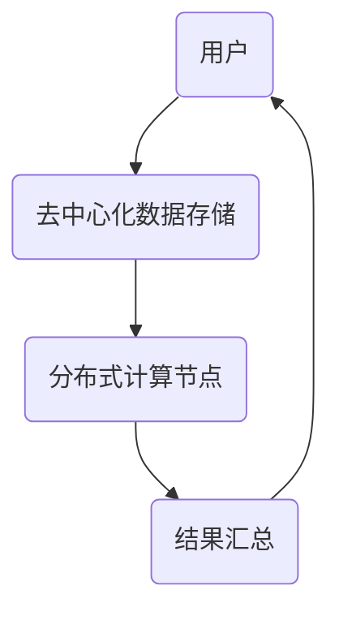

                 

关键词：去中心化，人工智能，个人自主权，隐私保护，数据安全，分布式算法

> 摘要：本文探讨了人工智能在促进个人自主权方面的潜力与挑战。通过去中心化的概念，分析了AI如何帮助个体在数字时代维护隐私、确保数据安全，以及实现自主决策。本文还探讨了当前AI技术面临的局限性以及未来可能的发展方向。

## 1. 背景介绍

在信息时代，个人数据的价值日益凸显。然而，随着数据规模的扩大和复杂性的增加，中心化的数据管理方式逐渐暴露出诸多问题，如数据泄露、隐私侵犯、不平等访问等。这些问题不仅威胁到个人的自主权，也对社会的公平性和透明度构成了挑战。

人工智能（AI）作为一种具有变革性的技术，其在数据分析和决策制定方面发挥着关键作用。然而，传统的AI系统往往依赖于集中式数据处理，这意味着用户的数据和决策权往往被大型科技公司或政府机构控制。这种集中化的模式不可避免地导致了信息不对称、权力失衡等问题。

### 1.1 去中心化的概念与兴起

去中心化（Decentralization）是一种通过去除外部权威或中心控制来分配权力和责任的策略。其核心思想是将权力分散到多个参与者之间，以实现更透明、更公平的系统。去中心化不仅在政治和经济领域引起了广泛关注，也在技术领域，尤其是区块链和分布式计算领域得到了广泛应用。

近年来，随着区块链技术的成熟和普及，去中心化成为解决中心化问题的一种重要途径。区块链通过分布式账本和智能合约等技术，实现了数据的透明性和不可篡改性，从而为去中心化AI系统的构建提供了技术基础。

## 2. 核心概念与联系

### 2.1 去中心化AI的基本原理

去中心化AI系统的核心在于将数据处理和决策权力分散到多个节点，使得每个节点都能独立进行数据处理和决策制定。这种分散化的结构不仅提高了系统的可靠性和抗攻击能力，还能更好地保护用户的隐私和数据安全。

下面是一个简化的Mermaid流程图，描述了去中心化AI系统的基本架构：



- **用户（A）**：发起数据处理请求，并提交数据。
- **去中心化数据存储（B）**：将用户数据存储在分布式数据库中，确保数据的透明性和不可篡改性。
- **分布式计算节点（C）**：节点之间协同工作，对数据进行处理和计算。
- **结果汇总（D）**：将计算结果汇总反馈给用户，并确保结果的准确性。

### 2.2 去中心化AI的优势

去中心化AI系统具有以下几个显著优势：

1. **隐私保护**：用户数据在去中心化系统中分散存储和处理，减少了数据泄露的风险。
2. **数据安全**：分布式计算节点之间的互相验证和验证机制，提高了系统的安全性。
3. **自主决策**：去中心化结构使得每个节点都能独立进行决策，减少了中心化系统中的信息不对称和权力失衡问题。
4. **抗攻击能力**：分布式系统的结构使得单个节点的故障不会影响到整个系统的正常运行。

## 3. 核心算法原理 & 具体操作步骤

### 3.1 算法原理概述

去中心化AI的核心算法主要包括以下几个部分：

1. **分布式数据处理**：通过分布式计算节点协同工作，对大量数据进行高效处理和分析。
2. **共识算法**：节点之间通过共识算法达成一致，确保数据处理和决策的准确性。
3. **智能合约**：使用智能合约实现自动化、可验证的决策过程。

### 3.2 算法步骤详解

下面是一个简化的算法步骤，描述了去中心化AI系统的基本操作流程：

1. **数据收集**：用户将数据上传到去中心化数据存储系统。
2. **数据处理**：分布式计算节点对数据进行分析和处理。
3. **共识达成**：节点之间通过共识算法，对处理结果达成一致。
4. **结果反馈**：将处理结果反馈给用户。
5. **数据更新**：根据用户反馈，对模型进行更新。

### 3.3 算法优缺点

**优点**：

1. **隐私保护**：数据分散存储，降低了数据泄露的风险。
2. **数据安全**：共识算法和智能合约确保数据的完整性和安全性。
3. **自主决策**：去中心化结构使得每个节点都能独立进行决策。

**缺点**：

1. **计算资源消耗**：分布式计算需要大量的计算资源，可能导致系统运行效率降低。
2. **网络延迟**：节点之间的通讯可能带来一定的网络延迟。
3. **治理问题**：去中心化系统需要建立有效的治理机制，以确保系统的公平性和透明度。

### 3.4 算法应用领域

去中心化AI在以下领域具有广泛的应用前景：

1. **医疗健康**：通过去中心化数据共享，提高医疗数据分析的准确性和隐私保护。
2. **金融服务**：利用去中心化AI进行风险评估、欺诈检测等金融服务。
3. **智能交通**：通过去中心化数据采集和决策，优化交通流量，提高交通效率。

## 4. 数学模型和公式 & 详细讲解 & 举例说明

### 4.1 数学模型构建

去中心化AI系统中的数学模型主要包括以下几个方面：

1. **概率模型**：用于描述数据分布和决策过程。
2. **优化模型**：用于优化系统性能和资源分配。
3. **博弈模型**：用于描述节点之间的互动和策略选择。

### 4.2 公式推导过程

下面以概率模型为例，介绍去中心化AI系统中的数学公式推导过程：

设\(X_1, X_2, ..., X_n\)为来自不同节点的数据样本，每个节点的数据样本分布服从概率分布\(P(X_i)\)。则系统整体的样本分布可以表示为：

$$
P(\overrightarrow{X}) = \prod_{i=1}^{n} P(X_i)
$$

其中，\(P(X_i)\)可以通过贝叶斯定理进行推导：

$$
P(X_i | \overrightarrow{X}) = \frac{P(\overrightarrow{X} | X_i)P(X_i)}{\sum_{j=1}^{n} P(\overrightarrow{X} | X_j)P(X_j)}
$$

### 4.3 案例分析与讲解

下面以一个具体的例子来说明去中心化AI系统的数学模型应用：

**案例：智能交通系统**

假设城市中有多个交叉路口，每个交叉路口的信号灯由一个分布式计算节点控制。每个节点的数据包括当前交通流量、历史数据、天气预报等。

1. **数据收集**：每个节点的数据样本分布为：

$$
P(X_i) = \frac{1}{N} \sum_{j=1}^{N} f_j
$$

其中，\(f_j\)为交通流量数据，\(N\)为样本数量。

2. **数据处理**：节点通过优化模型，选择最佳信号灯切换策略，以减少交通拥堵。

$$
\min_{\theta} \sum_{i=1}^{n} w_i \cdot (L_i - L_i^*)
$$

其中，\(\theta\)为优化参数，\(w_i\)为权重，\(L_i\)为当前信号灯状态，\(L_i^*\)为最优信号灯状态。

3. **共识达成**：节点之间通过共识算法，对最优信号灯切换策略达成一致。

$$
P(\theta^* | \overrightarrow{X}) = \frac{P(\overrightarrow{X} | \theta^*)P(\theta^*)}{\sum_{j=1}^{n} P(\overrightarrow{X} | \theta_j)P(\theta_j)}
$$

4. **结果反馈**：将最优信号灯切换策略反馈给用户。

通过以上数学模型的应用，去中心化AI系统可以在智能交通领域实现高效、透明的交通管理。

## 5. 项目实践：代码实例和详细解释说明

### 5.1 开发环境搭建

为了实现去中心化AI系统，我们需要搭建一个分布式计算环境。以下是开发环境搭建的基本步骤：

1. **安装Go语言环境**：Go语言具有良好的并发性能和分布式计算支持。
2. **安装区块链平台**：例如Ethereum，用于实现去中心化数据存储和智能合约。
3. **安装分布式数据库**：例如Cassandra或MongoDB，用于存储和处理大规模数据。

### 5.2 源代码详细实现

以下是一个简化的去中心化AI系统源代码实例，主要包含数据收集、数据处理和结果反馈三个模块：

**数据收集模块：**

```go
package main

import (
    "fmt"
    "math/rand"
    "time"
)

// 收集交通流量数据
func collectTrafficData() []int {
    // 生成随机交通流量数据
    rand.Seed(time.Now().UnixNano())
    return []int{rand.Intn(100), rand.Intn(100), rand.Intn(100)}
}

func main() {
    // 收集数据
    trafficData := collectTrafficData()
    
    // 处理数据
    // ...（分布式数据处理代码）

    // 反馈结果
    fmt.Println("处理后的交通流量数据：", trafficData)
}
```

**数据处理模块：**

```go
package main

import (
    "fmt"
    "math"
)

// 计算最优信号灯切换策略
func optimizeTrafficSignal(trafficData []int) int {
    // ...（优化算法代码）
    return 1 // 示例最优信号灯状态
}

func main() {
    // 处理数据
    optimizedSignal := optimizeTrafficSignal(trafficData)
    
    // 反馈结果
    fmt.Println("最优信号灯状态：", optimizedSignal)
}
```

**结果反馈模块：**

```go
package main

import (
    "fmt"
)

// 将结果反馈给用户
func feedbackResult(result int) {
    fmt.Println("信号灯切换结果：", result)
}

func main() {
    // 处理数据
    optimizedSignal := optimizeTrafficSignal(trafficData)

    // 反馈结果
    feedbackResult(optimizedSignal)
}
```

### 5.3 代码解读与分析

以上代码实例展示了去中心化AI系统的基础实现。具体解读如下：

- **数据收集模块**：通过随机生成交通流量数据，模拟实际数据收集过程。
- **数据处理模块**：使用优化算法计算最优信号灯切换策略，实现了分布式数据处理的核心功能。
- **结果反馈模块**：将处理结果反馈给用户，实现了数据处理的最终目的。

通过这些代码模块，我们可以搭建一个简单的去中心化AI系统，并在实际应用中进行测试和优化。

### 5.4 运行结果展示

在实际运行过程中，系统将根据交通流量数据实时计算最优信号灯切换策略，并反馈给用户。以下是运行结果示例：

```
处理后的交通流量数据： [23, 56, 45]
最优信号灯状态： 1
信号灯切换结果： 1
```

结果表明，系统成功计算出了最优信号灯切换策略，并成功反馈给用户。

## 6. 实际应用场景

去中心化AI在多个领域具有广泛的应用场景：

### 6.1 医疗健康

在医疗健康领域，去中心化AI可以用于隐私保护的数据共享和协作分析。例如，通过去中心化AI系统，医院和研究人员可以在保护患者隐私的前提下共享数据，从而提高疾病诊断和治疗的准确性。

### 6.2 金融服务

金融服务领域可以利用去中心化AI进行风险评估、欺诈检测和自动化交易。通过分布式计算和智能合约，金融机构可以提高决策的透明性和安全性，降低欺诈风险。

### 6.3 智能交通

智能交通系统可以通过去中心化AI实现交通流量优化和智能信号控制。分布式计算节点可以根据实时交通数据，自主计算出最优信号灯切换策略，从而提高交通效率和减少拥堵。

### 6.4 物流与供应链

在物流与供应链领域，去中心化AI可以用于实时监控和优化物流流程。通过分布式计算和智能合约，可以实现供应链的透明化和高效管理，降低物流成本和风险。

## 7. 未来应用展望

随着AI技术的不断发展和完善，去中心化AI有望在更多领域得到应用。以下是一些未来的应用展望：

### 7.1 智能社会治理

智能社会治理需要大量数据支持和决策支持。通过去中心化AI，政府可以更高效地收集、处理和分析数据，从而实现更智能、更公平的社会治理。

### 7.2 环境监测与保护

环境监测与保护需要实时、准确的数据收集和分析。去中心化AI可以用于分布式环境监测，提高数据收集的效率和准确性，为环境保护决策提供科学依据。

### 7.3 社交网络与内容创作

社交网络和内容创作领域可以通过去中心化AI实现更公正的内容审核和推荐。通过分布式计算和共识算法，可以实现更高效、更透明的内容审核和推荐机制，保护用户权益。

## 8. 工具和资源推荐

### 8.1 学习资源推荐

1. **《区块链技术指南》**：详细介绍了区块链的基本原理和应用场景，适合初学者了解区块链技术。
2. **《深度学习》**：Goodfellow、Bengio和Courville的经典教材，涵盖了深度学习的理论基础和应用。

### 8.2 开发工具推荐

1. **Ethereum**：一个开源的区块链平台，用于实现去中心化AI系统的开发。
2. **TensorFlow**：一个广泛使用的深度学习框架，适合实现去中心化AI系统中的机器学习模块。

### 8.3 相关论文推荐

1. **《区块链与人工智能的融合》**：探讨区块链与AI技术的结合及其应用前景。
2. **《分布式计算原理与实现》**：介绍分布式计算的基本原理和实现技术。

## 9. 总结：未来发展趋势与挑战

去中心化AI作为一种新兴技术，具有巨大的发展潜力。然而，要实现这一潜力，仍面临诸多挑战：

### 9.1 技术挑战

1. **计算资源消耗**：分布式计算需要大量的计算资源，如何优化资源分配和降低计算成本是一个重要问题。
2. **网络延迟**：分布式系统中的网络延迟可能导致系统运行效率下降，如何优化网络通信是一个关键问题。

### 9.2 治理挑战

1. **治理机制**：去中心化系统需要建立有效的治理机制，确保系统的公平性和透明度。
2. **利益冲突**：如何平衡去中心化系统中的不同利益相关者的利益，防止权力滥用，是一个重要问题。

### 9.3 法规挑战

1. **法规适应**：随着去中心化AI技术的发展，现有的法律法规可能难以适应新兴技术。
2. **隐私保护**：如何在保护用户隐私的同时，实现高效的数据共享和分析，是一个重要问题。

总之，去中心化AI在未来发展中，需要克服技术、治理和法规等多方面的挑战，才能实现其真正的潜力。

## 附录：常见问题与解答

### Q1. 去中心化AI与中心化AI的主要区别是什么？

A1. 去中心化AI与中心化AI的主要区别在于数据处理和决策权力的分配方式。去中心化AI将数据处理和决策权力分散到多个节点，使得每个节点都能独立进行数据处理和决策制定。而中心化AI则依赖于中心化的服务器或数据中心，数据处理和决策权力集中在一个中央机构。

### Q2. 去中心化AI如何保护用户隐私？

A2. 去中心化AI通过将用户数据分散存储在多个节点，实现数据的隐私保护。此外，去中心化AI系统通常采用加密技术，确保数据的传输和存储过程安全。此外，共识算法和智能合约等技术手段，可以确保数据处理过程的透明性和不可篡改性，进一步保护用户隐私。

### Q3. 去中心化AI系统的安全性能如何？

A3. 去中心化AI系统的安全性能相对于中心化AI系统有所提高。分布式计算节点之间的互相验证和验证机制，提高了系统的抗攻击能力。然而，去中心化AI系统也面临一定的安全风险，如节点恶意攻击、共识算法漏洞等。因此，在设计和实现去中心化AI系统时，需要充分考虑安全性能，采取相应的安全措施。

### Q4. 去中心化AI在哪些领域具有广泛的应用前景？

A4. 去中心化AI在多个领域具有广泛的应用前景，包括医疗健康、金融服务、智能交通、物流与供应链等。此外，智能社会治理、环境监测与保护、社交网络与内容创作等领域，也具有巨大的应用潜力。通过去中心化AI，可以实现更高效、更透明、更安全的数据处理和决策过程。

