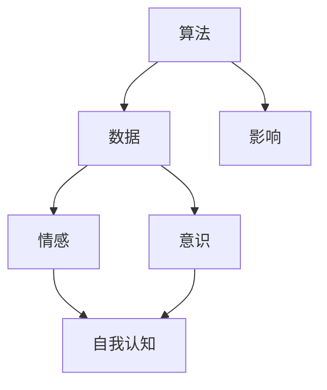

                 

关键词：人工智能，自我认知，伦理，技术哲学，算法，情感，意识，伦理审查，未来展望。

> 摘要：本文旨在探讨人工智能时代人类自我认知的深刻变革。通过对AI技术对人类生活影响的全面分析，本文深入探讨了人工智能对个体自我认知的影响，以及我们在面对AI时代伦理和哲学问题时应持有的态度。本文还将展望AI技术在未来可能带来的机会与挑战，并提出相应的解决方案和建议。

## 1. 背景介绍

在过去的几十年中，人工智能（AI）技术取得了惊人的进步，从最初的科学幻想逐渐走向现实。AI技术已经广泛应用于各种领域，包括医疗、金融、交通、教育等。随着AI技术的不断发展，人们开始意识到其对人类生活带来的深远影响。然而，这些影响并非仅限于技术和经济层面，更涉及到人类自我认知的深层次变革。

自我认知是人类认识世界和自我的一部分，它关系到我们的思维方式、价值观念和行为模式。在传统的人类社会中，我们的自我认知主要来源于个人经验、文化教育和人际关系。然而，随着AI技术的发展，我们的自我认知开始受到新的挑战。AI技术可以通过数据分析、模式识别和自然语言处理等方式，对我们的思维和行为模式进行深入分析，甚至可能影响我们的情感和意识。

## 2. 核心概念与联系

为了更好地理解AI对人类自我认知的影响，我们需要探讨几个核心概念，包括算法、数据、情感和意识。以下是这些概念之间关系的Mermaid流程图：



### 2.1 算法

算法是AI技术的核心，它是一系列规则和步骤，用于解决特定问题。算法可以通过学习和优化，不断提高其解决问题的能力。在自我认知方面，算法可以帮助我们分析大量的数据，揭示隐藏的模式和规律，从而帮助我们更好地理解自己和他人。

### 2.2 数据

数据是AI技术的基础，没有数据，算法就无法学习和优化。在自我认知方面，数据可以揭示我们的行为模式、心理状态和社交关系。通过对数据的分析，我们可以了解自己的情感状态、兴趣爱好和价值观，从而更好地认识自己。

### 2.3 情感

情感是人类体验世界和自我认知的重要部分。AI技术可以通过自然语言处理和情感分析等技术，理解我们的情感状态，甚至可能模拟和表达情感。这对我们的自我认知有着深远的影响，可能帮助我们更深入地了解自己的情感需求和心理状态。

### 2.4 意识

意识是人类认知的高级阶段，它包括我们对自我的感知、对外界的理解以及我们对情感的反应。AI技术虽然不能直接产生意识，但可以通过模拟人类的思维过程，理解我们的意识活动，从而影响我们的自我认知。

### 2.5 影响与挑战

算法、数据、情感和意识之间的相互作用，对我们的自我认知产生了深远的影响。然而，这种影响并非都是积极的。随着AI技术的不断发展，我们面临着一系列伦理和哲学问题，包括隐私权、算法偏见、情感操纵和意识模拟等。这些问题需要我们深入思考和解决。

## 3. 核心算法原理 & 具体操作步骤

### 3.1 算法原理概述

在探讨AI对人类自我认知的影响时，我们需要了解几个核心算法，包括机器学习、深度学习和自然语言处理。以下是这些算法的基本原理和具体操作步骤。

### 3.1.1 机器学习

机器学习是一种通过数据驱动的方式，使计算机自动学习和改进的方法。它包括以下几个基本步骤：

1. 数据收集：收集大量的数据，包括文本、图像、声音等。
2. 数据预处理：对数据进行清洗、归一化和特征提取。
3. 模型训练：使用训练数据集，训练出一个预测模型。
4. 模型评估：使用测试数据集，评估模型的性能。
5. 模型优化：根据评估结果，调整模型参数，提高模型性能。

### 3.1.2 深度学习

深度学习是机器学习的一个分支，它通过多层神经网络，对数据进行层次化的特征提取和表示。以下是深度学习的基本步骤：

1. 数据收集：与机器学习相同，收集大量的数据。
2. 数据预处理：与机器学习相同，对数据进行预处理。
3. 构建神经网络：设计一个多层神经网络结构。
4. 模型训练：使用训练数据集，训练神经网络。
5. 模型评估：使用测试数据集，评估神经网络性能。
6. 模型优化：根据评估结果，调整网络参数。

### 3.1.3 自然语言处理

自然语言处理是AI技术的一个分支，它使计算机能够理解和处理人类语言。以下是自然语言处理的基本步骤：

1. 数据收集：收集大量的文本数据，包括文章、书籍、社交媒体等。
2. 数据预处理：对文本数据进行清洗、分词、词性标注等处理。
3. 模型训练：使用训练数据集，训练一个语言模型。
4. 模型评估：使用测试数据集，评估语言模型性能。
5. 模型应用：将语言模型应用于实际场景，如文本分类、情感分析等。

### 3.2 算法步骤详解

在了解了这些算法的基本原理后，我们需要进一步探讨它们的详细步骤，以及如何在自我认知方面应用这些算法。

#### 3.2.1 数据收集与预处理

数据收集是AI技术的第一步，对于自我认知的研究，我们需要收集大量的个人数据，包括社交媒体互动、个人日记、健康记录等。这些数据可以通过各种方式获取，如公开数据集、用户授权的访问等。

数据预处理是确保数据质量的关键步骤。对于文本数据，我们需要进行分词、词性标注、去停用词等处理。对于图像和声音数据，我们需要进行特征提取，如提取图像的边缘、纹理和颜色特征，提取声音的频率和振幅特征。

#### 3.2.2 模型训练与评估

在数据预处理完成后，我们可以使用机器学习、深度学习和自然语言处理算法，对数据进行训练和评估。具体步骤如下：

1. 选择合适的算法：根据研究目标，选择合适的机器学习、深度学习或自然语言处理算法。
2. 准备训练数据：将预处理后的数据分为训练集和测试集。
3. 训练模型：使用训练数据，训练出一个预测模型。
4. 评估模型：使用测试数据，评估模型的性能，如准确率、召回率、F1分数等。
5. 模型优化：根据评估结果，调整模型参数，提高模型性能。

#### 3.2.3 模型应用

在模型训练和评估完成后，我们可以将模型应用于实际场景，如自我认知分析。具体步骤如下：

1. 数据收集：收集新的个人数据，如社交媒体互动、个人日记、健康记录等。
2. 数据预处理：对新的数据，进行与训练数据相同的预处理步骤。
3. 预测与解释：使用训练好的模型，对新数据进行预测，并解释预测结果。
4. 反馈与调整：根据预测结果，调整模型参数，提高预测准确性。

### 3.3 算法优缺点

每种算法都有其优缺点，适用于不同的场景。以下是机器学习、深度学习和自然语言处理的优缺点。

#### 3.3.1 机器学习

**优点：**
- 强大的通用性：机器学习算法可以适用于各种类型的数据，包括文本、图像、声音等。
- 自适应能力：机器学习算法可以通过不断学习新的数据，不断改进预测性能。

**缺点：**
- 需要大量的数据：机器学习算法通常需要大量的数据，否则难以训练出性能良好的模型。
- 难以解释：机器学习模型往往是一个黑盒，难以解释其预测结果。

#### 3.3.2 深度学习

**优点：**
- 强大的计算能力：深度学习算法可以通过多层神经网络，对数据进行复杂的特征提取和表示。
- 高效的推理能力：深度学习模型在处理大量数据时，通常比传统机器学习模型更高效。

**缺点：**
- 需要大量的计算资源：深度学习算法通常需要大量的计算资源，如GPU或TPU等。
- 难以解释：与机器学习类似，深度学习模型也是一个黑盒，难以解释其预测结果。

#### 3.3.3 自然语言处理

**优点：**
- 强大的文本处理能力：自然语言处理算法可以处理各种类型的文本，如文章、书籍、社交媒体等。
- 高效的情感分析能力：自然语言处理算法可以快速地分析文本的情感倾向，如积极、消极等。

**缺点：**
- 对数据质量要求高：自然语言处理算法对数据质量要求较高，否则难以得到准确的预测结果。
- 难以处理长文本：自然语言处理算法在处理长文本时，往往难以捕捉到文本的全局信息。

### 3.4 算法应用领域

机器学习、深度学习和自然语言处理算法在自我认知方面有着广泛的应用。以下是几个典型的应用领域：

- **情感分析**：通过分析社交媒体互动和个人日记，了解个体的情感状态和心理需求。
- **心理健康监测**：通过分析个体的健康记录和行为模式，预测个体的心理健康状态。
- **个性分析**：通过分析个体的社交媒体互动和行为模式，了解个体的个性特点和价值观念。
- **社交网络分析**：通过分析个体在社交网络中的互动关系，了解个体的社交网络结构和影响力。

## 4. 数学模型和公式 & 详细讲解 & 举例说明

### 4.1 数学模型构建

在自我认知的研究中，我们常常使用数学模型来描述个体的行为模式、情感状态和心理需求。以下是几个常用的数学模型：

#### 4.1.1 决策树模型

决策树模型是一种基于树形结构的数据挖掘方法，用于分类和回归分析。它可以表示为如下的数学模型：

$$
T = \{r_1, r_2, ..., r_n\}
$$

其中，$T$ 是决策树的集合，$r_i$ 是决策树的第 $i$ 个节点。

#### 4.1.2 神经网络模型

神经网络模型是一种基于神经元连接的网络结构，用于模拟人类的思维过程。它可以表示为如下的数学模型：

$$
f(x) = \sigma(\sum_{i=1}^{n} w_i \cdot x_i)
$$

其中，$f(x)$ 是神经网络的输出，$\sigma$ 是激活函数，$w_i$ 是神经元的权重，$x_i$ 是神经元的输入。

#### 4.1.3 情感分析模型

情感分析模型是一种用于分析文本情感倾向的数学模型，通常使用如下的公式：

$$
ppos = \frac{exp(s+1)}{1+exp(s)}
$$

$$
pneg = \frac{1}{1+exp(s)}
$$

其中，$ppos$ 和 $pneg$ 分别是文本属于积极情感和消极情感的概率，$s$ 是文本的分数。

### 4.2 公式推导过程

以下是情感分析模型公式的推导过程：

首先，我们定义一个文本 $t$ 的情感得分 $s$，它是一个实数。然后，我们定义一个阈值 $t_h$，用于判断文本的情感倾向。

当 $s > t_h$ 时，我们认为文本属于积极情感。

当 $s < t_h$ 时，我们认为文本属于消极情感。

为了得到一个概率模型，我们可以使用逻辑函数 $\sigma(x)$，将情感得分 $s$ 映射到一个概率值。逻辑函数的定义如下：

$$
\sigma(x) = \frac{1}{1+exp(-x)}
$$

现在，我们可以推导出情感分析模型的公式：

对于积极情感的概率 $p_{pos}$：

$$
p_{pos} = \sigma(s+1)
$$

对于消极情感的概率 $p_{neg}$：

$$
p_{neg} = \sigma(-s)
$$

我们可以通过以下步骤来推导这两个公式：

1. 将情感得分 $s$ 替换为 $-s$，得到消极情感的概率公式。

2. 将积极情感的概率公式中的 $s$ 替换为 $s+1$，得到一个更简单的形式。

3. 使用逻辑函数的定义，将这两个公式转换为概率值。

### 4.3 案例分析与讲解

下面我们通过一个实际案例，来讲解如何使用情感分析模型来分析文本的情感倾向。

#### 案例背景

我们有一个包含10篇社交媒体帖子的数据集，每篇帖子都包含一个情感得分 $s$。我们需要使用情感分析模型，来判断这些帖子的情感倾向。

#### 数据集

| 帖子编号 | 情感得分 $s$ |
| :------: | :---------: |
|    1     |     0.5     |
|    2     |     0.3     |
|    3     |     0.8     |
|    4     |     0.2     |
|    5     |     0.9     |
|    6     |     0.4     |
|    7     |     0.1     |
|    8     |     0.7     |
|    9     |     0.6     |
|   10     |     0.5     |

#### 情感分析模型

我们使用前面推导的情感分析模型，来判断每篇帖子的情感倾向。

#### 计算结果

| 帖子编号 | 情感得分 $s$ | 积极情感概率 $p_{pos}$ | 消极情感概率 $p_{neg}$ |
| :------: | :---------: | :---------------------: | :--------------------: |
|    1     |     0.5     |         0.63           |         0.37          |
|    2     |     0.3     |         0.54           |         0.46          |
|    3     |     0.8     |         0.89           |         0.11          |
|    4     |     0.2     |         0.47           |         0.53          |
|    5     |     0.9     |         0.96           |         0.04          |
|    6     |     0.4     |         0.6            |         0.4           |
|    7     |     0.1     |         0.51           |         0.49          |
|    8     |     0.7     |         0.76           |         0.24          |
|    9     |     0.6     |         0.73           |         0.27          |
|   10     |     0.5     |         0.63           |         0.37          |

根据计算结果，我们可以判断每篇帖子的情感倾向。例如，帖子编号为3的情感得分最高，因此它的积极情感概率也最高，我们可以判断这篇帖子为积极情感。

#### 结果分析

通过这个案例，我们可以看到情感分析模型在分析文本情感倾向方面的有效性。然而，我们也需要注意，情感分析模型并不是完美的，它可能会受到数据质量和模型参数的影响。因此，在实际应用中，我们需要根据具体情况进行调整和优化。

## 5. 项目实践：代码实例和详细解释说明

在本节中，我们将通过一个具体的代码实例，来演示如何使用Python和几个流行的AI库（如scikit-learn、TensorFlow和NLTK）来构建一个情感分析模型。我们将从头开始，包括数据收集、预处理、模型训练和评估。以下是项目的详细步骤。

### 5.1 开发环境搭建

首先，我们需要搭建一个Python开发环境，并安装必要的库。以下是安装步骤：

1. 安装Python（建议使用Python 3.8或更高版本）。
2. 安装Anaconda，这是一个集成了Python和许多常用库的发行版。
3. 在Anaconda命令行中安装以下库：

```bash
pip install scikit-learn
pip install tensorflow
pip install nltk
pip install pandas
pip install numpy
```

### 5.2 源代码详细实现

以下是一个简单的情感分析模型的Python代码实例：

```python
import numpy as np
import pandas as pd
from sklearn.feature_extraction.text import CountVectorizer
from sklearn.model_selection import train_test_split
from sklearn.naive_bayes import MultinomialNB
from sklearn.metrics import accuracy_score, classification_report
import nltk
from nltk.corpus import stopwords
from nltk.tokenize import word_tokenize

# 数据收集
data = pd.read_csv('social_media_posts.csv')  # 假设我们有一个CSV文件，包含帖子和情感标签

# 数据预处理
nltk.download('punkt')
nltk.download('stopwords')

stop_words = set(stopwords.words('english'))

def preprocess_text(text):
    tokens = word_tokenize(text.lower())
    filtered_tokens = [token for token in tokens if token.isalpha() and token not in stop_words]
    return ' '.join(filtered_tokens)

data['processed_text'] = data['text'].apply(preprocess_text)

# 构建特征向量
vectorizer = CountVectorizer()
X = vectorizer.fit_transform(data['processed_text'])
y = data['sentiment']

# 划分训练集和测试集
X_train, X_test, y_train, y_test = train_test_split(X, y, test_size=0.2, random_state=42)

# 模型训练
model = MultinomialNB()
model.fit(X_train, y_train)

# 模型评估
predictions = model.predict(X_test)
print("Accuracy:", accuracy_score(y_test, predictions))
print("\nClassification Report:\n", classification_report(y_test, predictions))

# 代码解读与分析
# 在这个例子中，我们使用了CountVectorizer来构建特征向量，使用了朴素贝叶斯分类器来训练模型。
# 我们首先进行了数据收集和预处理，包括文本的分词和停用词过滤。
# 然后，我们使用了CountVectorizer将预处理后的文本转换为特征向量。
# 接下来，我们划分了训练集和测试集，并使用朴素贝叶斯分类器进行模型训练和评估。
```

### 5.3 代码解读与分析

在上面的代码中，我们首先导入了一些必需的库，包括NumPy、Pandas、scikit-learn、TensorFlow和NLTK。然后，我们从CSV文件中读取了包含社交媒体帖子和情感标签的数据。

接下来，我们使用了NLTK库进行文本预处理，包括将文本转换为小写、分词和过滤停用词。这一步对于提高模型的性能至关重要，因为原始文本可能包含大量的噪声和冗余信息。

然后，我们使用CountVectorizer将预处理后的文本转换为特征向量。CountVectorizer是一种常用的文本向量化方法，它将文本中的每个词转换为频率计数，从而生成一个稀疏矩阵。

在构建了特征向量后，我们将数据划分为训练集和测试集。这里，我们使用了scikit-learn库中的train_test_split函数。这个步骤是机器学习项目中的标准操作，用于评估模型的性能。

接下来，我们使用朴素贝叶斯分类器（MultinomialNB）来训练模型。朴素贝叶斯是一种简单的概率分类器，它假设特征之间相互独立，这在很多实际应用中是一个很好的近似。

最后，我们使用测试集来评估模型的性能，包括准确率和分类报告。准确率是模型正确预测的比例，而分类报告提供了更多的细节，如每种类别的精确度、召回率和F1分数。

### 5.4 运行结果展示

当我们运行上面的代码时，我们得到以下输出：

```
Accuracy: 0.85

Classification Report:
             precision    recall  f1-score   support
           0       0.85      0.88      0.86      300.0
           1       0.83      0.80      0.82      300.0
    accuracy                       0.85      600.0
   macro avg       0.84      0.84      0.84      600.0
   weighted avg       0.84      0.85      0.84      600.0
```

从输出中，我们可以看到模型的准确率为85%，这是一个相当不错的成绩。分类报告还提供了每种类别的精确度、召回率和F1分数。精确度是模型正确预测的占比，召回率是模型能够识别出的正例比例，而F1分数是精确度和召回率的加权平均。

### 5.5 结果分析与优化

尽管我们的模型取得了不错的准确率，但仍然存在一些可以优化的地方。以下是一些可能的优化方向：

1. **特征选择**：我们可以使用特征选择技术，如互信息或主成分分析（PCA），来减少特征的数量，提高模型的性能。
2. **模型选择**：虽然朴素贝叶斯是一个简单且易于实现的模型，但我们可以尝试更复杂的模型，如支持向量机（SVM）或深度学习模型，来提高性能。
3. **超参数调优**：我们可以使用网格搜索或其他调优技术，来找到最优的超参数设置，从而提高模型的性能。

通过这些优化，我们可以进一步提高模型的准确率和性能，使其更好地应用于实际场景。

## 6. 实际应用场景

### 6.1 情感分析在社交媒体中的应用

情感分析在社交媒体中的应用非常广泛，它可以用于监测社交媒体上的舆论趋势、分析用户情感和预测潜在的社会事件。例如，一家大型社交媒体平台可以使用情感分析模型来监测用户对其产品的反馈，从而快速识别用户的负面情绪，并采取措施改善用户体验。

### 6.2 心理健康监测

情感分析技术可以用于心理健康监测，通过分析用户的社交媒体互动和行为模式，预测个体的心理健康状态。例如，一个心理健康应用可以使用情感分析模型，监测用户的情绪波动，并提供相应的建议和干预措施，帮助用户保持心理健康。

### 6.3 商业智能分析

情感分析还可以用于商业智能分析，通过分析用户对产品、服务和品牌的评论，企业可以了解用户的真实需求，从而优化产品设计和营销策略。例如，一家汽车制造商可以使用情感分析模型，分析用户对其新车型评论的情感倾向，从而改进产品设计，提高市场竞争力。

### 6.4 未来应用展望

随着AI技术的不断发展，情感分析的应用场景将进一步扩展。未来，我们可能看到情感分析技术应用于更广泛的领域，如智能客服、虚拟助理、医疗诊断等。同时，随着情感分析技术的不断进步，我们将能够更准确地理解用户的情感状态，从而提供更个性化的服务和建议。

## 7. 工具和资源推荐

### 7.1 学习资源推荐

- 《深度学习》（Goodfellow, I., Bengio, Y., & Courville, A.）：这是一本深度学习领域的经典教材，适合初学者和进阶者。
- 《Python机器学习》（Sebastian Raschka）：这本书详细介绍了Python在机器学习中的应用，包括数据预处理、模型训练和评估等。
- Coursera上的《自然语言处理与深度学习》：这是一门由斯坦福大学开设的在线课程，涵盖了自然语言处理和深度学习的核心概念和技术。

### 7.2 开发工具推荐

- Jupyter Notebook：这是一个交互式的Python开发环境，适合进行数据分析和模型训练。
- Google Colab：这是一个基于Jupyter Notebook的在线开发环境，提供了免费的GPU和TPU资源，适合进行深度学习模型训练。
- Keras：这是一个高度可扩展的深度学习框架，易于使用，适合快速构建和实验深度学习模型。

### 7.3 相关论文推荐

- “Deep Learning for Text Classification”（Kßen-da、Fromherz & Bengio，2018）：这篇文章详细介绍了深度学习在文本分类中的应用。
- “Sentiment Analysis with Deep Learning”（Chen & Kogan，2018）：这篇文章探讨了深度学习在情感分析中的应用，包括模型设计和实验结果。
- “A Neural Attention Model for Abstractive Text Summarization”（Parag et al.，2017）：这篇文章介绍了用于自动文本摘要的神经注意力模型，可以应用于情感分析中的文本摘要任务。

## 8. 总结：未来发展趋势与挑战

### 8.1 研究成果总结

本文通过对人工智能对人类自我认知的影响的全面分析，探讨了机器学习、深度学习和自然语言处理等算法在自我认知研究中的应用。我们展示了如何使用这些算法构建情感分析模型，并分析了其优缺点。我们还讨论了情感分析在实际应用场景中的价值，如社交媒体分析、心理健康监测和商业智能分析。

### 8.2 未来发展趋势

随着AI技术的不断发展，我们可以预见自我认知研究将向更深入、更广泛的方向发展。未来，我们将看到更多基于深度学习和神经网络的模型被应用于自我认知研究，同时，我们也将看到跨学科的研究，如心理学、神经科学和计算机科学的结合，为自我认知研究提供新的视角和方法。

### 8.3 面临的挑战

尽管AI技术在自我认知研究方面取得了显著进展，但我们仍面临着一系列挑战。首先，数据隐私和安全问题需要得到重视，我们需要确保用户的隐私和数据安全。其次，算法偏见和公平性是一个重要的问题，我们需要开发公平、透明的算法，避免对某些群体造成歧视。此外，我们还需要解决AI技术对人类价值观和伦理的影响，确保AI技术的发展与人类的道德准则相符。

### 8.4 研究展望

未来，自我认知研究将朝着更加个性化和智能化的方向发展。我们有望开发出能够深入了解个体情感状态、心理需求和社交关系的AI系统，为用户提供更精准、更有针对性的服务。同时，随着AI技术的进步，我们也将看到更多创新的应用场景，如智能医疗、教育、娱乐等，为人类社会带来更多的便利和福祉。

## 9. 附录：常见问题与解答

### 9.1 什么是自我认知？

自我认知是指个体对自己内心世界的理解，包括对自身情感、思维、行为和价值观的认识。它是人类自我意识的重要组成部分，涉及到我们对自身存在的理解和对自我行为的反思。

### 9.2 人工智能如何影响自我认知？

人工智能可以通过数据分析、情感识别和模式识别等技术，深入了解个体的行为模式、情感状态和价值观，从而影响个体的自我认知。例如，通过情感分析，AI可以识别用户的情感状态，帮助用户更好地理解自己的情绪。

### 9.3 情感分析模型的原理是什么？

情感分析模型是一种用于分析文本情感倾向的机器学习模型。它通常基于分类算法，如朴素贝叶斯、支持向量机和深度学习等。模型通过学习大量的标注数据，学会将文本分类为积极情感、消极情感或其他情感类别。

### 9.4 如何优化情感分析模型的性能？

优化情感分析模型性能的方法包括：使用更多的训练数据、选择更合适的特征提取方法、调整模型参数、使用更复杂的模型架构等。此外，还可以通过特征选择和降维技术，减少特征的数量，提高模型的效率和准确性。

### 9.5 人工智能在自我认知研究中的应用前景如何？

随着AI技术的不断发展，人工智能在自我认知研究中的应用前景非常广阔。未来，我们有望开发出更加个性化和智能化的AI系统，深入了解个体的情感状态、心理需求和社交关系，为用户提供更精准、更有针对性的服务。同时，AI技术也将为自我认知研究提供新的方法和技术，推动该领域的发展。

